+++
title = "27 - 网内计算技术详解"
description = "In-Network Computing 原理、架构与应用：让网络设备参与计算"
date = 2025-02-07
updated = 2025-02-07
draft = false
[taxonomies]
tags = ["网内计算", "In-Network", "可编程交换机", "P4", "SHARP", "AI", "HPC"]
[extra]
toc = true
comments = true
+++

## 一、网内计算概述

### 1.1 什么是网内计算

网内计算（In-Network Computing）是指在数据传输过程中，由网络设备（交换机、网卡）直接执行计算操作，而不是将所有数据传输到终端节点再处理。

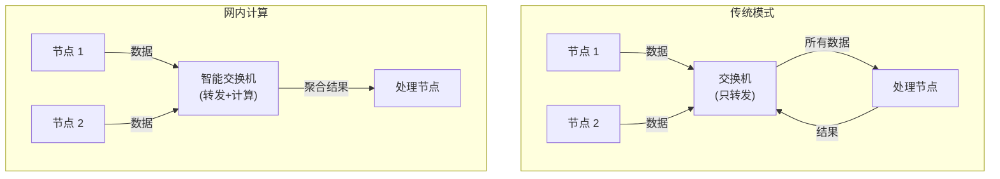

### 1.2 核心优势

| 优势 | 说明 |
|------|------|
| **减少流量** | 网内聚合，减少传输数据量 |
| **降低延迟** | 减少端到端往返 |
| **提高吞吐** | 网络带宽更高效利用 |
| **节省能耗** | 减少终端计算负载 |

### 1.3 典型应用场景

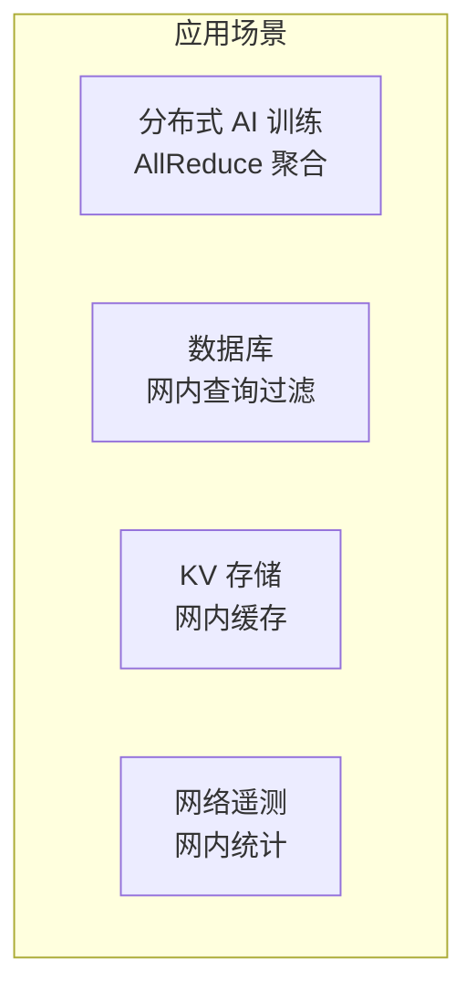

---

## 二、技术基础

### 2.1 可编程交换芯片

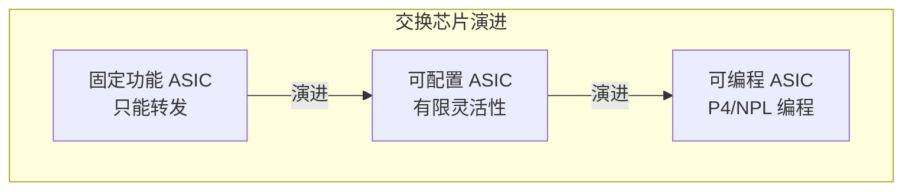

**主要可编程交换芯片**：

| 厂商 | 芯片 | 特点 |
|------|------|------|
| **Intel** | Tofino 1/2/3 | P4 可编程 |
| **NVIDIA** | Spectrum | 可配置 |
| **Broadcom** | Memory Table | 可配置 |
| **AMD** | Pensando | FPGA + ASIC |

### 2.2 P4 编程语言

P4（Programming Protocol-Independent Packet Processors）是数据平面编程语言。

```p4
// P4 简单示例：网内聚合
header ethernet_t {
    bit<48> dstAddr;
    bit<48> srcAddr;
    bit<16> etherType;
}

header aggregate_t {
    bit<32> value;
    bit<16> count;
}

parser MyParser(packet_in pkt, out headers hdr) {
    state start {
        pkt.extract(hdr.ethernet);
        transition select(hdr.ethernet.etherType) {
            0x88B5: parse_aggregate;
            default: accept;
        }
    }
    
    state parse_aggregate {
        pkt.extract(hdr.aggregate);
        transition accept;
    }
}

control MyIngress(inout headers hdr, ...) {
    register<bit<32>>(1024) sum_register;
    register<bit<16>>(1024) count_register;
    
    action aggregate() {
        bit<32> current_sum;
        bit<16> current_count;
        
        sum_register.read(current_sum, 0);
        count_register.read(current_count, 0);
        
        // 累加
        current_sum = current_sum + hdr.aggregate.value;
        current_count = current_count + 1;
        
        sum_register.write(0, current_sum);
        count_register.write(0, current_count);
        
        // 更新包头
        hdr.aggregate.value = current_sum;
        hdr.aggregate.count = current_count;
    }
    
    apply {
        if (hdr.aggregate.isValid()) {
            aggregate();
        }
    }
}
```

---

## 三、NVIDIA SHARP

### 3.1 SHARP 概述

SHARP（Scalable Hierarchical Aggregation and Reduction Protocol）是 NVIDIA 的网内计算技术，专为 AI/HPC 集合通信优化。

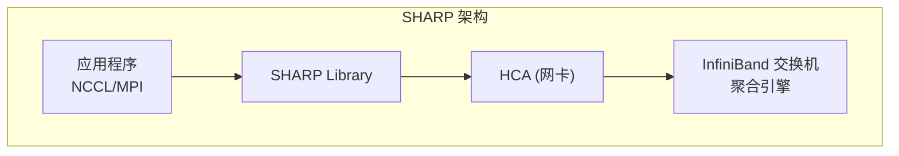

### 3.2 AllReduce 优化

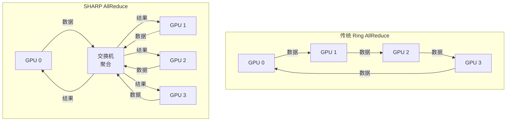

**性能对比**：

| 模式 | 延迟 | 带宽利用 |
|------|------|----------|
| Ring AllReduce | O(N) | 中等 |
| Tree AllReduce | O(log N) | 中等 |
| **SHARP** | O(1) | 高 |

### 3.3 SHARP 配置

```bash
# 启用 SHARP
export NCCL_COLLNET_ENABLE=1
export NCCL_NET_SHARED_COMMS=1

# 运行 AI 训练
mpirun -np 8 python train.py
```

### 3.4 SHARP 支持的操作

| 操作 | 数据类型 |
|------|----------|
| SUM | FP16, FP32, FP64, INT32 |
| MIN/MAX | FP16, FP32, FP64, INT32 |
| BAND/BOR/BXOR | INT32, INT64 |
| Barrier | - |

---

## 四、网内缓存

### 4.1 NetCache

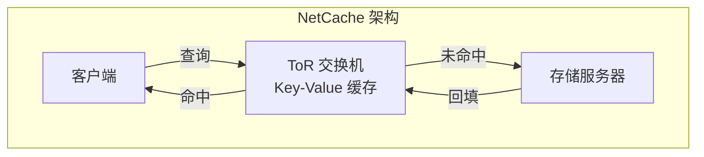

### 4.2 P4 实现 KV 缓存

```p4
// 简化的 KV 缓存实现
header kv_request_t {
    bit<8>  op;        // GET=0, PUT=1
    bit<32> key;
    bit<32> value;
}

control KVCache(inout headers hdr, ...) {
    register<bit<32>>(65536) cache_values;
    register<bit<1>>(65536) cache_valid;
    
    action lookup() {
        bit<1> valid;
        bit<32> value;
        bit<16> index = (bit<16>)hdr.kv.key[15:0];
        
        cache_valid.read(valid, index);
        cache_values.read(value, index);
        
        if (valid == 1) {
            // 缓存命中，直接返回
            hdr.kv.value = value;
            // 反转源目的，返回客户端
            standard_metadata.egress_spec = standard_metadata.ingress_port;
        }
        // 缓存未命中，继续转发到服务器
    }
    
    action insert() {
        bit<16> index = (bit<16>)hdr.kv.key[15:0];
        cache_values.write(index, hdr.kv.value);
        cache_valid.write(index, 1);
    }
    
    apply {
        if (hdr.kv.op == 0) {  // GET
            lookup();
        } else {  // PUT
            insert();
        }
    }
}
```

---

## 五、网内查询处理

### 5.1 数据库查询卸载

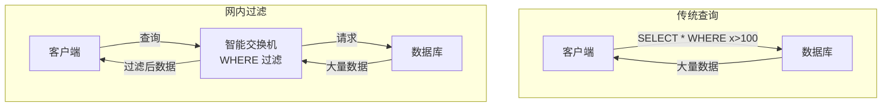

### 5.2 网内聚合

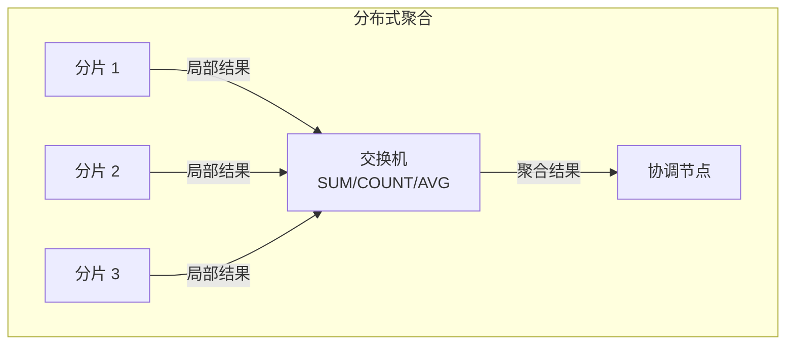

---

## 六、网络遥测

### 6.1 INT（In-band Network Telemetry）

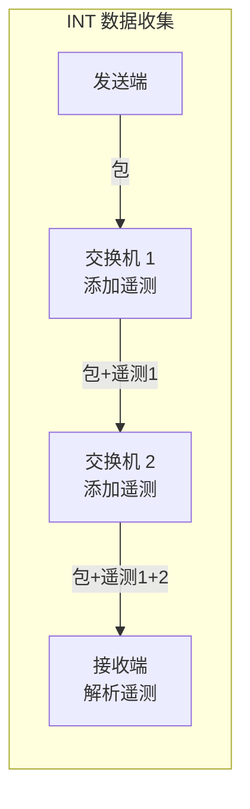

### 6.2 INT 数据内容

| 字段 | 含义 |
|------|------|
| Switch ID | 交换机标识 |
| Ingress Port | 入端口 |
| Egress Port | 出端口 |
| Queue Depth | 队列深度 |
| Timestamp | 时间戳 |
| Latency | 处理延迟 |

### 6.3 P4 INT 实现

```p4
header int_metadata_t {
    bit<32> switch_id;
    bit<16> ingress_port;
    bit<16> egress_port;
    bit<24> queue_depth;
    bit<48> timestamp;
}

control AddINTMetadata(inout headers hdr, ...) {
    action add_int() {
        hdr.int_meta.setValid();
        hdr.int_meta.switch_id = SWITCH_ID;
        hdr.int_meta.ingress_port = standard_metadata.ingress_port;
        hdr.int_meta.egress_port = standard_metadata.egress_spec;
        hdr.int_meta.queue_depth = standard_metadata.deq_qdepth;
        hdr.int_meta.timestamp = standard_metadata.ingress_global_timestamp;
    }
    
    apply {
        if (hdr.int_header.isValid()) {
            add_int();
        }
    }
}
```

---

## 七、AI 训练加速

### 7.1 梯度聚合优化

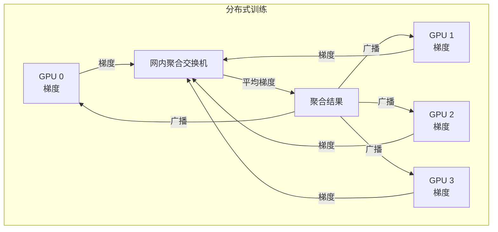

### 7.2 稀疏梯度处理

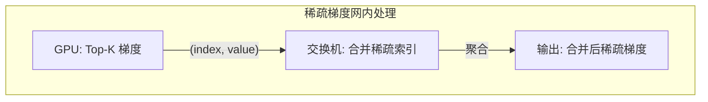

### 7.3 与 NCCL 集成

```cpp
// 使用 SHARP 的 NCCL 配置
ncclConfig_t config = NCCL_CONFIG_INITIALIZER;
config.collNetEnable = 1;  // 启用网内计算

ncclCommInitRankConfig(&comm, nRanks, id, myRank, &config);

// AllReduce 自动使用 SHARP
ncclAllReduce(sendbuff, recvbuff, count, ncclFloat, ncclSum, comm, stream);
```

---

## 八、实现挑战

### 8.1 资源限制

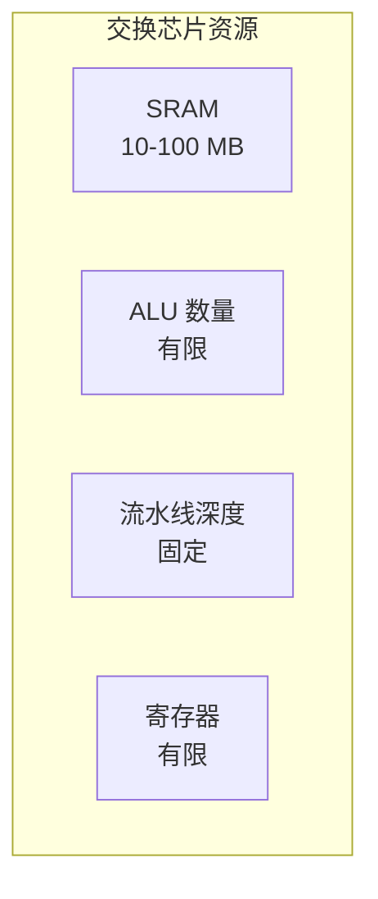

| 资源 | 限制 | 影响 |
|------|------|------|
| 内存 | 几十 MB | 缓存大小有限 |
| 计算 | 简单操作 | 复杂算法困难 |
| 状态 | 寄存器有限 | 连接追踪受限 |

### 8.2 设计权衡

| 权衡点 | 考虑因素 |
|--------|----------|
| 功能 vs 性能 | 复杂功能可能降低吞吐 |
| 灵活性 vs 效率 | 通用设计可能效率低 |
| 一致性 vs 延迟 | 强一致性增加延迟 |

### 8.3 编程复杂性

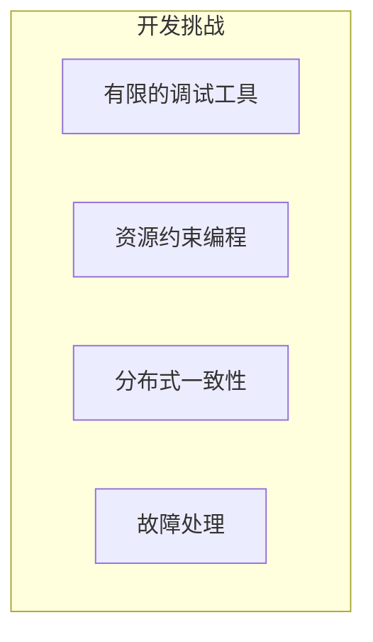

---

## 九、生态与工具

### 9.1 开发工具

| 工具 | 用途 |
|------|------|
| **P4 Studio** | Intel Tofino 开发 |
| **BMv2** | P4 软件交换机 |
| **P4C** | P4 编译器 |
| **PTF** | 数据平面测试 |

### 9.2 开源项目

| 项目 | 描述 |
|------|------|
| **SwitchML** | 网内 ML 聚合 |
| **NetCache** | 网内 KV 缓存 |
| **Poise** | 网内共识 |
| **IncBricks** | 网内存储 |

---

## 十、未来展望

### 10.1 技术趋势

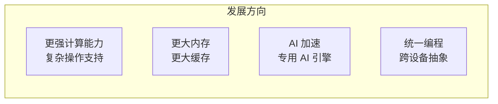

### 10.2 应用扩展

| 领域 | 应用方向 |
|------|----------|
| **AI** | 更复杂的聚合操作 |
| **数据库** | 更多查询下推 |
| **安全** | 网内检测和防护 |
| **边缘** | 边缘计算加速 |

---

## 相关文章

- [24 - DPU 与智能网卡技术详解](/articles/networking/net-24-DPU与智能网卡技术详解/)
- [21 - RDMA 与 InfiniBand 详解](/articles/networking/net-21-RDMA与InfiniBand详解/)
- [hpc-04 - GPU 集群通信技术](/articles/hpc/hpc-04-GPU集群通信技术/)
- [hpc-05 - 分布式训练技术详解](/articles/hpc/hpc-05-分布式训练技术详解/)
