+++
title = "28 - 协议卸载与硬件加速"
description = "网络协议卸载技术深度解析：从校验和到完整协议栈的硬件加速"
date = 2025-02-07
updated = 2025-02-07
draft = false
[taxonomies]
tags = ["网络", "卸载", "硬件加速", "TSO", "LRO", "RDMA", "网卡"]
[extra]
toc = true
comments = true
+++

## 一、协议卸载概述

### 1.1 什么是协议卸载

协议卸载（Offload）是指将原本由 CPU 执行的网络协议处理任务，转移到网卡等硬件设备上执行，从而释放 CPU 资源并提高网络性能。

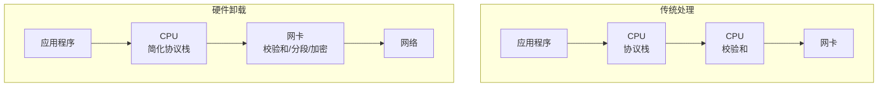

### 1.2 卸载层次

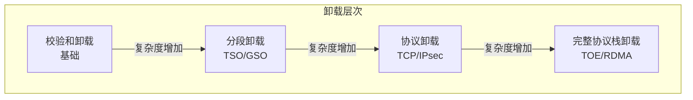

### 1.3 卸载收益

| 卸载类型 | CPU 节省 | 吞吐提升 | 延迟影响 |
|----------|----------|----------|----------|
| 校验和 | 5-10% | 小 | 无影响 |
| TSO/LRO | 20-30% | 中等 | 略增加 |
| 加密 | 30-50% | 大 | 略增加 |
| 完整协议栈 | 80-90% | 很大 | 显著降低 |

---

## 二、校验和卸载

### 2.1 IP/TCP/UDP 校验和

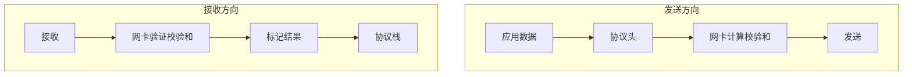

### 2.2 配置方式

```bash
# 查看卸载状态
ethtool -k eth0 | grep checksum
#   rx-checksumming: on
#   tx-checksumming: on
#     tx-checksum-ipv4: on
#     tx-checksum-ipv6: on
#     tx-checksum-tcp: on
#     tx-checksum-udp: on

# 启用/禁用
ethtool -K eth0 rx on tx on
```

### 2.3 编程接口

```c
// 发送时设置卸载标志
mbuf->ol_flags |= PKT_TX_IP_CKSUM | PKT_TX_TCP_CKSUM;

// 设置 L2/L3 长度（网卡需要知道头部位置）
mbuf->l2_len = sizeof(struct rte_ether_hdr);
mbuf->l3_len = sizeof(struct rte_ipv4_hdr);

// 接收时检查结果
if (mbuf->ol_flags & PKT_RX_IP_CKSUM_GOOD) {
    // IP 校验和正确
}
if (mbuf->ol_flags & PKT_RX_L4_CKSUM_GOOD) {
    // TCP/UDP 校验和正确
}
```

---

## 三、分段卸载

### 3.1 TSO（TCP Segmentation Offload）

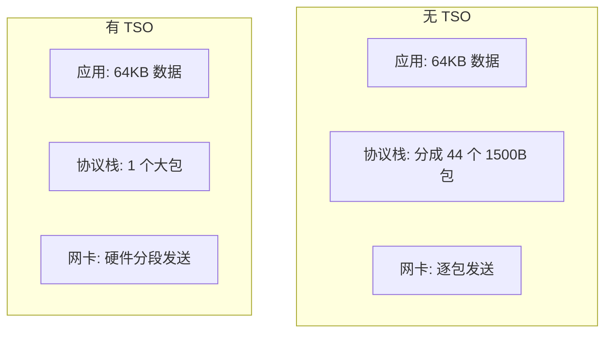

**TSO 收益**：

| 指标 | 无 TSO | 有 TSO |
|------|--------|--------|
| 协议栈处理 | 44 次 | 1 次 |
| 中断次数 | 多 | 少 |
| CPU 占用 | 高 | 低 |

### 3.2 GSO（Generic Segmentation Offload）

GSO 是软件实现的分段卸载，在硬件不支持 TSO 时使用：

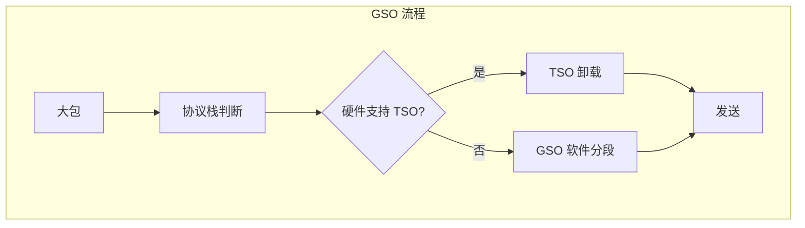

### 3.3 LRO（Large Receive Offload）

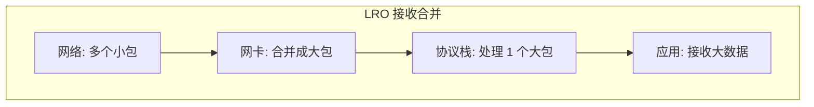

### 3.4 GRO（Generic Receive Offload）

GRO 是软件实现的接收合并：

```c
// 内核 GRO 处理
static int napi_gro_receive(struct napi_struct *napi, struct sk_buff *skb) {
    // 尝试合并到现有流
    struct sk_buff *p = napi_frags_skb(napi);
    
    // 查找可合并的包
    list_for_each_entry(p, &napi->gro_list, list) {
        if (can_merge(p, skb)) {
            merge_skb(p, skb);
            return GRO_MERGED;
        }
    }
    
    // 无法合并，添加到列表
    list_add(&skb->list, &napi->gro_list);
    return GRO_HELD;
}
```

---

## 四、加密卸载

### 4.1 IPsec 卸载

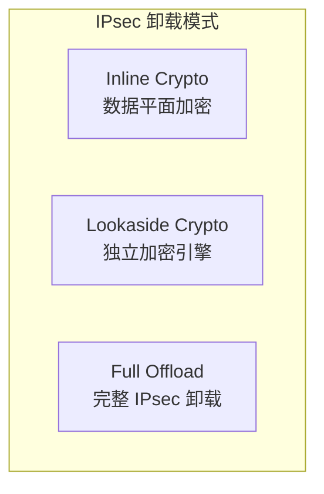

### 4.2 Inline Crypto

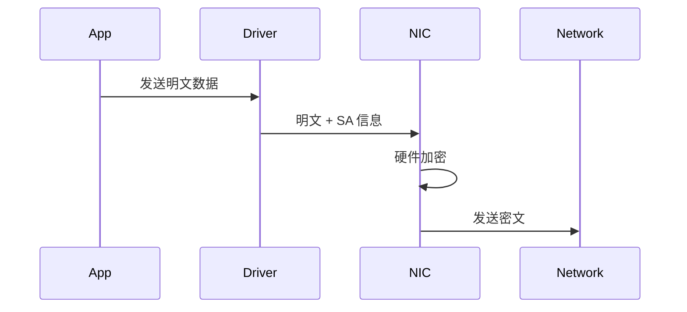

### 4.3 配置示例

```bash
# 使用 xfrm 配置 IPsec 卸载
ip xfrm state add src 192.168.1.1 dst 192.168.1.2 \
    proto esp spi 0x12345678 mode transport \
    auth sha256 0x... enc aes 0x... \
    offload dev eth0 dir out

# 查看卸载状态
ip xfrm state show
```

### 4.4 TLS 卸载

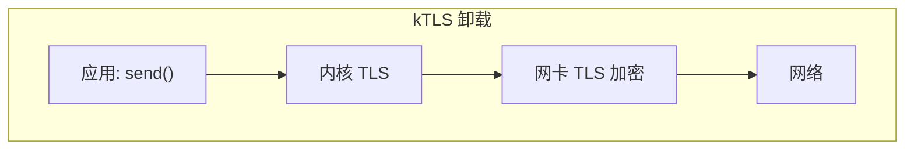

```c
// 配置 kTLS 卸载
struct tls12_crypto_info_aes_gcm_128 crypto_info;
crypto_info.info.version = TLS_1_2_VERSION;
crypto_info.info.cipher_type = TLS_CIPHER_AES_GCM_128;
memcpy(crypto_info.key, key, TLS_CIPHER_AES_GCM_128_KEY_SIZE);
// ... 设置 IV, salt, rec_seq

setsockopt(fd, SOL_TLS, TLS_TX, &crypto_info, sizeof(crypto_info));
```

---

## 五、RDMA 卸载

### 5.1 RDMA 概念

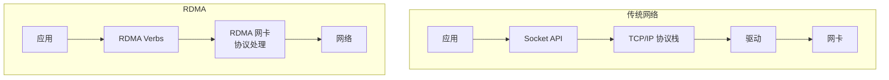

### 5.2 RDMA 操作

| 操作 | 描述 |
|------|------|
| **SEND/RECV** | 双边操作，需要远端配合 |
| **RDMA Write** | 单边写，直接写入远端内存 |
| **RDMA Read** | 单边读，直接读取远端内存 |
| **Atomic** | 原子操作（CAS, FAA） |

### 5.3 RDMA 编程

```c
#include <infiniband/verbs.h>

// 1. 打开设备
struct ibv_device **dev_list = ibv_get_device_list(NULL);
struct ibv_context *ctx = ibv_open_device(dev_list[0]);

// 2. 创建保护域
struct ibv_pd *pd = ibv_alloc_pd(ctx);

// 3. 注册内存
struct ibv_mr *mr = ibv_reg_mr(pd, buffer, size,
    IBV_ACCESS_LOCAL_WRITE | IBV_ACCESS_REMOTE_WRITE);

// 4. 创建完成队列
struct ibv_cq *cq = ibv_create_cq(ctx, 100, NULL, NULL, 0);

// 5. 创建队列对
struct ibv_qp_init_attr qp_init_attr = {
    .send_cq = cq,
    .recv_cq = cq,
    .cap = {
        .max_send_wr = 100,
        .max_recv_wr = 100,
        .max_send_sge = 1,
        .max_recv_sge = 1,
    },
    .qp_type = IBV_QPT_RC,
};
struct ibv_qp *qp = ibv_create_qp(pd, &qp_init_attr);

// 6. RDMA Write
struct ibv_send_wr wr = {
    .wr_id = 1,
    .opcode = IBV_WR_RDMA_WRITE,
    .send_flags = IBV_SEND_SIGNALED,
    .wr.rdma = {
        .remote_addr = remote_addr,
        .rkey = remote_rkey,
    },
    .sg_list = &sge,
    .num_sge = 1,
};
ibv_post_send(qp, &wr, &bad_wr);
```

---

## 六、TOE（TCP Offload Engine）

### 6.1 TOE 概念

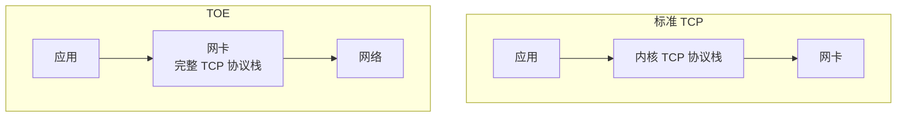

### 6.2 TOE 现状

| 优点 | 缺点 |
|------|------|
| 极低 CPU 占用 | 兼容性问题 |
| 高性能 | 调试困难 |
| 低延迟 | Linux 支持有限 |

**注意**：Linux 主线内核已移除 TOE 支持，RDMA 成为主流替代方案。

---

## 七、网卡高级功能

### 7.1 RSS（Receive Side Scaling）

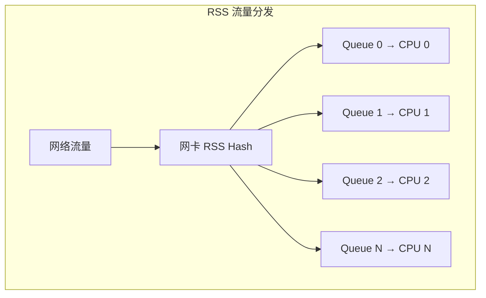

```bash
# 配置 RSS
ethtool -L eth0 combined 8  # 8 个队列

# 查看 RSS 配置
ethtool -x eth0
```

### 7.2 Flow Director

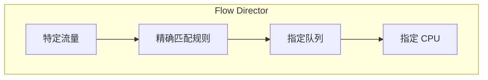

```bash
# 添加 Flow Director 规则
ethtool -N eth0 flow-type tcp4 \
    src-ip 192.168.1.100 dst-port 8080 \
    action 2  # 发送到队列 2
```

### 7.3 VXLAN/Geneve 卸载

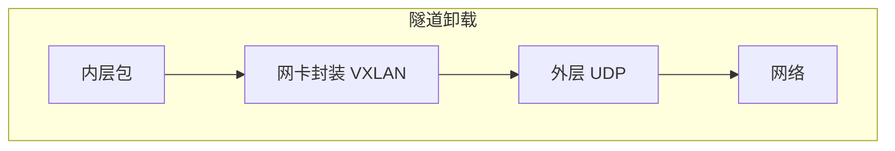

```bash
# 查看隧道卸载支持
ethtool -k eth0 | grep -E "(vxlan|geneve)"
#   tx-udp_tnl-segmentation: on
#   tx-udp_tnl-csum-segmentation: on
```

---

## 八、Intel 加速技术

### 8.1 IOAT（I/O Acceleration Technology）

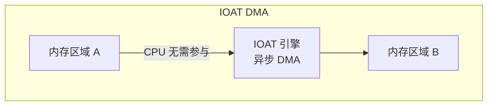

### 8.2 QAT（QuickAssist Technology）

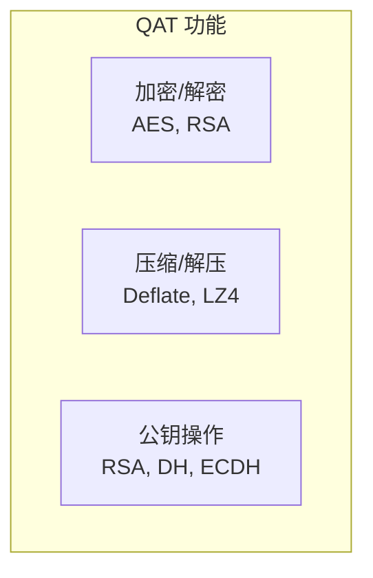

```c
// QAT 使用示例
#include <qat/cpa.h>

// 初始化
CpaStatus status = cpaCyStartInstance(instanceHandle);

// 配置加密操作
CpaCySymOpData opData = {
    .sessionCtx = sessionCtx,
    .packetType = CPA_CY_SYM_PACKET_TYPE_FULL,
    .pIv = iv,
    .ivLenInBytes = 16,
};

// 执行加密
status = cpaCySymPerformOp(
    instanceHandle,
    &opData,
    pSrcBuffer,
    pDstBuffer,
    NULL
);
```

---

## 九、性能优化

### 9.1 卸载最佳实践

| 场景 | 推荐配置 |
|------|----------|
| 高吞吐 | TSO + LRO + 多队列 |
| 低延迟 | 禁用 LRO，Busy Poll |
| 加密流量 | IPsec/TLS 卸载 |
| RDMA 应用 | RoCE/iWARP |

### 9.2 配置检查清单

```bash
# 完整的卸载配置检查
ethtool -k eth0

# 推荐配置
ethtool -K eth0 \
    rx on tx on \        # 校验和
    tso on gso on \      # 分段
    lro off gro on \     # 接收合并（LRO 可能有问题）
    rxhash on \          # RSS hash
    ntuple on            # Flow Director
```

### 9.3 监控

```bash
# 查看卸载统计
ethtool -S eth0 | grep -E "(tso|lro|csum)"

# 查看 CPU 使用
mpstat -P ALL 1

# 查看软中断
cat /proc/softirqs
```

---

## 十、常见问题

### 10.1 兼容性问题

| 问题 | 解决方案 |
|------|----------|
| 虚拟化环境 TSO 问题 | 检查 virtio 配置 |
| 隧道中卸载失效 | 启用隧道卸载 |
| LRO 导致问题 | 使用 GRO 替代 |

### 10.2 调试方法

```bash
# 禁用所有卸载进行调试
ethtool -K eth0 rx off tx off tso off gso off gro off lro off

# 逐个启用，定位问题
ethtool -K eth0 tx on
# 测试...
ethtool -K eth0 tso on
# 测试...
```

---

## 相关文章

- [24 - DPU 与智能网卡技术详解](/articles/networking/net-24-DPU与智能网卡技术详解/)
- [21 - RDMA 与 InfiniBand 详解](/articles/networking/net-21-RDMA与InfiniBand详解/)
- [04 - DPDK 详解](/articles/networking/net-04-DPDK详解/)
- [25 - 用户态网络协议栈设计](/articles/networking/net-25-用户态网络协议栈设计/)
