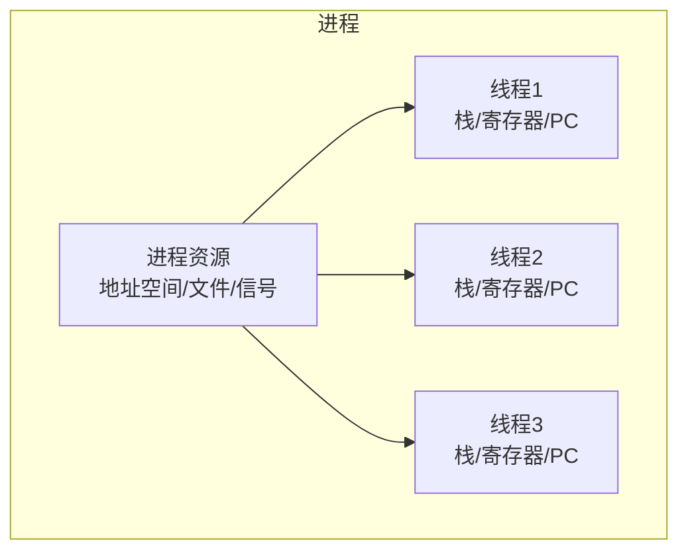
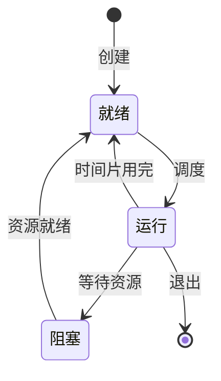
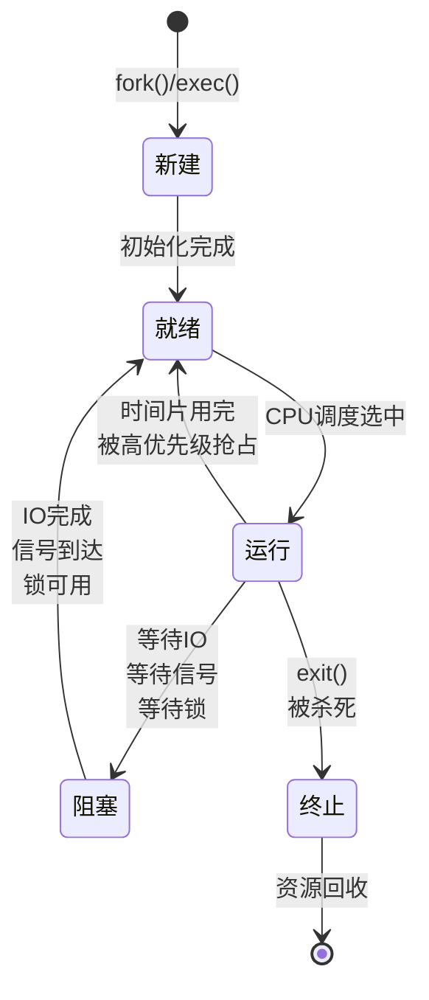

+++
title = "09. OS笔试题-进程与线程"
date = 2026-01-31
weight = 9000
description = "操作系统进程与线程笔试题：进程状态、线程模型、IPC机制、进程调度算法"
[taxonomies]
tags = ["操作系统", "笔试", "进程", "线程", "IPC"]
+++

# 操作系统笔试题 - 进程与线程

本文汇集操作系统进程与线程相关的笔试题，覆盖进程状态转换、线程模型、进程间通信、调度算法等核心概念。

**难度标注**：★☆☆ 基础 | ★★☆ 中级 | ★★★ 困难

---

## 一、选择题

### 题目 1 ★☆☆

进程和线程的主要区别是：

A. 进程是资源分配的基本单位，线程是 CPU 调度的基本单位  
B. 进程是 CPU 调度的基本单位，线程是资源分配的基本单位  
C. 进程和线程没有本质区别  
D. 进程不能共享资源，线程可以

<details>
<summary>查看答案与解析</summary>

**答案：A**

**解析**：

| 维度 | 进程 | 线程 |
|------|------|------|
| 资源分配 | 基本单位 | 共享进程资源 |
| CPU 调度 | 曾是基本单位 | **当前基本单位** |
| 地址空间 | 独立 | 共享 |
| 创建开销 | 大 | 小 |
| 通信方式 | IPC | 共享内存 |
| 切换开销 | 大（切换页表） | 小 |



</details>

---

### 题目 2 ★☆☆

进程的基本状态不包括：

A. 就绪态  
B. 运行态  
C. 阻塞态  
D. 挂起态

<details>
<summary>查看答案与解析</summary>

**答案：D**

**解析**：

三态模型（基本状态）：
- **就绪态（Ready）**：等待 CPU
- **运行态（Running）**：正在执行
- **阻塞态（Blocked）**：等待资源/事件

五态模型（扩展）：
- 新建态（New）
- 终止态（Terminated）

七态模型（含挂起）：
- 挂起就绪态
- 挂起阻塞态



</details>

---

### 题目 3 ★★☆

以下哪种进程间通信方式效率最高？

A. 管道（Pipe）  
B. 消息队列（Message Queue）  
C. 共享内存（Shared Memory）  
D. 信号（Signal）

<details>
<summary>查看答案与解析</summary>

**答案：C**

**解析**：

| IPC 方式 | 数据拷贝次数 | 特点 |
|----------|--------------|------|
| 管道 | 2 次 | 用户→内核→用户 |
| 消息队列 | 2 次 | 用户→内核→用户 |
| 共享内存 | 0 次 | 直接访问 |
| 信号 | - | 只传递信号类型 |
| Socket | 2+ 次 | 协议栈开销 |

**共享内存优势**：
```
进程A                    进程B
  ↓                        ↓
  └──→ 共享内存页 ←──────┘
       (物理内存同一块)

无需拷贝，直接读写
但需要额外同步（信号量/互斥锁）
```

</details>

---

### 题目 4 ★★☆

在用户级线程（User-Level Thread）模型中，如果一个线程执行阻塞系统调用：

A. 只有该线程阻塞，其他线程继续运行  
B. 整个进程都会阻塞  
C. 操作系统会自动切换到其他线程  
D. 会触发线程销毁

<details>
<summary>查看答案与解析</summary>

**答案：B**

**解析**：

| 线程模型 | 内核感知 | 阻塞影响 |
|----------|----------|----------|
| 用户级线程（N:1）| ❌ | 整个进程阻塞 |
| 内核级线程（1:1）| ✅ | 只阻塞该线程 |
| 混合模型（N:M）| 部分 | 可配置 |

**用户级线程阻塞问题**：
```
用户级线程 T1, T2, T3 → 1个内核线程

T1 调用 read() 阻塞
↓
内核线程阻塞
↓
T2, T3 也无法运行（整个进程阻塞）
```

**解决方案**：
- 使用非阻塞 I/O
- 使用 I/O 多路复用（select/epoll）
- 使用内核级线程

</details>

---

### 题目 5 ★★★

以下关于 fork() 的描述，**正确**的是：

A. 子进程和父进程共享相同的内存空间  
B. fork() 返回两次，父进程返回 0，子进程返回子进程 PID  
C. 子进程继承父进程打开的文件描述符  
D. fork() 后子进程立即开始执行 exec()

<details>
<summary>查看答案与解析</summary>

**答案：C**

**解析**：

- A 错误：子进程获得父进程地址空间的副本（COW 优化）
- B 错误：父进程返回子进程 PID，子进程返回 0
- C 正确：文件描述符表被复制，指向相同文件表项
- D 错误：exec() 是可选的，子进程可以继续执行 fork() 后的代码

```c
pid_t pid = fork();

if (pid < 0) {
    // 错误
} else if (pid == 0) {
    // 子进程
    printf("Child: my PID is %d\n", getpid());
} else {
    // 父进程，pid 是子进程的 PID
    printf("Parent: child PID is %d\n", pid);
}
```

**文件描述符继承**：
```
父进程                     子进程
fd 0 ─→ stdin  ←───────── fd 0
fd 1 ─→ stdout ←───────── fd 1
fd 3 ─→ file_table[x] ←── fd 3
       ↓
    实际文件（共享偏移量）
```

</details>

---

## 二、填空题

### 题目 6 ★☆☆

进程控制块（PCB）包含的主要信息有：进程 ______ 、进程 ______ 、______ 信息、资源 ______ 等。

<details>
<summary>查看答案</summary>

**答案**：标识符（PID）、状态、寄存器/CPU、分配信息

```
PCB 主要内容：

1. 进程标识
   - PID（进程ID）
   - PPID（父进程ID）
   - UID/GID（用户/组）

2. 进程状态
   - 当前状态（运行/就绪/阻塞）
   - 优先级

3. CPU 上下文
   - 程序计数器（PC）
   - 栈指针（SP）
   - 通用寄存器

4. 内存管理信息
   - 页表基址
   - 代码/数据/栈段信息

5. 资源信息
   - 打开的文件描述符
   - I/O 状态

6. 调度信息
   - 优先级
   - 时间片剩余
```

</details>

---

### 题目 7 ★★☆

Linux 线程实现采用 ______ 模型，用 ______ 系统调用创建，线程和进程在内核中都用 ______ 结构表示。

<details>
<summary>查看答案</summary>

**答案**：1:1（一对一）、clone、task_struct

```c
// Linux 线程创建（底层）
clone(
    child_func,
    child_stack,
    CLONE_VM |        // 共享地址空间
    CLONE_FS |        // 共享文件系统信息
    CLONE_FILES |     // 共享文件描述符
    CLONE_SIGHAND |   // 共享信号处理
    CLONE_THREAD,     // 同一线程组
    arg
);

// pthread_create 底层调用 clone
```

**Linux 线程特点**：
- 内核不区分进程和线程
- 都用 `task_struct` 表示
- 通过 clone 参数控制共享程度
- 线程组通过 `tgid`（Thread Group ID）标识

</details>

---

### 题目 8 ★★☆

常见的进程调度算法有：______ 、______ 、______ 、多级反馈队列等。

<details>
<summary>查看答案</summary>

**答案**：先来先服务（FCFS）、短作业优先（SJF）、时间片轮转（RR）

| 算法 | 特点 | 优点 | 缺点 |
|------|------|------|------|
| FCFS | 按到达顺序 | 简单公平 | 护航效应 |
| SJF | 最短作业优先 | 平均等待最短 | 饥饿、需预知 |
| RR | 固定时间片轮转 | 响应快、公平 | 时间片选择困难 |
| 优先级 | 按优先级调度 | 灵活 | 饥饿 |
| MLFQ | 多级队列+反馈 | 综合优势 | 复杂 |

**多级反馈队列**：
```
高优先级 Q1 [时间片=2]  ← 新进程进入
     ↓ 时间片用完
中优先级 Q2 [时间片=4]
     ↓ 时间片用完
低优先级 Q3 [时间片=8]
     ↓ 用完或阻塞后返回
    ...
```

</details>

---

### 题目 9 ★★★

僵尸进程（Zombie）是指 ______ 但 ______ 的进程，需要 ______ 来回收。孤儿进程是指 ______ 的进程，会被 ______ 进程收养。

<details>
<summary>查看答案</summary>

**答案**：已终止、父进程尚未调用 wait()、父进程调用 wait()/waitpid()、父进程已终止、init（PID 1）

```c
// 僵尸进程产生
pid_t pid = fork();
if (pid == 0) {
    exit(0);  // 子进程退出
}
// 父进程没有调用 wait()
sleep(100);  // 子进程成为僵尸

// 查看僵尸进程
$ ps aux | grep Z
user  1234  0.0  0.0  0  0 ?  Z  10:00  0:00 [zombie_proc] <defunct>
```

**解决僵尸进程**：
```c
// 方案 1：父进程调用 wait
wait(NULL);

// 方案 2：使用 SIGCHLD 信号
signal(SIGCHLD, SIG_IGN);  // 忽略子进程退出

// 方案 3：双 fork
if (fork() == 0) {
    if (fork() == 0) {
        // 孙进程成为孤儿，被 init 收养
        exec(...);
    }
    exit(0);  // 中间进程退出
}
wait(NULL);  // 回收中间进程
```

</details>

---

## 三、简答题

### 题目 10 ★★☆

简述进程状态转换的条件和时机。

<details>
<summary>参考答案</summary>



**状态转换条件**：

| 转换 | 条件 | 示例 |
|------|------|------|
| 新建→就绪 | 进程创建完成 | fork() 返回 |
| 就绪→运行 | 被调度器选中 | schedule() |
| 运行→就绪 | 时间片用完/被抢占 | 时钟中断 |
| 运行→阻塞 | 等待资源 | read() 等待磁盘 |
| 阻塞→就绪 | 资源就绪 | 磁盘 I/O 完成 |
| 运行→终止 | 主动/被动退出 | exit()/SIGKILL |

</details>

---

### 题目 11 ★★★

比较不同的进程间通信机制，说明各自的适用场景。

<details>
<summary>参考答案</summary>

**IPC 机制对比**：

| 机制 | 方向 | 数据量 | 复杂度 | 场景 |
|------|------|--------|--------|------|
| 管道 | 单向 | 小 | 低 | 父子进程 |
| 命名管道 | 单向 | 小 | 低 | 无关进程 |
| 消息队列 | 双向 | 中 | 中 | 异步通信 |
| 共享内存 | 双向 | 大 | 高 | 大数据交换 |
| 信号量 | - | 无 | 中 | 同步 |
| 信号 | 单向 | 极小 | 低 | 事件通知 |
| Socket | 双向 | 任意 | 高 | 网络/本地 |

**适用场景**：

```c
// 1. 管道：父子进程，简单数据流
int fd[2];
pipe(fd);
if (fork() == 0) {
    close(fd[0]);
    write(fd[1], "hello", 5);
} else {
    close(fd[1]);
    read(fd[0], buf, 5);
}

// 2. 共享内存：大数据，高性能
// 需要配合信号量/互斥锁同步
int shm_id = shmget(key, size, IPC_CREAT | 0666);
void *ptr = shmat(shm_id, NULL, 0);

// 3. 消息队列：结构化消息，异步
struct msg { long type; char data[100]; };
msgsnd(queue_id, &msg, sizeof(msg.data), 0);
msgrcv(queue_id, &msg, sizeof(msg.data), type, 0);

// 4. Socket：最通用，跨机器
// 适合网络应用、服务间通信
```

</details>

---

## 四、计算题

### 题目 12 ★★☆

使用以下调度算法计算平均等待时间和平均周转时间：

| 进程 | 到达时间 | 服务时间 |
|------|----------|----------|
| P1 | 0 | 8 |
| P2 | 1 | 4 |
| P3 | 2 | 9 |
| P4 | 3 | 5 |

分别计算 FCFS 和 SJF（非抢占）的结果。

<details>
<summary>参考答案</summary>

**FCFS（先来先服务）**：

```
执行顺序：P1 → P2 → P3 → P4

时间线：
0    8   12   21   26
|P1  |P2 |P3      |P4  |

完成时间：
P1: 8
P2: 12
P3: 21
P4: 26

周转时间 = 完成时间 - 到达时间
P1: 8 - 0 = 8
P2: 12 - 1 = 11
P3: 21 - 2 = 19
P4: 26 - 3 = 23

等待时间 = 周转时间 - 服务时间
P1: 8 - 8 = 0
P2: 11 - 4 = 7
P3: 19 - 9 = 10
P4: 23 - 5 = 18

平均周转时间 = (8 + 11 + 19 + 23) / 4 = 15.25
平均等待时间 = (0 + 7 + 10 + 18) / 4 = 8.75
```

**SJF（短作业优先，非抢占）**：

```
时刻 0：只有 P1 到达，执行 P1
时刻 8：P2、P3、P4 都已到达
       服务时间：P2=4, P3=9, P4=5
       选择 P2（最短）

执行顺序：P1 → P2 → P4 → P3

时间线：
0    8   12   17   26
|P1  |P2 |P4 |P3      |

完成时间：
P1: 8
P2: 12
P4: 17
P3: 26

周转时间：
P1: 8 - 0 = 8
P2: 12 - 1 = 11
P3: 26 - 2 = 24
P4: 17 - 3 = 14

等待时间：
P1: 8 - 8 = 0
P2: 11 - 4 = 7
P3: 24 - 9 = 15
P4: 14 - 5 = 9

平均周转时间 = (8 + 11 + 24 + 14) / 4 = 14.25
平均等待时间 = (0 + 7 + 15 + 9) / 4 = 7.75
```

**对比**：

| 算法 | 平均周转时间 | 平均等待时间 |
|------|--------------|--------------|
| FCFS | 15.25 | 8.75 |
| SJF | 14.25 | 7.75 |

SJF 在这个例子中表现更好。

</details>

---

### 题目 13 ★★★

使用时间片轮转（RR）算法，时间片 = 3，计算以下进程的调度序列：

| 进程 | 到达时间 | 服务时间 |
|------|----------|----------|
| P1 | 0 | 5 |
| P2 | 1 | 3 |
| P3 | 2 | 4 |

<details>
<summary>参考答案</summary>

**调度过程**：

```
时间片 = 3

时刻 0: 就绪队列 [P1]
        运行 P1（需要5，用3）
        
时刻 3: P1 剩余 2，加入队尾
        就绪队列 [P2, P3, P1]
        运行 P2（需要3，用3）
        
时刻 6: P2 完成
        就绪队列 [P3, P1]
        运行 P3（需要4，用3）
        
时刻 9: P3 剩余 1，加入队尾
        就绪队列 [P1, P3]
        运行 P1（剩余2，用2）
        
时刻 11: P1 完成
         就绪队列 [P3]
         运行 P3（剩余1，用1）
         
时刻 12: P3 完成

执行顺序：P1(3) → P2(3) → P3(3) → P1(2) → P3(1)

时间线：
0   3   6   9   11  12
|P1 |P2 |P3 |P1 |P3|
```

**计算结果**：

```
完成时间：
P1: 11
P2: 6
P3: 12

周转时间：
P1: 11 - 0 = 11
P2: 6 - 1 = 5
P3: 12 - 2 = 10

等待时间：
P1: 11 - 5 = 6
P2: 5 - 3 = 2
P3: 10 - 4 = 6

平均周转时间 = (11 + 5 + 10) / 3 = 8.67
平均等待时间 = (6 + 2 + 6) / 3 = 4.67
```

</details>

---

## 五、编程题

### 题目 14 ★★☆

使用 fork() 创建一个进程树：父进程创建 2 个子进程，每个子进程再创建 1 个子进程。

<details>
<summary>参考答案</summary>

```c
#include <stdio.h>
#include <unistd.h>
#include <sys/wait.h>

int main() {
    pid_t pid1, pid2;
    
    printf("父进程 PID: %d\n", getpid());
    
    // 创建第一个子进程
    pid1 = fork();
    
    if (pid1 == 0) {
        // 子进程 1
        printf("子进程1 PID: %d, 父进程: %d\n", getpid(), getppid());
        
        // 创建孙进程
        pid_t grandchild = fork();
        if (grandchild == 0) {
            printf("孙进程1 PID: %d, 父进程: %d\n", getpid(), getppid());
            return 0;
        }
        wait(NULL);  // 等待孙进程
        return 0;
    }
    
    // 创建第二个子进程
    pid2 = fork();
    
    if (pid2 == 0) {
        // 子进程 2
        printf("子进程2 PID: %d, 父进程: %d\n", getpid(), getppid());
        
        // 创建孙进程
        pid_t grandchild = fork();
        if (grandchild == 0) {
            printf("孙进程2 PID: %d, 父进程: %d\n", getpid(), getppid());
            return 0;
        }
        wait(NULL);
        return 0;
    }
    
    // 父进程等待所有子进程
    wait(NULL);
    wait(NULL);
    
    printf("所有子进程已结束\n");
    
    return 0;
}

/*
进程树结构：
     父进程
    /      \
  子1      子2
   |        |
  孙1      孙2
*/
```

</details>

---

### 题目 15 ★★★

使用管道实现生产者-消费者模型。

<details>
<summary>参考答案</summary>

```c
#include <stdio.h>
#include <stdlib.h>
#include <unistd.h>
#include <string.h>
#include <sys/wait.h>

#define BUFFER_SIZE 256
#define NUM_ITEMS 10

int main() {
    int pipe_fd[2];
    
    if (pipe(pipe_fd) == -1) {
        perror("pipe");
        exit(1);
    }
    
    pid_t pid = fork();
    
    if (pid == 0) {
        // 消费者（子进程）
        close(pipe_fd[1]);  // 关闭写端
        
        char buffer[BUFFER_SIZE];
        int count = 0;
        
        while (1) {
            ssize_t bytes = read(pipe_fd[0], buffer, BUFFER_SIZE);
            if (bytes <= 0) break;
            
            buffer[bytes] = '\0';
            printf("消费者收到: %s\n", buffer);
            count++;
            
            if (count >= NUM_ITEMS) break;
        }
        
        close(pipe_fd[0]);
        printf("消费者完成，共消费 %d 条消息\n", count);
        
    } else {
        // 生产者（父进程）
        close(pipe_fd[0]);  // 关闭读端
        
        for (int i = 0; i < NUM_ITEMS; i++) {
            char message[BUFFER_SIZE];
            snprintf(message, BUFFER_SIZE, "消息 #%d", i + 1);
            
            write(pipe_fd[1], message, strlen(message) + 1);
            printf("生产者发送: %s\n", message);
            
            usleep(100000);  // 100ms
        }
        
        close(pipe_fd[1]);
        wait(NULL);  // 等待消费者
        printf("生产者完成\n");
    }
    
    return 0;
}
```

</details>

---

### 题目 16 ★★★

使用共享内存和信号量实现生产者-消费者模型。

<details>
<summary>参考答案</summary>

```c
#include <stdio.h>
#include <stdlib.h>
#include <string.h>
#include <unistd.h>
#include <sys/shm.h>
#include <sys/sem.h>
#include <sys/wait.h>

#define SHM_SIZE 1024
#define NUM_ITEMS 10

// 信号量操作
union semun {
    int val;
    struct semid_ds *buf;
    unsigned short *array;
};

void sem_wait(int sem_id, int sem_num) {
    struct sembuf op = {sem_num, -1, 0};
    semop(sem_id, &op, 1);
}

void sem_signal(int sem_id, int sem_num) {
    struct sembuf op = {sem_num, 1, 0};
    semop(sem_id, &op, 1);
}

// 共享内存结构
typedef struct {
    int buffer[10];
    int in;   // 生产者写入位置
    int out;  // 消费者读取位置
    int count;
} shared_data_t;

int main() {
    // 创建共享内存
    int shm_id = shmget(IPC_PRIVATE, sizeof(shared_data_t), 
                        IPC_CREAT | 0666);
    shared_data_t *shared = shmat(shm_id, NULL, 0);
    
    // 初始化共享数据
    shared->in = 0;
    shared->out = 0;
    shared->count = 0;
    
    // 创建信号量：0-互斥锁, 1-空槽位, 2-满槽位
    int sem_id = semget(IPC_PRIVATE, 3, IPC_CREAT | 0666);
    union semun arg;
    arg.val = 1;  semctl(sem_id, 0, SETVAL, arg);  // mutex = 1
    arg.val = 10; semctl(sem_id, 1, SETVAL, arg);  // empty = 10
    arg.val = 0;  semctl(sem_id, 2, SETVAL, arg);  // full = 0
    
    pid_t pid = fork();
    
    if (pid == 0) {
        // 消费者
        for (int i = 0; i < NUM_ITEMS; i++) {
            sem_wait(sem_id, 2);   // wait(full)
            sem_wait(sem_id, 0);   // wait(mutex)
            
            // 读取数据
            int item = shared->buffer[shared->out];
            shared->out = (shared->out + 1) % 10;
            shared->count--;
            
            printf("消费者读取: %d (count=%d)\n", item, shared->count);
            
            sem_signal(sem_id, 0); // signal(mutex)
            sem_signal(sem_id, 1); // signal(empty)
            
            usleep(150000);  // 模拟处理
        }
        
        shmdt(shared);
        
    } else {
        // 生产者
        for (int i = 0; i < NUM_ITEMS; i++) {
            sem_wait(sem_id, 1);   // wait(empty)
            sem_wait(sem_id, 0);   // wait(mutex)
            
            // 写入数据
            shared->buffer[shared->in] = i * 10;
            shared->in = (shared->in + 1) % 10;
            shared->count++;
            
            printf("生产者写入: %d (count=%d)\n", i * 10, shared->count);
            
            sem_signal(sem_id, 0); // signal(mutex)
            sem_signal(sem_id, 2); // signal(full)
            
            usleep(100000);  // 模拟生产
        }
        
        wait(NULL);
        
        // 清理
        shmdt(shared);
        shmctl(shm_id, IPC_RMID, NULL);
        semctl(sem_id, 0, IPC_RMID);
    }
    
    return 0;
}
```

</details>

---

## 六、Bug 分析题

### 题目 17 ★★☆

以下代码可能产生僵尸进程，分析原因并修复。

```c
int main() {
    for (int i = 0; i < 5; i++) {
        if (fork() == 0) {
            printf("Child %d\n", i);
            exit(0);
        }
    }
    
    // 父进程继续其他工作
    while (1) {
        do_work();
    }
    
    return 0;
}
```

<details>
<summary>查看答案与解析</summary>

**问题**：父进程没有调用 wait() 回收子进程，导致僵尸进程。

**修复方案**：

```c
#include <signal.h>
#include <sys/wait.h>

// 方案 1：使用 SIGCHLD 信号处理
void sigchld_handler(int sig) {
    while (waitpid(-1, NULL, WNOHANG) > 0);
}

int main() {
    signal(SIGCHLD, sigchld_handler);
    
    for (int i = 0; i < 5; i++) {
        if (fork() == 0) {
            printf("Child %d\n", i);
            exit(0);
        }
    }
    
    while (1) {
        do_work();
    }
    
    return 0;
}

// 方案 2：忽略 SIGCHLD
int main() {
    signal(SIGCHLD, SIG_IGN);  // 自动回收子进程
    
    for (int i = 0; i < 5; i++) {
        if (fork() == 0) {
            printf("Child %d\n", i);
            exit(0);
        }
    }
    
    while (1) {
        do_work();
    }
    
    return 0;
}

// 方案 3：双 fork（子进程立即退出）
int main() {
    for (int i = 0; i < 5; i++) {
        pid_t pid = fork();
        if (pid == 0) {
            if (fork() == 0) {
                // 孙进程做实际工作
                printf("Grandchild %d\n", i);
                exit(0);
            }
            exit(0);  // 子进程立即退出
        }
        wait(NULL);  // 回收子进程（很快返回）
    }
    
    while (1) {
        do_work();
    }
    
    return 0;
}
```

</details>

---

### 题目 18 ★★★

以下多线程代码有竞态条件，分析并修复。

```c
int counter = 0;

void *thread_func(void *arg) {
    for (int i = 0; i < 100000; i++) {
        counter++;  // 竞态！
    }
    return NULL;
}

int main() {
    pthread_t threads[4];
    
    for (int i = 0; i < 4; i++) {
        pthread_create(&threads[i], NULL, thread_func, NULL);
    }
    
    for (int i = 0; i < 4; i++) {
        pthread_join(threads[i], NULL);
    }
    
    printf("Counter = %d (expected 400000)\n", counter);
    return 0;
}
```

<details>
<summary>查看答案与解析</summary>

**问题**：`counter++` 不是原子操作。

```
counter++ 实际上是：
1. 读取 counter 到寄存器
2. 寄存器 + 1
3. 写回 counter

多线程可能：
Thread A: 读取 counter = 100
Thread B: 读取 counter = 100
Thread A: 写入 counter = 101
Thread B: 写入 counter = 101  ← 丢失一次增加！
```

**修复方案**：

```c
// 方案 1：使用互斥锁
#include <pthread.h>

pthread_mutex_t lock = PTHREAD_MUTEX_INITIALIZER;
int counter = 0;

void *thread_func(void *arg) {
    for (int i = 0; i < 100000; i++) {
        pthread_mutex_lock(&lock);
        counter++;
        pthread_mutex_unlock(&lock);
    }
    return NULL;
}

// 方案 2：使用原子操作
#include <stdatomic.h>

atomic_int counter = ATOMIC_VAR_INIT(0);

void *thread_func(void *arg) {
    for (int i = 0; i < 100000; i++) {
        atomic_fetch_add(&counter, 1);
    }
    return NULL;
}

// 方案 3：使用 GCC 内置原子操作
int counter = 0;

void *thread_func(void *arg) {
    for (int i = 0; i < 100000; i++) {
        __sync_fetch_and_add(&counter, 1);
    }
    return NULL;
}
```

**性能对比**：
- 原子操作最快（无锁开销）
- 互斥锁较慢但更通用
- 临界区很小时优先用原子操作

</details>

---

## 七、高频考点总结

| 考点 | 频率 | 难度 | 关键知识 |
|------|------|------|----------|
| 进程 vs 线程 | ★★★ | ★☆☆ | 资源分配 vs CPU调度 |
| 进程状态转换 | ★★★ | ★☆☆ | 三态/五态模型 |
| IPC 机制 | ★★★ | ★★☆ | 管道/共享内存/消息队列 |
| 调度算法 | ★★★ | ★★☆ | FCFS/SJF/RR |
| 僵尸进程 | ★★☆ | ★★☆ | wait()/SIGCHLD |
| fork() | ★★★ | ★★☆ | 返回值/COW |
| 线程模型 | ★★☆ | ★★☆ | 1:1/N:1/N:M |

---

## 相关文章

- [上一篇：安全与保护](@/articles/os/os-08-安全与保护.md)
- [下一篇：OS笔试题-内存管理](@/articles/os/os-10-OS笔试题-内存管理.md)

**知识基础**：
- [进程管理](@/articles/os/os-02-进程管理.md)
