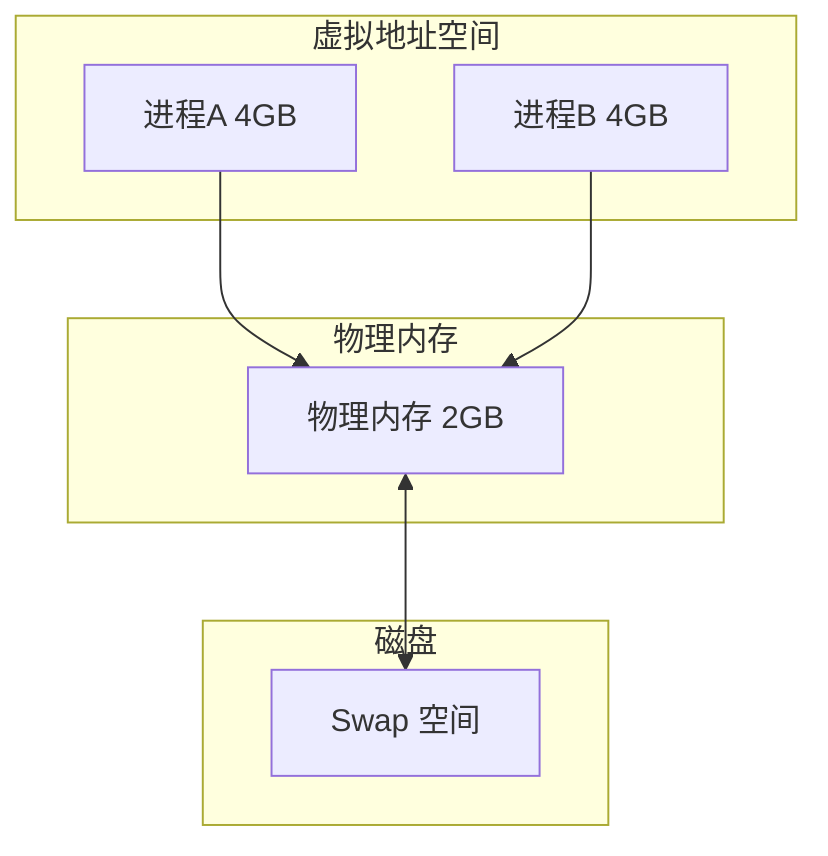
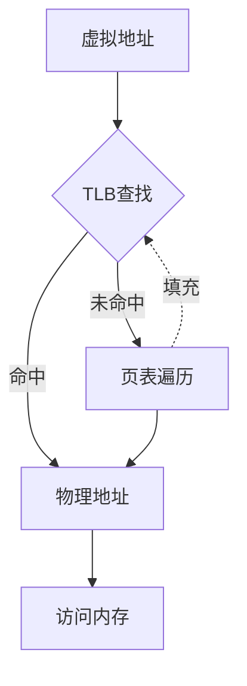
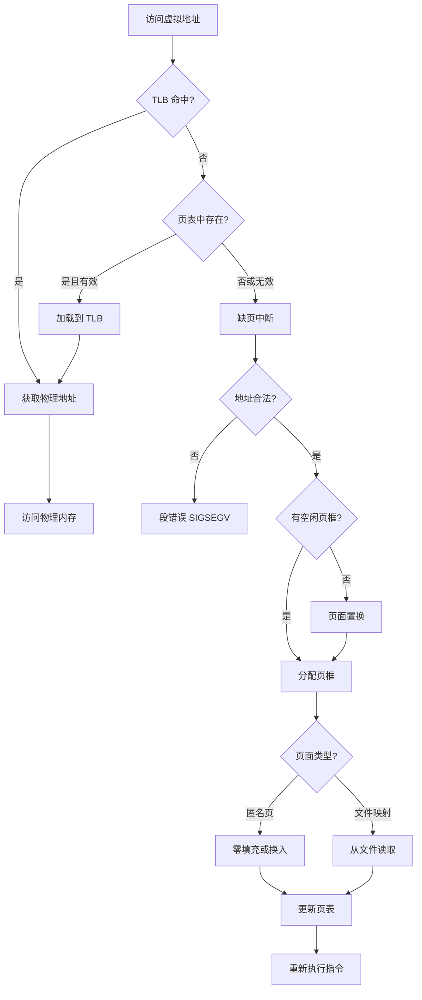

+++
title = "10.OS笔试题-内存管理"
date = 2026-01-31
description = "操作系统内存管理笔试题：虚拟内存、分页分段、页面置换算法、内存分配"
[taxonomies]
tags = ["操作系统", "笔试", "内存管理", "虚拟内存", "页面置换"]
+++

# 操作系统笔试题 - 内存管理

本文汇集操作系统内存管理相关的笔试题，覆盖虚拟内存、分页分段、页面置换算法、内存分配等核心概念。

**难度标注**：★☆☆ 基础 | ★★☆ 中级 | ★★★ 困难

---

## 一、选择题

### 题目 1 ★☆☆

虚拟内存的主要目的是：

A. 提高 CPU 执行速度  
B. 让程序可以使用比物理内存更大的地址空间  
C. 减少磁盘 I/O  
D. 提高网络传输速度

<details>
<summary>查看答案与解析</summary>

**答案：B**

**虚拟内存的作用**：
1. **扩展地址空间**：程序可使用超过物理内存的空间
2. **内存保护**：进程间地址空间隔离
3. **共享内存**：多进程共享同一物理页
4. **按需加载**：只加载需要的页面



</details>

---

### 题目 2 ★☆☆

分页和分段的主要区别是：

A. 分页是物理划分，分段是逻辑划分  
B. 分页大小固定，分段大小可变  
C. 分页产生内部碎片，分段产生外部碎片  
D. 以上都对

<details>
<summary>查看答案与解析</summary>

**答案：D**

**对比表**：

| 特性 | 分页 | 分段 |
|------|------|------|
| 划分依据 | 物理固定大小 | 逻辑意义 |
| 大小 | 固定（如 4KB） | 可变 |
| 碎片类型 | 内部碎片 | 外部碎片 |
| 地址结构 | 页号 + 页内偏移 | 段号 + 段内偏移 |
| 用户可见 | 透明 | 可见 |
| 共享方便性 | 以页为单位 | 以段为单位 |

**分页（固定大小）**：`| P0 (4KB) | P1 (4KB) | P2 (4KB) | P3 (4KB) | ... |`

**分段（逻辑划分）**：`| 代码段 (可变) | 数据段 (可变) | 栈段 (可变) |`

</details>

---

### 题目 3 ★★☆

关于页表的描述，**错误**的是：

A. 每个进程有独立的页表  
B. 页表存储在内存中  
C. 页表项包含物理页帧号  
D. 访问一次内存只需要一次内存读取

<details>
<summary>查看答案与解析</summary>

**答案：D**

**解析**：
- 无 TLB 情况下，访问内存需要：
  1. 访问页表获取物理地址（1次内存访问）
  2. 访问实际数据（1次内存访问）
- 多级页表需要更多次访问

```
单级页表：2 次内存访问
  虚拟地址 → [查页表] → 物理地址 → [访问数据]

4 级页表（无 TLB）：5 次内存访问
  虚拟地址 → [PGD] → [PUD] → [PMD] → [PTE] → [数据]

有 TLB 且命中：1 次内存访问
  虚拟地址 → [TLB命中] → 物理地址 → [数据]
```

</details>

---

### 题目 4 ★★☆

以下哪种页面置换算法会产生 Belady 异常（增加页框数反而增加缺页次数）？

A. FIFO  
B. LRU  
C. OPT  
D. Clock

<details>
<summary>查看答案与解析</summary>

**答案：A**

**Belady 异常**：增加物理页框数，缺页率反而上升。

**FIFO 示例**：
```
访问序列：1, 2, 3, 4, 1, 2, 5, 1, 2, 3, 4, 5

3 个页框：9 次缺页
4 个页框：10 次缺页  ← 异常！
```

**为什么会发生**：
- FIFO 只考虑进入顺序，不考虑访问频率
- 增加页框改变了替换模式
- LRU 和 OPT 是"栈算法"，不会产生 Belady 异常

</details>

---

### 题目 5 ★★★

关于 TLB（Translation Lookaside Buffer），正确的是：

A. TLB 是页表的一部分  
B. TLB 命中后仍需访问页表  
C. TLB 缓存虚拟地址到物理地址的映射  
D. 进程切换时 TLB 内容保持不变

<details>
<summary>查看答案与解析</summary>

**答案：C**

**解析**：
- A 错误：TLB 是 CPU 内的高速缓存，独立于页表
- B 错误：TLB 命中直接返回物理地址，不查页表
- C 正确：TLB 缓存最近的地址转换结果
- D 错误：进程切换通常需要刷新 TLB（PCID 可优化）



**TLB 性能影响**：
```
假设：TLB 命中率 95%，TLB 访问 10ns，页表访问 100ns

有效访问时间 = 0.95 × 10ns + 0.05 × (10 + 100)ns
            = 9.5 + 5.5 = 15ns

无 TLB：100ns（每次都查页表）
```

</details>

---

## 二、填空题

### 题目 6 ★☆☆

虚拟地址由 ______ 和 ______ 两部分组成，页表将 ______ 映射到 ______ 。

<details>
<summary>查看答案</summary>

**答案**：页号（VPN）、页内偏移（Offset）、虚拟页号、物理页帧号（PFN）

32位地址，4KB页面：

| 虚拟地址结构 | 位数 |
|-------------|------|
| 页号 (VPN) | 20位 |
| 页内偏移 (Offset) | 12位 |

**页表映射**：VPN → PFN

**物理地址** = PFN × 页大小 + Offset = (页表[VPN]) × 4096 + Offset

</details>

---

### 题目 7 ★★☆

常见的页面置换算法有：______ （理论最优）、______ （基于访问历史）、______ （先进先出）、______ （时钟算法）。

<details>
<summary>查看答案</summary>

**答案**：OPT（最优）、LRU（最近最少使用）、FIFO（先进先出）、Clock（时钟/二次机会）

| 算法 | 原理 | 优点 | 缺点 |
|------|------|------|------|
| OPT | 替换最远将来使用的页 | 理论最优 | 需要预知未来 |
| LRU | 替换最久未使用的页 | 接近 OPT | 实现开销大 |
| FIFO | 替换最先进入的页 | 实现简单 | Belady 异常 |
| Clock | 二次机会 FIFO | 平衡性能和开销 | 需要引用位 |

**Clock 算法**：
```
页面排列成环形，有引用位 R

替换时：
1. 检查当前指针指向的页面
2. 如果 R=0，替换该页
3. 如果 R=1，R=0，指针前移，继续
```

</details>

---

### 题目 8 ★★★

多级页表的设计目的是解决 ______ 问题，x86-64 使用 ______ 级页表，每级索引 ______ 位。

<details>
<summary>查看答案</summary>

**答案**：页表过大（页表空间）、4 级（或 5 级 LA57）、9 位

**问题分析**：
```
32位地址空间，4KB页面：
页表项数 = 2^32 / 4KB = 2^20 = 1M 个
页表大小 = 1M × 4B = 4MB（每个进程）

64位地址空间（48位使用）：
页表项数 = 2^48 / 4KB = 2^36 个
页表大小 = 2^36 × 8B = 512GB！不可接受
```

**多级页表解决方案**：

4级页表结构（x86-64）：

| 索引 | PGD | PUD | PMD | PTE | Offset |
|------|-----|-----|-----|-----|--------|
| 位数 | 9   | 9   | 9   | 9   | 12     |

- 每级 512 个条目（2^9）
- 未使用的区域不分配页表页

</details>

---

## 三、简答题

### 题目 9 ★★☆

简述缺页中断的处理流程。

<details>
<summary>参考答案</summary>



**关键步骤**：
1. CPU 访问虚拟地址
2. TLB 未命中，查页表
3. 页面无效，触发缺页中断
4. 检查地址合法性
5. 若无空闲页框，执行页面置换
6. 加载页面到内存
7. 更新页表
8. 重新执行触发缺页的指令

</details>

---

### 题目 10 ★★★

比较内部碎片和外部碎片，说明如何解决。

<details>
<summary>参考答案</summary>

**定义**：

| 碎片类型 | 定义 | 产生原因 |
|----------|------|----------|
| 内部碎片 | 分配的内存块中未使用的部分 | 固定大小分配 |
| 外部碎片 | 空闲内存分散，无法满足大请求 | 可变大小分配 |

| 碎片类型 | 场景 | 说明 |
|---------|------|------|
| **内部碎片（分页）** | 请求 5KB，分配 8KB（2个4KB页） | 浪费 3KB 在分配块内部 |
| **外部碎片（分段/可变分配）** | 总空闲 20KB（8KB + 12KB） | 无法分配 15KB 连续块 |

**解决方案**：

| 碎片类型 | 解决方案 |
|----------|----------|
| 内部碎片 | 使用 Slab 分配器，匹配对象大小 |
| 外部碎片 | 紧凑（Compaction）、伙伴系统 |

**伙伴系统**：
- 按 2^n 大小分配
- 合并相邻空闲块
- 减少外部碎片

</details>

---

## 四、计算题

### 题目 11 ★★☆

一个系统使用 32 位虚拟地址，页大小 4KB，页表项 4 字节。

计算：
1. 虚拟地址中页号和页内偏移各占多少位？
2. 一个进程的页表最大需要多少内存？
3. 如果使用二级页表，页目录和页表各有多少项？

<details>
<summary>参考答案</summary>

**1. 地址结构**：
```
页大小 = 4KB = 2^12 字节
页内偏移 = 12 位

虚拟地址 = 32 位
页号 = 32 - 12 = 20 位

| 页号 (20位) | 页内偏移 (12位) |
|------------|----------------|

**2. 单级页表大小**：
```
页表项数 = 2^20 = 1,048,576 个
页表大小 = 2^20 × 4B = 4MB
```

**3. 二级页表**：
```
每个页表页大小 = 4KB
每页容纳页表项 = 4KB / 4B = 1024 = 2^10 个

地址结构：

| 目录 (10位) | 页表 (10位) | 偏移 (12位) |
|------------|------------|-------------|

页目录项数 = 2^10 = 1024 项，每个页表项数 = 2^10 = 1024 项

</details>

---

### 题目 12 ★★★

使用 LRU 和 FIFO 算法处理以下页面访问序列，假设有 3 个页框：

访问序列：7, 0, 1, 2, 0, 3, 0, 4, 2, 3, 0, 3, 2, 1, 2

<details>
<summary>参考答案</summary>

**FIFO（先进先出）**：

```
访问  页框状态     缺页
7    [7,-,-]      ✓
0    [7,0,-]      ✓
1    [7,0,1]      ✓
2    [2,0,1]      ✓ (替换7)
0    [2,0,1]      
3    [2,3,1]      ✓ (替换0)
0    [2,3,0]      ✓ (替换1)
4    [4,3,0]      ✓ (替换2)
2    [4,2,0]      ✓ (替换3)
3    [4,2,3]      ✓ (替换0)
0    [0,2,3]      ✓ (替换4)
3    [0,2,3]      
2    [0,2,3]      
1    [1,2,3]      ✓ (替换0)
2    [1,2,3]      

FIFO 缺页次数：12
```

**LRU（最近最少使用）**：

```
访问  页框状态        LRU顺序(左旧右新)  缺页
7    [7,-,-]        7                  ✓
0    [7,0,-]        7,0                ✓
1    [7,0,1]        7,0,1              ✓
2    [2,0,1]        0,1,2              ✓ (替换7)
0    [2,0,1]        1,2,0              
3    [2,0,3]        2,0,3              ✓ (替换1)
0    [2,0,3]        2,3,0              
4    [4,0,3]        3,0,4              ✓ (替换2)
2    [4,0,2]        0,4,2              ✓ (替换3)
3    [4,3,2]        4,2,3              ✓ (替换0)
0    [0,3,2]        2,3,0              ✓ (替换4)
3    [0,3,2]        2,0,3              
2    [0,3,2]        0,3,2              
1    [0,1,2]        3,2,1 → 0,2,1      ✓ (替换3)
2    [0,1,2]        0,1,2              

LRU 缺页次数：10
```

**对比**：

| 算法 | 缺页次数 | 缺页率 |
|------|----------|--------|
| FIFO | 12 | 80% |
| LRU | 10 | 67% |

LRU 在此例中表现更好。

</details>

---

### 题目 13 ★★★

计算有效内存访问时间（EAT）。

条件：
- TLB 访问时间：10ns
- 内存访问时间：100ns
- TLB 命中率：95%
- 4 级页表
- 缺页率：0.1%
- 磁盘访问时间：10ms

<details>
<summary>参考答案</summary>

**情况分析**：

```
1. TLB 命中且页面在内存（最快）：
   时间 = TLB + 内存 = 10 + 100 = 110ns

2. TLB 未命中但页面在内存：
   时间 = TLB + 4×内存(页表) + 内存(数据)
        = 10 + 400 + 100 = 510ns

3. 缺页（最慢）：
   时间 = TLB + 4×内存 + 磁盘 + 内存
        = 10 + 400 + 10,000,000 + 100
        ≈ 10,000,510ns
```

**概率计算**：

```
TLB 命中，无缺页：95% × 99.9% = 94.905%
TLB 未命中，无缺页：5% × 99.9% = 4.995%
缺页：0.1%（简化假设）

EAT = 0.94905 × 110ns
    + 0.04995 × 510ns
    + 0.001 × 10,000,510ns
    
    = 104.4ns + 25.5ns + 10,000.5ns
    ≈ 10,130ns
    ≈ 10.1μs
```

**结论**：缺页率虽只有 0.1%，但因磁盘极慢，对 EAT 影响巨大。

```
如果缺页率降到 0.01%：
EAT ≈ 104.4 + 25.5 + 1000.1 ≈ 1130ns ≈ 1.1μs

10倍改善！
```

</details>

---

## 五、编程题

### 题目 14 ★★☆

实现 LRU 页面置换算法。

<details>
<summary>参考答案</summary>

```c
#include <stdio.h>
#include <stdlib.h>
#include <stdbool.h>

#define MAX_FRAMES 10
#define MAX_PAGES 100

typedef struct {
    int frames[MAX_FRAMES];
    int access_time[MAX_FRAMES];  // 最后访问时间
    int num_frames;
    int current_time;
    int page_faults;
} LRUCache;

void init_cache(LRUCache *cache, int num_frames) {
    cache->num_frames = num_frames;
    cache->current_time = 0;
    cache->page_faults = 0;
    
    for (int i = 0; i < num_frames; i++) {
        cache->frames[i] = -1;
        cache->access_time[i] = 0;
    }
}

// 查找页面在缓存中的位置
int find_page(LRUCache *cache, int page) {
    for (int i = 0; i < cache->num_frames; i++) {
        if (cache->frames[i] == page) {
            return i;
        }
    }
    return -1;
}

// 找到 LRU 页面的位置
int find_lru_victim(LRUCache *cache) {
    int min_time = cache->access_time[0];
    int victim = 0;
    
    for (int i = 1; i < cache->num_frames; i++) {
        if (cache->access_time[i] < min_time) {
            min_time = cache->access_time[i];
            victim = i;
        }
    }
    return victim;
}

// 访问页面
bool access_page(LRUCache *cache, int page) {
    cache->current_time++;
    
    int pos = find_page(cache, page);
    
    if (pos != -1) {
        // 命中：更新访问时间
        cache->access_time[pos] = cache->current_time;
        return true;
    }
    
    // 缺页
    cache->page_faults++;
    
    // 查找空闲位置或 LRU 页面
    int target = -1;
    for (int i = 0; i < cache->num_frames; i++) {
        if (cache->frames[i] == -1) {
            target = i;
            break;
        }
    }
    
    if (target == -1) {
        target = find_lru_victim(cache);
    }
    
    cache->frames[target] = page;
    cache->access_time[target] = cache->current_time;
    
    return false;
}

void print_frames(LRUCache *cache) {
    printf("[");
    for (int i = 0; i < cache->num_frames; i++) {
        if (cache->frames[i] == -1) {
            printf(" - ");
        } else {
            printf(" %d ", cache->frames[i]);
        }
    }
    printf("]");
}

int main() {
    int pages[] = {7, 0, 1, 2, 0, 3, 0, 4, 2, 3, 0, 3, 2, 1, 2};
    int num_pages = sizeof(pages) / sizeof(pages[0]);
    
    LRUCache cache;
    init_cache(&cache, 3);
    
    printf("LRU 页面置换算法模拟\n");
    printf("页框数: 3\n\n");
    
    printf("访问  页框状态         结果\n");
    printf("----------------------------\n");
    
    for (int i = 0; i < num_pages; i++) {
        bool hit = access_page(&cache, pages[i]);
        printf(" %d   ", pages[i]);
        print_frames(&cache);
        printf("    %s\n", hit ? "命中" : "缺页");
    }
    
    printf("\n总缺页次数: %d\n", cache.page_faults);
    printf("缺页率: %.1f%%\n", (float)cache.page_faults / num_pages * 100);
    
    return 0;
}
```

</details>

---

### 题目 15 ★★★

实现 Clock（时钟/二次机会）页面置换算法。

<details>
<summary>参考答案</summary>

```c
#include <stdio.h>
#include <stdlib.h>
#include <stdbool.h>

#define MAX_FRAMES 10

typedef struct {
    int page;
    bool reference;  // 引用位
} Frame;

typedef struct {
    Frame frames[MAX_FRAMES];
    int num_frames;
    int clock_hand;  // 时钟指针
    int page_faults;
    int used_frames;
} ClockCache;

void init_cache(ClockCache *cache, int num_frames) {
    cache->num_frames = num_frames;
    cache->clock_hand = 0;
    cache->page_faults = 0;
    cache->used_frames = 0;
    
    for (int i = 0; i < num_frames; i++) {
        cache->frames[i].page = -1;
        cache->frames[i].reference = false;
    }
}

int find_page(ClockCache *cache, int page) {
    for (int i = 0; i < cache->used_frames; i++) {
        if (cache->frames[i].page == page) {
            return i;
        }
    }
    return -1;
}

// Clock 算法找受害者
int find_victim(ClockCache *cache) {
    while (true) {
        if (!cache->frames[cache->clock_hand].reference) {
            // 找到受害者
            int victim = cache->clock_hand;
            cache->clock_hand = (cache->clock_hand + 1) % cache->num_frames;
            return victim;
        }
        
        // 给二次机会
        cache->frames[cache->clock_hand].reference = false;
        cache->clock_hand = (cache->clock_hand + 1) % cache->num_frames;
    }
}

bool access_page(ClockCache *cache, int page) {
    int pos = find_page(cache, page);
    
    if (pos != -1) {
        // 命中：设置引用位
        cache->frames[pos].reference = true;
        return true;
    }
    
    // 缺页
    cache->page_faults++;
    
    int target;
    if (cache->used_frames < cache->num_frames) {
        // 有空闲位置
        target = cache->used_frames++;
    } else {
        // 使用 Clock 算法找受害者
        target = find_victim(cache);
    }
    
    cache->frames[target].page = page;
    cache->frames[target].reference = true;
    
    return false;
}

void print_state(ClockCache *cache) {
    printf("[");
    for (int i = 0; i < cache->num_frames; i++) {
        if (cache->frames[i].page == -1) {
            printf("  -  ");
        } else {
            printf(" %d(%c)", 
                   cache->frames[i].page,
                   cache->frames[i].reference ? '1' : '0');
        }
        if (i == cache->clock_hand) {
            printf("←");
        } else {
            printf(" ");
        }
    }
    printf("]");
}

int main() {
    int pages[] = {7, 0, 1, 2, 0, 3, 0, 4, 2, 3, 0, 3, 2, 1, 2};
    int num_pages = sizeof(pages) / sizeof(pages[0]);
    
    ClockCache cache;
    init_cache(&cache, 3);
    
    printf("Clock 页面置换算法模拟\n");
    printf("格式: 页号(引用位) ← 表示时钟指针\n\n");
    
    for (int i = 0; i < num_pages; i++) {
        bool hit = access_page(&cache, pages[i]);
        printf("访问 %d: ", pages[i]);
        print_state(&cache);
        printf(" %s\n", hit ? "命中" : "缺页");
    }
    
    printf("\n总缺页次数: %d\n", cache.page_faults);
    printf("缺页率: %.1f%%\n", (float)cache.page_faults / num_pages * 100);
    
    return 0;
}
```

</details>

---

## 六、Bug 分析题

### 题目 16 ★★☆

以下内存分配代码有什么问题？

```c
void process_data() {
    char *buffer = malloc(1024);
    
    if (read_data(buffer) < 0) {
        return;  // 错误返回
    }
    
    process(buffer);
    free(buffer);
}
```

<details>
<summary>查看答案与解析</summary>

**问题**：错误路径没有释放内存，导致内存泄漏。

**修复**：

```c
// 方案 1：统一出口
void process_data_v1() {
    char *buffer = malloc(1024);
    int ret = 0;
    
    if (read_data(buffer) < 0) {
        ret = -1;
        goto cleanup;
    }
    
    process(buffer);
    
cleanup:
    free(buffer);
}

// 方案 2：每个出口都处理
void process_data_v2() {
    char *buffer = malloc(1024);
    
    if (read_data(buffer) < 0) {
        free(buffer);  // 错误路径也释放
        return;
    }
    
    process(buffer);
    free(buffer);
}

// 方案 3：使用 RAII（C++ 或智能指针）
void process_data_v3() {
    std::unique_ptr<char[]> buffer(new char[1024]);
    
    if (read_data(buffer.get()) < 0) {
        return;  // 自动释放
    }
    
    process(buffer.get());
    // 自动释放
}
```

</details>

---

### 题目 17 ★★★

以下代码可能导致内存访问错误，分析原因。

```c
int *create_array(int size) {
    int array[size];  // VLA（可变长数组）
    
    for (int i = 0; i < size; i++) {
        array[i] = i;
    }
    
    return array;  // 返回栈上数组的地址
}

int main() {
    int *arr = create_array(10);
    printf("%d\n", arr[0]);  // 可能崩溃或打印垃圾
    return 0;
}
```

<details>
<summary>查看答案与解析</summary>

**问题**：返回栈上局部变量的地址，函数返回后该内存无效。

**函数调用时**：

| 栈帧 | 内容 |
|------|------|
| main 栈帧 | |
| create_array | size, array[10] ← arr 指向这里 |

**函数返回后**：

| 栈帧 | 状态 |
|------|------|
| main 栈帧 | arr → 无效内存！ |

create_array 栈帧已销毁，arr 指向的内存无效（悬空指针）。

**修复方案**：

```c
// 方案 1：使用堆内存
int *create_array_v1(int size) {
    int *array = malloc(size * sizeof(int));
    
    for (int i = 0; i < size; i++) {
        array[i] = i;
    }
    
    return array;  // 调用者需要 free
}

// 方案 2：调用者提供缓冲区
void create_array_v2(int *array, int size) {
    for (int i = 0; i < size; i++) {
        array[i] = i;
    }
}

int main() {
    int arr[10];
    create_array_v2(arr, 10);
    printf("%d\n", arr[0]);
    return 0;
}

// 方案 3：使用静态变量（注意线程安全）
int *create_array_v3(int size) {
    static int array[100];  // 静态存储
    // 注意：size 不能超过 100
    // 注意：非线程安全，多次调用共享同一数组
    
    for (int i = 0; i < size && i < 100; i++) {
        array[i] = i;
    }
    
    return array;
}
```

</details>

---

## 七、高频考点总结

| 考点 | 频率 | 难度 | 关键知识 |
|------|------|------|----------|
| 虚拟内存概念 | ★★★ | ★☆☆ | 作用、地址转换 |
| 分页 vs 分段 | ★★★ | ★★☆ | 固定 vs 可变、碎片 |
| 页面置换算法 | ★★★ | ★★☆ | LRU/FIFO/Clock |
| 页表结构 | ★★☆ | ★★☆ | 多级页表、TLB |
| 缺页中断 | ★★☆ | ★★☆ | 处理流程 |
| 内存碎片 | ★★☆ | ★★☆ | 内部/外部、解决方案 |
| 内存分配 | ★★☆ | ★★☆ | 伙伴系统、Slab |

---

## 相关文章

- [上一篇：OS笔试题-进程与线程](/articles/os/os-09-OS笔试题-进程与线程/)
- [下一篇：OS笔试题-同步与死锁](/articles/os/os-11-OS笔试题-同步与死锁/)

**知识基础**：
- [内存管理](/articles/os/os-03-内存管理/)
