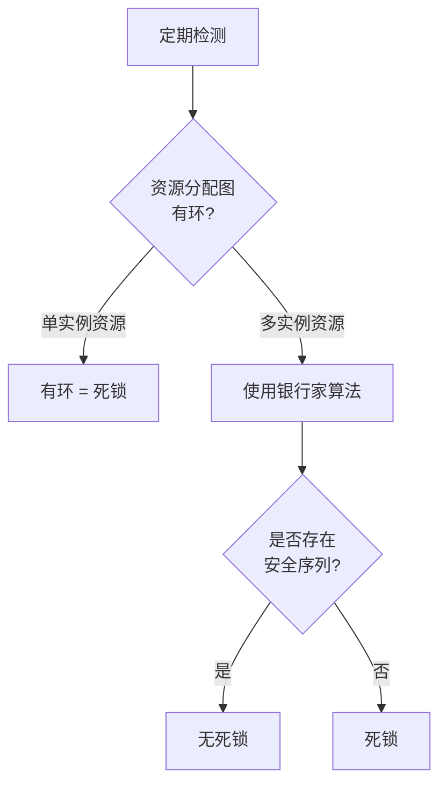
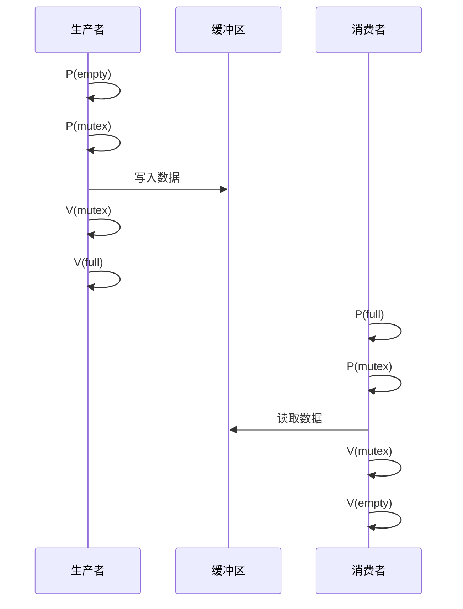

+++
title = "OS笔试题-同步与死锁"
date = 2026-01-31
weight = 11000
description = "操作系统同步与死锁笔试题：互斥、信号量、死锁检测、经典同步问题"
[taxonomies]
tags = ["操作系统", "笔试", "同步", "死锁", "信号量"]
+++

# 操作系统笔试题 - 同步与死锁

本文汇集操作系统同步与死锁相关的笔试题，覆盖互斥机制、信号量、死锁检测与预防、经典同步问题等核心概念。

**难度标注**：★☆☆ 基础 | ★★☆ 中级 | ★★★ 困难

---

## 一、选择题

### 题目 1 ★☆☆

进程同步的主要目的是：

A. 提高 CPU 利用率  
B. 保证进程按正确顺序执行  
C. 减少进程等待时间  
D. 增加系统吞吐量

<details>
<summary>查看答案与解析</summary>

**答案：B**

**进程同步的目的**：
1. **互斥**：保证临界资源同一时刻只被一个进程访问
2. **协作**：保证进程按特定顺序执行（如生产者-消费者）

```
示例：生产者-消费者问题

错误情况（无同步）：
生产者：写入 buffer[0]
消费者：读取 buffer[0]（可能读到旧数据）
生产者：更新 count++

正确情况（有同步）：
生产者：获取锁 → 写入 → 释放锁 → signal(消费者)
消费者：wait() → 获取锁 → 读取 → 释放锁
```

</details>

---

### 题目 2 ★☆☆

以下哪个不是死锁的必要条件？

A. 互斥  
B. 占有并等待  
C. 循环等待  
D. 优先级反转

<details>
<summary>查看答案与解析</summary>

**答案：D**

**死锁四个必要条件**（缺一不可）：

| 条件 | 说明 |
|------|------|
| 互斥 | 资源不能共享 |
| 占有并等待 | 持有资源同时请求新资源 |
| 不可抢占 | 不能强制释放 |
| 循环等待 | 形成等待环路 |

**优先级反转**是调度问题，不是死锁条件：
```
优先级反转：
低优先级进程持有锁
高优先级进程等待锁
中优先级进程抢占低优先级 → 高优先级被阻塞

解决：优先级继承、优先级天花板
```

</details>

---

### 题目 3 ★★☆

信号量 S 初值为 3，执行 5 次 P 操作后，S 的值为：

A. -2  
B. 2  
C. 0  
D. -5

<details>
<summary>查看答案与解析</summary>

**答案：A**

**信号量操作**：
```
P(S) / wait(S) / down(S):
    S = S - 1
    if S < 0:
        阻塞当前进程

V(S) / signal(S) / up(S):
    S = S + 1
    if S <= 0:
        唤醒一个等待进程
```

**计算过程**：
```
初始：S = 3

P1: S = 2（成功）
P2: S = 1（成功）
P3: S = 0（成功）
P4: S = -1（阻塞 1 个进程）
P5: S = -2（阻塞 2 个进程）

最终：S = -2
|S| 表示等待进程数
```

</details>

---

### 题目 4 ★★☆

关于互斥锁（Mutex）和信号量（Semaphore）的区别，**正确**的是：

A. Mutex 只能由获取它的线程释放，信号量可以由任意线程释放  
B. Mutex 可以有任意初值，信号量只能是 0 或 1  
C. Mutex 性能比信号量差  
D. 两者完全等价，可以互换使用

<details>
<summary>查看答案与解析</summary>

**答案：A**

**对比**：

| 特性 | Mutex | Semaphore |
|------|-------|-----------|
| 值范围 | 0 或 1 | 0 到 N |
| 释放者 | 必须是持有者 | 任意进程 |
| 用途 | 互斥 | 互斥 + 同步 |
| 所有权 | 有 | 无 |
| 优先级继承 | 支持 | 通常不支持 |

```c
// Mutex：谁加锁谁解锁
pthread_mutex_lock(&mutex);
// 临界区
pthread_mutex_unlock(&mutex);  // 必须同一线程

// Semaphore：可用于同步
// 线程 A
sem_post(&sem);  // 发信号

// 线程 B
sem_wait(&sem);  // 等待信号
// 继续执行
```

</details>

---

### 题目 5 ★★★

使用资源分配图判断，以下系统状态是否存在死锁？

```
进程: P1, P2
资源: R1(2个), R2(1个)
分配: P1 持有 1个R1，请求 1个R2
      P2 持有 1个R2，请求 1个R1
```

A. 存在死锁  
B. 不存在死锁  
C. 无法判断  
D. 可能死锁

<details>
<summary>查看答案与解析</summary>

**答案：B**

**分析**：

```
资源分配图：
     R1(2)
    /    \
  分配    请求
   ↓       ↓
  P1 ←── R2 ←── P2
  请求         分配
   ↓
  R2(1)

R1 有 2 个实例，P1 持有 1 个
还剩 1 个 R1 可以分配给 P2
```

**资源分配**：
```
R1: 总共 2 个，P1 持有 1 个，空闲 1 个
R2: 总共 1 个，P2 持有 1 个，空闲 0 个

分配步骤：
1. P2 请求 1 个 R1 → 满足（空闲 1 个）
2. P2 完成，释放 R1 和 R2
3. P1 请求 R2 → 满足
4. 系统可完成，无死锁
```

**判断方法**：
- 单实例资源：有环则死锁
- 多实例资源：有环不一定死锁，需要银行家算法

</details>

---

## 二、填空题

### 题目 6 ★☆☆

进入临界区必须满足四个条件：______ 、______ 、______ 、让权等待。

<details>
<summary>查看答案</summary>

**答案**：互斥、空闲让进、有限等待

**临界区准则**：

| 准则 | 说明 |
|------|------|
| 互斥 | 同一时刻只有一个进程在临界区 |
| 空闲让进 | 临界区空闲时，等待进程可立即进入 |
| 有限等待 | 等待进入临界区的时间有限 |
| 让权等待 | 不能进入时应释放 CPU |

</details>

---

### 题目 7 ★★☆

死锁预防的策略有：破坏 ______ 条件、破坏 ______ 条件、破坏不可抢占条件、破坏 ______ 条件。

<details>
<summary>查看答案</summary>

**答案**：互斥、占有并等待、循环等待

**预防策略**：

| 条件 | 预防方法 | 缺点 |
|------|----------|------|
| 互斥 | 使用无锁算法 | 适用范围有限 |
| 占有并等待 | 一次性申请所有资源 | 资源利用率低 |
| 不可抢占 | 允许抢占已持有资源 | 回滚复杂 |
| 循环等待 | 资源编号，按序申请 | 限制灵活性 |

**按序申请示例**：
```c
// 资源编号：R1=1, R2=2, R3=3
// 必须按编号从小到大申请

// 正确
lock(R1);
lock(R2);
// 使用资源
unlock(R2);
unlock(R1);

// 错误：可能死锁
lock(R2);
lock(R1);  // 违反顺序
```

</details>

---

### 题目 8 ★★★

银行家算法需要维护的数据结构有：可用资源向量 ______ 、最大需求矩阵 ______ 、已分配矩阵 ______ 、需求矩阵 ______ 。

<details>
<summary>查看答案</summary>

**答案**：Available、Max、Allocation、Need

```
银行家算法数据结构：

Available[m]     - m 种资源的可用数量
Max[n][m]        - n 个进程对 m 种资源的最大需求
Allocation[n][m] - 已分配给各进程的资源
Need[n][m]       - 还需要的资源 = Max - Allocation

安全检查算法：
1. Work = Available, Finish[i] = false
2. 找到满足 Need[i] <= Work 且 Finish[i] = false 的进程
3. Work = Work + Allocation[i], Finish[i] = true
4. 重复直到所有 Finish = true（安全）或找不到（不安全）
```

</details>

---

## 三、简答题

### 题目 9 ★★☆

简述死锁的检测与恢复方法。

<details>
<summary>参考答案</summary>

**死锁检测**：



**检测算法**：
```
类似银行家算法的安全性检查：
1. 初始化 Work = Available
2. 查找满足 Request[i] <= Work 的进程
3. 假设完成，Work += Allocation[i]
4. 重复直到完成或无法继续
5. 仍有进程未完成 → 死锁
```

**恢复方法**：

| 方法 | 说明 | 代价 |
|------|------|------|
| 终止所有死锁进程 | 简单粗暴 | 损失大 |
| 逐个终止 | 每次终止一个检查 | 开销大 |
| 资源抢占 | 强制释放资源 | 需要回滚 |
| 回滚 | 回到安全检查点 | 需要检查点 |

**选择终止进程的标准**：
1. 优先级
2. 已运行时间
3. 已使用资源
4. 完成还需资源
5. 是交互还是批处理

</details>

---

### 题目 10 ★★★

详细描述生产者-消费者问题的信号量解法。

<details>
<summary>参考答案</summary>

**问题描述**：
- 生产者往缓冲区放数据
- 消费者从缓冲区取数据
- 缓冲区大小有限

**信号量定义**：
```c
semaphore mutex = 1;    // 互斥访问缓冲区
semaphore empty = N;    // 空槽位数量
semaphore full = 0;     // 满槽位数量
```

**解决方案**：

```c
// 生产者
void producer() {
    while (true) {
        item = produce();
        
        P(empty);        // 等待空槽位
        P(mutex);        // 进入临界区
        
        buffer[in] = item;
        in = (in + 1) % N;
        
        V(mutex);        // 离开临界区
        V(full);         // 增加满槽位
    }
}

// 消费者
void consumer() {
    while (true) {
        P(full);         // 等待满槽位
        P(mutex);        // 进入临界区
        
        item = buffer[out];
        out = (out + 1) % N;
        
        V(mutex);        // 离开临界区
        V(empty);        // 增加空槽位
        
        consume(item);
    }
}
```

**关键点**：
1. P(empty/full) 必须在 P(mutex) 之前，否则死锁
2. mutex 保护临界区
3. empty/full 实现同步



</details>

---

## 四、计算题

### 题目 11 ★★☆

使用银行家算法判断以下系统状态是否安全：

```
资源类型：A, B, C
资源总量：A=10, B=5, C=7

      Allocation    Max       Need      Available
      A  B  C     A  B  C   A  B  C     A  B  C
P0    0  1  0     7  5  3   7  4  3     3  3  2
P1    2  0  0     3  2  2   1  2  2
P2    3  0  2     9  0  2   6  0  0
P3    2  1  1     2  2  2   0  1  1
P4    0  0  2     4  3  3   4  3  1
```

<details>
<summary>参考答案</summary>

**安全性检查**：

```
初始：Work = [3, 3, 2]

第1轮：
P0: Need[7,4,3] > Work[3,3,2] ❌
P1: Need[1,2,2] <= Work[3,3,2] ✓
    Work = [3,3,2] + [2,0,0] = [5,3,2]
    
P2: Need[6,0,0] > Work[5,3,2] ❌
P3: Need[0,1,1] <= Work[5,3,2] ✓
    Work = [5,3,2] + [2,1,1] = [7,4,3]
    
P4: Need[4,3,1] <= Work[7,4,3] ✓
    Work = [7,4,3] + [0,0,2] = [7,4,5]

第2轮：
P0: Need[7,4,3] <= Work[7,4,5] ✓
    Work = [7,4,5] + [0,1,0] = [7,5,5]
    
P2: Need[6,0,0] <= Work[7,5,5] ✓
    Work = [7,5,5] + [3,0,2] = [10,5,7]
```

**安全序列**：P1 → P3 → P4 → P0 → P2

**结论**：系统处于安全状态。

</details>

---

### 题目 12 ★★★

在上题基础上，如果 P1 请求 [1, 0, 2]，能否分配？

<details>
<summary>参考答案</summary>

**安全性检查**：

```
1. 检查请求合法性：
   Request[1,0,2] <= Need[1,2,2]? 
   1<=1, 0<=2, 2<=2 ✓

2. 检查资源可用性：
   Request[1,0,2] <= Available[3,3,2]?
   1<=3, 0<=3, 2<=2 ✓

3. 假设分配后：
   Available' = [3,3,2] - [1,0,2] = [2,3,0]
   Allocation'[P1] = [2,0,0] + [1,0,2] = [3,0,2]
   Need'[P1] = [1,2,2] - [1,0,2] = [0,2,0]

4. 安全性检查：
   Work = [2,3,0]
   
   P0: Need[7,4,3] > Work[2,3,0] ❌
   P1: Need[0,2,0] <= Work[2,3,0] ✓
       Work = [2,3,0] + [3,0,2] = [5,3,2]
   
   P2: Need[6,0,0] > Work[5,3,2] ❌
   P3: Need[0,1,1] <= Work[5,3,2] ✓
       Work = [5,3,2] + [2,1,1] = [7,4,3]
   
   P4: Need[4,3,1] <= Work[7,4,3] ✓
       Work = [7,4,3] + [0,0,2] = [7,4,5]
   
   P0: Need[7,4,3] <= Work[7,4,5] ✓
       Work = [7,4,5] + [0,1,0] = [7,5,5]
   
   P2: Need[6,0,0] <= Work[7,5,5] ✓
       Work = [7,5,5] + [3,0,2] = [10,5,7]
```

**安全序列**：P1 → P3 → P4 → P0 → P2

**结论**：可以分配，系统仍然安全。

</details>

---

## 五、编程题

### 题目 13 ★★☆

使用信号量实现读者-写者问题（读者优先）。

<details>
<summary>参考答案</summary>

```c
#include <stdio.h>
#include <pthread.h>
#include <semaphore.h>
#include <unistd.h>

sem_t mutex;          // 保护 read_count
sem_t write_lock;     // 写者互斥
int read_count = 0;   // 当前读者数量
int data = 0;         // 共享数据

void *reader(void *arg) {
    int id = *(int *)arg;
    
    // 进入读者
    sem_wait(&mutex);
    read_count++;
    if (read_count == 1) {
        sem_wait(&write_lock);  // 第一个读者锁定写者
    }
    sem_post(&mutex);
    
    // 读取数据
    printf("Reader %d: data = %d\n", id, data);
    usleep(100000);
    
    // 离开读者
    sem_wait(&mutex);
    read_count--;
    if (read_count == 0) {
        sem_post(&write_lock);  // 最后一个读者释放写者
    }
    sem_post(&mutex);
    
    return NULL;
}

void *writer(void *arg) {
    int id = *(int *)arg;
    
    sem_wait(&write_lock);
    
    // 写入数据
    data = id * 10;
    printf("Writer %d: wrote %d\n", id, data);
    usleep(100000);
    
    sem_post(&write_lock);
    
    return NULL;
}

int main() {
    pthread_t readers[5], writers[2];
    int reader_ids[5] = {1, 2, 3, 4, 5};
    int writer_ids[2] = {1, 2};
    
    sem_init(&mutex, 0, 1);
    sem_init(&write_lock, 0, 1);
    
    // 创建读者和写者
    for (int i = 0; i < 5; i++) {
        pthread_create(&readers[i], NULL, reader, &reader_ids[i]);
    }
    for (int i = 0; i < 2; i++) {
        pthread_create(&writers[i], NULL, writer, &writer_ids[i]);
    }
    
    // 等待完成
    for (int i = 0; i < 5; i++) {
        pthread_join(readers[i], NULL);
    }
    for (int i = 0; i < 2; i++) {
        pthread_join(writers[i], NULL);
    }
    
    sem_destroy(&mutex);
    sem_destroy(&write_lock);
    
    return 0;
}
```

**问题**：读者优先可能导致写者饥饿。

</details>

---

### 题目 14 ★★★

使用信号量解决哲学家就餐问题（无死锁）。

<details>
<summary>参考答案</summary>

```c
#include <stdio.h>
#include <pthread.h>
#include <semaphore.h>
#include <unistd.h>

#define N 5  // 哲学家数量

sem_t forks[N];       // 每个叉子一个信号量
sem_t room;           // 限制最多 N-1 人同时就餐

void think(int id) {
    printf("Philosopher %d is thinking\n", id);
    usleep(rand() % 100000);
}

void eat(int id) {
    printf("Philosopher %d is eating\n", id);
    usleep(rand() % 100000);
}

void *philosopher(void *arg) {
    int id = *(int *)arg;
    int left = id;
    int right = (id + 1) % N;
    
    for (int i = 0; i < 3; i++) {
        think(id);
        
        // 方案：限制最多 N-1 人同时尝试获取叉子
        sem_wait(&room);
        
        // 获取两把叉子
        sem_wait(&forks[left]);
        printf("Philosopher %d picked up left fork %d\n", id, left);
        
        sem_wait(&forks[right]);
        printf("Philosopher %d picked up right fork %d\n", id, right);
        
        eat(id);
        
        // 放下叉子
        sem_post(&forks[right]);
        sem_post(&forks[left]);
        
        sem_post(&room);
    }
    
    printf("Philosopher %d is done\n", id);
    return NULL;
}

int main() {
    pthread_t philosophers[N];
    int ids[N];
    
    // 初始化信号量
    for (int i = 0; i < N; i++) {
        sem_init(&forks[i], 0, 1);
    }
    sem_init(&room, 0, N - 1);  // 最多 N-1 人
    
    // 创建哲学家线程
    for (int i = 0; i < N; i++) {
        ids[i] = i;
        pthread_create(&philosophers[i], NULL, philosopher, &ids[i]);
    }
    
    // 等待完成
    for (int i = 0; i < N; i++) {
        pthread_join(philosophers[i], NULL);
    }
    
    // 清理
    for (int i = 0; i < N; i++) {
        sem_destroy(&forks[i]);
    }
    sem_destroy(&room);
    
    printf("All philosophers finished\n");
    return 0;
}
```

**其他解决方案**：
1. **奇偶编号**：奇数先拿左，偶数先拿右
2. **按序获取**：总是先拿编号小的叉子
3. **限制人数**：最多 N-1 人同时就餐

</details>

---

### 题目 15 ★★★

实现死锁检测算法。

<details>
<summary>参考答案</summary>

```c
#include <stdio.h>
#include <stdbool.h>
#include <string.h>

#define MAX_PROCESSES 10
#define MAX_RESOURCES 10

typedef struct {
    int num_processes;
    int num_resources;
    int available[MAX_RESOURCES];
    int allocation[MAX_PROCESSES][MAX_RESOURCES];
    int request[MAX_PROCESSES][MAX_RESOURCES];  // 当前请求
} System;

// 检查 request <= work
bool can_finish(int request[], int work[], int m) {
    for (int i = 0; i < m; i++) {
        if (request[i] > work[i]) return false;
    }
    return true;
}

// 死锁检测算法
bool detect_deadlock(System *sys, bool deadlocked[]) {
    int work[MAX_RESOURCES];
    bool finish[MAX_PROCESSES];
    
    // 初始化
    memcpy(work, sys->available, sizeof(work));
    memset(finish, false, sizeof(finish));
    
    // 标记没有请求的进程为完成
    for (int i = 0; i < sys->num_processes; i++) {
        bool has_request = false;
        for (int j = 0; j < sys->num_resources; j++) {
            if (sys->request[i][j] > 0) {
                has_request = true;
                break;
            }
        }
        if (!has_request) {
            finish[i] = true;
            for (int j = 0; j < sys->num_resources; j++) {
                work[j] += sys->allocation[i][j];
            }
        }
    }
    
    // 检测算法
    bool progress = true;
    while (progress) {
        progress = false;
        for (int i = 0; i < sys->num_processes; i++) {
            if (!finish[i] && 
                can_finish(sys->request[i], work, sys->num_resources)) {
                // 假设进程完成
                finish[i] = true;
                for (int j = 0; j < sys->num_resources; j++) {
                    work[j] += sys->allocation[i][j];
                }
                progress = true;
                printf("Process P%d can finish\n", i);
            }
        }
    }
    
    // 检查死锁
    bool has_deadlock = false;
    for (int i = 0; i < sys->num_processes; i++) {
        deadlocked[i] = !finish[i];
        if (deadlocked[i]) {
            has_deadlock = true;
        }
    }
    
    return has_deadlock;
}

int main() {
    System sys = {
        .num_processes = 5,
        .num_resources = 3,
        .available = {0, 0, 0},
        .allocation = {
            {0, 1, 0},  // P0
            {2, 0, 0},  // P1
            {3, 0, 3},  // P2
            {2, 1, 1},  // P3
            {0, 0, 2}   // P4
        },
        .request = {
            {0, 0, 0},  // P0 无请求
            {2, 0, 2},  // P1 请求
            {0, 0, 0},  // P2 无请求
            {1, 0, 0},  // P3 请求
            {0, 0, 2}   // P4 请求
        }
    };
    
    bool deadlocked[MAX_PROCESSES];
    
    printf("Running deadlock detection...\n\n");
    
    if (detect_deadlock(&sys, deadlocked)) {
        printf("\nDeadlock detected! Deadlocked processes:\n");
        for (int i = 0; i < sys.num_processes; i++) {
            if (deadlocked[i]) {
                printf("  P%d\n", i);
            }
        }
    } else {
        printf("\nNo deadlock detected.\n");
    }
    
    return 0;
}
```

</details>

---

## 六、Bug 分析题

### 题目 16 ★★☆

以下代码可能产生死锁，分析原因并修复。

```c
pthread_mutex_t lock_a = PTHREAD_MUTEX_INITIALIZER;
pthread_mutex_t lock_b = PTHREAD_MUTEX_INITIALIZER;

void *thread_1(void *arg) {
    pthread_mutex_lock(&lock_a);
    sleep(1);  // 模拟工作
    pthread_mutex_lock(&lock_b);
    // 临界区
    pthread_mutex_unlock(&lock_b);
    pthread_mutex_unlock(&lock_a);
    return NULL;
}

void *thread_2(void *arg) {
    pthread_mutex_lock(&lock_b);
    sleep(1);  // 模拟工作
    pthread_mutex_lock(&lock_a);
    // 临界区
    pthread_mutex_unlock(&lock_a);
    pthread_mutex_unlock(&lock_b);
    return NULL;
}
```

<details>
<summary>查看答案与解析</summary>

**问题**：经典的 ABBA 死锁。

```
Thread 1        Thread 2
--------        --------
lock(A)         lock(B)
sleep           sleep
lock(B) 等待    lock(A) 等待
死锁！
```

**修复方案**：

```c
// 方案 1：固定加锁顺序
void *thread_1(void *arg) {
    pthread_mutex_lock(&lock_a);
    pthread_mutex_lock(&lock_b);
    // 临界区
    pthread_mutex_unlock(&lock_b);
    pthread_mutex_unlock(&lock_a);
    return NULL;
}

void *thread_2(void *arg) {
    pthread_mutex_lock(&lock_a);  // 改为先锁 A
    pthread_mutex_lock(&lock_b);
    // 临界区
    pthread_mutex_unlock(&lock_b);
    pthread_mutex_unlock(&lock_a);
    return NULL;
}

// 方案 2：使用 trylock
void *thread_2_v2(void *arg) {
    while (1) {
        pthread_mutex_lock(&lock_b);
        if (pthread_mutex_trylock(&lock_a) == 0) {
            break;  // 成功获取两把锁
        }
        pthread_mutex_unlock(&lock_b);
        usleep(1000);  // 等待重试
    }
    // 临界区
    pthread_mutex_unlock(&lock_a);
    pthread_mutex_unlock(&lock_b);
    return NULL;
}

// 方案 3：使用地址排序
void lock_pair(pthread_mutex_t *a, pthread_mutex_t *b) {
    if (a < b) {
        pthread_mutex_lock(a);
        pthread_mutex_lock(b);
    } else {
        pthread_mutex_lock(b);
        pthread_mutex_lock(a);
    }
}
```

</details>

---

### 题目 17 ★★★

以下信号量使用有问题，分析并修复。

```c
sem_t mutex, empty, full;

void producer() {
    while (1) {
        item = produce();
        sem_wait(&mutex);     // 先获取互斥锁
        sem_wait(&empty);     // 再等待空槽位
        buffer[in] = item;
        in = (in + 1) % N;
        sem_post(&full);
        sem_post(&mutex);
    }
}

void consumer() {
    while (1) {
        sem_wait(&mutex);
        sem_wait(&full);
        item = buffer[out];
        out = (out + 1) % N;
        sem_post(&empty);
        sem_post(&mutex);
        consume(item);
    }
}
```

<details>
<summary>查看答案与解析</summary>

**问题**：P 操作顺序错误，可能导致死锁。

```
场景：缓冲区满

Producer:
1. sem_wait(&mutex) - 获得 mutex
2. sem_wait(&empty) - empty=0，阻塞

Consumer:
1. sem_wait(&mutex) - 等待 mutex
2. 永远无法获得 mutex

死锁！Producer 持有 mutex 等待 empty
       Consumer 等待 mutex
```

**修复**：

```c
void producer() {
    while (1) {
        item = produce();
        sem_wait(&empty);     // 先等待空槽位
        sem_wait(&mutex);     // 再获取互斥锁
        buffer[in] = item;
        in = (in + 1) % N;
        sem_post(&mutex);     // 先释放互斥锁
        sem_post(&full);      // 再增加满槽位
    }
}

void consumer() {
    while (1) {
        sem_wait(&full);      // 先等待满槽位
        sem_wait(&mutex);     // 再获取互斥锁
        item = buffer[out];
        out = (out + 1) % N;
        sem_post(&mutex);     // 先释放互斥锁
        sem_post(&empty);     // 再增加空槽位
        consume(item);
    }
}
```

**关键规则**：
- 同步信号量（empty/full）的 P 操作在互斥信号量（mutex）之前
- 可以避免持有 mutex 时被阻塞

</details>

---

## 七、高频考点总结

| 考点 | 频率 | 难度 | 关键知识 |
|------|------|------|----------|
| 死锁四条件 | ★★★ | ★☆☆ | 互斥/占有等待/不可抢占/循环等待 |
| 信号量操作 | ★★★ | ★★☆ | P/V 操作、值的含义 |
| 生产者-消费者 | ★★★ | ★★☆ | 信号量解法 |
| 银行家算法 | ★★☆ | ★★★ | 安全性检查 |
| 读者-写者 | ★★☆ | ★★☆ | 读者优先/写者优先 |
| 哲学家就餐 | ★★☆ | ★★★ | 死锁避免方法 |
| Mutex vs Sem | ★★☆ | ★★☆ | 所有权、值范围 |

---

## 相关文章

- [上一篇：OS笔试题-内存管理](@/articles/os/os-10-OS笔试题-内存管理.md)
- [下一篇：OS面试题-进程与线程](@/articles/os/os-12-OS面试题-进程与线程.md)

**知识基础**：
- [并发与同步](@/articles/os/os-07-并发与同步.md)
