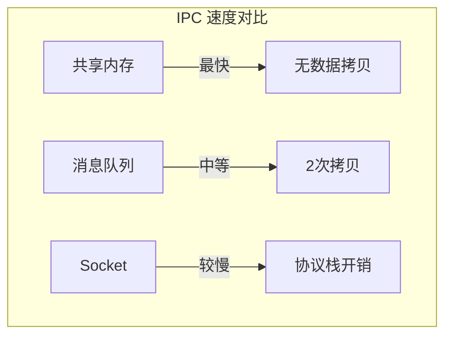
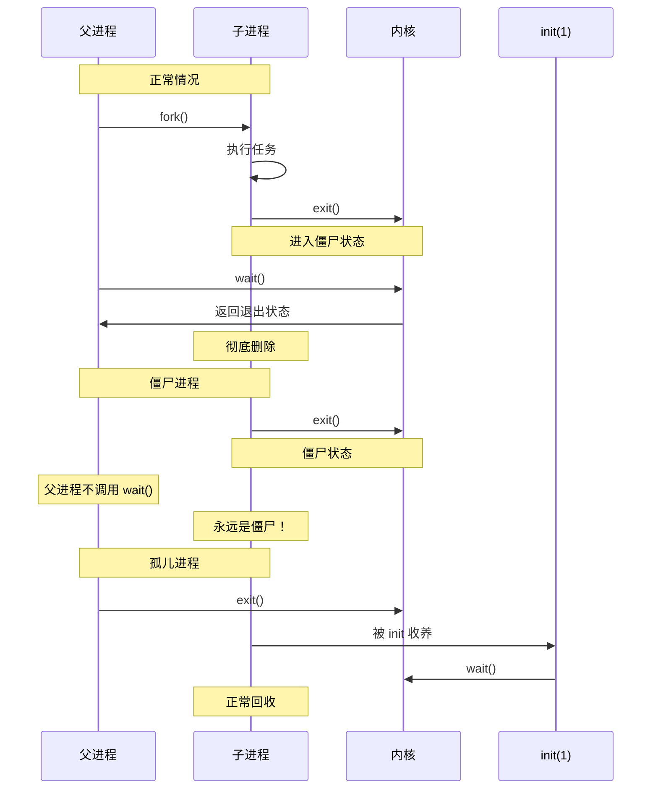
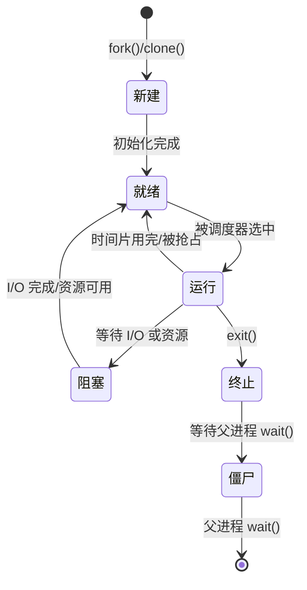
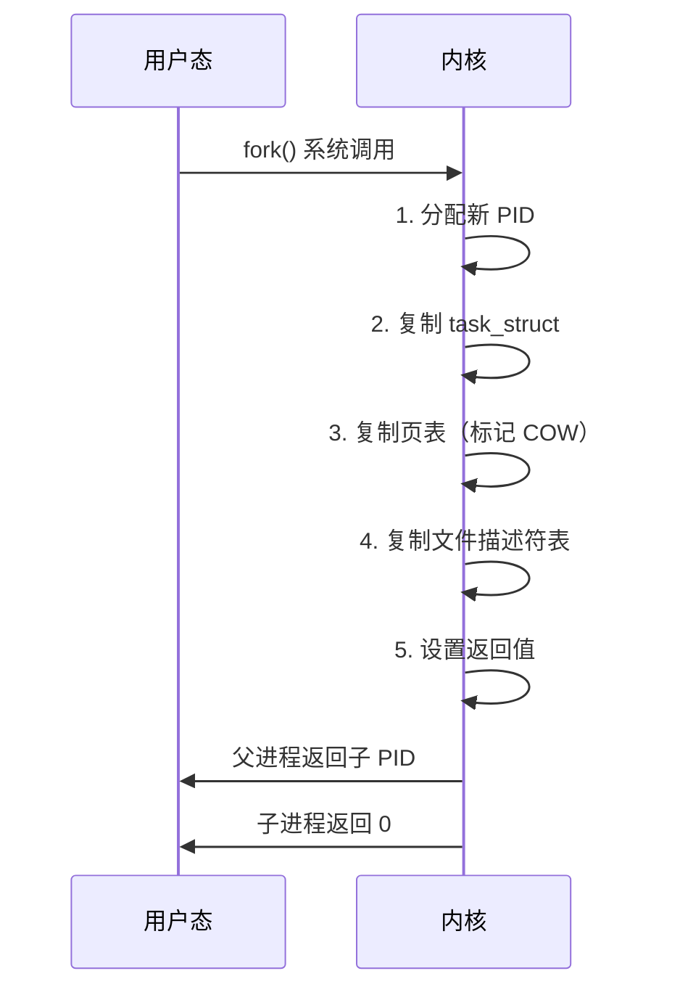

+++
title = "12. OS面试题-进程与线程"
date = 2026-01-31
weight = 12000
description = "操作系统进程与线程面试题：进程状态、线程模型、IPC机制、上下文切换深度解析"
[taxonomies]
tags = ["操作系统", "面试", "进程", "线程", "IPC"]
+++

# 操作系统面试题 - 进程与线程

本文汇集操作系统进程与线程相关的高频面试问题，采用问答深挖形式，模拟真实面试场景。

---

## 问题 1：进程和线程的区别是什么？

### 标准答案

| 维度 | 进程 | 线程 |
|------|------|------|
| 定义 | 资源分配的基本单位 | CPU 调度的基本单位 |
| 地址空间 | 独立的虚拟地址空间 | 共享进程地址空间 |
| 创建开销 | 大（需复制页表、文件描述符等） | 小（共享资源） |
| 切换开销 | 大（切换页表、TLB 刷新） | 小（只切换寄存器和栈） |
| 通信方式 | IPC（管道、共享内存等） | 直接共享内存 |
| 崩溃影响 | 不影响其他进程 | 影响整个进程 |
| 独立性 | 高 | 低 |
| 资源拥有 | 完整资源集合 | 只有栈和寄存器 |

**进程内存布局**：

```mermaid
graph TB
    subgraph 进程A[进程 A]
        Code[代码段]
        Data[数据段]
        Heap[堆]
        Stacks[线程1栈 | 线程2栈<br/>← 线程共享除栈外的所有]
        Code --> Data --> Heap --> Stacks
    end
```

### 面试官追问

**Q1: 为什么线程切换比进程切换快？**

```
进程切换需要：
1. 保存/恢复所有寄存器 ✓
2. 切换页表（写 CR3）   ✓ ~200 cycles
3. TLB 全部刷新          ✓ 后续访问变慢
4. 缓存可能失效          ✓ 跨进程不共享数据

线程切换只需要：
1. 保存/恢复寄存器       ✓
2. 切换栈指针            ✓
（共享地址空间，页表不变，TLB 有效，缓存热）

时间对比：
进程切换：~1-10 μs
线程切换：~100-500 ns
差距：10-100 倍
```

**Q2: 用户级线程和内核级线程的区别？**

| 模型 | 内核感知 | 阻塞影响 | 调度 | 多核利用 | 实现 |
|------|----------|----------|------|----------|------|
| 用户级(N:1) | ❌ | 整个进程阻塞 | 用户态库 | ❌ | 协程库 |
| 内核级(1:1) | ✅ | 只阻塞该线程 | 内核 | ✅ | pthread |
| 混合(N:M) | 部分 | 可配置 | 两级调度 | ✅ | Go goroutine |

```c
// 用户级线程示例（简化的协程调度）
struct uthread {
    void *stack;
    jmp_buf context;
};

void schedule() {
    if (setjmp(current->context) == 0) {
        current = next_thread();
        longjmp(current->context, 1);
    }
}

// 问题：如果一个用户线程调用 read() 阻塞
// 整个进程（所有用户线程）都会阻塞
```

**Q3: 协程和线程的区别？**

| 特性 | 线程 | 协程 |
|------|------|------|
| 调度者 | 内核 | 用户态调度器 |
| 切换时机 | 任意时刻被抢占 | 主动让出（yield） |
| 切换开销 | 几 μs（陷入内核） | 几十 ns（用户态） |
| 栈大小 | 固定（通常 8MB） | 可变（2KB 起） |
| 并发量 | 几千个 | 几十万个 |
| 阻塞 I/O | 阻塞整个线程 | 只阻塞当前协程 |
| 同步复杂度 | 需要锁 | 单线程内无需锁 |

```go
// Go goroutine 示例
func main() {
    for i := 0; i < 100000; i++ {
        go func(n int) {
            // 轻量级协程
            fmt.Println(n)
        }(i)
    }
    time.Sleep(time.Second)
}

// 100000 个 goroutine，内存占用约 200MB
// 100000 个线程，内存占用约 800GB（不可能）
```

**Q4: 什么是线程安全？如何实现？**

```c
// 线程不安全的代码
int counter = 0;

void increment() {
    counter++;  // 读-改-写，非原子
}

// 问题：多线程并发执行可能丢失更新

// 解决方案 1：互斥锁
pthread_mutex_t lock = PTHREAD_MUTEX_INITIALIZER;
void safe_increment() {
    pthread_mutex_lock(&lock);
    counter++;
    pthread_mutex_unlock(&lock);
}

// 解决方案 2：原子操作
#include <stdatomic.h>
atomic_int counter = 0;
void safe_increment() {
    atomic_fetch_add(&counter, 1);
}

// 解决方案 3：线程本地存储
__thread int local_counter = 0;  // 每个线程独立副本
```

---

## 问题 2：进程间通信有哪些方式？

### 标准答案

| 方式 | 特点 | 优点 | 缺点 | 适用场景 |
|------|------|------|------|----------|
| 管道 | 半双工，父子进程 | 简单 | 单向，有亲缘 | shell 管道 |
| 命名管道 | 无关进程可用 | 持久化 | 仍是单向 | 简单 IPC |
| 消息队列 | 异步，结构化 | 解耦 | 拷贝开销 | 异步通信 |
| 共享内存 | 最快 | 零拷贝 | 需要同步 | 大数据量 |
| 信号量 | 同步机制 | 简单 | 功能单一 | 资源控制 |
| 信号 | 异步通知 | 简单 | 信息量少 | 事件通知 |
| Socket | 网络/本地 | 通用 | 开销较大 | 网络通信 |



### 面试官追问

**Q1: 共享内存为什么最快？如何使用？**

```c
// 共享内存 vs 其他 IPC

// 管道/消息队列的数据流：
// 进程A用户空间 → 内核缓冲区 → 进程B用户空间
// 需要 2 次数据拷贝

// 共享内存的数据流：
// 进程A 和 进程B 映射同一块物理内存
// 0 次数据拷贝

#include <sys/shm.h>

// 创建共享内存
int shmid = shmget(IPC_PRIVATE, 4096, IPC_CREAT | 0666);

// 进程 A：映射并写入
char *ptr = shmat(shmid, NULL, 0);
strcpy(ptr, "Hello from A");

// 进程 B：映射并读取
char *ptr = shmat(shmid, NULL, 0);
printf("Got: %s\n", ptr);  // "Hello from A"

// 需要同步！共享内存不提供同步机制
// 通常配合信号量使用
```

**Q2: 详细解释管道的实现原理？**

```c
int pipefd[2];
pipe(pipefd);
// pipefd[0]：读端
// pipefd[1]：写端

// 内核中的管道结构
struct pipe_buffer {
    struct page *page;      // 数据页
    unsigned int offset;    // 偏移
    unsigned int len;       // 长度
};

struct pipe_inode_info {
    struct pipe_buffer bufs[PIPE_DEF_BUFFERS];  // 环形缓冲区
    unsigned int head;      // 写位置
    unsigned int tail;      // 读位置
    unsigned int readers;   // 读者计数
    unsigned int writers;   // 写者计数
    wait_queue_head_t wait; // 等待队列
};

// 特殊情况：
// 1. 读空管道：阻塞（或 EAGAIN，如果 O_NONBLOCK）
// 2. 写满管道：阻塞（默认 64KB 缓冲区）
// 3. 写端关闭：读到 EOF
// 4. 读端关闭：写触发 SIGPIPE
```

**Q3: 信号有哪些？如何处理？**

```c
// 常用信号
SIGHUP  (1)   // 终端挂起
SIGINT  (2)   // Ctrl+C
SIGQUIT (3)   // Ctrl+\
SIGKILL (9)   // 强制终止（不能捕获）
SIGSEGV (11)  // 段错误
SIGTERM (15)  // 请求终止
SIGCHLD (17)  // 子进程状态变化
SIGSTOP (19)  // 停止（不能捕获）

// 信号处理
#include <signal.h>

void handler(int sig) {
    printf("Received signal %d\n", sig);
}

int main() {
    // 方式1：简单注册
    signal(SIGINT, handler);
    
    // 方式2：sigaction（推荐）
    struct sigaction sa;
    sa.sa_handler = handler;
    sigemptyset(&sa.sa_mask);
    sa.sa_flags = SA_RESTART;  // 系统调用自动重启
    sigaction(SIGTERM, &sa, NULL);
    
    // 方式3：忽略信号
    signal(SIGPIPE, SIG_IGN);
    
    while(1) pause();
}

// 注意：信号处理器中只能调用异步信号安全函数
// 例如：write, _exit, signal
// 不能：printf, malloc, free（可能死锁）
```

**Q4: Unix Domain Socket vs TCP Socket 的区别？**

```c
// Unix Domain Socket（UDS）
// 用于同一机器上的进程通信

int fd = socket(AF_UNIX, SOCK_STREAM, 0);
struct sockaddr_un addr;
addr.sun_family = AF_UNIX;
strcpy(addr.sun_path, "/tmp/my.sock");
bind(fd, &addr, sizeof(addr));

// TCP Socket
// 可用于网络通信

int fd = socket(AF_INET, SOCK_STREAM, 0);
struct sockaddr_in addr;
addr.sin_family = AF_INET;
addr.sin_port = htons(8080);
addr.sin_addr.s_addr = INADDR_ANY;
bind(fd, &addr, sizeof(addr));
```

| 特性 | Unix Domain Socket | TCP Socket |
|------|-------------------|------------|
| 范围 | 本机 | 网络 |
| 性能 | 更快（无协议栈） | 较慢 |
| 数据拷贝 | 1次 | 多次 |
| 功能 | 可传递文件描述符 | 不能 |
| 地址 | 文件路径 | IP:Port |

---

## 问题 3：什么是僵尸进程和孤儿进程？

### 标准答案

| 类型 | 定义 | 危害 | 解决方法 |
|------|------|------|----------|
| 僵尸进程 | 已终止但未被父进程回收 | 占用 PID、进程表项 | wait()/waitpid() |
| 孤儿进程 | 父进程已终止 | 无（被 init 收养） | 无需处理 |



### 面试官追问

**Q1: 如何避免僵尸进程？**

```c
// 方法 1：父进程显式 wait（阻塞）
pid_t pid = fork();
if (pid > 0) {
    int status;
    wait(&status);  // 阻塞等待
    if (WIFEXITED(status)) {
        printf("Exit code: %d\n", WEXITSTATUS(status));
    }
}

// 方法 2：忽略 SIGCHLD（简单但丢失退出状态）
signal(SIGCHLD, SIG_IGN);

// 方法 3：信号处理器 + waitpid（推荐）
void sigchld_handler(int sig) {
    int status;
    pid_t pid;
    // 循环回收所有已终止子进程
    while ((pid = waitpid(-1, &status, WNOHANG)) > 0) {
        printf("Child %d exited with %d\n", pid, WEXITSTATUS(status));
    }
}
signal(SIGCHLD, sigchld_handler);

// 方法 4：双 fork（daemon 常用）
pid_t pid = fork();
if (pid == 0) {
    // 第一个子进程
    if (fork() == 0) {
        // 第二个子进程（孙进程）
        // 执行实际任务
        setsid();  // 创建新会话
        exec(...);
    }
    _exit(0);  // 第一个子进程立即退出
}
wait(NULL);  // 回收第一个子进程
// 孙进程被 init 收养，不会成为僵尸
```

**Q2: 如何查找和处理僵尸进程？**

```bash
# 查找僵尸进程
$ ps aux | awk '$8=="Z" {print}'

# 输出示例
USER  PID  %CPU %MEM   VSZ  RSS TTY STAT   TIME COMMAND
root  123  0.0  0.0      0    0 ?   Z    0:00 [defunct]

# 找到父进程
$ ps -o ppid= -p 123
456

# 查看父进程
$ ps -p 456 -o pid,cmd

# 解决方案 1：让父进程调用 wait（发送信号）
$ kill -SIGCHLD 456

# 解决方案 2：杀死父进程（僵尸被 init 收养并回收）
$ kill -9 456

# 统计僵尸进程数量
$ ps aux | awk '$8=="Z"' | wc -l
```

**Q3: 僵尸进程会耗尽系统资源吗？**

```
僵尸进程占用的资源：
- 进程表项（struct task_struct 约 2KB）
- PID 号
- 少量内核内存

不占用的资源：
- 用户空间内存（已释放）
- 文件描述符（已关闭）
- CPU 时间（不运行）

危害：
- 大量僵尸会耗尽 PID（最大 32768 或更多）
- 无法创建新进程

查看 PID 限制：
$ cat /proc/sys/kernel/pid_max
32768
```

---

## 问题 4：描述进程状态转换

### 标准答案



**Linux 进程状态详解**：

| 状态 | 标志 | 含义 | 典型场景 |
|------|------|------|----------|
| R | TASK_RUNNING | 运行或就绪 | 正在执行或在运行队列 |
| S | TASK_INTERRUPTIBLE | 可中断睡眠 | 等待 I/O、sleep() |
| D | TASK_UNINTERRUPTIBLE | 不可中断睡眠 | 等待磁盘 I/O |
| Z | EXIT_ZOMBIE | 僵尸 | 已终止等待 wait() |
| T | TASK_STOPPED | 停止 | Ctrl+Z、SIGSTOP |
| t | TASK_TRACED | 被调试 | gdb attach |
| I | TASK_IDLE | 空闲 | 内核线程 |

### 面试官追问

**Q1: R 状态的进程一定在运行吗？**

```
不一定！R 状态表示"可运行"，包括：
1. 正在 CPU 上执行
2. 在就绪队列中等待调度

区分方法：
$ ps -eo pid,stat,psr,comm
# psr 列是当前运行的 CPU 号
# 如果有值，说明正在运行
# 如果是 -，说明在队列中

或者：
$ cat /proc/<pid>/stat
# 第 39 个字段是当前 CPU
```

**Q2: D 状态（不可中断睡眠）什么时候出现？**

```c
// D 状态场景：
// 1. 等待磁盘 I/O 完成
// 2. NFS 操作（网络文件系统）
// 3. 某些内核操作

// 为什么不可中断？
// 这些操作不能被打断，否则可能导致数据不一致

// 特点：
// - 不响应任何信号（包括 SIGKILL）
// - 通常很快返回（毫秒级）
// - 长时间 D 状态可能表示硬件问题

// 查看 D 状态进程
$ ps aux | awk '$8=="D"'

// 常见原因：
// - 磁盘故障
// - NFS 服务器无响应
// - 内核 bug

// 解决方案：
// 1. 检查磁盘健康：smartctl -a /dev/sda
// 2. 检查 NFS：mount | grep nfs
// 3. 最后手段：重启
```

**Q3: 如何查看进程的详细状态？**

```bash
# 方法1：ps 命令
$ ps -o pid,stat,cmd -p <pid>

# 方法2：/proc 文件系统
$ cat /proc/<pid>/status
Name:   bash
State:  S (sleeping)
Pid:    1234
PPid:   1
Threads:        1
...

$ cat /proc/<pid>/stat
# 第 3 个字段是状态

# 方法3：top 命令
$ top -p <pid>

# 方法4：htop（更友好）
$ htop
```

---

## 问题 5：fork() 如何工作？

### 标准答案

```c
#include <unistd.h>

pid_t pid = fork();

if (pid < 0) {
    perror("fork failed");
} else if (pid == 0) {
    // 子进程
    printf("Child: PID=%d, PPID=%d\n", getpid(), getppid());
} else {
    // 父进程
    printf("Parent: PID=%d, Child=%d\n", getpid(), pid);
    wait(NULL);
}
```

**fork() 的内核工作**：



### 面试官追问

**Q1: fork() 后哪些是共享的，哪些是复制的？**

| 资源 | 处理方式 | 说明 |
|------|----------|------|
| 代码段 | 共享 | 只读，共享物理页 |
| 数据段 | COW | 写时复制 |
| 堆 | COW | 写时复制 |
| 栈 | COW | 写时复制 |
| 文件描述符表 | 复制 | 但指向相同的文件表项 |
| 文件表项 | 共享 | 偏移量共享！ |
| 环境变量 | 复制 | 各自独立 |
| 信号处理器 | 复制 | 各自独立 |
| PID | 独立 | 不同 |
| PPID | 关联 | 子进程的 PPID = 父进程的 PID |

```c
// 文件偏移量共享的影响
int fd = open("file.txt", O_RDWR);
write(fd, "AAA", 3);  // 偏移量 = 3

if (fork() == 0) {
    write(fd, "BBB", 3);  // 子进程写，偏移量 = 6
    exit(0);
}
wait(NULL);
write(fd, "CCC", 3);  // 父进程写，偏移量 = 9

// 结果：file.txt = "AAABBBCCC"
// 如果偏移量不共享，结果会是 "CCCBBB"
```

**Q2: 什么是 COW（写时复制）？**

```
COW = Copy On Write

fork() 时不真正复制内存，只复制页表：
1. 子进程共享父进程的物理页
2. 所有共享页标记为只读
3. 任何一方写入时触发缺页异常
4. 内核复制该页，各自拥有独立副本

优势：
- fork() 几乎瞬间完成
- 如果子进程立即 exec()，无需复制任何数据
- 只复制实际修改的页

示例：
父进程有 100MB 数据
fork() 后子进程立即 exec()
实际只复制几 KB（栈和页表）
```

**Q3: vfork() 和 fork() 的区别？**

```c
// vfork() 特性：
// 1. 子进程共享父进程地址空间（不是 COW，是真正共享）
// 2. 父进程阻塞直到子进程 exec() 或 _exit()
// 3. 子进程不能修改数据（未定义行为）

pid_t pid = vfork();
if (pid == 0) {
    // 子进程：必须立即 exec 或 _exit
    // 不能 return，不能修改变量
    execl("/bin/ls", "ls", NULL);
    _exit(1);  // 如果 exec 失败
}
// 父进程：在子进程 exec/exit 后继续

// vfork vs fork：
// fork：COW，父子可能同时运行
// vfork：真正共享，父进程阻塞

// 现代观点：
// - fork() 已经很快（因为 COW）
// - vfork() 风险大，容易误用
// - 推荐使用 fork() 或 posix_spawn()
```

**Q4: clone() 是什么？**

```c
// clone() 是 Linux 创建进程/线程的底层系统调用
// fork() 和 pthread_create() 都是基于 clone()

#include <sched.h>

int child_func(void *arg) {
    printf("Child\n");
    return 0;
}

int main() {
    char stack[8192];
    
    // 创建类似进程（不共享）
    clone(child_func, stack + 8192, SIGCHLD, NULL);
    
    // 创建类似线程（共享地址空间和文件）
    clone(child_func, stack + 8192,
          CLONE_VM | CLONE_FS | CLONE_FILES | CLONE_SIGHAND,
          NULL);
}

// 常用标志：
// CLONE_VM      共享地址空间
// CLONE_FS      共享文件系统信息
// CLONE_FILES   共享文件描述符表
// CLONE_SIGHAND 共享信号处理器
// CLONE_THREAD  同一线程组
// CLONE_NEWNS   新的命名空间（容器）
```

---

## 问题 6：什么是上下文切换？开销是什么？

### 标准答案

**上下文切换**：保存当前进程/线程状态，恢复另一个的状态。

**切换内容**：

| 类型 | 内容 | 保存位置 |
|------|------|----------|
| 寄存器上下文 | 通用寄存器、PC、SP、标志寄存器 | task_struct |
| 内核栈 | 内核态栈指针 | task_struct |
| 页表 | 页表基址（CR3） | mm_struct |
| FPU/SIMD | 浮点寄存器、SSE/AVX 状态 | thread_struct |
| TLS | 线程本地存储指针 | thread_struct |

**开销来源**：

| 来源 | 开销 | 说明 |
|------|------|------|
| 直接开销 | ~100-300 ns | 保存/恢复寄存器 |
| TLB 刷新 | ~1-5 μs | 进程切换时 |
| 缓存失效 | ~1-10 μs | 冷缓存访问 |
| 调度器开销 | ~100 ns | 选择下一个进程 |

### 面试官追问

**Q1: 如何测量上下文切换开销？**

```bash
# 方法1：perf
$ perf stat -e context-switches,cpu-migrations ./program

# 方法2：vmstat
$ vmstat 1
# cs 列是每秒上下文切换次数

# 方法3：/proc/stat
$ cat /proc/stat | grep ctxt
ctxt 123456789

# 方法4：编程测量
#include <time.h>
#include <sched.h>

int main() {
    struct timespec start, end;
    int iterations = 100000;
    
    clock_gettime(CLOCK_MONOTONIC, &start);
    for (int i = 0; i < iterations; i++) {
        sched_yield();  // 触发切换
    }
    clock_gettime(CLOCK_MONOTONIC, &end);
    
    long ns = (end.tv_sec - start.tv_sec) * 1e9 +
              (end.tv_nsec - start.tv_nsec);
    printf("Average: %ld ns\n", ns / iterations);
}
```

**Q2: 如何减少上下文切换？**

```c
// 1. 减少进程/线程数量
// 使用线程池，限制并发数

ThreadPool pool(num_cpus);  // 线程数 ≈ CPU 数

// 2. CPU 亲和性
cpu_set_t cpuset;
CPU_ZERO(&cpuset);
CPU_SET(0, &cpuset);
pthread_setaffinity_np(thread, sizeof(cpuset), &cpuset);

// 3. 使用异步 I/O
// 避免阻塞导致的切换
epoll_wait(epfd, events, max_events, -1);

// 4. 使用协程
// 用户态切换，不经过内核

// 5. 调整调度器参数
// 增加时间片长度
echo 10000000 > /proc/sys/kernel/sched_min_granularity_ns

// 6. 批量处理
// 减少系统调用次数
writev(fd, iovecs, n);  // 一次写多个缓冲区
```

**Q3: 自愿切换和非自愿切换的区别？**

```
自愿切换（voluntary）：
- 进程主动让出 CPU
- 原因：等待 I/O、睡眠、等待锁

非自愿切换（involuntary）：
- 进程被强制切换
- 原因：时间片用完、被高优先级抢占

查看统计：
$ cat /proc/<pid>/status | grep ctxt
voluntary_ctxt_switches:        1234
nonvoluntary_ctxt_switches:     567

分析：
- 大量自愿切换：I/O 密集型
- 大量非自愿切换：CPU 密集型，竞争激烈
```

---

## 高频考点总结

| 考点 | 频率 | 深度要求 |
|------|------|----------|
| 进程 vs 线程 | ★★★ | 多维度对比 |
| IPC 方式 | ★★★ | 各自特点、实现 |
| 状态转换 | ★★☆ | 画状态图 |
| 僵尸/孤儿进程 | ★★★ | 避免方法、实际处理 |
| fork() | ★★★ | 工作原理、COW、clone() |
| 上下文切换 | ★★★ | 开销分析、优化方法 |
| 协程 | ★★☆ | 与线程对比 |
| 信号处理 | ★★☆ | 常用信号、处理方法 |

---

## 相关文章

- [上一篇：OS笔试题-同步与死锁](@/articles/os/os-11-OS笔试题-同步与死锁.md)
- [下一篇：OS面试题-内存管理](@/articles/os/os-13-OS面试题-内存管理.md)
