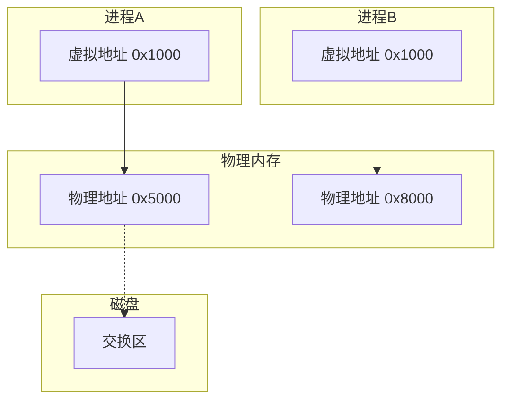
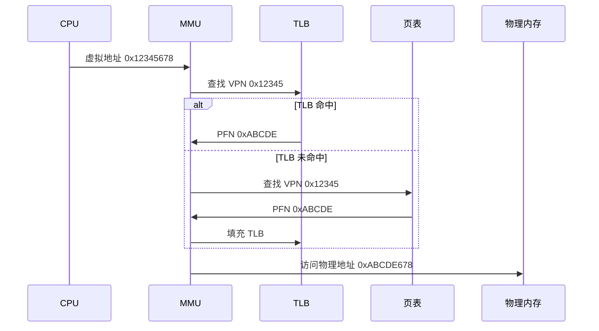
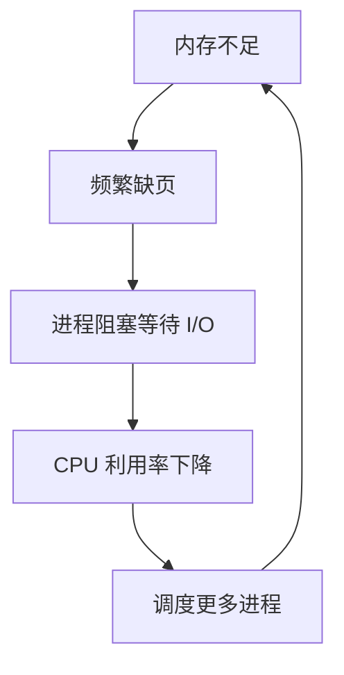
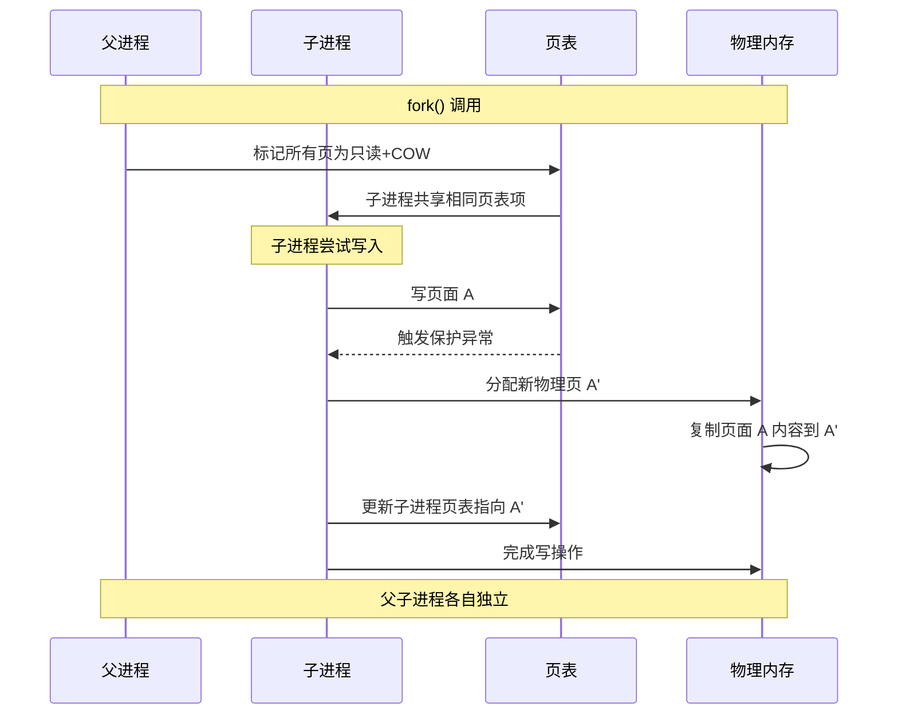

+++
title = "13.OS面试题-内存管理"
date = 2026-01-31
description = "操作系统内存管理面试题：虚拟内存、分页分段、页面置换、内存碎片深度解析"
[taxonomies]
tags = ["操作系统", "面试", "内存管理", "虚拟内存", "页表"]
+++

# 操作系统面试题 - 内存管理

本文汇集操作系统内存管理相关的高频面试问题，采用问答深挖形式，模拟真实面试场景。

---

## 问题 1：什么是虚拟内存？有什么作用？

### 标准答案

**虚拟内存**：每个进程拥有独立的虚拟地址空间，通过硬件和操作系统的配合，将虚拟地址映射到物理地址。



**虚拟内存的四大作用**：

| 作用 | 说明 | 示例 |
|------|------|------|
| **扩展空间** | 程序可使用超过物理内存的空间 | 4GB 物理内存运行 16GB 数据集 |
| **内存保护** | 进程间隔离，互不干扰 | 一个进程崩溃不影响其他 |
| **共享内存** | 多进程共享代码/库 | libc.so 只需一份物理内存 |
| **按需加载** | 延迟分配，提高效率 | mmap 大文件不立即读入 |

### 面试官追问

**Q1: 虚拟地址如何转换为物理地址？**

虚拟地址结构（4KB 页面）：

| 虚拟页号 (VPN) | 页内偏移 |
|---------------|---------|
| 高 20 位 | 低 12 位 |

**转换步骤（单级页表）**：
1. 从虚拟地址提取虚拟页号(VPN)
2. 用 VPN 作为索引查页表
3. 获取物理页帧号(PFN)
4. 物理地址 = PFN × 页大小 + 偏移

**示例（4KB 页面）**：
- 虚拟地址：`0x12345678`
- VPN = `0x12345` (高 20 位)
- 偏移 = `0x678` (低 12 位)
- 查页表：`页表[0x12345] = { PFN: 0xABCDE, flags: RW }`
- 物理地址 = `0xABCDE × 0x1000 + 0x678 = 0xABCDE678`



**Q2: TLB 的作用是什么？为什么需要它？**

```
TLB（Translation Lookaside Buffer）：
- 页表的硬件高速缓存
- 存储最近使用的虚拟页号→物理页帧映射

为什么需要 TLB？
无 TLB：每次内存访问需要多次内存访问（查页表）
- 4 级页表 = 4 次额外内存访问
- 性能降低 5 倍！

有 TLB：
- TLB 命中：~1 cycle
- TLB 未命中：~10-100 cycles（遍历页表）

典型 TLB 参数：
- 大小：64-1024 条目
- 命中率：>99%（局部性原理）
- 查找方式：全相联或组相联
- 刷新时机：进程切换、页表修改
```

**Q3: 什么是多级页表？为什么需要？**

```
问题：单级页表太大

32位地址空间，4KB页面：
页表项数 = 2^32 / 4KB = 2^20 = 1M 个
页表大小 = 1M × 4B = 4MB（每个进程！）

64位地址空间，4KB页面：
页表项数 = 2^48 / 4KB = 2^36 个
页表大小 = 2^36 × 8B = 512GB（不可能！）

解决：多级页表

**二级页表结构**：

| 一级索引 | 二级索引 | 页内偏移 |
|---------|---------|---------|
| 10位 | 10位 | 12位 |

**优势**：
- 未使用的地址空间不分配页表页
- 典型进程只需几十 KB 页表
- 稀疏地址空间友好

x86_64 四级页表：
CR3 → PGD(9位) → PUD(9位) → PMD(9位) → PTE(9位) → 页帧
       Page Global   Page Upper   Page Middle   Page Table
       Directory     Directory    Directory     Entry
```

**Q4: 页表项（PTE）包含哪些信息？**

```c
// x86 页表项结构（简化）
struct pte {
    unsigned present:1;      // 页面是否在内存
    unsigned rw:1;           // 0=只读, 1=可写
    unsigned user:1;         // 0=内核, 1=用户可访问
    unsigned accessed:1;     // 页面被访问过
    unsigned dirty:1;        // 页面被修改过
    unsigned reserved:7;     // 保留位
    unsigned pfn:20;         // 物理页帧号
};

// 各位的作用：
// Present：不在内存时触发缺页异常
// R/W：写保护（COW 实现依赖此位）
// User/Supervisor：用户态不能访问内核页
// Accessed：用于页面置换算法
// Dirty：需要写回磁盘的判断
// PFN：物理地址的高位
```

---

## 问题 2：分页和分段的区别？

### 标准答案

| 特性 | 分页 | 分段 |
|------|------|------|
| 划分依据 | 物理固定大小 | 逻辑意义（代码/数据/栈） |
| 大小 | 固定（4KB/2MB/1GB） | 可变 |
| 碎片类型 | 内部碎片 | 外部碎片 |
| 用户可见 | 透明 | 可见（段号+段内偏移） |
| 共享 | 页级别 | 段级别（更自然） |
| 保护 | 页属性（RWX） | 段属性 |
| 地址结构 | 线性虚拟地址 | 段号 + 段内偏移 |
| 硬件支持 | MMU + 页表 | 段寄存器 + 段表 |

**分段地址**：

| 段号 | 段内偏移 |
|------|---------|
| 16位 | 32位 |

**分页地址**：

| 页号 (高位) | 页内偏移 (低位) |
|------------|----------------|

### 面试官追问

**Q1: 为什么现代系统主要用分页？**

```
1. 固定大小 → 简化管理
   - 页帧统一管理
   - 硬件支持高效

2. 无外部碎片
   - 页大小固定，不会产生无法使用的碎片
   
3. 按需调页成熟
   - 页面置换算法研究充分
   - 交换粒度合适（4KB）

4. 硬件优化完善
   - TLB 专门为分页设计
   - 硬件页表遍历（x86）

5. 内存保护灵活
   - 每页独立的保护位
   - NX bit 防止代码执行攻击

分段的问题：
- 外部碎片严重
- 硬件支持不如分页成熟
- 大段难以管理
```

**Q2: 段页式是什么？还有使用吗？**

**段页式 = 分段 + 分页**

**地址结构**：

| 段号 | 页号 | 页内偏移 |
|------|------|---------|

**转换过程**：
1. 段号 → 段表 → 该段的页表基址 + 段长度
2. 检查页号是否在段长度内
3. 页号 → 页表 → 物理页帧
4. 物理地址 = 页帧 × 页大小 + 偏移

**实际使用**：
- x86 兼容模式：有段寄存器，但基址通常为 0
- x86_64 长模式：段基本被废弃（FS/GS 除外）
- 现代系统：纯分页为主

**Q3: 大页（Huge Pages）有什么优势？**

```
标准页：4KB
大页：2MB 或 1GB

优势：
1. 减少 TLB 项
   - 1GB 内存：262144 个 4KB TLB 项 vs 512 个 2MB 项
   
2. 减少页表层级
   - 2MB 页跳过 PTE 层
   - 1GB 页跳过 PMD 和 PTE 层

3. 减少缺页异常
   - 一次加载更多内容

4. 提高 TLB 命中率
   - 同样大小 TLB，覆盖更多内存

使用场景：
- 数据库缓冲池
- 虚拟机内存
- HFT 低延迟应用

配置方法：
# 预留大页
echo 128 > /proc/sys/vm/nr_hugepages

# 挂载 hugetlbfs
mount -t hugetlbfs none /mnt/huge

# 透明大页
echo always > /sys/kernel/mm/transparent_hugepage/enabled
```

---

## 问题 3：常见的页面置换算法有哪些？

### 标准答案

| 算法 | 原理 | 优点 | 缺点 |
|------|------|------|------|
| **OPT** | 替换最远将来使用 | 理论最优 | 需要未来信息，无法实现 |
| **FIFO** | 先进先出 | 简单 | Belady 异常 |
| **LRU** | 替换最久未使用 | 接近 OPT | 实现开销大 |
| **Clock** | 二次机会+环形 | 平衡性能和开销 | 近似 LRU |
| **LFU** | 替换使用次数最少 | 考虑频率 | 无法适应访问模式变化 |

### 面试官追问

**Q1: 如何高效实现 LRU？**

```c
// 方法1：时间戳（O(n) 查找最小）
struct page {
    int page_id;
    time_t last_access;
};
// 每次访问更新时间戳，置换时遍历找最小
// 问题：遍历开销大

// 方法2：栈/双向链表（O(n) 移动）
// 访问时移到栈顶，置换栈底
// 问题：移动节点开销

// 方法3：哈希表 + 双向链表（O(1)）
struct LRUCache {
    unordered_map<int, list<int>::iterator> map;
    list<int> lru_list;
    int capacity;
};

void access(int page) {
    if (map.count(page)) {
        // 移到链表头部
        lru_list.erase(map[page]);
        lru_list.push_front(page);
        map[page] = lru_list.begin();
    } else {
        if (lru_list.size() >= capacity) {
            // 删除链表尾部（最久未使用）
            int victim = lru_list.back();
            lru_list.pop_back();
            map.erase(victim);
        }
        lru_list.push_front(page);
        map[page] = lru_list.begin();
    }
}

// Linux 实际实现：近似 LRU
// 使用活跃/不活跃两个链表
// 通过访问位(Accessed bit)判断活跃性
```

**Q2: 什么是 Belady 异常？为什么会发生？**

```
Belady 异常：FIFO 算法的反直觉现象
增加物理页帧数，缺页次数反而增加

示例序列：1,2,3,4,1,2,5,1,2,3,4,5

3 帧情况：
[1]       → 缺页 1
[1,2]     → 缺页 2
[1,2,3]   → 缺页 3
[2,3,4]   → 缺页 4（替换1）
[3,4,1]   → 缺页 1（替换2）
[4,1,2]   → 缺页 2（替换3）
[1,2,5]   → 缺页 5（替换4）
[1,2,5]   → 命中 1
[1,2,5]   → 命中 2
[2,5,3]   → 缺页 3（替换1）
[5,3,4]   → 缺页 4（替换2）
[3,4,5]   → 缺页 5（替换5）
总缺页：9 次

4 帧情况：
[1,2,3,4] → 缺页 4 次
[1,2,3,4] → 命中 1,2
[2,3,4,5] → 缺页（替换1）
[2,3,4,5] → 命中
[2,3,4,5] → 命中
[3,4,5,3] → 缺页（替换2）
[4,5,3,4] → 缺页（替换之前的3）
[5,3,4,5] → 缺页（替换之前的4）
总缺页：10 次！

原因：FIFO 不是"栈算法"
栈算法：n 帧内存包含的页面 ⊆ n+1 帧内存包含的页面
LRU 是栈算法，FIFO 不是
```

**Q3: 解释 Clock 算法的工作原理**

```
Clock（二次机会算法）：

数据结构：
- 页面组成环形链表
- 每页有引用位(Reference bit)
- 时钟指针指向某个页面

当需要置换时：
循环 {
    如果当前页引用位 = 0：
        置换此页，指针前进
        退出循环
    否则：
        清除引用位（给第二次机会）
        指针前进
}

示例：
初始：P1(1) → P2(0) → P3(1) → P4(0)
            ↑ 指针

需要置换：
1. P2 引用位=0，置换 P2
2. 加载新页 Px
3. 指针移到 P3

**可视化**：页面组成环形链表：`P1(1) → P2(0) → P3(1) → P4(0) → P1...`，指针扫描时 P2 引用位为 0，被置换

增强版 Clock（考虑脏位）：
优先级：(引用位, 脏位)
(0,0) 最先淘汰
(0,1) 次之
(1,0) 再次
(1,1) 最后淘汰
```

---

## 问题 4：什么是内部碎片和外部碎片？

### 标准答案

| 类型 | 定义 | 产生原因 | 示例 |
|------|------|----------|------|
| **内部碎片** | 分配块内未使用部分 | 固定大小分配 | 请求100B，分配128B，浪费28B |
| **外部碎片** | 空闲内存分散无法利用 | 可变大小分配释放 | 总空闲1MB，最大连续100KB |

**内部碎片示例**（Buddy 系统）：请求 100KB，分配 128KB（2^7 = 128），浪费 28KB 在分配块内部

**外部碎片示例**：

| 已用 | 空闲 | 已用 | 空闲 | 已用 |
|------|------|------|------|------|
| 100K | 200K | 50K  | 300K | 150K |

总空闲 = 200K + 300K = 500K，但无法分配 400K 的连续请求！

### 面试官追问

**Q1: 如何解决碎片问题？**

| 问题 | 解决方案 | 实现 |
|------|----------|------|
| 内部碎片 | Slab 分配器 | 为常见大小对象建缓存 |
| 内部碎片 | 多种大小类 | tcmalloc、jemalloc |
| 外部碎片 | 紧凑/压缩 | 移动内存块（开销大） |
| 外部碎片 | 伙伴系统 | 合并相邻空闲块 |
| 外部碎片 | 分页 | 固定大小页，无外部碎片 |

**Q2: 伙伴系统如何工作？**

```
伙伴系统（Buddy System）：
按 2^n 字节（或页）管理内存块

空闲链表：
order-0:  2^0 = 1 个页 (4KB)
order-1:  2^1 = 2 个页 (8KB)
order-2:  2^2 = 4 个页 (16KB)
...
order-10: 2^10 = 1024 个页 (4MB)

分配 100KB（需要 128KB = 32 页 = order-5）：
1. order-5 链表为空
2. 找到 order-6（64页）块
3. 分割成两个 order-5 块（32+32页）
4. 一个给请求，一个加入 order-5 链表

释放时合并：
1. 计算伙伴地址：块地址 XOR 块大小
2. 检查伙伴是否空闲
3. 如果空闲，合并成更大块
4. 递归向上合并

可视化：
256KB 块初始状态
[          256KB          ]

分配 64KB：
[64KB|64KB|    128KB      ]
  ↑
分配给请求，其他成为新块

优点：减少外部碎片（合并机制）
缺点：仍有内部碎片（2^n 对齐）
```

**Q3: 为什么 Linux 同时使用 Buddy 和 Slab？**

```
Buddy 系统问题：
最小分配单位 = 1 页 = 4KB
分配 64 字节：浪费 4096-64 = 4032 字节（98%浪费！）

解决方案：Slab 分配器

Slab 在 Buddy 之上：
1. Buddy 分配整页给 Slab
2. Slab 将页切分成固定大小对象
3. 为常用大小（64B, 128B, 192B...）建立缓存

| 层次 | 职责 |
|------|------|
| **Buddy System** | 管理物理页，order-0~10 |
| **Slab/SLUB** | 管理页内小对象，kmalloc |
| **kmalloc** | 内核内存分配接口 |

kmalloc(64, GFP_KERNEL) 流程：
1. 选择 kmalloc-64 缓存
2. 从该缓存获取空闲对象
3. 如果缓存空，从 Buddy 申请页面
4. 将页面切分成 64B 对象
```

---

## 问题 5：什么是抖动（Thrashing）？

### 标准答案

**定义**：进程频繁换页，导致 CPU 大部分时间花在处理缺页而非执行指令。

```
正常运行（低缺页率）：
[计算][计算][计算][换页][计算][计算][计算]
CPU 利用率高

抖动状态（高缺页率）：
[换页][换页][换页][换页][换页][换页][换页]
CPU 利用率极低，系统响应迟缓
```

**抖动的恶性循环**：



### 面试官追问

**Q1: 如何检测抖动？**

```bash
# 1. 监控缺页率
$ vmstat 1
procs -----------memory---------- ---swap-- -----io----
 r  b   swpd   free   buff  cache   si   so    bi    bo
 1  5 100000  1000   1000  10000  1000 2000  3000  4000
                                   ↑    ↑
                              swap in/out 高 = 抖动

# 2. 监控 CPU 利用率
$ top
# CPU 利用率低，但系统很卡

# 3. 检查进程状态
$ ps aux | awk '$8=="D"' | wc -l
# 大量 D 状态进程（等待 I/O）

# 4. 使用 sar
$ sar -W 1
# pswpin/s 和 pswpout/s 高

# 特征组合：
# - CPU 利用率低（<30%）
# - swap 活动高
# - 系统响应慢
# - 大量进程等待 I/O
```

**Q2: 如何解决抖动？**

```
短期解决：
1. 减少多道程序度
   - 挂起部分进程
   - 释放内存给关键进程

2. 杀死内存占用大的进程
   $ ps aux --sort=-%mem | head
   $ kill -9 <pid>

3. 增加 swap（临时缓解）
   $ dd if=/dev/zero of=/swapfile bs=1G count=4
   $ mkswap /swapfile
   $ swapon /swapfile

长期解决：
1. 增加物理内存

2. 优化应用程序
   - 减少内存占用
   - 改善访问局部性

3. 使用工作集策略
   - 只允许工作集能装入内存的进程运行

4. 调整 vm 参数
   $ echo 10 > /proc/sys/vm/swappiness  # 减少 swap 使用
```

**Q3: 什么是工作集模型？**

```
工作集（Working Set）：
定义：进程在时间窗口 Δ 内访问的页面集合
WS(t, Δ) = {t-Δ 到 t 时间内访问过的页面}

性质：
- 反映程序的局部性
- 较小的 Δ → 较小的工作集
- 随时间变化

工作集模型策略：
1. 跟踪每个进程的工作集大小 |WS_i|
2. 总工作集 = Σ|WS_i|
3. 如果 Σ|WS_i| > 物理内存
   - 挂起部分进程
   - 直到 Σ|WS_i| ≤ 物理内存
4. 被挂起进程的页面可被回收

实现挑战：
- 精确跟踪工作集开销大
- 实际使用近似方法（如 Clock 算法）

公式：
D = Σ WS_i (总页面需求)
如果 D > m (物理页帧数)
  → 抖动
  → 挂起进程直到 D ≤ m
```

---

## 问题 6：解释写时复制（COW）

### 标准答案

**Copy-On-Write（COW）**：
- 延迟复制优化
- 多个进程共享只读页面
- 写操作时才实际复制



### 面试官追问

**Q1: COW 的完整实现流程？**

```c
// fork() 时：
for (每个可写页面) {
    // 1. 设置页表项只读
    pte.writable = 0;
    // 2. 设置 COW 标志
    pte.cow = 1;
    // 3. 增加页面引用计数
    page->ref_count++;
}
// 复制页表结构（不复制页面内容）

// 写操作时触发缺页异常：
page_fault_handler() {
    if (is_cow_page(faulting_address)) {
        old_page = get_page(faulting_address);
        
        if (old_page->ref_count == 1) {
            // 只有一个引用，直接设为可写
            pte.writable = 1;
            pte.cow = 0;
        } else {
            // 多个引用，需要复制
            new_page = alloc_page();
            copy_page(new_page, old_page);
            
            // 更新页表
            pte.pfn = page_to_pfn(new_page);
            pte.writable = 1;
            pte.cow = 0;
            
            // 减少旧页引用
            old_page->ref_count--;
        }
        
        flush_tlb(faulting_address);
        return RESTART_INSTRUCTION;
    }
    
    // 不是 COW 页面，真正的保护错误
    send_signal(SIGSEGV);
}
```

**Q2: COW 在哪些场景使用？**

```
1. fork() 系统调用
   - 最经典的 COW 应用
   - fork+exec 模式极其高效

2. mmap() 私有映射
   void *p = mmap(NULL, size, PROT_READ|PROT_WRITE,
                  MAP_PRIVATE, fd, 0);
   - 多进程共享文件映射
   - 写时创建私有副本

3. 快照和备份
   - 文件系统快照（Btrfs, ZFS）
   - 虚拟机快照

4. 虚拟机内存
   - KVM 使用 COW 创建 VM 快照
   - 容器共享基础镜像

5. 数据库
   - MVCC（多版本并发控制）
   - 写时复制页面
```

**Q3: COW 有什么潜在问题？**

```
1. 写放大
   - 修改 1 字节需要复制整个页面（4KB）
   - 随机写模式下开销大

2. 延迟不确定
   - 写操作可能触发复制
   - 对延迟敏感应用（HFT）需要预热

3. 内存使用难预测
   - 共享时内存少，写入后增加
   - 容易低估内存需求

4. TLB 失效
   - 页表项更新需要刷新 TLB
   - 多核下需要 IPI 通知其他 CPU

解决方案：
- 预热关键内存区域
- 使用 mlock() 锁定内存
- 监控 cow fault 统计
  $ cat /proc/vmstat | grep cow
```

---

## 高频考点总结

| 考点 | 频率 | 深度要求 |
|------|------|----------|
| 虚拟内存概念 | ★★★ | 作用和地址转换 |
| 分页 vs 分段 | ★★★ | 对比，现代选择 |
| 多级页表 | ★★★ | 结构和优势 |
| TLB | ★★★ | 作用和刷新 |
| 页面置换算法 | ★★★ | LRU 实现，Clock |
| 碎片问题 | ★★☆ | 类型和解决方案 |
| 抖动 | ★★☆ | 检测和解决 |
| COW | ★★★ | 原理和应用 |
| Buddy/Slab | ★★☆ | 配合使用 |

---

## 相关文章

- [上一篇：OS面试题-进程与线程](/articles/os/os-12-OS面试题-进程与线程/)
- [下一篇：OS面试题-文件系统](/articles/os/os-14-OS面试题-文件系统/)
