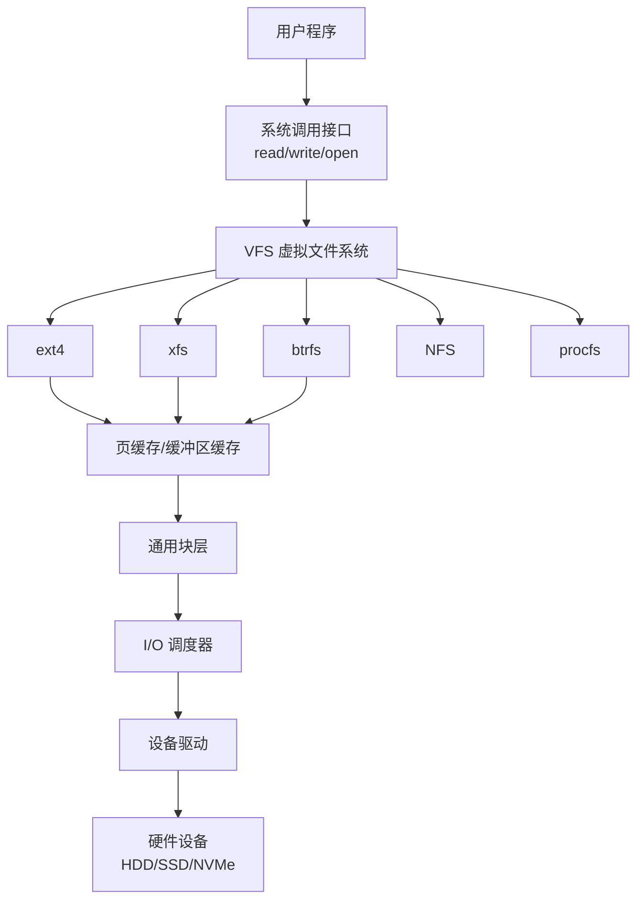
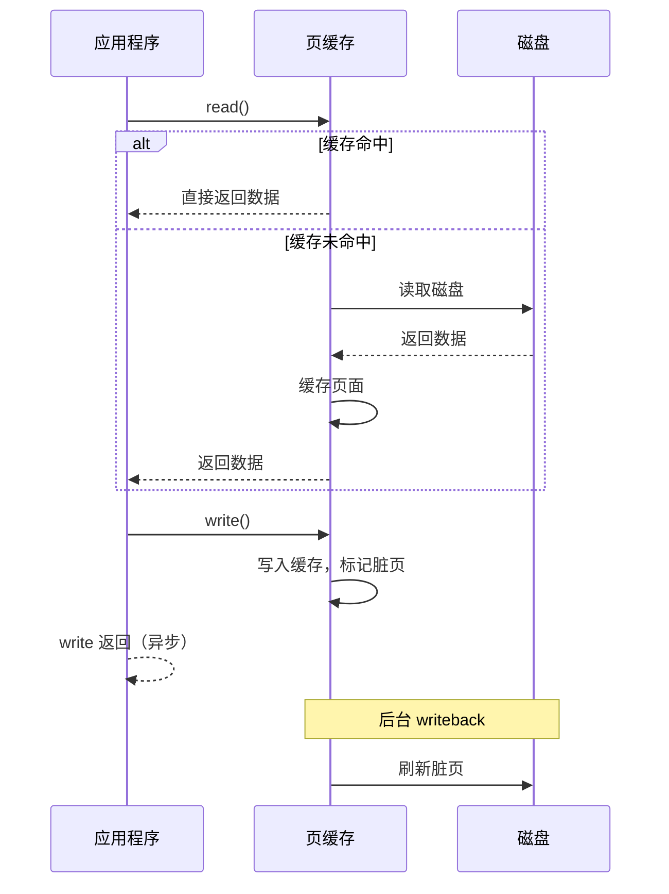

+++
title = "14.OS面试题-文件系统"
date = 2026-01-31
description = "操作系统文件系统面试题：inode、文件描述符、VFS、磁盘调度深度解析"
[taxonomies]
tags = ["操作系统", "面试", "文件系统", "inode", "VFS"]
+++

# 操作系统面试题 - 文件系统

本文汇集操作系统文件系统相关的高频面试问题，采用问答深挖形式，模拟真实面试场景。

---

## 问题 1：描述文件系统的层次结构

### 标准答案



**各层职责**：

| 层次 | 职责 | 示例 |
|------|------|------|
| VFS | 统一文件系统接口 | 屏蔽 ext4/xfs 差异 |
| 具体文件系统 | 管理文件布局、元数据 | ext4 inode、extent |
| 页缓存 | 缓存磁盘数据 | 减少磁盘 I/O |
| 通用块层 | 抽象块设备 | 请求合并、排队 |
| I/O 调度器 | 优化 I/O 顺序 | SCAN、deadline |
| 设备驱动 | 硬件控制 | SATA、NVMe 驱动 |

### 面试官追问

**Q1: VFS 的作用是什么？核心数据结构有哪些？**

```c
// VFS（Virtual File System）作用：
// 1. 统一接口：所有文件系统使用相同 API
// 2. 抽象层：屏蔽底层文件系统差异
// 3. 多文件系统共存：ext4、NFS、procfs 等

// 核心数据结构

// 1. superblock：文件系统级别元数据
struct super_block {
    struct list_head s_files;    // 打开的文件列表
    struct dentry *s_root;       // 根目录项
    struct super_operations *s_op;  // 操作函数表
    unsigned long s_blocksize;   // 块大小
    // ...
};

// 2. inode：文件元数据
struct inode {
    umode_t i_mode;              // 权限和类型
    uid_t i_uid;                 // 所有者
    loff_t i_size;               // 文件大小
    struct timespec64 i_mtime;   // 修改时间
    struct inode_operations *i_op;
    struct file_operations *i_fop;
    // ...
};

// 3. dentry：目录项（路径名到 inode 的映射）
struct dentry {
    struct dentry *d_parent;     // 父目录项
    struct qstr d_name;          // 文件名
    struct inode *d_inode;       // 对应的 inode
    // ...
};

// 4. file：打开的文件实例
struct file {
    struct path f_path;          // 路径
    struct inode *f_inode;       // inode
    const struct file_operations *f_op;
    loff_t f_pos;                // 当前偏移
    // ...
};
```

**Q2: 什么是 dentry 缓存？为什么重要？**

```
dentry（目录项）缓存：

作用：缓存路径名到 inode 的映射

查找 /home/user/file.txt 流程：
无缓存时：
1. 读取根目录 inode
2. 在根目录中查找 "home"
3. 读取 home 目录 inode
4. 在 home 中查找 "user"
5. 读取 user 目录 inode
6. 在 user 中查找 "file.txt"
每步可能涉及磁盘 I/O！

有缓存时：
1. 检查 dentry 缓存
2. 直接获取 file.txt 的 inode
一次内存访问！

dentry 状态：
- 正在使用（有 file 引用）：不能回收
- 未使用（在 LRU 中）：可回收
- 负面（表示文件不存在）：加速失败查找

优化效果：
- ls 相同目录只需查找一次
- 编译时大量文件访问显著加速
```

**Q3: open() 系统调用的完整过程是什么？**

```c
// open("/home/user/file.txt", O_RDWR)

// 步骤 1：路径解析
// 从根目录开始，逐级查找 dentry
// / → home → user → file.txt
// 每级检查 dentry 缓存

// 步骤 2：权限检查
// 检查每级目录的执行权限（x）
// 检查目标文件的读写权限

// 步骤 3：获取或创建 inode
// 如果 inode 不在内存，从磁盘读取
// 填充 inode 结构体

// 步骤 4：分配 file 结构
struct file *f = alloc_file();
f->f_inode = inode;
f->f_pos = 0;
f->f_op = inode->i_fop;

// 步骤 5：分配文件描述符
int fd = get_unused_fd();
fd_table[fd] = f;

// 步骤 6：调用文件系统的 open 操作
if (f->f_op->open)
    f->f_op->open(inode, f);

// 步骤 7：返回文件描述符
return fd;
```

---

## 问题 2：什么是 inode？包含哪些信息？

### 标准答案

**inode（索引节点）**：存储文件元数据的数据结构，不包含文件名。

```
inode 内容：
┌─────────────────────────────────────────────┐
│ 文件类型                                     │
│ （普通文件/目录/符号链接/设备/管道/套接字）   │
├─────────────────────────────────────────────┤
│ 权限（rwxrwxrwx）+ SUID/SGID/Sticky         │
├─────────────────────────────────────────────┤
│ 所有者 UID / 组 GID                          │
├─────────────────────────────────────────────┤
│ 文件大小（字节）                             │
├─────────────────────────────────────────────┤
│ 时间戳                                       │
│   atime：最后访问时间                        │
│   mtime：最后修改时间（内容）                │
│   ctime：最后状态变化时间（元数据）          │
├─────────────────────────────────────────────┤
│ 硬链接计数                                   │
├─────────────────────────────────────────────┤
│ 数据块指针（直接/间接）                      │
├─────────────────────────────────────────────┤
│ 扩展属性（xattr）                            │
└─────────────────────────────────────────────┘

不包含：文件名！（文件名在目录项中）
```

**数据块指针结构**（传统 Unix/ext2）：

```
┌─────────────────┐
│ 12 个直接指针   │──→ 12 × 4KB = 48KB
├─────────────────┤
│ 一级间接指针    │──→ 1024 × 4KB = 4MB
├─────────────────┤
│ 二级间接指针    │──→ 1024² × 4KB = 4GB
├─────────────────┤
│ 三级间接指针    │──→ 1024³ × 4KB = 4TB
└─────────────────┘

ext4 使用 extent（区段）更高效：
struct ext4_extent {
    __le32 ee_block;      // 逻辑块号
    __le16 ee_len;        // 区段长度（连续块数）
    __le16 ee_start_hi;   // 物理块号高位
    __le32 ee_start_lo;   // 物理块号低位
};
// 一个 extent 可描述连续的块，减少元数据
```

### 面试官追问

**Q1: 硬链接和软链接的详细区别？**

| 特性 | 硬链接 | 软链接（符号链接） |
|------|--------|-------------------|
| 本质 | 目录项指向同一 inode | 新 inode，存储目标路径 |
| inode 号 | 相同 | 不同 |
| 跨文件系统 | ❌ 不可以 | ✅ 可以 |
| 对目录 | ❌ 通常禁止（防止循环） | ✅ 可以 |
| 删除原文件 | 仍可访问（引用计数）| 失效（悬空链接） |
| 链接计数 | 增加 | 不影响原文件 |
| 文件大小 | 相同（共享内容） | 存储路径长度 |
| 磁盘空间 | 只增加目录项 | 新 inode + 数据块 |

```bash
# 硬链接示例
$ echo "hello" > file.txt
$ ln file.txt hardlink
$ ls -li
123456 -rw-r--r-- 2 user user 6 file.txt
123456 -rw-r--r-- 2 user user 6 hardlink  # 同一 inode
$ rm file.txt
$ cat hardlink  # 仍然可以访问
hello

# 软链接示例
$ ln -s file.txt softlink
$ ls -li
123456 -rw-r--r-- 1 user user 6 file.txt
123457 lrwxrwxrwx 1 user user 8 softlink -> file.txt
$ rm file.txt
$ cat softlink  # 错误！目标不存在
cat: softlink: No such file or directory
```

**Q2: 为什么硬链接不能跨文件系统？**

```
原因：inode 号只在文件系统内唯一

文件系统 A：
inode 12345 → 文件内容 X

文件系统 B：
inode 12345 → 文件内容 Y（完全不同的文件！）

如果允许跨文件系统硬链接：
- B 上创建硬链接指向 A 的 inode 12345
- B 会认为是自己的 inode 12345
- 指向了错误的文件！

软链接可以跨文件系统：
- 软链接存储的是路径字符串
- 访问时重新解析路径
- 可以指向任何位置
```

**Q3: 为什么硬链接通常禁止指向目录？**

```
原因：防止循环引用，导致遍历无限循环

示例：
/home/user/
  ├── dir/
  │   └── link → /home/user/  # 如果允许

遍历时：
/home/user/
  dir/
    link/（回到 /home/user/）
      dir/
        link/
          ...无限循环！

find、du、rm -r 等命令会死循环

软链接允许指向目录：
- 遍历时可以检测符号链接
- 有 -L/-P 选项控制是否跟随
- 系统工具知道如何处理
```

---

## 问题 3：文件描述符是什么？

### 标准答案

**三层结构**：

```
进程空间              内核空间
┌──────────────┐     ┌──────────────────────────────────────────┐
│ 进程 A       │     │                                          │
│ ┌──────────┐ │     │  系统打开文件表          inode 表        │
│ │ fd 0 ────┼─┼─────┼──→ [file 1] ──────────→ [inode 1]       │
│ │ fd 1 ────┼─┼─────┼──→ [file 2] ──┐                         │
│ │ fd 2 ────┼─┼─────┼──→ [file 3]   │                         │
│ │ fd 3 ────┼─┼─┐   │               └────────→ [inode 2]      │
│ └──────────┘ │ │   │                                          │
└──────────────┘ │   │  ┌─────────────────────┐                 │
                 │   │  │ file 结构           │                 │
┌──────────────┐ │   │  │ - f_pos (偏移量)    │                 │
│ 进程 B       │ │   │  │ - f_flags (标志)    │                 │
│ ┌──────────┐ │ │   │  │ - f_count (引用数)  │                 │
│ │ fd 0 ────┼─┼─┘   │  │ - f_inode (指针)    │                 │
│ │ fd 3 ────┼─┼─────┼──→ [file 4] ──────────→ [inode 1]       │
│ └──────────┘ │     │                    (同一文件)            │
└──────────────┘     └──────────────────────────────────────────┘

关键点：
- 每个进程有自己的 fd 表
- 多个 fd 可以指向同一个 file 结构（dup）
- 多个 file 结构可以指向同一个 inode（独立打开同一文件）
- file 结构包含偏移量，inode 包含文件内容
```

### 面试官追问

**Q1: fork 后父子进程共享文件描述符吗？**

```c
int fd = open("file.txt", O_RDWR);
write(fd, "AAA", 3);  // 偏移量变为 3

if (fork() == 0) {
    // 子进程
    // 复制了 fd 表，但指向相同的 file 结构
    // 共享偏移量！
    write(fd, "BBB", 3);  // 从偏移量 3 开始写，变为 6
    exit(0);
}

wait(NULL);
write(fd, "CCC", 3);  // 从偏移量 6 开始写，变为 9

// 文件内容："AAABBBCCC"

// 对比：分别打开同一文件
int fd1 = open("file.txt", O_RDWR);  // 父进程
int fd2 = open("file.txt", O_RDWR);  // 子进程
// fd1 和 fd2 有独立的 file 结构
// 各自有独立的偏移量
```

**Q2: dup 和 dup2 的作用？**

```c
// dup：复制文件描述符，返回新的最小可用 fd
int newfd = dup(oldfd);
// oldfd 和 newfd 指向同一 file 结构
// 共享偏移量和标志

// dup2：复制到指定 fd
int result = dup2(oldfd, newfd);
// 如果 newfd 已打开，先关闭
// newfd 现在指向 oldfd 的 file 结构

// 实际应用：实现重定向

// 重定向标准输出到文件
int fd = open("output.txt", O_WRONLY | O_CREAT | O_TRUNC, 0644);
dup2(fd, STDOUT_FILENO);  // 1 现在指向 output.txt
close(fd);  // 不再需要 fd
printf("This goes to file\n");  // 写入 output.txt

// 实现管道：ls | wc
int pipefd[2];
pipe(pipefd);
if (fork() == 0) {
    // 子进程执行 ls
    dup2(pipefd[1], STDOUT_FILENO);  // stdout → 管道写端
    close(pipefd[0]);
    close(pipefd[1]);
    execlp("ls", "ls", NULL);
}
// 父进程执行 wc
dup2(pipefd[0], STDIN_FILENO);  // stdin → 管道读端
close(pipefd[0]);
close(pipefd[1]);
execlp("wc", "wc", NULL);
```

**Q3: 文件描述符用完了怎么办？**

```bash
# 查看限制
$ ulimit -n
1024

# 查看当前使用
$ ls -l /proc/<pid>/fd | wc -l
$ lsof -p <pid> | wc -l

# 临时修改（当前 shell 及子进程）
$ ulimit -n 65535

# 永久修改
# /etc/security/limits.conf
* soft nofile 65535
* hard nofile 65535

# systemd 服务
# /etc/systemd/system/myservice.service
[Service]
LimitNOFILE=65535

# 系统级限制
$ cat /proc/sys/fs/file-max
# 系统级最大打开文件数
$ echo 100000 > /proc/sys/fs/file-max

# 问题排查：文件描述符泄漏
$ lsof -p <pid> | awk '{print $9}' | sort | uniq -c | sort -rn
# 找出打开最多的文件类型
```

---

## 问题 4：文件系统如何保证一致性？

### 标准答案

| 机制 | 说明 | 优缺点 |
|------|------|--------|
| **日志（Journal）** | 操作先写日志再写数据 | 恢复快，写放大 |
| **COW** | 写时复制，不覆盖原数据 | 快照支持，碎片化 |
| **同步写** | O_SYNC 强制刷盘 | 可靠，慢 |
| **fsync** | 刷新特定文件到磁盘 | 控制粒度细 |
| **软更新** | 按依赖顺序写入 | 复杂，FreeBSD |

### 面试官追问

**Q1: 日志文件系统如何工作？**

```
ext4 日志流程：

1. 准备阶段
   - 收集要写的元数据（可能包括数据）
   - 创建事务

2. 写日志
   - 将事务写入日志区域
   - 写入提交块（表示事务完整）

3. 检查点
   - 将修改应用到实际位置
   - 更新文件系统

4. 回收日志空间
   - 事务完成后，日志空间可重用

ext4 三种日志模式：

1. journal 模式（最安全）
   数据和元数据都先写日志
   写放大：每个数据写两次
   
2. ordered 模式（默认）
   只有元数据写日志
   数据先于元数据写入（保证一致性）
   
3. writeback 模式（最快）
   只有元数据写日志
   数据和元数据顺序无保证
   可能看到旧数据

崩溃恢复：
1. 挂载时扫描日志
2. 找到已提交但未检查点的事务
3. 重放这些事务
4. 丢弃未提交的事务
```

**Q2: fsync 和 fdatasync 的区别？**

```c
// fsync：刷新数据 + 所有元数据
int fsync(int fd);
// 包括：文件内容、大小、修改时间、权限等

// fdatasync：只刷新数据和必要元数据
int fdatasync(int fd);
// 包括：文件内容、大小（如果变化）
// 不包括：访问时间、修改时间（如果大小不变）

// 性能差异
// fdatasync 更快：
// - 不需要更新时间戳
// - 减少一次 inode 写入

// 使用场景
// 数据库 WAL：fdatasync 足够（只关心数据）
// 关键配置：fsync（需要完整元数据）

// 常见错误：认为 write 后数据已持久化
write(fd, data, size);  // 只是写入页缓存
// 系统崩溃可能丢失！

// 正确做法
write(fd, data, size);
fsync(fd);  // 确保持久化
```

**Q3: O_SYNC 和 O_DIRECT 的区别？**

```c
// O_SYNC：同步写，每次 write 都等待数据到达磁盘
int fd = open("file", O_WRONLY | O_SYNC);
write(fd, data, size);  // 阻塞直到数据在磁盘上
// 优点：数据安全
// 缺点：非常慢（每次都等待磁盘）

// O_DIRECT：绕过页缓存，直接读写磁盘
int fd = open("file", O_RDWR | O_DIRECT);
// 要求：缓冲区地址和大小必须对齐（通常 512 或 4096）
posix_memalign(&buf, 4096, 4096);
write(fd, buf, 4096);
// 优点：避免双缓冲（应用有自己的缓存时）
// 缺点：失去页缓存的好处，需要自己管理缓冲

// 组合使用
O_SYNC | O_DIRECT  // 直接 I/O + 同步

// 数据库常用模式
O_DIRECT  // 数据文件（数据库有自己的缓存）
O_SYNC    // WAL 文件（需要持久化保证）
```

---

## 问题 5：常见的磁盘调度算法

### 标准答案

| 算法 | 原理 | 优点 | 缺点 |
|------|------|------|------|
| **FCFS** | 先来先服务 | 简单公平 | 性能差 |
| **SSTF** | 最短寻道时间优先 | 高吞吐 | 可能饥饿 |
| **SCAN** | 电梯算法 | 公平 | 边缘延迟高 |
| **C-SCAN** | 单向扫描 | 更公平 | 总移动距离大 |
| **LOOK** | 优化 SCAN | 不走到边缘 | 实现稍复杂 |

### 面试官追问

**Q1: 详细解释 SCAN（电梯）算法**

```
SCAN 算法：
磁头从一端移动到另一端，服务沿途请求，到达边缘后反向

请求队列：98, 183, 37, 122, 14, 124, 65, 67
当前位置：53，向磁道号增加方向移动

移动顺序：
53 → 65 → 67 → 98 → 122 → 124 → 183 → [边界 199]
   → 37 → 14

图示：
0    14   37   53   65 67    98  122 124      183    199
|----↑----↑----|----↑--↑-----↑---↑---↑---------↑------|
     9    8         1  2     3   4   5         6      7
                    |                          |
              开始位置                     到达边界后反向

总移动距离：
(199 - 53) + (199 - 14) = 146 + 185 = 331

C-SCAN 变体：
到达边界后直接返回起点，只单向服务
更公平（边缘和中间请求等待时间相近）
```

**Q2: SSD 需要磁盘调度吗？**

```
SSD 特点：
- 无机械寻道（没有磁头移动）
- 随机访问延迟 ≈ 顺序访问延迟
- 内部有 FTL（Flash Translation Layer）
- 支持高并发（多通道、多芯片）

SSD 调度策略：
1. noop/none
   - 不做任何排序
   - 直接按到达顺序处理
   - 适合 SSD

2. deadline/mq-deadline
   - 保证请求不会无限期等待
   - 控制最大延迟
   - 仍有价值（防止饥饿）

3. kyber（新调度器）
   - 专为快速设备设计
   - 区分读写请求
   - 低开销

查看和设置：
$ cat /sys/block/sda/queue/scheduler
[mq-deadline] none

$ echo none > /sys/block/nvme0n1/queue/scheduler

SSD 调度的意义：
- 合并相邻请求（减少请求数）
- 读写优先级控制
- 延迟保证
```

---

## 问题 6：什么是页缓存？

### 标准答案

**页缓存（Page Cache）**：
- 内核用于缓存磁盘数据的内存区域
- 以页（4KB）为单位管理
- 对应用透明



### 面试官追问

**Q1: 如何查看和管理页缓存？**

```bash
# 查看内存使用
$ free -h
              total    used    free  shared  buff/cache   available
Mem:           15Gi   4.5Gi   1.0Gi   500Mi       10Gi       10Gi

# buff/cache 包含页缓存和缓冲区缓存

# 详细信息
$ cat /proc/meminfo | grep -E "Cached|Buffers|Dirty"
Buffers:          512000 kB   # 块设备元数据缓存
Cached:          8000000 kB   # 页缓存
Dirty:              5000 kB   # 脏页

# 查看特定文件的缓存状态
$ vmtouch file.txt
           Files: 1
     Directories: 0
  Resident Pages: 256/256  100%

# 清除缓存（测试用，生产慎用！）
sync  # 先刷新脏页
echo 1 > /proc/sys/vm/drop_caches  # 清除页缓存
echo 2 > /proc/sys/vm/drop_caches  # 清除目录项和 inode 缓存
echo 3 > /proc/sys/vm/drop_caches  # 清除全部

# 调整脏页刷新策略
$ sysctl vm.dirty_ratio            # 脏页占内存比例上限
$ sysctl vm.dirty_background_ratio # 后台刷新触发比例
$ sysctl vm.dirty_expire_centisecs # 脏页过期时间
```

**Q2: 预读（Readahead）是什么？**

```c
// 预读：检测到顺序读取时，提前读取后续数据

// 触发条件
// 1. 连续读取同一文件
// 2. 读取位置连续增加

// 预读窗口动态调整
// 初始：较小（128KB）
// 确认顺序模式后：增大（最大 2MB）
// 检测到随机访问：关闭预读

// 手动控制预读
posix_fadvise(fd, offset, len, POSIX_FADV_SEQUENTIAL);  // 顺序访问提示
posix_fadvise(fd, offset, len, POSIX_FADV_RANDOM);      // 随机访问提示
posix_fadvise(fd, offset, len, POSIX_FADV_WILLNEED);    // 预加载到缓存

// 命令行工具
$ blockdev --setra 4096 /dev/sda  # 设置预读扇区数

// 预读对 HFT 的影响
// 好处：顺序读取更快
// 坏处：可能污染缓存、增加延迟抖动
// HFT 通常禁用或减小预读
```

**Q3: 什么情况下应该绕过页缓存？**

```c
// 使用 O_DIRECT 绕过页缓存

// 适合绕过的场景：
// 1. 应用有自己的缓存（数据库缓冲池）
// 2. 一次性读取大文件（不会再次访问）
// 3. 需要精确控制 I/O 时机
// 4. 避免缓存污染

// 不适合绕过的场景：
// 1. 普通文件读写
// 2. 重复访问的数据
// 3. 小 I/O 操作

// 使用示例
int fd = open("datafile", O_RDWR | O_DIRECT);
void *buf;
posix_memalign(&buf, 4096, 4096);  // 必须对齐！
pread(fd, buf, 4096, offset);

// 告知内核数据不需要缓存
posix_fadvise(fd, 0, 0, POSIX_FADV_DONTNEED);
```

---

## 高频考点总结

| 考点 | 频率 | 深度要求 |
|------|------|----------|
| inode 结构 | ★★★ | 内容、链接区别 |
| 文件描述符 | ★★★ | 三层结构、fork 共享 |
| VFS | ★★★ | 核心对象、open 流程 |
| 日志文件系统 | ★★☆ | 三种模式、恢复原理 |
| 页缓存 | ★★★ | 读写流程、预读 |
| 磁盘调度 | ★★☆ | SCAN 算法、SSD |
| fsync/O_DIRECT | ★★☆ | 区别和使用场景 |

---

## 相关文章

- [上一篇：OS面试题-内存管理](/articles/os/os-13-OS面试题-内存管理/)
- [下一篇：OS面试题-并发同步](/articles/os/os-15-OS面试题-并发同步/)
