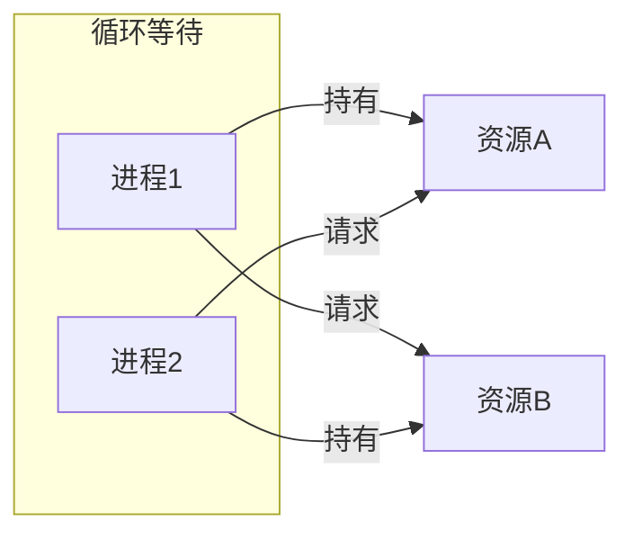

+++
title = "15.OS面试题-并发同步"
date = 2026-01-31
description = "操作系统并发同步面试题：死锁、信号量、互斥量、经典同步问题深度解析"
[taxonomies]
tags = ["操作系统", "面试", "同步", "死锁", "信号量"]
+++

# 操作系统面试题 - 并发同步

本文汇集操作系统并发同步相关的高频面试问题，采用问答深挖形式，模拟真实面试场景。

---

## 问题 1：死锁的四个必要条件是什么？

### 标准答案

**四个必要条件**（缺一不可）：

1. **互斥（Mutual Exclusion）**：资源不能共享，只能一个进程使用
2. **占有并等待（Hold and Wait）**：持有资源同时请求新资源
3. **不可抢占（No Preemption）**：不能强制释放他人资源
4. **循环等待（Circular Wait）**：形成等待环路



### 面试官追问

**Q1: 如何预防死锁？**

| 破坏条件 | 策略 | 实现方式 | 代价 |
|----------|------|----------|------|
| 互斥 | 无锁编程 | 原子操作、无锁数据结构 | 实现复杂 |
| 占有等待 | 一次性申请 | 获取所有资源后才开始 | 资源利用率低 |
| 不可抢占 | 允许抢占 | 申请失败则释放已有 | 可能活锁 |
| 循环等待 | 资源排序 | 按固定顺序申请 | 需要全局排序 |

```c
// 破坏循环等待：按地址顺序加锁
void lock_two(mutex_t *a, mutex_t *b) {
    if (a < b) {
        mutex_lock(a);
        mutex_lock(b);
    } else {
        mutex_lock(b);
        mutex_lock(a);
    }
}

// 破坏占有等待：trylock + 回退
retry:
    if (!mutex_trylock(&lock_a)) {
        goto retry;
    }
    if (!mutex_trylock(&lock_b)) {
        mutex_unlock(&lock_a);  // 释放已持有的
        usleep(random() % 1000);  // 随机等待避免活锁
        goto retry;
    }
    // 成功获取两个锁
```

**Q2: 如何检测死锁？**

```c
// 资源分配图算法

// 数据结构
int available[M];           // 可用资源
int allocation[N][M];       // 已分配资源
int request[N][M];          // 请求资源

// 检测算法
bool deadlock_detection() {
    bool finish[N] = {false};
    int work[M];
    memcpy(work, available, sizeof(available));
    
    bool changed = true;
    while (changed) {
        changed = false;
        for (int i = 0; i < N; i++) {
            if (!finish[i] && request[i] <= work) {
                // 进程 i 可以完成
                work += allocation[i];
                finish[i] = true;
                changed = true;
            }
        }
    }
    
    // 检查是否有进程无法完成
    for (int i = 0; i < N; i++) {
        if (!finish[i]) {
            return true;  // 存在死锁
        }
    }
    return false;
}
```

**Q3: 死锁恢复策略有哪些？**

```
1. 进程终止
   a) 终止所有死锁进程（简单粗暴）
   b) 逐个终止直到打破死锁
      - 选择标准：优先级、运行时间、资源占用
      - 每次终止后重新检测

2. 资源抢占
   a) 选择牺牲者
      - 回滚到安全状态（需要检查点机制）
      - 杀死并重启
   b) 防止饥饿
      - 记录被抢占次数
      - 同一进程不能总是被选中

3. 实际系统的处理
   - 鸵鸟策略：假装死锁不会发生
   - 超时机制：持锁超时自动释放
   - 监控告警：人工干预
```

**Q4: 如何在代码中避免死锁？**

```c
// 最佳实践

// 1. 锁排序
#define LOCK_A 1
#define LOCK_B 2
// 总是按 A → B 顺序加锁

// 2. 使用 scoped_lock（C++17）
std::scoped_lock lock(mutex_a, mutex_b);
// 自动处理顺序，保证不死锁

// 3. 超时机制
if (pthread_mutex_timedlock(&mutex, &timeout) != 0) {
    // 获取失败，放弃或重试
    handle_timeout();
}

// 4. 层次锁
enum lock_level { LEVEL_A = 1, LEVEL_B = 2 };
thread_local int current_level = 0;

void lock_with_level(mutex_t *m, int level) {
    assert(level > current_level);  // 只能获取更高层级
    mutex_lock(m);
    current_level = level;
}

// 5. 锁分析工具
// Helgrind (Valgrind)
// ThreadSanitizer
```

---

## 问题 2：什么是信号量？P/V 操作如何工作？

### 标准答案

**信号量（Semaphore）**：用于进程/线程同步的整型变量，配合两个原子操作。

```c
// P 操作（Proberen，测试/等待/down/wait）
P(S):
    S = S - 1
    if S < 0:
        将当前进程加入等待队列
        阻塞

// V 操作（Verhogen，增加/释放/up/signal）
V(S):
    S = S + 1
    if S <= 0:
        从等待队列取出一个进程
        唤醒

// S 的含义：
// S > 0: 可用资源数
// S = 0: 无可用资源，无等待进程
// S < 0: |S| 为等待进程数
```

**信号量实现（简化）**：

```c
struct semaphore {
    int count;
    spinlock_t lock;
    struct list_head wait_list;
};

void P(struct semaphore *sem) {
    spin_lock(&sem->lock);
    sem->count--;
    if (sem->count < 0) {
        // 加入等待队列
        add_to_wait_list(&sem->wait_list, current);
        spin_unlock(&sem->lock);
        schedule();  // 睡眠
    } else {
        spin_unlock(&sem->lock);
    }
}

void V(struct semaphore *sem) {
    spin_lock(&sem->lock);
    sem->count++;
    if (sem->count <= 0) {
        // 唤醒等待者
        struct task *t = remove_from_wait_list(&sem->wait_list);
        wake_up(t);
    }
    spin_unlock(&sem->lock);
}
```

### 面试官追问

**Q1: 互斥量和信号量的详细区别？**

| 特性 | Mutex（互斥量） | Semaphore（信号量） |
|------|----------------|-------------------|
| 值范围 | 0 或 1 | 0 到 N（可以是任意正整数） |
| 释放者 | 必须是持有者 | 任意进程/线程 |
| 用途 | 互斥（保护临界区） | 互斥 + 同步（资源计数） |
| 所有权 | 有明确的所有者 | 无所有权概念 |
| 递归 | 可实现递归锁 | 不适用 |
| 优先级继承 | 通常支持 | 通常不支持 |

```c
// Mutex 使用示例
pthread_mutex_t mutex;
pthread_mutex_lock(&mutex);
// 临界区
pthread_mutex_unlock(&mutex);  // 必须由同一线程释放

// 信号量使用示例
sem_t sem;
sem_init(&sem, 0, 3);  // 初始值 3，最多 3 个并发

// 线程 A
sem_wait(&sem);
// 访问资源

// 线程 B 可以释放（虽然不推荐）
sem_post(&sem);
```

**Q2: 二值信号量等于互斥量吗？**

```
不完全相同！

相同点：
- 都可以实现互斥
- 都只有两个状态

不同点：
1. 所有权
   二值信号量：无所有权，任何人可以 V
   互斥量：有所有权，只有持有者可以释放

2. 递归锁
   二值信号量：自己 P 两次会死锁
   互斥量：可以实现递归锁（同一线程多次加锁）

3. 优先级继承
   二值信号量：通常不支持
   互斥量：通常支持（解决优先级反转）

4. 实际用途
   二值信号量：同步（通知）
   互斥量：互斥（保护）

// 典型错误：用二值信号量实现互斥但允许其他线程释放
sem_t sem;
sem_init(&sem, 0, 1);

// 线程 A
sem_wait(&sem);
// 临界区...

// 线程 B（错误！）
sem_post(&sem);  // 破坏了互斥！
```

**Q3: 条件变量和信号量的区别？**

```c
// 条件变量：必须配合互斥量使用

pthread_mutex_t mutex;
pthread_cond_t cond;
int ready = 0;

// 等待方
pthread_mutex_lock(&mutex);
while (!ready) {  // 必须用 while，防止虚假唤醒
    pthread_cond_wait(&cond, &mutex);  // 原子释放锁并等待
}
// 使用 ready
pthread_mutex_unlock(&mutex);

// 通知方
pthread_mutex_lock(&mutex);
ready = 1;
pthread_cond_signal(&cond);  // 或 broadcast
pthread_mutex_unlock(&mutex);

// 对比信号量
// 信号量有计数，条件变量没有
// 信号量 P/V 可以分离，条件变量 wait/signal 必须持有锁
// 条件变量的 signal 如果没有等待者，信号丢失
// 信号量的 V 总会增加计数
```

---

## 问题 3：解决生产者-消费者问题

### 标准答案

```c
#define N 100
semaphore mutex = 1;    // 互斥访问缓冲区
semaphore empty = N;    // 空槽位数
semaphore full = 0;     // 满槽位数

// 生产者
void producer() {
    while (true) {
        item = produce_item();
        P(empty);        // 等待空槽（先资源信号量）
        P(mutex);        // 进入临界区（后互斥信号量）
        insert(item);    // 放入数据
        V(mutex);        // 离开临界区
        V(full);         // 增加满槽
    }
}

// 消费者
void consumer() {
    while (true) {
        P(full);         // 等待满槽
        P(mutex);        // 进入临界区
        item = remove(); // 取出数据
        V(mutex);        // 离开临界区
        V(empty);        // 增加空槽
        consume(item);
    }
}
```

### 面试官追问

**Q1: P 操作的顺序能交换吗？**

```c
// 错误顺序（会死锁！）
生产者：          消费者：
P(mutex)          P(mutex)
P(empty) ← 阻塞   P(full) ← 阻塞

// 场景：缓冲区满
// 生产者持有 mutex，等待 empty
// 消费者需要 mutex，但被生产者持有
// 死锁！

// 正确原则：
// 1. 先 P 资源信号量（empty/full）
// 2. 后 P 互斥信号量（mutex）
// 这样在等待资源时不会持有互斥锁

// 总结
// 资源信号量和互斥信号量的 P 顺序不能颠倒
// V 顺序可以颠倒（都是释放资源）
```

**Q2: 用条件变量实现生产者-消费者**

```c
#define N 100
pthread_mutex_t mutex = PTHREAD_MUTEX_INITIALIZER;
pthread_cond_t not_full = PTHREAD_COND_INITIALIZER;
pthread_cond_t not_empty = PTHREAD_COND_INITIALIZER;
int buffer[N];
int count = 0, in = 0, out = 0;

void producer() {
    while (true) {
        item = produce();
        
        pthread_mutex_lock(&mutex);
        while (count == N) {  // 缓冲区满
            pthread_cond_wait(&not_full, &mutex);
        }
        buffer[in] = item;
        in = (in + 1) % N;
        count++;
        pthread_cond_signal(&not_empty);
        pthread_mutex_unlock(&mutex);
    }
}

void consumer() {
    while (true) {
        pthread_mutex_lock(&mutex);
        while (count == 0) {  // 缓冲区空
            pthread_cond_wait(&not_empty, &mutex);
        }
        item = buffer[out];
        out = (out + 1) % N;
        count--;
        pthread_cond_signal(&not_full);
        pthread_mutex_unlock(&mutex);
        
        consume(item);
    }
}
```

---

## 问题 4：读者-写者问题

### 标准答案

**问题描述**：
- 多个读者可以同时读
- 写者必须独占访问
- 读写互斥

```c
// 读者优先方案
semaphore mutex = 1;      // 保护 read_count
semaphore rw_mutex = 1;   // 读写互斥
int read_count = 0;

void reader() {
    P(mutex);
    read_count++;
    if (read_count == 1)  // 第一个读者
        P(rw_mutex);      // 阻止写者
    V(mutex);
    
    read_data();          // 读取（多个读者可同时）
    
    P(mutex);
    read_count--;
    if (read_count == 0)  // 最后一个读者
        V(rw_mutex);      // 允许写者
    V(mutex);
}

void writer() {
    P(rw_mutex);
    write_data();
    V(rw_mutex);
}
```

### 面试官追问

**Q1: 读者优先的问题是什么？**

```
问题：写者可能饥饿

场景：
时刻 0: 读者 R1 进入
时刻 1: 写者 W1 到达，等待 rw_mutex
时刻 2: 读者 R2 到达，直接进入（read_count > 0）
时刻 3: 读者 R1 离开
时刻 4: 读者 R3 到达，直接进入
时刻 5: 读者 R2 离开
...

如果读者持续到达，写者永远无法获得 rw_mutex
即使写者先到达！
```

**Q2: 公平读写锁如何实现？**

```c
// 公平方案：使用排队信号量
semaphore queue = 1;      // 排队信号量
semaphore rw_mutex = 1;   // 读写互斥
semaphore mutex = 1;      // 保护 read_count
int read_count = 0;

void reader() {
    P(queue);             // 排队
    P(mutex);
    read_count++;
    if (read_count == 1)
        P(rw_mutex);
    V(mutex);
    V(queue);             // 释放排队，允许后续请求
    
    read_data();
    
    P(mutex);
    read_count--;
    if (read_count == 0)
        V(rw_mutex);
    V(mutex);
}

void writer() {
    P(queue);             // 排队
    P(rw_mutex);          // 写者会阻塞新读者
    V(queue);
    
    write_data();
    
    V(rw_mutex);
}

// 效果：
// 写者等待时，新读者在 P(queue) 处排队
// 现有读者完成后，写者获得 rw_mutex
// 公平 FIFO 顺序
```

**Q3: 写者优先如何实现？**

```c
// 写者优先方案
semaphore read_mutex = 1;   // 控制读者进入
semaphore write_mutex = 1;  // 写者互斥
semaphore rw_mutex = 1;     // 读写互斥
semaphore mutex1 = 1;       // 保护 read_count
semaphore mutex2 = 1;       // 保护 write_count
int read_count = 0, write_count = 0;

void reader() {
    P(read_mutex);        // 检查是否有写者等待
    P(mutex1);
    read_count++;
    if (read_count == 1)
        P(rw_mutex);
    V(mutex1);
    V(read_mutex);
    
    read_data();
    
    P(mutex1);
    read_count--;
    if (read_count == 0)
        V(rw_mutex);
    V(mutex1);
}

void writer() {
    P(mutex2);
    write_count++;
    if (write_count == 1)
        P(read_mutex);    // 阻止新读者
    V(mutex2);
    
    P(rw_mutex);
    write_data();
    V(rw_mutex);
    
    P(mutex2);
    write_count--;
    if (write_count == 0)
        V(read_mutex);    // 允许读者
    V(mutex2);
}

// 效果：
// 写者到达时阻止新读者进入
// 等待现有读者完成后写入
// 可能导致读者饥饿
```

---

## 问题 5：哲学家就餐问题

### 标准答案

**问题描述**：
- 5 个哲学家围坐圆桌
- 每人两侧各有一只筷子
- 需要两只筷子才能吃饭
- 如何避免死锁和饥饿？

```
        P0
       /   \
    C0       C4
     |       |
    P1       P4
     |       |
    C1       C3
      \     /
       P2-C2-P3
```

### 面试官追问

**Q1: 为什么简单方案会死锁？**

```c
// 简单方案（会死锁！）
semaphore chopstick[5] = {1, 1, 1, 1, 1};

void philosopher(int i) {
    while (true) {
        think();
        P(chopstick[i]);           // 拿左边
        P(chopstick[(i+1) % 5]);   // 拿右边
        eat();
        V(chopstick[i]);
        V(chopstick[(i+1) % 5]);
    }
}

// 死锁场景：
// 每个哲学家同时拿起左边的筷子
// P0 拿 C0，等 C1
// P1 拿 C1，等 C2
// P2 拿 C2，等 C3
// P3 拿 C3，等 C4
// P4 拿 C4，等 C0  ← 循环等待！
```

**Q2: 有哪些避免死锁的方案？**

```c
// 方案 1：限制就餐人数（最多 4 人同时拿筷子）
semaphore room = 4;
semaphore chopstick[5] = {1, 1, 1, 1, 1};

void philosopher(int i) {
    while (true) {
        think();
        P(room);              // 进入餐厅（最多 4 人）
        P(chopstick[i]);
        P(chopstick[(i+1) % 5]);
        eat();
        V(chopstick[i]);
        V(chopstick[(i+1) % 5]);
        V(room);              // 离开餐厅
    }
}
// 原理：5 个人 4 把椅子，至少有一人能拿到两只筷子

// 方案 2：奇偶策略
void philosopher(int i) {
    while (true) {
        think();
        if (i % 2 == 0) {     // 偶数先左后右
            P(chopstick[i]);
            P(chopstick[(i+1) % 5]);
        } else {               // 奇数先右后左
            P(chopstick[(i+1) % 5]);
            P(chopstick[i]);
        }
        eat();
        V(chopstick[i]);
        V(chopstick[(i+1) % 5]);
    }
}
// 原理：破坏循环等待

// 方案 3：一次性拿两只（破坏占有等待）
semaphore mutex = 1;  // 保护拿筷子操作

void philosopher(int i) {
    while (true) {
        think();
        P(mutex);
        P(chopstick[i]);
        P(chopstick[(i+1) % 5]);
        V(mutex);
        eat();
        V(chopstick[i]);
        V(chopstick[(i+1) % 5]);
    }
}
// 缺点：并发度低

// 方案 4：trylock + 回退
void philosopher(int i) {
    while (true) {
        think();
        P(chopstick[i]);
        if (!tryP(chopstick[(i+1) % 5])) {
            V(chopstick[i]);  // 放下左边
            continue;          // 重试
        }
        eat();
        V(chopstick[i]);
        V(chopstick[(i+1) % 5]);
    }
}
// 注意：需要随机等待避免活锁
```

---

## 问题 6：什么是银行家算法？

### 标准答案

**银行家算法**：死锁避免算法，在分配资源前检查是否会导致不安全状态。

**数据结构**：
- `Available[m]`：每种资源可用数量
- `Max[n][m]`：每个进程最大需求
- `Allocation[n][m]`：已分配资源
- `Need[n][m] = Max - Allocation`：还需要的资源

**安全性检查算法**：

```c
bool is_safe_state() {
    int work[M];
    bool finish[N] = {false};
    
    // 初始化
    memcpy(work, available, sizeof(available));
    
    // 循环查找可完成进程
    bool found = true;
    while (found) {
        found = false;
        for (int i = 0; i < N; i++) {
            if (!finish[i] && need[i] <= work) {
                // 进程 i 可以完成
                for (int j = 0; j < M; j++) {
                    work[j] += allocation[i][j];
                }
                finish[i] = true;
                found = true;
            }
        }
    }
    
    // 检查所有进程是否都能完成
    for (int i = 0; i < N; i++) {
        if (!finish[i]) return false;
    }
    return true;
}
```

### 面试官追问

**Q1: 银行家算法的完整示例**

```
系统状态：
3 种资源类型，可用量：A=3, B=3, C=2

进程   Max      Allocation   Need      
       A B C    A B C        A B C     
P0     7 5 3    0 1 0        7 4 3     
P1     3 2 2    2 0 0        1 2 2     
P2     9 0 2    3 0 2        6 0 0     
P3     2 2 2    2 1 1        0 1 1     
P4     4 3 3    0 0 2        4 3 1     

安全性检查：
初始 Work = (3, 3, 2)

1. 找 Need <= Work 的进程
   P1: Need(1,2,2) <= Work(3,3,2) ✓
   完成 P1: Work = (3,3,2) + (2,0,0) = (5,3,2)

2. P3: Need(0,1,1) <= Work(5,3,2) ✓
   完成 P3: Work = (5,3,2) + (2,1,1) = (7,4,3)

3. P4: Need(4,3,1) <= Work(7,4,3) ✓
   完成 P4: Work = (7,4,3) + (0,0,2) = (7,4,5)

4. P0: Need(7,4,3) <= Work(7,4,5) ✓
   完成 P0: Work = (7,4,5) + (0,1,0) = (7,5,5)

5. P2: Need(6,0,0) <= Work(7,5,5) ✓
   完成 P2

安全序列：P1 → P3 → P4 → P0 → P2
状态安全！
```

**Q2: 资源请求算法**

```c
// 进程 Pi 请求资源 Request[i]
bool request_resources(int i, int request[]) {
    // 步骤 1：检查请求合法性
    if (request > need[i]) {
        return false;  // 请求超过声明的最大值
    }
    
    // 步骤 2：检查资源是否足够
    if (request > available) {
        return false;  // 资源不足，需要等待
    }
    
    // 步骤 3：试探性分配
    for (int j = 0; j < M; j++) {
        available[j] -= request[j];
        allocation[i][j] += request[j];
        need[i][j] -= request[j];
    }
    
    // 步骤 4：安全性检查
    if (is_safe_state()) {
        return true;  // 允许分配
    } else {
        // 回滚
        for (int j = 0; j < M; j++) {
            available[j] += request[j];
            allocation[i][j] -= request[j];
            need[i][j] += request[j];
        }
        return false;  // 拒绝分配
    }
}
```

**Q3: 银行家算法的局限性**

```
1. 需要预先声明最大资源需求
   - 很多情况下无法准确预估
   - 倾向于声明更多，降低利用率

2. 进程数和资源数固定
   - 实际系统中进程动态创建/销毁
   - 资源也可能动态变化

3. 算法开销
   - 每次分配都要运行 O(n² × m) 的检查
   - 对于大系统不实际

4. 假设进程会归还资源
   - 如果进程崩溃不释放资源？
   - 需要额外的超时机制

5. 实际系统很少使用
   - 开销太大
   - 预防策略更简单有效
   - 更常用：资源排序 + 超时
```

---

## 高频考点总结

| 考点 | 频率 | 深度要求 |
|------|------|----------|
| 死锁四条件 | ★★★ | 预防和检测策略 |
| 信号量 P/V | ★★★ | 实现和语义 |
| Mutex vs Semaphore | ★★★ | 区别和使用场景 |
| 生产者-消费者 | ★★★ | 代码实现，P 顺序 |
| 读者-写者 | ★★☆ | 三种优先级策略 |
| 哲学家问题 | ★★☆ | 避免死锁方案 |
| 银行家算法 | ★★☆ | 安全检查过程 |

---

## 相关文章

- [上一篇：OS面试题-文件系统](/articles/os/os-14-OS面试题-文件系统/)
- [下一篇：OS笔试题-文件系统](/articles/os/os-16-OS笔试题-文件系统/)
