+++
title = "16.OS笔试题-文件系统"
date = 2026-01-31
description = "操作系统文件系统笔试题：inode、目录结构、硬软链接、VFS、文件描述符深度解析"
[taxonomies]
tags = ["操作系统", "笔试", "文件系统", "inode", "VFS"]
+++

操作系统文件系统笔试题专题，涵盖 inode、目录结构、硬软链接、VFS、文件描述符、日志文件系统等核心知识点。

<!-- more -->

## 一、选择题

### 1.1 inode 基础 ★☆☆

**题目**：关于 Unix/Linux 文件系统中的 inode，以下说法**错误**的是：

A. inode 存储文件的元数据，包括权限、时间戳、所有者等  
B. inode 中存储文件名  
C. inode 中存储指向数据块的指针  
D. 每个文件都有唯一的 inode 号

<details>
<summary>查看答案与解析</summary>

**答案**：B

**解析**：
- **A 正确**：inode 存储文件元数据（权限、时间戳、UID/GID、链接计数等）
- **B 错误**：**文件名不存储在 inode 中**，而是存储在目录项（dentry）中
- **C 正确**：inode 包含指向数据块的直接指针和间接指针
- **D 正确**：每个文件在同一文件系统内有唯一的 inode 号

**inode 结构示意**：

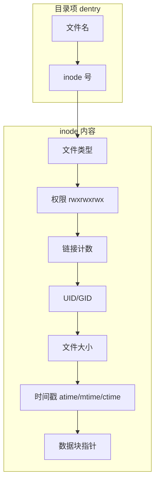

</details>

---

### 1.2 硬链接与软链接 ★★☆

**题目**：关于硬链接和软链接，以下说法**正确**的是：

A. 硬链接可以跨文件系统  
B. 软链接删除后，原文件也会被删除  
C. 硬链接和原文件共享同一个 inode  
D. 硬链接可以链接目录

<details>
<summary>查看答案与解析</summary>

**答案**：C

**解析**：
- **A 错误**：硬链接**不能**跨文件系统（因为 inode 号在不同文件系统中不唯一）
- **B 错误**：软链接删除后，原文件**不受影响**；反之，原文件删除后，软链接变成悬空链接
- **C 正确**：硬链接与原文件共享同一个 inode，只是目录项不同
- **D 错误**：普通用户**不能**对目录创建硬链接（防止目录环路），只有 `.` 和 `..` 是系统创建的特殊硬链接

**对比表**：

| 特性 | 硬链接 | 软链接 |
|------|--------|--------|
| inode | 相同 | 不同（软链接有自己的 inode） |
| 跨文件系统 | 不可以 | 可以 |
| 链接目录 | 不可以 | 可以 |
| 原文件删除后 | 仍可访问 | 悬空链接 |
| 文件大小 | 与原文件相同 | 存储路径长度 |

</details>

---

### 1.3 VFS 虚拟文件系统 ★★☆

**题目**：Linux VFS（虚拟文件系统）的主要作用是：

A. 提高磁盘读写速度  
B. 为不同文件系统提供统一的接口  
C. 实现文件压缩  
D. 管理磁盘分区

<details>
<summary>查看答案与解析</summary>

**答案**：B

**解析**：
VFS 是 Linux 内核的抽象层，为上层应用提供统一的文件操作接口（`open`、`read`、`write` 等），屏蔽底层不同文件系统的实现差异。

**VFS 架构**：

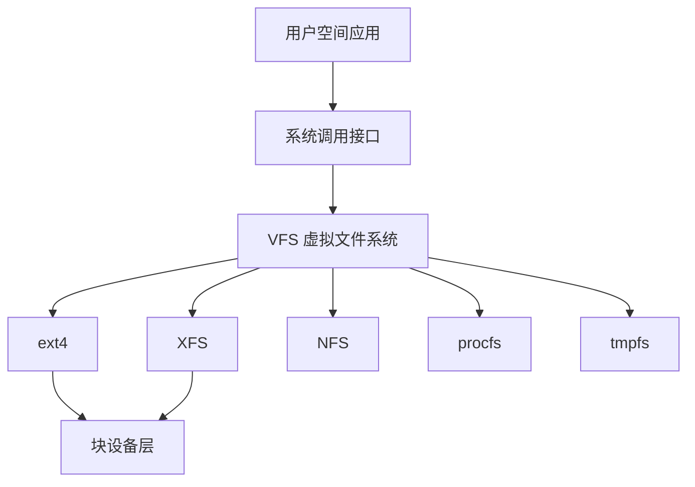

**VFS 四大核心对象**：
1. **superblock**：文件系统元数据（块大小、inode 数量等）
2. **inode**：文件元数据
3. **dentry**：目录项，关联文件名与 inode
4. **file**：进程打开的文件实例

</details>

---

### 1.4 文件描述符 ★★☆

**题目**：以下代码执行后，`fd1` 和 `fd2` 的关系是：

```c
int fd1 = open("file.txt", O_RDONLY);
int fd2 = dup(fd1);
```

A. `fd1` 和 `fd2` 指向不同的文件表项  
B. `fd1` 和 `fd2` 共享同一个文件偏移量  
C. 关闭 `fd1` 后，`fd2` 不可用  
D. `fd1` 和 `fd2` 的值相同

<details>
<summary>查看答案与解析</summary>

**答案**：B

**解析**：
- **A 错误**：`dup()` 复制文件描述符，两者指向**同一个文件表项**
- **B 正确**：共享文件表项意味着共享文件偏移量、文件状态标志
- **C 错误**：关闭 `fd1` 后，`fd2` 仍然可用（引用计数减 1）
- **D 错误**：`dup()` 返回最小可用的文件描述符号，通常不同

**三层结构**：

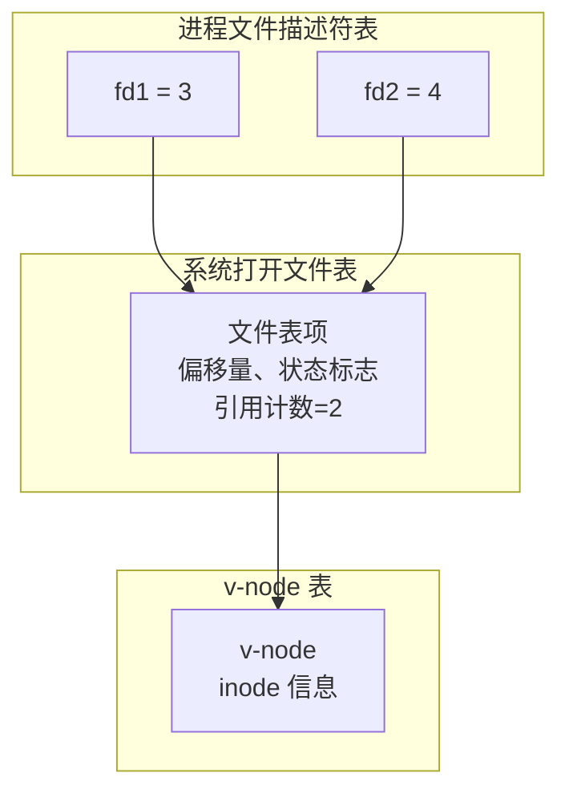

</details>

---

### 1.5 文件系统一致性 ★★★

**题目**：关于日志文件系统（Journaling File System），以下说法**错误**的是：

A. 日志记录元数据和/或数据的变更，用于崩溃恢复  
B. ext3 支持三种日志模式：journal、ordered、writeback  
C. 日志可以完全避免数据丢失  
D. 日志通过重放（replay）来恢复文件系统一致性

<details>
<summary>查看答案与解析</summary>

**答案**：C

**解析**：
- **A 正确**：日志记录变更操作，崩溃后可恢复
- **B 正确**：ext3/ext4 三种模式：
  - `journal`：记录数据和元数据（最安全，最慢）
  - `ordered`：先写数据，再写元数据日志（默认，平衡）
  - `writeback`：只记录元数据日志（最快，可能数据不一致）
- **C 错误**：日志**不能完全避免数据丢失**，只能保证文件系统结构一致性
- **D 正确**：恢复时通过重放日志中的事务来恢复

**日志写入流程**：

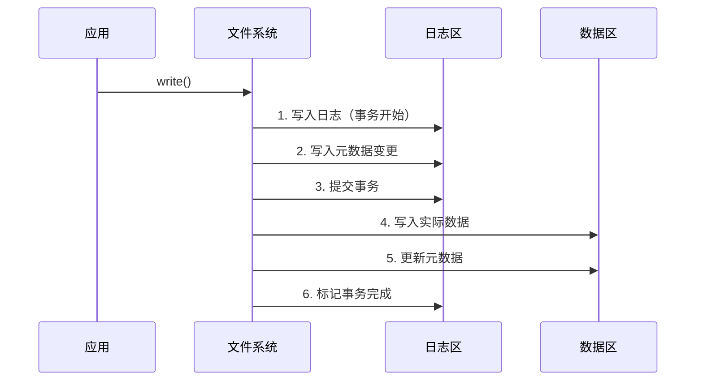

</details>

---

### 1.6 文件打开过程 ★★★

**题目**：在 Linux 中执行 `open("/home/user/file.txt", O_RDONLY)` 时，以下哪个步骤**不会**发生？

A. 查找 dentry 缓存  
B. 读取目录的 inode  
C. 分配新的 inode 号  
D. 分配文件描述符

<details>
<summary>查看答案与解析</summary>

**答案**：C

**解析**：
打开已存在文件时，使用已有的 inode，不会分配新的 inode 号。

**open() 系统调用流程**：

1. 从 `/` 开始，逐级解析路径
2. 每级目录查找 dentry 缓存：
   - 命中：直接获取 inode
   - 未命中：读取目录数据块，查找目录项
3. 获取目标文件的 inode
4. 权限检查
5. 分配文件描述符
6. 创建文件表项（struct file）
7. 返回文件描述符

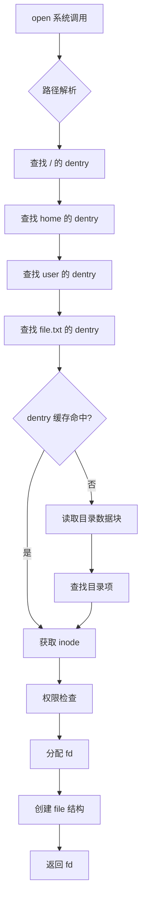

</details>

---

## 二、填空题

### 2.1 inode 指针结构 ★★☆

**题目**：传统 Unix 文件系统中，inode 包含 12 个直接指针、1 个一级间接指针、1 个二级间接指针、1 个三级间接指针。假设块大小为 4KB，指针大小为 4 字节，则一个文件最大可达 _______ 字节（用公式表示）。

<details>
<summary>查看答案与解析</summary>

**答案**：`12 × 4KB + 1024 × 4KB + 1024² × 4KB + 1024³ × 4KB`

约等于 **4TB**

**计算过程**：
- 每个块可容纳指针数：4KB / 4B = 1024 个指针
- 直接指针：12 × 4KB = 48KB
- 一级间接：1024 × 4KB = 4MB
- 二级间接：1024 × 1024 × 4KB = 4GB
- 三级间接：1024³ × 4KB ≈ 4TB

```c
// inode 数据块指针结构示意
struct inode_pointers {
    uint32_t direct[12];        // 直接指针
    uint32_t indirect;          // 一级间接指针
    uint32_t double_indirect;   // 二级间接指针
    uint32_t triple_indirect;   // 三级间接指针
};
```

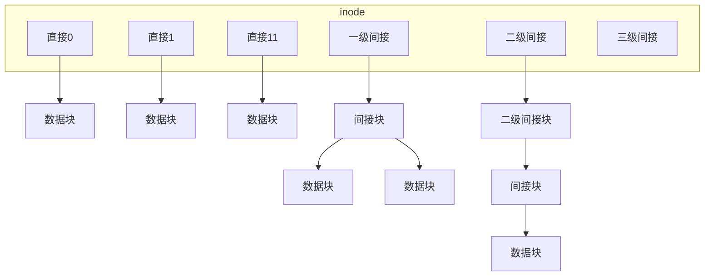

</details>

---

### 2.2 链接计数 ★★☆

**题目**：执行以下命令后，文件 `original.txt` 的 inode 链接计数为 _______：

```bash
touch original.txt
ln original.txt hard1
ln original.txt hard2
ln -s original.txt soft1
```

<details>
<summary>查看答案与解析</summary>

**答案**：**3**

**解析**：
- `touch original.txt`：创建文件，链接计数 = 1
- `ln original.txt hard1`：创建硬链接，链接计数 = 2
- `ln original.txt hard2`：创建硬链接，链接计数 = 3
- `ln -s original.txt soft1`：创建软链接，**不增加**链接计数

验证命令：
```bash
$ ls -li original.txt
123456 -rw-r--r-- 3 user user 0 Jan 31 10:00 original.txt
#                 ^-- 链接计数为 3
```

</details>

---

### 2.3 文件描述符分配 ★☆☆

**题目**：Linux 中，新进程的文件描述符 0、1、2 分别对应 _______、_______、_______。

<details>
<summary>查看答案与解析</summary>

**答案**：**标准输入（stdin）**、**标准输出（stdout）**、**标准错误（stderr）**

**代码示例**：

```c
#include <unistd.h>
#include <stdio.h>

int main() {
    // 标准文件描述符
    printf("stdin  fileno: %d\n", STDIN_FILENO);   // 0
    printf("stdout fileno: %d\n", STDOUT_FILENO);  // 1
    printf("stderr fileno: %d\n", STDERR_FILENO);  // 2
    
    // 重定向示例
    close(STDOUT_FILENO);  // 关闭 stdout
    int fd = open("output.txt", O_WRONLY | O_CREAT, 0644);
    // fd 将被分配为 1（最小可用）
    printf("This goes to file\n");  // 写入文件
    
    return 0;
}
```

</details>

---

### 2.4 目录项大小 ★★☆

**题目**：在 ext4 文件系统中，目录项（dirent）包含 inode 号（4字节）、记录长度（2字节）、名称长度（1字节）、文件类型（1字节）、文件名（最长255字节）。一个目录项的最小大小为 _______ 字节（假设文件名为1字节）。

<details>
<summary>查看答案与解析</summary>

**答案**：**12 字节**（需要4字节对齐）

**计算**：
- 固定部分：4 + 2 + 1 + 1 = 8 字节
- 文件名：1 字节
- 总计：9 字节
- 4字节对齐后：12 字节

```c
// ext4 目录项结构
struct ext4_dir_entry_2 {
    __le32 inode;           // 4 字节：inode 号
    __le16 rec_len;         // 2 字节：记录长度（含填充）
    __u8   name_len;        // 1 字节：文件名长度
    __u8   file_type;       // 1 字节：文件类型
    char   name[255];       // 变长：文件名（不含 '\0'）
};
```

</details>

---

## 三、简答题

### 3.1 文件删除过程 ★★☆

**题目**：请详细描述在 Linux 中删除一个文件（`rm file.txt`）的完整过程。

<details>
<summary>查看答案与解析</summary>

**标准答案**：

删除文件的过程涉及目录项、inode 和数据块三个层面：

**1. 查找目录项**
- 解析路径，找到父目录
- 在父目录中查找 `file.txt` 的目录项
- 获取文件的 inode 号

**2. 权限检查**
- 检查对父目录的写权限（需要修改目录内容）
- 检查对文件的写权限（某些情况）

**3. 删除目录项**
- 从父目录的数据块中移除该目录项
- 更新父目录的 mtime

**4. 更新 inode**
- 将 inode 的链接计数减 1
- 如果链接计数变为 0 **且** 没有进程打开该文件：
  - 释放 inode
  - 释放所有数据块
  - 更新文件系统的空闲块位图和 inode 位图

**5. 特殊情况**
- 如果还有进程打开该文件：
  - 目录项被删除（文件名不可见）
  - inode 和数据块保留
  - 进程关闭文件后才真正释放

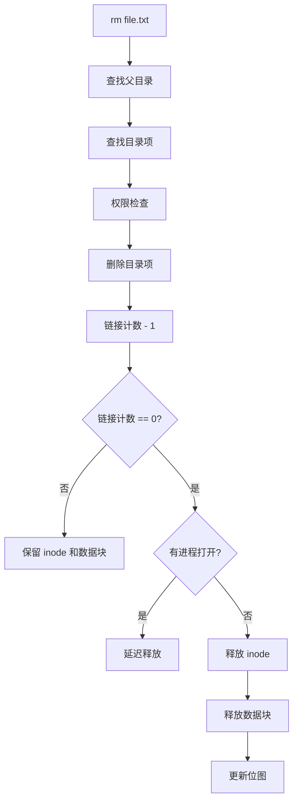

**代码示例 - 删除后仍可访问**：

```c
#include <stdio.h>
#include <unistd.h>
#include <fcntl.h>

int main() {
    // 创建并打开文件
    int fd = open("test.txt", O_RDWR | O_CREAT, 0644);
    write(fd, "Hello", 5);
    
    // 删除文件（但文件仍被打开）
    unlink("test.txt");  // 目录项被删除
    
    // 文件不可见
    // ls 看不到 test.txt
    
    // 但仍可通过 fd 访问
    lseek(fd, 0, SEEK_SET);
    char buf[10];
    read(fd, buf, 5);
    printf("Read: %s\n", buf);  // 输出: Hello
    
    close(fd);  // 关闭后文件才真正删除
    return 0;
}
```

</details>

---

### 3.2 VFS 核心数据结构 ★★★

**题目**：请说明 Linux VFS 的四大核心数据结构及其关系。

<details>
<summary>查看答案与解析</summary>

**标准答案**：

**1. superblock（超级块）**
- 描述整个文件系统的元信息
- 包含：块大小、总块数、空闲块数、inode 数量、挂载点等
- 每个挂载的文件系统有一个 superblock

```c
struct super_block {
    struct list_head    s_list;         // 超级块链表
    dev_t               s_dev;          // 设备号
    unsigned long       s_blocksize;    // 块大小
    struct file_system_type *s_type;    // 文件系统类型
    struct super_operations *s_op;      // 操作函数指针
    struct dentry       *s_root;        // 根目录 dentry
    // ...
};
```

**2. inode（索引节点）**
- 描述单个文件的元信息
- 包含：权限、大小、时间戳、数据块位置等
- **不包含文件名**

```c
struct inode {
    umode_t             i_mode;         // 文件类型和权限
    uid_t               i_uid;          // 所有者
    gid_t               i_gid;          // 所属组
    loff_t              i_size;         // 文件大小
    struct timespec64   i_atime;        // 访问时间
    struct timespec64   i_mtime;        // 修改时间
    struct timespec64   i_ctime;        // 状态改变时间
    unsigned int        i_nlink;        // 硬链接计数
    struct super_block  *i_sb;          // 所属超级块
    struct inode_operations *i_op;      // inode 操作
    struct file_operations  *i_fop;     // 文件操作
    // ...
};
```

**3. dentry（目录项）**
- 关联文件名与 inode
- 缓存路径解析结果，加速查找
- 形成目录树结构

```c
struct dentry {
    struct qstr         d_name;         // 文件名
    struct inode        *d_inode;       // 关联的 inode
    struct dentry       *d_parent;      // 父目录
    struct list_head    d_child;        // 子目录链表
    struct super_block  *d_sb;          // 所属超级块
    struct dentry_operations *d_op;     // dentry 操作
    // ...
};
```

**4. file（文件对象）**
- 表示进程打开的文件实例
- 包含：偏移量、打开模式、操作函数等
- 进程私有，不同进程打开同一文件有不同的 file 对象

```c
struct file {
    struct path         f_path;         // 路径（包含 dentry）
    struct inode        *f_inode;       // 关联的 inode
    const struct file_operations *f_op; // 文件操作
    atomic_long_t       f_count;        // 引用计数
    unsigned int        f_flags;        // 打开标志
    fmode_t             f_mode;         // 访问模式
    loff_t              f_pos;          // 文件偏移量
    // ...
};
```

**关系图**：

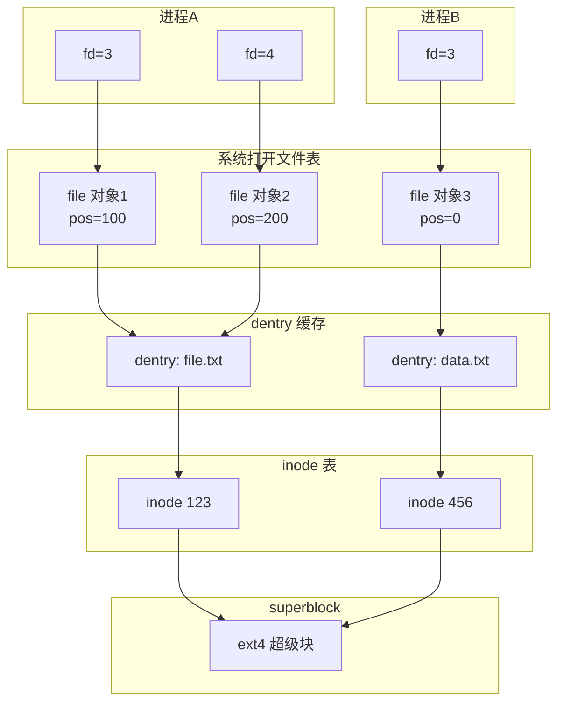

</details>

---

### 3.3 fsync 与 fdatasync ★★★

**题目**：解释 `fsync()` 和 `fdatasync()` 的区别，以及它们在保证数据持久化中的作用。

<details>
<summary>查看答案与解析</summary>

**标准答案**：

**1. 函数定义**

```c
#include <unistd.h>

int fsync(int fd);      // 同步文件数据和元数据
int fdatasync(int fd);  // 只同步文件数据
```

**2. 区别**

| 特性 | fsync | fdatasync |
|------|-------|-----------|
| 同步数据 | 是 | 是 |
| 同步元数据 | 全部（mtime, atime, size 等） | 仅必要的（如 size） |
| 性能 | 较慢 | 较快 |
| 使用场景 | 需要完整元数据一致性 | 只关心数据持久化 |

**3. 元数据同步说明**

- `fsync`：同步所有元数据，包括 mtime（修改时间）
- `fdatasync`：只同步**影响数据读取**的元数据（如文件大小），跳过 mtime 等

**4. 为什么 fdatasync 更快**

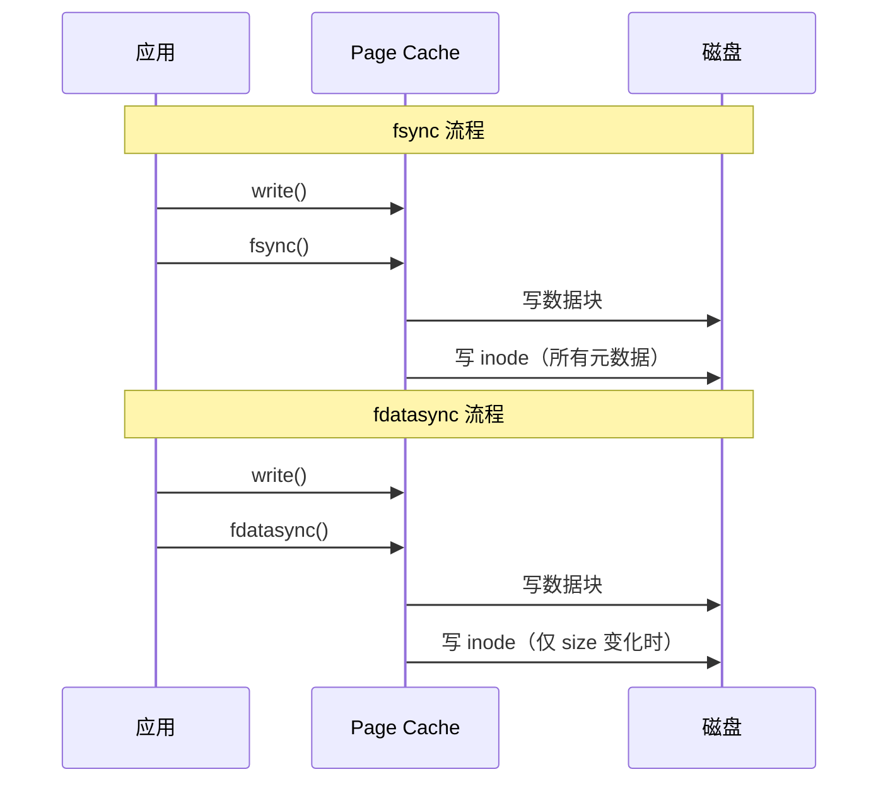

**5. 代码示例**

```c
#include <fcntl.h>
#include <unistd.h>
#include <string.h>

void write_with_sync(const char *filename, const char *data) {
    int fd = open(filename, O_WRONLY | O_CREAT | O_APPEND, 0644);
    
    write(fd, data, strlen(data));
    
    // 方案1：完整同步（包括 mtime）
    // fsync(fd);
    
    // 方案2：数据同步（更高效）
    fdatasync(fd);
    
    close(fd);
}

// 数据库常用模式
void database_write(int fd, const char *record, size_t len) {
    // 1. 先写日志
    int log_fd = open("db.log", O_WRONLY | O_APPEND);
    write(log_fd, record, len);
    fdatasync(log_fd);  // 确保日志持久化
    close(log_fd);
    
    // 2. 再写数据
    write(fd, record, len);
    fdatasync(fd);  // 确保数据持久化
}
```

**6. O_SYNC 与 O_DSYNC**

```c
// 打开时指定同步标志
int fd1 = open("file", O_WRONLY | O_SYNC);    // 每次 write 后自动 fsync
int fd2 = open("file", O_WRONLY | O_DSYNC);   // 每次 write 后自动 fdatasync

// 注意：O_SYNC/O_DSYNC 会显著降低写入性能
```

</details>

---

## 四、计算题

### 4.1 inode 寻址计算 ★★★

**题目**：某 ext2 文件系统的块大小为 4KB，指针大小为 4 字节。inode 结构有 12 个直接指针、1 个一级间接指针、1 个二级间接指针、1 个三级间接指针。

问：
1. 最大文件大小是多少？
2. 如果要读取文件的第 15,000,000 字节，需要访问哪些块？

<details>
<summary>查看答案与解析</summary>

**答案**：

**1. 最大文件大小**

每块可容纳指针数：4KB / 4B = 1024 个

- 直接指针：12 × 4KB = 48KB
- 一级间接：1024 × 4KB = 4MB
- 二级间接：1024 × 1024 × 4KB = 4GB
- 三级间接：1024³ × 4KB ≈ 4TB

**最大文件 ≈ 4TB**（精确值：4,398,314,962,944 字节）

**2. 定位第 15,000,000 字节**

```
字节位置：15,000,000
块大小：4096 字节
目标块号：15,000,000 / 4096 = 3662（从0开始）
块内偏移：15,000,000 % 4096 = 2768
```

判断所在区域：
- 直接指针范围：0 ~ 11（12 块）
- 一级间接范围：12 ~ 12+1023 = 12 ~ 1035（1024 块）
- 二级间接范围：1036 ~ 1036+1024²-1 = 1036 ~ 1049611

3662 在一级间接范围外，二级间接范围内。

```
块号 3662
减去直接和一级间接：3662 - 12 - 1024 = 2626
二级间接中的位置：2626
一级索引：2626 / 1024 = 2
二级索引：2626 % 1024 = 578
```

**访问步骤**：
1. 读取 inode，获取二级间接指针
2. 读取二级间接块（1 次 I/O）
3. 从二级间接块获取第 2 个一级间接指针
4. 读取一级间接块（1 次 I/O）
5. 从一级间接块获取第 578 个数据块指针
6. 读取数据块（1 次 I/O），偏移 2768 字节处

**共需 3 次额外磁盘 I/O**（不含 inode 读取）

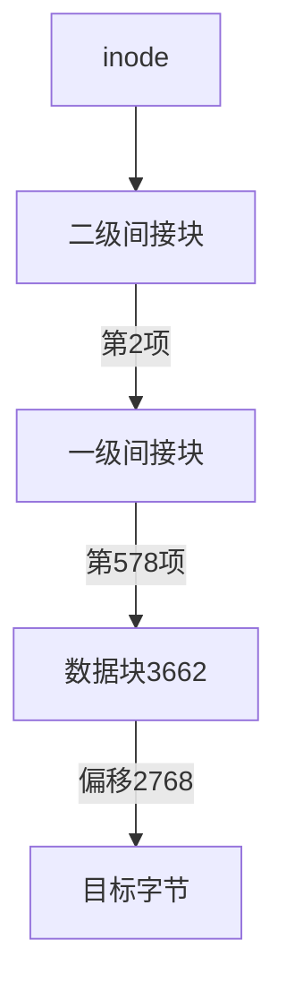

</details>

---

### 4.2 目录项计算 ★★☆

**题目**：某目录块大小为 4KB，目录项结构如下：

```c
struct dirent {
    uint32_t inode;      // 4 字节
    uint16_t rec_len;    // 2 字节
    uint8_t  name_len;   // 1 字节
    uint8_t  file_type;  // 1 字节
    char     name[];     // 变长，需要4字节对齐
};
```

问：
1. 一个块最多能存储多少个文件名长度为 8 字节的目录项？
2. 如果目录中有 500 个文件（平均文件名 12 字节），需要多少个目录块？

<details>
<summary>查看答案与解析</summary>

**答案**：

**1. 文件名 8 字节的目录项**

固定部分：4 + 2 + 1 + 1 = 8 字节
文件名：8 字节
总计：16 字节（已4字节对齐）

每块目录项数：4096 / 16 = **256 个**

**2. 500 个文件，平均名称 12 字节**

固定部分：8 字节
文件名：12 字节
总计：20 字节
4字节对齐：20 → **20 字节**（已对齐）

每块目录项数：4096 / 20 = 204 个

需要块数：⌈500 / 204⌉ = **3 个目录块**

```c
// 实际目录项大小计算
size_t dirent_size(size_t name_len) {
    size_t base = 8 + name_len;  // 固定部分 + 文件名
    return (base + 3) & ~3;      // 向上对齐到 4 字节
}

// 验证
// name_len = 8:  (8+8+3) & ~3 = 19 & ~3 = 16
// name_len = 12: (8+12+3) & ~3 = 23 & ~3 = 20
```

</details>

---

## 五、编程题

### 5.1 实现简单的 ls 命令 ★★☆

**题目**：使用系统调用实现简化版 `ls -li` 命令，显示指定目录下所有文件的 inode 号、链接计数、文件大小和文件名。

<details>
<summary>查看答案与解析</summary>

**参考答案**：

```c
#include <stdio.h>
#include <stdlib.h>
#include <dirent.h>
#include <sys/stat.h>
#include <string.h>
#include <errno.h>

void list_directory(const char *path) {
    DIR *dir = opendir(path);
    if (dir == NULL) {
        perror("opendir");
        return;
    }
    
    struct dirent *entry;
    struct stat statbuf;
    char filepath[PATH_MAX];
    
    printf("%10s %5s %10s %s\n", "INODE", "LINKS", "SIZE", "NAME");
    printf("------------------------------------------\n");
    
    while ((entry = readdir(dir)) != NULL) {
        // 跳过 . 和 ..
        if (strcmp(entry->d_name, ".") == 0 || 
            strcmp(entry->d_name, "..") == 0) {
            continue;
        }
        
        // 构建完整路径
        snprintf(filepath, sizeof(filepath), "%s/%s", path, entry->d_name);
        
        // 获取文件状态
        if (lstat(filepath, &statbuf) == -1) {
            perror("lstat");
            continue;
        }
        
        // 文件类型标识
        char type;
        if (S_ISREG(statbuf.st_mode))       type = '-';
        else if (S_ISDIR(statbuf.st_mode))  type = 'd';
        else if (S_ISLNK(statbuf.st_mode))  type = 'l';
        else if (S_ISBLK(statbuf.st_mode))  type = 'b';
        else if (S_ISCHR(statbuf.st_mode))  type = 'c';
        else if (S_ISFIFO(statbuf.st_mode)) type = 'p';
        else if (S_ISSOCK(statbuf.st_mode)) type = 's';
        else type = '?';
        
        printf("%10lu %5lu %10ld %c %s", 
               (unsigned long)statbuf.st_ino,
               (unsigned long)statbuf.st_nlink,
               (long)statbuf.st_size,
               type,
               entry->d_name);
        
        // 如果是软链接，显示目标
        if (S_ISLNK(statbuf.st_mode)) {
            char target[PATH_MAX];
            ssize_t len = readlink(filepath, target, sizeof(target) - 1);
            if (len != -1) {
                target[len] = '\0';
                printf(" -> %s", target);
            }
        }
        
        printf("\n");
    }
    
    closedir(dir);
}

int main(int argc, char *argv[]) {
    const char *path = (argc > 1) ? argv[1] : ".";
    list_directory(path);
    return 0;
}
```

**示例输出**：

```
     INODE LINKS       SIZE NAME
------------------------------------------
   1234567     1       4096 d subdir
   1234568     2        100 - file.txt
   1234569     1         15 l link.txt -> ../target.txt
```

**关键系统调用**：
- `opendir()` / `readdir()` / `closedir()`：目录遍历
- `lstat()`：获取文件元数据（不跟随软链接）
- `readlink()`：读取软链接目标

</details>

---

### 5.2 实现硬链接和软链接 ★★☆

**题目**：编写程序，接收命令行参数创建硬链接或软链接，并验证链接特性。

```
用法: ./myln [-s] 源文件 目标链接
```

<details>
<summary>查看答案与解析</summary>

**参考答案**：

```c
#include <stdio.h>
#include <stdlib.h>
#include <string.h>
#include <unistd.h>
#include <sys/stat.h>
#include <errno.h>

void print_inode_info(const char *path, const char *label) {
    struct stat statbuf;
    
    // 使用 lstat 不跟随软链接
    if (lstat(path, &statbuf) == -1) {
        printf("%s: %s - 无法获取信息: %s\n", label, path, strerror(errno));
        return;
    }
    
    printf("%s: %s\n", label, path);
    printf("  inode: %lu\n", (unsigned long)statbuf.st_ino);
    printf("  links: %lu\n", (unsigned long)statbuf.st_nlink);
    printf("  size:  %ld\n", (long)statbuf.st_size);
    printf("  type:  %s\n", 
           S_ISREG(statbuf.st_mode) ? "regular" :
           S_ISLNK(statbuf.st_mode) ? "symlink" :
           S_ISDIR(statbuf.st_mode) ? "directory" : "other");
    
    // 如果是软链接，显示目标
    if (S_ISLNK(statbuf.st_mode)) {
        char target[256];
        ssize_t len = readlink(path, target, sizeof(target) - 1);
        if (len > 0) {
            target[len] = '\0';
            printf("  target: %s\n", target);
        }
    }
}

int main(int argc, char *argv[]) {
    int symbolic = 0;
    int opt;
    
    // 解析参数
    while ((opt = getopt(argc, argv, "s")) != -1) {
        switch (opt) {
            case 's':
                symbolic = 1;
                break;
            default:
                fprintf(stderr, "用法: %s [-s] 源文件 目标链接\n", argv[0]);
                exit(EXIT_FAILURE);
        }
    }
    
    if (optind + 2 != argc) {
        fprintf(stderr, "用法: %s [-s] 源文件 目标链接\n", argv[0]);
        exit(EXIT_FAILURE);
    }
    
    const char *source = argv[optind];
    const char *target = argv[optind + 1];
    
    // 创建链接前显示源文件信息
    printf("=== 创建链接前 ===\n");
    print_inode_info(source, "源文件");
    printf("\n");
    
    // 创建链接
    int result;
    if (symbolic) {
        result = symlink(source, target);
        printf("创建软链接: %s -> %s\n", target, source);
    } else {
        result = link(source, target);
        printf("创建硬链接: %s -> %s\n", target, source);
    }
    
    if (result == -1) {
        perror("创建链接失败");
        exit(EXIT_FAILURE);
    }
    
    // 创建链接后显示信息
    printf("\n=== 创建链接后 ===\n");
    print_inode_info(source, "源文件");
    printf("\n");
    print_inode_info(target, "链接文件");
    
    // 验证硬链接特性
    if (!symbolic) {
        printf("\n=== 验证硬链接特性 ===\n");
        struct stat stat1, stat2;
        stat(source, &stat1);
        stat(target, &stat2);
        
        printf("inode 相同: %s\n", 
               stat1.st_ino == stat2.st_ino ? "是" : "否");
        printf("链接计数增加: %s\n", 
               stat1.st_nlink >= 2 ? "是" : "否");
    }
    
    return 0;
}
```

**测试运行**：

```bash
# 创建测试文件
$ echo "Hello" > original.txt

# 创建硬链接
$ ./myln original.txt hard_link
=== 创建链接前 ===
源文件: original.txt
  inode: 123456
  links: 1
  size:  6
  type:  regular

创建硬链接: hard_link -> original.txt

=== 创建链接后 ===
源文件: original.txt
  inode: 123456
  links: 2
  ...

=== 验证硬链接特性 ===
inode 相同: 是
链接计数增加: 是

# 创建软链接
$ ./myln -s original.txt soft_link
...
链接文件: soft_link
  inode: 789012  (不同的 inode)
  links: 1
  size:  12      (路径名长度)
  type:  symlink
  target: original.txt
```

</details>

---

### 5.3 实现文件描述符复制 ★★★

**题目**：使用 `dup2()` 实现输出重定向，将程序的标准输出重定向到文件。

<details>
<summary>查看答案与解析</summary>

**参考答案**：

```c
#include <stdio.h>
#include <stdlib.h>
#include <unistd.h>
#include <fcntl.h>
#include <string.h>

// 保存原始 stdout
int saved_stdout = -1;

// 重定向 stdout 到文件
int redirect_stdout_to_file(const char *filename) {
    // 保存原始 stdout
    saved_stdout = dup(STDOUT_FILENO);
    if (saved_stdout == -1) {
        perror("dup");
        return -1;
    }
    
    // 打开目标文件
    int fd = open(filename, O_WRONLY | O_CREAT | O_TRUNC, 0644);
    if (fd == -1) {
        perror("open");
        close(saved_stdout);
        saved_stdout = -1;
        return -1;
    }
    
    // 将 stdout 重定向到文件
    if (dup2(fd, STDOUT_FILENO) == -1) {
        perror("dup2");
        close(fd);
        close(saved_stdout);
        saved_stdout = -1;
        return -1;
    }
    
    // 关闭多余的 fd（dup2 后 STDOUT_FILENO 已指向同一文件表项）
    close(fd);
    
    return 0;
}

// 恢复原始 stdout
int restore_stdout(void) {
    if (saved_stdout == -1) {
        return -1;
    }
    
    // 恢复原始 stdout
    if (dup2(saved_stdout, STDOUT_FILENO) == -1) {
        perror("dup2");
        return -1;
    }
    
    close(saved_stdout);
    saved_stdout = -1;
    
    return 0;
}

// 实现 tee 功能：同时输出到屏幕和文件
int tee_output(const char *filename) {
    int fd = open(filename, O_WRONLY | O_CREAT | O_TRUNC, 0644);
    if (fd == -1) {
        perror("open");
        return -1;
    }
    
    char buffer[4096];
    ssize_t n;
    
    while ((n = read(STDIN_FILENO, buffer, sizeof(buffer))) > 0) {
        // 写到标准输出
        write(STDOUT_FILENO, buffer, n);
        // 写到文件
        write(fd, buffer, n);
    }
    
    close(fd);
    return 0;
}

int main(int argc, char *argv[]) {
    if (argc < 2) {
        fprintf(stderr, "用法: %s 输出文件\n", argv[0]);
        exit(EXIT_FAILURE);
    }
    
    printf("这行输出到终端\n");
    fflush(stdout);  // 刷新缓冲区
    
    // 重定向到文件
    if (redirect_stdout_to_file(argv[1]) == -1) {
        exit(EXIT_FAILURE);
    }
    
    printf("这行输出到文件\n");
    printf("第二行也输出到文件\n");
    fflush(stdout);
    
    // 恢复到终端
    if (restore_stdout() == -1) {
        exit(EXIT_FAILURE);
    }
    
    printf("恢复后，这行又输出到终端\n");
    
    // 显示文件内容
    printf("\n文件 %s 的内容:\n", argv[1]);
    char cmd[256];
    snprintf(cmd, sizeof(cmd), "cat %s", argv[1]);
    system(cmd);
    
    return 0;
}
```

**运行结果**：

```bash
$ ./redirect output.txt
这行输出到终端
恢复后，这行又输出到终端

文件 output.txt 的内容:
这行输出到文件
第二行也输出到文件
```

**dup2 工作原理图**：

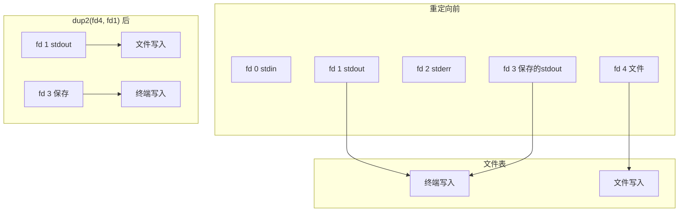

</details>

---

## 六、Bug 分析题

### 6.1 文件读取 Bug ★★☆

**题目**：以下代码尝试读取文件内容，但存在问题，请找出并修复：

```c
#include <stdio.h>
#include <fcntl.h>
#include <unistd.h>

int main() {
    int fd = open("data.txt", O_RDONLY);
    char buffer[100];
    
    read(fd, buffer, 100);
    printf("Content: %s\n", buffer);
    
    return 0;
}
```

<details>
<summary>查看答案与解析</summary>

**问题分析**：

1. **没有检查 open() 返回值**：文件可能不存在
2. **没有检查 read() 返回值**：读取可能失败
3. **buffer 未初始化且未添加终止符**：printf 可能读取越界
4. **没有关闭文件描述符**：资源泄漏

**修复代码**：

```c
#include <stdio.h>
#include <fcntl.h>
#include <unistd.h>
#include <string.h>
#include <errno.h>

int main() {
    // 1. 检查 open 返回值
    int fd = open("data.txt", O_RDONLY);
    if (fd == -1) {
        fprintf(stderr, "打开文件失败: %s\n", strerror(errno));
        return 1;
    }
    
    char buffer[101];  // 多留一个字节给 '\0'
    memset(buffer, 0, sizeof(buffer));  // 初始化
    
    // 2. 检查 read 返回值
    ssize_t bytes_read = read(fd, buffer, sizeof(buffer) - 1);
    if (bytes_read == -1) {
        fprintf(stderr, "读取失败: %s\n", strerror(errno));
        close(fd);
        return 1;
    }
    
    // 3. 确保字符串终止
    buffer[bytes_read] = '\0';
    
    printf("读取 %zd 字节\n", bytes_read);
    printf("Content: %s\n", buffer);
    
    // 4. 关闭文件
    close(fd);
    
    return 0;
}
```

**最佳实践**：

```c
// 使用 RAII 风格的辅助宏（C语言近似实现）
#define SAFE_CLOSE(fd) do { if ((fd) >= 0) { close(fd); (fd) = -1; } } while(0)

// 或使用 __attribute__((cleanup)) (GCC 扩展)
void cleanup_fd(int *fd) {
    if (*fd >= 0) {
        close(*fd);
    }
}

int main() {
    __attribute__((cleanup(cleanup_fd))) int fd = open("data.txt", O_RDONLY);
    // fd 在函数退出时自动关闭
}
```

</details>

---

### 6.2 目录遍历内存泄漏 ★★★

**题目**：以下目录遍历代码存在问题，请找出并修复：

```c
#include <stdio.h>
#include <dirent.h>
#include <sys/stat.h>
#include <string.h>

void list_files(const char *path) {
    DIR *dir = opendir(path);
    struct dirent *entry;
    
    while ((entry = readdir(dir)) != NULL) {
        char fullpath[256];
        sprintf(fullpath, "%s/%s", path, entry->d_name);
        
        struct stat statbuf;
        stat(fullpath, &statbuf);
        
        if (S_ISDIR(statbuf.st_mode)) {
            list_files(fullpath);  // 递归
        } else {
            printf("%s\n", fullpath);
        }
    }
}

int main() {
    list_files("/home/user");
    return 0;
}
```

<details>
<summary>查看答案与解析</summary>

**问题分析**：

1. **opendir 返回值未检查**：目录可能不存在
2. **closedir 未调用**：每次递归都泄漏 DIR 句柄
3. **未跳过 `.` 和 `..`**：导致无限递归
4. **sprintf 可能缓冲区溢出**：路径过长时
5. **stat 返回值未检查**：可能失败

**修复代码**：

```c
#include <stdio.h>
#include <stdlib.h>
#include <dirent.h>
#include <sys/stat.h>
#include <string.h>
#include <limits.h>
#include <errno.h>

int list_files(const char *path, int depth) {
    // 防止过深递归
    if (depth > 100) {
        fprintf(stderr, "递归深度过大: %s\n", path);
        return -1;
    }
    
    // 1. 检查 opendir 返回值
    DIR *dir = opendir(path);
    if (dir == NULL) {
        fprintf(stderr, "无法打开目录 %s: %s\n", path, strerror(errno));
        return -1;
    }
    
    struct dirent *entry;
    int result = 0;
    
    while ((entry = readdir(dir)) != NULL) {
        // 2. 跳过 . 和 ..
        if (strcmp(entry->d_name, ".") == 0 || 
            strcmp(entry->d_name, "..") == 0) {
            continue;
        }
        
        // 3. 安全构建路径
        char fullpath[PATH_MAX];
        int len = snprintf(fullpath, sizeof(fullpath), "%s/%s", 
                          path, entry->d_name);
        if (len >= sizeof(fullpath)) {
            fprintf(stderr, "路径过长: %s/%s\n", path, entry->d_name);
            continue;
        }
        
        // 4. 检查 stat 返回值，使用 lstat 避免跟随软链接
        struct stat statbuf;
        if (lstat(fullpath, &statbuf) == -1) {
            fprintf(stderr, "无法获取状态 %s: %s\n", fullpath, strerror(errno));
            continue;
        }
        
        if (S_ISDIR(statbuf.st_mode)) {
            // 5. 检查是否是软链接指向目录（避免循环）
            if (!S_ISLNK(statbuf.st_mode)) {
                if (list_files(fullpath, depth + 1) == -1) {
                    result = -1;
                }
            }
        } else {
            printf("%s\n", fullpath);
        }
    }
    
    // 6. 关闭目录句柄
    closedir(dir);
    
    return result;
}

int main(int argc, char *argv[]) {
    const char *path = (argc > 1) ? argv[1] : ".";
    
    struct stat statbuf;
    if (stat(path, &statbuf) == -1) {
        fprintf(stderr, "无法访问 %s: %s\n", path, strerror(errno));
        return 1;
    }
    
    if (!S_ISDIR(statbuf.st_mode)) {
        fprintf(stderr, "%s 不是目录\n", path);
        return 1;
    }
    
    return list_files(path, 0) == -1 ? 1 : 0;
}
```

**关键修复点**：

| 问题 | 修复方法 |
|------|----------|
| DIR 句柄泄漏 | 添加 `closedir(dir)` |
| 无限递归 | 跳过 `.` 和 `..` |
| 缓冲区溢出 | 使用 `snprintf` 和 `PATH_MAX` |
| 循环软链接 | 使用 `lstat` 不跟随链接 |
| 递归深度 | 添加深度限制 |

</details>

---

## 高频考点总结

### 文件系统核心概念


### 关键系统调用

| 系统调用 | 功能 | 注意事项 |
|----------|------|----------|
| `open()` | 打开/创建文件 | 检查返回值，注意标志位 |
| `read()/write()` | 读写文件 | 检查返回值，处理部分读写 |
| `close()` | 关闭文件 | 避免泄漏，注意引用计数 |
| `stat()/lstat()` | 获取文件信息 | lstat 不跟随软链接 |
| `link()/symlink()` | 创建链接 | 硬链接限制，软链接目标 |
| `unlink()` | 删除文件 | 链接计数与延迟删除 |
| `dup()/dup2()` | 复制文件描述符 | 共享文件表项 |
| `fsync()/fdatasync()` | 同步数据 | 性能与一致性权衡 |

---

## 导航

- [上一篇：OS面试题-并发同步](/articles/os/os-15-OS面试题-并发同步/)
- [下一篇：OS笔试题-磁盘与IO调度](/articles/os/os-17-OS笔试题-磁盘与IO调度/)
