+++
title = "18. OS面试题-I/O系统"
date = 2026-01-31
weight = 18000
description = "操作系统I/O系统面试题：设备管理、DMA、I/O调度器、中断处理深度解析"
[taxonomies]
tags = ["操作系统", "面试", "I/O", "DMA", "设备驱动"]
+++

# OS 面试题 - I/O 系统

本文汇集操作系统 I/O 系统相关的高频面试问题，采用问答深挖形式，模拟真实面试场景。

---

## 问题 1：I/O 系统的整体架构

### 标准答案

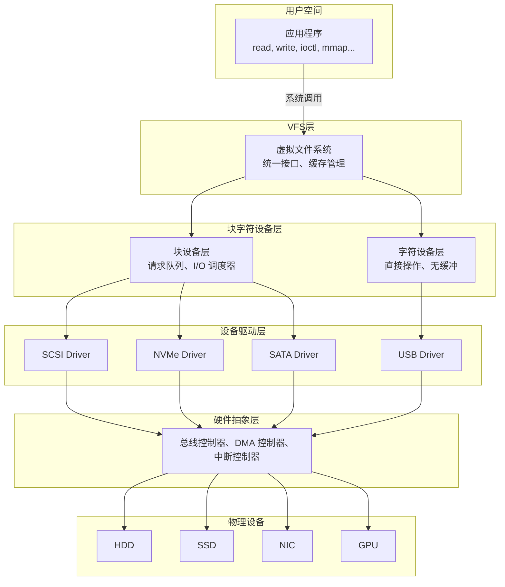

**各层职责**：

| 层次 | 职责 |
|------|------|
| 用户空间 | 应用程序通过系统调用访问 I/O |
| VFS 层 | 提供统一文件接口，管理缓存 |
| 块/字符设备层 | 区分设备类型，请求调度 |
| 设备驱动层 | 与具体硬件交互 |
| 硬件抽象层 | 总线、DMA、中断管理 |

### 面试官追问

**Q1: 块设备和字符设备的区别是什么？**

| 特性 | 块设备 | 字符设备 |
|------|--------|---------|
| 访问方式 | 随机访问 | 顺序访问 |
| 数据单位 | 固定大小块（512B/4KB） | 字节流 |
| 缓冲 | 有（页缓存） | 无或有限 |
| I/O 调度 | 有 | 无 |
| 请求合并 | 支持 | 不支持 |
| 寻址 | 块号/扇区号 | 无 |
| 典型设备 | 硬盘、SSD、U盘 | 终端、串口、鼠标 |
| 文件系统 | 可以挂载文件系统 | 不能 |

```c
// 块设备操作接口
struct block_device_operations {
    int (*open)(struct block_device *, fmode_t);
    void (*release)(struct gendisk *, fmode_t);
    int (*ioctl)(struct block_device *, fmode_t, 
                 unsigned, unsigned long);
    int (*submit_bio)(struct bio *bio);
    // ...
};

// 字符设备操作接口
struct file_operations {
    ssize_t (*read)(struct file *, char __user *, 
                    size_t, loff_t *);
    ssize_t (*write)(struct file *, const char __user *, 
                     size_t, loff_t *);
    long (*unlocked_ioctl)(struct file *, unsigned int, 
                          unsigned long);
    int (*open)(struct inode *, struct file *);
    int (*release)(struct inode *, struct file *);
    // ...
};
```

**Q2: 什么是设备号？如何区分设备？**

```c
/*
 * 设备号 = 主设备号 + 次设备号
 * 
 * 主设备号（Major）：标识设备驱动程序
 * 次设备号（Minor）：区分同一驱动管理的不同设备
 * 
 * 在 Linux 中，设备号是 32 位：
 * - 高 12 位：主设备号
 * - 低 20 位：次设备号
 */

#define MAJOR(dev)    ((unsigned int) ((dev) >> MINORBITS))
#define MINOR(dev)    ((unsigned int) ((dev) & MINORMASK))
#define MKDEV(ma,mi)  (((ma) << MINORBITS) | (mi))

// 例子
// /dev/sda  主设备号 8，次设备号 0
// /dev/sda1 主设备号 8，次设备号 1
// /dev/sdb  主设备号 8，次设备号 16
```

```bash
# 查看设备号
$ ls -la /dev/sda*
brw-rw---- 1 root disk 8, 0 Jan 31 10:00 /dev/sda
brw-rw---- 1 root disk 8, 1 Jan 31 10:00 /dev/sda1
brw-rw---- 1 root disk 8, 2 Jan 31 10:00 /dev/sda2
#                        ^  ^
#                        |  次设备号
#                        主设备号
```

---

## 问题 2：DMA 的工作原理

### 标准答案

**DMA（Direct Memory Access）**：允许外部设备直接访问内存，无需 CPU 参与数据传输。

**传统 I/O vs DMA I/O 对比**：

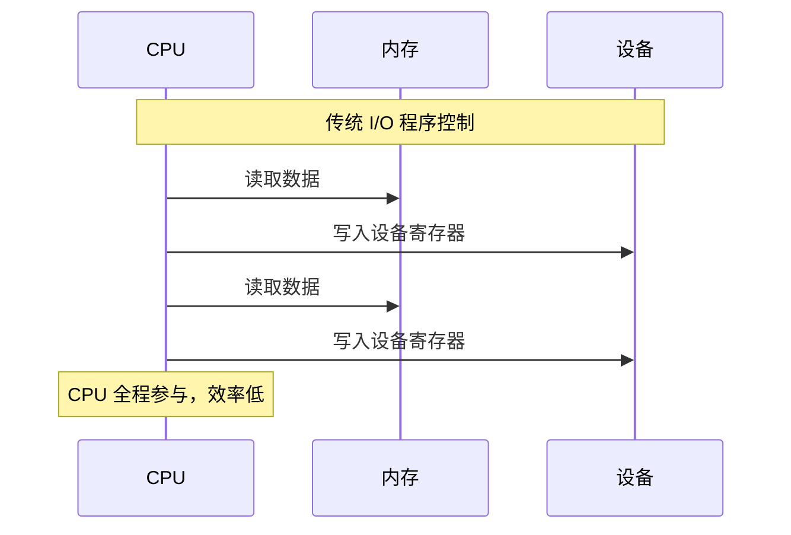

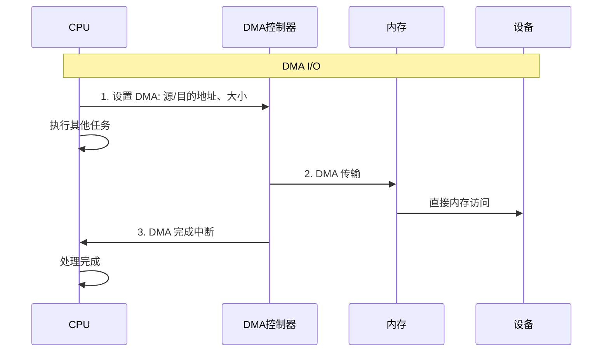

**DMA 工作流程详解**：

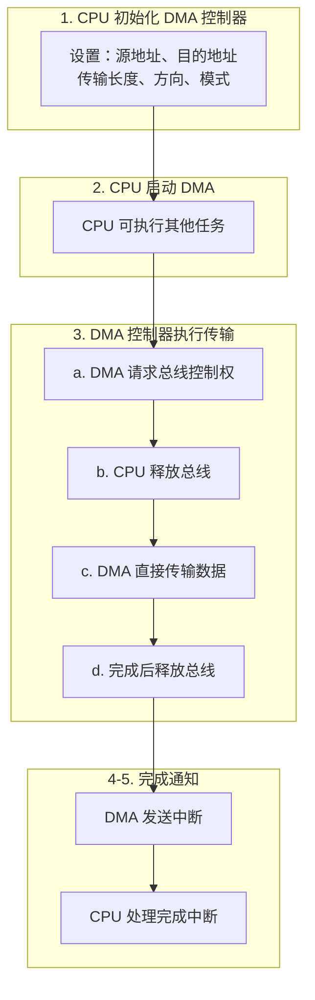

### 面试官追问

**Q1: DMA 的优缺点是什么？**

| 优点 | 缺点 |
|------|------|
| 释放 CPU，提高并行度 | 硬件成本增加 |
| 高速数据传输 | 编程复杂（需处理缓存一致性）|
| 减少 CPU 中断频率 | 占用内存总线带宽 |
| 适合大块数据传输 | 小数据传输开销反而大 |

**Q2: 什么是 DMA 缓存一致性问题？如何解决？**

**问题场景**：

**CPU 写入场景**：
1. CPU 写入数据到 cache（未刷新到内存）
2. DMA 从内存读取（读到旧数据）

`CPU → L1 Cache [新数据] → L2 Cache [新数据] → 内存 [旧数据]` ← DMA 读取（读到旧数据！）

**DMA 写入场景**：
1. DMA 写入数据到内存
2. CPU 从 cache 读取（读到旧数据）

`CPU ← L1 Cache [旧数据] ← L2 Cache [旧数据] ← 内存 [新数据]` ← DMA 写入（CPU 看不到新数据！）

**解决方案**：

```c
// Linux 内核的 DMA API

// 1. 一致性 DMA 映射（硬件保证一致性）
// 适合频繁访问的缓冲区
void *dma_alloc_coherent(struct device *dev, size_t size,
                         dma_addr_t *dma_handle, gfp_t flag);
void dma_free_coherent(struct device *dev, size_t size,
                       void *cpu_addr, dma_addr_t dma_handle);

// 2. 流式 DMA 映射（软件管理一致性）
// 适合单向、一次性传输
dma_addr_t dma_map_single(struct device *dev, void *ptr,
                          size_t size, 
                          enum dma_data_direction dir);
void dma_unmap_single(struct device *dev, dma_addr_t addr,
                      size_t size, 
                      enum dma_data_direction dir);

// 传输方向
enum dma_data_direction {
    DMA_BIDIRECTIONAL,  // 双向
    DMA_TO_DEVICE,      // 内存→设备（需要刷新 cache）
    DMA_FROM_DEVICE,    // 设备→内存（需要无效 cache）
    DMA_NONE,
};

// 3. 同步操作
// DMA 传输前：刷新 cache
dma_sync_single_for_device(dev, dma_addr, size, direction);

// DMA 传输后：无效 cache
dma_sync_single_for_cpu(dev, dma_addr, size, direction);
```

```c
// 使用示例：发送网络包
void send_packet(struct device *dev, void *data, size_t len) {
    // 1. 映射 DMA 地址
    dma_addr_t dma_addr = dma_map_single(dev, data, len, 
                                         DMA_TO_DEVICE);
    
    // 2. 同步：刷新 CPU cache 到内存
    dma_sync_single_for_device(dev, dma_addr, len, DMA_TO_DEVICE);
    
    // 3. 启动 DMA 传输
    start_dma_transfer(dma_addr, len);
    
    // 4. 等待完成（或在中断中处理）
    wait_for_dma_complete();
    
    // 5. 解除映射
    dma_unmap_single(dev, dma_addr, len, DMA_TO_DEVICE);
}
```

**Q3: 什么是 Scatter-Gather DMA？**

**传统 DMA**：需要连续的物理内存，只能传输连续区域

**Scatter-Gather DMA**：可以传输不连续的内存块

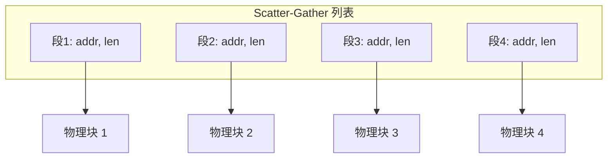

```c
// Linux Scatter-Gather API
struct scatterlist {
    unsigned long page_link;  // 页面指针
    unsigned int offset;      // 页内偏移
    unsigned int length;      // 长度
    dma_addr_t dma_address;   // DMA 地址
};

// 映射 scatter-gather 列表
int dma_map_sg(struct device *dev, struct scatterlist *sg,
               int nents, enum dma_data_direction dir);

// 使用场景：网络数据包（多个 fragment）、磁盘 I/O（多个页面）
```

---

## 问题 3：I/O 调度器的原理

### 标准答案

**I/O 调度器**：对块设备 I/O 请求进行排序和合并，优化磁盘访问性能。

**为什么需要 I/O 调度？**

机械硬盘特性：
- 寻道时间：3-15ms（磁头移动）
- 旋转延迟：2-8ms（等待扇区）
- 传输时间：很快

**顺序 vs 随机访问**：

| 模式 | 请求序列 | 磁头移动 | 距离 |
|------|----------|----------|------|
| 随机 I/O | 100, 500, 200, 600, 300 | 100→500→200→600→300 | 1200 柱面 |
| 调度后（SCAN） | 100, 200, 300, 500, 600 | 100→200→300→500→600 | 500 柱面 |

**性能提升**：约 2.4 倍

**Linux I/O 调度器类型**：

```
1. noop（无操作调度器）
   - 简单的 FIFO 队列
   - 只做请求合并，不排序
   - 适合 SSD（无寻道时间）和虚拟机

2. deadline（截止时间调度器）
   - 为每个请求设置截止时间
   - 防止请求饿死
   - 读请求优先（默认 500ms）
   - 写请求次之（默认 5s）
   - 适合数据库等延迟敏感应用

3. cfq（完全公平队列）
   - 每个进程一个队列
   - 时间片轮转
   - 适合桌面系统
   - Linux 5.0 后移除

4. mq-deadline（多队列版本）
   - deadline 的多队列版本
   - 适合 NVMe 等高性能设备

5. bfq（Budget Fair Queueing）
   - 基于预算的公平调度
   - 适合交互式应用
   - 低延迟保证

6. kyber
   - 为高速设备设计
   - 自动调整队列深度
   - 适合 NVMe SSD
```

### 面试官追问

**Q1: 详细解释 Deadline 调度器的工作原理**

**Deadline 调度器数据结构**：

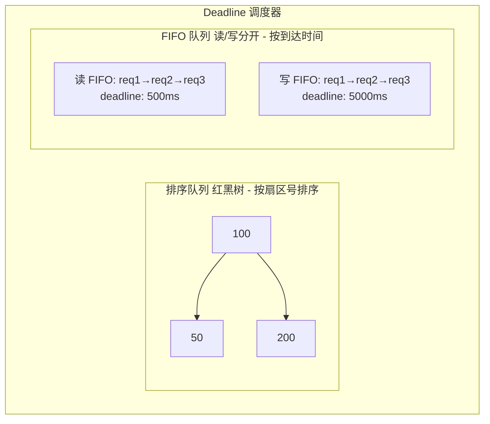

**调度算法**：

```c
// Deadline 调度逻辑（伪代码）
struct request *deadline_dispatch(struct deadline_data *dd) {
    // 1. 检查是否有读请求超时
    if (!list_empty(&dd->read_fifo)) {
        struct request *rq = list_first_entry(&dd->read_fifo);
        if (time_after_eq(jiffies, rq->deadline)) {
            // 读请求超时，优先派发
            return rq;
        }
    }
    
    // 2. 检查是否有写请求超时
    if (!list_empty(&dd->write_fifo)) {
        struct request *rq = list_first_entry(&dd->write_fifo);
        if (time_after_eq(jiffies, rq->deadline)) {
            // 写请求超时，派发
            return rq;
        }
    }
    
    // 3. 如果连续处理了太多写请求，强制处理读请求
    if (dd->writes_starved >= dd->writes_starved_limit) {
        if (!list_empty(&dd->read_fifo)) {
            dd->writes_starved = 0;
            return dispatch_from_sort_list(dd, READ);
        }
    }
    
    // 4. 按排序顺序派发（最小化寻道）
    // 优先读，其次写
    if (!list_empty(&dd->sort_list[READ]))
        return dispatch_from_sort_list(dd, READ);
    
    if (!list_empty(&dd->sort_list[WRITE])) {
        dd->writes_starved++;
        return dispatch_from_sort_list(dd, WRITE);
    }
    
    return NULL;
}
```

**Q2: SSD 为什么不需要传统 I/O 调度？**

**机械硬盘 vs SSD**：

| 特性 | 机械硬盘 | SSD |
|------|---------|-----|
| 顺序读 | 150-200 MB/s | 500-7000 MB/s |
| 随机读 | 0.5-2 MB/s（受寻道时间限制） | 同等水平（无机械部件） |
| 随机读 IOPS | 100-200 | 100,000-1,000,000 |
| 延迟主导因素 | 寻道时间 → 需要 I/O 调度优化 | 无寻道时间 → 调度优化效果有限 |

**SSD 推荐调度器**：
- noop / none：最小开销
- mq-deadline：简单合并 + 截止时间保证
- kyber：自动队列深度调整

**Q3: 什么是请求合并（Request Merge）？**

```
请求合并：将相邻的 I/O 请求合并成一个

前向合并（Front Merge）：
新请求在已有请求之前
  新请求: [100-200]
  已有请求:        [200-400]
  合并后: [100-400]

后向合并（Back Merge）：
新请求在已有请求之后
  已有请求: [100-200]
  新请求:          [200-400]
  合并后: [100-400]

合并的好处：
- 减少 I/O 请求数量
- 减少寻道次数
- 提高吞吐量

Linux 实现：
- plug/unplug 机制
- 延迟提交请求，积累后合并
```

```c
// 检查是否可以合并
bool blk_attempt_plug_merge(struct request_queue *q,
                           struct bio *bio) {
    struct blk_plug *plug = current->plug;
    struct request *rq;
    
    if (!plug)
        return false;
    
    list_for_each_entry(rq, &plug->list, queuelist) {
        if (rq->q != q)
            continue;
        
        // 检查是否可以后向合并
        if (blk_rq_merge_ok(rq, bio) &&
            blk_try_merge(rq, bio) == ELEVATOR_BACK_MERGE) {
            bio_attempt_back_merge(rq, bio);
            return true;
        }
    }
    return false;
}
```

---

## 问题 4：中断驱动 I/O vs 轮询 I/O

### 标准答案

**中断驱动 I/O**：

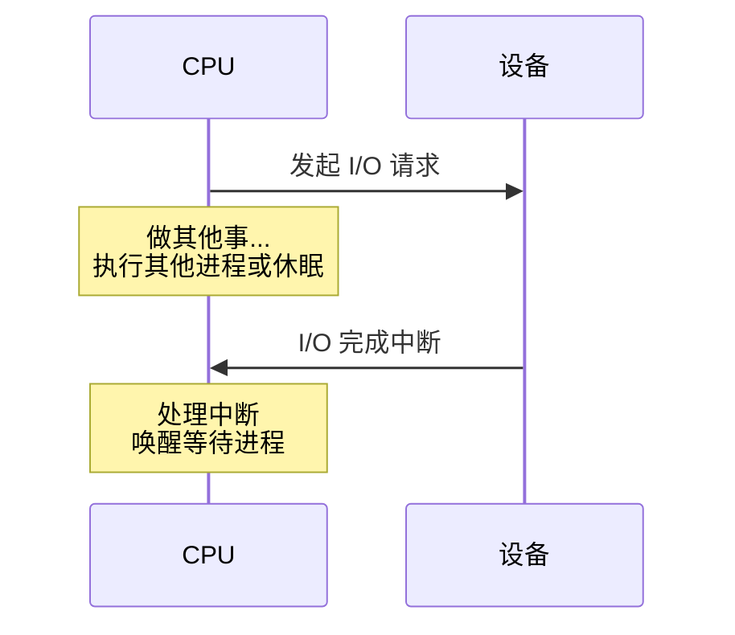

> 优点：CPU 利用率高  
> 缺点：中断开销（上下文切换、缓存污染）

**轮询 I/O**：

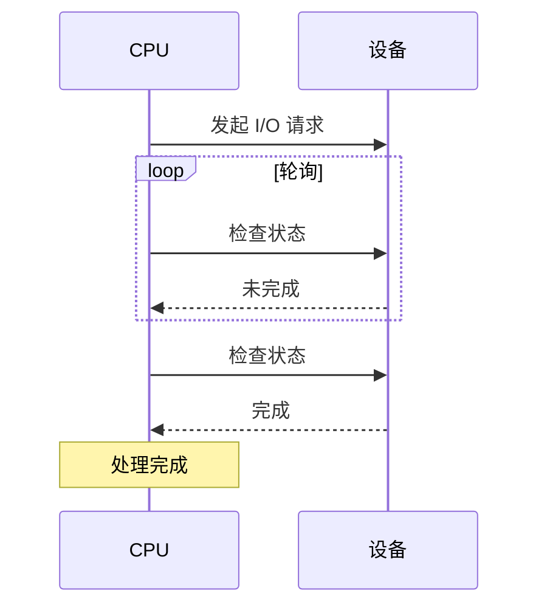

> 优点：延迟低（无中断开销）、延迟可预测  
> 缺点：CPU 占用 100%

**混合模式（中断合并 + 自适应轮询）**：

```c
/*
 * NAPI (New API) - Linux 网络子系统的混合模式
 * 
 * 低负载：使用中断
 * 高负载：切换到轮询
 */

// 1. 收到中断时，禁用中断，启动轮询
static irqreturn_t my_interrupt(int irq, void *dev_id) {
    struct my_device *dev = dev_id;
    
    if (likely(napi_schedule_prep(&dev->napi))) {
        // 禁用设备中断
        disable_irq(dev);
        // 启动 NAPI 轮询
        __napi_schedule(&dev->napi);
    }
    return IRQ_HANDLED;
}

// 2. 轮询函数处理数据包
static int my_poll(struct napi_struct *napi, int budget) {
    struct my_device *dev = container_of(napi, struct my_device, napi);
    int work_done = 0;
    
    // 处理数据包，直到预算用完或队列空
    while (work_done < budget) {
        struct packet *pkt = get_next_packet(dev);
        if (!pkt)
            break;
        
        process_packet(pkt);
        work_done++;
    }
    
    // 如果处理完所有包，重新启用中断
    if (work_done < budget) {
        napi_complete_done(napi, work_done);
        enable_irq(dev);
    }
    
    return work_done;
}
```

### 面试官追问

**Q1: HFT 系统为什么倾向于使用轮询？**

**HFT 对延迟的要求**：

**中断模式延迟分解**：

| 阶段 | 延迟 |
|------|------|
| 设备产生中断 | 0 |
| 中断传递到 CPU | ~100ns |
| CPU 中断响应 | ~500ns-1μs |
| 中断处理程序执行 | ~1-5μs |
| 上下文切换到用户进程 | ~1-5μs |
| **总延迟** | **~3-12μs** |

问题：延迟不可预测（受其他中断、调度影响），且会导致缓存污染。

**轮询模式延迟**：

| 阶段 | 延迟 |
|------|------|
| 检测到数据到达 | ~几十ns（取决于轮询间隔） |
| 处理数据 | 立即 |
| **总延迟** | **<1μs** |

优势：延迟稳定可预测、无上下文切换、缓存保持热状态。

**HFT 实践**：
- 使用 DPDK/Solarflare 等内核旁路技术
- 专用 CPU 核心做轮询（isolcpus）
- 禁用中断（或将中断导向其他核心）

**Q2: 中断合并（Interrupt Coalescing）是什么？**

**中断合并**：多个事件触发一次中断

- **未合并**：事件1 → 中断1 → 处理 → 事件2 → 中断2 → 处理 → 事件3 → 中断3 → 处理（中断开销：3 次）
- **合并后**：事件1 + 事件2 + 事件3 → 中断1 → 处理（3个事件）（中断开销：1 次）

**合并参数**：
- `rx-usecs`：等待时间（微秒）
- `rx-frames`：等待帧数

**权衡**：
- 合并多 → 吞吐量高，延迟高
- 合并少 → 延迟低，CPU 开销大

```bash
# 查看当前设置
ethtool -c eth0

# 设置中断合并（低延迟配置）
ethtool -C eth0 rx-usecs 0 tx-usecs 0 rx-frames 1 tx-frames 1

# 设置中断合并（高吞吐配置）
ethtool -C eth0 rx-usecs 100 tx-usecs 100 rx-frames 64 tx-frames 64
```

---

## 问题 5：I/O 缓冲策略

### 标准答案

**I/O 缓冲类型**：

| 类型 | 结构 | 特点 |
|------|------|------|
| 无缓冲 | 用户进程 → 设备 | 适用于实时性要求高的场景 |
| 单缓冲 | 用户进程 → 缓冲区 → 设备 | 传输时用户必须等待 |
| 双缓冲 | 用户进程 → 缓冲区A/B → 设备 | 用户写A时设备读B，提高并行度 |
| 环形缓冲 | 循环数组 + head/tail指针 | 常用于网络接收、音视频流 |

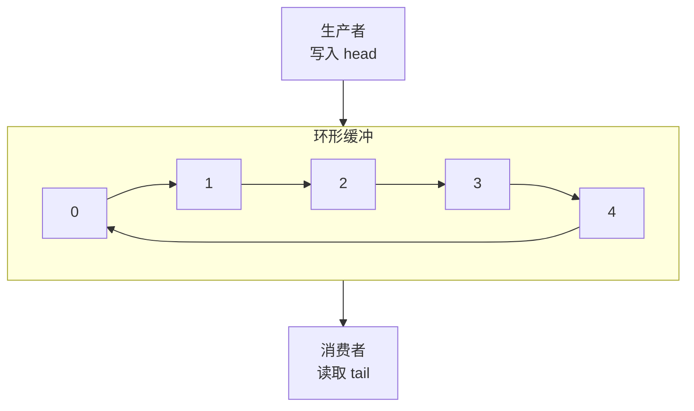

### 面试官追问

**Q1: 页缓存（Page Cache）如何工作？**

**页缓存架构**：

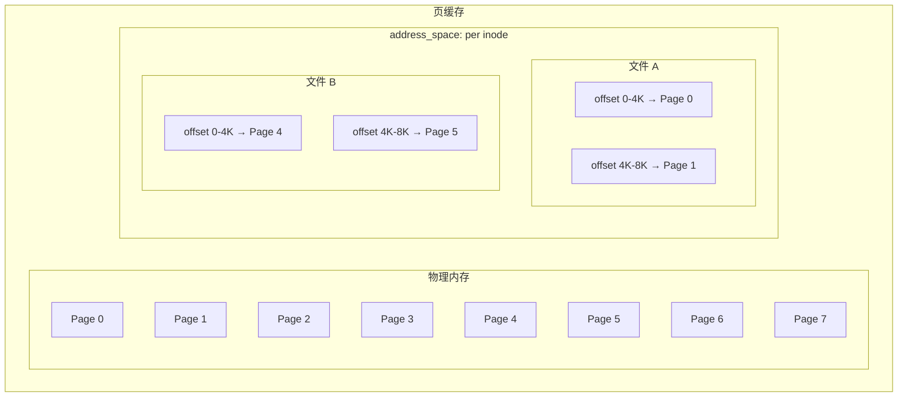

**读取流程**：
1. 进程调用 `read()`
2. 检查页缓存是否有该页面
3. 如果有（缓存命中），直接返回
4. 如果没有（缓存未命中），从磁盘读取并缓存

**写入流程**：
1. 进程调用 `write()`
2. 数据写入页缓存
3. 页面标记为脏（dirty）
4. 后台 writeback 线程异步写入磁盘

**Q2: 如何避免页缓存？**

```c
// 方法 1：O_DIRECT（绕过页缓存）
int fd = open("file", O_RDWR | O_DIRECT);
// 需要对齐的缓冲区
void *buf;
posix_memalign(&buf, 4096, size);
read(fd, buf, size);

// 方法 2：O_SYNC（同步写入）
int fd = open("file", O_RDWR | O_SYNC);
write(fd, buf, size);  // 等待数据写入磁盘

// 方法 3：mmap + msync
void *ptr = mmap(NULL, size, PROT_READ | PROT_WRITE,
                 MAP_SHARED, fd, 0);
memcpy(ptr, data, size);
msync(ptr, size, MS_SYNC);  // 同步到磁盘

// 方法 4：使用 fadvise 提示
posix_fadvise(fd, 0, 0, POSIX_FADV_DONTNEED);  // 释放缓存
```

---

## 问题 6：设备驱动模型

### 标准答案

```
Linux 设备驱动模型：

**sysfs 文件系统结构**：

```
/sys/
├── bus/           # 总线类型（pci/, usb/, platform/）
├── class/         # 设备类（net/, block/, tty/）
├── devices/       # 设备层次结构
└── module/        # 内核模块
```

**核心结构体关系**：

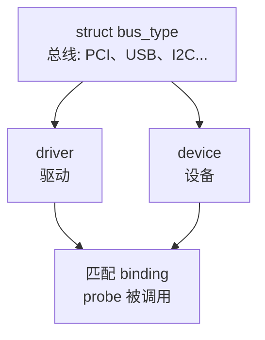

**驱动注册流程**：

```c
// 1. 定义驱动结构
static struct pci_driver my_driver = {
    .name     = "my_device",
    .id_table = my_id_table,    // 支持的设备 ID
    .probe    = my_probe,       // 设备匹配时调用
    .remove   = my_remove,      // 设备移除时调用
};

// 2. 设备 ID 表
static const struct pci_device_id my_id_table[] = {
    { PCI_DEVICE(VENDOR_ID, DEVICE_ID) },
    { 0 }  // 结束标记
};

// 3. probe 函数（设备初始化）
static int my_probe(struct pci_dev *pdev,
                    const struct pci_device_id *id) {
    int ret;
    
    // 启用设备
    ret = pci_enable_device(pdev);
    if (ret)
        return ret;
    
    // 请求 I/O 区域
    ret = pci_request_regions(pdev, "my_device");
    if (ret)
        goto err_disable;
    
    // 映射 BAR
    void __iomem *base = pci_iomap(pdev, 0, 0);
    if (!base) {
        ret = -ENOMEM;
        goto err_release;
    }
    
    // 设置 DMA
    ret = dma_set_mask_and_coherent(&pdev->dev, DMA_BIT_MASK(64));
    if (ret)
        goto err_unmap;
    
    // 注册中断
    ret = request_irq(pdev->irq, my_interrupt, IRQF_SHARED,
                      "my_device", pdev);
    if (ret)
        goto err_unmap;
    
    // 保存私有数据
    pci_set_drvdata(pdev, my_data);
    
    return 0;

err_unmap:
    pci_iounmap(pdev, base);
err_release:
    pci_release_regions(pdev);
err_disable:
    pci_disable_device(pdev);
    return ret;
}

// 4. remove 函数（设备清理）
static void my_remove(struct pci_dev *pdev) {
    struct my_data *data = pci_get_drvdata(pdev);
    
    free_irq(pdev->irq, pdev);
    pci_iounmap(pdev, data->base);
    pci_release_regions(pdev);
    pci_disable_device(pdev);
    kfree(data);
}

// 5. 模块初始化/退出
static int __init my_init(void) {
    return pci_register_driver(&my_driver);
}

static void __exit my_exit(void) {
    pci_unregister_driver(&my_driver);
}

module_init(my_init);
module_exit(my_exit);
```

### 面试官追问

**Q1: 什么是热插拔（Hot Plug）？内核如何处理？**

**热插拔流程**：

**1. 设备插入**：
1. 总线检测到新设备
2. 总线调用 `bus->probe()` 或发送 uevent
3. udev 接收 uevent，创建 `/dev` 节点
4. 内核匹配驱动，调用 `driver->probe()`
5. 驱动初始化设备

**2. 设备拔出**：
1. 总线检测到设备移除
2. 内核调用 `driver->remove()`
3. 驱动清理资源
4. udev 接收 uevent，删除 `/dev` 节点

**uevent 示例**（USB 设备插入）：

```
ACTION=add
DEVPATH=/devices/pci0000:00/0000:00:14.0/usb1/1-1
SUBSYSTEM=usb
DEVTYPE=usb_device
PRODUCT=1234/5678/0100
```

**Q2: I/O 内存映射（MMIO）vs 端口 I/O（PIO）的区别？**

**端口 I/O (Port I/O)**：
- 使用独立的 I/O 地址空间（0x0000 - 0xFFFF，64KB）
- x86 特有（in/out 指令）
- 地址空间小，较慢（需要特殊指令）
- 示例：`in al, 0x3F8`（读COM1）、`out 0x3F8, al`（写COM1）

**内存映射 I/O (MMIO)**：
- 设备寄存器映射到内存地址空间
- 使用普通内存指令访问（`mov eax, [0xFEDC0000]`）
- 地址空间大，较快（CPU 缓存、流水线）

| 地址范围 | 用途 |
|---------|------|
| 0x00000000 - 0x7FFFFFFF | 内存 |
| 0xFEDC0000 - 0xFEDCFFFF | 设备 A |
| 0xFEDD0000 - 0xFEDDFFFF | 设备 B |
```

```c
// Linux 中的 MMIO 访问
#include <asm/io.h>

// 映射设备内存
void __iomem *base = ioremap(phys_addr, size);

// 读写（带内存屏障）
u32 val = readl(base + offset);
writel(val, base + offset);

// 读写（无内存屏障，性能更好）
u32 val = __raw_readl(base + offset);
__raw_writel(val, base + offset);

// 解除映射
iounmap(base);
```

---

## 高频考点总结

| 考点 | 频率 | 重点 |
|------|------|------|
| I/O 架构 | ★★★ | 分层结构、块/字符设备 |
| DMA | ★★★ | 工作原理、缓存一致性 |
| I/O 调度器 | ★★★ | 算法原理、适用场景 |
| 中断 vs 轮询 | ★★☆ | 优缺点、混合模式 |
| 缓冲策略 | ★★☆ | 页缓存、双缓冲 |
| 设备驱动 | ★★☆ | 模型、热插拔 |
| MMIO | ★★☆ | vs 端口 I/O |

---

## 导航

- [上一篇：OS笔试题-磁盘与IO调度](@/articles/os/os-17-OS笔试题-磁盘与IO调度.md)
