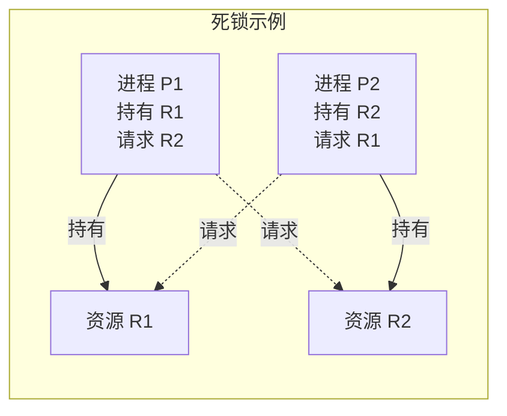
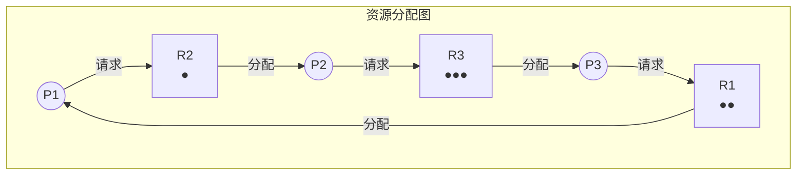
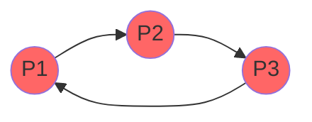

+++
title = "19.死锁专题详解"
date = 2026-02-02
description = "死锁：四个必要条件、预防避免检测恢复、银行家算法、资源分配图"
[taxonomies]
tags = ["OS", "死锁", "并发", "银行家算法"]
+++

# 死锁专题详解

本文深入分析操作系统中的死锁问题，包括死锁的四个必要条件、预防/避免/检测/恢复策略、银行家算法等内容。

---

## 一、死锁概述

### 1.1 什么是死锁

**死锁（Deadlock）**：一组进程中的每个进程都在等待只能由该组中其他进程才能引发的事件，从而永远阻塞。



### 1.2 死锁的四个必要条件

| 条件 | 描述 | 打破方法 |
|------|------|----------|
| **互斥（Mutual Exclusion）** | 资源不能共享，一次只能一个进程使用 | 使用可共享资源 |
| **占有并等待（Hold and Wait）** | 进程持有资源同时等待其他资源 | 一次性申请所有资源 |
| **非抢占（No Preemption）** | 资源只能自愿释放 | 允许抢占 |
| **循环等待（Circular Wait）** | 存在进程的循环等待链 | 资源有序分配 |

**四个条件缺一不可**，打破任一条件可预防死锁。

### 1.3 资源分配图



- **请求边**：进程 → 资源（虚线）
- **分配边**：资源 → 进程（实线）
- **环的存在**不一定是死锁（多实例资源）
- **单实例资源**：有环 ⟺ 死锁

---

## 二、死锁预防（Prevention）

### 2.1 破坏互斥条件

- 某些资源本质上不可共享（打印机、磁带机）
- **Spooling**：通过假脱机技术，将独占资源虚拟化为共享

### 2.2 破坏占有并等待

**方法 1：一次性申请所有资源**

```c
// 伪代码
void process() {
    // 一次性申请所有需要的资源
    request_all(R1, R2, R3);
    
    // 使用资源
    use_resources();
    
    // 释放所有资源
    release_all(R1, R2, R3);
}
```

**缺点**：
- 资源利用率低
- 可能导致饥饿
- 难以预知需要的资源

**方法 2：申请新资源前释放已有资源**

```c
void process() {
    request(R1);
    use(R1);
    release(R1);  // 释放后再申请其他
    
    request(R2);
    use(R2);
    release(R2);
}
```

### 2.3 破坏非抢占

**允许资源被抢占**：

```c
bool request_resource(Process *p, Resource *r) {
    if (r->available()) {
        r->allocate_to(p);
        return true;
    }
    
    // 如果资源被低优先级进程持有，可以抢占
    if (r->holder->priority < p->priority) {
        preempt(r, p);
        return true;
    }
    
    // 释放自己的资源，等待
    release_all_resources(p);
    wait(r);
    return false;
}
```

**适用场景**：可保存/恢复状态的资源（CPU、内存）

### 2.4 破坏循环等待

**资源有序分配**：为所有资源编号，进程必须按编号顺序申请。

```c
// 资源编号
enum Resource { R1 = 1, R2 = 2, R3 = 3, R4 = 4 };

void process() {
    // 必须按升序申请
    request(R1);  // 编号 1
    request(R3);  // 编号 3 (> 1)
    request(R4);  // 编号 4 (> 3)
    
    // 错误：不能申请编号更小的资源
    // request(R2);  // 编号 2 < 4，违反规则
    
    use_resources();
    
    // 释放顺序无要求
    release(R4);
    release(R1);
    release(R3);
}
```

**证明**：假设存在循环 P1 → R1 → P2 → R2 → ... → Pn → Rn → P1
- P1 持有 R1，请求 R2，则 R1 < R2
- P2 持有 R2，请求 R3，则 R2 < R3
- ...
- Pn 持有 Rn，请求 R1，则 Rn < R1
- 矛盾：R1 < R2 < ... < Rn < R1

---

## 三、死锁避免（Avoidance）

### 3.1 安全状态

**安全状态**：存在一个进程序列 <P1, P2, ..., Pn>，使得每个 Pi 的资源请求都能被满足。


**关键**：不安全状态不一定是死锁，但死锁一定是不安全状态。

### 3.2 银行家算法

**数据结构**：

```c
int n;  // 进程数
int m;  // 资源类型数

int Available[m];      // 可用资源
int Max[n][m];         // 最大需求
int Allocation[n][m];  // 已分配
int Need[n][m];        // 还需要 = Max - Allocation
```

**安全性检查算法**：

```c
bool is_safe_state() {
    int Work[m];
    bool Finish[n] = {false};
    
    // 初始化 Work
    for (int j = 0; j < m; j++)
        Work[j] = Available[j];
    
    // 找安全序列
    while (true) {
        bool found = false;
        
        for (int i = 0; i < n; i++) {
            if (!Finish[i] && can_satisfy(Need[i], Work)) {
                // 进程 i 可以完成
                for (int j = 0; j < m; j++)
                    Work[j] += Allocation[i][j];
                Finish[i] = true;
                found = true;
                printf("P%d can finish\n", i);
            }
        }
        
        if (!found) break;
    }
    
    // 检查是否所有进程都完成
    for (int i = 0; i < n; i++)
        if (!Finish[i]) return false;
    
    return true;
}

bool can_satisfy(int need[], int work[]) {
    for (int j = 0; j < m; j++)
        if (need[j] > work[j]) return false;
    return true;
}
```

**资源请求算法**：

```c
bool request_resources(int process_id, int request[]) {
    // 1. 检查请求是否超过声明的需求
    for (int j = 0; j < m; j++) {
        if (request[j] > Need[process_id][j]) {
            error("Request exceeds max need");
            return false;
        }
    }
    
    // 2. 检查请求是否超过可用资源
    for (int j = 0; j < m; j++) {
        if (request[j] > Available[j]) {
            // 必须等待
            return false;
        }
    }
    
    // 3. 尝试分配（假装分配）
    for (int j = 0; j < m; j++) {
        Available[j] -= request[j];
        Allocation[process_id][j] += request[j];
        Need[process_id][j] -= request[j];
    }
    
    // 4. 检查是否仍是安全状态
    if (is_safe_state()) {
        return true;  // 允许分配
    }
    
    // 5. 不安全，回滚
    for (int j = 0; j < m; j++) {
        Available[j] += request[j];
        Allocation[process_id][j] -= request[j];
        Need[process_id][j] += request[j];
    }
    
    return false;  // 拒绝请求
}
```

### 3.3 银行家算法示例

**初始状态**：

| 进程 | Allocation (A B C) | Max (A B C) | Need (A B C) |
|------|-------------------|-------------|--------------|
| P0 | 0 1 0 | 7 5 3 | 7 4 3 |
| P1 | 2 0 0 | 3 2 2 | 1 2 2 |
| P2 | 3 0 2 | 9 0 2 | 6 0 0 |
| P3 | 2 1 1 | 2 2 2 | 0 1 1 |
| P4 | 0 0 2 | 4 3 3 | 4 3 1 |

**Available**: (3, 3, 2)

**安全性检查**：

1. Work = (3, 3, 2)
2. P1: Need(1,2,2) ≤ Work(3,3,2) ✓ → Work = (5, 3, 2)
3. P3: Need(0,1,1) ≤ Work(5,3,2) ✓ → Work = (7, 4, 3)
4. P4: Need(4,3,1) ≤ Work(7,4,3) ✓ → Work = (7, 4, 5)
5. P0: Need(7,4,3) ≤ Work(7,4,5) ✓ → Work = (7, 5, 5)
6. P2: Need(6,0,0) ≤ Work(7,5,5) ✓ → Work = (10, 5, 7)

**安全序列**：<P1, P3, P4, P0, P2>

---

## 四、死锁检测（Detection）

### 4.1 单实例资源

使用**等待图（Wait-for Graph）**：



**检测方法**：DFS 检测环

```c
bool has_cycle() {
    enum { WHITE, GRAY, BLACK } color[n];
    
    for (int i = 0; i < n; i++)
        color[i] = WHITE;
    
    for (int i = 0; i < n; i++) {
        if (color[i] == WHITE && dfs_cycle(i, color))
            return true;
    }
    return false;
}

bool dfs_cycle(int u, int color[]) {
    color[u] = GRAY;
    
    for (int v : waiting_for[u]) {
        if (color[v] == GRAY) return true;  // 发现环
        if (color[v] == WHITE && dfs_cycle(v, color)) return true;
    }
    
    color[u] = BLACK;
    return false;
}
```

### 4.2 多实例资源

类似银行家算法的检测：

```c
bool detect_deadlock() {
    int Work[m];
    bool Finish[n];
    
    // 初始化
    for (int j = 0; j < m; j++)
        Work[j] = Available[j];
    
    for (int i = 0; i < n; i++)
        Finish[i] = (Allocation[i] == 0);  // 无资源的进程标记完成
    
    // 尝试推进
    while (true) {
        bool found = false;
        
        for (int i = 0; i < n; i++) {
            if (!Finish[i] && Request[i] <= Work) {
                Work += Allocation[i];
                Finish[i] = true;
                found = true;
            }
        }
        
        if (!found) break;
    }
    
    // 未完成的进程处于死锁
    for (int i = 0; i < n; i++)
        if (!Finish[i]) return true;
    
    return false;
}
```

### 4.3 检测频率

| 策略 | 优点 | 缺点 |
|------|------|------|
| 每次请求检测 | 立即发现 | 开销大 |
| 定时检测 | 开销小 | 延迟发现 |
| CPU 利用率低时检测 | 高效 | 可能延迟 |

---

## 五、死锁恢复（Recovery）

### 5.1 进程终止

**方法 1：终止所有死锁进程**
- 简单粗暴
- 代价大

**方法 2：逐个终止直到解除**

选择牺牲进程的标准：
- 进程优先级
- 已执行时间和剩余时间
- 已使用资源数量
- 完成所需资源
- 进程类型（交互式/批处理）

```c
void recover_by_termination() {
    while (detect_deadlock()) {
        Process *victim = select_victim();
        terminate(victim);
        release_resources(victim);
    }
}

Process* select_victim() {
    Process *victim = NULL;
    int min_cost = INT_MAX;
    
    for (Process *p : deadlocked_processes) {
        int cost = calculate_cost(p);
        if (cost < min_cost) {
            min_cost = cost;
            victim = p;
        }
    }
    return victim;
}
```

### 5.2 资源抢占

**步骤**：
1. 选择牺牲者
2. 回滚到安全状态
3. 防止饥饿（限制被抢占次数）

```c
void recover_by_preemption() {
    while (detect_deadlock()) {
        Resource *r = select_resource_to_preempt();
        Process *holder = r->holder;
        
        // 保存状态
        save_state(holder);
        
        // 抢占资源
        preempt(r, holder);
        
        // 分配给等待者
        allocate(r, waiting_process);
        
        // 回滚 holder
        rollback(holder);
    }
}
```

---

## 六、实际系统中的死锁处理

### 6.1 鸵鸟算法

**忽略死锁问题**：

- 死锁发生概率低
- 预防/避免的代价高
- 手动重启解决

**使用者**：Unix, Linux, Windows

### 6.2 Linux 内核中的死锁预防

```c
// 锁顺序规则
/*
 * Lock ordering:
 * 1. task->alloc_lock
 * 2. task->sighand->siglock
 * 3. mm->mmap_lock
 */

// lockdep 检测
#ifdef CONFIG_LOCKDEP
    lock_acquire(&lock->dep_map, 0, 0, 0, 1, NULL, _RET_IP_);
#endif
```

### 6.3 数据库中的死锁处理

```sql
-- 设置超时
SET innodb_lock_wait_timeout = 5;

-- 检测死锁
SHOW ENGINE INNODB STATUS;

-- 死锁日志
-- LATEST DETECTED DEADLOCK
-- *** (1) TRANSACTION:
-- *** (1) WAITING FOR THIS LOCK TO BE GRANTED:
-- *** (2) TRANSACTION:
-- *** (2) HOLDS THE LOCK(S):
-- *** WE ROLL BACK TRANSACTION (1)
```

---

## 七、常见面试问题

**Q: 死锁和活锁的区别？**

| 特性 | 死锁 | 活锁 |
|------|------|------|
| 状态 | 阻塞 | 忙等待 |
| CPU | 不消耗 | 消耗 |
| 检测 | 较容易 | 较难 |
| 示例 | 互相等待 | 互相让步 |

**Q: 银行家算法的时间复杂度？**

A: O(m × n²)，其中 m 是资源类型数，n 是进程数。

**Q: 如何预防死锁而不影响并发性？**

A:
1. 使用资源有序分配
2. 设置超时机制
3. 使用 try_lock 非阻塞获取
4. 使用读写锁减少互斥

---

## 相关文章

- [OS笔试题-同步与死锁](/articles/os/os-11-OS笔试题-同步与死锁/)
- [OS面试题-并发同步](/articles/os/os-15-OS面试题-并发同步/)
- [内核同步机制详解](/articles/linux/linux-18-内核同步机制详解/)
