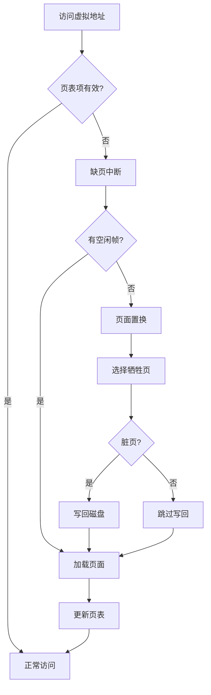
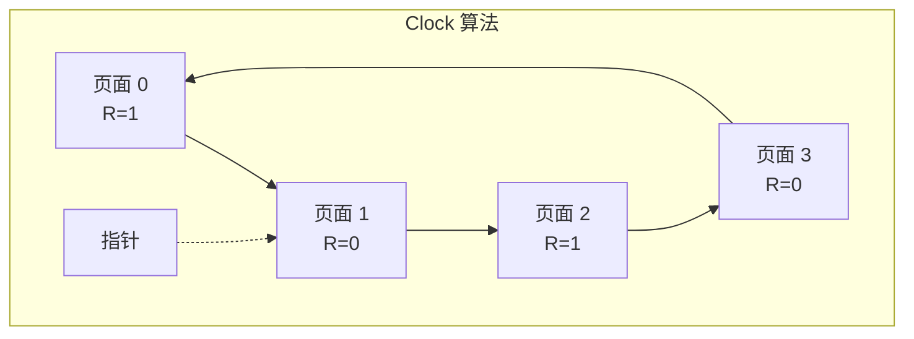
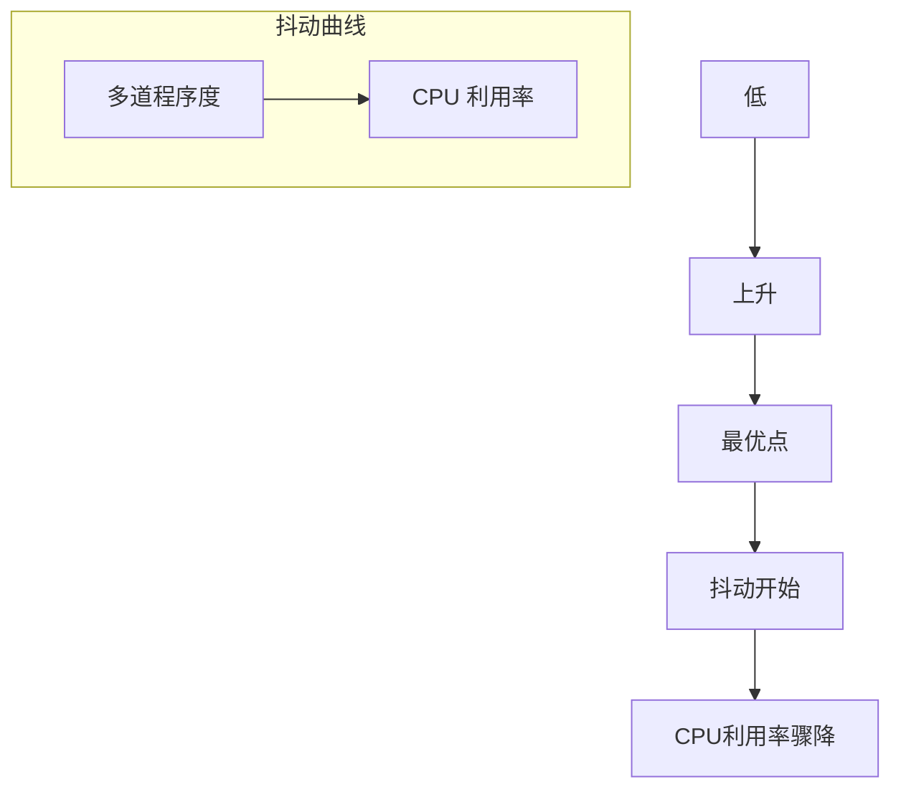

+++
title = "页面置换算法详解"
date = 2026-02-02
weight = 20000
description = "页面置换算法：FIFO、LRU、LFU、Clock、工作集、抖动"
[taxonomies]
tags = ["OS", "内存管理", "虚拟内存", "页面置换"]
+++

# 页面置换算法详解

本文深入分析虚拟内存中的页面置换算法，包括 FIFO、LRU、LFU、Clock 等经典算法，以及工作集模型和抖动问题。

---

## 一、页面置换概述

### 1.1 为什么需要页面置换

当发生**缺页中断（Page Fault）**且物理内存已满时，需要选择一个页面换出：



### 1.2 评价指标

| 指标 | 描述 | 目标 |
|------|------|------|
| **缺页率** | 缺页次数/总访问次数 | 越低越好 |
| **置换开销** | 算法执行时间 | 越低越好 |
| **内存开销** | 辅助数据结构 | 越低越好 |
| **实现复杂度** | 硬件/软件支持 | 越简单越好 |

### 1.3 Belady 异常

**Belady 异常**：增加物理帧数反而导致缺页率上升。

```
页面引用序列: 1, 2, 3, 4, 1, 2, 5, 1, 2, 3, 4, 5

3 帧 FIFO: 9 次缺页
4 帧 FIFO: 10 次缺页 ← 更多帧反而更多缺页！
```

**只有 FIFO 可能出现 Belady 异常**，栈算法（LRU、OPT）不会。

---

## 二、最优算法（OPT）

### 2.1 算法描述

**OPT（Optimal）**：置换将来最长时间不会被使用的页面。

```c
int opt_select_victim(int *frames, int frame_count,
                      int *future_refs, int future_count) {
    int victim = 0;
    int max_distance = -1;
    
    for (int i = 0; i < frame_count; i++) {
        int distance = find_next_use(frames[i], future_refs, future_count);
        
        if (distance == INT_MAX) {
            return i;  // 将来不再使用，立即选中
        }
        
        if (distance > max_distance) {
            max_distance = distance;
            victim = i;
        }
    }
    
    return victim;
}

int find_next_use(int page, int *future_refs, int count) {
    for (int i = 0; i < count; i++) {
        if (future_refs[i] == page)
            return i;
    }
    return INT_MAX;  // 将来不再使用
}
```

### 2.2 特点

| 优点 | 缺点 |
|------|------|
| 缺页率最低（理论最优） | 需要预知未来访问序列 |
| 作为其他算法的比较基准 | **无法实际实现** |

---

## 三、FIFO 算法

### 3.1 算法描述

**FIFO（First-In First-Out）**：置换最早进入内存的页面。

```c
struct FIFOQueue {
    int *pages;
    int head, tail, size, capacity;
};

void fifo_access(FIFOQueue *q, int page, int *frames) {
    // 检查是否命中
    for (int i = 0; i < q->size; i++) {
        if (frames[i] == page) return;  // 命中，无需操作
    }
    
    // 缺页
    if (q->size < q->capacity) {
        // 有空闲帧
        frames[q->size] = page;
        enqueue(q, page);
    } else {
        // 置换最早的页面
        int victim_idx = find_frame(frames, q->pages[q->head]);
        frames[victim_idx] = page;
        dequeue(q);
        enqueue(q, page);
    }
}
```

### 3.2 示例

```
页面引用: 7, 0, 1, 2, 0, 3, 0, 4, 2, 3, 0, 3, 2, 1, 2, 0, 1, 7, 0, 1
帧数: 3

步骤:
7 → [7, -, -] 缺页
0 → [7, 0, -] 缺页
1 → [7, 0, 1] 缺页
2 → [2, 0, 1] 缺页 (置换7)
0 → [2, 0, 1] 命中
3 → [2, 3, 1] 缺页 (置换0)
0 → [2, 3, 0] 缺页 (置换1)
4 → [4, 3, 0] 缺页 (置换2)
...

总缺页: 15 次
```

### 3.3 特点

| 优点 | 缺点 |
|------|------|
| 实现简单 | 性能较差 |
| 开销小 | 可能出现 Belady 异常 |
| | 不考虑页面使用频率 |

---

## 四、LRU 算法

### 4.1 算法描述

**LRU（Least Recently Used）**：置换最近最少使用的页面。

**实现方式 1：计数器**

```c
struct LRUCounter {
    int page;
    uint64_t last_access_time;
};

void lru_counter_access(LRUCounter *entries, int count, int page) {
    uint64_t current_time = get_timestamp();
    
    for (int i = 0; i < count; i++) {
        if (entries[i].page == page) {
            entries[i].last_access_time = current_time;
            return;  // 命中
        }
    }
    
    // 缺页：找最小时间戳
    int victim = 0;
    uint64_t min_time = UINT64_MAX;
    
    for (int i = 0; i < count; i++) {
        if (entries[i].last_access_time < min_time) {
            min_time = entries[i].last_access_time;
            victim = i;
        }
    }
    
    entries[victim].page = page;
    entries[victim].last_access_time = current_time;
}
```

**实现方式 2：栈**

```c
struct LRUStack {
    int *stack;
    int size;
    int capacity;
};

void lru_stack_access(LRUStack *s, int page) {
    // 查找页面
    int pos = -1;
    for (int i = 0; i < s->size; i++) {
        if (s->stack[i] == page) {
            pos = i;
            break;
        }
    }
    
    if (pos >= 0) {
        // 命中：移到栈顶
        for (int i = pos; i < s->size - 1; i++)
            s->stack[i] = s->stack[i + 1];
        s->stack[s->size - 1] = page;
    } else {
        // 缺页
        if (s->size < s->capacity) {
            s->stack[s->size++] = page;
        } else {
            // 置换栈底
            for (int i = 0; i < s->size - 1; i++)
                s->stack[i] = s->stack[i + 1];
            s->stack[s->size - 1] = page;
        }
    }
}
```

### 4.2 特点

| 优点 | 缺点 |
|------|------|
| 性能接近 OPT | 实现开销大 |
| 无 Belady 异常 | 每次访问需更新 |
| 符合局部性原理 | 硬件支持有限 |

---

## 五、LFU 算法

### 5.1 算法描述

**LFU（Least Frequently Used）**：置换访问次数最少的页面。

```c
struct LFUEntry {
    int page;
    int frequency;
    int last_access;  // 打破平局
};

void lfu_access(LFUEntry *entries, int count, int page, int time) {
    for (int i = 0; i < count; i++) {
        if (entries[i].page == page) {
            entries[i].frequency++;
            entries[i].last_access = time;
            return;
        }
    }
    
    // 缺页：找最小频率（平局时选最久未访问）
    int victim = 0;
    int min_freq = INT_MAX;
    int oldest = INT_MAX;
    
    for (int i = 0; i < count; i++) {
        if (entries[i].frequency < min_freq ||
            (entries[i].frequency == min_freq && 
             entries[i].last_access < oldest)) {
            min_freq = entries[i].frequency;
            oldest = entries[i].last_access;
            victim = i;
        }
    }
    
    entries[victim].page = page;
    entries[victim].frequency = 1;
    entries[victim].last_access = time;
}
```

### 5.2 特点

| 优点 | 缺点 |
|------|------|
| 考虑长期使用模式 | 对突发访问不敏感 |
| | 新页面容易被换出 |
| | 需要维护计数器 |

---

## 六、Clock 算法

### 6.1 基本 Clock（Second Chance）

使用引用位（Reference Bit），给页面"第二次机会"：

```c
struct ClockEntry {
    int page;
    bool reference_bit;
    bool valid;
};

struct Clock {
    ClockEntry *entries;
    int hand;  // 时钟指针
    int size;
};

int clock_select_victim(Clock *c) {
    while (true) {
        if (!c->entries[c->hand].valid) {
            return c->hand;
        }
        
        if (c->entries[c->hand].reference_bit) {
            // 有引用位，给第二次机会
            c->entries[c->hand].reference_bit = false;
        } else {
            // 无引用位，选为牺牲者
            return c->hand;
        }
        
        c->hand = (c->hand + 1) % c->size;
    }
}

void clock_access(Clock *c, int page) {
    // 查找页面
    for (int i = 0; i < c->size; i++) {
        if (c->entries[i].valid && c->entries[i].page == page) {
            c->entries[i].reference_bit = true;
            return;
        }
    }
    
    // 缺页
    int victim = clock_select_victim(c);
    c->entries[victim].page = page;
    c->entries[victim].reference_bit = true;
    c->entries[victim].valid = true;
    c->hand = (c->hand + 1) % c->size;
}
```



### 6.2 增强 Clock（考虑修改位）

使用 (R, M) 位对：

| (R, M) | 含义 | 优先级 |
|--------|------|--------|
| (0, 0) | 未访问，未修改 | 最佳牺牲者 |
| (0, 1) | 未访问，已修改 | 需写回 |
| (1, 0) | 已访问，未修改 | 可能再次使用 |
| (1, 1) | 已访问，已修改 | 最不想换出 |

```c
int enhanced_clock_select(Clock *c) {
    // 第一轮：找 (0, 0)
    for (int round = 0; round < 2; round++) {
        int start = c->hand;
        do {
            ClockEntry *e = &c->entries[c->hand];
            
            if (!e->reference_bit && !e->modified_bit) {
                return c->hand;
            }
            
            if (round == 1 && !e->reference_bit && e->modified_bit) {
                return c->hand;
            }
            
            c->hand = (c->hand + 1) % c->size;
        } while (c->hand != start);
        
        // 清除引用位
        for (int i = 0; i < c->size; i++)
            c->entries[i].reference_bit = false;
    }
    
    return c->hand;  // fallback
}
```

---

## 七、工作集模型

### 7.1 工作集定义

**工作集 W(t, Δ)**：时刻 t 前 Δ 个内存引用中的页面集合。

```c
struct WorkingSet {
    int *recent_refs;    // 最近的引用
    int window_size;     // Δ
    int ref_count;
};

int get_working_set_size(WorkingSet *ws) {
    bool *seen = calloc(MAX_PAGES, sizeof(bool));
    int count = 0;
    
    int start = max(0, ws->ref_count - ws->window_size);
    for (int i = start; i < ws->ref_count; i++) {
        int page = ws->recent_refs[i];
        if (!seen[page]) {
            seen[page] = true;
            count++;
        }
    }
    
    free(seen);
    return count;
}
```

### 7.2 工作集页面置换

```c
void working_set_replacement(WorkingSet *ws, int current_time) {
    // 置换不在工作集中的页面
    for (int i = 0; i < frame_count; i++) {
        int page = frames[i];
        int last_ref = get_last_reference_time(page);
        
        if (current_time - last_ref > ws->window_size) {
            // 页面不在工作集中，可以换出
            evict(i);
        }
    }
}
```

### 7.3 缺页率工作集

根据缺页率动态调整工作集大小：

- 缺页率高 → 增大工作集（分配更多帧）
- 缺页率低 → 减小工作集（回收帧）

---

## 八、抖动（Thrashing）

### 8.1 什么是抖动

**抖动**：进程频繁换入换出页面，大部分时间花在 I/O 而非计算。



### 8.2 抖动原因

1. 进程太多，每个进程分配的帧太少
2. 工作集无法全部驻留内存
3. 频繁缺页 → 等待 I/O → CPU 空闲

### 8.3 抖动预防

```c
void prevent_thrashing() {
    // 方法 1：使用工作集模型
    for (Process *p : processes) {
        int ws_size = get_working_set_size(p);
        if (allocated_frames(p) < ws_size) {
            allocate_more_frames(p);
        }
    }
    
    // 方法 2：监控缺页率
    if (system_page_fault_rate > HIGH_THRESHOLD) {
        suspend_some_processes();
    } else if (system_page_fault_rate < LOW_THRESHOLD) {
        activate_more_processes();
    }
    
    // 方法 3：限制多道程序度
    if (total_working_set > total_memory) {
        swap_out_process(select_victim_process());
    }
}
```

---

## 九、Linux 页面置换

### 9.1 LRU 近似

Linux 使用**双链表 LRU**（Active/Inactive 链表）：

```c
// 页面在两个链表间移动
// Active 链表：最近使用的页面
// Inactive 链表：可能被回收的页面

void mark_page_accessed(struct page *page) {
    if (PageActive(page)) {
        // 已在 Active，设置引用位
        SetPageReferenced(page);
    } else if (PageReferenced(page)) {
        // 在 Inactive 且有引用，提升到 Active
        activate_page(page);
        ClearPageReferenced(page);
    } else {
        // 在 Inactive 无引用，设置引用位
        SetPageReferenced(page);
    }
}
```

### 9.2 kswapd 守护进程

```bash
# 查看内存阈值
cat /proc/sys/vm/min_free_kbytes

# 查看 kswapd 活动
vmstat 1
# procs -----------memory---------- ---swap--
#  r  b   swpd   free   buff  cache   si   so
#  0  0      0 123456  12345 234567    0    0
```

---

## 十、常见面试问题

**Q: LRU 和 LFU 的区别？**

| 特性 | LRU | LFU |
|------|-----|-----|
| 依据 | 最近使用时间 | 使用频率 |
| 适用 | 时间局部性 | 频率局部性 |
| 缺点 | 对扫描敏感 | 对热点变化慢 |

**Q: 为什么 Linux 不用精确 LRU？**

A:
1. 精确 LRU 需要每次访问更新时间戳，开销大
2. 近似 LRU（双链表 + 引用位）够用
3. 利用硬件 PTE 的引用位

**Q: 什么是 Belady 异常？如何避免？**

A: 增加帧数反而增加缺页。使用栈算法（LRU、OPT）可避免。

---

## 相关文章

- [OS笔试题-内存管理](@/articles/os/os-10-OS笔试题-内存管理.md)
- [OS面试题-内存管理](@/articles/os/os-13-OS面试题-内存管理.md)
- [内核内存管理详解](@/articles/linux/linux-16-内核内存管理详解.md)
