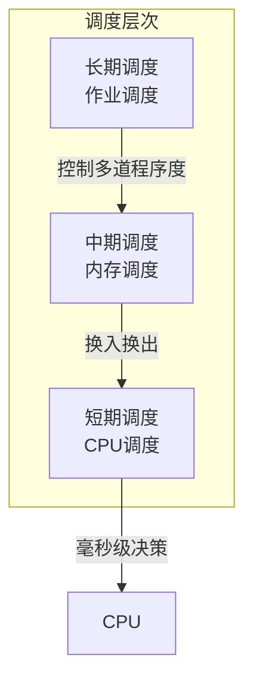
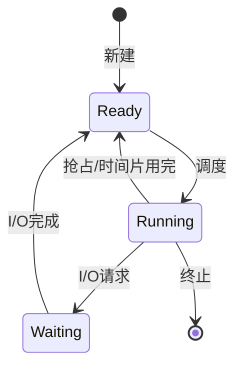
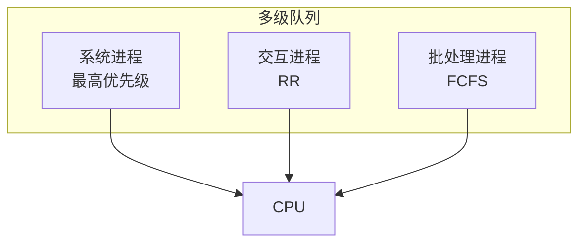
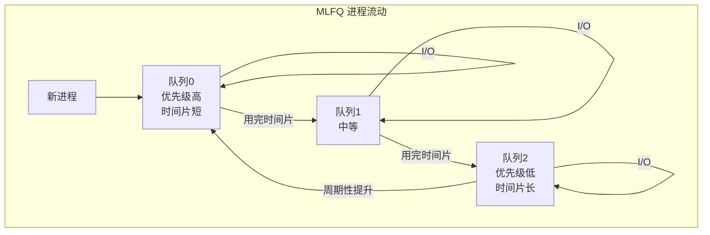
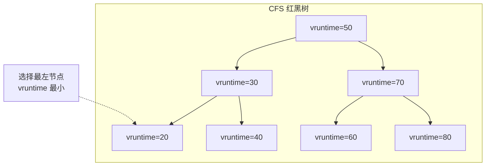
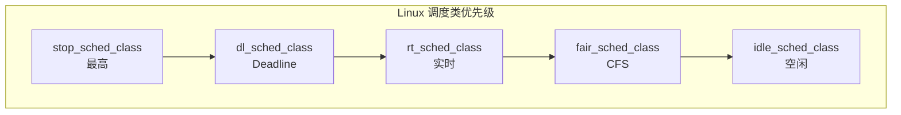
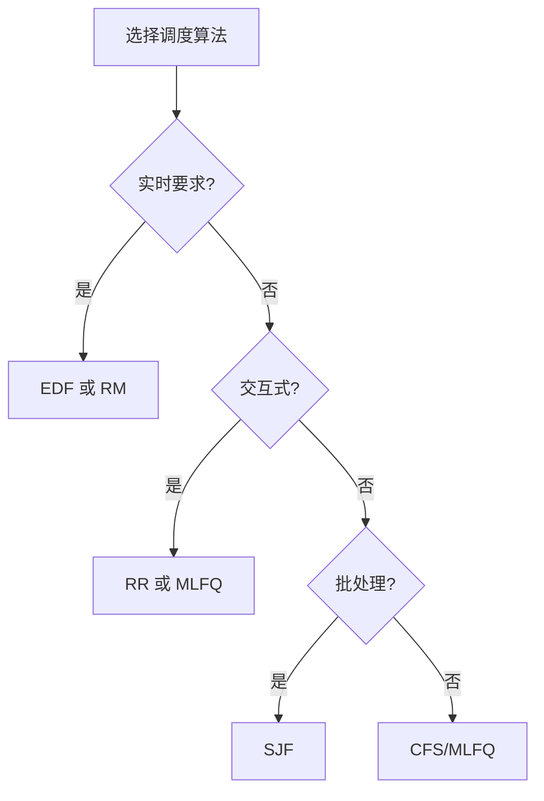

+++
title = "21. 进程调度算法详解"
date = 2026-02-02
weight = 21000
description = "进程调度算法：FCFS、SJF、RR、优先级、MLFQ、CFS、实时调度"
[taxonomies]
tags = ["OS", "调度", "进程", "CFS", "实时"]
+++

# 进程调度算法详解

本文深入分析操作系统的进程调度算法，包括经典算法（FCFS、SJF、RR）、多级反馈队列、Linux CFS 调度器、实时调度等内容。

---

## 一、调度概述

### 1.1 调度层次



| 层次 | 频率 | 决策 |
|------|------|------|
| 长期调度 | 分钟/小时 | 哪些作业进入系统 |
| 中期调度 | 秒 | 哪些进程换入/换出 |
| 短期调度 | 毫秒 | 下一个运行哪个进程 |

### 1.2 调度指标

| 指标 | 定义 | 目标 |
|------|------|------|
| **CPU 利用率** | CPU 忙碌时间比例 | 最大化 |
| **吞吐量** | 单位时间完成的进程数 | 最大化 |
| **周转时间** | 提交到完成的总时间 | 最小化 |
| **等待时间** | 在就绪队列等待的总时间 | 最小化 |
| **响应时间** | 提交到首次响应的时间 | 最小化 |

### 1.3 调度时机



**非抢占式调度**：仅在进程终止或阻塞时调度
**抢占式调度**：可在任何时刻（时钟中断、高优先级就绪）调度

---

## 二、经典调度算法

### 2.1 先来先服务（FCFS）

**FCFS（First-Come First-Served）**：按到达顺序执行，非抢占。

```c
struct Process {
    int pid;
    int arrival_time;
    int burst_time;
    int start_time;
    int finish_time;
};

void fcfs_schedule(Process processes[], int n) {
    // 按到达时间排序
    sort_by_arrival(processes, n);
    
    int current_time = 0;
    
    for (int i = 0; i < n; i++) {
        if (current_time < processes[i].arrival_time) {
            current_time = processes[i].arrival_time;
        }
        
        processes[i].start_time = current_time;
        current_time += processes[i].burst_time;
        processes[i].finish_time = current_time;
    }
}
```

**示例**：

| 进程 | 到达时间 | 执行时间 | 开始时间 | 完成时间 | 周转时间 | 等待时间 |
|------|----------|----------|----------|----------|----------|----------|
| P1 | 0 | 24 | 0 | 24 | 24 | 0 |
| P2 | 0 | 3 | 24 | 27 | 27 | 24 |
| P3 | 0 | 3 | 27 | 30 | 30 | 27 |

**平均等待时间**: (0 + 24 + 27) / 3 = **17**

**护航效应（Convoy Effect）**：短进程在长进程后等待。

### 2.2 最短作业优先（SJF）

**SJF（Shortest Job First）**：选择执行时间最短的进程。

```c
void sjf_schedule(Process processes[], int n) {
    bool completed[n] = {false};
    int current_time = 0;
    int completed_count = 0;
    
    while (completed_count < n) {
        int shortest = -1;
        int min_burst = INT_MAX;
        
        // 找到已到达且未完成的最短作业
        for (int i = 0; i < n; i++) {
            if (!completed[i] && 
                processes[i].arrival_time <= current_time &&
                processes[i].burst_time < min_burst) {
                min_burst = processes[i].burst_time;
                shortest = i;
            }
        }
        
        if (shortest == -1) {
            current_time++;
            continue;
        }
        
        processes[shortest].start_time = current_time;
        current_time += processes[shortest].burst_time;
        processes[shortest].finish_time = current_time;
        completed[shortest] = true;
        completed_count++;
    }
}
```

**示例**（同样的进程，不同顺序）：

| 进程 | 到达时间 | 执行时间 | 完成时间 | 周转时间 | 等待时间 |
|------|----------|----------|----------|----------|----------|
| P1 | 0 | 24 | 30 | 30 | 6 |
| P2 | 0 | 3 | 3 | 3 | 0 |
| P3 | 0 | 3 | 6 | 6 | 3 |

**平均等待时间**: (6 + 0 + 3) / 3 = **3** ← 比 FCFS 好很多

**最优性**：SJF 对于给定进程集，平均等待时间最短。

### 2.3 最短剩余时间优先（SRTF）

**SRTF（Shortest Remaining Time First）**：SJF 的抢占版本。

```c
void srtf_schedule(Process processes[], int n) {
    int remaining[n];
    for (int i = 0; i < n; i++)
        remaining[i] = processes[i].burst_time;
    
    int completed = 0;
    int current_time = 0;
    int prev = -1;
    
    while (completed < n) {
        int shortest = -1;
        int min_remaining = INT_MAX;
        
        for (int i = 0; i < n; i++) {
            if (processes[i].arrival_time <= current_time &&
                remaining[i] > 0 &&
                remaining[i] < min_remaining) {
                min_remaining = remaining[i];
                shortest = i;
            }
        }
        
        if (shortest == -1) {
            current_time++;
            continue;
        }
        
        // 记录首次运行时间
        if (remaining[shortest] == processes[shortest].burst_time) {
            processes[shortest].start_time = current_time;
        }
        
        remaining[shortest]--;
        current_time++;
        
        if (remaining[shortest] == 0) {
            processes[shortest].finish_time = current_time;
            completed++;
        }
    }
}
```

### 2.4 轮转调度（RR）

**RR（Round Robin）**：固定时间片轮流执行，抢占式。

```c
void rr_schedule(Process processes[], int n, int quantum) {
    int remaining[n];
    for (int i = 0; i < n; i++)
        remaining[i] = processes[i].burst_time;
    
    Queue ready_queue;
    int current_time = 0;
    int completed = 0;
    int next_arrival = 0;
    
    while (completed < n) {
        // 添加新到达的进程
        while (next_arrival < n && 
               processes[next_arrival].arrival_time <= current_time) {
            enqueue(&ready_queue, next_arrival);
            next_arrival++;
        }
        
        if (is_empty(&ready_queue)) {
            current_time++;
            continue;
        }
        
        int current = dequeue(&ready_queue);
        
        // 首次运行
        if (remaining[current] == processes[current].burst_time) {
            processes[current].start_time = current_time;
        }
        
        int run_time = min(quantum, remaining[current]);
        remaining[current] -= run_time;
        current_time += run_time;
        
        // 添加期间到达的进程
        while (next_arrival < n && 
               processes[next_arrival].arrival_time <= current_time) {
            enqueue(&ready_queue, next_arrival);
            next_arrival++;
        }
        
        if (remaining[current] > 0) {
            enqueue(&ready_queue, current);
        } else {
            processes[current].finish_time = current_time;
            completed++;
        }
    }
}
```

**时间片选择**：

| 时间片大小 | 效果 |
|------------|------|
| 太大 | 退化为 FCFS |
| 太小 | 上下文切换开销大 |
| 典型值 | 10-100 ms |

**示例**（时间片 = 4）：

```
时间轴: 0   4   8  12  16  20  24  28  30
执行:   P1  P2  P3  P1  P1  P1  P1  P1  P1
        ─────────────────────────────────→
```

### 2.5 优先级调度

```c
void priority_schedule(Process processes[], int n, bool preemptive) {
    // 数值越小优先级越高
    if (preemptive) {
        // 类似 SRTF，但比较优先级
        priority_preemptive(processes, n);
    } else {
        // 类似 SJF，但比较优先级
        priority_nonpreemptive(processes, n);
    }
}
```

**饥饿问题**：低优先级进程可能永远不执行。

**解决方案**：**老化（Aging）** - 等待时间越长，优先级越高。

```c
void age_priorities(Process processes[], int n, int current_time) {
    for (int i = 0; i < n; i++) {
        if (!processes[i].completed) {
            int wait_time = current_time - processes[i].arrival_time;
            // 每等待 10 个时间单位，优先级提升 1
            processes[i].effective_priority = 
                processes[i].base_priority - (wait_time / 10);
        }
    }
}
```

---

## 三、多级队列调度

### 3.1 多级队列（MLQ）

将就绪队列分成多个独立队列，每个队列有自己的调度算法：



### 3.2 多级反馈队列（MLFQ）

**MLFQ（Multilevel Feedback Queue）**：进程可以在队列间移动。

```c
#define NUM_QUEUES 3
#define QUANTUM_0 8
#define QUANTUM_1 16
#define QUANTUM_2 32

struct MLFQ {
    Queue queues[NUM_QUEUES];
    int quantum[NUM_QUEUES];
};

void mlfq_init(MLFQ *mlfq) {
    mlfq->quantum[0] = QUANTUM_0;   // 最高优先级，最短时间片
    mlfq->quantum[1] = QUANTUM_1;
    mlfq->quantum[2] = QUANTUM_2;   // 最低优先级，最长时间片
}

void mlfq_schedule(MLFQ *mlfq) {
    while (true) {
        // 从最高优先级队列开始找
        for (int q = 0; q < NUM_QUEUES; q++) {
            if (!is_empty(&mlfq->queues[q])) {
                Process *p = dequeue(&mlfq->queues[q]);
                
                int used = run_for(p, mlfq->quantum[q]);
                
                if (p->remaining == 0) {
                    // 完成
                    complete(p);
                } else if (used == mlfq->quantum[q]) {
                    // 用完时间片，降级
                    int next_q = min(q + 1, NUM_QUEUES - 1);
                    enqueue(&mlfq->queues[next_q], p);
                } else {
                    // I/O 阻塞，保持或提升优先级
                    enqueue(&mlfq->queues[q], p);
                }
                
                break;  // 重新从高优先级开始
            }
        }
    }
}
```

**MLFQ 规则**：

1. 优先运行高优先级队列的进程
2. 同一队列内使用 RR
3. 新进程进入最高优先级队列
4. 用完时间片则降级
5. 定期将所有进程提升到最高优先级（防止饥饿）



---

## 四、Linux CFS 调度器

### 4.1 CFS 原理

**CFS（Completely Fair Scheduler）**：追求完美公平，每个进程获得相等的 CPU 时间。

核心概念：**虚拟运行时间（vruntime）**

$$
vruntime = \frac{actual\_runtime \times NICE\_0\_LOAD}{weight}
$$

```c
/* Linux 内核中的 vruntime 更新 */
static void update_curr(struct cfs_rq *cfs_rq)
{
    struct sched_entity *curr = cfs_rq->curr;
    u64 now = rq_clock_task(rq_of(cfs_rq));
    u64 delta_exec;
    
    delta_exec = now - curr->exec_start;
    curr->exec_start = now;
    curr->sum_exec_runtime += delta_exec;
    
    /* 计算 vruntime 增量 */
    curr->vruntime += calc_delta_fair(delta_exec, curr);
}

static inline u64 calc_delta_fair(u64 delta, struct sched_entity *se)
{
    if (se->load.weight != NICE_0_LOAD) {
        /* vruntime = delta * NICE_0_LOAD / weight */
        delta = __calc_delta(delta, NICE_0_LOAD, &se->load);
    }
    return delta;
}
```

### 4.2 红黑树组织

CFS 使用红黑树按 vruntime 排序进程：



```c
/* 选择下一个进程 */
static struct sched_entity *pick_next_entity(struct cfs_rq *cfs_rq)
{
    /* 选择红黑树最左节点（vruntime 最小） */
    struct rb_node *left = rb_first_cached(&cfs_rq->tasks_timeline);
    
    if (!left)
        return NULL;
    
    return rb_entry(left, struct sched_entity, run_node);
}
```

### 4.3 Nice 值与权重

| Nice 值 | 权重 | 相对 CPU 时间 |
|---------|------|--------------|
| -20 | 88761 | 最高 |
| -10 | 9548 | |
| 0 | 1024 | 基准 |
| 10 | 110 | |
| 19 | 15 | 最低 |

```c
/* nice 值到权重的映射表 */
const int sched_prio_to_weight[40] = {
 /* -20 */     88761,     71755,     56483,     46273,     36291,
 /* -15 */     29154,     23254,     18705,     14949,     11916,
 /* -10 */      9548,      7620,      6100,      4904,      3906,
 /*  -5 */      3121,      2501,      1991,      1586,      1277,
 /*   0 */      1024,       820,       655,       526,       423,
 /*   5 */       335,       272,       215,       172,       137,
 /*  10 */       110,        87,        70,        56,        45,
 /*  15 */        36,        29,        23,        18,        15,
};
```

### 4.4 调度延迟与最小粒度

```c
/* 调度周期（所有进程都运行一遍的时间） */
unsigned int sysctl_sched_latency = 6000000ULL;  /* 6ms */

/* 最小运行时间 */
unsigned int sysctl_sched_min_granularity = 750000ULL;  /* 0.75ms */

/* 计算时间片 */
static u64 sched_slice(struct cfs_rq *cfs_rq, struct sched_entity *se)
{
    u64 slice = sysctl_sched_latency;
    
    /* 进程数多时，延长调度周期 */
    if (nr_running > sched_nr_latency)
        slice = sysctl_sched_min_granularity * nr_running;
    
    /* 按权重分配 */
    slice = slice * se->load.weight / cfs_rq->load.weight;
    
    return max(slice, sysctl_sched_min_granularity);
}
```

---

## 五、实时调度

### 5.1 实时调度类



### 5.2 SCHED_FIFO 和 SCHED_RR

```c
#include <sched.h>
#include <pthread.h>

void set_realtime_priority(pthread_t thread, int policy, int priority) {
    struct sched_param param;
    param.sched_priority = priority;  // 1-99, 99 最高
    
    pthread_setschedparam(thread, policy, &param);
}

/* SCHED_FIFO: 实时 FIFO，同优先级不抢占 */
set_realtime_priority(thread, SCHED_FIFO, 50);

/* SCHED_RR: 实时轮转，同优先级轮转 */
set_realtime_priority(thread, SCHED_RR, 50);
```

### 5.3 SCHED_DEADLINE

EDF（Earliest Deadline First）调度：

```c
#include <linux/sched.h>

struct sched_attr {
    __u32 size;
    __u32 sched_policy;      /* SCHED_DEADLINE */
    __u64 sched_runtime;     /* 每周期运行时间 */
    __u64 sched_deadline;    /* 相对截止时间 */
    __u64 sched_period;      /* 周期 */
};

/* 设置 deadline 调度 */
struct sched_attr attr = {
    .size = sizeof(attr),
    .sched_policy = SCHED_DEADLINE,
    .sched_runtime  = 10000000,   /* 10ms */
    .sched_deadline = 30000000,   /* 30ms */
    .sched_period   = 30000000,   /* 30ms */
};

syscall(SYS_sched_setattr, pid, &attr, 0);
```

### 5.4 实时调度对比

| 算法 | 最优性 | 在线/离线 | 复杂度 |
|------|--------|-----------|--------|
| **Rate Monotonic (RM)** | 固定优先级最优 | 离线 | O(1) |
| **EDF** | 动态优先级最优 | 在线 | O(log n) |
| **LLF (Least Laxity First)** | 最优 | 在线 | O(n) |

**RM 可调度性**：

$$
\sum_{i=1}^{n} \frac{C_i}{T_i} \leq n(2^{1/n} - 1)
$$

当 n → ∞，上界约为 0.693（69.3%）。

**EDF 可调度性**：

$$
\sum_{i=1}^{n} \frac{C_i}{T_i} \leq 1
$$

EDF 可以达到 100% CPU 利用率。

---

## 六、调度算法对比

### 6.1 综合对比表

| 算法 | 抢占 | 饥饿 | 适用场景 | 复杂度 |
|------|------|------|----------|--------|
| FCFS | 否 | 否 | 批处理 | O(1) |
| SJF | 否 | 是 | 批处理 | O(n) |
| SRTF | 是 | 是 | 交互式 | O(n) |
| RR | 是 | 否 | 分时系统 | O(1) |
| 优先级 | 可选 | 是 | 通用 | O(n) |
| MLFQ | 是 | 可防 | 通用 | O(1) |
| CFS | 是 | 否 | Linux | O(log n) |

### 6.2 选择指南



---

## 七、常见面试问题

**Q: FCFS 和 SJF 的优缺点？**

| 算法 | 优点 | 缺点 |
|------|------|------|
| FCFS | 简单公平 | 护航效应、等待时间长 |
| SJF | 平均等待时间最短 | 饥饿、需预知执行时间 |

**Q: 如何解决优先级调度的饥饿问题？**

A: **老化（Aging）**：随等待时间增加提升优先级。

**Q: Linux CFS 如何保证公平？**

A: 
1. 使用虚拟运行时间（vruntime）
2. 权重影响 vruntime 增长速度
3. 始终选择 vruntime 最小的进程
4. 红黑树 O(log n) 高效选择

**Q: 时间片大小如何影响性能？**

| 时间片 | 响应时间 | 上下文切换 | 吞吐量 |
|--------|----------|------------|--------|
| 小 | 好 | 多 | 低 |
| 大 | 差 | 少 | 高 |

---

## 相关文章

- [OS笔试题-进程与线程](@/articles/os/os-09-OS笔试题-进程与线程.md)
- [OS面试题-进程与线程](@/articles/os/os-12-OS面试题-进程与线程.md)
- [内核面试题-进程调度](@/articles/linux/linux-24-内核面试题-进程调度.md)
