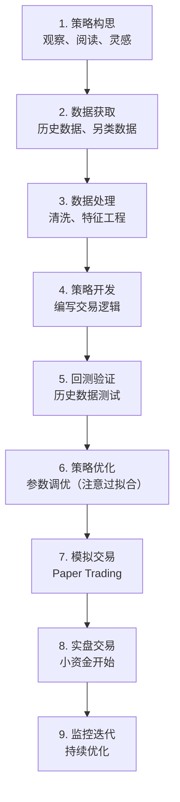

+++
title = "01 - 个人量化交易入门指南"
date = 2025-01-15
description = "个人如何开展量化交易：定位、思路、技术栈选择，以及与机构的差异化竞争策略"
[taxonomies]
tags = ["quant", "trading", "algorithmic-trading", "personal-finance"]
+++

## 概述

量化交易曾经是华尔街机构的专利，但随着技术普及，个人投资者也可以运用量化方法来提升投资决策。本文探讨个人如何开展量化交易，以及如何找到适合自己的定位。

---

## 一、个人量化的现实定位

### 1.1 个人 vs 机构的差距

```
机构优势（个人难以竞争）：

┌─────────────────────────────────────────────────────────┐
│                                                          │
│   速度                                                  │
│   ────                                                  │
│   • Co-location（服务器放交易所旁边）                   │
│   • 专用网络和硬件                                      │
│   • 微秒级延迟                                          │
│   • 个人延迟：几十到几百毫秒                            │
│                                                          │
│   资金                                                  │
│   ────                                                  │
│   • 管理数十亿资金                                      │
│   • 更低的交易成本                                      │
│   • 更大的容量                                          │
│                                                          │
│   资源                                                  │
│   ────                                                  │
│   • 专业研究团队                                        │
│   • 昂贵的数据源                                        │
│   • 先进的基础设施                                      │
│   • 更多的策略容量                                      │
│                                                          │
└─────────────────────────────────────────────────────────┘

结论：高频交易（HFT）不是个人的战场
```

### 1.2 个人的优势

```
个人投资者的优势：

┌─────────────────────────────────────────────────────────┐
│                                                          │
│   灵活性                                                │
│   ──────                                                │
│   • 没有合规限制                                        │
│   • 可以交易任何品种                                    │
│   • 可以快速调整策略                                    │
│   • 没有客户赎回压力                                    │
│                                                          │
│   容量不是问题                                          │
│   ──────                                                │
│   • 小资金可以交易小盘股                                │
│   • 可以利用流动性差的市场                              │
│   • 机构无法进入的机会                                  │
│                                                          │
│   时间优势                                              │
│   ──────                                                │
│   • 不需要每月/每季度交成绩单                           │
│   • 可以等待更长时间                                    │
│   • 可以接受更大的回撤（自己的钱）                      │
│                                                          │
│   成本优势                                              │
│   ──────                                                │
│   • 不需要高薪团队                                      │
│   • 不需要昂贵的基础设施                                │
│   • 不需要支付管理费                                    │
│                                                          │
└─────────────────────────────────────────────────────────┘
```

### 1.3 个人量化的正确定位

```
个人量化应该聚焦：

┌─────────────────────────────────────────────────────────┐
│                                                          │
│   ✅ 中低频策略                                         │
│   ─────────────                                         │
│   • 持仓周期：天 ~ 周 ~ 月                              │
│   • 不需要极致速度                                      │
│   • 有时间思考和调整                                    │
│                                                          │
│   ✅ 利用个人优势                                       │
│   ─────────────                                         │
│   • 小盘股/小市场                                       │
│   • 另类数据（个人观察）                                │
│   • 长期持有策略                                        │
│   • 多市场分散                                          │
│                                                          │
│   ✅ 系统化投资                                         │
│   ─────────────                                         │
│   • 用规则替代情绪                                      │
│   • 可重复的决策过程                                    │
│   • 客观评估策略效果                                    │
│                                                          │
│   ❌ 避免的方向                                         │
│   ─────────────                                         │
│   • 高频交易/套利                                       │
│   • 需要极低延迟的策略                                  │
│   • 与机构正面竞争                                      │
│                                                          │
└─────────────────────────────────────────────────────────┘
```

---

## 二、量化交易基础概念

### 2.1 什么是量化交易

```
量化交易的本质：

┌─────────────────────────────────────────────────────────┐
│                                                          │
│   定义：                                                │
│   用数学模型和计算机程序来做投资决策                    │
│                                                          │
│   核心思想：                                            │
│   • 规则化：明确的买卖规则                              │
│   • 系统化：可重复的决策过程                            │
│   • 数据驱动：基于历史数据验证                          │
│   • 自动化：程序执行交易                                │
│                                                          │
│   与主观交易的区别：                                    │
│   ┌───────────────┬───────────────┐                     │
│   │  主观交易     │  量化交易     │                     │
│   ├───────────────┼───────────────┤                     │
│   │  凭经验判断   │  规则决策     │                     │
│   │  情绪影响大   │  纪律执行     │                     │
│   │  难以复制     │  可回测验证   │                     │
│   │  容量有限     │  可扩展       │                     │
│   └───────────────┴───────────────┘                     │
│                                                          │
└─────────────────────────────────────────────────────────┘
```

### 2.2 量化交易的分类

```
按频率分类：

┌────────────────┬───────────────┬───────────────────────┐
│     类型       │   持仓周期    │        特点            │
├────────────────┼───────────────┼───────────────────────┤
│ 高频交易(HFT)  │ 毫秒~秒      │ 拼速度，个人无法参与   │
├────────────────┼───────────────┼───────────────────────┤
│ 日内交易       │ 分钟~小时    │ 需要较快执行，较难     │
├────────────────┼───────────────┼───────────────────────┤
│ 短线交易       │ 天~周        │ ⭐ 个人可参与          │
├────────────────┼───────────────┼───────────────────────┤
│ 中线交易       │ 周~月        │ ⭐ 个人较适合          │
├────────────────┼───────────────┼───────────────────────┤
│ 长线投资       │ 月~年        │ ⭐ 个人最适合          │
└────────────────┴───────────────┴───────────────────────┘

按策略类型分类：
• 趋势跟踪（Trend Following）
• 均值回归（Mean Reversion）
• 动量策略（Momentum）
• 因子投资（Factor Investing）
• 统计套利（Statistical Arbitrage）
• 事件驱动（Event Driven）
```

---

## 三、个人量化的技术栈

### 3.1 编程语言选择

```
个人量化常用语言：

┌─────────────────────────────────────────────────────────┐
│                                                          │
│   Python（推荐入门）                                    │
│   ─────────────────                                     │
│   优点：                                                │
│   • 生态丰富（pandas, numpy, sklearn）                  │
│   • 学习曲线平缓                                        │
│   • 大量量化库（backtrader, zipline, vnpy）             │
│   • 社区支持好                                          │
│   缺点：                                                │
│   • 速度较慢（但中低频足够）                            │
│                                                          │
│   其他选择：                                            │
│   ─────────────────                                     │
│   • R：统计分析强，金融建模                             │
│   • C++：追求速度时使用                                 │
│   • Julia：兼顾速度和易用性                             │
│                                                          │
│   建议：从 Python 开始，需要时再优化                    │
│                                                          │
└─────────────────────────────────────────────────────────┘
```

### 3.2 核心工具库

```
Python 量化工具栈：

┌─────────────────┬────────────────────────────────────┐
│      类别       │              工具                   │
├─────────────────┼────────────────────────────────────┤
│ 数据处理       │ pandas, numpy                       │
├─────────────────┼────────────────────────────────────┤
│ 数据可视化     │ matplotlib, plotly, mplfinance      │
├─────────────────┼────────────────────────────────────┤
│ 技术指标       │ TA-Lib, pandas-ta                   │
├─────────────────┼────────────────────────────────────┤
│ 回测框架       │ backtrader, zipline, bt             │
├─────────────────┼────────────────────────────────────┤
│ 机器学习       │ scikit-learn, XGBoost, LightGBM     │
├─────────────────┼────────────────────────────────────┤
│ 深度学习       │ PyTorch, TensorFlow                 │
├─────────────────┼────────────────────────────────────┤
│ 交易接口       │ ccxt(加密), vnpy(国内), ib_insync   │
├─────────────────┼────────────────────────────────────┤
│ 数据库         │ SQLite, PostgreSQL, InfluxDB        │
└─────────────────┴────────────────────────────────────┘
```

### 3.3 开发环境

```
推荐开发环境：

┌─────────────────────────────────────────────────────────┐
│                                                          │
│   本地开发                                              │
│   ────────                                              │
│   • Jupyter Notebook/Lab（研究和回测）                  │
│   • VS Code / PyCharm（策略开发）                       │
│   • Anaconda（环境管理）                                │
│                                                          │
│   实盘部署                                              │
│   ────────                                              │
│   • 云服务器（阿里云/AWS）                              │
│   • Docker 容器化                                       │
│   • 定时任务（cron）                                    │
│   • 监控和告警                                          │
│                                                          │
│   版本控制                                              │
│   ────────                                              │
│   • Git（代码管理）                                     │
│   • 策略版本记录                                        │
│   • 回测结果存档                                        │
│                                                          │
└─────────────────────────────────────────────────────────┘
```

---

## 四、量化交易流程

### 4.1 完整流程



### 4.2 策略开发原则

```
策略开发最佳实践：

┌─────────────────────────────────────────────────────────┐
│                                                          │
│   简单优先                                              │
│   ────────                                              │
│   • 简单策略更稳健                                      │
│   • 参数越少越好                                        │
│   • 避免过度拟合                                        │
│                                                          │
│   样本外测试                                            │
│   ────────                                              │
│   • 留出测试集                                          │
│   • 用未见过的数据验证                                  │
│   • Walk-forward 分析                                   │
│                                                          │
│   考虑成本                                              │
│   ────────                                              │
│   • 交易佣金                                            │
│   • 滑点                                                │
│   • 冲击成本                                            │
│                                                          │
│   风险管理                                              │
│   ────────                                              │
│   • 止损规则                                            │
│   • 仓位管理                                            │
│   • 最大回撤控制                                        │
│                                                          │
└─────────────────────────────────────────────────────────┘
```

---

## 五、常见误区

### 5.1 新手常犯的错误

```
量化交易常见误区：

┌─────────────────────────────────────────────────────────┐
│                                                          │
│   ❌ 过度拟合                                           │
│   ─────────────                                         │
│   • 在历史数据上完美，实盘崩溃                          │
│   • 参数太多，过度优化                                  │
│   • 解决：简化策略，样本外测试                          │
│                                                          │
│   ❌ 忽视交易成本                                       │
│   ─────────────                                         │
│   • 回测时不算手续费                                    │
│   • 不考虑滑点                                          │
│   • 解决：加入真实的成本估算                            │
│                                                          │
│   ❌ 回测陷阱                                           │
│   ─────────────                                         │
│   • 使用未来数据（Look-ahead bias）                     │
│   • 幸存者偏差                                          │
│   • 解决：严格的回测框架                                │
│                                                          │
│   ❌ 期望过高                                           │
│   ─────────────                                         │
│   • 期待每年翻倍                                        │
│   • 现实：年化 15-30% 已经很好                          │
│   • 解决：合理预期，长期视角                            │
│                                                          │
│   ❌ 忽视风险管理                                       │
│   ─────────────                                         │
│   • 只关注收益，不管回撤                                │
│   • 仓位过重                                            │
│   • 解决：止损、仓位管理                                │
│                                                          │
└─────────────────────────────────────────────────────────┘
```

---

## 六、学习路径

### 6.1 推荐学习顺序

```
个人量化学习路径：

┌─────────────────────────────────────────────────────────┐
│                                                          │
│   阶段1：基础（1-3个月）                                │
│   ──────────────────────                                │
│   • Python 编程基础                                     │
│   • pandas/numpy 数据处理                               │
│   • 基础金融知识                                        │
│   • 技术分析入门                                        │
│                                                          │
│   阶段2：入门（3-6个月）                                │
│   ──────────────────────                                │
│   • 回测框架使用                                        │
│   • 简单策略实现（均线、动量）                          │
│   • 理解回测陷阱                                        │
│   • 风险管理基础                                        │
│                                                          │
│   阶段3：进阶（6-12个月）                               │
│   ──────────────────────                                │
│   • 因子研究                                            │
│   • 机器学习应用                                        │
│   • 多策略组合                                          │
│   • 模拟交易                                            │
│                                                          │
│   阶段4：实战（持续）                                   │
│   ──────────────────────                                │
│   • 小资金实盘                                          │
│   • 策略迭代                                            │
│   • 心态管理                                            │
│   • 持续学习                                            │
│                                                          │
└─────────────────────────────────────────────────────────┘
```

### 6.2 学习资源

```
推荐资源：

书籍：
├── 《Python for Finance》- Yves Hilpisch
├── 《Quantitative Trading》- Ernest Chan
├── 《Advances in Financial ML》- Marcos López de Prado
└── 《Algorithmic Trading》- Ernest Chan

在线课程：
├── Coursera: Investment Management with Python
├── Udacity: AI for Trading
└── QuantConnect 学习平台

社区：
├── 聚宽（JoinQuant）
├── 优矿（Uqer）
├── Quantopian（已关闭，但有开源代码）
└── Reddit: r/algotrading
```

---

## 七、总结

```
个人量化核心要点：

┌─────────────────────────────────────────────────────────┐
│                                                          │
│   找准定位                                              │
│   ────────                                              │
│   • 中低频策略                                          │
│   • 利用个人优势                                        │
│   • 避开机构赛道                                        │
│                                                          │
│   保持务实                                              │
│   ────────                                              │
│   • 合理收益预期                                        │
│   • 长期视角                                            │
│   • 持续学习                                            │
│                                                          │
│   风险第一                                              │
│   ────────                                              │
│   • 控制回撤                                            │
│   • 分散投资                                            │
│   • 不要满仓                                            │
│                                                          │
│   ──────────────────────────────────────────────────   │
│                                                          │
│   "量化交易不是快速致富的捷径，                         │
│    而是用科学方法来管理投资风险的工具。"                │
│                                                          │
└─────────────────────────────────────────────────────────┘
```

---

## 相关文章

- [下一篇：02 - 中低频量化交易最佳实践](/articles/quant/quant-02-中低频量化交易最佳实践/)
