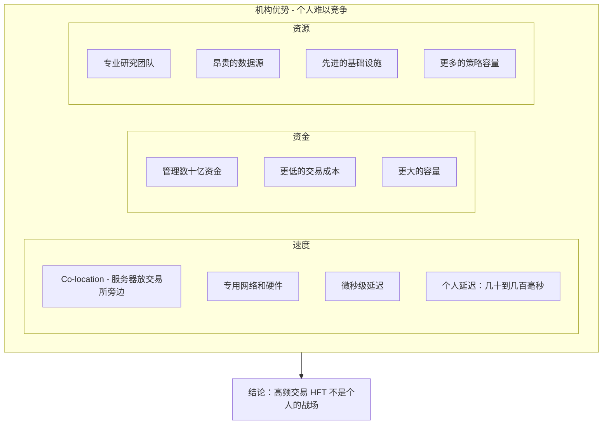
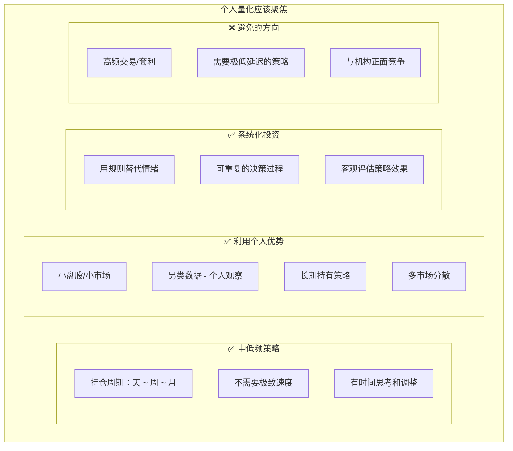
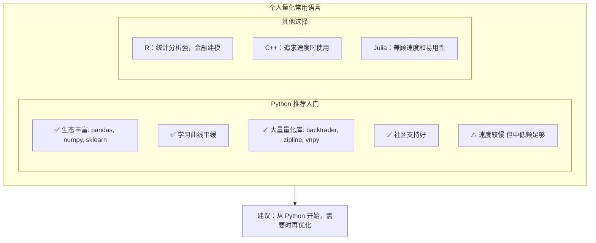
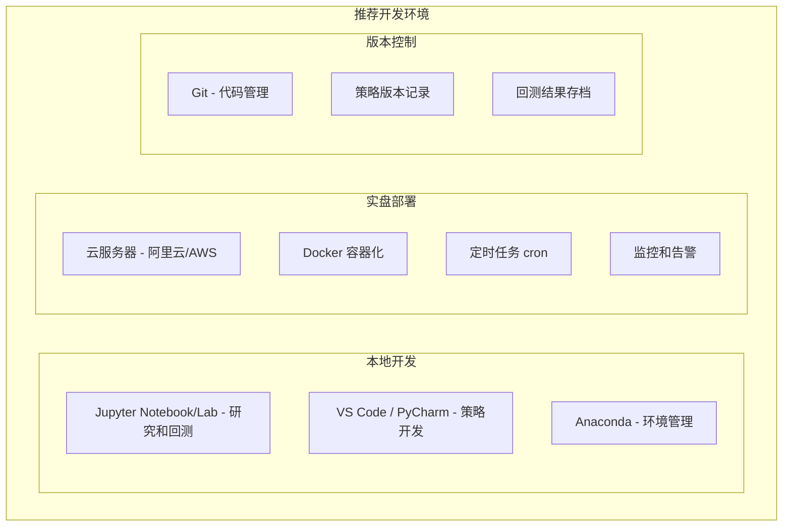
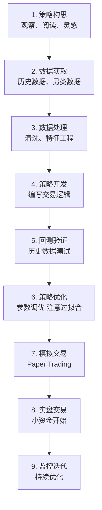
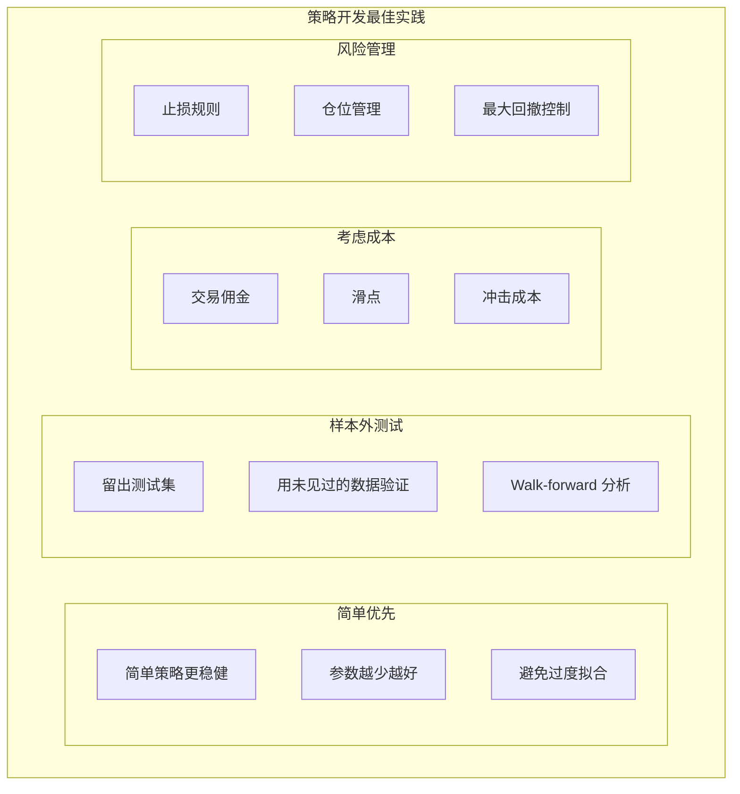
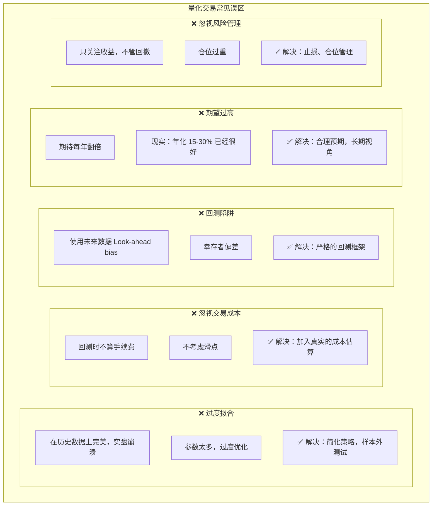
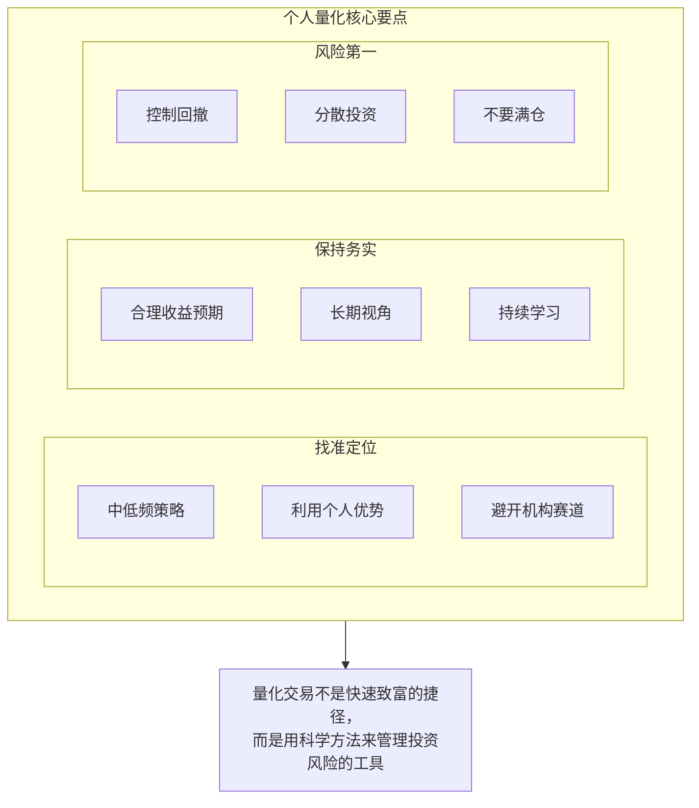

+++
title = "01. 个人量化交易入门指南"
date = 2025-01-15
weight = 1000
description = "个人如何开展量化交易：定位、思路、技术栈选择，以及与机构的差异化竞争策略"
[taxonomies]
tags = ["quant", "trading", "algorithmic-trading", "personal-finance"]
+++

## 概述

量化交易曾经是华尔街机构的专利，但随着技术普及，个人投资者也可以运用量化方法来提升投资决策。本文探讨个人如何开展量化交易，以及如何找到适合自己的定位。

---

## 一、个人量化的现实定位

### 1.1 个人 vs 机构的差距



### 1.2 个人的优势

```mermaid
graph TB
    subgraph 个人优势["个人投资者的优势"]
        subgraph 灵活性
            L1["没有合规限制"]
            L2["可以交易任何品种"]
            L3["可以快速调整策略"]
            L4["没有客户赎回压力"]
        end
        subgraph 容量["容量不是问题"]
            R1["小资金可以交易小盘股"]
            R2["可以利用流动性差的市场"]
            R3["机构无法进入的机会"]
        end
        subgraph 时间优势
            T1["不需要每月/每季度交成绩单"]
            T2["可以等待更长时间"]
            T3["可以接受更大的回撤 - 自己的钱"]
        end
        subgraph 成本优势
            C1["不需要高薪团队"]
            C2["不需要昂贵的基础设施"]
            C3["不需要支付管理费"]
        end
    end
```



### 1.3 个人量化的正确定位



---

## 二、量化交易基础概念

### 2.1 什么是量化交易

**定义**：用数学模型和计算机程序来做投资决策

**核心思想**：
- **规则化**：明确的买卖规则
- **系统化**：可重复的决策过程
- **数据驱动**：基于历史数据验证
- **自动化**：程序执行交易

**与主观交易的区别**：

| 主观交易 | 量化交易 |
|---------|---------|
| 凭经验判断 | 规则决策 |
| 情绪影响大 | 纪律执行 |
| 难以复制 | 可回测验证 |
| 容量有限 | 可扩展 |

### 2.2 量化交易的分类

**按频率分类**：

| 类型 | 持仓周期 | 特点 |
|------|---------|------|
| 高频交易(HFT) | 毫秒~秒 | 拼速度，个人无法参与 |
| 日内交易 | 分钟~小时 | 需要较快执行，较难 |
| 短线交易 | 天~周 | ⭐ 个人可参与 |
| 中线交易 | 周~月 | ⭐ 个人较适合 |
| 长线投资 | 月~年 | ⭐ 个人最适合 |

**按策略类型分类**：
- 趋势跟踪（Trend Following）
- 均值回归（Mean Reversion）
- 动量策略（Momentum）
- 因子投资（Factor Investing）
- 统计套利（Statistical Arbitrage）
- 事件驱动（Event Driven）

---

## 三、个人量化的技术栈

### 3.1 编程语言选择



### 3.2 核心工具库

**Python 量化工具栈**：

| 类别 | 工具 |
|------|------|
| 数据处理 | pandas, numpy |
| 数据可视化 | matplotlib, plotly, mplfinance |
| 技术指标 | TA-Lib, pandas-ta |
| 回测框架 | backtrader, zipline, bt |
| 机器学习 | scikit-learn, XGBoost, LightGBM |
| 深度学习 | PyTorch, TensorFlow |
| 交易接口 | ccxt(加密), vnpy(国内), ib_insync |
| 数据库 | SQLite, PostgreSQL, InfluxDB |

### 3.3 开发环境



---

## 四、量化交易流程

### 4.1 完整流程



### 4.2 策略开发原则



---

## 五、常见误区

### 5.1 新手常犯的错误



---

## 六、学习路径

### 6.1 推荐学习顺序

```mermaid
graph TB
    subgraph 学习路径["个人量化学习路径"]
        subgraph 阶段1["阶段1：基础 1-3个月"]
            A1["Python 编程基础"]
            A2["pandas/numpy 数据处理"]
            A3["基础金融知识"]
            A4["技术分析入门"]
        end
        subgraph 阶段2["阶段2：入门 3-6个月"]
            B1["回测框架使用"]
            B2["简单策略实现: 均线、动量"]
            B3["理解回测陷阱"]
            B4["风险管理基础"]
        end
        subgraph 阶段3["阶段3：进阶 6-12个月"]
            C1["因子研究"]
            C2["机器学习应用"]
            C3["多策略组合"]
            C4["模拟交易"]
        end
        subgraph 阶段4["阶段4：实战 持续"]
            D1["小资金实盘"]
            D2["策略迭代"]
            D3["心态管理"]
            D4["持续学习"]
        end
    end
    阶段1 --> 阶段2 --> 阶段3 --> 阶段4
```



### 6.2 学习资源

```
推荐资源：

书籍：
├── 《Python for Finance》- Yves Hilpisch
├── 《Quantitative Trading》- Ernest Chan
├── 《Advances in Financial ML》- Marcos López de Prado
└── 《Algorithmic Trading》- Ernest Chan

在线课程：
├── Coursera: Investment Management with Python
├── Udacity: AI for Trading
└── QuantConnect 学习平台

社区：
├── 聚宽（JoinQuant）
├── 优矿（Uqer）
├── Quantopian（已关闭，但有开源代码）
└── Reddit: r/algotrading
```

---

## 七、总结



---

## 相关文章

- [下一篇：02 - 中低频量化交易最佳实践](@/articles/quant/quant-02-中低频量化交易最佳实践.md)
