+++
title = "02 - 中低频量化交易最佳实践"
date = 2025-01-15
description = "适合个人投资者的中低频量化交易策略开发、回测、执行的最佳实践指南"
[taxonomies]
tags = ["quant", "trading", "mid-frequency", "best-practices"]
+++

## 概述

中低频量化交易（持仓周期从天到月）是最适合个人投资者的量化方向。本文系统介绍中低频量化的最佳实践。

---

## 一、中低频策略的特点

### 1.1 定义与优势

**中低频交易定义**：

| 频率 | 持仓周期 | 特点 |
|------|---------|------|
| 低频 | 周 ~ 月 ~ 年 | 最稳健，容量大 |
| 中频 | 天 ~ 周 | 平衡风险和收益 |
| 高频 | 秒 ~ 分钟 | 个人难以参与 |

**中低频优势**：
- 交易成本占比低
- 不需要极致技术
- 有时间分析和调整
- 更适合基本面结合
- 策略容量更大

### 1.2 中低频 vs 高频

**核心差异**：

| 高频交易 | 中低频交易 |
|---------|-----------|
| 拼速度 | 拼逻辑 |
| 技术驱动 | 研究驱动 |
| 统计优势 | 经济逻辑 |
| 低收益高频次 | 高收益低频次 |
| 容量有限 | 容量较大 |
| 衰减快 | 相对稳定 |

**中低频更适合**：
- 结合基本面分析
- 利用市场非效率
- 价值投资的量化实现
- 宏观择时

---

## 二、策略开发最佳实践

### 2.1 策略开发流程

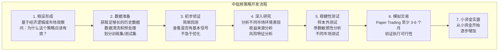

### 2.2 策略设计原则

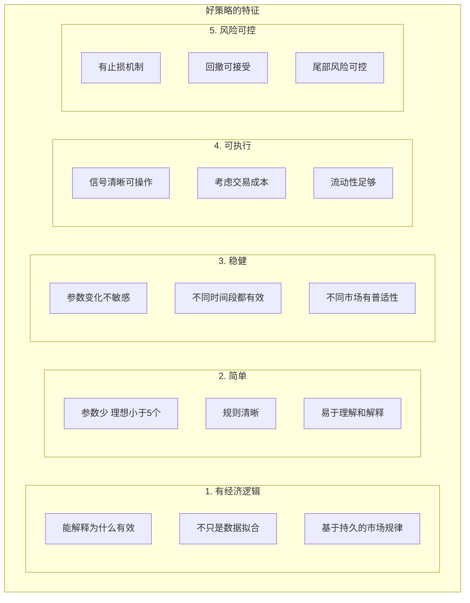

---

## 三、回测最佳实践

### 3.1 避免回测陷阱

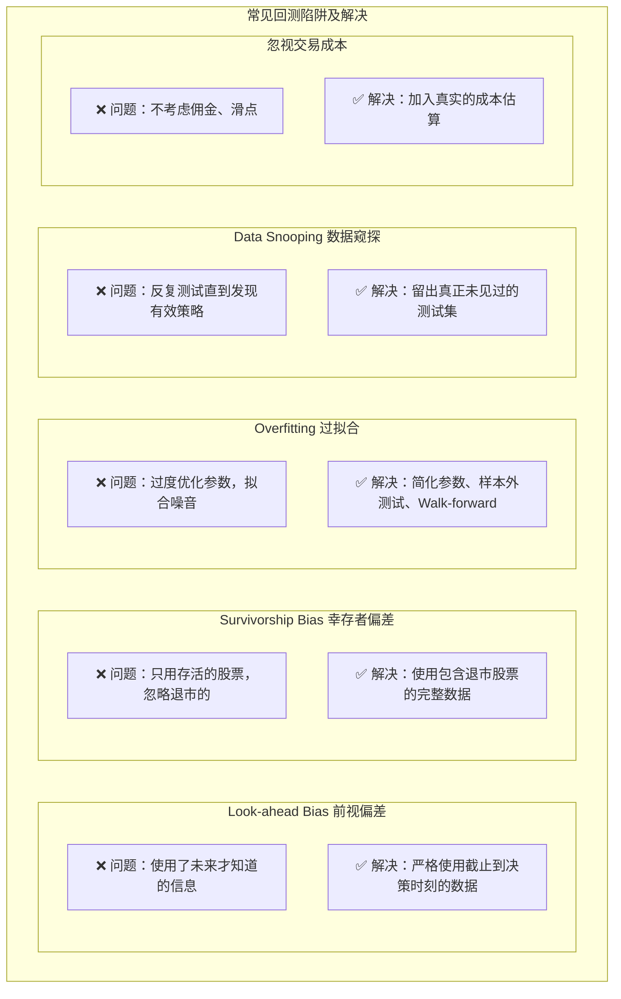

### 3.2 回测设计

**回测分割方法**：

**方法1：训练/测试分割**

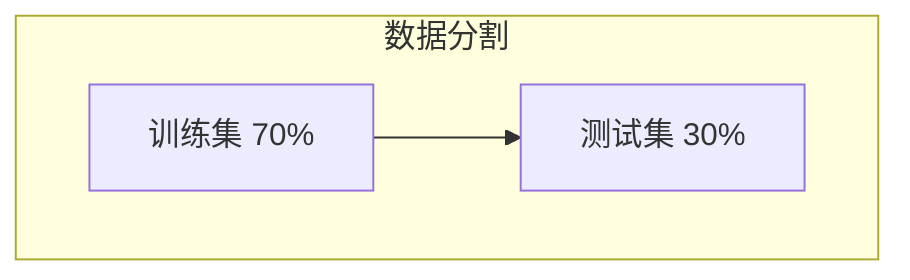

**方法2：Walk-forward（推荐）**

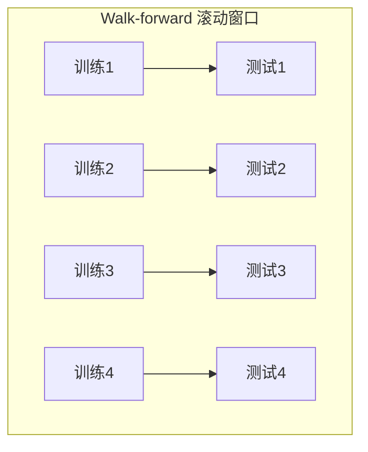

**方法3：K-Fold 交叉验证**
- 适合数据量有限时
- 注意时间序列的顺序性

### 3.3 绩效评估指标

**核心评估指标**：

| 指标 | 说明 |
|------|------|
| 年化收益率 | 策略的平均年度收益 |
| 夏普比率 (Sharpe Ratio) | 风险调整收益，> 1 较好；= (收益 - 无风险利率) / 波动率 |
| 最大回撤 (Max Drawdown) | 从峰值到谷底的最大跌幅，越小越好 |
| 卡玛比率 (Calmar Ratio) | 年化收益 / 最大回撤，> 1 较好 |
| 胜率 | 盈利交易占比 |
| 盈亏比 | 平均盈利 / 平均亏损 |
| Alpha | 超越基准的超额收益 |
| Beta | 与市场的相关性 |

**健康策略参考**：
- 夏普比率 > 1
- 最大回撤 < 20-30%
- 卡玛比率 > 1

---

## 四、风险管理

### 4.1 仓位管理

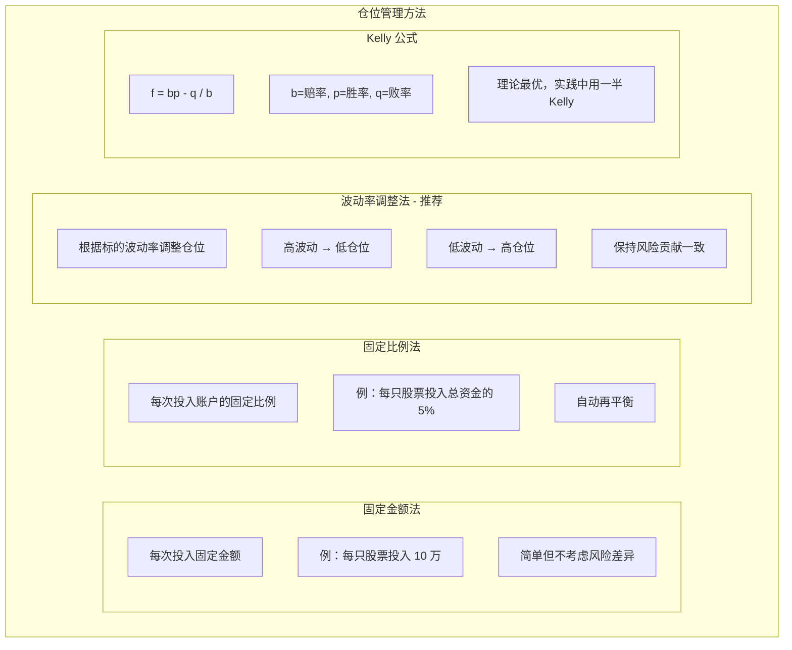

### 4.2 止损策略

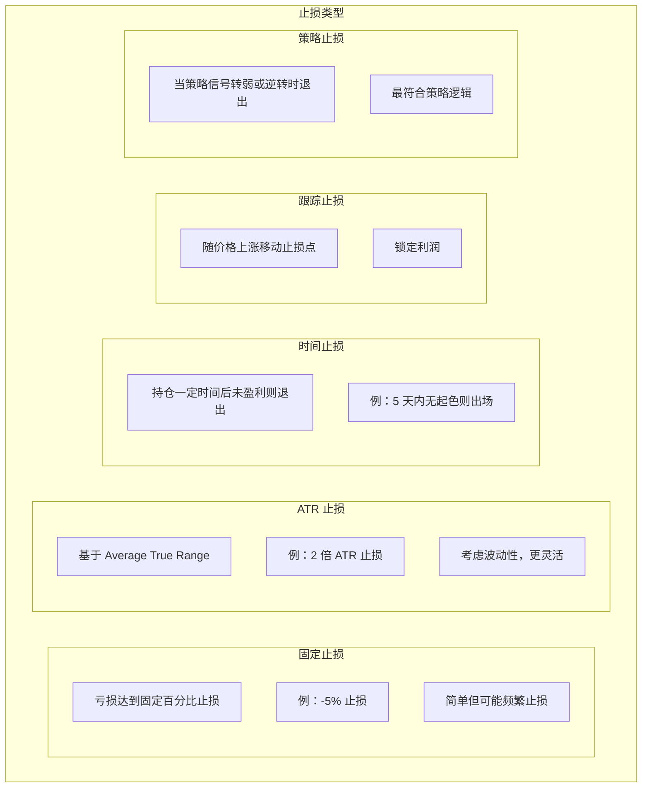

### 4.3 组合风险管理

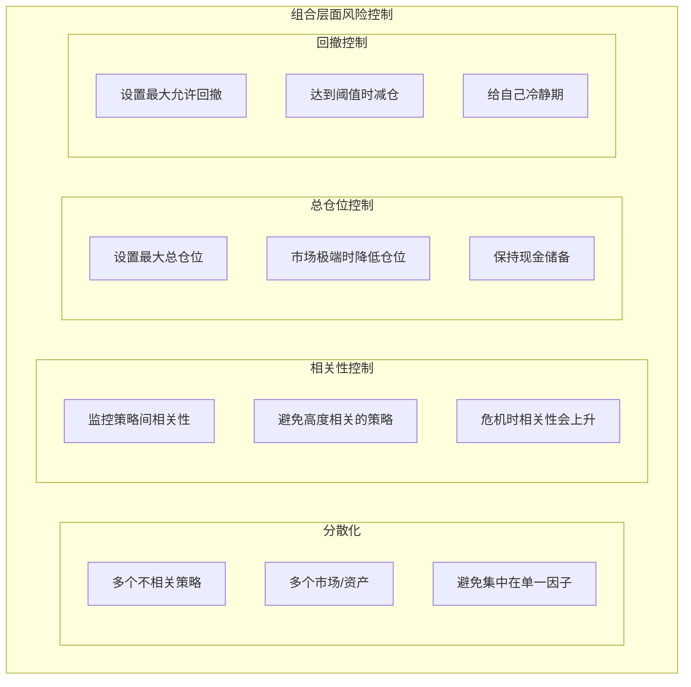

---

## 五、执行最佳实践

### 5.1 执行注意事项

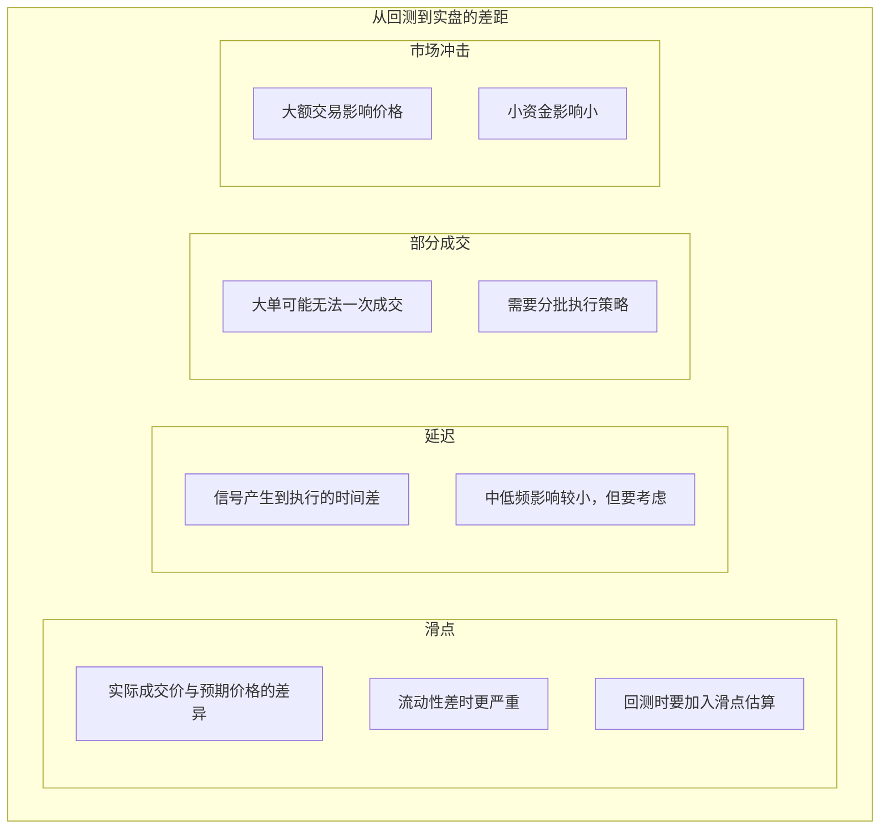

### 5.2 自动化执行

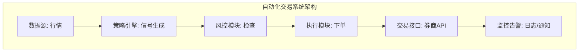

---

## 六、持续运营

### 6.1 策略监控

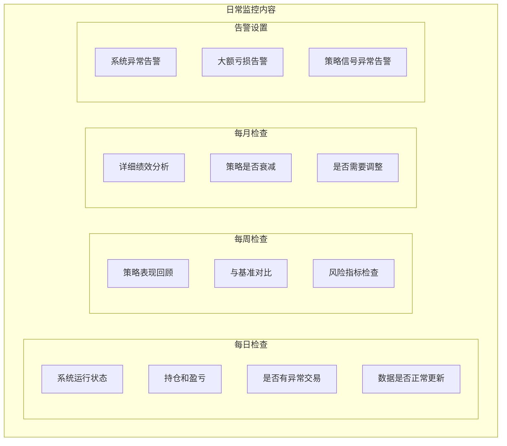

### 6.2 策略衰减检测

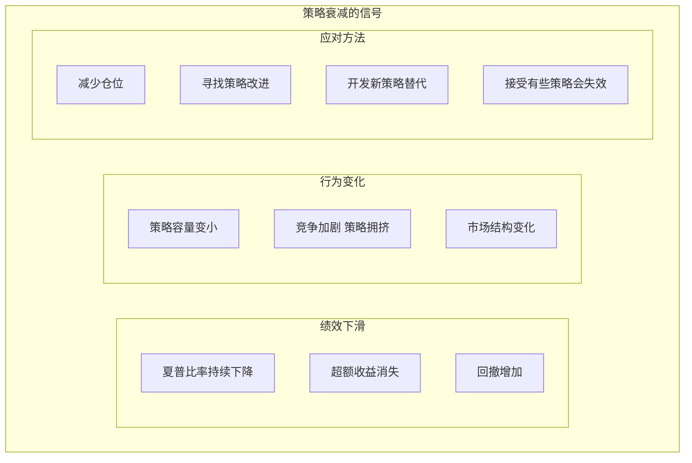

---

## 七、总结

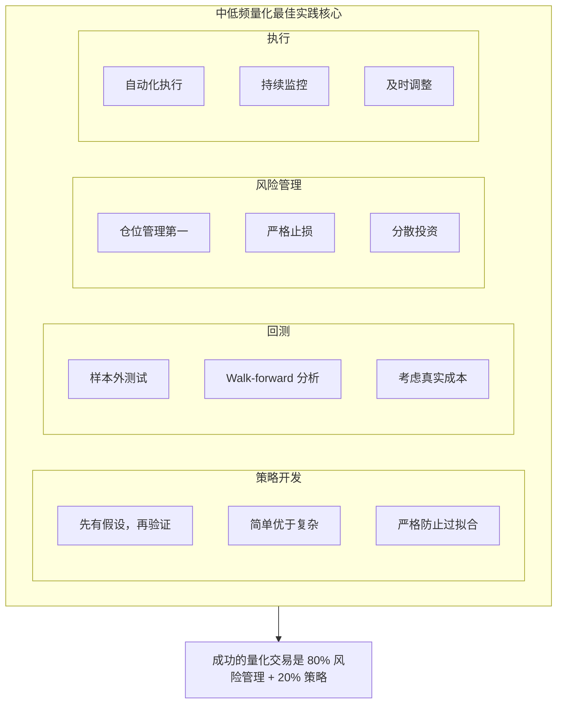

---

## 相关文章

- [上一篇：01 - 个人量化交易入门指南](/articles/quant/quant-01-个人量化交易入门指南/)
- [下一篇：03 - 中国大陆量化交易接口与数据](/articles/quant/quant-03-中国大陆量化交易接口与数据/)
