+++
title = "03. 中国大陆量化交易接口与数据"
date = 2025-01-15
weight = 3000
description = "中国大陆个人量化交易可用的交易接口、可交易产品、数据来源及回测平台详解"
[taxonomies]
tags = ["quant", "trading", "china", "api", "data"]
+++

## 概述

中国大陆的量化交易环境相对特殊，个人投资者面临一定限制。本文详细介绍在中国大陆可用的交易接口、产品、数据来源和回测工具。

---

## 一、可交易产品

### 1.1 产品分类

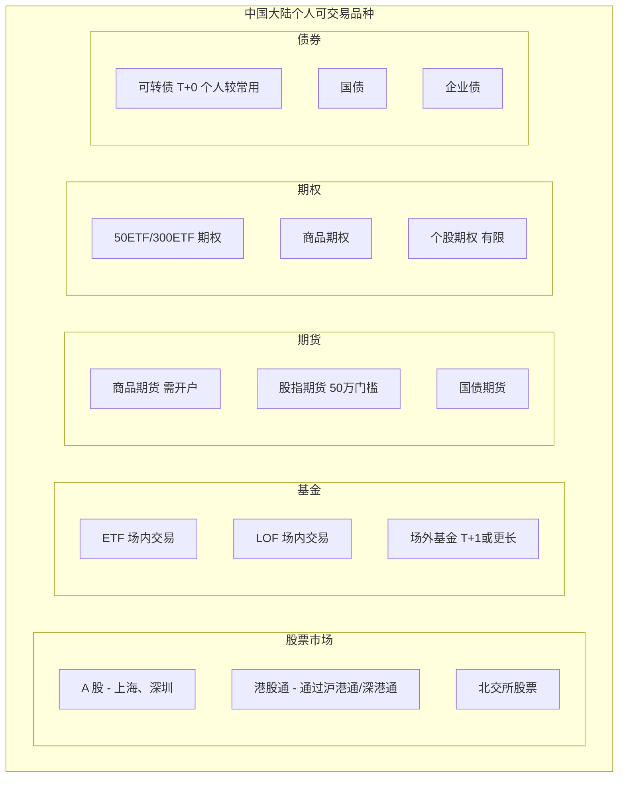

### 1.2 各品种量化特点

**产品量化适合度对比**：

| 品种 | 量化友好度 | 备注 |
|------|-----------|------|
| A股 | ⭐⭐⭐ | T+1 限制，涨跌停限制 |
| ETF | ⭐⭐⭐⭐ | 流动性好，成本低 |
| 可转债 | ⭐⭐⭐⭐⭐ | T+0，无涨跌停，灵活 |
| 商品期货 | ⭐⭐⭐⭐ | T+0，杠杆，双向 |
| 股指期货 | ⭐⭐⭐⭐ | 门槛高，流动性好 |
| 期权 | ⭐⭐⭐ | 复杂度高 |

**个人量化推荐**：
1. 可转债（T+0 灵活）
2. ETF（成本低）
3. 商品期货（双向交易）

---

## 二、交易接口

### 2.1 股票/基金接口

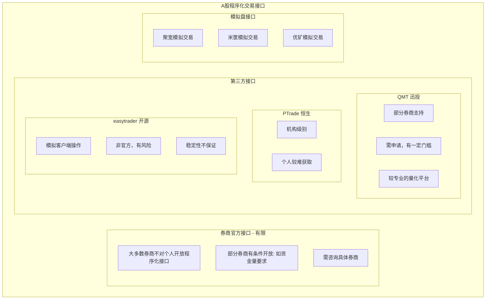

⚠️ **注意**：
- A股程序化交易对个人限制较多
- 谨慎使用非官方接口
- 优先考虑券商官方渠道

### 2.2 期货接口

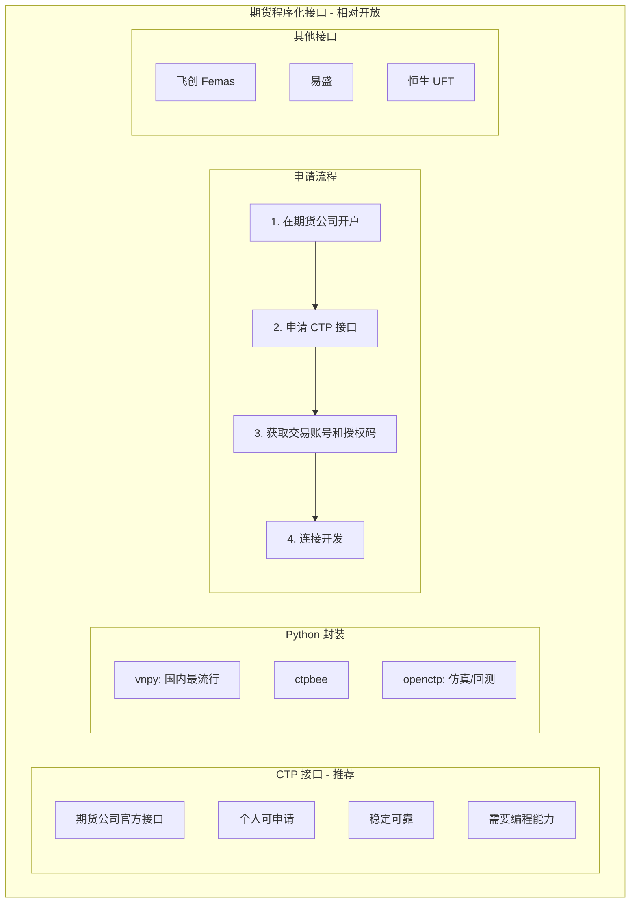

**期货量化开发示例（vnpy）**：
```python
from vnpy.gateway.ctp import CtpGateway
from vnpy.trader.engine import MainEngine

# 初始化
main_engine = MainEngine()
main_engine.add_gateway(CtpGateway)

# 连接
setting = {
    "用户名": "xxx",
    "密码": "xxx",
    "经纪商代码": "xxx",
    "交易服务器": "xxx",
    "行情服务器": "xxx",
}
main_engine.connect(setting, "CTP")
```

### 2.3 可转债接口

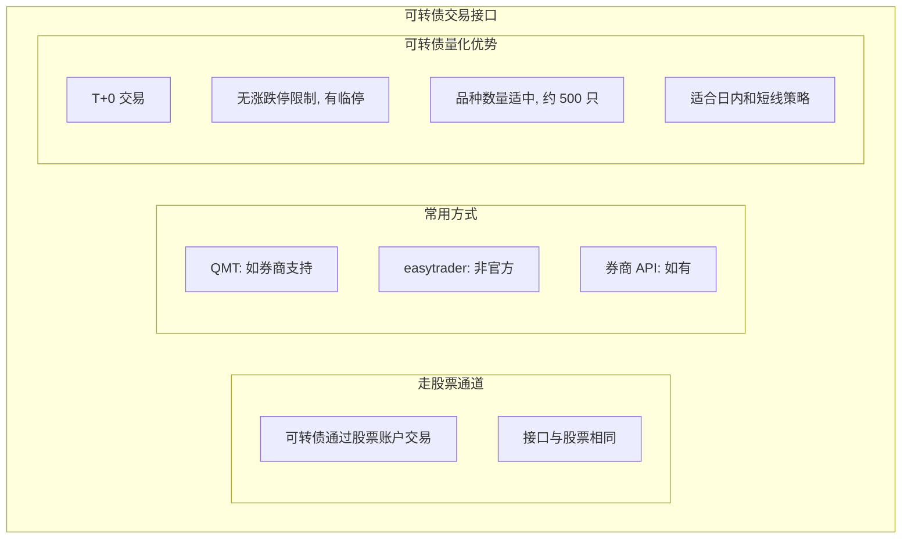

---

## 三、数据来源

### 3.1 免费数据源

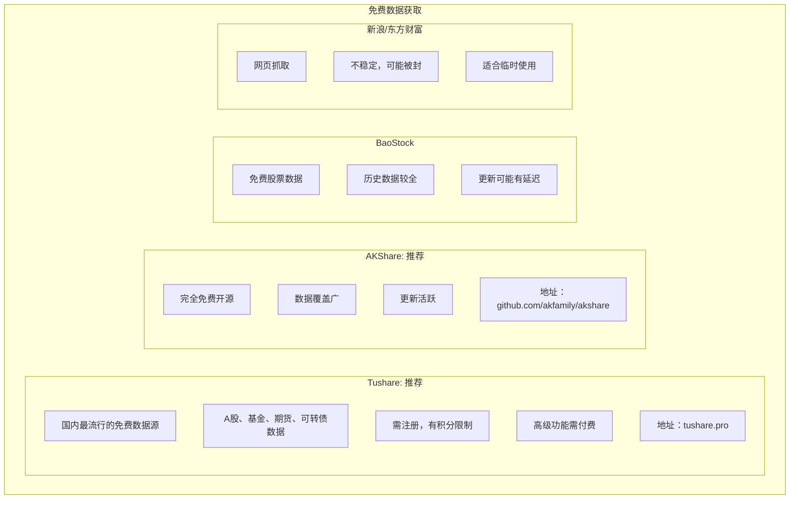

**数据获取示例：**

```python
# Tushare 示例
import tushare as ts
pro = ts.pro_api('你的token')
df = pro.daily(ts_code='000001.SZ', start_date='20200101')

# AKShare 示例
import akshare as ak
df = ak.stock_zh_a_hist(symbol="000001", period="daily")

# BaoStock 示例
import baostock as bs
bs.login()
rs = bs.query_history_k_data_plus("sh.600000")
```

### 3.2 付费数据源

**付费数据源**：

| 数据源 | 特点 |
|--------|------|
| Tushare Pro | 积分制，高级数据需付费 |
| Wind（万得） | 机构级，非常贵，个人较难获取 |
| 聚源数据 | 专业级，价格较高 |
| 通联数据 | 专业级，有个人版 |
| 米筐 | 量化平台，数据较全 |

**个人建议**：
- 入门用免费数据源足够
- Tushare Pro 性价比较高
- 机构级数据个人用不太值得

### 3.3 另类数据

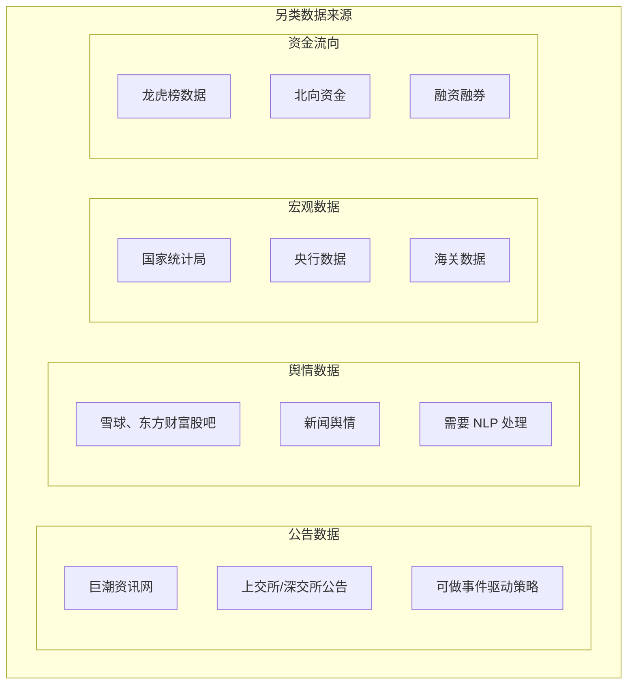

---

## 四、回测平台

### 4.1 在线回测平台

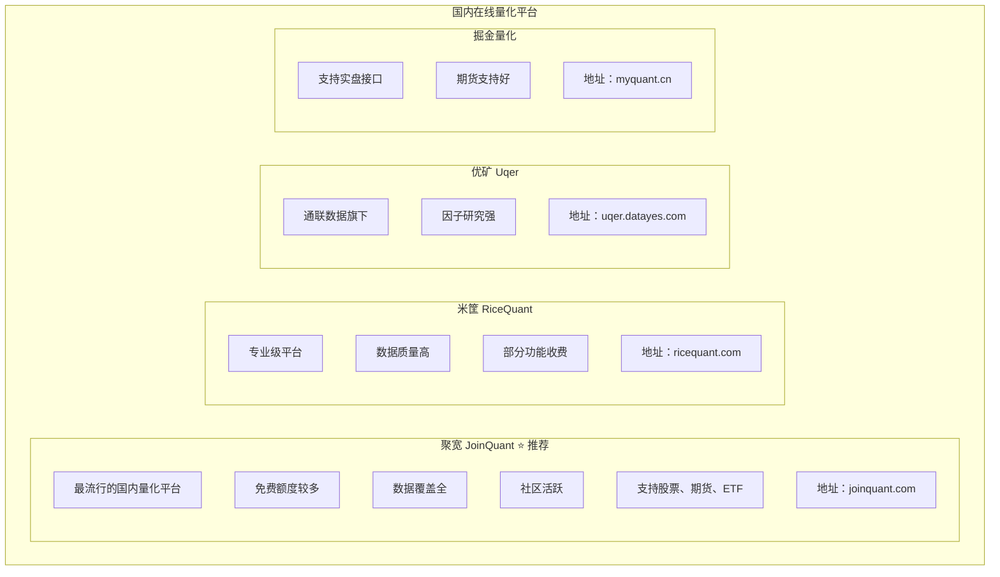

### 4.2 本地回测框架

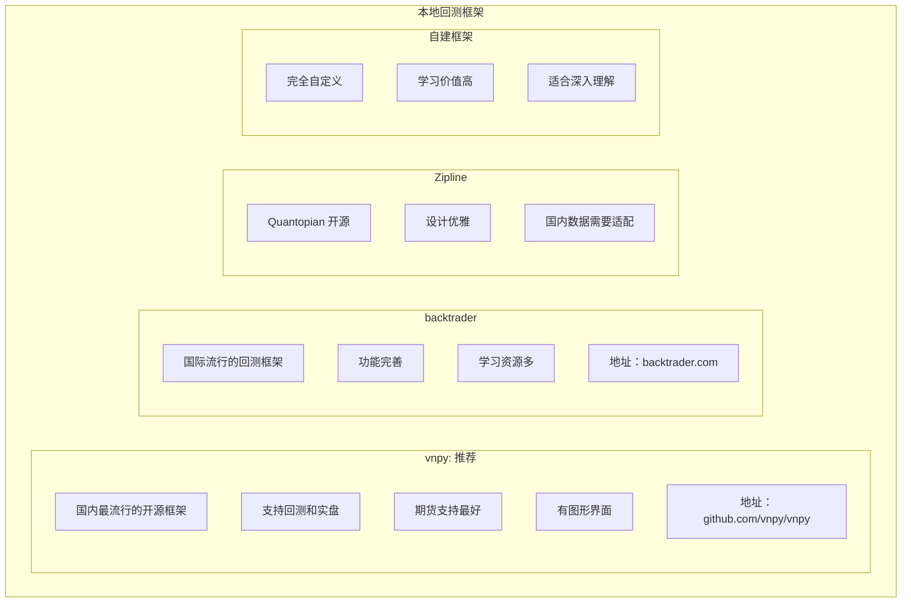

---

## 五、回测的有效性

### 5.1 中国市场回测的挑战

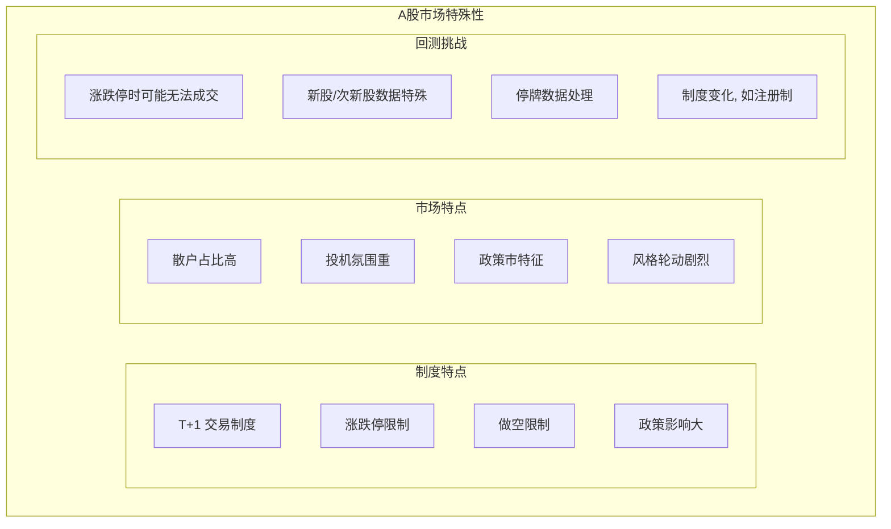

### 5.2 提高回测有效性

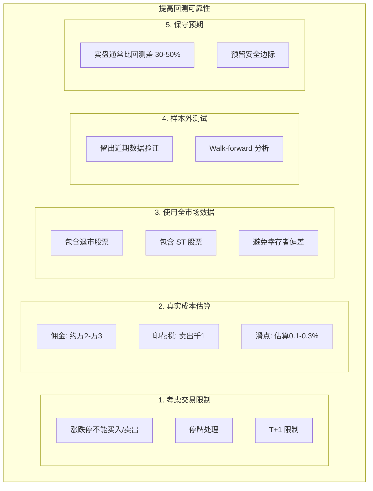

---

## 六、实践建议

### 6.1 个人量化路径

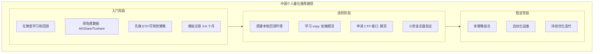

### 6.2 品种选择建议

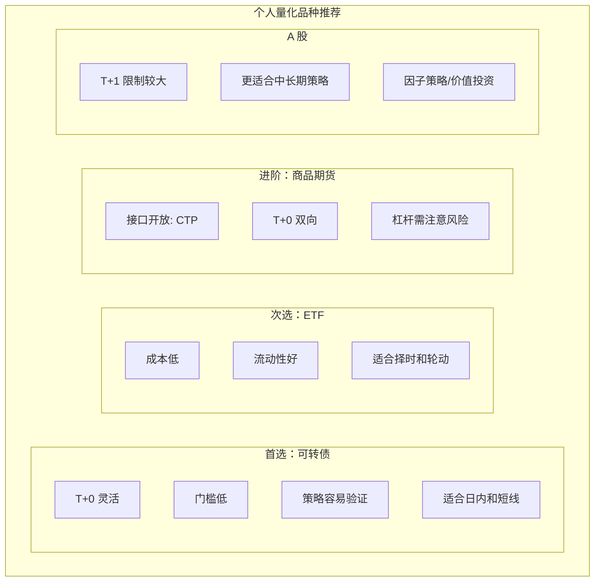

---

## 七、总结

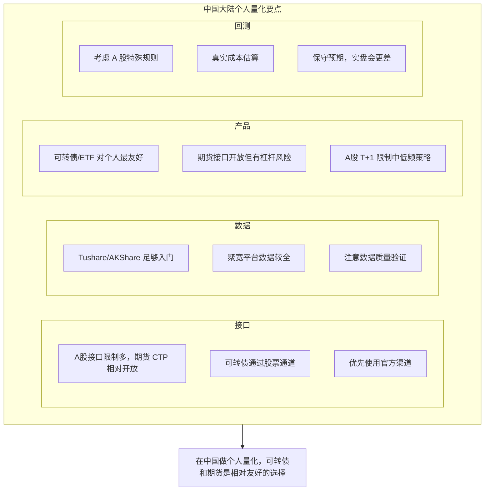

---

## 相关文章

- [上一篇：02 - 中低频量化交易最佳实践](@/articles/quant/quant-02-中低频量化交易最佳实践.md)
- [下一篇：04 - 全球量化交易接口与数据](@/articles/quant/quant-04-全球量化交易接口与数据.md)
