+++
title = "04 - 全球量化交易接口与数据"
date = 2025-01-15
description = "放眼全球：海外市场量化交易接口、可交易产品、数据来源及回测平台详解"
[taxonomies]
tags = ["quant", "trading", "global", "api", "data", "us-market"]
+++

## 概述

相比中国大陆，海外市场对个人量化交易更加开放。本文详细介绍全球主要市场的交易接口、产品、数据来源和工具。

---

## 一、可交易产品

### 1.1 美国市场

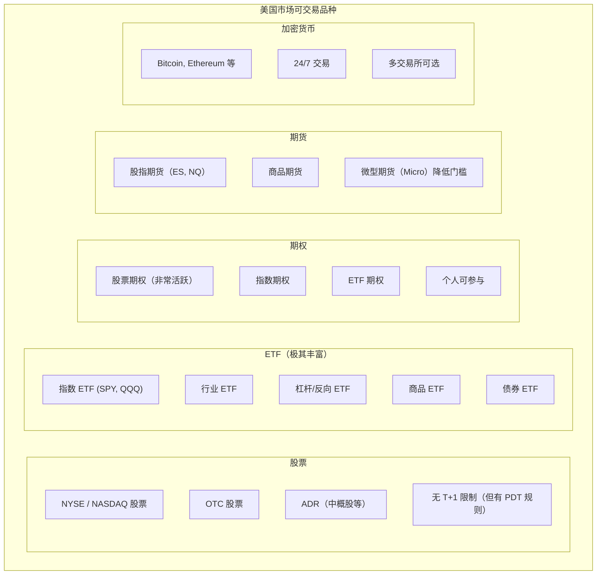

### 1.2 其他市场

**其他主要市场**：

| 市场 | 特点 |
|------|------|
| 欧洲 (德/英/法等) | 多国市场，需注意时区；流动性较好 |
| 日本 | 亚洲时区，与 A 股有相关性；日经期货活跃 |
| 香港 | 与 A 股联动；可做空 |
| 加密货币 | 全球市场，24/7；波动大，机会多 |
| 外汇 | 24/5 交易；杠杆高，风险大 |

---

## 二、交易接口

### 2.1 Interactive Brokers（盈透证券）

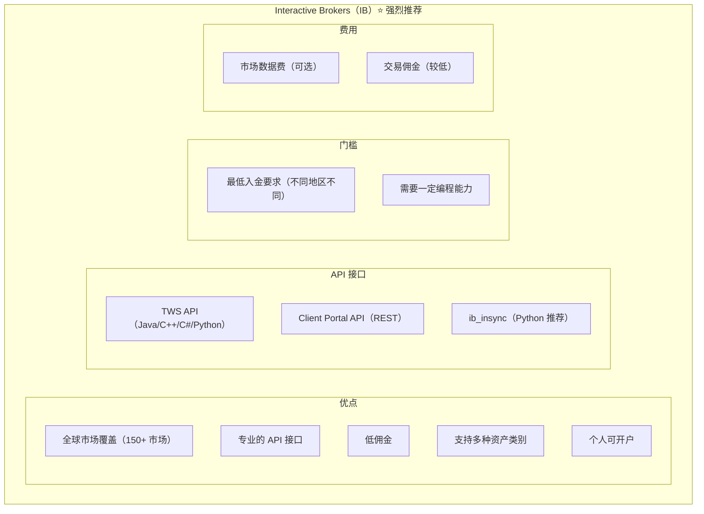

**Python 示例（ib_insync）**：
```python
from ib_insync import *

# 连接
ib = IB()
ib.connect('127.0.0.1', 7497, clientId=1)

# 获取行情
contract = Stock('AAPL', 'SMART', 'USD')
ib.qualifyContracts(contract)
ticker = ib.reqMktData(contract)

# 下单
order = MarketOrder('BUY', 100)
trade = ib.placeOrder(contract, order)

ib.disconnect()
```

### 2.2 Alpaca

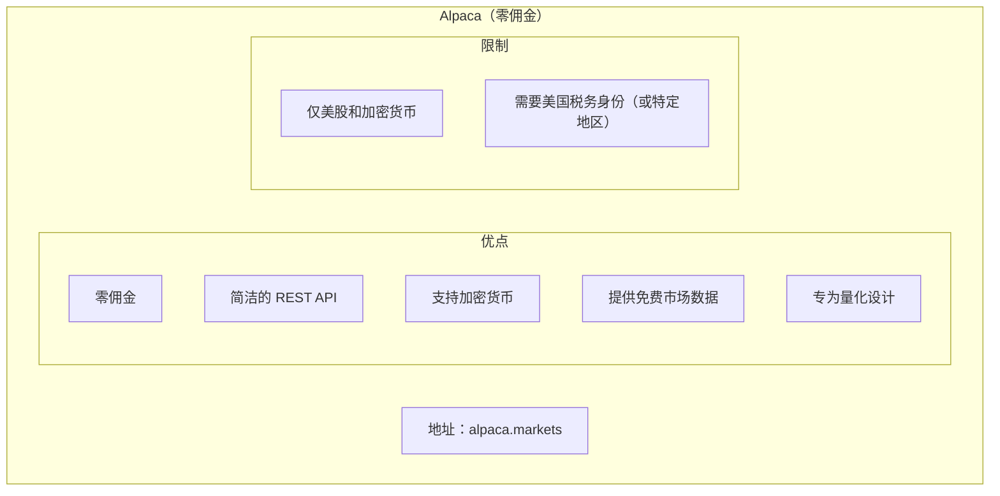

**Python 示例**：
```python
import alpaca_trade_api as tradeapi

api = tradeapi.REST(
    key_id='YOUR_API_KEY',
    secret_key='YOUR_SECRET_KEY',
    base_url='https://paper-api.alpaca.markets'  # 模拟盘
)

# 获取账户
account = api.get_account()

# 下单
api.submit_order(
    symbol='AAPL',
    qty=10,
    side='buy',
    type='market',
    time_in_force='gtc'
)
```

### 2.3 加密货币交易所

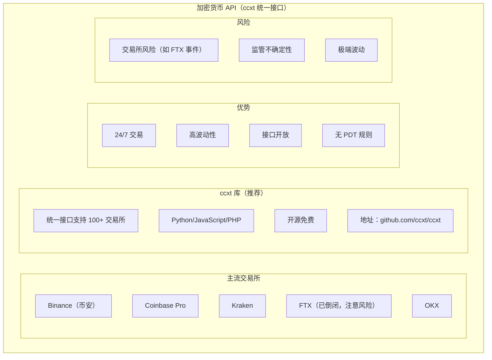

**ccxt 示例**：
```python
import ccxt

exchange = ccxt.binance({
    'apiKey': 'YOUR_API_KEY',
    'secret': 'YOUR_SECRET',
})

# 获取行情
ticker = exchange.fetch_ticker('BTC/USDT')

# 下单
order = exchange.create_market_buy_order('BTC/USDT', 0.01)
```

### 2.4 其他接口

**其他常用接口**：

| 接口 | 特点 |
|------|------|
| TD Ameritrade | 美股，API 友好（已被嘉信收购） |
| QuantConnect | 云端量化平台，可对接多个券商 |
| Tradier | 美股/期权，API 友好 |
| OANDA | 外汇交易 |
| IG | CFD，多市场覆盖 |

---

## 三、数据来源

### 3.1 免费数据源

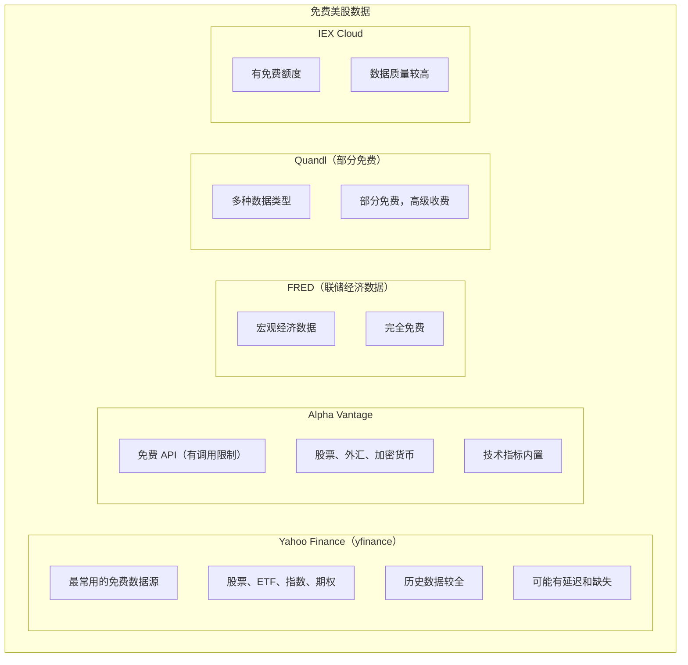

**yfinance 示例**：
```python
import yfinance as yf

# 获取股票数据
ticker = yf.Ticker("AAPL")
hist = ticker.history(period="1y")

# 多只股票
data = yf.download(['AAPL', 'GOOGL', 'MSFT'], start="2020-01-01")
```

### 3.2 付费数据源

**付费数据源**：

| 数据源 | 特点 |
|--------|------|
| Polygon.io | 实时数据，质量高，价格适中 |
| Tiingo | 历史数据全，有免费层 |
| Intrinio | 基本面数据强 |
| Bloomberg | 机构级，非常贵 |
| Refinitiv | 机构级 |
| IB 数据 | 通过 IB 订阅，质量可靠 |

**个人建议**：
- 入门用 yfinance 足够
- 需要实时数据考虑 Polygon 或 IB
- 机构级数据性价比不高

### 3.3 另类数据

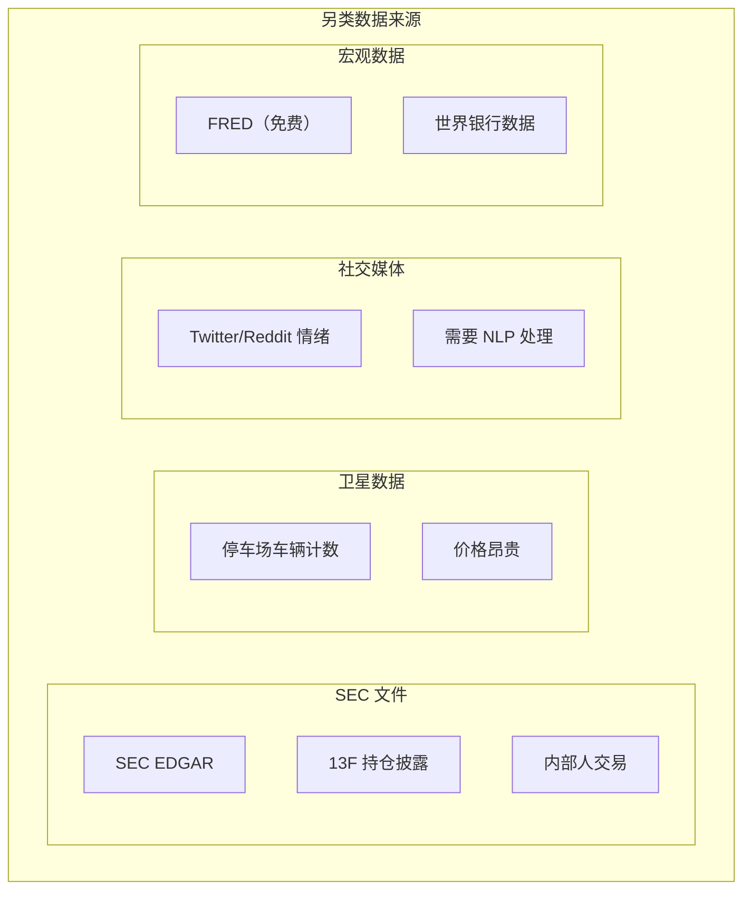

---

## 四、回测平台

### 4.1 云端平台

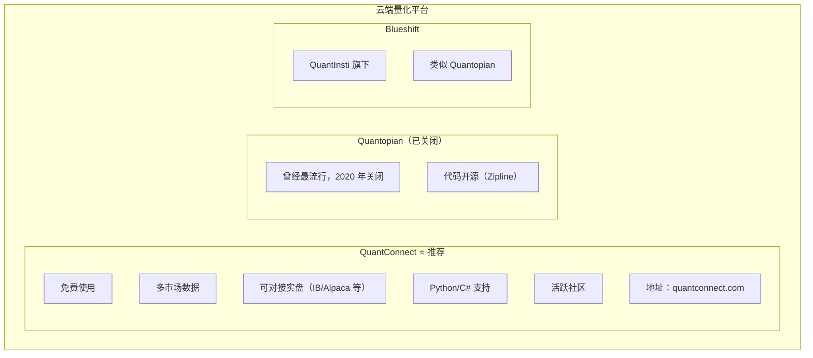

### 4.2 本地框架

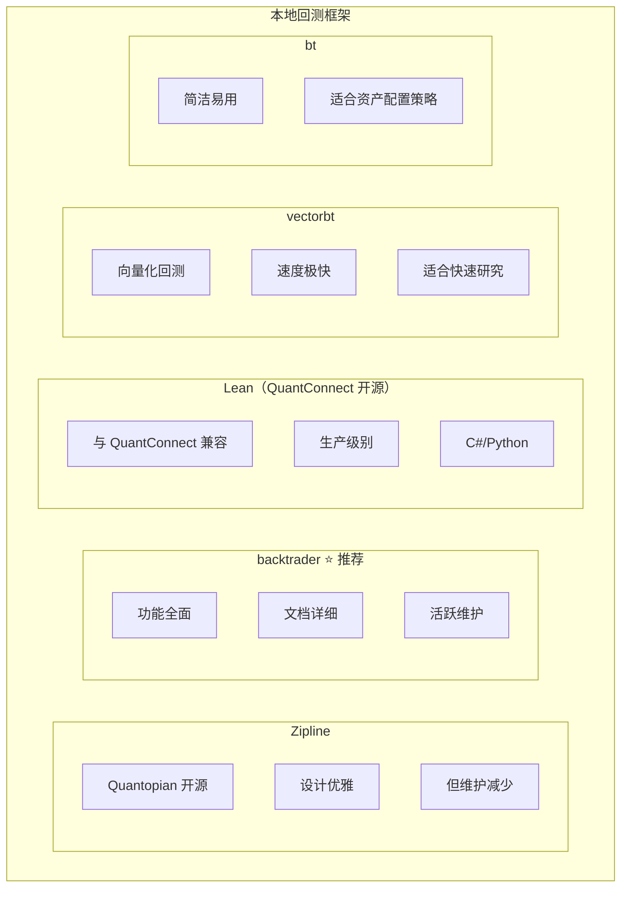

---

## 五、回测的有效性

### 5.1 美股回测优势

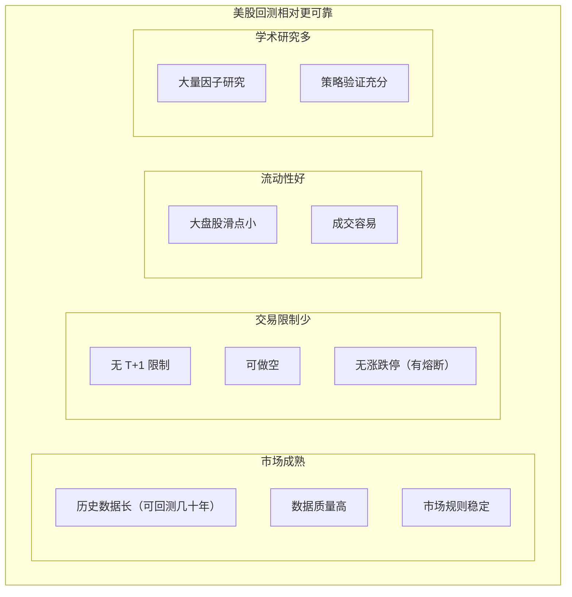

### 5.2 回测注意事项

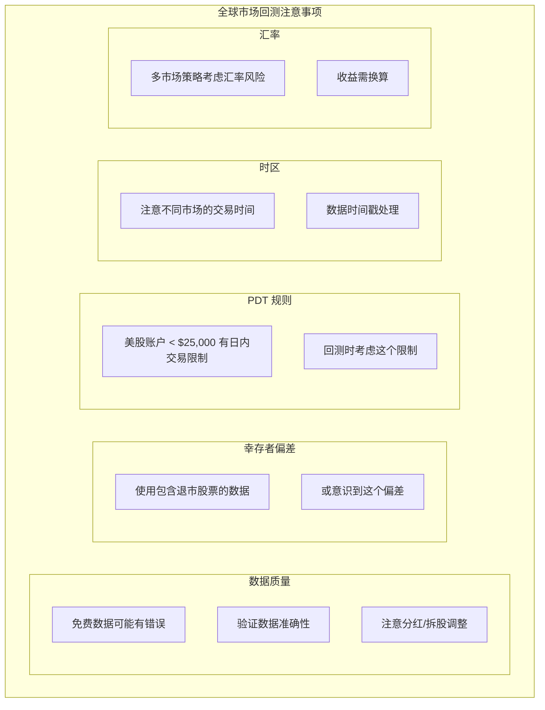

---

## 六、中国投资者参与全球市场

### 6.1 开户途径

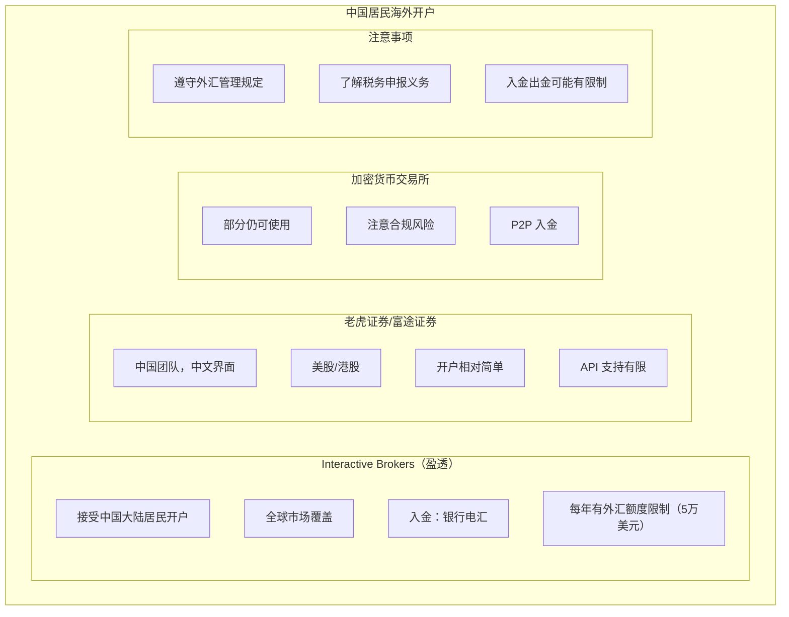

### 6.2 实践建议

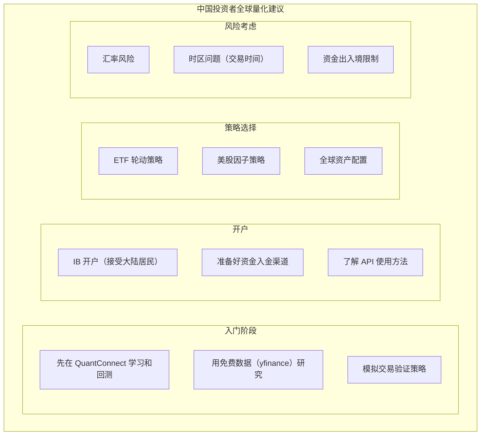

---

## 七、总结

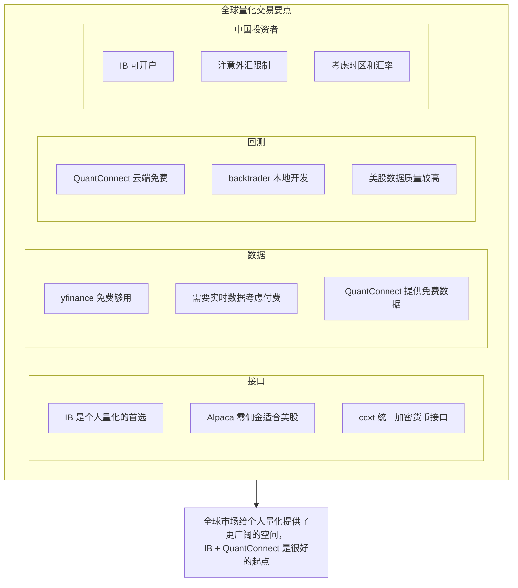

---

## 相关文章

- [上一篇：03 - 中国大陆量化交易接口与数据](/articles/quant/quant-03-中国大陆量化交易接口与数据/)
- [下一篇：05 - 个人量化常用策略详解](/articles/quant/quant-05-个人量化常用策略详解/)
