+++
title = "05 - 个人量化常用策略详解"
date = 2025-01-15
description = "适合个人投资者的量化策略详解：趋势跟踪、均值回归、动量、因子投资等经典策略原理与实现"
[taxonomies]
tags = ["quant", "trading", "strategy", "momentum", "mean-reversion", "factor-investing"]
+++

## 概述

量化策略种类繁多，但并非所有策略都适合个人投资者。本文详细介绍几类经过验证、适合中低频个人量化的经典策略。

---

## 一、策略分类

### 1.1 按交易逻辑分类

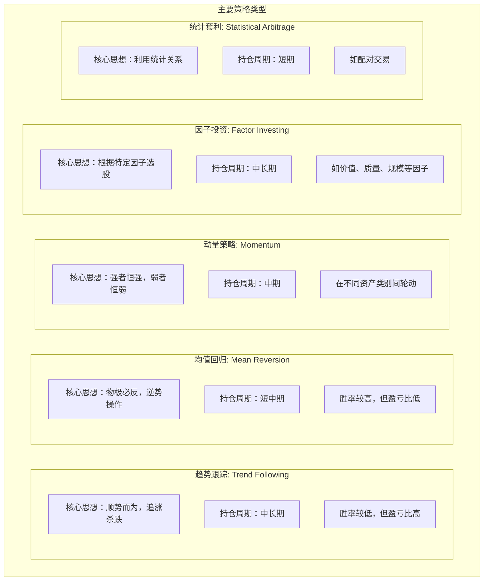
```mermaid
graph TB
    subgraph 策略类型["主要策略类型"]
        subgraph 趋势跟踪["趋势跟踪: Trend Following"]
            T1["核心思想：顺势而为，追涨杀跌"]
            T2["持仓周期：中长期"]
            T3["胜率较低，但盈亏比高"]
        end
        subgraph 均值回归["均值回归: Mean Reversion"]
            M1["核心思想：物极必反，逆势操作"]
            M2["持仓周期：短中期"]
            M3["胜率较高，但盈亏比低"]
        end
        subgraph 动量["动量策略: Momentum"]
            D1["核心思想：强者恒强，弱者恒弱"]
            D2["持仓周期：中期"]
            D3["在不同资产类别间轮动"]
        end
        subgraph 因子["因子投资: Factor Investing"]
            F1["核心思想：根据特定因子选股"]
            F2["持仓周期：中长期"]
            F3["如价值、质量、规模等因子"]
        end
        subgraph 套利["统计套利: Statistical Arbitrage"]
            S1["核心思想：利用统计关系"]
            S2["持仓周期：短期"]
            S3["如配对交易"]
        end
    end
```

### 1.2 个人适用性评估

**策略适合度对比**：

| 策略 | 个人适合度 | 原因 |
|------|-----------|------|
| 趋势跟踪 | ⭐⭐⭐⭐⭐ | 简单，不需要高频 |
| 动量轮动 | ⭐⭐⭐⭐⭐ | 中低频，逻辑清晰 |
| 因子投资 | ⭐⭐⭐⭐ | 需要更多研究 |
| 均值回归 | ⭐⭐⭐ | 需要较高频率执行 |
| 统计套利 | ⭐⭐ | 竞争激烈，个人难做 |
| 高频做市 | ⭐ | 个人无法参与 |

---

## 二、趋势跟踪策略

### 2.1 策略原理

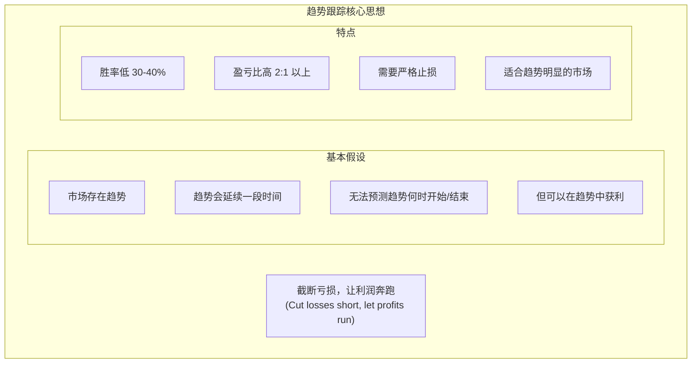
```mermaid
graph TB
    subgraph 趋势核心["趋势跟踪核心思想"]
        motto["截断亏损，让利润奔跑<br/>(Cut losses short, let profits run)"]
        subgraph 基本假设
            A1["市场存在趋势"]
            A2["趋势会延续一段时间"]
            A3["无法预测趋势何时开始/结束"]
            A4["但可以在趋势中获利"]
        end
        subgraph 特点
            T1["胜率低 30-40%"]
            T2["盈亏比高 2:1 以上"]
            T3["需要严格止损"]
            T4["适合趋势明显的市场"]
        end
    end
```

### 2.2 经典策略：双均线

**双均线策略**：

**规则**：
- 短期均线上穿长期均线 → 买入
- 短期均线下穿长期均线 → 卖出

**常用参数**：
- 5日/20日
- 10日/50日
- 50日/200日（黄金交叉）

**Python 示例**：
```python
import pandas as pd

def dual_ma_strategy(df, short=10, long=50):
    df['MA_short'] = df['close'].rolling(short).mean()
    df['MA_long'] = df['close'].rolling(long).mean()
    
    df['signal'] = 0
    df.loc[df['MA_short'] > df['MA_long'], 'signal'] = 1
    df.loc[df['MA_short'] < df['MA_long'], 'signal'] = -1
    
    df['position'] = df['signal'].shift(1)  # 避免 look-ahead
    return df
```

### 2.3 经典策略：海龟交易

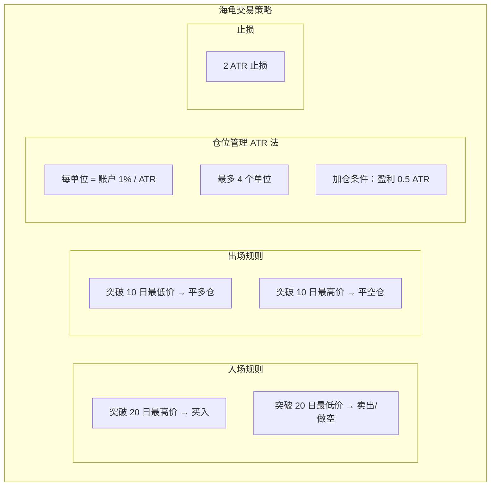
```mermaid
graph TB
    subgraph 海龟["海龟交易策略"]
        subgraph 入场规则
            E1["突破 20 日最高价 → 买入"]
            E2["突破 20 日最低价 → 卖出/做空"]
        end
        subgraph 出场规则
            X1["突破 10 日最低价 → 平多仓"]
            X2["突破 10 日最高价 → 平空仓"]
        end
        subgraph 仓位管理["仓位管理 ATR 法"]
            P1["每单位 = 账户 1% / ATR"]
            P2["最多 4 个单位"]
            P3["加仓条件：盈利 0.5 ATR"]
        end
        subgraph 止损
            S1["2 ATR 止损"]
        end
    end
```

**核心概念 - ATR（平均真实波动幅度）**：
- 衡量市场波动性
- 用于自适应仓位和止损
- ATR = 过去 N 日真实波幅的平均

### 2.4 趋势策略优化

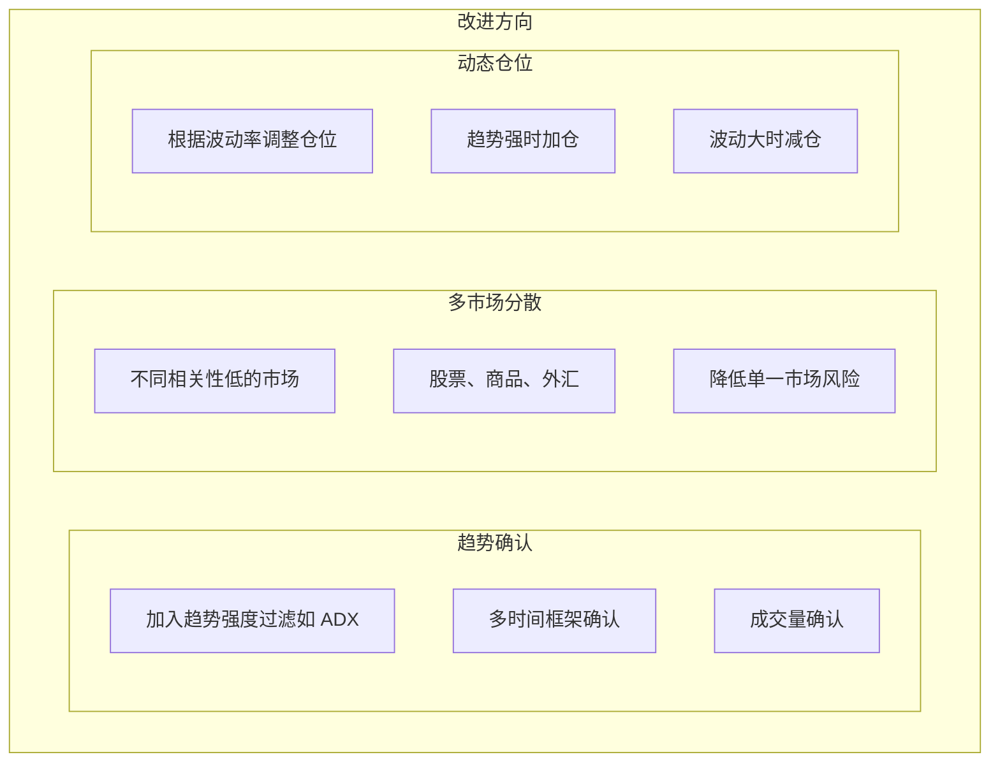
```mermaid
graph TB
    subgraph 改进["改进方向"]
        subgraph 趋势确认
            Q1["加入趋势强度过滤如 ADX"]
            Q2["多时间框架确认"]
            Q3["成交量确认"]
        end
        subgraph 多市场分散
            F1["不同相关性低的市场"]
            F2["股票、商品、外汇"]
            F3["降低单一市场风险"]
        end
        subgraph 动态仓位
            C1["根据波动率调整仓位"]
            C2["趋势强时加仓"]
            C3["波动大时减仓"]
        end
    end
```

---

## 三、动量/轮动策略

### 3.1 策略原理

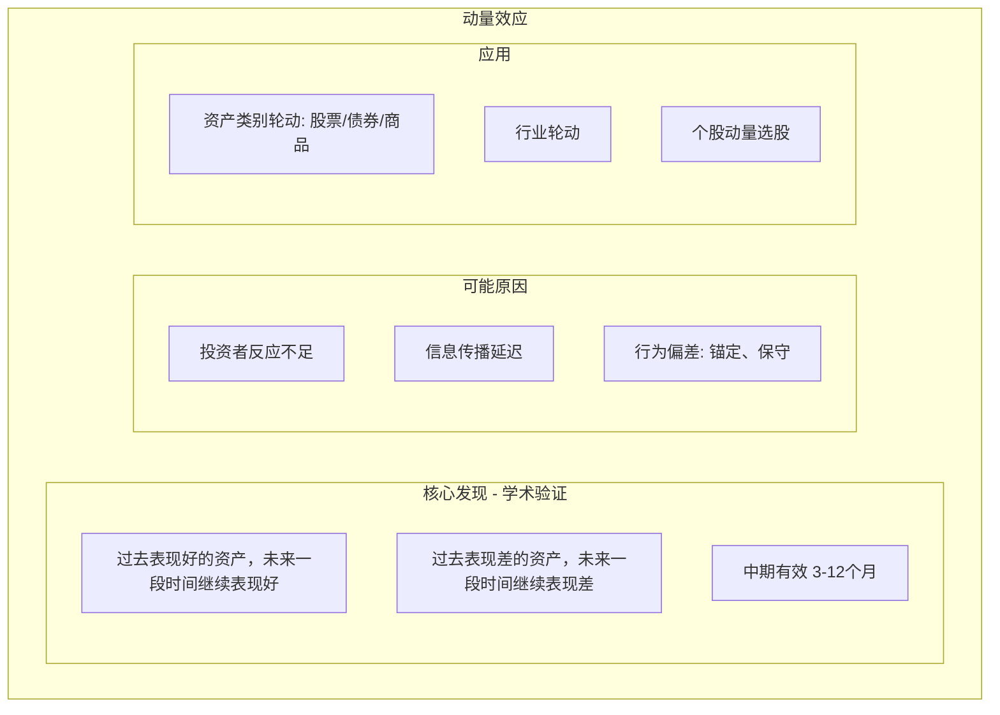
```mermaid
graph TB
    subgraph 动量效应
        subgraph 核心发现["核心发现 - 学术验证"]
            F1["过去表现好的资产，未来一段时间继续表现好"]
            F2["过去表现差的资产，未来一段时间继续表现差"]
            F3["中期有效 3-12个月"]
        end
        subgraph 可能原因
            Y1["投资者反应不足"]
            Y2["信息传播延迟"]
            Y3["行为偏差: 锚定、保守"]
        end
        subgraph 应用
            A1["资产类别轮动: 股票/债券/商品"]
            A2["行业轮动"]
            A3["个股动量选股"]
        end
    end
```

### 3.2 ETF 轮动策略

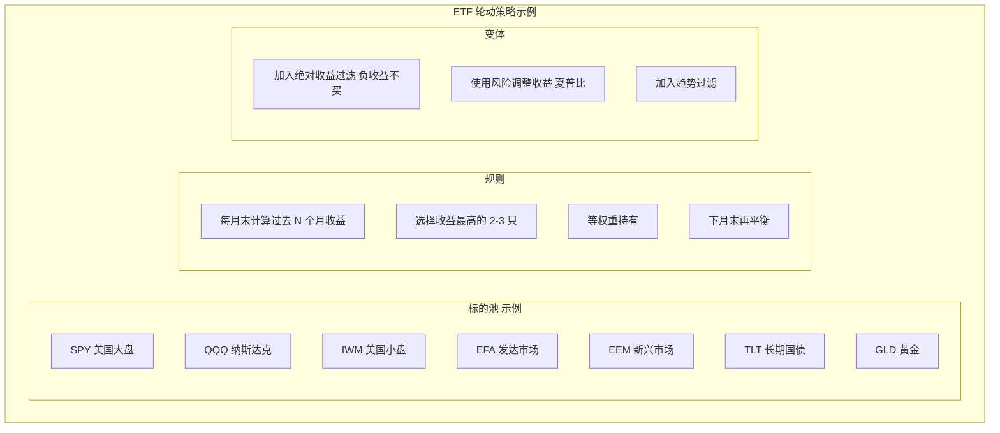
```mermaid
graph TB
    subgraph ETF轮动["ETF 轮动策略示例"]
        subgraph 标的池["标的池 示例"]
            E1["SPY 美国大盘"]
            E2["QQQ 纳斯达克"]
            E3["IWM 美国小盘"]
            E4["EFA 发达市场"]
            E5["EEM 新兴市场"]
            E6["TLT 长期国债"]
            E7["GLD 黄金"]
        end
        subgraph 规则
            R1["每月末计算过去 N 个月收益"]
            R2["选择收益最高的 2-3 只"]
            R3["等权重持有"]
            R4["下月末再平衡"]
        end
        subgraph 变体
            V1["加入绝对收益过滤 负收益不买"]
            V2["使用风险调整收益 夏普比"]
            V3["加入趋势过滤"]
        end
    end
```

**Python 示例**：
```python
def momentum_rotation(prices, lookback=6, n_hold=3):
    # 计算过去 lookback 个月收益
    returns = prices.pct_change(lookback * 21)  # 假设每月 21 交易日
    
    # 排名，选择最高的 n_hold 个
    rankings = returns.rank(axis=1, ascending=False)
    
    # 生成持仓信号
    weights = (rankings <= n_hold).astype(float)
    weights = weights.div(weights.sum(axis=1), axis=0)  # 等权重
    
    return weights
```

### 3.3 双动量策略

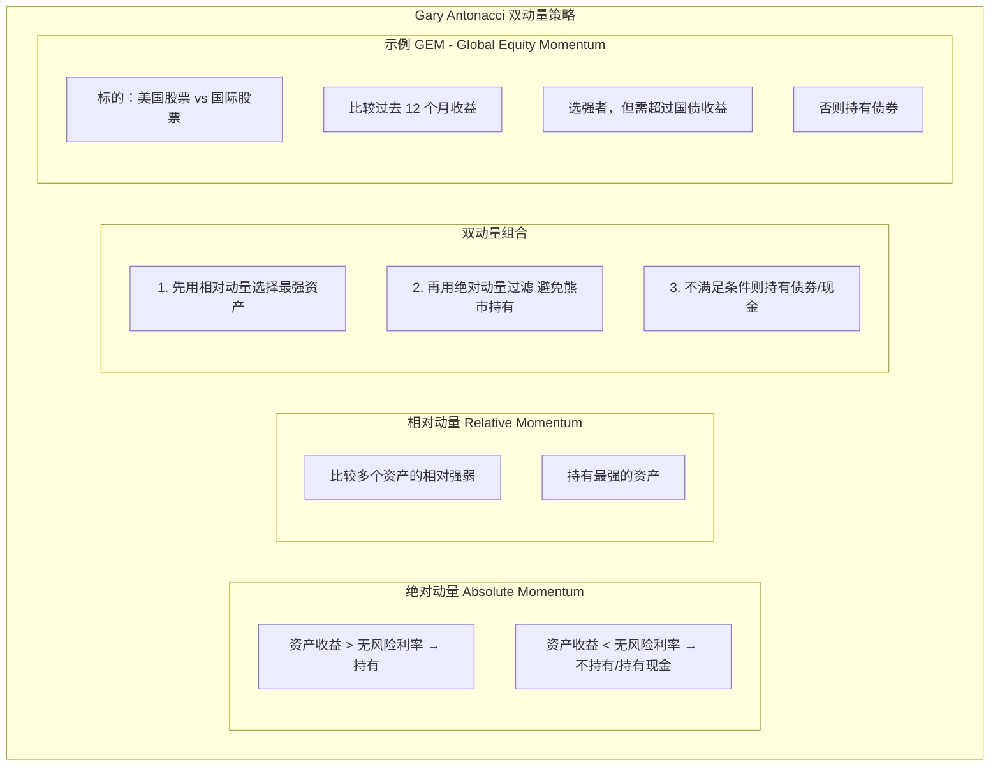
```mermaid
graph TB
    subgraph 双动量["Gary Antonacci 双动量策略"]
        subgraph 绝对动量["绝对动量 Absolute Momentum"]
            A1["资产收益 > 无风险利率 → 持有"]
            A2["资产收益 < 无风险利率 → 不持有/持有现金"]
        end
        subgraph 相对动量["相对动量 Relative Momentum"]
            R1["比较多个资产的相对强弱"]
            R2["持有最强的资产"]
        end
        subgraph 组合["双动量组合"]
            C1["1. 先用相对动量选择最强资产"]
            C2["2. 再用绝对动量过滤 避免熊市持有"]
            C3["3. 不满足条件则持有债券/现金"]
        end
        subgraph GEM["示例 GEM - Global Equity Momentum"]
            G1["标的：美国股票 vs 国际股票"]
            G2["比较过去 12 个月收益"]
            G3["选强者，但需超过国债收益"]
            G4["否则持有债券"]
        end
    end
```

---

## 四、均值回归策略

### 4.1 策略原理

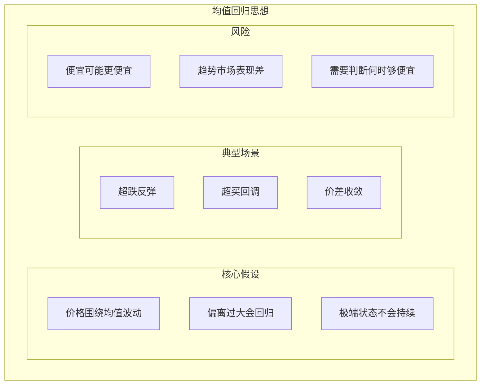
```mermaid
graph TB
    subgraph 均值回归思想
        subgraph 核心假设
            H1["价格围绕均值波动"]
            H2["偏离过大会回归"]
            H3["极端状态不会持续"]
        end
        subgraph 典型场景
            S1["超跌反弹"]
            S2["超买回调"]
            S3["价差收敛"]
        end
        subgraph 风险
            R1["便宜可能更便宜"]
            R2["趋势市场表现差"]
            R3["需要判断何时够便宜"]
        end
    end
```

### 4.2 RSI 策略

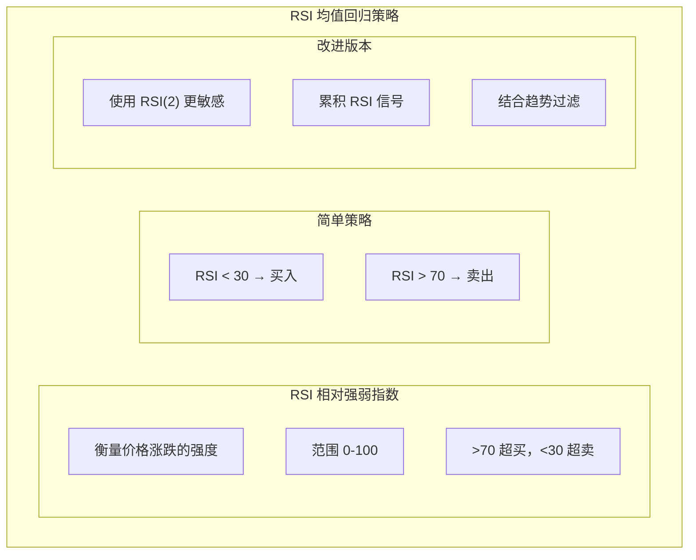
```mermaid
graph TB
    subgraph RSI策略["RSI 均值回归策略"]
        subgraph RSI指标["RSI 相对强弱指数"]
            I1["衡量价格涨跌的强度"]
            I2["范围 0-100"]
            I3[">70 超买，<30 超卖"]
        end
        subgraph 简单策略
            S1["RSI < 30 → 买入"]
            S2["RSI > 70 → 卖出"]
        end
        subgraph 改进版本
            G1["使用 RSI(2) 更敏感"]
            G2["累积 RSI 信号"]
            G3["结合趋势过滤"]
        end
    end
```

**Python 示例**：
```python
def rsi_strategy(df, period=14, oversold=30, overbought=70):
    delta = df['close'].diff()
    gain = delta.where(delta > 0, 0)
    loss = -delta.where(delta < 0, 0)
    
    avg_gain = gain.rolling(period).mean()
    avg_loss = loss.rolling(period).mean()
    
    rs = avg_gain / avg_loss
    df['RSI'] = 100 - (100 / (1 + rs))
    
    df['signal'] = 0
    df.loc[df['RSI'] < oversold, 'signal'] = 1    # 买入
    df.loc[df['RSI'] > overbought, 'signal'] = -1  # 卖出
    
    return df
```

### 4.3 布林带策略

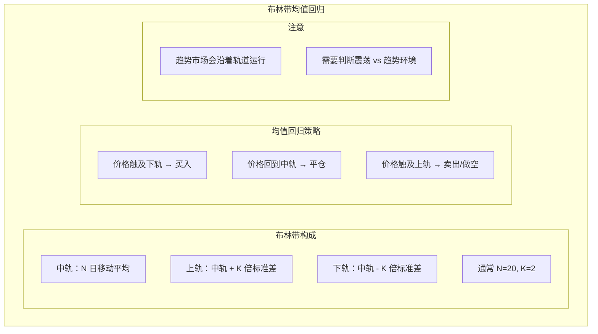
```mermaid
graph TB
    subgraph 布林带["布林带均值回归"]
        subgraph 构成["布林带构成"]
            B1["中轨：N 日移动平均"]
            B2["上轨：中轨 + K 倍标准差"]
            B3["下轨：中轨 - K 倍标准差"]
            B4["通常 N=20, K=2"]
        end
        subgraph 策略["均值回归策略"]
            S1["价格触及下轨 → 买入"]
            S2["价格回到中轨 → 平仓"]
            S3["价格触及上轨 → 卖出/做空"]
        end
        subgraph 注意
            N1["趋势市场会沿着轨道运行"]
            N2["需要判断震荡 vs 趋势环境"]
        end
    end
```

---

## 五、因子投资

### 5.1 经典因子

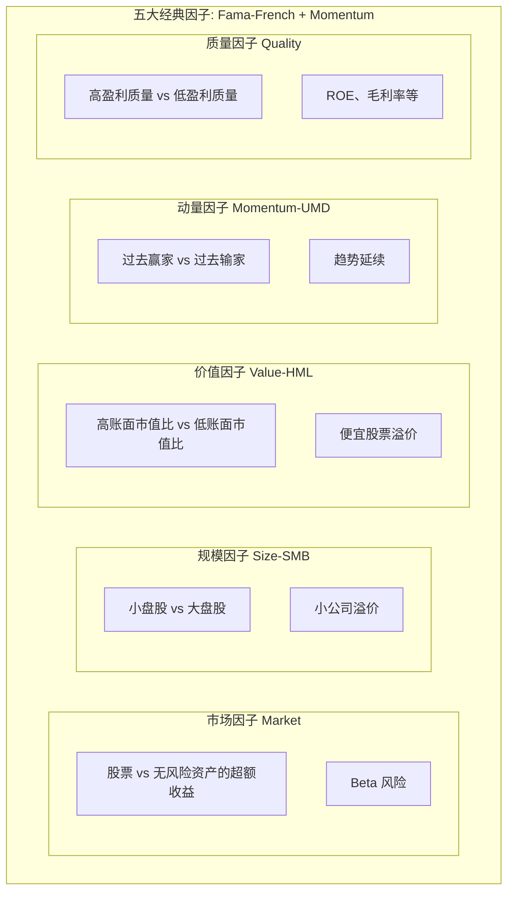
```mermaid
graph TB
    subgraph 经典因子["五大经典因子: Fama-French + Momentum"]
        subgraph 市场因子["市场因子 Market"]
            M1["股票 vs 无风险资产的超额收益"]
            M2["Beta 风险"]
        end
        subgraph 规模因子["规模因子 Size-SMB"]
            S1["小盘股 vs 大盘股"]
            S2["小公司溢价"]
        end
        subgraph 价值因子["价值因子 Value-HML"]
            V1["高账面市值比 vs 低账面市值比"]
            V2["便宜股票溢价"]
        end
        subgraph 动量因子["动量因子 Momentum-UMD"]
            D1["过去赢家 vs 过去输家"]
            D2["趋势延续"]
        end
        subgraph 质量因子["质量因子 Quality"]
            Q1["高盈利质量 vs 低盈利质量"]
            Q2["ROE、毛利率等"]
        end
    end
```

### 5.2 因子策略实现


```mermaid
graph TB
    subgraph 因子流程["因子策略构建流程"]
        subgraph S1["1. 因子计算"]
            A1["获取财务数据"]
            A2["计算因子值如 P/B, ROE"]
            A3["数据清洗和标准化"]
        end
        subgraph S2["2. 因子排名"]
            B1["对所有股票按因子值排名"]
            B2["分成若干组如 5 分位"]
        end
        subgraph S3["3. 组合构建"]
            C1["做多高分位组"]
            C2["可选 做空低分位组"]
            C3["等权或市值加权"]
        end
        subgraph S4["4. 定期再平衡"]
            D1["月度或季度调仓"]
            D2["根据最新因子值重新排名"]
        end
    end
    S1 --> S2 --> S3 --> S4
```

### 5.3 简单价值策略

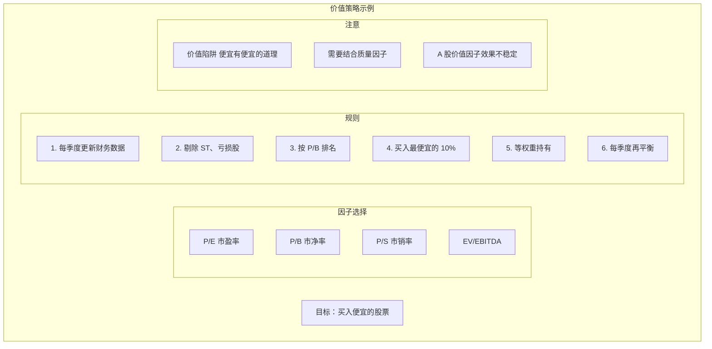
```mermaid
graph TB
    subgraph 价值策略["价值策略示例"]
        目标["目标：买入便宜的股票"]
        subgraph 因子选择
            F1["P/E 市盈率"]
            F2["P/B 市净率"]
            F3["P/S 市销率"]
            F4["EV/EBITDA"]
        end
        subgraph 规则
            R1["1. 每季度更新财务数据"]
            R2["2. 剔除 ST、亏损股"]
            R3["3. 按 P/B 排名"]
            R4["4. 买入最便宜的 10%"]
            R5["5. 等权重持有"]
            R6["6. 每季度再平衡"]
        end
        subgraph 注意
            N1["价值陷阱 便宜有便宜的道理"]
            N2["需要结合质量因子"]
            N3["A 股价值因子效果不稳定"]
        end
    end
```

---

## 六、组合策略

### 6.1 多策略组合

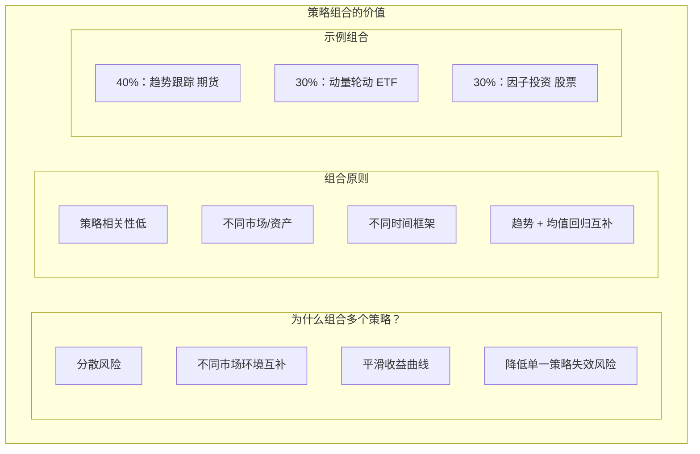
```mermaid
graph TB
    subgraph 策略组合["策略组合的价值"]
        subgraph 为什么["为什么组合多个策略？"]
            W1["分散风险"]
            W2["不同市场环境互补"]
            W3["平滑收益曲线"]
            W4["降低单一策略失效风险"]
        end
        subgraph 组合原则
            Y1["策略相关性低"]
            Y2["不同市场/资产"]
            Y3["不同时间框架"]
            Y4["趋势 + 均值回归互补"]
        end
        subgraph 示例组合
            S1["40%：趋势跟踪 期货"]
            S2["30%：动量轮动 ETF"]
            S3["30%：因子投资 股票"]
        end
    end
```

### 6.2 风险平价

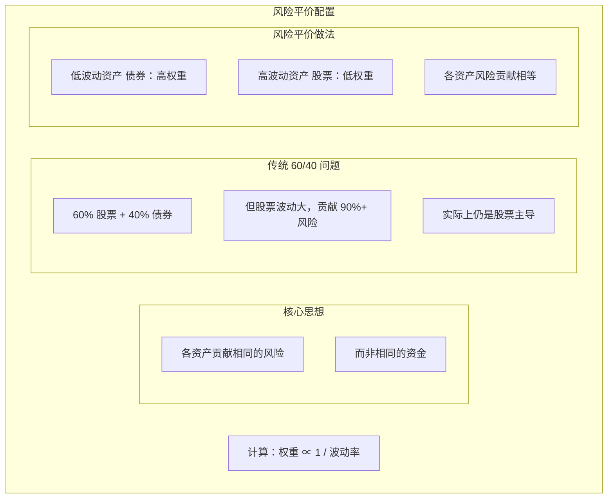
```mermaid
graph TB
    subgraph 风险平价["风险平价配置"]
        subgraph 核心思想
            H1["各资产贡献相同的风险"]
            H2["而非相同的资金"]
        end
        subgraph 传统问题["传统 60/40 问题"]
            P1["60% 股票 + 40% 债券"]
            P2["但股票波动大，贡献 90%+ 风险"]
            P3["实际上仍是股票主导"]
        end
        subgraph 做法["风险平价做法"]
            F1["低波动资产 债券：高权重"]
            F2["高波动资产 股票：低权重"]
            F3["各资产风险贡献相等"]
        end
        计算["计算：权重 ∝ 1 / 波动率"]
    end
```

---

## 七、策略评估

### 7.1 评估要点

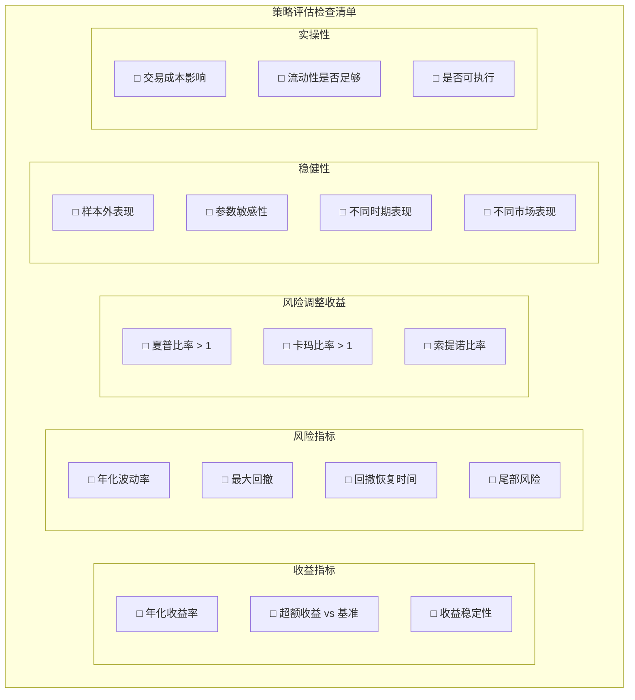
```mermaid
graph TB
    subgraph 评估清单["策略评估检查清单"]
        subgraph 收益指标
            R1["□ 年化收益率"]
            R2["□ 超额收益 vs 基准"]
            R3["□ 收益稳定性"]
        end
        subgraph 风险指标
            F1["□ 年化波动率"]
            F2["□ 最大回撤"]
            F3["□ 回撤恢复时间"]
            F4["□ 尾部风险"]
        end
        subgraph 风险调整收益
            S1["□ 夏普比率 > 1"]
            S2["□ 卡玛比率 > 1"]
            S3["□ 索提诺比率"]
        end
        subgraph 稳健性
            W1["□ 样本外表现"]
            W2["□ 参数敏感性"]
            W3["□ 不同时期表现"]
            W4["□ 不同市场表现"]
        end
        subgraph 实操性
            C1["□ 交易成本影响"]
            C2["□ 流动性是否足够"]
            C3["□ 是否可执行"]
        end
    end
```

---

## 八、总结

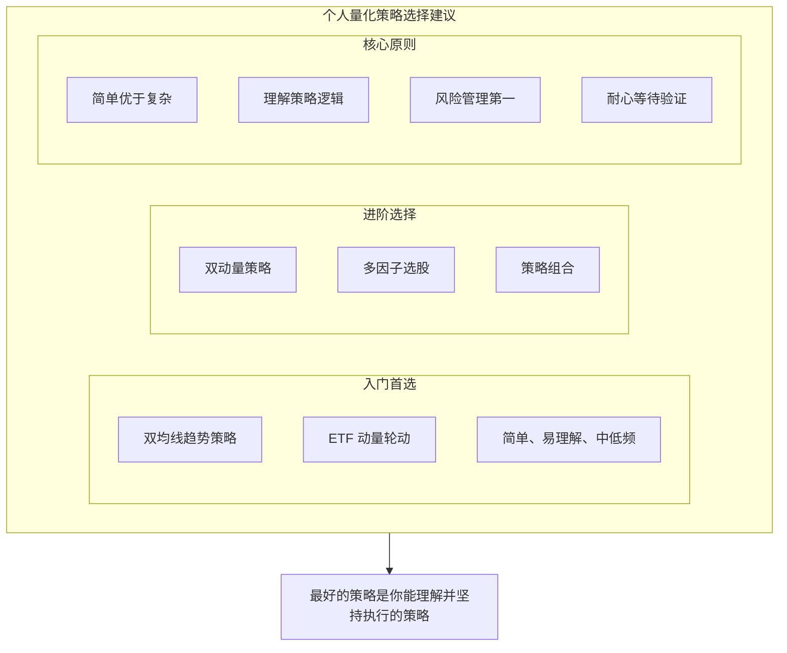
```mermaid
graph TB
    subgraph 建议["个人量化策略选择建议"]
        subgraph 入门首选
            R1["双均线趋势策略"]
            R2["ETF 动量轮动"]
            R3["简单、易理解、中低频"]
        end
        subgraph 进阶选择
            J1["双动量策略"]
            J2["多因子选股"]
            J3["策略组合"]
        end
        subgraph 核心原则
            H1["简单优于复杂"]
            H2["理解策略逻辑"]
            H3["风险管理第一"]
            H4["耐心等待验证"]
        end
    end
    建议 --> 结论["最好的策略是你能理解并坚持执行的策略"]
```

---

## 相关文章

- [上一篇：04 - 全球量化交易接口与数据](/articles/quant/quant-04-全球量化交易接口与数据/)
- [下一篇：06 - 量化交易风险管理与资金管理](/articles/quant/quant-06-量化交易风险管理与资金管理/)
