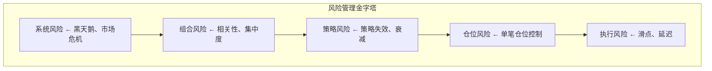
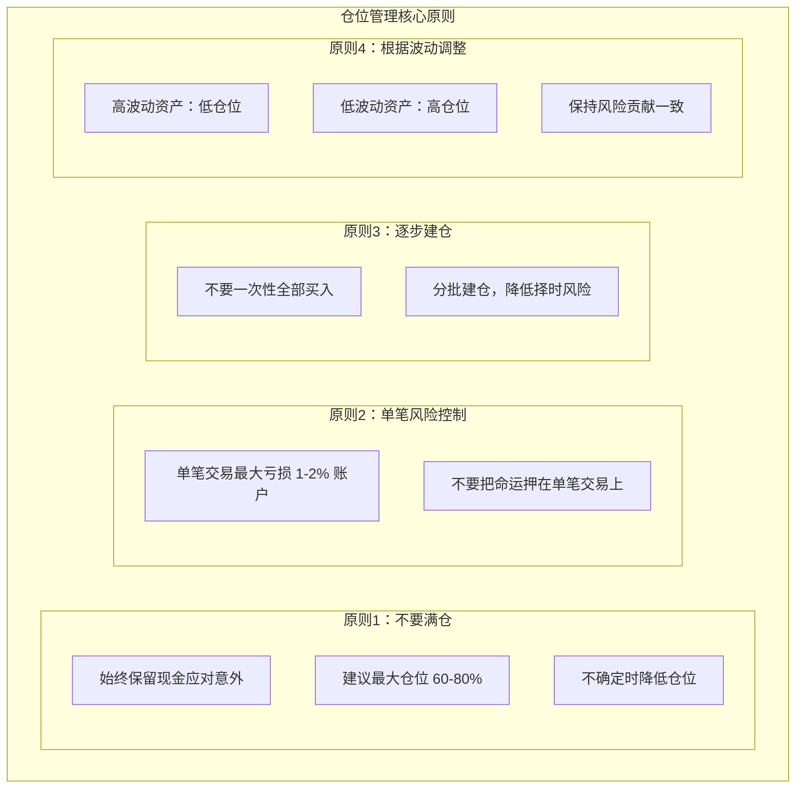
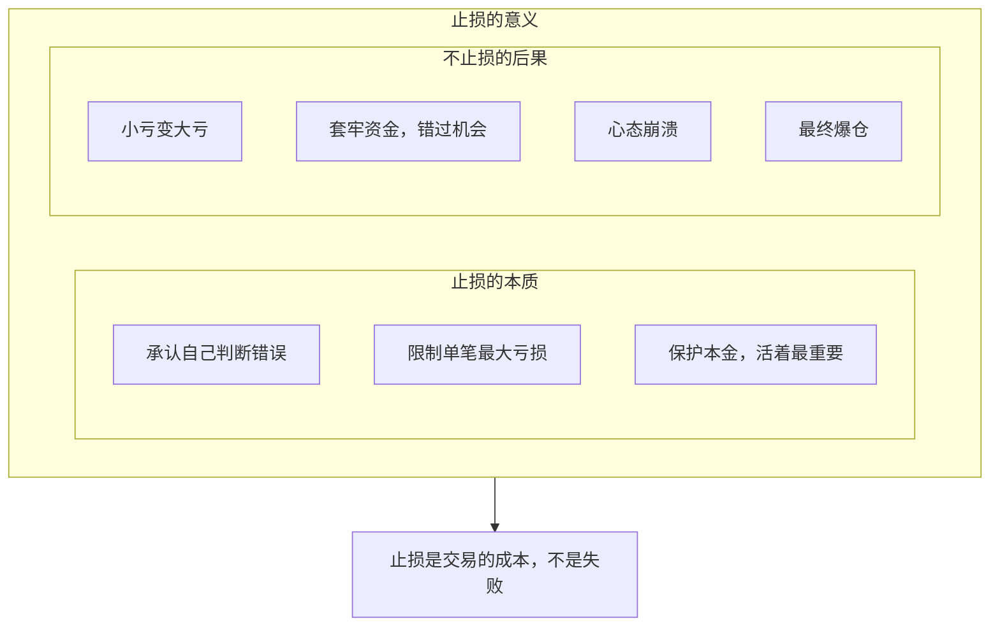
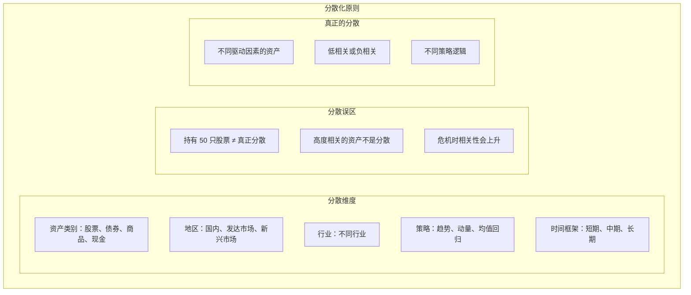
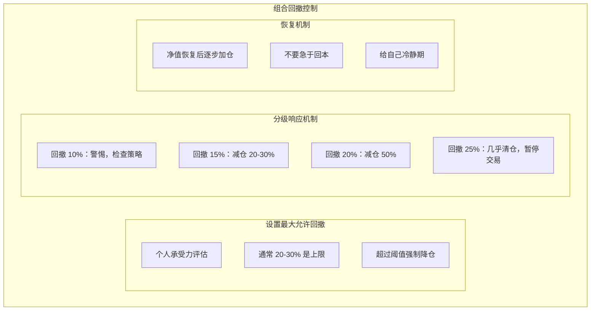
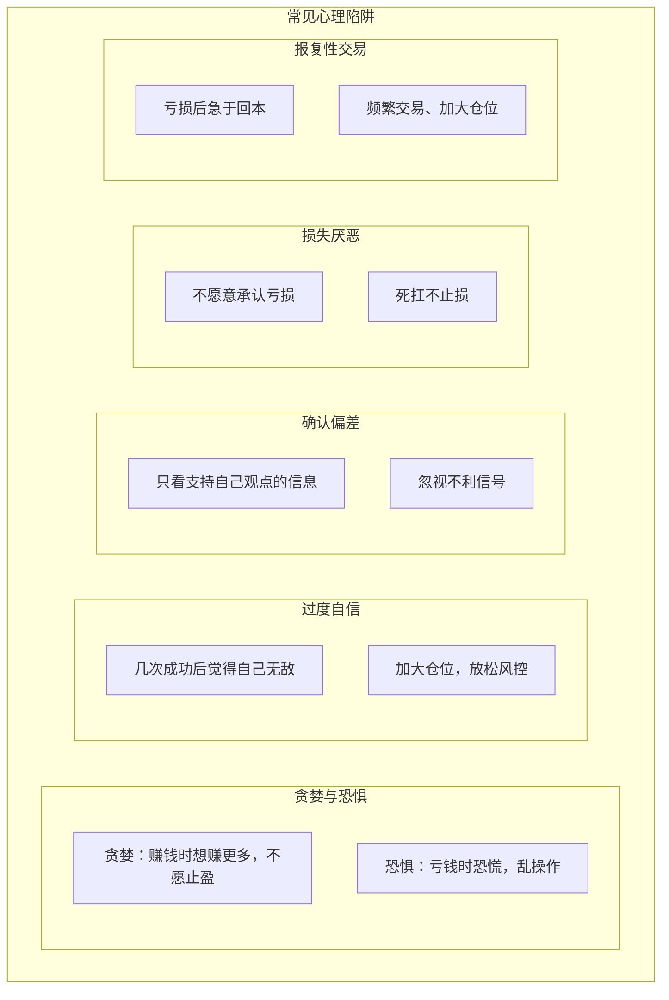
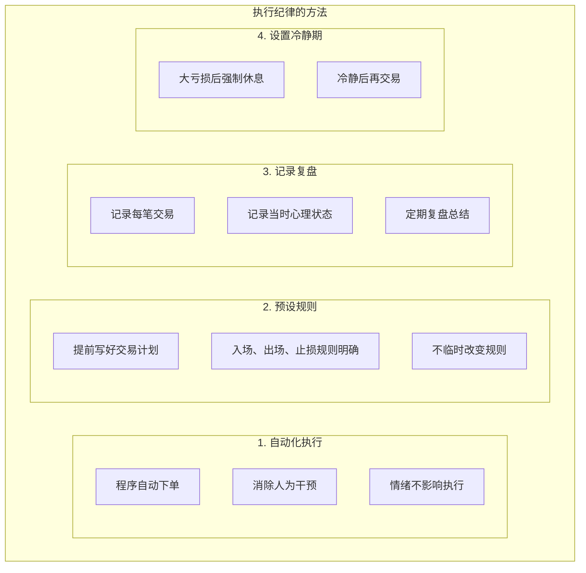
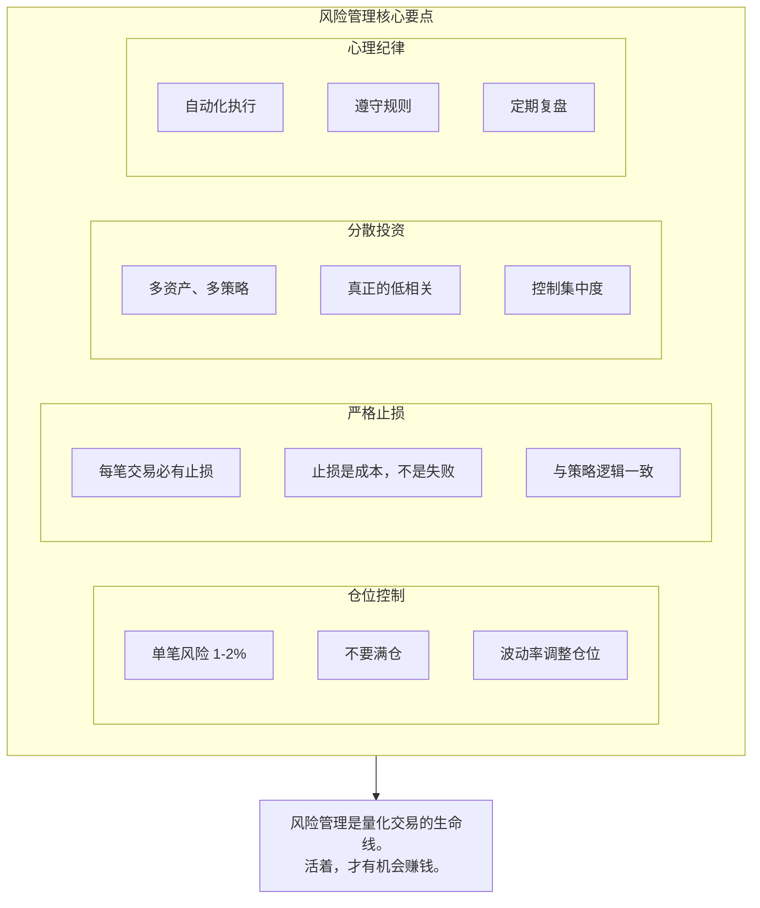

+++
title = "量化交易风险管理与资金管理"
date = 2025-01-15
weight = 6000
description = "个人量化交易的风险管理核心：仓位控制、止损策略、资金管理、心理纪律"
[taxonomies]
tags = ["quant", "trading", "risk-management", "money-management", "psychology"]
+++

## 概述

在量化交易中，**风险管理比策略更重要**。很多失败的交易者不是因为策略不好，而是因为风险管理失败。本文系统介绍个人量化交易的风险管理体系。

---

## 一、风险管理的重要性

### 1.1 为什么风险第一

**风险管理的残酷数学**：

亏损后需要多少收益才能回本？

| 亏损 | 需要收益才能回本 |
|------|-----------------|
| -10% | +11% |
| -20% | +25% |
| -30% | +43% |
| -50% | +100% |
| -70% | +233% |
| -90% | +900% |

**结论**：大亏损很难恢复，必须控制回撤

### 1.2 风险管理层次



---

## 二、仓位管理

### 2.1 仓位管理原则



### 2.2 仓位计算方法

```
常用仓位计算公式：

固定金额法：
仓位 = 固定金额 / 股价

固定比例法：
仓位 = 账户总值 × 固定比例 / 股价

波动率调整法（推荐）：
仓位 = (账户总值 × 目标风险) / (ATR × 乘数)

示例：
• 账户：100 万
• 目标风险：每笔 1%（1万）
• 某股票 ATR：2 元
• 仓位 = 10000 / 2 = 5000 股

Kelly 公式：
f = (p × b - q) / b
其中：p=胜率, q=1-p, b=盈亏比
实践中使用半 Kelly：f/2
```

### 2.3 仓位管理示例

```python
def calculate_position(account_value, risk_per_trade, entry_price, stop_loss):
    """
    计算基于风险的仓位
    
    account_value: 账户总值
    risk_per_trade: 单笔风险比例（如 0.01 = 1%）
    entry_price: 入场价格
    stop_loss: 止损价格
    """
    risk_amount = account_value * risk_per_trade
    price_risk = abs(entry_price - stop_loss)
    shares = risk_amount / price_risk
    return int(shares)

# 示例
account = 1000000  # 100万
risk = 0.01        # 1% 风险
entry = 50         # 入场价 50
stop = 47          # 止损价 47

shares = calculate_position(account, risk, entry, stop)
# 结果：10000 / 3 = 3333 股
```

---

## 三、止损策略

### 3.1 为什么必须止损



### 3.2 止损方法

**止损类型及选择**：

| 止损类型 | 说明 |
|---------|------|
| 固定百分比 | 亏损 X% 止损，简单但不考虑波动 |
| ATR 止损 | N 倍 ATR，自适应波动率 |
| 技术位止损 | 跌破支撑位/均线止损 |
| 时间止损 | 持仓 N 天未盈利则退出 |
| 信号止损 | 策略信号逆转时止损 |
| 跟踪止损 | 随价格移动，锁定利润 |

**选择建议**：
- 趋势策略：ATR 止损或跟踪止损
- 均值回归：固定比例 + 时间止损
- 最好与策略逻辑一致

### 3.3 跟踪止损

**跟踪止损实现**：

**原理**：
- 随价格上涨移动止损点
- 只向有利方向移动，不回撤
- 锁定已获利润

**示例**：
- 买入价：100，初始止损：97（3%）
- 价格涨到 110 → 止损移到 106.7
- 价格涨到 120 → 止损移到 116.4
- 价格跌到 116 → 触发止损，保住利润

**Python 示例**：
```python
def trailing_stop(prices, trailing_pct=0.03):
    highest = prices[0]
    stop_level = highest * (1 - trailing_pct)
    
    for price in prices:
        if price > highest:
            highest = price
            stop_level = highest * (1 - trailing_pct)
        if price < stop_level:
            return "止损触发"
    return "未触发"
```

---

## 四、组合风险管理

### 4.1 分散化



### 4.2 回撤控制



---

## 五、心理与纪律

### 5.1 交易心理挑战



### 5.2 纪律执行



### 5.3 量化的心理优势

**量化帮助克服心理弱点**：

| 主观交易问题 | 量化解决方案 |
|-------------|-------------|
| 情绪决策 | 规则化，程序执行 |
| 犹豫不决 | 信号明确，无歧义 |
| 频繁改变 | 回测验证，坚持执行 |
| 过度交易 | 控制交易频率 |
| 不愿止损 | 自动止损 |
| 主观偏见 | 数据驱动 |

**量化的本质**：用规则和纪律替代人性弱点

---

## 六、风险管理检查清单

```
交易前检查：

□ 单笔风险 < 账户 1-2%
□ 总仓位在合理范围
□ 止损点已设定
□ 策略信号明确
□ 不是报复性交易
□ 情绪稳定

交易中检查：
□ 止损是否触发
□ 是否需要跟踪止损
□ 策略是否仍然有效
□ 系统运行是否正常

交易后检查：
□ 记录交易详情
□ 分析盈亏原因
□ 检查是否遵守规则
□ 更新策略表现统计

定期检查（月度）：
□ 回撤是否在容忍范围
□ 策略是否衰减
□ 组合相关性是否变化
□ 风险参数是否需要调整
```

---

## 七、总结



---

## 相关文章

- [上一篇：05 - 个人量化常用策略详解](@/articles/quant/quant-05-个人量化常用策略详解.md)
- [下一篇：07 - 机器学习量化实战](@/articles/quant/quant-07-机器学习量化实战.md)
