+++
title = "机器学习量化实战"
date = 2025-01-15
weight = 7000
description = "机器学习在量化交易中的应用：特征工程、模型选择、过拟合控制、ML策略实战"
[taxonomies]
tags = ["quant", "machine-learning", "feature-engineering", "xgboost", "deep-learning"]
+++

## 概述

机器学习（ML）为量化交易带来了新的可能性，但也带来了新的陷阱。本文系统介绍 ML 在量化中的应用，重点是**避免过拟合**和**实战可行性**。

---

## 一、ML 量化的定位

### 1.1 ML vs 传统量化

**传统量化 vs 机器学习量化**：

| 传统量化 | 机器学习量化 |
|---------|-------------|
| 规则明确 | 规则由模型学习 |
| 可解释性强 | 黑箱/灰箱 |
| 参数少 | 参数多 |
| 经济逻辑驱动 | 数据驱动 |
| 过拟合风险较低 | 过拟合风险高 |

**适用场景**：
- 传统：趋势跟踪、动量、均值回归
- ML：复杂模式识别、多因子、另类数据

### 1.2 ML 量化的适用场景

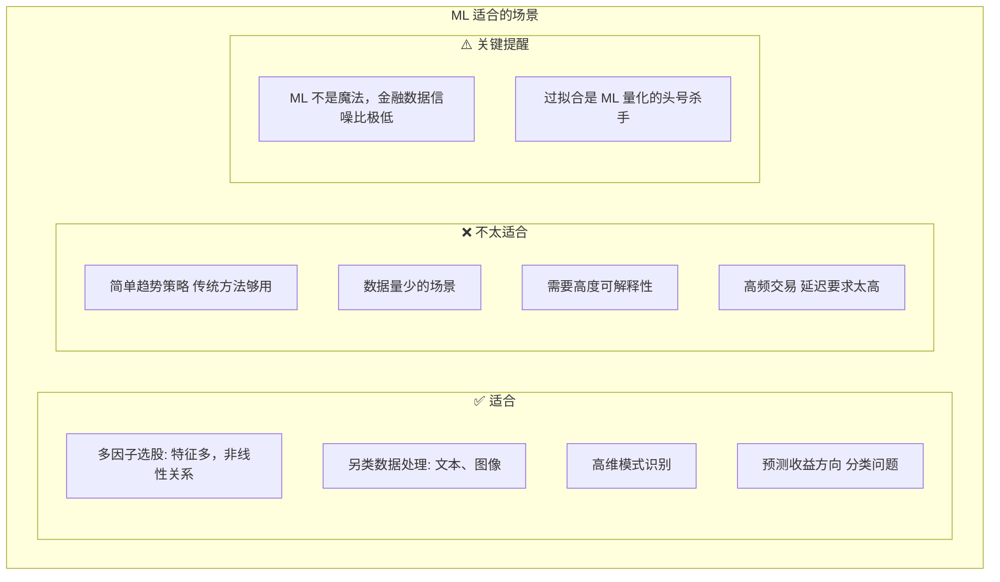

---

## 二、特征工程

### 2.1 特征工程的重要性

**ML 量化成功公式**：

> 特征工程 > 模型选择 > 参数调优
>
> 好的特征 + 简单模型 >> 差的特征 + 复杂模型

**特征工程决定了**：
- 能捕捉到什么信息
- 模型的上限
- 策略的可解释性

### 2.2 常用特征类型

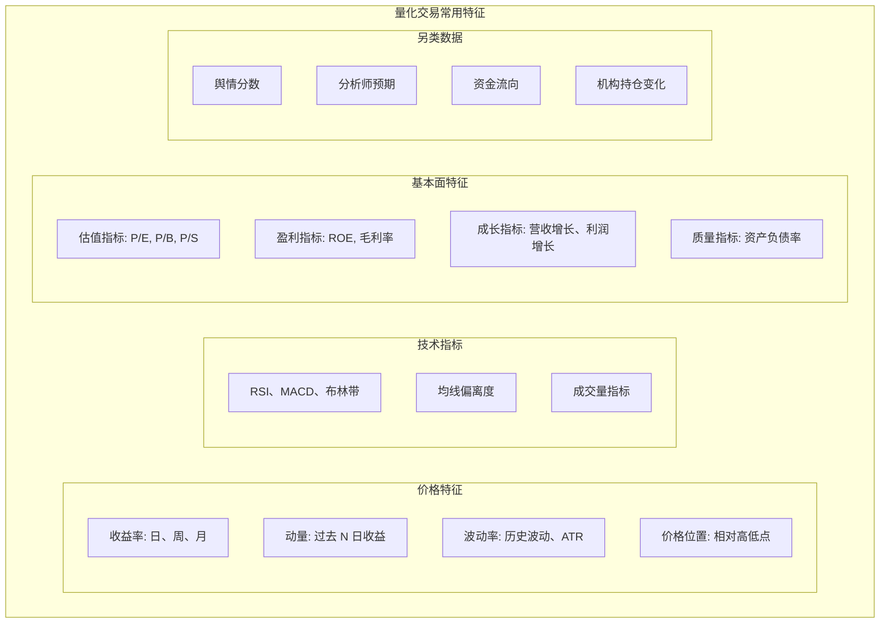

### 2.3 特征工程技巧

```python
import pandas as pd
import numpy as np

def create_features(df):
    """
    创建量化交易常用特征
    df 需要有 open, high, low, close, volume 列
    """
    # 收益率
    df['ret_1d'] = df['close'].pct_change(1)
    df['ret_5d'] = df['close'].pct_change(5)
    df['ret_20d'] = df['close'].pct_change(20)
    
    # 动量
    df['mom_12m'] = df['close'].pct_change(252)
    df['mom_6m'] = df['close'].pct_change(126)
    df['mom_1m'] = df['close'].pct_change(21)
    
    # 波动率
    df['volatility_20d'] = df['ret_1d'].rolling(20).std() * np.sqrt(252)
    
    # 均线偏离
    df['ma_20'] = df['close'].rolling(20).mean()
    df['ma_deviation'] = (df['close'] - df['ma_20']) / df['ma_20']
    
    # RSI
    delta = df['close'].diff()
    gain = delta.where(delta > 0, 0).rolling(14).mean()
    loss = (-delta.where(delta < 0, 0)).rolling(14).mean()
    df['rsi'] = 100 - (100 / (1 + gain / loss))
    
    # 成交量变化
    df['volume_ratio'] = df['volume'] / df['volume'].rolling(20).mean()
    
    # 价格位置
    df['high_52w'] = df['high'].rolling(252).max()
    df['low_52w'] = df['low'].rolling(252).min()
    df['price_position'] = (df['close'] - df['low_52w']) / (df['high_52w'] - df['low_52w'])
    
    return df
```

### 2.4 特征处理

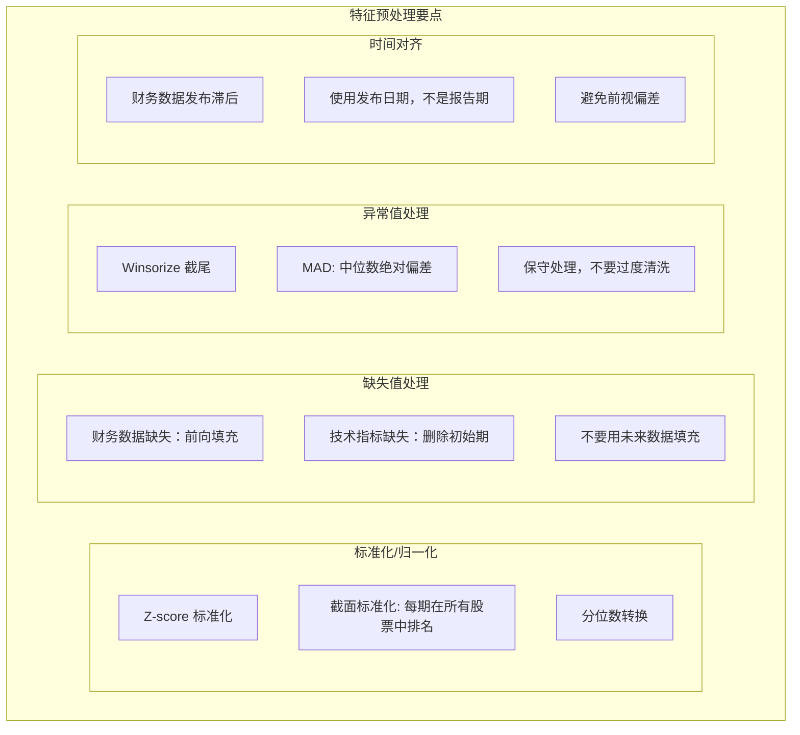

---

## 三、模型选择

### 3.1 常用模型对比

**量化交易常用 ML 模型**：

| 模型 | 推荐度 | 特点 |
|------|-------|------|
| 线性回归 | ⭐⭐⭐ | 简单可解释，基准模型 |
| Ridge/Lasso | ⭐⭐⭐⭐ | 正则化，减少过拟合 |
| 随机森林 | ⭐⭐⭐⭐ | 稳健，不易过拟合 |
| XGBoost | ⭐⭐⭐⭐⭐ | 性能好，实践中最常用 |
| LightGBM | ⭐⭐⭐⭐⭐ | 速度快，大数据友好 |
| 神经网络 | ⭐⭐⭐ | 需要大量数据，易过拟合 |
| LSTM | ⭐⭐ | 时序数据，但效果存疑 |

**推荐起步**：XGBoost / LightGBM

### 3.2 XGBoost 实战

```python
import xgboost as xgb
from sklearn.model_selection import TimeSeriesSplit

def train_xgboost_model(X, y, n_splits=5):
    """
    时间序列交叉验证训练 XGBoost
    """
    # 时间序列分割（不能随机打乱）
    tscv = TimeSeriesSplit(n_splits=n_splits)
    
    # 保守的参数设置（防止过拟合）
    params = {
        'objective': 'reg:squarederror',  # 回归
        'max_depth': 3,          # 浅树，减少过拟合
        'learning_rate': 0.01,   # 小学习率
        'n_estimators': 100,     # 适中的树数量
        'subsample': 0.8,        # 行采样
        'colsample_bytree': 0.8, # 列采样
        'reg_alpha': 0.1,        # L1 正则
        'reg_lambda': 1.0,       # L2 正则
        'random_state': 42
    }
    
    scores = []
    models = []
    
    for train_idx, val_idx in tscv.split(X):
        X_train, X_val = X.iloc[train_idx], X.iloc[val_idx]
        y_train, y_val = y.iloc[train_idx], y.iloc[val_idx]
        
        model = xgb.XGBRegressor(**params)
        model.fit(X_train, y_train,
                  eval_set=[(X_val, y_val)],
                  early_stopping_rounds=10,
                  verbose=False)
        
        score = model.score(X_val, y_val)
        scores.append(score)
        models.append(model)
    
    print(f"CV Scores: {scores}")
    print(f"Mean Score: {np.mean(scores):.4f}")
    
    return models
```

### 3.3 特征重要性分析

```python
def analyze_feature_importance(model, feature_names):
    """
    分析特征重要性
    """
    importance = model.feature_importances_
    
    # 排序
    indices = np.argsort(importance)[::-1]
    
    print("Feature Importance:")
    for i, idx in enumerate(indices[:10]):  # Top 10
        print(f"{i+1}. {feature_names[idx]}: {importance[idx]:.4f}")
    
    # 可视化
    import matplotlib.pyplot as plt
    plt.figure(figsize=(10, 6))
    plt.bar(range(len(importance)), importance[indices])
    plt.xticks(range(len(importance)), 
               [feature_names[i] for i in indices], 
               rotation=45)
    plt.title("Feature Importance")
    plt.tight_layout()
    plt.show()
```

---

## 四、过拟合控制（最重要）

### 4.1 金融数据的特殊性

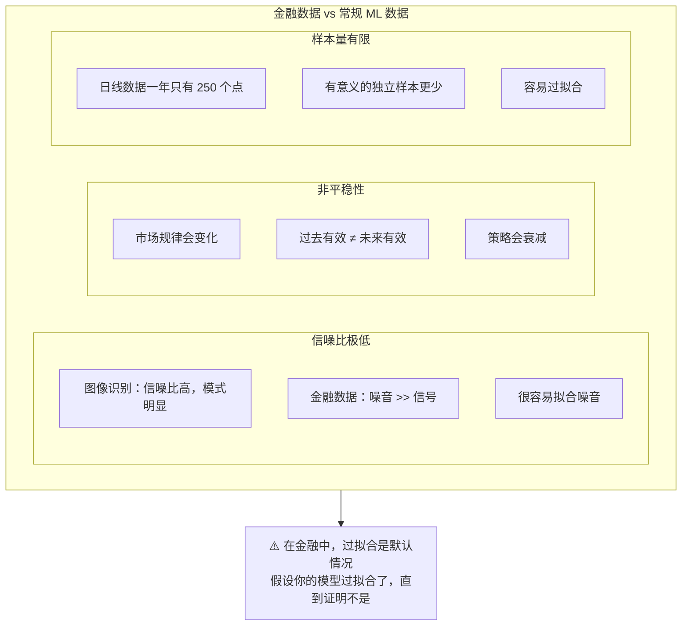

### 4.2 防止过拟合的方法

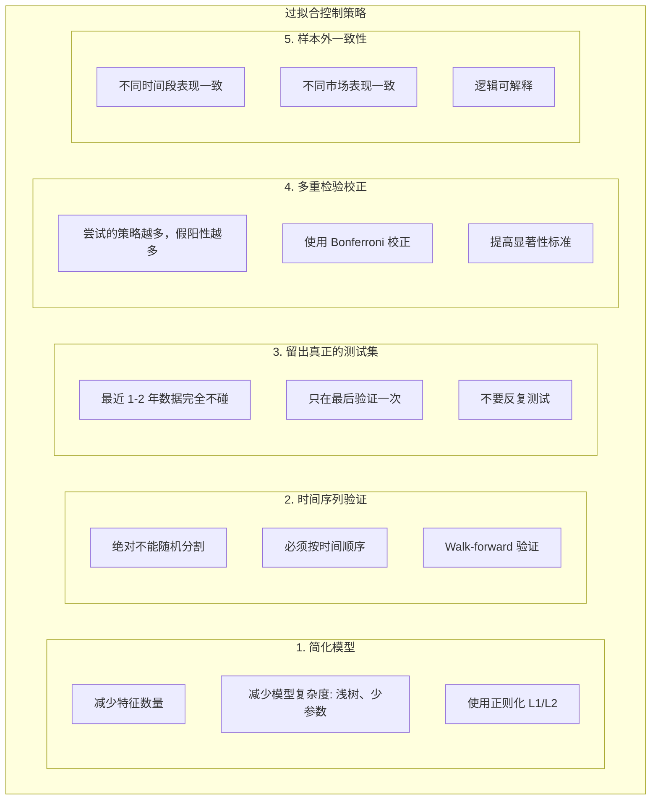

### 4.3 Walk-Forward 验证

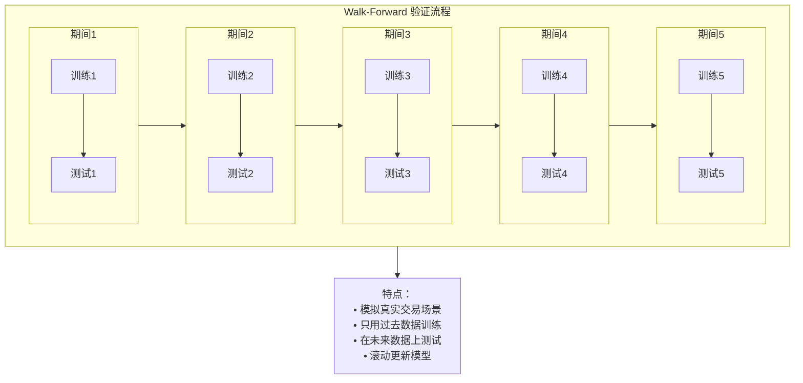

**Python 实现：**

```python
def walk_forward_validation(X, y, train_size=252*3, test_size=252):
    """
    Walk-forward 验证
    """
    results = []
    
    for i in range(0, len(X) - train_size - test_size, test_size):
        # 训练集
        train_start = i
        train_end = i + train_size
        
        # 测试集
        test_start = train_end
        test_end = test_start + test_size
        
        X_train = X.iloc[train_start:train_end]
        y_train = y.iloc[train_start:train_end]
        X_test = X.iloc[test_start:test_end]
        y_test = y.iloc[test_start:test_end]
        
        # 训练模型
        model = train_model(X_train, y_train)
        
        # 预测
        y_pred = model.predict(X_test)
        
        # 记录结果
        results.append({
            'period': f"{X.index[test_start]} to {X.index[test_end-1]}",
            'predictions': y_pred,
            'actual': y_test
        })
    
    return results
```

---

## 五、ML 策略实战

### 5.1 预测目标选择

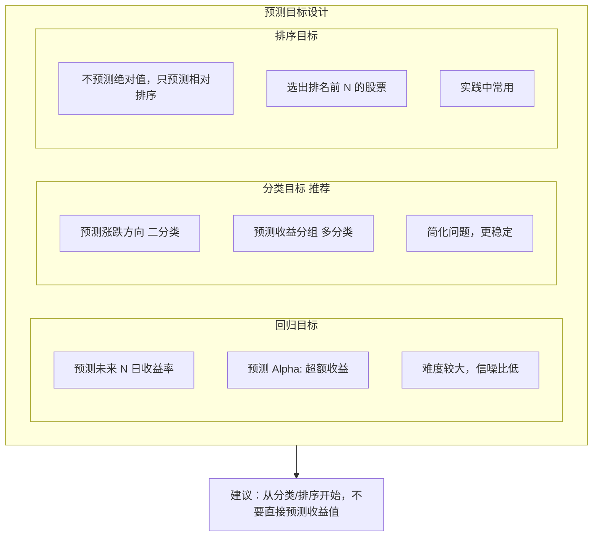

### 5.2 完整策略示例

```python
class MLStrategy:
    """
    机器学习量化策略示例
    """
    def __init__(self, lookback=20, holding_period=5, top_n=10):
        self.lookback = lookback
        self.holding_period = holding_period
        self.top_n = top_n
        self.model = None
    
    def prepare_data(self, price_data, fundamental_data):
        """
        准备特征和标签
        """
        # 创建特征
        features = self.create_features(price_data, fundamental_data)
        
        # 创建标签：未来 N 日收益排名
        future_returns = price_data['close'].pct_change(self.holding_period).shift(-self.holding_period)
        labels = future_returns.groupby(level='date').rank(pct=True)
        
        # 对齐和清洗
        data = features.join(labels.rename('label')).dropna()
        
        return data
    
    def train(self, data):
        """
        训练模型
        """
        X = data.drop('label', axis=1)
        y = data['label']
        
        # Walk-forward 训练
        self.model = self.walk_forward_train(X, y)
    
    def predict(self, current_features):
        """
        生成交易信号
        """
        # 预测得分
        scores = self.model.predict(current_features)
        
        # 选择得分最高的 N 只
        rankings = pd.Series(scores, index=current_features.index)
        top_stocks = rankings.nlargest(self.top_n).index
        
        # 生成持仓（等权重）
        weights = pd.Series(1.0/self.top_n, index=top_stocks)
        
        return weights
    
    def backtest(self, data):
        """
        回测
        """
        results = []
        
        # 滚动预测
        for date in data.index.get_level_values('date').unique():
            if date < train_end_date:
                continue
            
            # 获取当日特征
            current_features = data.loc[date].drop('label', axis=1)
            
            # 预测并生成持仓
            weights = self.predict(current_features)
            
            # 记录
            results.append({'date': date, 'weights': weights})
        
        return self.calculate_returns(results)
```

### 5.3 评估 ML 策略

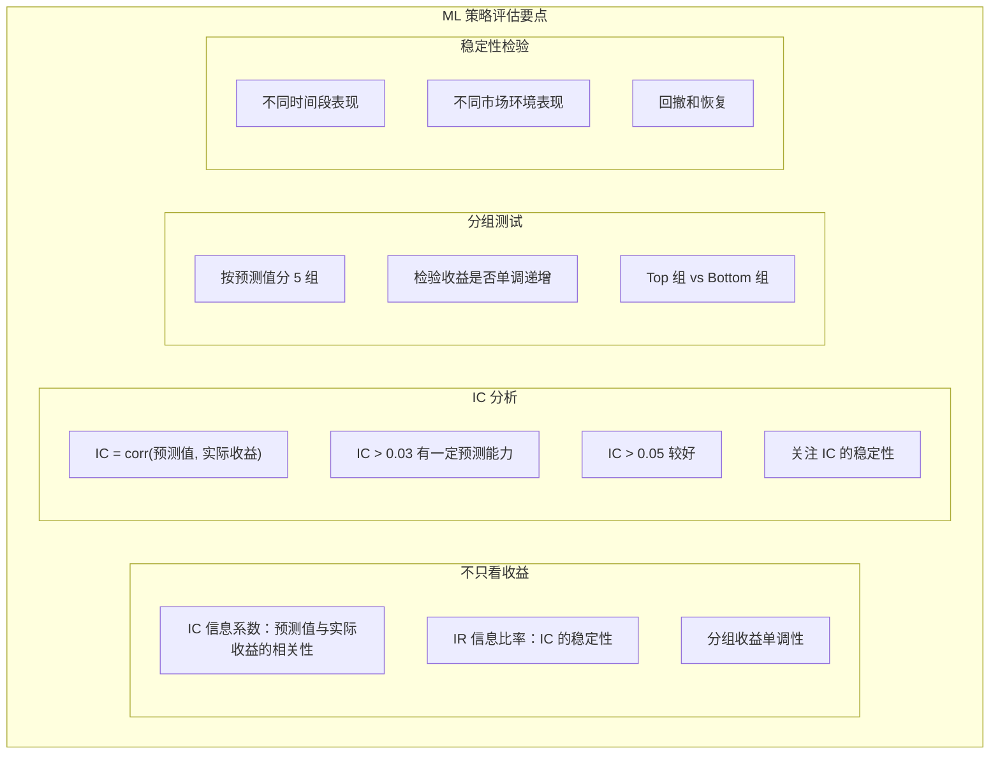

---

## 六、深度学习在量化中的应用

### 6.1 深度学习的局限

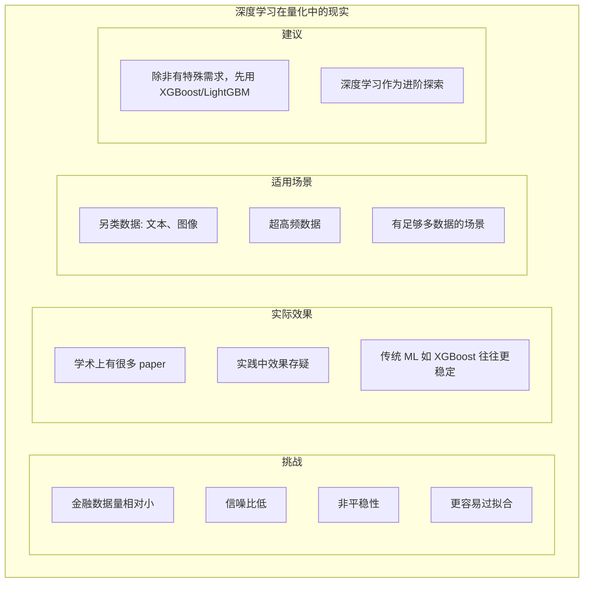

### 6.2 如果使用深度学习

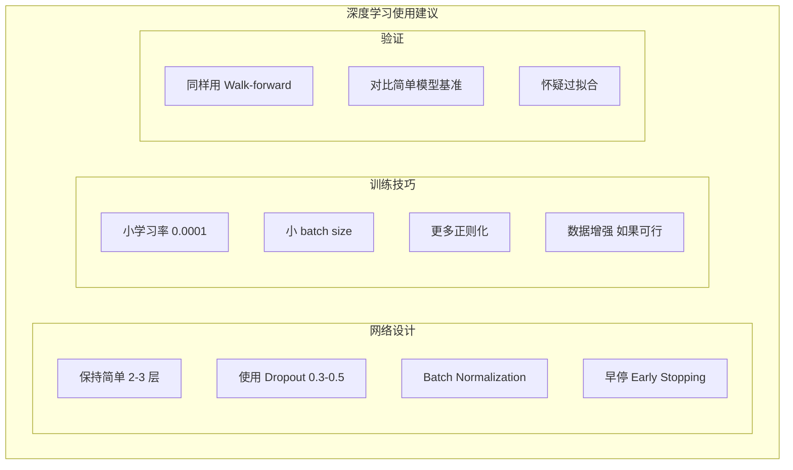

---

## 七、总结

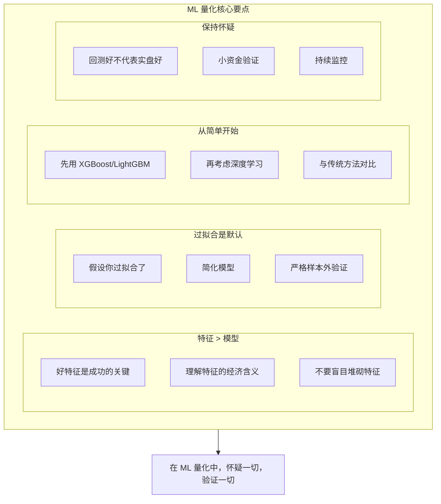

---

## 相关文章

- [上一篇：06 - 量化交易风险管理与资金管理](@/articles/quant/quant-06-量化交易风险管理与资金管理.md)
- [下一篇：08 - 回测系统设计与实现](@/articles/quant/quant-08-回测系统设计与实现.md)
