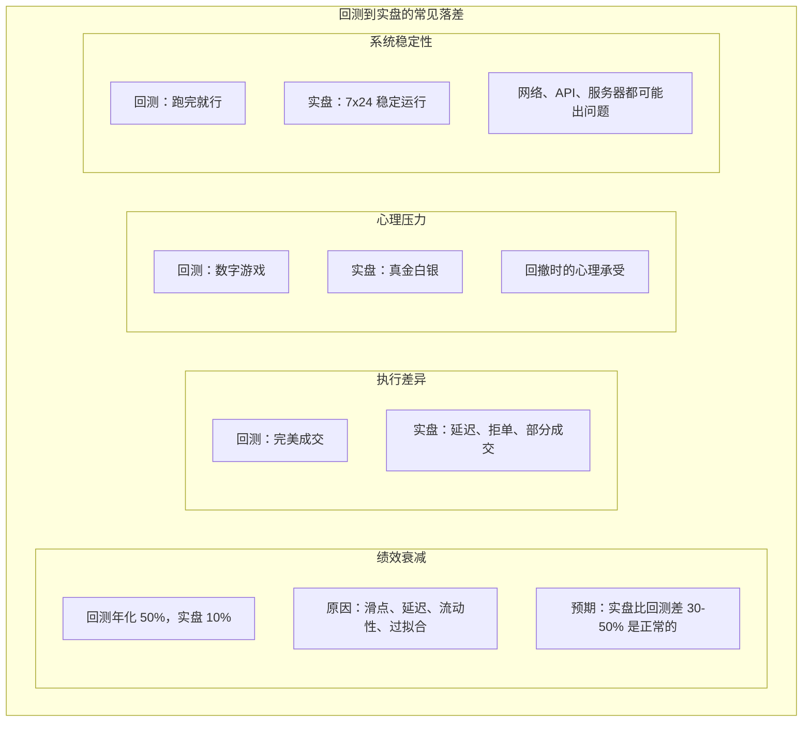
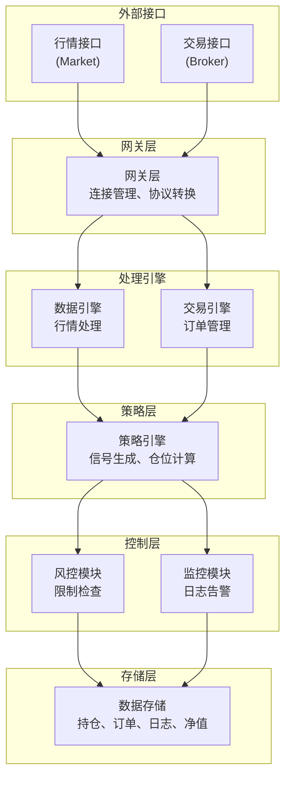
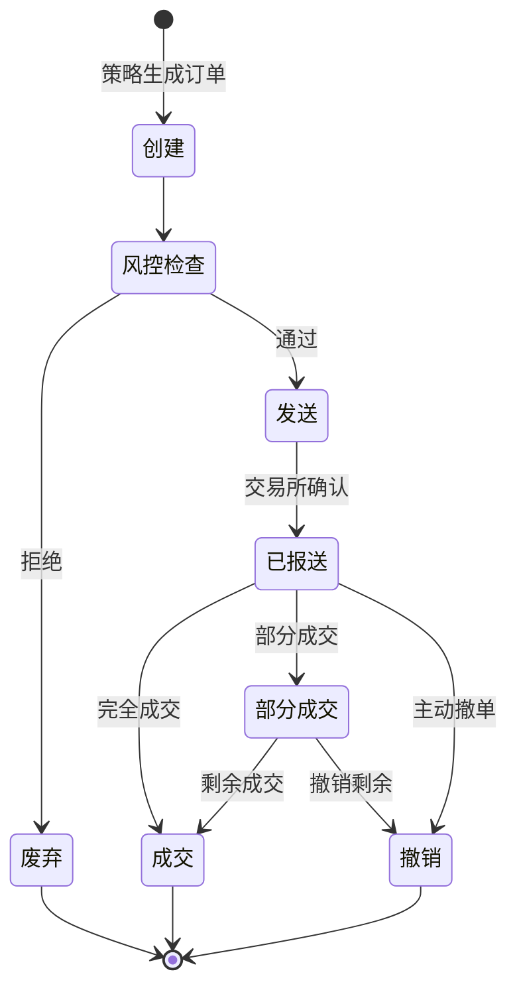
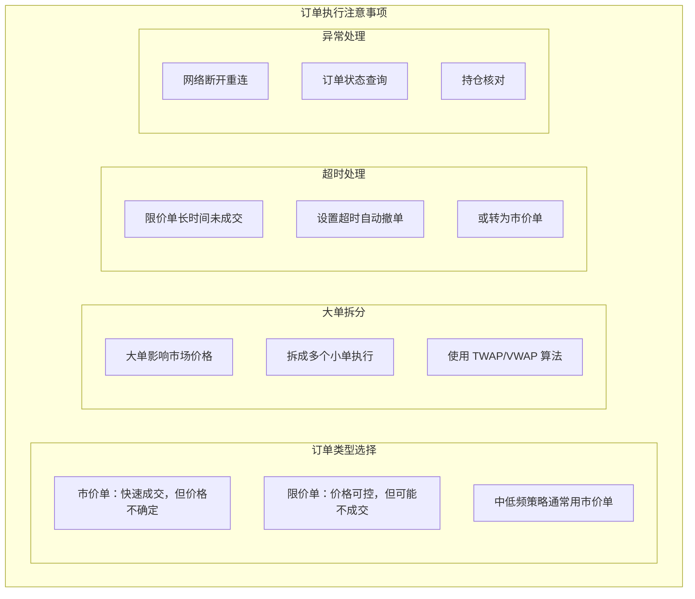
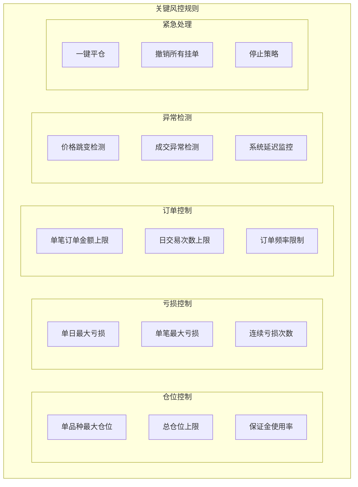
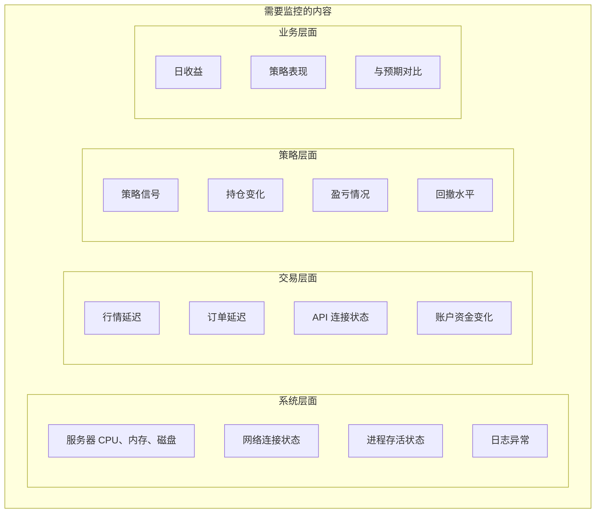
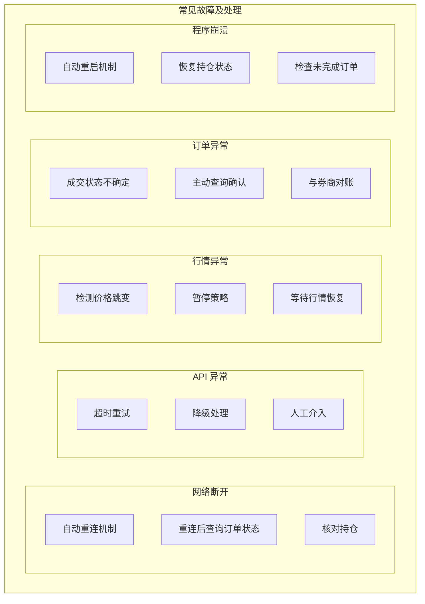
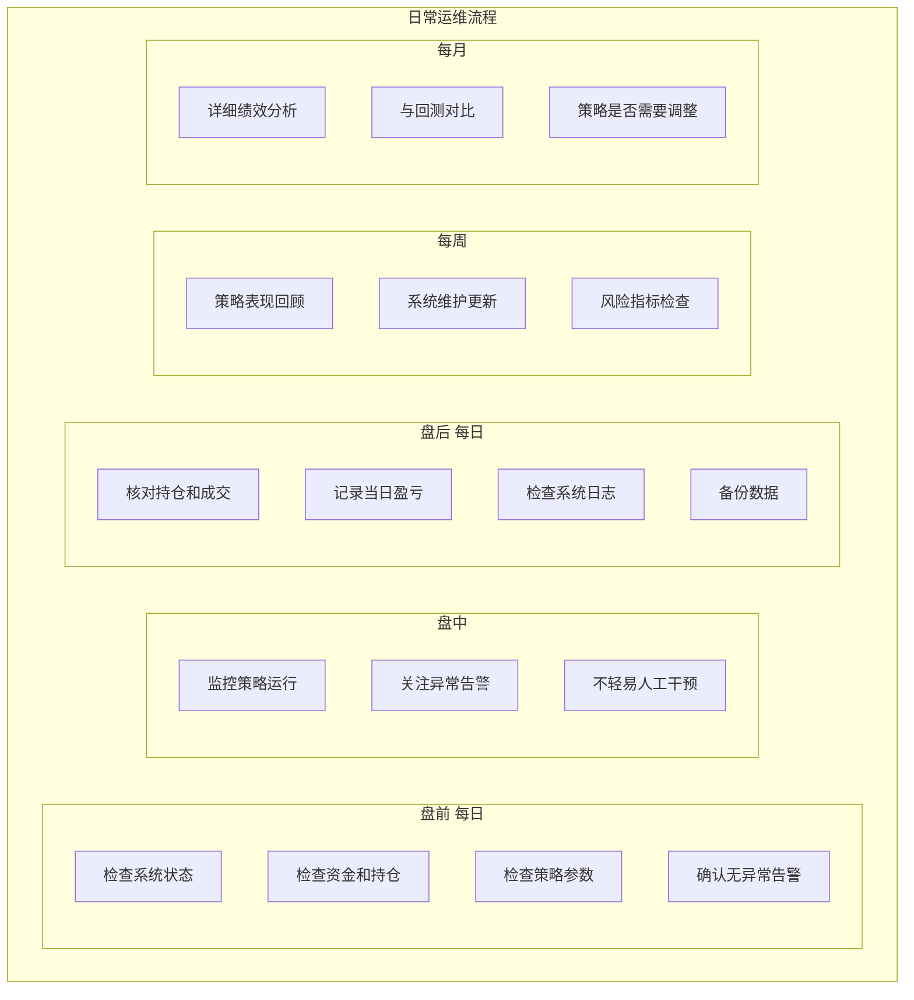
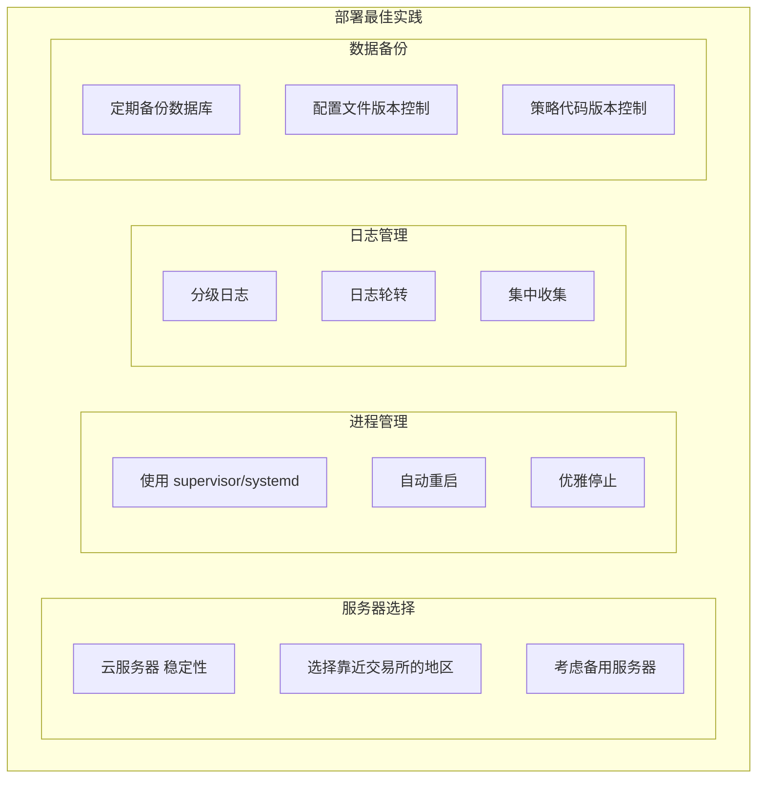
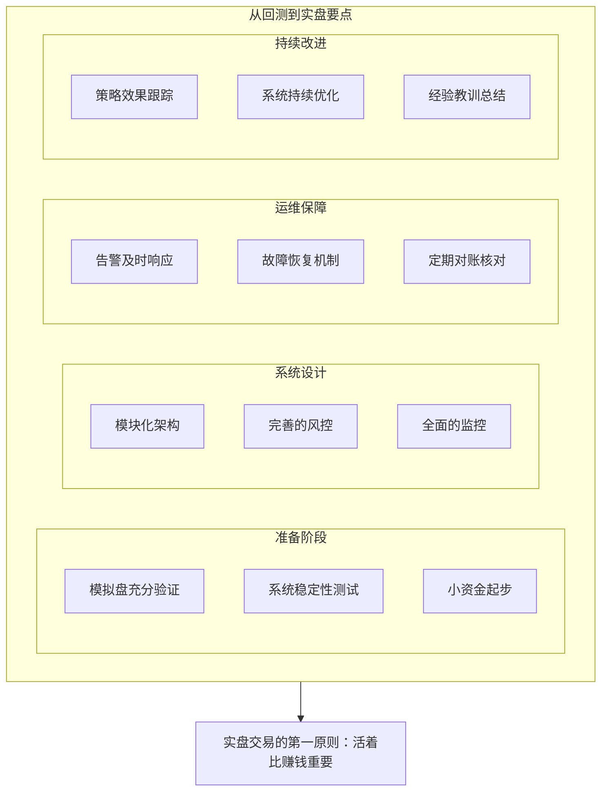

+++
title = "09 - 从回测到实盘"
date = 2025-01-15
description = "量化交易从回测到实盘的完整路径：实盘系统架构、订单管理、监控告警、故障处理"
[taxonomies]
tags = ["quant", "live-trading", "system-architecture", "monitoring", "production"]
+++

## 概述

回测只是量化交易的第一步。从回测到实盘是一个巨大的跨越，涉及系统架构、风险控制、运维监控等多个方面。本文详细介绍这"最后一公里"的关键要点。

---

## 一、回测 vs 实盘的差距

### 1.1 常见问题



### 1.2 上线前检查清单

**实盘上线前检查：**

**策略验证**
- [ ] 样本外测试通过
- [ ] Walk-forward 验证
- [ ] 不同市场环境测试
- [ ] 理解策略为什么有效

**模拟交易**
- [ ] 模拟盘运行 3-6 个月
- [ ] 结果与回测基本一致
- [ ] 系统稳定无重大 bug

**系统准备**
- [ ] 服务器稳定
- [ ] 监控告警完善
- [ ] 故障恢复方案
- [ ] 日志记录完整

**资金准备**
- [ ] 使用可承受亏损的资金
- [ ] 从小资金开始
- [ ] 设定最大亏损上限

**心理准备**
- [ ] 接受会有亏损
- [ ] 不会因回撤恐慌
- [ ] 遵守既定规则

---

## 二、实盘系统架构

### 2.1 整体架构



### 2.2 模块职责

**核心模块职责：**

| 模块 | 职责 |
|------|------|
| 网关层 | 管理与交易所/券商的连接；协议转换、心跳维护 |
| 数据引擎 | 接收和处理行情数据；生成 K 线、计算指标 |
| 策略引擎 | 执行策略逻辑；生成交易信号 |
| 交易引擎 | 订单管理、状态跟踪；成交处理 |
| 风控模块 | 下单前检查；仓位限制、风险控制 |
| 监控模块 | 系统状态监控；告警通知 |

---

## 三、订单管理

### 3.1 订单生命周期



### 3.2 订单管理器实现

```python
from enum import Enum
from dataclasses import dataclass
from datetime import datetime
import uuid

class OrderStatus(Enum):
    CREATED = 'created'
    SUBMITTED = 'submitted'
    ACCEPTED = 'accepted'
    PARTIALLY_FILLED = 'partially_filled'
    FILLED = 'filled'
    CANCELLED = 'cancelled'
    REJECTED = 'rejected'

@dataclass
class Order:
    id: str
    symbol: str
    direction: str  # BUY or SELL
    quantity: int
    order_type: str  # MARKET, LIMIT
    price: float = None
    status: OrderStatus = OrderStatus.CREATED
    filled_quantity: int = 0
    filled_price: float = 0
    created_time: datetime = None
    updated_time: datetime = None

class OrderManager:
    """订单管理器"""
    
    def __init__(self, broker_gateway, risk_manager):
        self.broker = broker_gateway
        self.risk_manager = risk_manager
        self.orders = {}  # order_id -> Order
        self.pending_orders = {}  # 待成交订单
        
    def create_order(self, symbol, direction, quantity, order_type='MARKET', price=None):
        """创建订单"""
        order = Order(
            id=str(uuid.uuid4()),
            symbol=symbol,
            direction=direction,
            quantity=quantity,
            order_type=order_type,
            price=price,
            created_time=datetime.now()
        )
        self.orders[order.id] = order
        return order
    
    def submit_order(self, order):
        """提交订单"""
        # 1. 风控检查
        passed, reason = self.risk_manager.check_order(order)
        if not passed:
            order.status = OrderStatus.REJECTED
            self._log(f"Order rejected: {reason}")
            return False
        
        # 2. 发送到交易所
        try:
            self.broker.send_order(order)
            order.status = OrderStatus.SUBMITTED
            self.pending_orders[order.id] = order
            self._log(f"Order submitted: {order.id}")
            return True
        except Exception as e:
            order.status = OrderStatus.REJECTED
            self._log(f"Order send failed: {e}")
            return False
    
    def on_order_update(self, order_id, status, filled_qty, filled_price):
        """处理订单状态更新"""
        order = self.orders.get(order_id)
        if not order:
            self._log(f"Unknown order: {order_id}")
            return
        
        order.status = status
        order.filled_quantity = filled_qty
        order.filled_price = filled_price
        order.updated_time = datetime.now()
        
        if status in [OrderStatus.FILLED, OrderStatus.CANCELLED, OrderStatus.REJECTED]:
            self.pending_orders.pop(order_id, None)
        
        self._log(f"Order {order_id} updated: {status}")
    
    def cancel_order(self, order_id):
        """撤销订单"""
        order = self.pending_orders.get(order_id)
        if order:
            self.broker.cancel_order(order_id)
            self._log(f"Cancel request sent: {order_id}")
    
    def cancel_all(self):
        """撤销所有挂单"""
        for order_id in list(self.pending_orders.keys()):
            self.cancel_order(order_id)
    
    def _log(self, message):
        print(f"[OrderManager] {datetime.now()}: {message}")
```

### 3.3 订单执行策略



---

## 四、风险控制

### 4.1 风控模块设计

```python
class RiskManager:
    """风控管理器"""
    
    def __init__(self, config):
        self.config = config
        self.daily_trades = 0
        self.daily_pnl = 0
        
    def check_order(self, order):
        """
        订单风控检查
        返回 (是否通过, 原因)
        """
        checks = [
            self._check_position_limit,
            self._check_order_size,
            self._check_daily_loss,
            self._check_trade_frequency,
            self._check_price_deviation,
        ]
        
        for check in checks:
            passed, reason = check(order)
            if not passed:
                return False, reason
        
        return True, "passed"
    
    def _check_position_limit(self, order):
        """检查仓位限制"""
        max_position = self.config.get('max_position_per_symbol', 100000)
        current = self._get_current_position(order.symbol)
        
        if order.direction == 'BUY':
            new_position = current + order.quantity
        else:
            new_position = current - order.quantity
        
        if abs(new_position) > max_position:
            return False, f"Exceeds position limit: {max_position}"
        return True, ""
    
    def _check_order_size(self, order):
        """检查单笔订单大小"""
        max_order = self.config.get('max_order_size', 10000)
        if order.quantity > max_order:
            return False, f"Order size too large: {order.quantity} > {max_order}"
        return True, ""
    
    def _check_daily_loss(self, order):
        """检查日亏损限制"""
        max_loss = self.config.get('max_daily_loss', -50000)
        if self.daily_pnl < max_loss:
            return False, f"Daily loss limit reached: {self.daily_pnl}"
        return True, ""
    
    def _check_trade_frequency(self, order):
        """检查交易频率"""
        max_trades = self.config.get('max_daily_trades', 100)
        if self.daily_trades >= max_trades:
            return False, f"Daily trade limit reached: {self.daily_trades}"
        return True, ""
    
    def _check_price_deviation(self, order):
        """检查价格偏离（限价单）"""
        if order.order_type == 'LIMIT':
            current_price = self._get_current_price(order.symbol)
            deviation = abs(order.price - current_price) / current_price
            max_deviation = self.config.get('max_price_deviation', 0.05)
            
            if deviation > max_deviation:
                return False, f"Price deviation too large: {deviation:.2%}"
        return True, ""
```

### 4.2 实时风控规则



---

## 五、监控与告警

### 5.1 监控内容



### 5.2 告警实现

```python
import smtplib
from email.mime.text import MIMEText
import requests

class AlertManager:
    """告警管理器"""
    
    def __init__(self, config):
        self.config = config
        self.alert_history = []
        
    def send_alert(self, level, title, message):
        """
        发送告警
        level: INFO, WARNING, ERROR, CRITICAL
        """
        alert = {
            'time': datetime.now(),
            'level': level,
            'title': title,
            'message': message
        }
        self.alert_history.append(alert)
        
        # 根据级别选择通知方式
        if level == 'CRITICAL':
            self._send_sms(title, message)
            self._send_email(title, message)
            self._send_wechat(title, message)
        elif level == 'ERROR':
            self._send_email(title, message)
            self._send_wechat(title, message)
        elif level == 'WARNING':
            self._send_wechat(title, message)
        else:
            self._log(title, message)
    
    def _send_wechat(self, title, message):
        """发送微信通知（使用企业微信机器人）"""
        webhook = self.config.get('wechat_webhook')
        if webhook:
            data = {
                "msgtype": "text",
                "text": {"content": f"[{title}]\n{message}"}
            }
            try:
                requests.post(webhook, json=data, timeout=5)
            except Exception as e:
                print(f"Wechat alert failed: {e}")
    
    def _send_email(self, title, message):
        """发送邮件通知"""
        smtp_config = self.config.get('smtp')
        if smtp_config:
            try:
                msg = MIMEText(message)
                msg['Subject'] = f"[Trading Alert] {title}"
                msg['From'] = smtp_config['from']
                msg['To'] = smtp_config['to']
                
                with smtplib.SMTP(smtp_config['server']) as server:
                    server.send_message(msg)
            except Exception as e:
                print(f"Email alert failed: {e}")
    
    def _send_sms(self, title, message):
        """发送短信通知"""
        # 实现短信发送逻辑
        pass
    
    def _log(self, title, message):
        print(f"[Alert] {title}: {message}")


# 使用示例
alert_manager = AlertManager(config)

# 系统监控中发现问题
if cpu_usage > 90:
    alert_manager.send_alert(
        'WARNING',
        'High CPU Usage',
        f'CPU usage at {cpu_usage}%'
    )

# 交易异常
if daily_loss < -max_daily_loss:
    alert_manager.send_alert(
        'CRITICAL',
        'Daily Loss Limit',
        f'Daily loss {daily_loss} exceeds limit'
    )
```

---

## 六、故障处理

### 6.1 常见故障场景



### 6.2 恢复机制

```python
class RecoveryManager:
    """故障恢复管理器"""
    
    def __init__(self, broker, portfolio, storage):
        self.broker = broker
        self.portfolio = portfolio
        self.storage = storage
        
    def startup_recovery(self):
        """
        启动时恢复
        """
        print("Starting recovery...")
        
        # 1. 从持久化存储加载状态
        saved_state = self.storage.load_state()
        
        # 2. 查询真实持仓
        real_positions = self.broker.get_positions()
        
        # 3. 对比并修正
        self._reconcile_positions(saved_state, real_positions)
        
        # 4. 查询未完成订单
        pending_orders = self.broker.get_open_orders()
        self._handle_pending_orders(pending_orders)
        
        # 5. 更新本地状态
        self.portfolio.sync_from_broker(real_positions)
        
        print("Recovery completed")
    
    def _reconcile_positions(self, saved, real):
        """持仓核对"""
        for symbol, saved_qty in saved.get('positions', {}).items():
            real_qty = real.get(symbol, 0)
            if saved_qty != real_qty:
                print(f"Position mismatch for {symbol}: "
                      f"saved={saved_qty}, real={real_qty}")
                # 以实际为准
    
    def _handle_pending_orders(self, pending_orders):
        """处理未完成订单"""
        for order in pending_orders:
            print(f"Found pending order: {order}")
            # 根据策略决定是撤销还是保留
            # 保守做法：全部撤销
            self.broker.cancel_order(order['id'])
    
    def periodic_reconciliation(self):
        """定期对账"""
        real_positions = self.broker.get_positions()
        local_positions = self.portfolio.get_positions()
        
        for symbol in set(real_positions.keys()) | set(local_positions.keys()):
            real_qty = real_positions.get(symbol, 0)
            local_qty = local_positions.get(symbol, 0)
            
            if real_qty != local_qty:
                alert_manager.send_alert(
                    'ERROR',
                    'Position Mismatch',
                    f'{symbol}: local={local_qty}, broker={real_qty}'
                )
```

---

## 七、实盘运维

### 7.1 日常运维



### 7.2 部署建议



---

## 八、总结



---

## 相关文章

- [上一篇：08 - 回测系统设计与实现](/articles/quant/quant-08-回测系统设计与实现/)
- [下一篇：10 - 因子研究方法论](/articles/quant/quant-10-因子研究方法论/)
