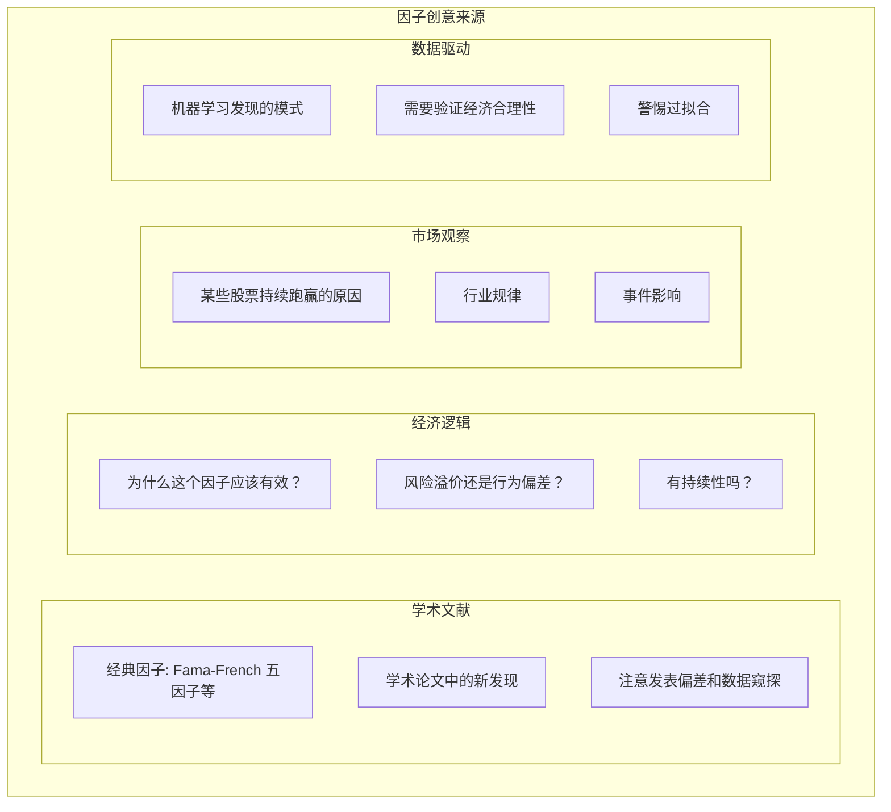
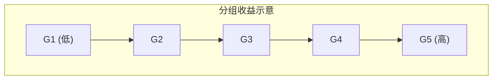
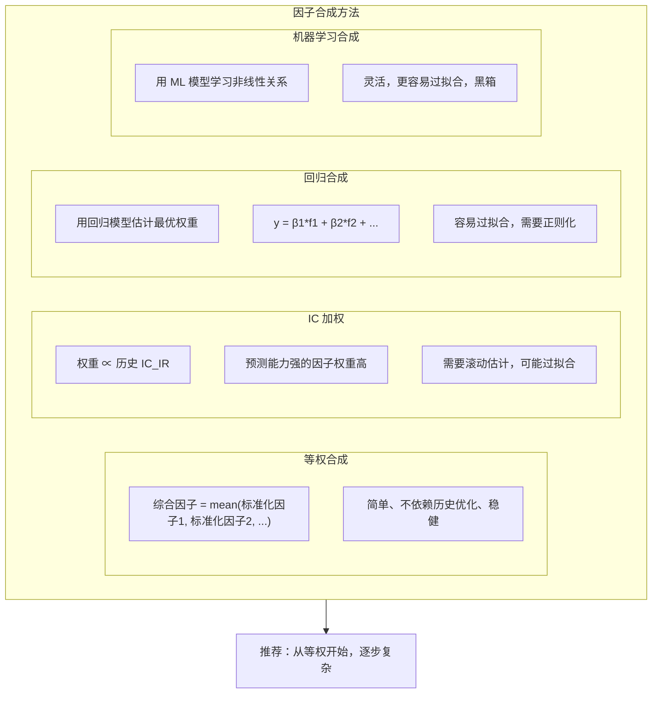
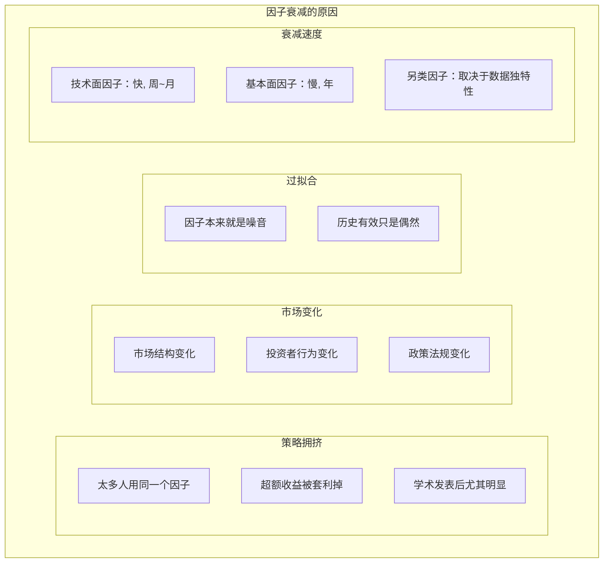
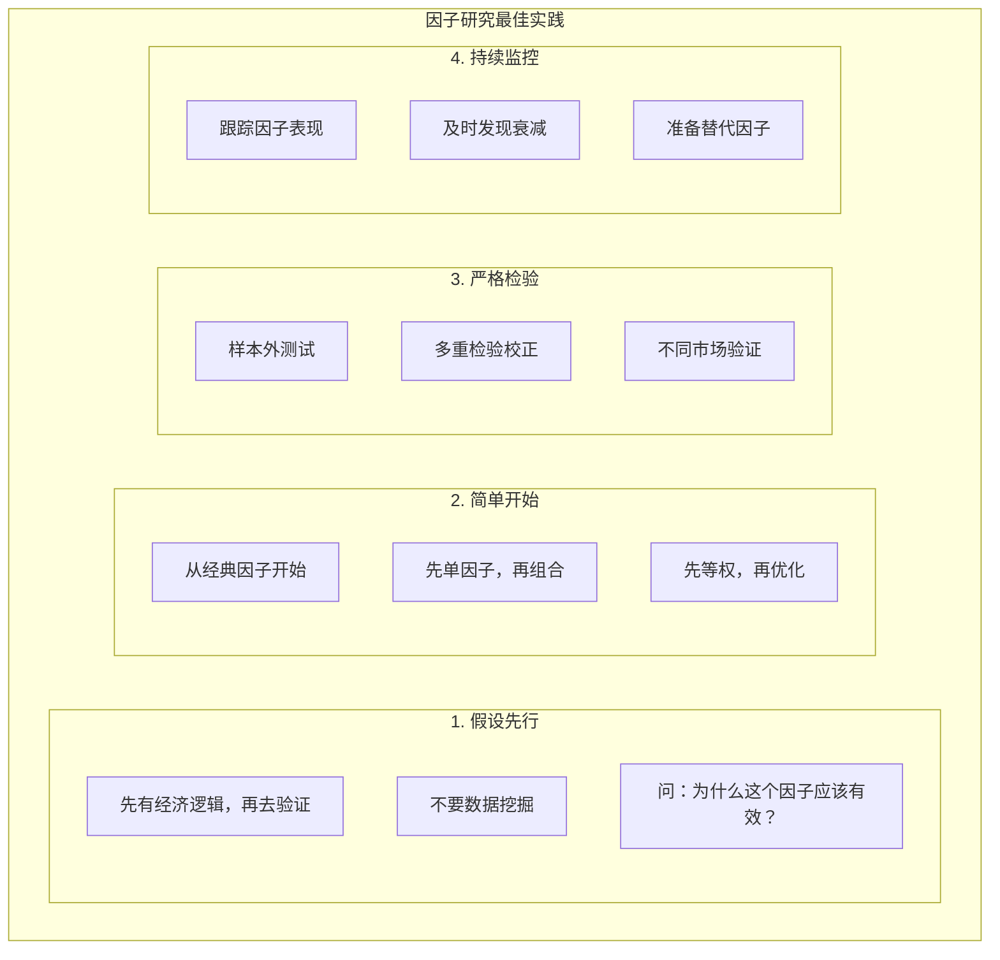
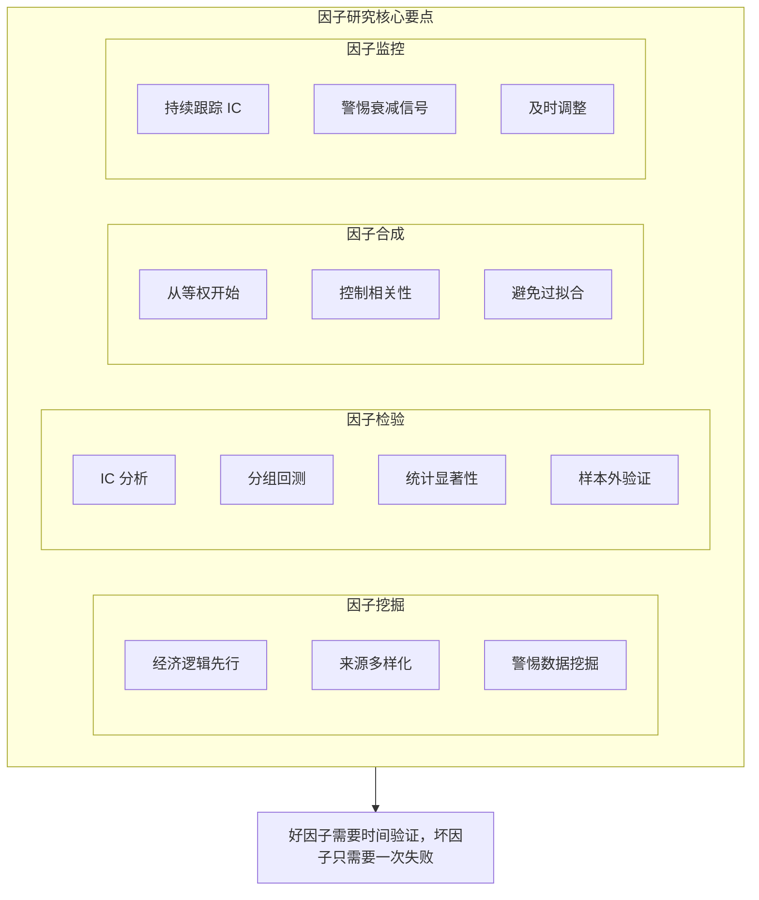

+++
title = "10 - 因子研究方法论"
date = 2025-01-15
description = "量化因子投资方法论：因子挖掘、因子检验、因子合成、因子衰减与监控"
[taxonomies]
tags = ["quant", "factor-investing", "alpha", "research", "ic-analysis"]
+++

## 概述

因子投资是量化投资的核心方法之一。本文系统介绍因子研究的完整流程：从因子发现到因子检验，再到因子组合和持续监控。

---

## 一、因子投资基础

### 1.1 什么是因子

**因子的定义：**

因子 = 能够解释/预测资产收益差异的特征

**本质：**
- 因子值高的股票 vs 因子值低的股票
- 收益有系统性差异
- 这个差异可以被利用

**示例：**
- 市值因子：小盘股收益 > 大盘股收益
- 价值因子：低估值股票 > 高估值股票
- 动量因子：近期涨幅大的 > 近期跌幅大的

**与 Alpha 的关系：**
- Alpha = 超额收益
- 因子是产生 Alpha 的来源
- 好因子 = 持续产生 Alpha

### 1.2 因子分类

**常见因子类型：**

| 类别 | 示例因子 | 说明 |
|------|----------|------|
| 风险因子 (Risk Factors) | 市场、规模、价值、动量、波动率 | 系统性的，不易衰减 |
| Alpha 因子 (Alpha Factors) | 自研因子，另类数据因子 | 可能衰减，需要持续挖掘 |
| 价量因子 | 均线、RSI、成交量、换手率 | 来自技术分析 |
| 基本面因子 | PE、PB、ROE、营收增速 | 来自财务数据 |
| 另类因子 | 舆情、分析师预期、资金流 | 来自非传统数据 |

---

## 二、因子挖掘

### 2.1 因子来源



### 2.2 因子构建

```python
import pandas as pd
import numpy as np

class FactorBuilder:
    """因子构建器"""
    
    def __init__(self, price_data, fundamental_data):
        self.price = price_data
        self.fundamental = fundamental_data
    
    # ============ 价值因子 ============
    def ep_factor(self):
        """盈利收益率 = 1/PE"""
        return 1 / self.fundamental['pe']
    
    def bp_factor(self):
        """账面市值比 = 1/PB"""
        return 1 / self.fundamental['pb']
    
    def sp_factor(self):
        """营收市值比 = 1/PS"""
        return 1 / self.fundamental['ps']
    
    # ============ 动量因子 ============
    def momentum_factor(self, window=252, skip=21):
        """
        动量因子
        window: 回看窗口
        skip: 跳过最近 N 天（避免短期反转）
        """
        returns = self.price['close'].pct_change(window)
        recent_returns = self.price['close'].pct_change(skip)
        return returns - recent_returns
    
    def reversal_factor(self, window=5):
        """短期反转因子"""
        return -self.price['close'].pct_change(window)
    
    # ============ 质量因子 ============
    def roe_factor(self):
        """ROE 因子"""
        return self.fundamental['roe']
    
    def gross_profit_margin(self):
        """毛利率因子"""
        return self.fundamental['gross_margin']
    
    # ============ 波动率因子 ============
    def volatility_factor(self, window=20):
        """历史波动率（低波动策略取负值）"""
        returns = self.price['close'].pct_change()
        return -returns.rolling(window).std()  # 负号：低波动优先
    
    # ============ 规模因子 ============
    def size_factor(self):
        """市值因子（取负数：小市值优先）"""
        return -np.log(self.fundamental['market_cap'])
    
    # ============ 因子标准化 ============
    def standardize(self, factor, method='zscore'):
        """
        因子标准化
        method: 'zscore', 'rank', 'minmax'
        """
        if method == 'zscore':
            return (factor - factor.mean()) / factor.std()
        elif method == 'rank':
            return factor.rank(pct=True)
        elif method == 'minmax':
            return (factor - factor.min()) / (factor.max() - factor.min())
    
    def winsorize(self, factor, lower=0.01, upper=0.99):
        """极值处理"""
        lower_bound = factor.quantile(lower)
        upper_bound = factor.quantile(upper)
        return factor.clip(lower_bound, upper_bound)
    
    def neutralize(self, factor, industry):
        """行业中性化"""
        # 按行业分组去均值
        return factor.groupby(industry).apply(
            lambda x: x - x.mean()
        )
```

---

## 三、因子检验

### 3.1 IC 分析

**IC（信息系数）分析：**

**IC 定义：**
- IC = corr(因子值, 未来收益)
- 衡量因子的预测能力
- 正 IC：因子值高 → 收益高
- 负 IC：因子值高 → 收益低

**常用指标：**
- IC 均值：平均预测能力
- IC 标准差：稳定性
- IC_IR = IC均值 / IC标准差：风险调整 IC
- IC > 0 的比例：胜率

**参考标准：**

| 指标 | 标准 |
|------|------|
| \|IC均值\| > 0.02 | 有一定预测能力 |
| \|IC均值\| > 0.05 | 较强预测能力 |
| IC_IR > 0.5 | 较好 |
| IC > 0 比例 > 55% | 稳定 |

```python
def calculate_ic(factor, forward_returns):
    """
    计算 IC 序列
    
    factor: DataFrame, 因子值 (date x stock)
    forward_returns: DataFrame, 未来收益 (date x stock)
    """
    ic_series = []
    
    for date in factor.index:
        f = factor.loc[date].dropna()
        r = forward_returns.loc[date].dropna()
        
        # 取交集
        common = f.index.intersection(r.index)
        
        if len(common) > 30:  # 最少样本
            # Rank IC (更稳健)
            ic = f[common].rank().corr(r[common].rank())
            ic_series.append({'date': date, 'ic': ic})
    
    ic_df = pd.DataFrame(ic_series).set_index('date')
    
    # 统计指标
    stats = {
        'IC_mean': ic_df['ic'].mean(),
        'IC_std': ic_df['ic'].std(),
        'IC_IR': ic_df['ic'].mean() / ic_df['ic'].std(),
        'IC_positive_ratio': (ic_df['ic'] > 0).mean(),
    }
    
    return ic_df, stats
```

### 3.2 分组回测

**分组回测方法：**

**方法：**
1. 按因子值将股票分成 N 组（通常 5 或 10 组）
2. 计算每组的平均收益
3. 检验收益是否单调递增/递减
4. Top 组 - Bottom 组 = 多空收益

**期望结果：**
- 各组收益呈单调趋势
- Top 和 Bottom 差异显著
- 多空收益显著为正



> 好因子：低到高收益递增

```python
def quintile_analysis(factor, forward_returns, n_groups=5):
    """
    分组回测分析
    """
    results = []
    
    for date in factor.index:
        f = factor.loc[date].dropna()
        r = forward_returns.loc[date].dropna()
        
        common = f.index.intersection(r.index)
        if len(common) < n_groups * 10:
            continue
        
        f = f[common]
        r = r[common]
        
        # 分组
        groups = pd.qcut(f, n_groups, labels=False, duplicates='drop')
        
        # 每组平均收益
        for g in range(n_groups):
            mask = groups == g
            if mask.sum() > 0:
                results.append({
                    'date': date,
                    'group': g + 1,
                    'return': r[mask].mean(),
                    'count': mask.sum()
                })
    
    df = pd.DataFrame(results)
    
    # 汇总统计
    group_stats = df.groupby('group')['return'].agg(['mean', 'std', 'count'])
    group_stats['sharpe'] = group_stats['mean'] / group_stats['std'] * np.sqrt(252)
    
    # 多空收益
    long_short = df[df['group'] == n_groups].set_index('date')['return'] - \
                 df[df['group'] == 1].set_index('date')['return']
    
    return group_stats, long_short
```

### 3.3 显著性检验

**统计检验：**

**t 检验**
- H0: IC 均值 = 0
- t = IC均值 / (IC标准差 / sqrt(n))
- p < 0.05 认为显著

**Newey-West t 检验**
- 考虑序列相关性
- 更保守的估计

**多重检验校正**
- 如果测试了很多因子
- 需要 Bonferroni 或 FDR 校正
- 避免假阳性

> **注意：**
> - 统计显著 ≠ 经济显著
> - 样本内显著 ≠ 样本外有效
> - 相关性 ≠ 因果性

---

## 四、因子合成

### 4.1 多因子合成方法



### 4.2 因子合成实现

```python
class FactorCombiner:
    """因子合成器"""
    
    def __init__(self, factors):
        """
        factors: dict, {factor_name: factor_values}
        """
        self.factors = factors
        
    def equal_weight_combine(self):
        """等权合成"""
        standardized = {}
        for name, factor in self.factors.items():
            # 截面标准化
            standardized[name] = factor.apply(
                lambda x: (x - x.mean()) / x.std(), axis=1
            )
        
        # 等权平均
        combined = sum(standardized.values()) / len(standardized)
        return combined
    
    def ic_weight_combine(self, forward_returns, lookback=60):
        """IC 加权合成"""
        weights = {}
        
        for name, factor in self.factors.items():
            # 计算滚动 IC_IR
            ic_series = []
            for i in range(lookback, len(factor)):
                window_factor = factor.iloc[i-lookback:i]
                window_returns = forward_returns.iloc[i-lookback:i]
                
                ics = []
                for j in range(len(window_factor)):
                    f = window_factor.iloc[j].dropna()
                    r = window_returns.iloc[j].dropna()
                    common = f.index.intersection(r.index)
                    if len(common) > 30:
                        ic = f[common].rank().corr(r[common].rank())
                        ics.append(ic)
                
                if ics:
                    ic_ir = np.mean(ics) / np.std(ics) if np.std(ics) > 0 else 0
                    ic_series.append(max(0, ic_ir))  # 只用正 IC_IR
                else:
                    ic_series.append(0)
            
            weights[name] = ic_series
        
        # 归一化权重
        weight_df = pd.DataFrame(weights)
        weight_df = weight_df.div(weight_df.sum(axis=1), axis=0)
        
        # 加权合成
        combined = sum(
            self.factors[name].iloc[lookback:] * weight_df[name].values[:, None]
            for name in self.factors
        )
        
        return combined
```

### 4.3 因子正交化

**因子正交化：**

**目的：**
- 消除因子间的相关性
- 得到"纯净"的因子暴露
- 更清晰的归因

**方法：回归法**
- 新因子 = 原因子 - 已有因子能解释的部分
- 即：对已有因子回归，取残差

**示例：纯动量因子**
- 原始动量可能与市值相关
- 纯动量 = 动量 - β × 市值因子
- 去除市值影响后的"纯"动量

**Python 示例：**
```python
from sklearn.linear_model import LinearRegression

def orthogonalize(factor, control_factors):
    """
    因子正交化
    factor: 需要正交化的因子
    control_factors: 需要控制的因子列表
    """
    # 合并控制变量
    X = pd.concat(control_factors, axis=1).dropna()
    y = factor.loc[X.index]
    
    # 回归
    model = LinearRegression()
    model.fit(X, y)
    
    # 残差即为正交化后的因子
    residual = y - model.predict(X)
    
    return residual
```

---

## 五、因子衰减与监控

### 5.1 因子衰减



### 5.2 因子监控

```python
class FactorMonitor:
    """因子监控器"""
    
    def __init__(self, factor_name, history_length=252):
        self.factor_name = factor_name
        self.history_length = history_length
        self.ic_history = []
        self.alert_threshold = {
            'ic_decline': -0.02,
            'ic_ir_decline': 0.3,
            'hit_rate_decline': 0.5
        }
    
    def update(self, ic_value):
        """更新 IC 历史"""
        self.ic_history.append({
            'date': datetime.now(),
            'ic': ic_value
        })
        
        # 保持历史长度
        if len(self.ic_history) > self.history_length:
            self.ic_history = self.ic_history[-self.history_length:]
    
    def check_decay(self):
        """检查因子是否衰减"""
        if len(self.ic_history) < 60:
            return None
        
        df = pd.DataFrame(self.ic_history)
        
        # 最近 vs 历史
        recent_ic = df.tail(20)['ic'].mean()
        historical_ic = df.head(len(df)-20)['ic'].mean()
        
        # IC 下降检测
        ic_change = recent_ic - historical_ic
        
        # IC_IR 变化
        recent_ir = df.tail(20)['ic'].mean() / df.tail(20)['ic'].std()
        historical_ir = df.head(len(df)-20)['ic'].mean() / df.head(len(df)-20)['ic'].std()
        
        # 胜率变化
        recent_hit = (df.tail(20)['ic'] > 0).mean()
        historical_hit = (df.head(len(df)-20)['ic'] > 0).mean()
        
        alerts = []
        
        if ic_change < self.alert_threshold['ic_decline']:
            alerts.append(f"IC declined: {historical_ic:.3f} -> {recent_ic:.3f}")
        
        if recent_ir < self.alert_threshold['ic_ir_decline']:
            alerts.append(f"IC_IR too low: {recent_ir:.2f}")
        
        if recent_hit < self.alert_threshold['hit_rate_decline']:
            alerts.append(f"Hit rate declined: {recent_hit:.1%}")
        
        return alerts if alerts else None
    
    def generate_report(self):
        """生成因子报告"""
        df = pd.DataFrame(self.ic_history)
        
        report = {
            'factor_name': self.factor_name,
            'period': f"{df['date'].min()} to {df['date'].max()}",
            'ic_mean': df['ic'].mean(),
            'ic_std': df['ic'].std(),
            'ic_ir': df['ic'].mean() / df['ic'].std(),
            'hit_rate': (df['ic'] > 0).mean(),
            'recent_ic_20d': df.tail(20)['ic'].mean(),
            'recent_ic_60d': df.tail(60)['ic'].mean(),
        }
        
        return report
```

---

## 六、实战建议

### 6.1 因子研究流程



---

## 七、总结



---

## 相关文章

- [上一篇：09 - 从回测到实盘](/articles/quant/quant-09-从回测到实盘/)
- [下一篇：11 - 加密货币量化交易](/articles/quant/quant-11-加密货币量化/)
