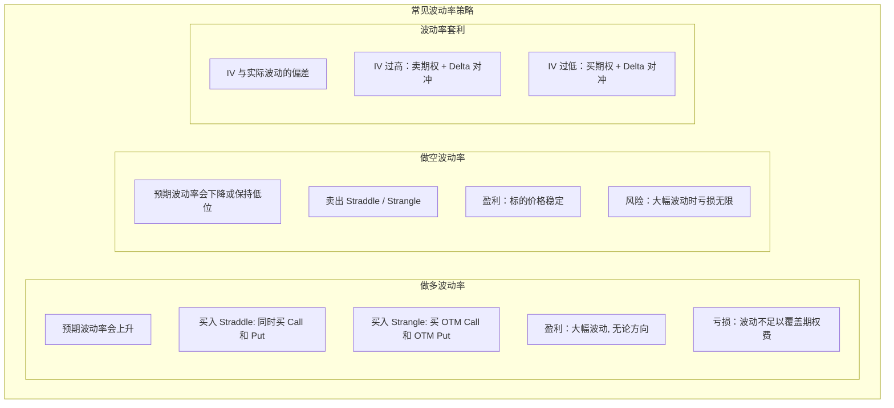
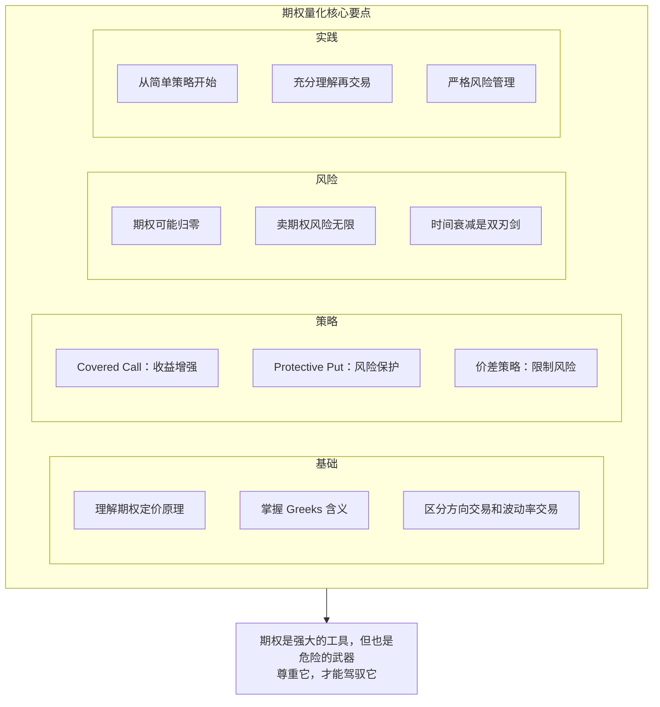

+++
title = "12 - 期权量化入门"
date = 2025-01-15
description = "期权量化交易基础：期权定价、Greeks、波动率交易、常见期权策略"
[taxonomies]
tags = ["quant", "options", "greeks", "volatility", "derivatives"]
+++

## 概述

期权是一种强大的金融工具，为量化交易者提供了丰富的策略空间。本文介绍期权量化的基础知识和常见策略。

---

## 一、期权基础

### 1.1 期权定义

**期权基本概念：**

期权 = 权利，而非义务

**看涨期权（Call）**
- 持有者有权在到期日以执行价买入标的资产
- 预期标的上涨时买入

**看跌期权（Put）**
- 持有者有权在到期日以执行价卖出标的资产
- 预期标的下跌时买入

**关键要素：**
- 标的资产（Underlying）
- 执行价（Strike Price）
- 到期日（Expiration）
- 期权费（Premium）

**期权状态：**
- 实值（ITM）：有内在价值
- 平值（ATM）：执行价 ≈ 当前价
- 虚值（OTM）：无内在价值

### 1.2 期权价值

**期权价值分解：**

期权价值 = 内在价值 + 时间价值

**内在价值（Intrinsic Value）**
- Call: max(0, 现价 - 执行价)
- Put: max(0, 执行价 - 现价)
- 立即行权能获得的价值
- 虚值期权内在价值为 0

**时间价值（Time Value）**
- = 期权价格 - 内在价值
- 反映未来波动的可能性
- 随时间流逝而衰减（Theta 衰减）
- 到期日时间价值归零

**示例：**
- 股票现价: $100
- Call 执行价: $95
- Call 价格: $8
- 内在价值: $100 - $95 = $5
- 时间价值: $8 - $5 = $3

---

## 二、Greeks（希腊字母）

### 2.1 Greeks 概述

**期权 Greeks 解释：**

| Greek | 含义 |
|-------|------|
| Delta (Δ) | 期权价格对标的价格的敏感度；标的涨 $1，期权涨 Δ |
| Gamma (Γ) | Delta 对标的价格的敏感度；Delta 的变化速度 |
| Theta (Θ) | 期权价格对时间的敏感度；每天损失多少时间价值 |
| Vega (ν) | 期权价格对波动率的敏感度；波动率涨 1%，期权涨多少 |
| Rho (ρ) | 期权价格对利率的敏感度；通常影响较小 |

### 2.2 Delta 详解

**Delta 特性：**

**Delta 范围：**
- Call: 0 到 +1
- Put: -1 到 0

**Delta 解读：**
- Delta = 0.5：股票涨 $1，期权涨 $0.5
- Delta ≈ 行权概率（近似）
- Delta 0.3 ≈ 30% 概率成为实值

**不同状态的 Delta：**
- ITM Call: Delta > 0.5（趋近 1）
- ATM Call: Delta ≈ 0.5
- OTM Call: Delta < 0.5（趋近 0）

**Delta 对冲：**
- 持有期权 + 对应股票 = Delta 中性
- 消除方向性风险

### 2.3 Greeks 计算

```python
from scipy.stats import norm
import numpy as np

def black_scholes_greeks(S, K, T, r, sigma, option_type='call'):
    """
    计算 Black-Scholes Greeks
    
    S: 标的价格
    K: 执行价
    T: 到期时间（年）
    r: 无风险利率
    sigma: 波动率
    """
    d1 = (np.log(S/K) + (r + sigma**2/2)*T) / (sigma*np.sqrt(T))
    d2 = d1 - sigma*np.sqrt(T)
    
    if option_type == 'call':
        delta = norm.cdf(d1)
        price = S*norm.cdf(d1) - K*np.exp(-r*T)*norm.cdf(d2)
    else:
        delta = norm.cdf(d1) - 1
        price = K*np.exp(-r*T)*norm.cdf(-d2) - S*norm.cdf(-d1)
    
    gamma = norm.pdf(d1) / (S * sigma * np.sqrt(T))
    vega = S * norm.pdf(d1) * np.sqrt(T) / 100  # 除以 100 得到 1% 变化
    theta = -(S * norm.pdf(d1) * sigma) / (2*np.sqrt(T)) / 365  # 每天
    
    return {
        'price': price,
        'delta': delta,
        'gamma': gamma,
        'vega': vega,
        'theta': theta
    }

# 示例
greeks = black_scholes_greeks(
    S=100,      # 股价 $100
    K=100,      # 执行价 $100（平值）
    T=30/365,   # 30 天到期
    r=0.05,     # 5% 无风险利率
    sigma=0.2,  # 20% 波动率
    option_type='call'
)

print(f"期权价格: ${greeks['price']:.2f}")
print(f"Delta: {greeks['delta']:.3f}")
print(f"Gamma: {greeks['gamma']:.4f}")
print(f"Vega: ${greeks['vega']:.2f}")
print(f"Theta: ${greeks['theta']:.2f}/天")
```

---

## 三、波动率交易

### 3.1 波动率概念

**波动率类型：**

**历史波动率（Historical Volatility, HV）**
- 过去价格变动的标准差
- 已知的、回顾的
- 计算：过去 N 天收益率的年化标准差

**隐含波动率（Implied Volatility, IV）**
- 从期权价格反推的波动率
- 市场对未来波动的预期
- 前瞻的、预期的

**关键关系：**
- IV > HV：市场预期未来波动增加（期权相对贵）
- IV < HV：市场预期未来波动减少（期权相对便宜）

**波动率交易的本质：**
- 交易波动率，而非方向
- 买入期权 = 做多波动率
- 卖出期权 = 做空波动率

### 3.2 波动率策略



---

## 四、常见期权策略

### 4.1 方向性策略

**方向性期权策略：**

**看涨策略**

**买入 Call**
- 最大亏损：期权费
- 最大盈利：无限
- 适合：强烈看涨

**牛市价差（Bull Call Spread）**
- 买低执行价 Call + 卖高执行价 Call
- 降低成本，但限制盈利
- 适合：温和看涨

**看跌策略**

**买入 Put**
- 最大亏损：期权费
- 最大盈利：执行价 - 期权费
- 适合：强烈看跌

**熊市价差（Bear Put Spread）**
- 买高执行价 Put + 卖低执行价 Put
- 降低成本，限制盈利

### 4.2 收益增强策略

**收益增强策略：**

**Covered Call（备兑看涨）**

持有股票 + 卖出 Call

**操作：**
- 持有 100 股股票
- 卖出 1 张 OTM Call

**收益：**
- 收取期权费
- 降低持股成本

**风险：**
- 股价大涨被行权，错过上涨
- 股价下跌，仍然亏损

**适合：**
- 持有股票不想卖
- 预期小涨或横盘
- 增加收益

---

**Cash-Secured Put（现金担保看跌）**

卖出 Put + 留现金准备接股

**操作：**
- 卖出 OTM Put
- 留足现金以备行权

**收益：**
- 收取期权费
- 若被行权，以低价买入股票

**适合：**
- 想买入股票，等待更低价格
- 预期不会大跌

### 4.3 保护性策略

**保护性策略：**

**Protective Put（保护性看跌）**

持有股票 + 买入 Put

**效果：**
- 相当于股票保险
- 锁定最大亏损
- 保留上涨空间

**成本：**
- 需支付期权费
- 长期使用成本较高

---

**Collar（项圈策略）**

持有股票 + 买 Put + 卖 Call

**效果：**
- 用卖 Call 的收入支付买 Put 的成本
- 零成本或低成本保护
- 限制下跌，也限制上涨

**适合：**
- 想保护收益但不愿付高额保费
- 接受有限的上涨空间

---

## 五、期权量化注意事项

### 5.1 期权数据与回测

**期权量化特殊考虑：**

**数据问题：**
- 期权数据量大（多执行价、多到期日）
- 历史数据昂贵
- 需要处理到期、行权
- 买卖价差重要

**回测挑战：**
- 流动性模拟困难
- 执行价格可能不在报价
- Greeks 需要实时计算
- 早期行权问题

**风险管理：**
- Gamma 风险：临近到期波动大
- 卖期权风险无限
- 需要持续监控 Greeks

### 5.2 个人期权交易建议

**个人期权量化建议：**

**入门建议：**
- 先充分理解期权原理
- 从 Paper Trading 开始
- 小仓位、简单策略
- Covered Call 是好的起点

**策略选择：**
- 避免裸卖期权（风险无限）
- 使用价差限制风险
- 关注流动性（选主流标的）

**风险控制：**
- 限制期权仓位占总资金比例
- 理解最大可能亏损
- 关注 Greeks 暴露
- 设置止损规则

> **特别警示：**
> - 期权可能归零
> - 卖期权可能亏损超过本金
> - 临近到期波动巨大

---

## 六、总结



---

## 相关文章

- [上一篇：11 - 加密货币量化交易](/articles/quant/quant-11-加密货币量化/)
- [下一篇：13 - 组合构建与优化](/articles/quant/quant-13-组合构建与优化/)
