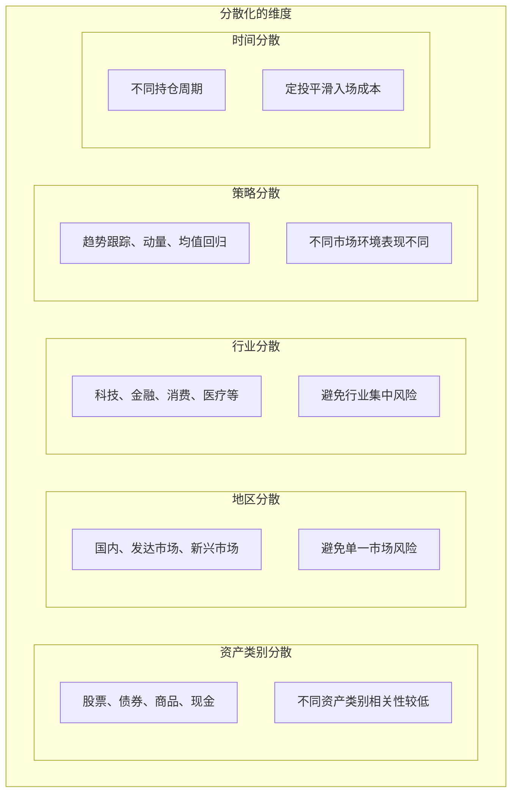
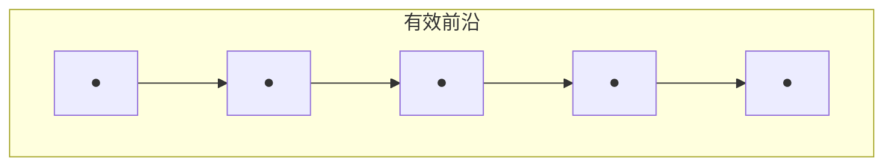
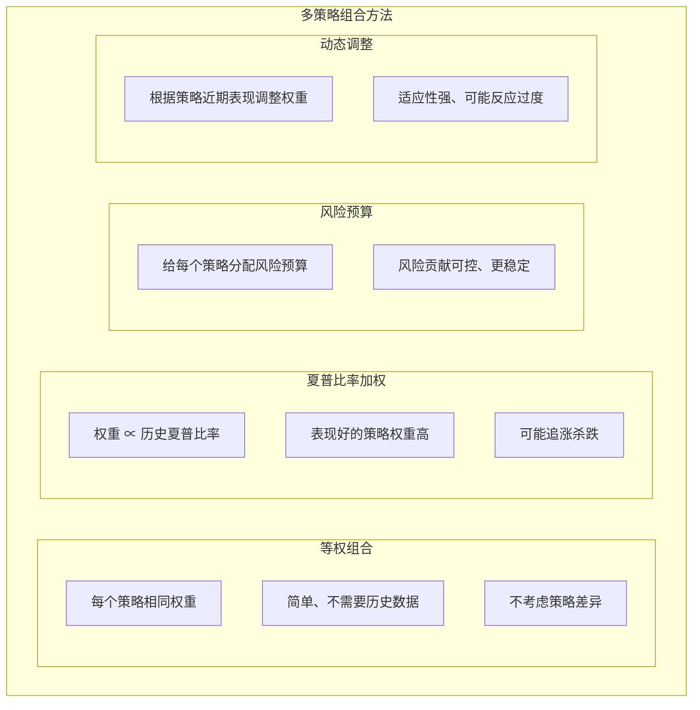
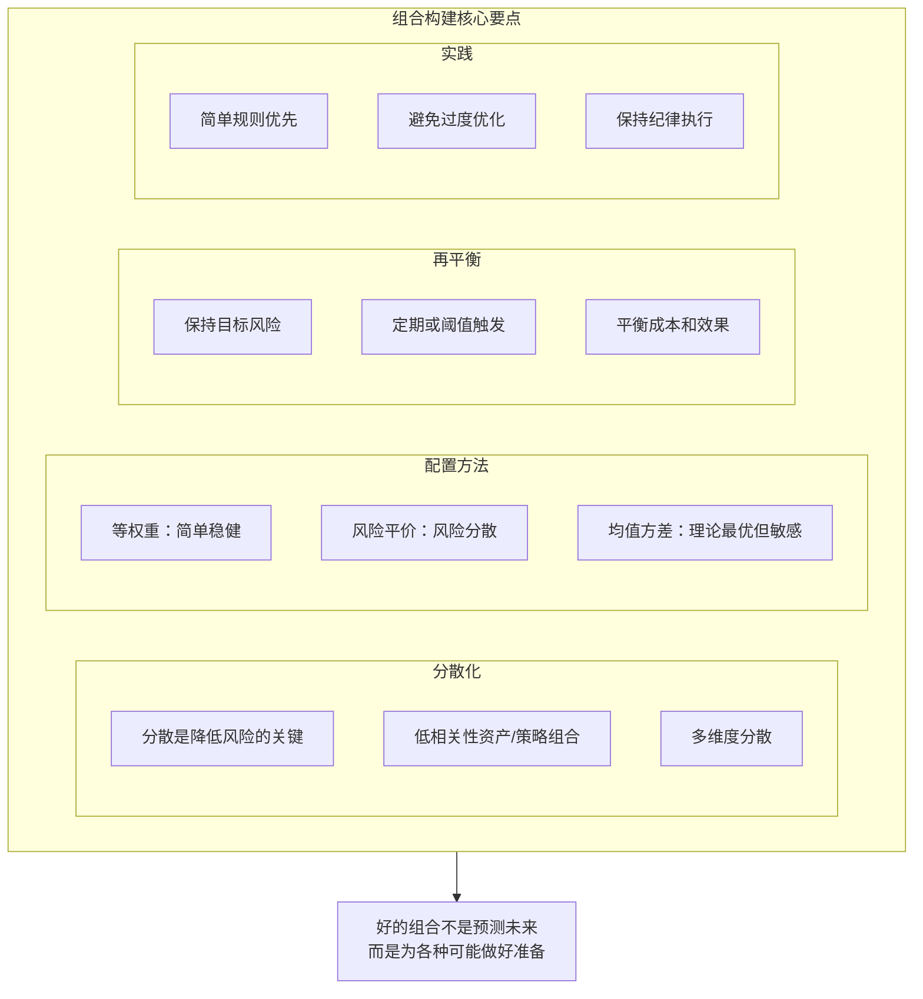

+++
title = "13 - 组合构建与优化"
date = 2025-01-15
description = "量化投资组合构建：资产配置、风险平价、组合优化、再平衡策略"
[taxonomies]
tags = ["quant", "portfolio", "optimization", "risk-parity", "asset-allocation"]
+++

## 概述

量化交易不只是单个策略，更重要的是如何将多个策略或资产组合在一起。本文介绍组合构建和优化的核心方法。

---

## 一、组合的价值

### 1.1 为什么需要组合

**组合的意义：**

**分散风险**
- "不要把鸡蛋放在一个篮子里"
- 单一策略/资产可能失效
- 组合降低整体波动

**提高夏普比率**
- 相关性低的资产组合
- 可以在相同风险下提高收益
- 或在相同收益下降低风险

**平滑收益曲线**
- 减少大起大落
- 更好的心理承受
- 更稳定的复利效应

**组合的数学原理：**
- 如果两资产不完全相关
- 组合波动率 < 单个资产波动率的加权平均
- σ\_portfolio = √(w₁²σ₁² + w₂²σ₂² + 2w₁w₂ρσ₁σ₂)
- 当 ρ < 1 时，分散化有效

### 1.2 分散化的层次



---

## 二、经典资产配置方法

### 2.1 传统配置方法

**经典配置方法：**

**60/40 组合**
- 60% 股票 + 40% 债券
- 简单直观
- 长期表现不错
- 问题：股票贡献大部分风险

**等权重组合**
- 所有资产/策略权重相等
- 最简单
- 不需要优化
- 不考虑风险差异

**市值加权**
- 按市值比例配置
- 被动指数跟踪
- 可能过度集中在大盘股

### 2.2 风险平价

**风险平价（Risk Parity）：**

**核心思想：** 各资产贡献相同的风险，而非相同的资金

**问题：传统 60/40**
- 虽然资金 60% 在股票
- 但股票波动大，贡献 90%+ 风险
- 组合实际由股票主导

**风险平价做法：**
- 低波动资产（债券）：高权重
- 高波动资产（股票）：低权重
- 使各资产风险贡献相等

**简化计算：**
- 权重 ∝ 1 / 波动率
- w\_i = (1/σ\_i) / Σ(1/σ\_j)

**优点：**
- 真正的风险分散
- 历史表现较好
- 不依赖预期收益估计

```python
import numpy as np

def risk_parity_weights(cov_matrix):
    """
    计算风险平价权重
    简化版本：假设资产不相关，权重与波动率成反比
    """
    # 从协方差矩阵获取波动率
    volatilities = np.sqrt(np.diag(cov_matrix))
    
    # 权重与波动率成反比
    inv_vol = 1 / volatilities
    weights = inv_vol / inv_vol.sum()
    
    return weights


def risk_parity_contribution(weights, cov_matrix):
    """
    计算各资产的风险贡献
    用于验证是否达到风险平价
    """
    portfolio_vol = np.sqrt(weights.T @ cov_matrix @ weights)
    
    # 边际风险贡献
    marginal_contrib = cov_matrix @ weights / portfolio_vol
    
    # 风险贡献 = 权重 × 边际风险贡献
    risk_contrib = weights * marginal_contrib
    
    # 风险贡献占比
    risk_contrib_pct = risk_contrib / risk_contrib.sum()
    
    return risk_contrib_pct


# 示例
returns = pd.DataFrame({
    'stocks': np.random.randn(252) * 0.2 / np.sqrt(252),
    'bonds': np.random.randn(252) * 0.05 / np.sqrt(252),
    'commodities': np.random.randn(252) * 0.15 / np.sqrt(252)
})

cov = returns.cov() * 252  # 年化协方差

# 风险平价权重
weights = risk_parity_weights(cov)
print("Risk Parity Weights:", weights)

# 验证风险贡献
risk_contrib = risk_parity_contribution(weights, cov.values)
print("Risk Contribution:", risk_contrib)
```

---

## 三、均值-方差优化

### 3.1 马科维茨模型

**现代投资组合理论（MPT）：**

**目标：**
- 在给定风险下最大化收益
- 或在给定收益下最小化风险

**数学形式：**
- 最大化: w'μ - λ/2 × w'Σw
- 约束: Σw = 1

**其中：**
- w = 权重向量
- μ = 预期收益向量
- Σ = 协方差矩阵
- λ = 风险厌恶系数



> 有效前沿上的点是最优组合（收益 vs 风险的最优权衡）

### 3.2 优化实现

```python
from scipy.optimize import minimize
import numpy as np

def mean_variance_optimize(expected_returns, cov_matrix, risk_free_rate=0.02):
    """
    均值-方差优化，最大化夏普比率
    """
    n_assets = len(expected_returns)
    
    def neg_sharpe(weights):
        portfolio_return = np.dot(weights, expected_returns)
        portfolio_vol = np.sqrt(weights.T @ cov_matrix @ weights)
        sharpe = (portfolio_return - risk_free_rate) / portfolio_vol
        return -sharpe  # 最小化负夏普
    
    # 约束
    constraints = {'type': 'eq', 'fun': lambda w: np.sum(w) - 1}
    bounds = tuple((0, 1) for _ in range(n_assets))  # 不允许做空
    
    # 初始权重
    init_weights = np.array([1/n_assets] * n_assets)
    
    # 优化
    result = minimize(
        neg_sharpe,
        init_weights,
        method='SLSQP',
        bounds=bounds,
        constraints=constraints
    )
    
    return result.x


def minimum_variance_portfolio(cov_matrix):
    """
    最小方差组合
    """
    n_assets = len(cov_matrix)
    
    def portfolio_variance(weights):
        return weights.T @ cov_matrix @ weights
    
    constraints = {'type': 'eq', 'fun': lambda w: np.sum(w) - 1}
    bounds = tuple((0, 1) for _ in range(n_assets))
    init_weights = np.array([1/n_assets] * n_assets)
    
    result = minimize(
        portfolio_variance,
        init_weights,
        method='SLSQP',
        bounds=bounds,
        constraints=constraints
    )
    
    return result.x


# 示例
expected_returns = np.array([0.10, 0.05, 0.08])  # 股票、债券、商品
cov_matrix = np.array([
    [0.04, 0.01, 0.02],
    [0.01, 0.01, 0.005],
    [0.02, 0.005, 0.03]
])

# 最大夏普组合
max_sharpe_weights = mean_variance_optimize(expected_returns, cov_matrix)
print("Max Sharpe Weights:", max_sharpe_weights)

# 最小方差组合
min_var_weights = minimum_variance_portfolio(cov_matrix)
print("Min Variance Weights:", min_var_weights)
```

### 3.3 优化的问题

**均值-方差优化的问题：**

**估计误差**
- 预期收益很难准确估计
- 协方差矩阵也有误差
- 优化对输入误差敏感
- "垃圾进，垃圾出"

**过度集中**
- 可能产生极端权重
- 过度集中在少数资产
- 需要添加约束

**样本外表现差**
- 对历史数据过拟合
- 未来可能完全不同

**改进方法：**
- 添加约束（如最大权重限制）
- 使用稳健估计（缩减估计）
- 不估计预期收益（风险平价、最小方差）
- 贝叶斯方法（Black-Litterman）

---

## 四、策略组合

### 4.1 多策略组合



### 4.2 策略相关性

```python
def strategy_correlation_analysis(strategy_returns):
    """
    策略相关性分析
    strategy_returns: DataFrame, 各策略收益序列
    """
    # 相关性矩阵
    corr_matrix = strategy_returns.corr()
    
    # 平均相关性
    n = len(corr_matrix)
    avg_corr = (corr_matrix.sum().sum() - n) / (n * (n - 1))
    
    print("策略相关性矩阵:")
    print(corr_matrix.round(2))
    print(f"\n平均相关性: {avg_corr:.2f}")
    
    # 相关性低的策略更适合组合
    if avg_corr < 0.3:
        print("✓ 策略相关性较低，组合分散效果好")
    elif avg_corr < 0.6:
        print("◐ 策略有一定相关性，分散效果中等")
    else:
        print("✗ 策略相关性较高，分散效果有限")
    
    return corr_matrix


def optimal_strategy_combination(strategy_returns, target_vol=0.1):
    """
    策略组合优化
    目标：在目标波动率下最大化收益
    """
    expected_returns = strategy_returns.mean() * 252
    cov_matrix = strategy_returns.cov() * 252
    
    n = len(expected_returns)
    
    def neg_return(weights):
        return -np.dot(weights, expected_returns)
    
    def portfolio_vol(weights):
        return np.sqrt(weights.T @ cov_matrix.values @ weights)
    
    constraints = [
        {'type': 'eq', 'fun': lambda w: np.sum(w) - 1},
        {'type': 'eq', 'fun': lambda w: portfolio_vol(w) - target_vol}
    ]
    bounds = tuple((0, 0.5) for _ in range(n))  # 单策略最多 50%
    init_weights = np.array([1/n] * n)
    
    result = minimize(
        neg_return,
        init_weights,
        method='SLSQP',
        bounds=bounds,
        constraints=constraints
    )
    
    return result.x
```

---

## 五、再平衡

### 5.1 再平衡策略

**再平衡方法：**

**定期再平衡**
- 固定周期（月度、季度）
- 简单易执行
- 可能过度交易

**阈值再平衡**
- 偏离目标超过阈值时再平衡
- 例：偏离 5% 触发
- 减少不必要交易

**日历+阈值组合**
- 定期检查
- 只有偏离足够大才交易
- 平衡效率和成本

**再平衡的好处：**
- 保持目标风险
- 被动的"低买高卖"
- 纪律性

**再平衡的成本：**
- 交易成本
- 税务影响
- 可能错过趋势

### 5.2 再平衡实现

```python
class PortfolioRebalancer:
    """组合再平衡器"""
    
    def __init__(self, target_weights, threshold=0.05, min_trade=1000):
        self.target_weights = target_weights
        self.threshold = threshold
        self.min_trade = min_trade
        
    def check_rebalance(self, current_weights):
        """
        检查是否需要再平衡
        """
        deviation = np.abs(current_weights - self.target_weights)
        max_deviation = deviation.max()
        
        return max_deviation > self.threshold
    
    def calculate_trades(self, current_values, total_value):
        """
        计算再平衡交易
        current_values: 各资产当前市值
        total_value: 组合总值
        """
        current_weights = current_values / total_value
        target_values = self.target_weights * total_value
        
        trades = target_values - current_values
        
        # 过滤小额交易
        trades[np.abs(trades) < self.min_trade] = 0
        
        return trades
    
    def rebalance(self, portfolio, prices):
        """
        执行再平衡
        """
        current_values = portfolio.positions * prices
        total_value = current_values.sum() + portfolio.cash
        
        current_weights = current_values / total_value
        
        if not self.check_rebalance(current_weights):
            print("No rebalance needed")
            return None
        
        trades = self.calculate_trades(current_values, total_value)
        
        # 生成订单
        orders = []
        for asset, trade_value in trades.items():
            if trade_value != 0:
                quantity = trade_value / prices[asset]
                orders.append({
                    'asset': asset,
                    'quantity': quantity,
                    'value': trade_value
                })
        
        return orders


# 使用示例
target = np.array([0.4, 0.3, 0.2, 0.1])  # 股票、债券、商品、现金
rebalancer = PortfolioRebalancer(target, threshold=0.05)

# 检查当前权重
current = np.array([0.48, 0.28, 0.18, 0.06])  # 股票涨了
if rebalancer.check_rebalance(current):
    print("需要再平衡：股票权重偏离过大")
```

---

## 六、实践建议

### 6.1 个人组合建议

**个人投资组合建议：**

**简单开始**
- 2-3 个不相关的资产/策略
- 等权重或简单规则
- 不需要复杂优化

**核心原则**
- 分散化是唯一的"免费午餐"
- 低相关性比高收益更重要
- 保持纪律，定期再平衡

**避免过度优化**
- 简单规则往往更稳健
- 优化容易过拟合
- 对输入假设保持怀疑

**监控和调整**
- 定期检查组合表现
- 关注相关性变化
- 策略失效及时调整

---

## 七、总结



---

## 相关文章

- [上一篇：12 - 期权量化入门](/articles/quant/quant-12-期权量化入门/)
- [下一篇：14 - 量化交易常见错误案例](/articles/quant/quant-14-量化交易常见错误案例/)
