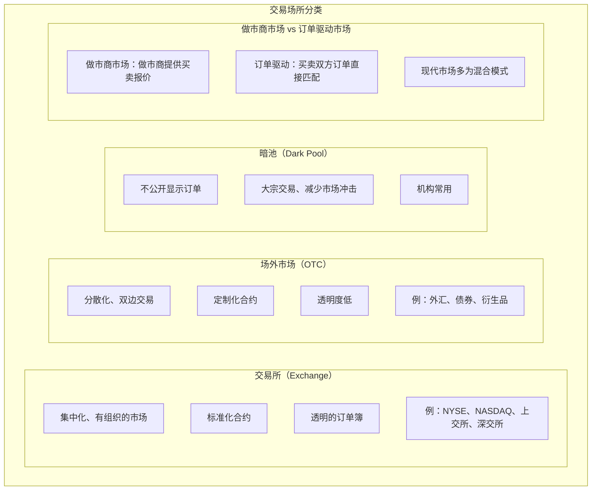
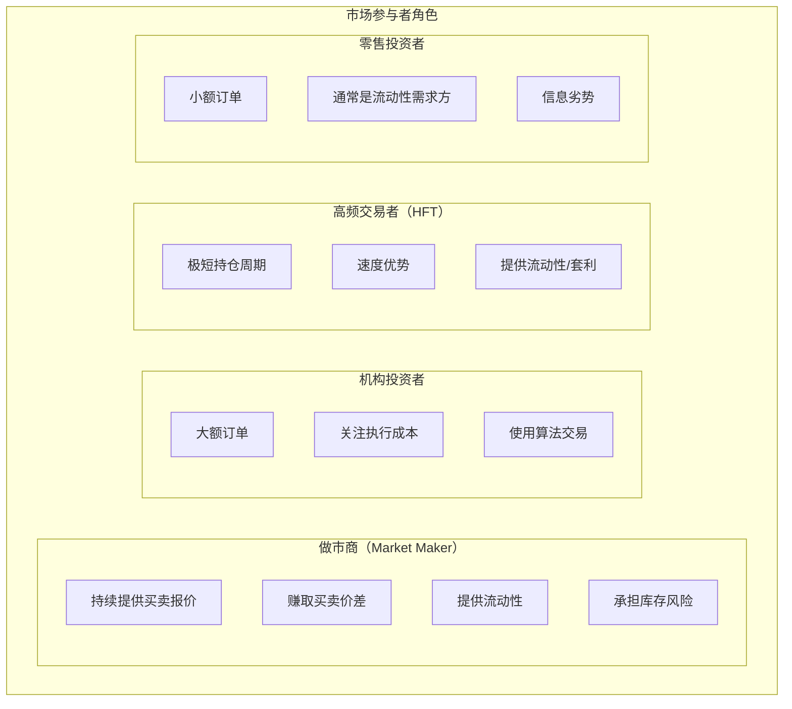
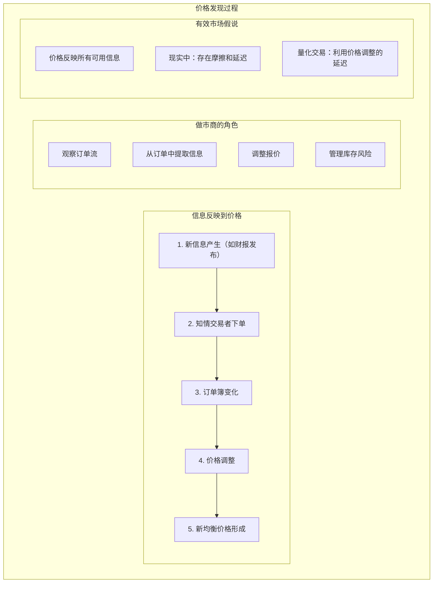
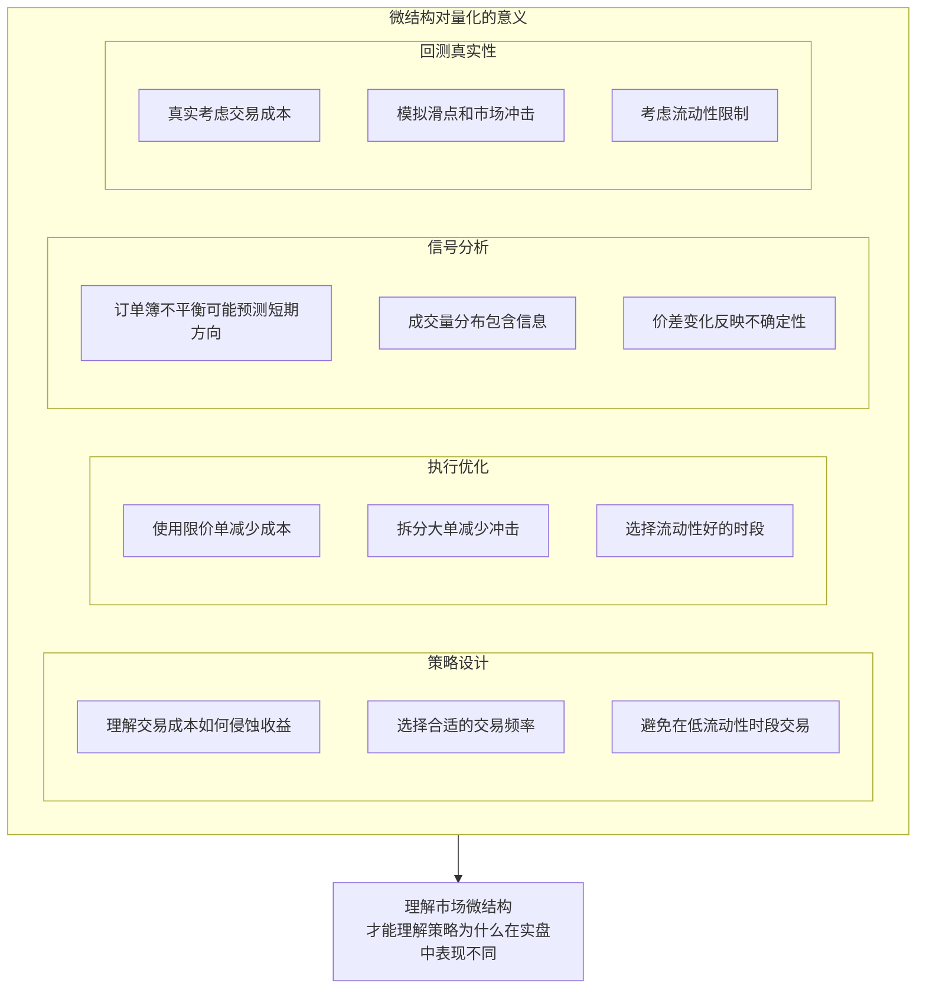

+++
title = "16 - 市场微结构"
date = 2025-01-15
description = "市场微结构入门：订单簿、做市商、价格形成机制、订单类型与执行"
[taxonomies]
tags = ["quant", "market-microstructure", "orderbook", "market-maker", "execution"]
+++

## 概述

市场微结构研究价格是如何形成的、订单是如何执行的。理解微结构对于设计执行策略、评估交易成本、理解市场动态至关重要。

---

## 一、市场结构基础

### 1.1 交易场所类型



### 1.2 市场参与者



---

## 二、订单簿

### 2.1 订单簿结构

**订单簿（Order Book）示意：**

**卖方（Ask/Offer）**

| 价格 | 数量 | 累计 | 说明 |
|------|------|------|------|
| $100.05 | 500 | 500 | |
| $100.04 | 1000 | 1500 | |
| $100.03 | 800 | 2300 | |
| $100.02 | 1200 | 3500 | ← 卖一（Best Ask） |

**═══════ 买卖价差 $0.01 ═══════**

**买方（Bid）**

| 价格 | 数量 | 累计 | 说明 |
|------|------|------|------|
| $100.01 | 1500 | 1500 | ← 买一（Best Bid） |
| $100.00 | 2000 | 3500 | |
| $99.99 | 1800 | 5300 | |
| $99.98 | 600 | 5900 | |

**术语：**
- Best Bid：最高买价
- Best Ask：最低卖价
- Spread：买卖价差
- Depth：各价位的订单量
- Mid Price：(Bid + Ask) / 2

### 2.2 订单簿分析

```python
class OrderBook:
    """订单簿分析"""
    
    def __init__(self, bids, asks):
        """
        bids: [(price, size), ...] 按价格降序
        asks: [(price, size), ...] 按价格升序
        """
        self.bids = sorted(bids, key=lambda x: -x[0])
        self.asks = sorted(asks, key=lambda x: x[0])
    
    @property
    def best_bid(self):
        return self.bids[0][0] if self.bids else None
    
    @property
    def best_ask(self):
        return self.asks[0][0] if self.asks else None
    
    @property
    def mid_price(self):
        if self.best_bid and self.best_ask:
            return (self.best_bid + self.best_ask) / 2
        return None
    
    @property
    def spread(self):
        if self.best_bid and self.best_ask:
            return self.best_ask - self.best_bid
        return None
    
    @property
    def spread_bps(self):
        """买卖价差（基点）"""
        if self.spread and self.mid_price:
            return self.spread / self.mid_price * 10000
        return None
    
    def imbalance(self, levels=5):
        """
        订单不平衡度
        正值：买盘强；负值：卖盘强
        """
        bid_volume = sum(size for _, size in self.bids[:levels])
        ask_volume = sum(size for _, size in self.asks[:levels])
        
        total = bid_volume + ask_volume
        if total == 0:
            return 0
        return (bid_volume - ask_volume) / total
    
    def vwap_impact(self, side, size):
        """
        计算执行一定数量的成交均价
        side: 'buy' or 'sell'
        """
        if side == 'buy':
            orders = self.asks
        else:
            orders = self.bids
        
        remaining = size
        total_cost = 0
        
        for price, available in orders:
            filled = min(remaining, available)
            total_cost += filled * price
            remaining -= filled
            if remaining <= 0:
                break
        
        if remaining > 0:
            return None  # 流动性不足
        
        return total_cost / size


# 使用示例
bids = [(100.01, 1500), (100.00, 2000), (99.99, 1800)]
asks = [(100.02, 1200), (100.03, 800), (100.04, 1000)]

ob = OrderBook(bids, asks)
print(f"Mid Price: {ob.mid_price}")
print(f"Spread: {ob.spread_bps:.2f} bps")
print(f"Imbalance: {ob.imbalance():.2f}")
print(f"VWAP to buy 2000: {ob.vwap_impact('buy', 2000):.2f}")
```

---

## 三、订单类型

### 3.1 基本订单类型

**订单类型详解：**

**市价单（Market Order）**
- 立即以当前最优价格成交
- 保证成交，不保证价格
- 可能产生滑点
- 适合：快速执行、流动性好的市场

**限价单（Limit Order）**
- 指定价格或更好的价格成交
- 保证价格，不保证成交
- 可能不成交或部分成交
- 适合：对价格敏感、不急于成交

**止损单（Stop Order）**
- 价格触及触发价后变成市价单
- 用于止损或突破入场
- 可能在触发后滑点

**止损限价单（Stop-Limit）**
- 触发后变成限价单
- 控制滑点但可能不成交

### 3.2 高级订单类型

**高级订单类型：**

| 订单类型 | 说明 |
|----------|------|
| 冰山单（Iceberg） | 只显示部分数量，隐藏真实交易意图，减少市场冲击 |
| FOK（Fill or Kill） | 全部成交或取消，不接受部分成交 |
| IOC（Immediate or Cancel） | 立即成交能成交的部分，剩余取消 |
| GTC（Good Till Cancelled） | 持续有效直到成交或取消 |
| DAY Order | 当日有效，收盘自动取消 |

---

## 四、价格形成机制

### 4.1 订单匹配

**订单匹配原则：**

**价格优先（Price Priority）**
- 买方：出价高的优先
- 卖方：出价低的优先

**时间优先（Time Priority）**
- 同一价格，先到的优先
- FIFO（先进先出）

**匹配过程：**
1. 新订单进入
2. 检查是否与对手方订单可匹配
3. 按价格-时间优先匹配
4. 未匹配部分进入订单簿

**示例：**
- 当前 Best Ask = $100
- 新来买单 $101（限价）
- → 可以与 $100 卖单成交
- → 成交价 $100（卖方价格）

### 4.2 价格发现



---

## 五、做市商

### 5.1 做市商机制

**做市商运作：**

**做市商职责：**
- 持续报出买卖价格
- 满足投资者的交易需求
- 提供流动性

**盈利来源：**
- 买卖价差（主要）
- 交易所返佣

**风险：**
- 库存风险：持有头寸的价格变动
- 逆向选择：被知情交易者利用

**价差决定因素：**
- 波动率：高波动 → 大价差
- 流动性：低流动性 → 大价差
- 信息不对称：信息不对称高 → 大价差
- 竞争程度：竞争激烈 → 小价差

### 5.2 简单做市模型

```python
class SimpleMarketMaker:
    """简单做市商模型（仅供理解）"""
    
    def __init__(self, base_spread=0.001, inventory_risk=0.0001):
        self.base_spread = base_spread
        self.inventory_risk = inventory_risk
        self.inventory = 0
        self.mid_price = 100
    
    def quote(self):
        """
        生成买卖报价
        考虑库存偏移：库存多时降低买价，提高卖价
        """
        half_spread = self.base_spread / 2
        
        # 库存偏移
        inventory_adjustment = self.inventory * self.inventory_risk
        
        bid = self.mid_price * (1 - half_spread - inventory_adjustment)
        ask = self.mid_price * (1 + half_spread - inventory_adjustment)
        
        return round(bid, 2), round(ask, 2)
    
    def on_fill(self, side, size, price):
        """处理成交"""
        if side == 'buy':  # 我们被买，我们是卖方
            self.inventory -= size
        else:  # 我们被卖，我们是买方
            self.inventory += size
        
        print(f"Fill: {side} {size} @ {price}, Inventory: {self.inventory}")
        
        # 更新中间价（简化）
        self.mid_price = price


# 演示
mm = SimpleMarketMaker()
print("Initial quote:", mm.quote())

mm.on_fill('buy', 100, 100.05)  # 有人买了我们的卖单
print("After sell:", mm.quote())  # 库存减少，调整报价
```

---

## 六、交易成本

### 6.1 交易成本构成

**交易成本分解：**

**显性成本**
- 佣金：支付给券商
- 税费：印花税等
- 交易所费用

**隐性成本**
- 买卖价差：跨越价差的成本
- 市场冲击：大单影响价格
- 延迟成本：决策到执行的价格变化
- 机会成本：未能成交的机会损失

**成本估算示例：**
买入 $1,000,000

| 成本项 | 金额 | 比例 |
|--------|------|------|
| 佣金 | $100 | 0.01% |
| 价差 | $500 | 0.05% |
| 市场冲击 | $300 | 0.03% |
| **总成本** | **$900** | **0.09%** |

### 6.2 市场冲击

**市场冲击模型：**

**线性冲击模型：**
冲击 = α × (交易量 / 日均成交量)

**平方根冲击模型：**
冲击 = σ × β × √(交易量 / 日均成交量)
- σ = 波动率
- β = 冲击系数

**影响因素：**
- 订单大小：大订单冲击大
- 流动性：低流动性冲击大
- 波动性：高波动性冲击大
- 执行速度：快速执行冲击大

**减少冲击的方法：**
- 拆分订单
- 使用算法交易（TWAP, VWAP）
- 使用暗池
- 耐心执行

---

## 七、实践意义



---

## 相关文章

- [上一篇：15 - 外汇量化入门](/articles/quant/quant-15-外汇量化入门/)
- [下一篇：17 - 事件驱动策略](/articles/quant/quant-17-事件驱动策略/)
