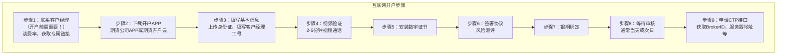
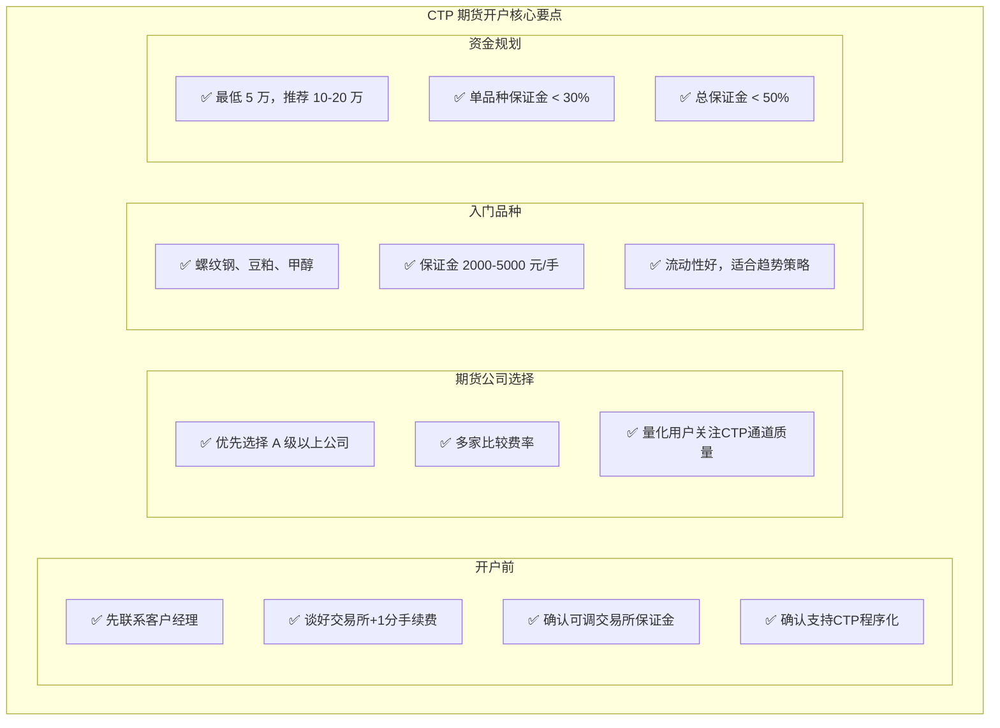

+++
title = "19 - CTP 期货开户与期货公司选择：个人量化交易者完整指南"
date = 2025-01-16
description = "详解中国大陆期货开户全流程、期货公司选择标准、手续费和保证金谈判技巧、CTP接口申请、入门品种推荐"
[taxonomies]
tags = ["quant", "CTP", "futures", "china-market", "broker", "account-opening"]
+++

## 概述

对于中国大陆的个人量化交易者，商品期货是最佳起点。本文将详细解答：

- 如何开设期货账户？
- 如何选择期货公司？
- 推荐哪些期货公司？
- 理想的手续费和保证金率是多少？
- 如何获取 CTP 程序化接口？
- 从哪些品种开始入手？

---

## 一、期货开户基础知识

### 1.1 期货账户 vs 证券账户

**期货账户与证券账户的区别：**

| 项目 | 期货账户 | 证券账户 |
|------|----------|----------|
| 开户机构 | 期货公司 | 证券公司 |
| 监管机构 | 证监会+期货协会 | 证监会+证券协会 |
| 交易品种 | 期货、期权 | 股票、债券、ETF |
| 交易制度 | T+0、双向 | T+1、只能做多 |
| 杠杆 | 有（保证金制） | 无（融资除外） |
| 程序化接口 | CTP（开放） | 受限 |
| 量化友好度 | ⭐⭐⭐⭐⭐ | ⭐⭐ |

**重要提示：**
- 招商证券APP开的是【证券账户】，不是期货账户
- 要做期货量化，必须去【期货公司】开户
- 部分证券公司有期货子公司（如招商期货）
- 但仍需单独开设期货账户

### 1.2 开户条件

**基本条件（商品期货）：**
- ✅ 年满 18 周岁
- ✅ 中国大陆身份证
- ✅ 银行借记卡
- ✅ 本人智能手机
- ✅ 无不良诚信记录
- ✅ 无资金门槛（0元开户）

**特殊品种门槛：**

| 品种 | 资金门槛 | 其他要求 |
|------|----------|----------|
| 股指期货 | 50万 | 知识测试80分 |
| 国债期货 | 50万 | 知识测试80分 |
| 原油期货 | 50万 | 知识测试80分 |
| 铁矿石/PTA | 10万 | 知识测试80分 |
| 期权 | 10-50万 | 知识测试+模拟交易 |
| 普通商品 | 0 | 无 |

**入门建议：** 先开通无门槛的普通商品期货，有经验后再考虑开通特殊品种。

---

## 二、期货开户流程

### 2.1 开户方式

**方式1：互联网开户（推荐）**
- 下载期货公司APP或使用"期货开户云"
- 全程线上办理，15-30分钟
- 需要手机摄像头、麦克风
- 有视频验证环节

**方式2：临柜开户**
- 到期货公司营业部现场办理
- 时间较长，但可当面沟通
- 适合对手续费有特殊要求的客户

**方式3：客户经理上门**
- 部分期货公司提供
- 适合大客户

**强烈推荐：互联网开户，但开户前一定要先联系客户经理谈好费率。**

### 2.2 开户准备材料

**必备材料：**
- [ ] 本人二代身份证原件
- [ ] 银行借记卡（需为本人名下、需开通网银、推荐大银行如工农中建交）
- [ ] 智能手机（需有前后摄像头、麦克风、网络需稳定）

**开户环境要求：**
- [ ] 光线充足
- [ ] 安静环境（视频验证需要说话）
- [ ] 稳定网络
- [ ] 手机电量充足

**提前确认：**
- [ ] 与客户经理约定好手续费率
- [ ] 确认保证金率政策
- [ ] 询问CTP接口开通事宜

### 2.3 开户详细步骤



**步骤1关键点：**
- 在期货公司官网或APP找到客户经理联系方式
- 明确告知：我要做程序化交易、需要CTP接口
- 询问手续费和保证金政策
- 获取专属开户链接或二维码
- **切记：不要直接在APP开户，一定要先谈费率**

---

## 三、期货公司选择

### 3.1 选择标准

**期货公司选择的核心标准：**

**1. 手续费水平（最重要）**
- 直接影响策略收益
- 差异可以很大（2-10倍）
- 需要与客户经理谈判

**2. 保证金率水平**
- 影响资金利用效率
- 可以申请调低到交易所标准

**3. CTP通道质量**
- 是否支持CTP接口
- 服务器稳定性
- 延迟水平

**4. 公司评级**
- 证监会期货公司分类评级
- A类 > B类 > C类
- 评级高=更规范、更稳定

**5. 服务质量**
- 客户经理响应速度
- 技术支持水平
- 出入金便捷性

**6. 增值服务**
- 研报质量
- 培训资源
- 行情软件

**对量化交易者，优先级排序：** 手续费 > 保证金 > CTP通道 > 评级 > 服务

### 3.2 手续费详解

**手续费构成：** 总手续费 = 交易所手续费 + 期货公司加收

**交易所手续费（不可减免）：**
- 由交易所统一规定，所有期货公司相同
- 两种收费方式：
  1. 按手收费：如螺纹钢 3.45元/手
  2. 按成交额比例：如股指期货 万分之0.23

**期货公司加收（可谈判）：**
- 这是期货公司的利润来源
- 默认加收很高（1-5倍交易所标准）
- 可以谈判降低

**理想标准："交易所+1分"**
- 即只在交易所标准上加1分钱
- 这是目前市场上最低的标准
- 需要主动谈判才能获得
- 部分期货公司可以做到

**具体品种手续费示例（交易所标准）：**

| 品种 | 交易所费用 | 备注 |
|------|------------|------|
| 螺纹钢(RB) | 万分之1 | 平今免收 |
| 豆粕(M) | 1.5元/手 |  |
| 甲醇(MA) | 2元/手 |  |
| 铁矿石(I) | 万分之1 | 需开通权限 |
| 白银(AG) | 万分之0.5 |  |
| 沪金(AU) | 10元/手 |  |
| 原油(SC) | 20元/手 | 需50万门槛 |

*注：具体费率会调整，以交易所公告为准*

### 3.3 保证金详解

**保证金构成：** 实际保证金 = 交易所保证金 + 期货公司加收

**交易所保证金（最低标准）：**
- 由交易所规定的最低标准
- 通常 5%-15%
- 节假日前可能临时上调

**期货公司加收：**
- 默认会在交易所基础上加收 2-5%
- 这是出于风控考虑
- 可以申请调低

**优化建议：**
- 申请"交易所保证金"，即按交易所最低标准执行
- 需要一定资金量或交易量
- 需主动向客户经理申请

**主要品种交易所保证金示例：**

| 品种 | 交易所保证金 | 期货公司默认 |
|------|--------------|--------------|
| 螺纹钢 | 8% | 10-12% |
| 豆粕 | 7% | 9-11% |
| 甲醇 | 7% | 9-11% |
| 铁矿石 | 10% | 12-15% |
| 沪金 | 8% | 10-12% |
| 原油 | 10% | 12-15% |
| 股指期货 | 12% | 14-16% |

**⚠️ 注意事项：**
- 保证金越低，杠杆越高，风险越大
- 新手建议保持一定加收
- 控制好仓位比使用低保证金更重要

### 3.4 推荐期货公司

**⭐ 第一梯队（A类AA级，头部公司）：**

1. **永安期货** - 评级AA，研报质量高，通道稳定，量化支持好
2. **中信期货** - 评级AA，背景强，服务全面，量化支持好
3. **银河期货** - 评级AA，通道质量好，量化支持好
4. **国泰君安期货** - 评级AA，综合服务强

**⭐ 第二梯队（A类，口碑好）：**

5. 广发期货
6. 招商期货
7. 华泰期货
8. 中粮期货
9. 光大期货
10. 东证期货

**⭐ 性价比之选（费率可能更优）：**
- 部分中小期货公司为吸引客户，可能给出更优惠的费率
- 如：某些期货公司可做到"交易所+0"
- 但需注意通道质量和服务

**选择建议：**

| 需求 | 推荐 |
|------|------|
| 追求稳定和服务 | 头部AA级公司 |
| 追求低费率 | 中小公司，多方比较 |
| 量化交易 | CTP通道质量好的公司 |
| 新手入门 | A级以上公司 |

**重要提示：**
- 同一家公司，不同客户经理费率可能不同
- 一定要在开户前谈好费率
- 可以同时开多个账户比较

---

## 四、谈判技巧

### 4.1 费率谈判话术

**谈判前准备：**
- 了解当前市场最低费率
- 明确自己的交易需求
- 准备好比较其他公司报价

**开场话术：**
> "您好，我想开设期货账户，主要做程序化交易，预计月交易量 XX 手左右，请问贵公司的手续费和保证金政策是怎样的？"

**关键诉求：**
1. "我想要交易所+1分的手续费，可以吗？"
2. "保证金能否调成交易所标准？"
3. "我需要CTP程序化接口，请问如何开通？"

**谈判筹码：**
- "我已经和其他公司谈过，给的是+1分"
- "我打算长期交易，交易量会逐步增加"
- "如果费率合适，我可以推荐朋友"

**如果对方不同意：**
- "那请问贵公司最低能做到多少？"
- "我再考虑比较一下其他公司"
- 换一个客户经理或换一家公司

**注意事项：**
- 态度诚恳但要坚持底线
- 不要一开始就说自己是新手
- 费率谈好后要确认写入合同或记录

---

## 五、CTP 接口获取

### 5.1 申请流程

**申请条件：**
- 已开设期货账户
- 无其他特殊门槛
- 部分公司可能要求资金量（可协商）

**申请流程：**
1. 联系客户经理，提出CTP接口申请
2. 签署程序化交易协议
3. 等待审批（1-3个工作日）
4. 获取接入信息

**获取的信息包括：**
- BrokerID（经纪公司代码）
- 交易服务器地址（可能多个）
- 行情服务器地址
- AppID（应用ID）
- AuthCode（授权码）

**连接示例：**
```
交易服务器: tcp://xxx.xxx.xxx.xxx:41205
行情服务器: tcp://xxx.xxx.xxx.xxx:41213
BrokerID: 1234
AppID: simnow_client_test
AuthCode: xxxxxxxxxxxxxxxx
```

**测试建议：** 先用 simnow 模拟环境测试：
- 网址: www.simnow.com.cn
- 免费注册
- 接口与实盘完全一致
- 熟练后再接入实盘

### 5.2 连接配置

```
CTP 连接配置详解：

```python
# vnpy CTP 配置示例
ctp_setting = {
    # 期货公司提供
    "用户名": "你的期货账号",
    "密码": "你的密码",
    "经纪商代码": "1234",  # BrokerID
    
    # 服务器地址（期货公司提供）
    "交易服务器": "tcp://180.168.146.187:10201",
    "行情服务器": "tcp://180.168.146.187:10211",
    
    # 认证信息（期货公司提供）
    "产品名称": "simnow_client_test",  # AppID
    "授权编码": "xxx",  # AuthCode
    "产品信息": ""
}

# simnow 模拟环境配置
simnow_setting = {
    "用户名": "你的simnow账号",
    "密码": "你的密码",
    "经纪商代码": "9999",  # simnow 固定为 9999
    
    # simnow 服务器
    # 第一组（7x24小时）
    "交易服务器": "tcp://180.168.146.187:10130",
    "行情服务器": "tcp://180.168.146.187:10131",
    
    # 或第二组（交易时段）
    # "交易服务器": "tcp://180.168.146.187:10201",
    # "行情服务器": "tcp://180.168.146.187:10211",
    
    "产品名称": "",
    "授权编码": "",
    "产品信息": ""
}
```

---

## 六、入门品种推荐

### 6.1 品种选择标准

**入门品种的选择标准：**

**1. 保证金适中（每手 2000-5000 元）**
- 太低：波动大，风险高
- 太高：资金利用率低
- 入门资金 5-10 万可交易 5-10 手

**2. 流动性好**
- 日成交量大
- 买卖价差小
- 容易成交，滑点小

**3. 手续费合理**
- 手续费占比不能太高
- 避免频繁交易吃掉利润

**4. 波动适中**
- 有一定波动才有机会
- 波动太大风险难控

**5. 趋势特征明显**
- 技术分析有效
- 适合趋势策略

### 6.2 推荐入门品种

**⭐ 首选入门品种：**

**1. 螺纹钢（RB）- 上期所**
- 保证金: 约 3000-4000元/手
- 手续费: 万分之1（平今免收）
- 流动性: ⭐⭐⭐⭐⭐
- 波动性: 适中
- 趋势性: ⭐⭐⭐⭐
- 推荐理由: 成交最活跃的品种之一

**2. 豆粕（M）- 大商所**
- 保证金: 约 2500-3500元/手
- 手续费: 1.5元/手
- 流动性: ⭐⭐⭐⭐⭐
- 波动性: 中等偏低
- 趋势性: ⭐⭐⭐⭐
- 推荐理由: 国际化程度高，基本面清晰

**3. 甲醇（MA）- 郑商所**
- 保证金: 约 2000-3000元/手
- 手续费: 2元/手
- 流动性: ⭐⭐⭐⭐
- 波动性: 中等
- 趋势性: ⭐⭐⭐⭐
- 推荐理由: 保证金低，适合小资金

**⭐ 次选品种：**

4. **热卷（HC）** - 上期所，与螺纹钢相关性高，可做跨品种套利
5. **玉米（C）** - 大商所，保证金低，波动较小，风险较低
6. **白糖（SR）** - 郑商所，国际化品种，趋势性较好

**⚠️ 入门暂时避开：**
- 铁矿石、PTA: 需要权限
- 原油: 门槛高、波动大
- 股指期货: 门槛高
- 有色金属（铜、镍等）: 保证金高

### 6.3 入门资金规划

**最低启动资金: 5 万元**
- 可交易 1-2 手主力品种
- 有足够的风险承受空间
- 不建议更低（仓位难以控制）

**推荐启动资金: 10-20 万元**
- 可交易 3-5 手
- 可同时持有多个品种
- 有更好的资金管理空间

**仓位控制原则：**
- 单品种保证金占用 < 30%
- 总持仓保证金占用 < 50%
- 留足够的可用资金应对波动

**资金规划示例（10万元账户）：**

| 用途 | 金额 |
|------|------|
| 可用保证金 | 5万（50%） |
| 风险准备金 | 3万（30%） |
| 应急资金 | 2万（20%） |

**⚠️ 重要原则：**
- 只用闲钱交易
- 亏损不超过总资金的 10-20%
- 达到止损线必须休息

---

## 七、开户后的下一步

### 7.1 账户设置

**开户后的必要设置：**

**1. 确认费率设置**
- [ ] 登录交易软件
- [ ] 查询手续费设置
- [ ] 与约定费率核对
- [ ] 如有出入联系客户经理

**2. 设置交易密码**
- [ ] 修改初始密码
- [ ] 设置复杂密码
- [ ] 不要与其他平台重复

**3. 银期转账测试**
- [ ] 入金测试（小金额）
- [ ] 出金测试
- [ ] 确认转账时间（交易日内）

**4. 熟悉交易软件**
- [ ] 下载并登录（文华财经/博易大师/快期）
- [ ] 熟悉界面操作
- [ ] 了解下单方式
- [ ] 设置止损止盈

**5. CTP接口测试**
- [ ] 获取接口信息
- [ ] 在 simnow 测试代码
- [ ] 切换到实盘接口测试
- [ ] 用最小手数验证

### 7.2 学习计划

**新手学习计划：**

**第1周：基础认知**
- [ ] 了解期货基本概念
- [ ] 熟悉交易规则
- [ ] 了解保证金、杠杆、盈亏计算
- [ ] 手动在软件上看盘

**第2-4周：技术学习**
- [ ] 学习 Python 基础（如果还不会）
- [ ] 学习 vnpy 框架
- [ ] 在 simnow 连接成功
- [ ] 实现第一个简单策略

**第5-8周：回测研究**
- [ ] 获取历史数据
- [ ] 搭建回测环境
- [ ] 测试多个策略
- [ ] 理解过拟合问题

**第9-12周：模拟交易**
- [ ] 在 simnow 运行实盘策略
- [ ] 记录交易日志
- [ ] 分析策略表现
- [ ] 迭代优化

**第13周起：小资金实盘**
- [ ] 最小手数开始
- [ ] 严格执行风控
- [ ] 每日复盘
- [ ] 逐步加仓

---

## 八、常见问题

**期货开户常见问题解答：**

**Q: 可以同时在多家期货公司开户吗？**
A: 可以，没有限制。建议比较后选择最优的。

**Q: 开户后多久可以交易？**
A: 审核通过当天即可入金，但要下一个交易日才能交易。

**Q: 夜盘可以交易吗？**
A: 可以，但需要单独开通夜盘权限（一般自动开通）。

**Q: 手续费可以后期再调低吗？**
A: 可以，但开户前谈好最省事。

**Q: CTP 接口是免费的吗？**
A: 是的，期货公司不收费。

**Q: 为什么有些品种交易不了？**
A: 需要单独开通权限（如铁矿石、PTA、原油等）。

**Q: 期货亏损会超过本金吗？**
A: 理论上可能（穿仓），但实际很少发生。设好止损就不用担心。

**Q: 晚上可以出入金吗？**
A: 不可以，银期转账只在交易日 8:30-15:30、20:30-23:00。

**Q: 周末可以交易吗？**
A: 不可以，只有交易日可以。

---

## 总结



---

## 相关文章

- [上一篇：18 - 个人自动化量化交易入门](/articles/quant/quant-18-个人自动化量化交易入门/)
- [下一篇：20 - 极速交易系统详解](/articles/quant/quant-20-极速交易系统详解/)
