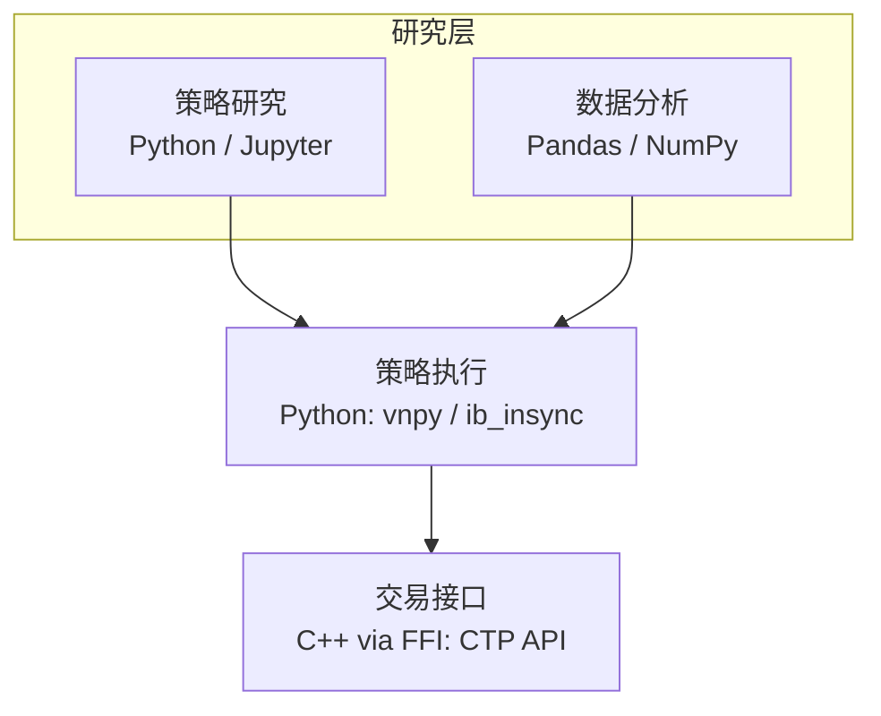
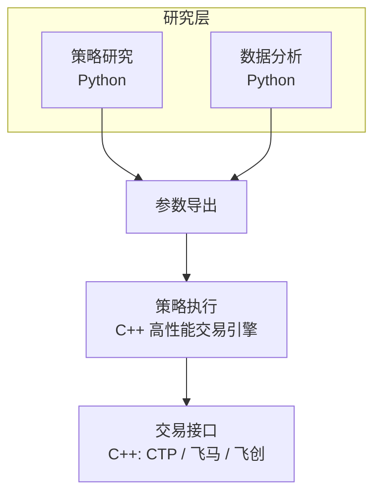
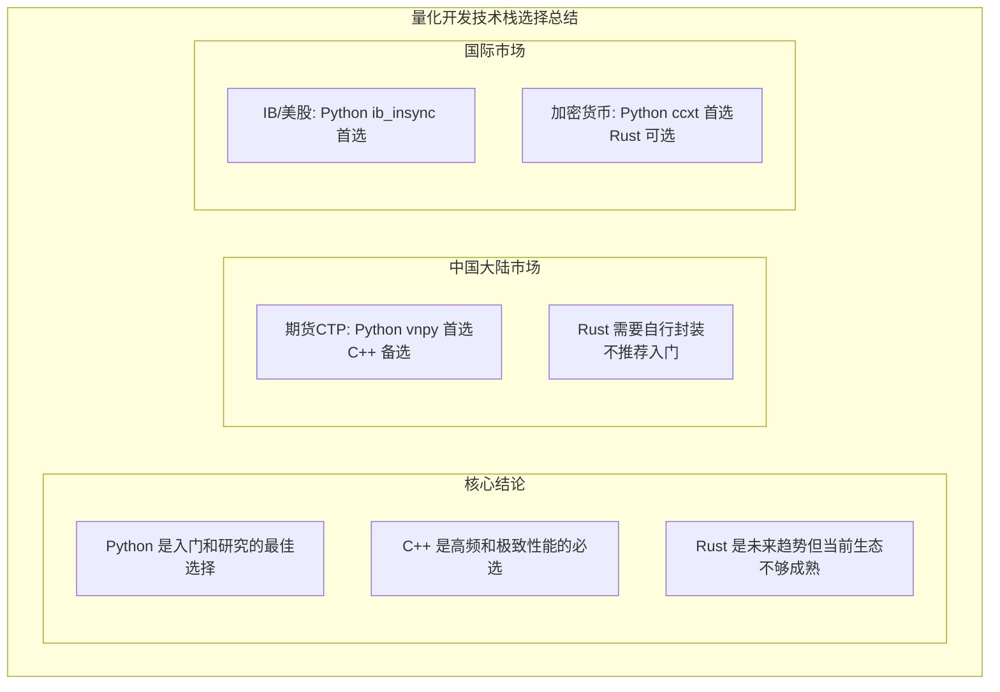

+++
title = "21 - 量化开发技术栈选择：Python vs C++ vs Rust"
date = 2025-01-18
description = "深入分析个人量化交易的编程语言选择：Python、C++、Rust的优劣对比，中国大陆与国际市场的接口支持情况"
[taxonomies]
tags = ["quant", "programming", "python", "cpp", "rust", "china-market", "global-market"]
+++

## 概述

选择合适的编程语言是量化交易的重要决策。本文将详细解答：

- Python、C++、Rust 各自的优劣是什么？
- 中国大陆 CTP 只支持 C++ 吗？
- Rust 在量化交易中的现状如何？
- 不同市场（中国/国际/加密货币）的语言支持情况？
- 个人应该如何选择？

---

## 一、语言特性对比

### 1.1 Python

**Python 在量化交易中的定位：**

**核心优势：**

✅ **开发效率极高**
- 语法简洁，代码量少
- 快速验证想法
- 迭代速度快

✅ **生态系统完善**
- NumPy/Pandas: 数据处理
- Matplotlib/Seaborn: 可视化
- Scikit-learn/XGBoost: 机器学习
- Statsmodels: 统计分析
- Backtrader/Zipline: 回测框架

✅ **量化专用库丰富**
- vnpy: 中国期货交易框架
- ccxt: 加密货币统一接口
- ib_insync: IB 接口封装
- tushare/akshare: 数据获取

✅ **学习成本低**
- 入门简单
- 资料丰富
- 社区活跃

✅ **策略研究首选**
- Jupyter Notebook 交互分析
- 快速原型开发

---

**主要劣势：**

❌ **执行速度慢**
- 解释型语言
- GIL 限制多线程
- 比 C++ 慢 10-100 倍

❌ **不适合极低延迟场景**
- 高频交易不适合
- 毫秒级策略可能有压力

❌ **运行时错误多**
- 动态类型，编译时不检查
- 线上可能出现类型错误

**适用场景：**
- 策略研究和回测 ⭐⭐⭐⭐⭐
- 中低频实盘交易 ⭐⭐⭐⭐
- 数据分析 ⭐⭐⭐⭐⭐
- 高频交易 ⭐（不推荐）

### 1.2 C++

**C++ 在量化交易中的定位：**

**核心优势：**

✅ **极致性能**
- 编译型语言，运行速度快
- 内存控制精细
- 可做底层优化
- 微秒级延迟可达

✅ **官方接口支持**
- CTP 官方 C++ API
- 飞马/飞创等极速系统
- 大多数交易所原生支持

✅ **内存安全（相对）**
- 编译时类型检查
- 无 GC 停顿
- 确定性的性能

✅ **行业标准**
- HFT 公司首选
- 机构主流语言
- 就业机会多

---

**主要劣势：**

❌ **开发效率低**
- 代码量大
- 编译时间长
- 迭代速度慢

❌ **学习曲线陡峭**
- 语言复杂
- 内存管理困难
- 需要深入理解

❌ **容易出 bug**
- 内存泄漏
- 悬空指针
- 未定义行为

❌ **跨平台麻烦**
- 编译配置复杂
- 依赖管理困难

**适用场景：**
- 高频交易 ⭐⭐⭐⭐⭐
- 极低延迟需求 ⭐⭐⭐⭐⭐
- 机构级生产系统 ⭐⭐⭐⭐⭐
- 个人中低频策略 ⭐⭐（过度）
- 快速原型 ⭐（不推荐）

### 1.3 Rust

**Rust 在量化交易中的定位：**

**核心优势：**

✅ **性能媲美 C++**
- 零成本抽象
- 编译优化强
- 无 GC

✅ **内存安全**
- 所有权系统
- 编译时检查
- 无悬空指针
- 无数据竞争

✅ **现代语言特性**
- 强类型系统
- 模式匹配
- 错误处理优雅
- 包管理器（Cargo）

✅ **跨平台友好**
- 编译到多平台
- 依赖管理简单

✅ **并发安全**
- 编译时保证线程安全
- 无数据竞争

---

**主要劣势：**

❌ **量化生态不成熟**
- 缺少成熟的量化框架
- 第三方库相对较少
- 社区规模小于 Python/C++

❌ **CTP 无官方支持**
- 需要 FFI 封装 C++ 库
- 维护成本高
- 可能有兼容问题

❌ **学习曲线陡峭**
- 所有权概念需要适应
- 编译器要求严格
- 新手挫败感强

❌ **开发效率不如 Python**
- 写代码更谨慎
- 编译检查严格

**适用场景：**
- 高频交易 ⭐⭐⭐⭐（可行但生态待发展）
- 加密货币交易 ⭐⭐⭐⭐（生态较好）
- 个人中低频策略 ⭐⭐（可行但非最优）
- 追求安全性的系统 ⭐⭐⭐⭐⭐

### 1.4 综合对比

**三种语言综合对比：**

| 指标 | Python | C++ | Rust |
|------|--------|-----|------|
| 执行性能 | ★★☆ | ★★★★★ | ★★★★★ |
| 开发效率 | ★★★★★ | ★★☆ | ★★★ |
| 学习难度 | 低 | 高 | 高 |
| 量化生态 | ★★★★★ | ★★★★ | ★★ |
| CTP支持 | ★★★★ | ★★★★★ | ★★ |
| 加密货币支持 | ★★★★★ | ★★★ | ★★★★ |
| IB支持 | ★★★★★ | ★★★★ | ★★ |
| 内存安全 | ★★★★ | ★★ | ★★★★★ |
| 并发支持 | ★★★ | ★★★★ | ★★★★★ |
| 适合入门 | ★★★★★ | ★★ | ★★★ |
| 适合高频 | ★☆ | ★★★★★ | ★★★★★ |

---

## 二、中国大陆市场接口支持

### 2.1 CTP 接口

**CTP 各语言支持情况：**

**官方支持：**

**C++: ✅ 官方原生 API**
- 上期技术官方提供
- 文档完整
- 性能最佳

---

**社区封装：**

**Python: ✅ 完善支持**
- **vnpy**（最推荐）
  - 完整的交易框架
  - 活跃维护
  - 文档丰富
  - GitHub: vnpy/vnpy
- **ctpbee**
  - 轻量级封装
  - 易于二次开发
- **openctp-ctp**
  - 纯 Python 封装
  - 可用于研究

**Rust: ⚠️ 有限支持**
- 需要 FFI 封装 C++ 库
- 社区有一些尝试：ctp-rs (非官方)
- 但不够成熟
- 维护可能不及时
- 需要自行处理兼容问题

**Java: ⚠️ 有限支持**
- 社区有 JNI 封装
- 不是主流选择

**结论：**
- 中国期货量化：Python(vnpy) 或 C++ 是主流选择
- Rust 可行但需要更多工作，不推荐入门使用

### 2.2 其他中国接口

**中国其他交易接口的语言支持：**

**股票相关（受限）：**

**QMT（迅投）**
- Python: ✅ 有封装
- C++: ✅ 支持
- 需要券商支持

**PTrade（恒生）**
- Python: ✅ 支持
- 主要面向机构

**easytrader（开源）**
- Python: ✅
- 非官方接口
- 模拟键鼠操作
- 有一定风险

---

**数据接口：**

**Tushare**
- Python: ✅ 原生支持

**AKShare**
- Python: ✅ 原生支持

**Wind（万得）**
- Python: ✅ 有 API
- 需要付费订阅

**结论：**
- 中国市场 Python 生态最完善
- C++ 主要用于追求性能的场景

---

## 三、国际市场接口支持

### 3.1 Interactive Brokers

**Interactive Brokers API 语言支持：**

**官方支持：**
- Java: ✅ 官方原生
- C++: ✅ 官方支持
- C#: ✅ 官方支持

---

**社区封装：**

**Python: ✅ 完善支持（推荐）**
- **ib_insync**（最推荐）
  - 异步 API
  - 使用简单
  - 活跃维护
  - pip install ib_insync
- **ibapi** (官方)
  - 直接翻译的 Python 版本
  - 使用较复杂

**Rust: ⚠️ 有限支持**
- 社区有尝试
- ib-tws-rs (非官方)
- 不够成熟

**使用示例（ib_insync）：**

```python
from ib_insync import *

# 连接 IB Gateway
ib = IB()
ib.connect('127.0.0.1', 4002, clientId=1)

# 获取 SPY ETF 实时行情
contract = Stock('SPY', 'SMART', 'USD')
ib.qualifyContracts(contract)
ticker = ib.reqMktData(contract)
ib.sleep(2)
print(f"SPY 价格: {ticker.last}")

# 下单
order = LimitOrder('BUY', 10, ticker.last)
trade = ib.placeOrder(contract, order)

ib.disconnect()
```

### 3.2 加密货币交易所

**加密货币交易所 API 语言支持：**

**ccxt 库（推荐）：**
- Python: ✅ 官方原生支持
- JavaScript/TypeScript: ✅ 官方原生支持
- PHP: ✅ 官方支持
- 支持 100+ 交易所
- 统一的 API 接口
- 活跃维护
- pip install ccxt

---

**Rust 支持（较好）：**

**ccxt 的 Rust 绑定**
- ccxtr (社区)
- 不如 Python 版完善

**交易所原生 Rust SDK：**

| 交易所 | Rust 库 | 成熟度 |
|--------|---------|--------|
| Binance | binance-rs | ⭐⭐⭐⭐ 较好，支持现货+期货，WebSocket 支持，社区活跃维护 |
| OKX | okx-rs | ⭐⭐⭐ 可用，社区维护 |
| Bybit | bybit-rs | ⭐⭐⭐ 可用，社区维护 |
| Coinbase | coinbase-rs | ⭐⭐ 有限 |
| Kraken | krakenex-rs | ⭐⭐ 有限 |

**Binance Rust 支持详情：**
- GitHub: https://github.com/wisespace-io/binance-rs
- 功能：市场数据、交易、账户管理
- 现货 API ✅
- 期货 API ✅
- WebSocket 实时数据 ✅
- 用户流 ✅
- 维护状态：活跃
- 适合 Rust 开发者做加密货币量化

**结论：**
- 加密货币是 Rust 在量化中生态最好的领域
- Python (ccxt) 仍然是最方便的选择
- Rust 如果追求性能可考虑原生 SDK

```python
# ccxt 示例
import ccxt

exchange = ccxt.binance({
    'apiKey': 'YOUR_API_KEY',
    'secret': 'YOUR_SECRET',
})

# 获取行情
ticker = exchange.fetch_ticker('BTC/USDT')
print(f"BTC 价格: {ticker['last']}")

# 下单
order = exchange.create_limit_buy_order('BTC/USDT', 0.001, 40000)
```

```rust
// Rust binance-rs 示例
use binance::api::*;
use binance::market::*;

let market: Market = Binance::new(None, None);
match market.get_price("BTCUSDT") {
    Ok(price) => println!("BTC 价格: {}", price.price),
    Err(e) => println!("错误: {}", e),
}
```

### 3.3 Alpaca

**Alpaca API 语言支持：**

**官方支持：**
- **Python: ✅ 官方 SDK**
  - alpaca-trade-api
  - 文档完善
  - 零佣金
- JavaScript/TypeScript: ✅ 官方 SDK
- Go: ✅ 官方 SDK
- C#: ✅ 官方 SDK

**其他支持：**
- **Rust: ⚠️ 社区维护**
  - alpaca-rs (非官方)
  - 可用但非主流
- **C++: ❌ 无官方支持**
  - 可通过 REST API 自行实现

---

## 四、不同场景的推荐

### 4.1 按市场推荐

**不同市场的语言推荐：**

**中国大陆期货（CTP）：**

🥇 **首选: Python (vnpy)**
- 生态完善
- 入门简单
- 中低频够用

🥈 **次选: C++**
- 追求极致性能
- 有 C++ 经验
- 日内高频需求

🥉 **备选: Rust**
- 有 Rust 经验且愿意折腾
- 需要自行封装 CTP
- 不推荐新手

---

**美股/全球市场（IB）：**

🥇 **首选: Python (ib_insync)**
- 封装完善
- 开发高效

🥈 **次选: Java/C++ (官方 API)**
- 追求性能

---

**加密货币：**

🥇 **首选: Python (ccxt)**
- 支持最广
- 开发最快

🥈 **次选: Rust**
- 生态相对较好
- 追求性能和安全

🥉 **备选: TypeScript/JavaScript**
- ccxt 官方支持
- Web 开发者友好

### 4.2 按策略类型推荐

**不同策略类型的语言推荐：**

**策略研究/回测：**
🥇 **Python**
- Jupyter Notebook
- 快速迭代
- 数据分析库丰富

**中低频策略实盘：**
🥇 **Python**
- 开发效率高
- 速度够用
- 维护简单

**日内短线：**
- 🥇 Python（大多数情况）
- 🥈 C++（追求极致）

**高频交易：**
🥇 **C++**
- 必须选择
- 无其他选项

🥈 **Rust（未来可期）**
- 性能媲美 C++
- 生态在发展

**机器学习策略：**
🥇 **Python**
- ML 生态无敌
- 唯一选择

### 4.3 按经验水平推荐

**不同经验水平的语言推荐：**

**编程新手：**
🥇 **Python**
- 入门最简单
- 资源最多
- 社区友好
- 先学会量化，再考虑优化

**有编程经验：**
🥇 **Python**
- 仍然是最高效的选择
- 可以专注策略逻辑

🥈 如果已熟悉 C++: 直接用 C++
🥈 如果已熟悉 Rust: 加密货币可用 Rust

**专业量化开发者：**
- 根据需求选择
- 研究用 Python
- 生产高频用 C++/Rust
- 多语言混合使用

---

## 五、混合语言架构

### 5.1 常见的混合架构

**架构1：Python 主导（个人/小团队推荐）**



> ✅ 优点：开发效率高，生态完善  
> ⚠️ 缺点：执行延迟可能略高  
> 🎯 适用：中低频策略

**架构2：C++ 主导（机构/高频推荐）**



> ✅ 优点：极致性能  
> ⚠️ 缺点：开发成本高，迭代慢  
> 🎯 适用：高频、对延迟敏感的策略

### 5.2 Python 调用 C++ 的方法

**Python 中使用 C++ 代码的方式：**

**1. ctypes（最简单）**
- Python 标准库
- 直接调用 C/C++ 动态库
- vnpy 使用这种方式

**2. pybind11（推荐）**
- 现代 C++/Python 绑定
- 语法友好
- 性能好

**3. Cython**
- 可以写类似 Python 的代码编译成 C
- 适合优化性能瓶颈

**4. SWIG**
- 自动生成绑定
- 支持多语言

**对于 CTP：**
- vnpy 已经帮你封装好了
- 直接用 `pip install vnpy_ctp`

---

## 六、全球 C++ 量化平台详解

如果你决定使用 C++ 进行量化交易，且不局限于中国大陆，以下是可以考虑的平台和品种：

### 6.1 全球 C++ 交易平台

**全球主要 C++ 量化交易平台：**

**1. Interactive Brokers (IB) ⭐ 强烈推荐**
- C++ API: 官方原生支持
- 覆盖市场: 150+ 全球市场
- 品种: 股票、期货、期权、外汇、债券
- 延迟: 毫秒级（非 HFT 级别）
- 文档: 完善，有 C++ 示例
- 适合: 个人量化的最佳选择

C++ 连接方式:
- TWS API（需运行 TWS 或 IB Gateway）
- 官方提供 EClient/EWrapper 类
- 支持 Windows/Linux/macOS

**2. CME Globex (芝加哥商品交易所)**
- 协议: FIX Protocol
- 品种: ES(标普期货)、NQ(纳指)、CL(原油)、GC(黄金)
- 延迟: 可达微秒级（需要 co-location）
- 门槛: 需要期货商（FCM）账户
- 费用: 连接费用较高
- 适合: 专业机构

**3. Nasdaq TotalView / NYSE Arca**
- 美股直连
- 需要会员资格或通过 broker
- 机构级别

**4. Eurex (欧洲期货交易所)**
- 欧洲衍生品市场
- C++ API 支持
- DAX 期货等

**5. SGX (新加坡交易所)**
- 亚洲时区
- A50 期货（与 A 股相关）
- C++ API 支持

### 6.2 C++ 个人量化研究顺序

**使用 C++ 进行全球量化的推荐路径：**

**阶段1：从 IB C++ API 开始**

原因:
- 个人可开户
- 官方 C++ 支持
- 覆盖全球市场
- 有模拟交易环境

步骤:
- [ ] 开设 IB 账户
- [ ] 下载 TWS API（包含 C++ 示例）
- [ ] 编译并运行示例程序
- [ ] 使用 Paper Trading 模拟
- [ ] 实现简单策略

**阶段2：美国 ETF/股票**

品种选择:
- SPY（标普500 ETF）
- QQQ（纳斯达克 ETF）
- 大盘股（AAPL, MSFT 等）

策略类型:
- ETF 轮动
- 动量策略
- 配对交易

**阶段3：美国期货（通过 IB）**

品种选择:
- MES（微型标普期货）← 推荐入门
- MNQ（微型纳指期货）
- 微型合约降低资金门槛

优势:
- 几乎 24 小时交易
- 高杠杆（注意风险）
- 趋势性好

**阶段4：加密货币（如果感兴趣）**
- C++ 不是首选（Rust/Python 更好）
- 但 Binance 等有 C++ SDK
- 或使用 REST/WebSocket API

**阶段5：专业期货直连（进阶）**
- CME Globex FIX 直连
- 需要更大资金和专业知识
- 延迟可降至微秒级
- 但成本高（机房托管等）

### 6.3 IB C++ API 示例

```cpp
// IB TWS API C++ 连接示例
#include "EClientSocket.h"
#include "EWrapper.h"
#include "Contract.h"
#include "Order.h"

class MyWrapper : public EWrapper {
public:
    void tickPrice(TickerId tickerId, TickType field, 
                   double price, const TickAttrib& attrib) override {
        std::cout << "Price update: " << price << std::endl;
    }
    
    void orderStatus(OrderId orderId, const std::string& status,
                     double filled, double remaining, 
                     double avgFillPrice, ...) override {
        std::cout << "Order " << orderId << " status: " << status << std::endl;
    }
    
    // ... 实现其他回调方法
};

int main() {
    MyWrapper wrapper;
    EClientSocket client(&wrapper);
    
    // 连接 TWS 或 IB Gateway
    client.eConnect("127.0.0.1", 7497, 0);
    
    // 定义合约
    Contract contract;
    contract.symbol = "SPY";
    contract.secType = "STK";
    contract.exchange = "SMART";
    contract.currency = "USD";
    
    // 请求行情
    client.reqMktData(1, contract, "", false, false, {});
    
    // 下单
    Order order;
    order.action = "BUY";
    order.totalQuantity = 100;
    order.orderType = "MKT";
    client.placeOrder(1, contract, order);
    
    // 事件循环
    while (client.isConnected()) {
        client.processMessages();
    }
    
    return 0;
}
```

### 6.4 C++ vs Python 的取舍

**何时选择 C++，何时选择 Python：**

**选择 C++ 的情况：**
- ✅ 对延迟有严格要求（< 10ms）
- ✅ 已经熟悉 C++
- ✅ 计划做日内高频策略
- ✅ 需要与 CTP 原生 API 集成
- ✅ 长期运行的生产系统

**选择 Python 的情况：**
- ✅ 策略研究和回测
- ✅ 快速原型开发
- ✅ 中低频策略
- ✅ 机器学习策略
- ✅ 入门学习

**务实建议：**
- 90% 的个人量化用 Python 就够了
- 先用 Python 验证策略可行
- 确实需要更快再考虑 C++ 重写
- 不要为了"可能需要"而选择 C++

---

## 七、Rust 的特殊讨论

### 7.1 Rust 的现状

**Rust 在量化交易中的现状：**

**生态成熟度评估：**

**数据处理**
- polars: 类似 Pandas，性能更好 ⭐⭐⭐⭐
- ndarray: 类似 NumPy ⭐⭐⭐
- 可用但生态不如 Python 完善

**回测框架**
- 没有成熟的量化回测框架 ⭐
- 需要自行开发或移植

**CTP 支持**
- 需要 FFI 封装 ⭐⭐
- 社区有尝试但不成熟
- 维护成本高

**加密货币**
- 相对较好 ⭐⭐⭐⭐
- 有 Binance 等 SDK
- 交易所对 Rust 友好

**IB/美股**
- 社区有尝试 ⭐⭐
- 不如 Python 成熟

---

**总体评估：**
- Rust 作为系统编程语言非常优秀
- 但在量化交易领域生态还在发展中
- **适合：**
  - 有 Rust 经验的开发者
  - 愿意投入时间构建基础设施
  - 追求高性能和安全性
  - 加密货币交易（生态较好）
- **不适合：**
  - 量化入门者
  - 需要快速上线
  - 中国期货（CTP 支持不佳）

### 7.2 Rust 适用场景

**Rust 在量化中的适用场景：**

**✅ 适合用 Rust 的场景：**

**1. 加密货币量化**
- 交易所 API 有 Rust SDK
- 7x24 运行需要稳定性
- 高性能需求

**2. 高频交易核心组件**
- 订单路由
- 撮合引擎
- 与 C++ 性能相当
- 更安全

**3. 基础设施组件**
- 数据处理管道
- 行情分发系统
- 风控系统

**4. 性能关键的独立模块**
- 用 Rust 实现，Python 调用
- 如复杂的数学计算

---

**❌ 不适合用 Rust 的场景：**

**1. 量化策略入门学习**
- 学习成本太高
- 会分散对策略的注意力

**2. 中国期货交易**
- CTP 没有官方支持
- 封装维护成本高

**3. 快速原型开发**
- 开发效率不如 Python
- 迭代速度慢

**4. 策略研究和回测**
- 生态不完善
- 没有 Jupyter 这样的工具

---

## 八、学习路径建议

### 8.1 个人量化学习路径

**个人量化交易技术学习路径：**

**阶段1：入门（1-3个月）**

语言：Python

重点：
- [ ] Python 基础语法
- [ ] Pandas/NumPy 数据处理
- [ ] Matplotlib 可视化
- [ ] 量化基础概念
- [ ] 第一个简单策略

**阶段2：回测研究（2-4个月）**

语言：Python

重点：
- [ ] Backtrader/vnpy 回测框架
- [ ] 策略开发方法论
- [ ] 过拟合与样本外测试
- [ ] 多种策略类型

**阶段3：实盘入门（2-3个月）**

语言：Python (vnpy)

重点：
- [ ] CTP 接口使用（期货）
- [ ] 或 ib_insync（美股）
- [ ] 或 ccxt（加密货币）
- [ ] 模拟盘验证
- [ ] 小资金实盘

**阶段4：进阶优化（持续）**

根据需求选择：
- [ ] 如需更快速度：学习 C++
- [ ] 如需更安全/加密货币：学习 Rust
- [ ] 如专注策略研究：深入 Python 和机器学习

**核心建议：**
- 从 Python 开始，先学会量化
- 速度问题可以后期解决
- 不要被语言选择耽误了入门

### 8.2 语言学习资源

**各语言的量化学习资源：**

**Python 量化**
- vnpy 官方文档和示例
- 《Python for Finance》
- 《Algorithmic Trading with Python》
- JoinQuant/RiceQuant 平台教程
- Quantopian 历史教程

**C++ 量化**
- CTP 官方 API 文档
- 《C++ Primer》
- 《Effective C++》
- GitHub: CTP 开源项目

**Rust 量化**
- 《The Rust Programming Language》
- 《Programming Rust》
- binance-rs 文档
- polars 文档

---

## 九、总结



**按经验建议：**
- 新手: Python，不要犹豫
- 有 C++ 经验: 可直接用 C++
- 有 Rust 经验: 加密货币可用 Rust

**实用主义原则：**
- 语言是工具，策略才是核心
- 先能跑起来，再考虑优化
- 不要过早优化，不要技术选型纠结症
- 99% 的个人策略 Python 都够用

---

## 相关文章

- [上一篇：20 - 极速交易系统详解](/articles/quant/quant-20-极速交易系统详解/)
- [下一篇：22 - C++ 个人量化交易实战](/articles/quant/quant-22-Cpp个人量化交易实战/)
- [18 - 个人自动化量化交易入门](/articles/quant/quant-18-个人自动化量化交易入门/)
- [19 - CTP 期货开户与期货公司选择](/articles/quant/quant-19-CTP期货开户与期货公司选择/)
