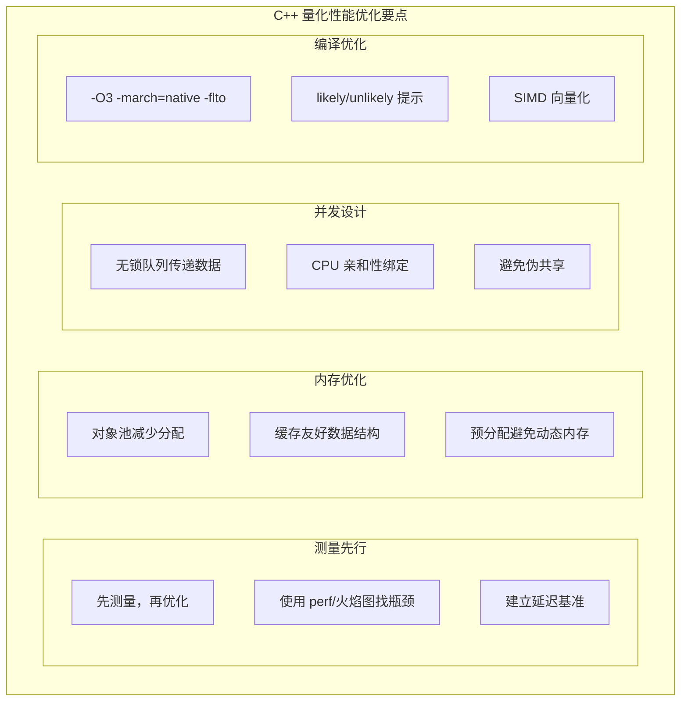

+++
title = "23. C++ 量化系统性能优化"
date = 2025-01-21
weight = 23000
description = "个人量化交易系统的 C++ 性能优化：延迟分析、内存优化、并发设计、编译器优化、实战案例"
[taxonomies]
tags = ["quant", "cpp", "performance", "optimization", "low-latency"]
+++

## 概述

对于个人量化交易者，特别是期货日内交易，性能优化直接影响策略效果。本文介绍 C++ 量化系统的性能优化方法，从基础到进阶。

**本文解答：**

- 如何测量和分析系统延迟？
- 内存管理如何优化？
- 如何设计高效的并发架构？
- 编译器优化有哪些技巧？
- 有哪些实战优化案例？

---

## 一、延迟分析基础

### 1.1 延迟测量

```cpp
#include <chrono>
#include <vector>
#include <algorithm>
#include <numeric>

namespace quant {

// 高精度时间戳
using Clock = std::chrono::high_resolution_clock;
using TimePoint = Clock::time_point;
using Duration = std::chrono::nanoseconds;

// 获取纳秒时间戳
inline int64_t now_nanos() {
    return std::chrono::duration_cast<Duration>(
        Clock::now().time_since_epoch()
    ).count();
}

// 延迟统计器
class LatencyStats {
public:
    void record(int64_t latency_ns) {
        samples_.push_back(latency_ns);
    }
    
    void report(const std::string& name) const {
        if (samples_.empty()) return;
        
        auto sorted = samples_;
        std::sort(sorted.begin(), sorted.end());
        
        double mean = std::accumulate(sorted.begin(), sorted.end(), 0.0) / sorted.size();
        int64_t min = sorted.front();
        int64_t max = sorted.back();
        int64_t p50 = sorted[sorted.size() * 0.50];
        int64_t p99 = sorted[sorted.size() * 0.99];
        int64_t p999 = sorted[sorted.size() * 0.999];
        
        printf("\n=== %s Latency (ns) ===\n", name.c_str());
        printf("  Count: %zu\n", sorted.size());
        printf("  Mean:  %.0f\n", mean);
        printf("  Min:   %ld\n", min);
        printf("  Max:   %ld\n", max);
        printf("  P50:   %ld\n", p50);
        printf("  P99:   %ld\n", p99);
        printf("  P99.9: %ld\n", p999);
    }
    
    void reset() { samples_.clear(); }
    
private:
    std::vector<int64_t> samples_;
};

// RAII 延迟测量
class ScopedLatency {
public:
    ScopedLatency(LatencyStats& stats) 
        : stats_(stats), start_(now_nanos()) {}
    
    ~ScopedLatency() {
        stats_.record(now_nanos() - start_);
    }
    
private:
    LatencyStats& stats_;
    int64_t start_;
};

} // namespace quant

// 使用示例
quant::LatencyStats order_latency;

void process_order() {
    quant::ScopedLatency sl(order_latency);
    // ... 订单处理逻辑
}

// 定期输出报告
order_latency.report("Order Processing");
```

### 1.2 系统调用延迟

**常见操作延迟参考：**

| 操作 | 典型延迟 |
|------|----------|
| L1 缓存访问 | 1 ns |
| L2 缓存访问 | 4 ns |
| L3 缓存访问 | 20 ns |
| 主内存访问 | 100 ns |
| 系统调用 (getpid) | 200-500 ns |
| 上下文切换 | 1-10 μs |
| Mutex lock/unlock | 25-100 ns |
| Spinlock lock/unlock | 10-50 ns |
| 原子操作 | 10-50 ns |
| 内存分配 (malloc) | 100-500 ns |
| 局域网 RTT | 100-500 μs |
| SSD 随机读 | 100 μs |
| HDD 随机读 | 10 ms |

**优化目标：**
- 策略计算：< 10 μs
- 订单处理：< 100 μs
- 完整 tick-to-trade：< 1 ms

### 1.3 性能分析工具

```bash
# perf - Linux 性能分析
perf record -g ./trading_system
perf report

# perf stat - 统计
perf stat -e cycles,instructions,cache-misses ./trading_system

# 火焰图
perf record -g ./trading_system
perf script | stackcollapse-perf.pl | flamegraph.pl > flame.svg

# Valgrind - 内存分析
valgrind --tool=cachegrind ./trading_system

# AddressSanitizer - 内存错误检测
g++ -fsanitize=address -g main.cpp -o main
```

---

## 二、内存优化

### 2.1 对象池

```cpp
#include <vector>
#include <memory>
#include <mutex>

namespace quant {

// 固定大小对象池
template<typename T, size_t BlockSize = 64>
class ObjectPool {
public:
    ObjectPool() {
        allocate_block();
    }
    
    ~ObjectPool() {
        for (auto* block : blocks_) {
            ::operator delete(block);
        }
    }
    
    T* acquire() {
        std::lock_guard<std::mutex> lock(mutex_);
        
        if (free_list_.empty()) {
            allocate_block();
        }
        
        T* obj = free_list_.back();
        free_list_.pop_back();
        return new (obj) T();  // placement new
    }
    
    void release(T* obj) {
        if (!obj) return;
        obj->~T();  // 显式调用析构函数
        
        std::lock_guard<std::mutex> lock(mutex_);
        free_list_.push_back(obj);
    }
    
private:
    void allocate_block() {
        // 分配一个块
        void* block = ::operator new(BlockSize * sizeof(T));
        blocks_.push_back(block);
        
        // 将块中的对象加入 free list
        T* ptr = static_cast<T*>(block);
        for (size_t i = 0; i < BlockSize; ++i) {
            free_list_.push_back(ptr + i);
        }
    }
    
    std::vector<void*> blocks_;
    std::vector<T*> free_list_;
    std::mutex mutex_;
};

// 无锁版本（单线程使用）
template<typename T, size_t BlockSize = 64>
class LockFreeObjectPool {
public:
    T* acquire() {
        if (free_list_.empty()) {
            allocate_block();
        }
        T* obj = free_list_.back();
        free_list_.pop_back();
        return new (obj) T();
    }
    
    void release(T* obj) {
        if (!obj) return;
        obj->~T();
        free_list_.push_back(obj);
    }
    
private:
    void allocate_block() {
        auto block = std::make_unique<std::array<T, BlockSize>>();
        for (auto& obj : *block) {
            free_list_.push_back(&obj);
        }
        blocks_.push_back(std::move(block));
    }
    
    std::vector<std::unique_ptr<std::array<T, BlockSize>>> blocks_;
    std::vector<T*> free_list_;
};

} // namespace quant
```

### 2.2 环形缓冲区

```cpp
#include <array>
#include <atomic>
#include <optional>

namespace quant {

// 单生产者单消费者无锁队列
template<typename T, size_t Capacity>
class SPSCQueue {
    static_assert((Capacity & (Capacity - 1)) == 0, 
                  "Capacity must be power of 2");
public:
    bool push(const T& item) {
        size_t head = head_.load(std::memory_order_relaxed);
        size_t next = (head + 1) & (Capacity - 1);
        
        if (next == tail_.load(std::memory_order_acquire)) {
            return false;  // 队列满
        }
        
        buffer_[head] = item;
        head_.store(next, std::memory_order_release);
        return true;
    }
    
    std::optional<T> pop() {
        size_t tail = tail_.load(std::memory_order_relaxed);
        
        if (tail == head_.load(std::memory_order_acquire)) {
            return std::nullopt;  // 队列空
        }
        
        T item = buffer_[tail];
        tail_.store((tail + 1) & (Capacity - 1), std::memory_order_release);
        return item;
    }
    
    bool empty() const {
        return head_.load(std::memory_order_acquire) == 
               tail_.load(std::memory_order_acquire);
    }
    
    size_t size() const {
        size_t head = head_.load(std::memory_order_acquire);
        size_t tail = tail_.load(std::memory_order_acquire);
        return (head - tail + Capacity) & (Capacity - 1);
    }
    
private:
    std::array<T, Capacity> buffer_;
    alignas(64) std::atomic<size_t> head_{0};  // 避免伪共享
    alignas(64) std::atomic<size_t> tail_{0};
};

} // namespace quant

// 使用示例
quant::SPSCQueue<Tick, 1024> tick_queue;

// 生产者线程
void market_data_thread() {
    while (running) {
        Tick tick = receive_tick();
        tick_queue.push(tick);
    }
}

// 消费者线程
void strategy_thread() {
    while (running) {
        if (auto tick = tick_queue.pop()) {
            process_tick(*tick);
        }
    }
}
```

### 2.3 缓存友好设计

```cpp
// 热数据和冷数据分离
struct alignas(64) TickHot {  // 热数据，对齐到缓存行
    double last_price;
    double bid_price;
    double ask_price;
    int32_t bid_volume;
    int32_t ask_volume;
    int64_t timestamp;
    // 填充到 64 字节
    char padding[16];
};

struct TickCold {  // 冷数据，按需访问
    char symbol[16];
    char exchange[8];
    double open;
    double high;
    double low;
    double prev_close;
    double upper_limit;
    double lower_limit;
};

// SoA (Struct of Arrays) vs AoS (Array of Structs)
// AoS - 传统方式，缓存不友好
struct TickAoS {
    double price;
    int64_t volume;
    int64_t timestamp;
};
std::vector<TickAoS> ticks_aos;

// SoA - 缓存友好，适合批量处理
struct TicksSoA {
    std::vector<double> prices;
    std::vector<int64_t> volumes;
    std::vector<int64_t> timestamps;
    
    void reserve(size_t n) {
        prices.reserve(n);
        volumes.reserve(n);
        timestamps.reserve(n);
    }
    
    void push(double price, int64_t volume, int64_t ts) {
        prices.push_back(price);
        volumes.push_back(volume);
        timestamps.push_back(ts);
    }
    
    // SIMD 友好的批量计算
    double sum_prices() const {
        double sum = 0;
        for (size_t i = 0; i < prices.size(); ++i) {
            sum += prices[i];
        }
        return sum;
    }
};
```

---

## 三、并发设计

### 3.1 线程模型

```cpp
#include <thread>
#include <functional>

namespace quant {

// 交易系统线程模型
class TradingSystem {
public:
    void start() {
        running_ = true;
        
        // 1. 行情接收线程（高优先级）
        market_data_thread_ = std::thread([this] {
            set_thread_priority(SCHED_FIFO, 90);
            pin_to_cpu(0);  // 绑定到 CPU 0
            run_market_data();
        });
        
        // 2. 策略执行线程（高优先级）
        strategy_thread_ = std::thread([this] {
            set_thread_priority(SCHED_FIFO, 80);
            pin_to_cpu(1);  // 绑定到 CPU 1
            run_strategy();
        });
        
        // 3. 订单处理线程
        order_thread_ = std::thread([this] {
            set_thread_priority(SCHED_FIFO, 70);
            pin_to_cpu(2);
            run_order_handler();
        });
        
        // 4. 日志/监控线程（低优先级）
        monitor_thread_ = std::thread([this] {
            run_monitor();
        });
    }
    
    void stop() {
        running_ = false;
        if (market_data_thread_.joinable()) market_data_thread_.join();
        if (strategy_thread_.joinable()) strategy_thread_.join();
        if (order_thread_.joinable()) order_thread_.join();
        if (monitor_thread_.joinable()) monitor_thread_.join();
    }
    
private:
    // 绑定 CPU
    void pin_to_cpu(int cpu_id) {
        cpu_set_t cpuset;
        CPU_ZERO(&cpuset);
        CPU_SET(cpu_id, &cpuset);
        pthread_setaffinity_np(pthread_self(), sizeof(cpuset), &cpuset);
    }
    
    // 设置线程优先级
    void set_thread_priority(int policy, int priority) {
        sched_param param;
        param.sched_priority = priority;
        pthread_setschedparam(pthread_self(), policy, &param);
    }
    
    void run_market_data();
    void run_strategy();
    void run_order_handler();
    void run_monitor();
    
    std::atomic<bool> running_{false};
    std::thread market_data_thread_;
    std::thread strategy_thread_;
    std::thread order_thread_;
    std::thread monitor_thread_;
    
    SPSCQueue<Tick, 4096> tick_queue_;
    SPSCQueue<Order, 1024> order_queue_;
};

} // namespace quant
```

### 3.2 无锁数据共享

```cpp
#include <atomic>

namespace quant {

// 无锁状态共享
class alignas(64) SharedState {
public:
    // 原子读写基本类型
    double get_last_price() const {
        return last_price_.load(std::memory_order_acquire);
    }
    
    void set_last_price(double price) {
        last_price_.store(price, std::memory_order_release);
    }
    
    // 复合状态使用 SeqLock
    struct Position {
        int64_t quantity;
        double avg_price;
        double pnl;
    };
    
    Position get_position() const {
        while (true) {
            uint64_t seq1 = seq_.load(std::memory_order_acquire);
            if (seq1 & 1) continue;  // 写入中，重试
            
            Position pos = position_;
            std::atomic_thread_fence(std::memory_order_acquire);
            
            uint64_t seq2 = seq_.load(std::memory_order_relaxed);
            if (seq1 == seq2) return pos;
        }
    }
    
    void set_position(const Position& pos) {
        seq_.fetch_add(1, std::memory_order_release);  // 开始写入
        position_ = pos;
        seq_.fetch_add(1, std::memory_order_release);  // 完成写入
    }
    
private:
    alignas(64) std::atomic<double> last_price_{0};
    alignas(64) std::atomic<uint64_t> seq_{0};
    Position position_{};
};

} // namespace quant
```

### 3.3 避免锁竞争

```cpp
// 分片减少竞争
template<typename K, typename V, size_t Shards = 16>
class ShardedMap {
public:
    V* get(const K& key) {
        auto& shard = get_shard(key);
        std::shared_lock lock(shard.mutex);
        auto it = shard.map.find(key);
        return it != shard.map.end() ? &it->second : nullptr;
    }
    
    void put(const K& key, const V& value) {
        auto& shard = get_shard(key);
        std::unique_lock lock(shard.mutex);
        shard.map[key] = value;
    }
    
private:
    struct Shard {
        std::shared_mutex mutex;
        std::unordered_map<K, V> map;
    };
    
    Shard& get_shard(const K& key) {
        size_t hash = std::hash<K>{}(key);
        return shards_[hash % Shards];
    }
    
    std::array<Shard, Shards> shards_;
};

// 使用 thread_local 避免锁
class OrderIdGenerator {
public:
    std::string generate() {
        static thread_local uint64_t counter = 0;
        static thread_local uint64_t thread_id = 
            std::hash<std::thread::id>{}(std::this_thread::get_id());
        
        return fmt::format("ORD_{:08X}_{:08X}", thread_id, ++counter);
    }
};
```

---

## 四、编译器优化

### 4.1 编译选项

```cmake
# CMakeLists.txt 优化配置

# Release 优化
set(CMAKE_CXX_FLAGS_RELEASE "-O3 -DNDEBUG")

# 针对当前 CPU 优化
set(CMAKE_CXX_FLAGS_RELEASE "${CMAKE_CXX_FLAGS_RELEASE} -march=native")

# 链接时优化 (LTO)
set(CMAKE_CXX_FLAGS_RELEASE "${CMAKE_CXX_FLAGS_RELEASE} -flto")
set(CMAKE_EXE_LINKER_FLAGS_RELEASE "${CMAKE_EXE_LINKER_FLAGS_RELEASE} -flto")

# 额外优化
set(CMAKE_CXX_FLAGS_RELEASE "${CMAKE_CXX_FLAGS_RELEASE} -ffast-math")
set(CMAKE_CXX_FLAGS_RELEASE "${CMAKE_CXX_FLAGS_RELEASE} -funroll-loops")

# 优化建议的警告
set(CMAKE_CXX_FLAGS "${CMAKE_CXX_FLAGS} -Wsuggest-final-types")
set(CMAKE_CXX_FLAGS "${CMAKE_CXX_FLAGS} -Wsuggest-final-methods")
```

### 4.2 分支预测

```cpp
// 使用 likely/unlikely 提示
#define likely(x)   __builtin_expect(!!(x), 1)
#define unlikely(x) __builtin_expect(!!(x), 0)

void process_tick(const Tick& tick) {
    // 正常情况：价格在合理范围
    if (likely(tick.last_price > 0 && tick.last_price < 1e9)) {
        // 正常处理路径
        update_orderbook(tick);
        calculate_signal(tick);
    } else {
        // 异常情况：极少发生
        handle_abnormal_tick(tick);
    }
}

// 使用 [[likely]] 和 [[unlikely]] (C++20)
void process_order_response(OrderStatus status) {
    switch (status) {
        case OrderStatus::Filled: [[likely]]
            on_fill();
            break;
        case OrderStatus::Rejected: [[unlikely]]
            on_reject();
            break;
        default:
            on_other();
    }
}
```

### 4.3 内联和强制内联

```cpp
// 建议内联
inline double calculate_mid_price(double bid, double ask) {
    return (bid + ask) * 0.5;
}

// 强制内联
__attribute__((always_inline))
inline void update_price_fast(double* __restrict__ dst, 
                              const double* __restrict__ src, 
                              size_t n) {
    for (size_t i = 0; i < n; ++i) {
        dst[i] = src[i];
    }
}

// 禁止内联（调试时有用）
__attribute__((noinline))
void debug_checkpoint(const char* msg);

// 热路径标记
__attribute__((hot))
void process_market_data(const Tick& tick);

// 冷路径标记
__attribute__((cold))
void handle_error(const std::string& error);
```

### 4.4 SIMD 向量化

```cpp
#include <immintrin.h>

// 手动 SIMD 优化
void calculate_returns_simd(const double* prices, double* returns, size_t n) {
    size_t i = 0;
    
    // AVX2: 一次处理 4 个 double
    for (; i + 4 <= n; i += 4) {
        __m256d p0 = _mm256_loadu_pd(&prices[i]);
        __m256d p1 = _mm256_loadu_pd(&prices[i + 1]);
        __m256d ret = _mm256_div_pd(
            _mm256_sub_pd(p1, p0),
            p0
        );
        _mm256_storeu_pd(&returns[i], ret);
    }
    
    // 处理剩余元素
    for (; i < n - 1; ++i) {
        returns[i] = (prices[i + 1] - prices[i]) / prices[i];
    }
}

// 利用编译器自动向量化
void calculate_returns_auto(const double* __restrict__ prices, 
                            double* __restrict__ returns, 
                            size_t n) {
    // __restrict__ 告诉编译器无别名
    // 编译器会自动向量化
    #pragma omp simd  // OpenMP SIMD 提示
    for (size_t i = 0; i < n - 1; ++i) {
        returns[i] = (prices[i + 1] - prices[i]) / prices[i];
    }
}
```

---

## 五、实战优化案例

### 5.1 订单簿优化

```cpp
// 优化前：使用 std::map
class OrderBookSlow {
    std::map<double, int64_t> bids_;
    std::map<double, int64_t> asks_;
};

// 优化后：使用 flat_map + 预分配
#include <boost/container/flat_map.hpp>

class OrderBookFast {
public:
    OrderBookFast() {
        bids_.reserve(100);
        asks_.reserve(100);
    }
    
    void update(double price, int64_t qty, bool is_bid) {
        auto& book = is_bid ? bids_ : asks_;
        if (qty == 0) {
            book.erase(price);
        } else {
            book[price] = qty;
        }
    }
    
private:
    // flat_map: 连续内存，缓存友好
    boost::container::flat_map<double, int64_t, std::greater<double>> bids_;
    boost::container::flat_map<double, int64_t, std::less<double>> asks_;
};

// 更极致：固定深度数组
class OrderBookUltraFast {
    static constexpr size_t MAX_DEPTH = 10;
    
    struct Level {
        double price = 0;
        int64_t qty = 0;
    };
    
    std::array<Level, MAX_DEPTH> bids_;
    std::array<Level, MAX_DEPTH> asks_;
    
public:
    double best_bid() const { return bids_[0].price; }
    double best_ask() const { return asks_[0].price; }
    double spread() const { return asks_[0].price - bids_[0].price; }
};
```

### 5.2 字符串优化

```cpp
// 优化前：频繁使用 std::string
std::string format_order(const std::string& symbol, double price, int qty) {
    return symbol + "|" + std::to_string(price) + "|" + std::to_string(qty);
}

// 优化后：使用 fmt 和预分配缓冲区
class OrderFormatter {
public:
    const char* format(const char* symbol, double price, int qty) {
        auto result = fmt::format_to_n(
            buffer_.data(), buffer_.size(),
            "{}|{:.2f}|{}",
            symbol, price, qty
        );
        *result.out = '\0';
        return buffer_.data();
    }
    
private:
    std::array<char, 256> buffer_;
};

// 更极致：固定长度 symbol
struct FixedSymbol {
    char data[16];
    
    FixedSymbol() { std::memset(data, 0, sizeof(data)); }
    FixedSymbol(const char* s) {
        std::strncpy(data, s, sizeof(data) - 1);
        data[sizeof(data) - 1] = '\0';
    }
    
    bool operator==(const FixedSymbol& other) const {
        return std::memcmp(data, other.data, sizeof(data)) == 0;
    }
};

// 自定义 hash
struct FixedSymbolHash {
    size_t operator()(const FixedSymbol& s) const {
        return std::hash<std::string_view>{}(
            std::string_view(s.data, std::strlen(s.data))
        );
    }
};
```

### 5.3 延迟优化对比

**优化效果对比（订单处理）：**

| 优化项目 | 优化前 | 优化后 | 提升 |
|----------|--------|--------|------|
| 订单簿更新 | 5μs | 200ns | 25x |
| 策略信号计算 | 10μs | 500ns | 20x |
| 订单序列化 | 2μs | 100ns | 20x |
| 风控检查 | 1μs | 50ns | 20x |
| 总 tick-to-order | 20μs | 1μs | 20x |

**关键优化点：**
1. 对象池减少内存分配
2. 无锁队列减少锁竞争
3. 缓存友好数据结构
4. 编译器优化选项
5. CPU 亲和性绑定

---

## 六、调试和测试

### 6.1 性能基准测试

```cpp
#include <benchmark/benchmark.h>

// 订单簿更新基准
static void BM_OrderBookUpdate(benchmark::State& state) {
    OrderBook book;
    double price = 100.0;
    
    for (auto _ : state) {
        book.update(price, 1000, true);
        price += 0.01;
        if (price > 110.0) price = 100.0;
    }
}
BENCHMARK(BM_OrderBookUpdate);

// EMA 计算基准
static void BM_EMA(benchmark::State& state) {
    std::vector<double> prices(10000);
    std::generate(prices.begin(), prices.end(), 
                  [n=100.0]() mutable { return n += (rand() % 100 - 50) * 0.01; });
    
    for (auto _ : state) {
        calculate_ema(prices, 20);
    }
}
BENCHMARK(BM_EMA)->Iterations(1000);

BENCHMARK_MAIN();
```

### 6.2 延迟测试框架

```cpp
class LatencyTest {
public:
    void run(int iterations = 10000) {
        // 预热
        for (int i = 0; i < 1000; ++i) {
            run_once();
        }
        
        // 正式测试
        stats_.reset();
        for (int i = 0; i < iterations; ++i) {
            auto start = now_nanos();
            run_once();
            auto end = now_nanos();
            stats_.record(end - start);
        }
        
        stats_.report("Test");
    }
    
protected:
    virtual void run_once() = 0;
    
private:
    LatencyStats stats_;
};

// 使用
class OrderProcessingTest : public LatencyTest {
protected:
    void run_once() override {
        Order order = create_test_order();
        order_manager_.process(order);
    }
    
private:
    OrderManager order_manager_;
};
```

---

## 七、总结



> **"性能优化的第一法则：测量，测量，再测量。"**

---

## 相关文章

- [上一篇：22 - C++ 个人量化交易实战](@/articles/quant/quant-22-Cpp个人量化交易实战.md)
- [下一篇：24 - A股程序化交易接口：QMT 与 Ptrade](@/articles/quant/quant-24-A股程序化交易接口QMT与Ptrade.md)
- [21 - 量化开发技术栈选择](@/articles/quant/quant-21-量化开发技术栈选择.md)
