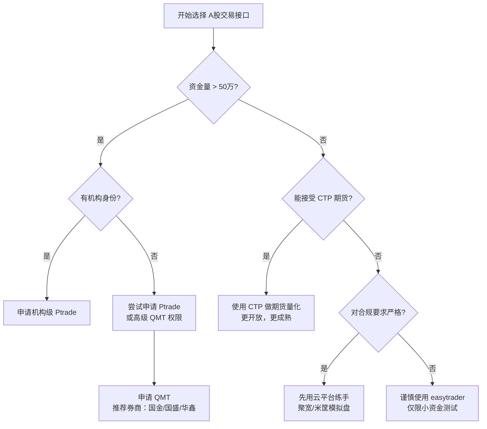
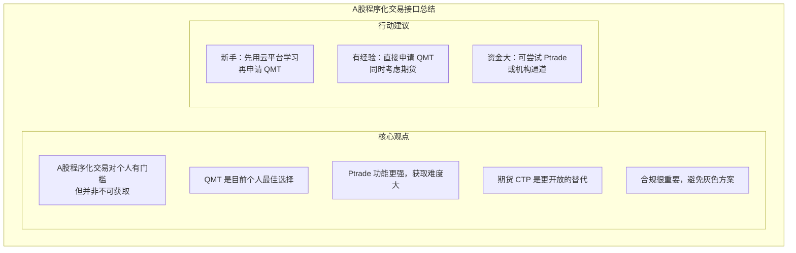

+++
title = "24. A股程序化交易接口：QMT 与 Ptrade 详解"
date = 2025-01-21
weight = 24000
description = "A股程序化交易接口完整指南：QMT（迅投）和 Ptrade（恒生）的详细介绍、申请条件、使用方法、代码示例及选型建议"
[taxonomies]
tags = ["quant", "a-stock", "qmt", "ptrade", "trading-api", "china-market"]
+++

## 概述

A股市场的程序化交易一直是个人量化交易者面临的难题。与期货市场（CTP 接口开放）不同，A股对个人程序化交易限制较多。本文详细介绍目前个人可获取的主要接口：**QMT（迅投）** 和 **Ptrade（恒生）**。

**本文解答：**

- A股程序化交易有哪些限制？
- QMT 是什么？如何申请和使用？
- Ptrade 是什么？个人能否使用？
- 还有哪些替代方案？
- 如何选择适合自己的方案？

---

## 一、A股程序化交易现状

### 1.1 政策与限制

**A股程序化交易的监管现状：**

**监管态度：**
- 2015年股灾后，监管对程序化交易趋严
- 2019年《证券法》修订，明确程序化交易需报告
- 2023年发布《程序化交易管理办法》征求意见稿
- 整体趋势：规范化，而非禁止

**对个人的影响：**
- 券商对个人开放接口非常谨慎
- 通常有资金门槛（50万-100万+）
- 需签署相关协议
- 部分策略类型受限（如高频）

**合规要点：**
- 不得利用程序化交易操纵市场
- 不得频繁报撤单干扰正常交易
- 需配合券商和交易所的监控要求

### 1.2 可用接口概览

**A股程序化交易接口分类：**

**官方/半官方接口：**
- QMT（迅投 MiniQMT） ★★★★ 个人首选
- Ptrade（恒生） ★★★ 机构为主，个人困难
- 券商专属接口 ★★ 极少数券商提供

**第三方接口：**
- easytrader ★★ 模拟操作，有风险
- 各类 RPA 方案 ★ 不稳定，不推荐

**云端量化平台：**
- 聚宽/米筐模拟盘 ★★★ 仅支持模拟，练手用
- 果仁网等 ★★ 功能有限

**期货接口（对比）：**
- CTP ★★★★★ 开放度最高

**推荐路径：个人 A股量化 → 优先申请 QMT → 备选 Ptrade → 期货用 CTP**

---

## 二、QMT（迅投）详解

### 2.1 什么是 QMT

**QMT 产品体系：**

- **QMT 全称**：迅投 QMT 量化交易系统
- **开发商**：迅投（厦门）科技有限公司

**产品形态：**

**1. QMT 客户端（完整版）**
- 图形化界面
- 内置策略编辑器
- 支持 Python 策略
- 回测 + 模拟 + 实盘

**2. MiniQMT（精简版）★ 个人常用**
- 无图形界面
- 纯 Python API
- 更灵活，可集成到自己的系统
- 资源占用更少

**3. XtQuant（数据接口）**
- 行情数据接口
- 可独立使用

### 2.2 支持的券商

**目前支持 QMT 的主要券商（2024-2025）：**

**头部券商（接入较完善）：**
- 国金证券 ★★★★ MiniQMT 支持好
- 国盛证券 ★★★★ 门槛相对较低
- 华鑫证券 ★★★★ 支持较早
- 东方财富 ★★★ 需一定资金量
- 国信证券 ★★★ 机构偏多

**其他券商：**
- 中泰证券、湘财证券、华宝证券等
- 具体支持情况需咨询券商

**注意事项：**
- 券商政策经常变化，以官方最新信息为准
- 同一券商不同营业部政策可能不同
- 建议开户前先确认 QMT 支持情况

### 2.3 申请条件

**QMT 申请条件（以常见情况为例）：**

**资金门槛：**
- 最低要求：通常 10-50 万（券商差异大）
- 常见门槛：30-50 万
- 部分券商：无硬性门槛，但可能有交易量要求

**申请流程：**
1. 在支持 QMT 的券商开户
2. 满足资金/交易条件
3. 联系客户经理申请 QMT 权限
4. 签署《程序化交易风险揭示书》等协议
5. 获取 QMT 账号和软件下载地址
6. 下载安装，配置连接

**申请技巧：**
- 开户时直接说明需要 QMT
- 选择对量化友好的营业部
- 通过量化社区了解最新政策
- 可以先申请模拟权限熟悉系统

### 2.4 MiniQMT 使用示例

```python
"""
MiniQMT (XtQuant) 基础使用示例
需要先安装：pip install xtquant
"""

from xtquant import xtdata
from xtquant.xttrader import XtQuantTrader
from xtquant.xttype import StockAccount
from xtquant import xtconstant
import time

# ============================================
# 一、行情数据获取
# ============================================

def get_market_data():
    """获取行情数据示例"""
    
    # 获取最新行情
    data = xtdata.get_full_tick(['000001.SZ', '600000.SH'])
    print("最新行情:", data)
    
    # 获取历史 K 线
    kline = xtdata.get_market_data(
        field_list=['open', 'high', 'low', 'close', 'volume'],
        stock_list=['000001.SZ'],
        period='1d',
        start_time='20240101',
        end_time='20241231'
    )
    print("历史K线:", kline)
    
    # 订阅实时行情
    def on_tick(data):
        print(f"实时行情: {data}")
    
    xtdata.subscribe_quote(
        stock_code='000001.SZ',
        period='tick',
        callback=on_tick
    )

# ============================================
# 二、交易接口
# ============================================

class MyTradeCallback:
    """交易回调处理"""
    
    def on_disconnected(self):
        print("连接断开")
    
    def on_account_status(self, status):
        print(f"账户状态: {status}")
    
    def on_stock_order(self, order):
        print(f"订单回报: {order.order_id}, 状态: {order.order_status}")
    
    def on_stock_trade(self, trade):
        print(f"成交回报: {trade.order_id}, 成交价: {trade.traded_price}")
    
    def on_order_error(self, order_id, error_msg):
        print(f"订单错误: {order_id}, {error_msg}")

def init_trader():
    """初始化交易接口"""
    
    # 创建交易对象
    session_id = int(time.time())
    trader = XtQuantTrader(
        path='/path/to/userdata',  # MiniQMT 用户数据目录
        session=session_id
    )
    
    # 创建回调对象
    callback = MyTradeCallback()
    trader.register_callback(callback)
    
    # 启动交易线程
    trader.start()
    
    # 连接服务器
    connect_result = trader.connect()
    if connect_result != 0:
        print("连接失败")
        return None
    
    # 订阅账户
    account = StockAccount('your_account_id')
    trader.subscribe(account)
    
    return trader, account

def place_order(trader, account):
    """下单示例"""
    
    # 买入
    order_id = trader.order_stock(
        account=account,
        stock_code='000001.SZ',
        order_type=xtconstant.STOCK_BUY,      # 买入
        order_volume=100,                       # 100股
        price_type=xtconstant.FIX_PRICE,       # 限价
        price=10.50                             # 价格
    )
    print(f"买入订单ID: {order_id}")
    
    # 卖出
    order_id = trader.order_stock(
        account=account,
        stock_code='000001.SZ',
        order_type=xtconstant.STOCK_SELL,     # 卖出
        order_volume=100,
        price_type=xtconstant.FIX_PRICE,
        price=11.00
    )
    print(f"卖出订单ID: {order_id}")
    
    # 市价单
    order_id = trader.order_stock(
        account=account,
        stock_code='000001.SZ',
        order_type=xtconstant.STOCK_BUY,
        order_volume=100,
        price_type=xtconstant.LATEST_PRICE,   # 最新价
        price=0
    )
    print(f"市价订单ID: {order_id}")

def query_position(trader, account):
    """查询持仓"""
    
    positions = trader.query_stock_positions(account)
    for pos in positions:
        print(f"股票: {pos.stock_code}")
        print(f"  持仓量: {pos.volume}")
        print(f"  可用量: {pos.can_use_volume}")
        print(f"  成本价: {pos.open_price}")
        print(f"  市值: {pos.market_value}")

def query_orders(trader, account):
    """查询订单"""
    
    orders = trader.query_stock_orders(account)
    for order in orders:
        print(f"订单: {order.order_id}")
        print(f"  股票: {order.stock_code}")
        print(f"  方向: {order.order_type}")
        print(f"  状态: {order.order_status}")
        print(f"  委托量: {order.order_volume}")
        print(f"  成交量: {order.traded_volume}")

# ============================================
# 三、简单策略示例
# ============================================

class SimpleStrategy:
    """
    简单均线策略示例
    仅供学习，非实盘建议
    """
    
    def __init__(self, trader, account, stock_code):
        self.trader = trader
        self.account = account
        self.stock_code = stock_code
        self.position = 0
        self.ma_short = 5
        self.ma_long = 20
    
    def calculate_ma(self, prices, period):
        """计算均线"""
        if len(prices) < period:
            return None
        return sum(prices[-period:]) / period
    
    def on_bar(self, bar_data):
        """K线触发"""
        closes = bar_data['close']
        
        ma5 = self.calculate_ma(closes, self.ma_short)
        ma20 = self.calculate_ma(closes, self.ma_long)
        
        if ma5 is None or ma20 is None:
            return
        
        current_price = closes[-1]
        
        # 金叉买入
        if ma5 > ma20 and self.position == 0:
            self.buy(current_price)
        
        # 死叉卖出
        elif ma5 < ma20 and self.position > 0:
            self.sell(current_price)
    
    def buy(self, price):
        """买入"""
        order_id = self.trader.order_stock(
            account=self.account,
            stock_code=self.stock_code,
            order_type=xtconstant.STOCK_BUY,
            order_volume=100,
            price_type=xtconstant.FIX_PRICE,
            price=price
        )
        print(f"买入信号: {self.stock_code} @ {price}")
        self.position = 100
    
    def sell(self, price):
        """卖出"""
        order_id = self.trader.order_stock(
            account=self.account,
            stock_code=self.stock_code,
            order_type=xtconstant.STOCK_SELL,
            order_volume=self.position,
            price_type=xtconstant.FIX_PRICE,
            price=price
        )
        print(f"卖出信号: {self.stock_code} @ {price}")
        self.position = 0

# ============================================
# 四、运行
# ============================================

if __name__ == '__main__':
    # 注意：需要 MiniQMT 客户端在后台运行
    
    # 获取行情数据（无需登录）
    get_market_data()
    
    # 交易功能（需要账户权限）
    # trader, account = init_trader()
    # place_order(trader, account)
    # query_position(trader, account)
```

### 2.5 QMT 优缺点

**QMT 优缺点分析：**

**✅ 优点：**
- 合规性好：券商官方支持，无灰色地带
- 功能完整：行情 + 交易 + 回测一体化
- Python 友好：MiniQMT 纯 Python API
- 稳定性高：生产级系统，稳定可靠
- 支持品种全：股票、ETF、可转债等
- 社区活跃：有较多用户分享经验

**⚠️ 缺点：**
- 门槛存在：需要一定资金量
- 券商限制：不是所有券商都支持
- 需要客户端：MiniQMT 需要后台运行客户端
- 延迟一般：不适合真正的高频交易
- 文档有限：官方文档不够详细
- 策略限制：部分券商对策略类型有要求

**适用场景：**
- 中低频 A股策略（日内到周级别）
- ETF 轮动策略
- 可转债套利
- 股票多因子策略

---

## 三、Ptrade（恒生）详解

### 3.1 什么是 Ptrade

**Ptrade 产品介绍：**

- **Ptrade 全称**：恒生 Ptrade 量化交易平台
- **开发商**：恒生电子股份有限公司

**产品定位：**
- 机构级量化交易平台
- 主要面向私募、资管等专业机构
- 功能强大，但个人获取难度大

**主要功能：**
- 策略研发：Python 策略开发环境
- 回测引擎：历史数据回测
- 模拟交易：仿真交易环境
- 实盘交易：对接券商交易系统
- 风控管理：实时风控监控
- 绩效分析：策略绩效评估

**技术架构：**
- 基于恒生 O45 交易柜台
- 与券商系统深度集成
- 低延迟交易通道

### 3.2 个人获取途径

**个人获取 Ptrade 的可能途径：**

**途径1：通过券商申请**
- 部分券商对高净值个人客户开放
- 通常要求：资金量 100万+，甚至更高
- 需要签署专业投资者协议
- 成功率较低

**途径2：私募/机构通道**
- 成立私募基金
- 通过机构身份申请
- 成本较高，适合规模较大的投资者

**途径3：模拟环境**
- 部分券商提供 Ptrade 模拟盘
- 可用于学习和策略验证
- 功能可能受限

**现实建议：**
- 个人用户优先考虑 QMT
- Ptrade 更适合机构或资金量大的个人
- 如果能获取，Ptrade 功能确实更强

### 3.3 Ptrade 使用示例

```python
"""
Ptrade 策略示例
注意：需要有 Ptrade 权限才能运行
"""

# Ptrade 内置策略框架
# 以下为典型策略结构

def initialize(context):
    """
    初始化函数，在策略启动时调用一次
    """
    # 设置基准
    set_benchmark('000300.SH')
    
    # 设置滑点
    set_slippage(FixedSlippage(0.02))
    
    # 设置手续费
    set_commission(PerShare(cost=0.0003, min_cost=5))
    
    # 设置股票池
    context.stock_pool = ['000001.SZ', '600000.SH', '600036.SH']
    
    # 策略参数
    context.ma_short = 5
    context.ma_long = 20
    
    # 定时任务：每天开盘后执行
    run_daily(trade_logic, time='09:35')

def trade_logic(context):
    """
    交易逻辑，定时执行
    """
    for stock in context.stock_pool:
        # 获取历史数据
        hist = get_price(
            stock,
            end_date=context.current_dt,
            frequency='1d',
            fields=['close'],
            count=context.ma_long + 5
        )
        
        if len(hist) < context.ma_long:
            continue
        
        closes = hist['close'].values
        
        # 计算均线
        ma_short = closes[-context.ma_short:].mean()
        ma_long = closes[-context.ma_long:].mean()
        
        # 获取当前持仓
        position = context.portfolio.positions.get(stock)
        current_shares = position.total_amount if position else 0
        
        # 交易信号
        if ma_short > ma_long and current_shares == 0:
            # 金叉买入
            cash = context.portfolio.available_cash
            price = closes[-1]
            shares = int(cash * 0.3 / price / 100) * 100  # 30% 仓位
            if shares >= 100:
                order(stock, shares)
                log.info(f"买入 {stock}: {shares} 股 @ {price}")
        
        elif ma_short < ma_long and current_shares > 0:
            # 死叉卖出
            order_target(stock, 0)
            log.info(f"卖出 {stock}: 全部")

def handle_data(context, data):
    """
    每个交易时刻调用（可选）
    用于更高频的策略
    """
    pass

def on_order_response(context, order_list):
    """
    订单回报处理
    """
    for order in order_list:
        log.info(f"订单状态: {order.order_id} - {order.status}")

def after_trading_end(context):
    """
    收盘后调用
    用于日终处理
    """
    # 记录当日持仓
    for stock, pos in context.portfolio.positions.items():
        log.info(f"持仓: {stock}, 数量: {pos.total_amount}, 市值: {pos.market_value}")
```

### 3.4 Ptrade 与 QMT 对比

**Ptrade vs QMT 详细对比：**

| 对比项 | QMT | Ptrade |
|--------|-----|--------|
| 开发商 | 迅投科技 | 恒生电子 |
| 目标用户 | 个人/小型机构 | 机构为主 |
| 资金门槛 | 10-50万 | 100万+ |
| 获取难度 | ★★☆☆☆ | ★★★★☆ |
| 券商支持 | 较多 | 较少 |
| 功能完整度 | ★★★★☆ | ★★★★★ |
| 延迟性能 | 中等 | 较低 |
| 策略框架 | 灵活，需自建 | 内置完整框架 |
| 数据服务 | 基础行情 | 更丰富 |
| 风控系统 | 基础 | 专业级 |
| 社区支持 | 较活跃 | 较少 |
| 学习曲线 | 中等 | 较陡 |
| 个人推荐度 | ★★★★★ | ★★★☆☆ |

**结论：**
- 个人用户：优先选择 QMT
- 资金量大/机构：可考虑 Ptrade
- 期货交易：直接用 CTP

---

## 四、其他 A股交易方案

### 4.1 easytrader（开源）

**easytrader 介绍：**

- 项目地址：https://github.com/shidenggui/easytrader

**工作原理：**
- 通过模拟操作券商客户端实现交易
- 使用 pywinauto 等库控制界面
- 非官方 API，属于灰色地带

**支持的客户端：**
- 同花顺
- 通达信
- 华泰 / 国金等券商专用客户端

**⚠️ 风险提示：**
- 非官方接口，券商可能禁止
- 客户端更新可能导致失效
- 稳定性无法保证
- 存在合规风险
- 不推荐用于实盘大资金

**适用场景：**
- 学习和实验
- 小资金测试
- 无法获取 QMT/Ptrade 时的备选

```python
"""
easytrader 使用示例（仅供学习）
"""

import easytrader

# 使用同花顺客户端
user = easytrader.use('ths')

# 连接已登录的客户端
user.connect(r'C:\同花顺\xiadan.exe')

# 或者自动登录
# user.prepare(
#     user='your_account',
#     password='your_password'
# )

# 查询余额
balance = user.balance
print(f"可用资金: {balance['可用金额']}")

# 查询持仓
positions = user.position
for pos in positions:
    print(f"{pos['证券代码']}: {pos['证券数量']} 股")

# 买入
user.buy('000001', price=10.5, amount=100)

# 卖出
user.sell('000001', price=11.0, amount=100)

# 市价买入
user.market_buy('000001', amount=100)

# 撤单
user.cancel_entrust(entrust_no='xxx')

# 今日成交
trades = user.today_trades
```

### 4.2 券商专属接口

**部分券商的专属接口：**

**华泰证券**
- MATIC 系统：机构级交易系统
- 个人难以获取

**中信证券**
- 信达证券 API
- 主要面向机构

**其他券商**
- 各券商可能有内部接口
- 通常不对外公开
- 需要特殊关系或大资金

**获取建议：**
- 直接咨询券商是否支持程序化交易
- 询问是否有 QMT/Ptrade 以外的方案
- 了解具体要求和条件

### 4.3 云端量化平台

**云端量化平台（回测为主）：**

**聚宽 (JoinQuant)**
- 在线策略研发和回测
- 提供模拟交易
- 部分券商对接实盘（通过合作券商）
- 适合学习和策略验证

**米筐 (RiceQuant)**
- 类似聚宽
- 专业版支持更多功能

**优矿 (Uqer)**
- 通联数据旗下
- 数据较全

**局限性：**
- 实盘功能有限
- 需要在平台上运行策略
- 策略代码托管在平台
- 自定义程度受限

---

## 五、实战建议

### 5.1 选型决策流程



### 5.2 推荐路径

**个人 A股量化推荐路径：**

**阶段1：学习期**
- 使用聚宽/米筐免费版
- 学习 Python 量化基础
- 熟悉策略开发流程

**阶段2：模拟期**
- 申请 QMT 模拟权限
- 或使用云平台模拟盘
- 验证策略逻辑

**阶段3：小资金实盘**
- 申请 QMT 实盘权限
- 小资金（如 10-30 万）测试
- 验证执行环节

**阶段4：正式运行**
- 逐步增加资金
- 持续优化策略
- 考虑扩展到期货（CTP）

### 5.3 常见问题

**Q&A：**

**Q: QMT 门槛太高怎么办？**

A: 1. 多咨询几家券商，门槛差异大
   2. 先用模拟盘
   3. 考虑做期货（CTP 门槛更低）
   4. 用云平台练手

**Q: easytrader 能用于实盘吗？**

A: 技术上可以，但不推荐：
   1. 稳定性无法保证
   2. 券商可能封号
   3. 存在合规风险
   4. 建议仅用于学习和小资金测试

**Q: 为什么 A股接口这么难获取？**

A: 1. 监管严格，防止市场操纵
   2. 券商风控考虑
   3. 2015年股灾后政策收紧
   4. 逐步规范化中，未来可能改善

**Q: 应该先做 A股还是期货？**

A: 建议考虑期货：
   1. CTP 接口开放度高
   2. T+0 交易，策略验证快
   3. 生态更成熟
   4. 学会后转 A股更容易

**Q: QMT 和 CTP 能同时使用吗？**

A: 可以，很多量化交易者同时做：
   1. A股用 QMT
   2. 期货用 CTP
   3. 可以构建跨市场策略

---

## 六、总结



**未来展望：**
- 监管逐步规范化，长期可能更开放
- 券商竞争加剧，门槛可能降低
- 量化平台生态持续完善

---

## 相关文章

- [上一篇：23 - C++ 量化系统性能优化](@/articles/quant/quant-23-Cpp量化系统性能优化.md)
- [03 - 中国大陆量化交易接口与数据](@/articles/quant/quant-03-中国大陆量化交易接口与数据.md)
- [19 - CTP 期货开户与期货公司选择](@/articles/quant/quant-19-CTP期货开户与期货公司选择.md)
- [21 - 量化开发技术栈选择](@/articles/quant/quant-21-量化开发技术栈选择.md)
