+++
title = "25 - IB 盈透证券 C++ 量化交易实战"
date = 2026-02-06
description = "Interactive Brokers C++ API 完整指南：开户、权限开通、API 配置、最佳交易品类、从入门到实战的完整教程"
[taxonomies]
tags = ["quant", "cpp", "ib", "interactive-brokers", "api", "trading"]
+++

## 概述

Interactive Brokers（盈透证券，简称 IB）是全球最受个人量化交易者欢迎的券商之一，提供原生 C++ API。本文详细介绍如何使用 C++ 通过 IB API 进行量化交易，从开户到实盘交易的完整流程。

**本文解答：**

- IB 开户需要什么条件？
- 如何开通 API 交易权限？
- IB 最适合交易什么品类？
- C++ API 如何配置和使用？
- 如何实现一个完整的交易系统？

---

## 一、IB 盈透证券介绍

### 1.1 为什么选择 IB

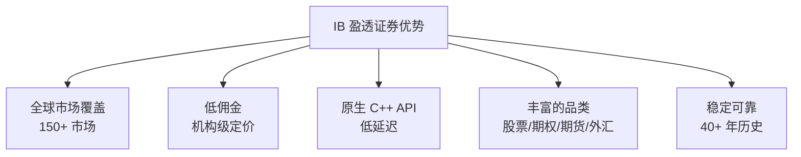

**IB 核心优势：**

| 特性 | 说明 |
|------|------|
| 全球市场 | 美股、港股、欧股、日股、期货、期权、外汇、债券 |
| 佣金低 | 美股 $0.005/股，最低 $1；期权 $0.65/张 |
| API 质量 | 原生 C++/Java/Python API，文档完善 |
| 账户类型 | 现金账户、保证金账户、模拟账户 |
| 入金门槛 | 无最低入金要求（曾经是 $10,000） |

### 1.2 IB 账户类型

**账户类型对比：**

| 类型 | 说明 | 适合人群 |
|------|------|----------|
| 现金账户 | 只能用账户现金交易 | 保守型、无杠杆需求 |
| Reg T 保证金账户 | 2x 杠杆，T+2 结算 | 普通投资者 |
| Portfolio Margin | 更高杠杆，基于风险 | 专业交易者，净资产 > $110,000 |

### 1.3 IB 与其他券商对比

| 特性 | IB 盈透 | TD Ameritrade | Alpaca | 富途/老虎 |
|------|---------|---------------|--------|-----------|
| C++ API | ✓ 原生 | ✗ | ✗ | ✗ |
| 延迟 | ~1-5ms | ~10-50ms | ~10-50ms | ~50-100ms |
| 全球市场 | ✓ | 有限 | 仅美股 | 美港股 |
| 期货/期权 | ✓ | ✓ | ✗ | 有限 |
| 佣金 | 低 | 零佣金 | 零佣金 | 较高 |
| 中国居民 | ✓ | ✗ | ✗ | ✓ |

### 1.4 延迟与高频适用性

**IB 延迟分析：**

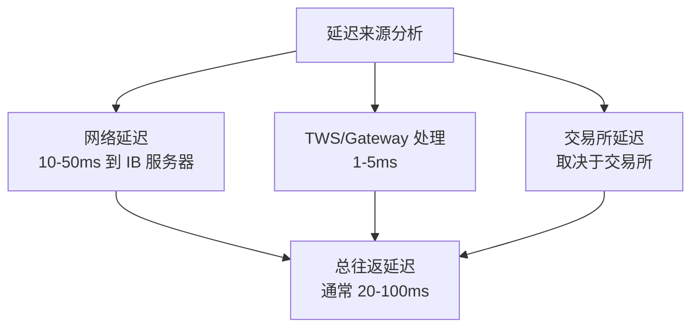

**延迟基准测试：**

| 环节 | 典型延迟 | 说明 |
|------|----------|------|
| 行情延迟 | 1-5ms | TWS 收到后到程序收到 |
| 下单延迟 | 5-20ms | 程序发出到 TWS 确认 |
| 订单执行 | 10-100ms | TWS 到交易所往返 |
| 总往返 | 50-200ms | 端到端 |

**IB 是否适合高频交易？**

| 策略类型 | 延迟要求 | IB 适用性 |
|----------|----------|-----------|
| 超高频/做市 | < 1ms | ✗ 不适合 |
| 统计套利 | 1-10ms | ✗ 不适合 |
| 事件驱动 | 10-100ms | △ 勉强 |
| 日内趋势 | 100ms-1s | ✓ 适合 |
| 波段交易 | > 1s | ✓ 非常适合 |
| 期权策略 | > 1s | ✓ 非常适合 |

**结论：** IB 不适合真正的高频交易（HFT），但对于：
- 日内量化策略（分钟级）
- 期权价差策略
- 多资产配置
- 中低频算法交易

IB 是非常优秀的选择。

### 1.5 接口方式对比

**IB 提供多种接口方式：**

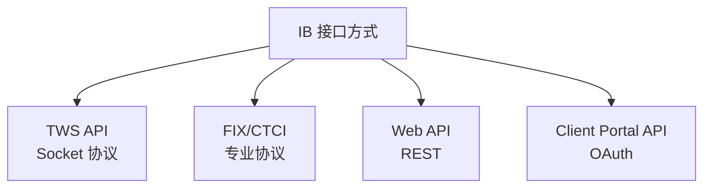

**接口方式详细对比：**

| 接口 | 协议 | 延迟 | 适用场景 | 门槛 |
|------|------|------|----------|------|
| TWS API | 私有 Socket | 中等 | 个人/小型机构 | 低 |
| FIX/CTCI | FIX 4.2 | 较低 | 机构客户 | 高 |
| Web API | REST | 高 | 信息查询 | 低 |
| Client Portal | OAuth | 高 | 轻量应用 | 中 |

**1. TWS API（本文重点）**

| 特点 | 说明 |
|------|------|
| 协议 | 私有二进制协议 |
| 语言 | C++, Java, Python, C# |
| 连接 | 通过 TWS 或 IB Gateway |
| 适用 | 个人量化交易者 |
| 成本 | 免费 |

**2. FIX/CTCI（专业接口）**

| 特点 | 说明 |
|------|------|
| 协议 | FIX 4.2 标准协议 |
| 延迟 | 比 TWS API 低约 30-50% |
| 直连 | 直接连接 IB 服务器，无需 TWS |
| 要求 | 月佣金 > $500 或 专业账户 |
| 成本 | 需要申请，可能有额外费用 |

**FIX 接口优势：**
- 无需运行 TWS/Gateway
- 更稳定的连接
- 更低的延迟
- 标准协议，可复用代码

**申请 FIX 接口：**
```
账户管理 → 设置 → API → FIX/CTCI
```

**3. Web API / Client Portal API**

```cpp
// REST API 示例（使用 curl 或 HTTP 库）
// 获取账户信息
// GET https://api.ibkr.com/v1/api/portfolio/accounts

// 注意：Web API 主要用于账户管理，不推荐用于交易
```

### 1.6 延迟优化建议

**如果需要降低延迟：**

| 优化方向 | 方法 | 效果 |
|----------|------|------|
| 网络位置 | 使用美国 VPS（靠近纽约） | 显著 |
| 连接方式 | 使用 IB Gateway 而非 TWS | 中等 |
| 代码优化 | 预先构建 Order 对象 | 轻微 |
| 数据结构 | 本地缓存合约信息 | 轻微 |
| 升级接口 | 申请 FIX/CTCI | 显著 |

**推荐 VPS 位置：**
- AWS us-east-1（弗吉尼亚）
- 距离纽交所/纳斯达克数据中心近
- 网络延迟可降至 1-5ms

**对于真正的高频需求：**

如果你的策略需要微秒级延迟，IB 不是正确的选择。考虑：
- 直接交易所会员（CME Globex 直连）
- 专业做市商合作
- 使用 co-location 服务

---

## 二、开户与权限开通

### 2.1 开户流程

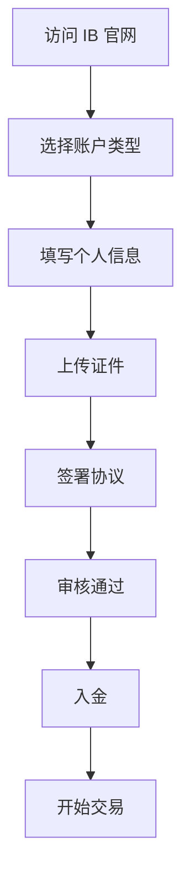

**开户步骤详解：**

**步骤 1：访问官网**
- 国际版：https://www.interactivebrokers.com
- 香港版：https://www.interactivebrokers.com.hk
- 建议：中国大陆居民选择香港版或国际版

**步骤 2：选择账户类型**
- 个人账户（Individual）
- 联合账户（Joint）
- 公司账户（Corporate）

**步骤 3：填写个人信息**
- 姓名（与证件一致）
- 地址（需英文）
- 联系方式
- 税务信息

**步骤 4：上传证件**
- 身份证明：护照 或 身份证
- 地址证明：银行账单 或 水电费账单（3个月内）

**步骤 5：投资者问卷**
- 投资经验
- 风险承受能力
- 资金来源

**步骤 6：审核与激活**
- 审核时间：1-3 个工作日
- 审核通过后收到邮件通知

### 2.2 入金方式

**入金方式对比：**

| 方式 | 时间 | 费用 | 最低金额 | 说明 |
|------|------|------|----------|------|
| 电汇（Wire） | 1-2 天 | $10-50 | 无 | 最常用，银行收费 |
| ACH | 3-5 天 | 免费 | 无 | 仅限美国银行 |
| 支票 | 5-7 天 | 免费 | 无 | 仅限美国 |
| ACATS 转户 | 5-7 天 | 可能有 | 无 | 从其他券商转入 |

**电汇入金流程：**

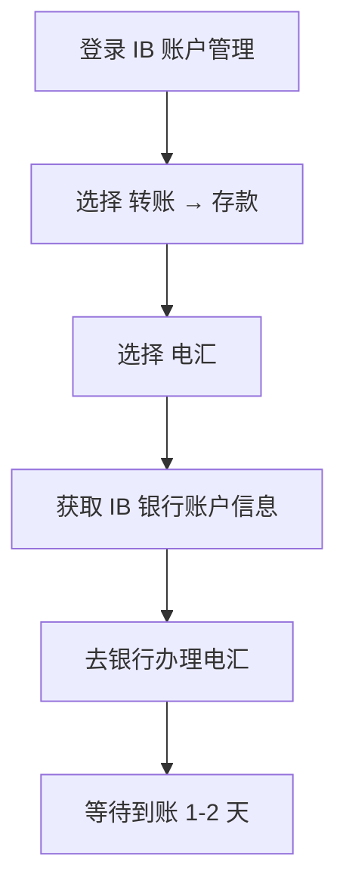

**IB 接收电汇银行信息（示例）：**

| 项目 | 信息 |
|------|------|
| 银行名称 | Citibank N.A. |
| 银行地址 | 111 Wall Street, New York, NY 10043 |
| SWIFT Code | CITIUS33 |
| ABA/Routing | 021000089 |
| 账户名称 | Interactive Brokers LLC |
| 账户号码 | 您的专属账号（在 IB 后台查看） |
| 备注 | 必须填写您的 IB 账户号（如 U1234567） |

**注意事项：**
- 电汇备注必须包含 IB 账户号
- 首次入金可能需要更长时间
- 入金来源必须与账户持有人一致

**出金方式：**

| 方式 | 时间 | 费用 | 说明 |
|------|------|------|------|
| 电汇 | 1-2 天 | 首次免费，之后 $10 | 最常用 |
| ACH | 3-5 天 | 免费 | 仅限美国银行 |

**出金限制：**
- 每月首次电汇免费
- T+2 结算后才能出金
- 需预留保证金

### 2.3 税务表格

**W-8BEN 表格（非美国居民必填）：**

| 项目 | 说明 |
|------|------|
| 用途 | 声明非美国税务居民身份 |
| 有效期 | 3 年 |
| 影响 | 股息预扣税从 30% 降至 10%（中美税收协定） |
| 填写位置 | 账户管理 → 设置 → 税务信息 |

**关键填写内容：**
- Part I：姓名、地址、税务国家（China）
- Part II：声明受益于税收协定
- Part III：签名

### 2.4 开通交易权限

**权限开通位置：** 登录 → 账户管理 → 设置 → 交易权限

**推荐开通的权限：**

| 权限类型 | 说明 | 建议 |
|----------|------|------|
| 股票 | 美股、港股等 | ✓ 必开 |
| 期权 | 美股期权 | ✓ 推荐 |
| 期货 | 商品/股指期货 | 按需 |
| 外汇 | 现货外汇 | 按需 |
| 债券 | 公司债/国债 | 按需 |

**期权权限级别：**

| 级别 | 允许操作 | 要求 |
|------|----------|------|
| Level 1 | 备兑开仓、保护性看跌 | 基础 |
| Level 2 | 买入看涨/看跌 | 通过问卷 |
| Level 3 | 价差策略 | 经验 + 资金 |
| Level 4 | 裸卖期权 | 高净值 + 经验 |

### 2.5 模拟账户

**强烈建议先用模拟账户开发测试！**

**开通模拟账户：**
```
账户管理 → 设置 → 模拟交易账户 → 创建
```

**模拟账户特点：**

| 特性 | 说明 |
|------|------|
| 初始资金 | 可自定义（默认 $100万） |
| 行情数据 | 延迟 15 分钟（除非订阅实时） |
| API 端口 | 7497（TWS）/ 4002（Gateway） |
| 交易时间 | 与实盘相同 |
| 有效期 | 永久有效 |

**模拟 vs 实盘端口：**

| 环境 | TWS 端口 | Gateway 端口 |
|------|----------|--------------|
| 实盘 | 7496 | 4001 |
| 模拟 | 7497 | 4002 |

**代码中切换：**
```cpp
// 模拟盘
client.eConnect("127.0.0.1", 7497, 0);

// 实盘（谨慎！）
client.eConnect("127.0.0.1", 7496, 0);
```

### 2.6 开通 API 权限

**关键步骤：**

**1. 启用 API 功能**
```
账户管理 → 设置 → API → 启用 ActiveX 和 Socket 客户端
```

**2. 生成 API 密钥（可选）**
- 用于 Web API 认证
- TWS/Gateway 连接不需要

**3. TWS 配置**
```
TWS → 编辑 → 全局配置 → API → 设置
```

需要配置的选项：

| 设置项 | 推荐值 | 说明 |
|--------|--------|------|
| 启用 ActiveX 和 Socket 客户端 | ✓ | 必须启用 |
| Socket 端口 | 7496（实盘）/ 7497（模拟） | 程序连接端口 |
| 允许本地连接 | ✓ | 本地程序连接 |
| 只读 API | ✗ | 需要下单功能 |
| 创建 API 消息日志 | ✓ | 便于调试 |

---

## 三、最佳交易品类

### 3.1 品类推荐矩阵

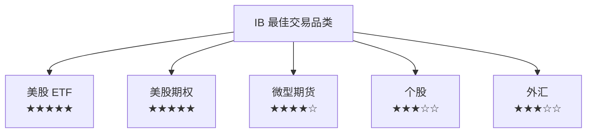

### 3.2 推荐品类详解

**1. 美股 ETF（强烈推荐）**

| ETF | 标的 | 日均成交量 | 点差 | 适合策略 |
|-----|------|-----------|------|----------|
| SPY | 标普500 | 8000万股 | $0.01 | 趋势/波段 |
| QQQ | 纳斯达克100 | 5000万股 | $0.01 | 趋势/波段 |
| IWM | 罗素2000 | 3000万股 | $0.01 | 均值回归 |
| TLT | 20年国债 | 2000万股 | $0.01 | 对冲/配对 |
| GLD | 黄金 | 1000万股 | $0.01 | 避险 |

**优势：**
- 流动性极好，几乎无滑点
- 佣金低：$0.005/股
- 无 PDT 限制（账户 > $25,000）
- 适合各种策略

**2. 美股期权（强烈推荐）**

| 标的 | 特点 | 适合策略 |
|------|------|----------|
| SPY/SPX 期权 | 流动性最好 | Delta Neutral、Iron Condor |
| QQQ 期权 | 科技股敞口 | 方向性策略 |
| 个股期权 | 波动大 | 事件驱动 |
| 0DTE 期权 | 当日到期 | 日内投机 |

**优势：**
- 杠杆效应
- 策略多样（买方/卖方/价差）
- 佣金：$0.65/张

**注意事项：**
- 期权复杂度高，需要学习
- 卖方策略需要足够保证金
- 注意时间价值衰减

**3. 微型期货（推荐）**

| 合约 | 代码 | 合约大小 | 保证金 | 每点价值 |
|------|------|----------|--------|----------|
| 微型标普 | MES | $5 x 指数 | ~$1,200 | $5 |
| 微型纳指 | MNQ | $2 x 指数 | ~$1,800 | $2 |
| 微型道指 | MYM | $0.5 x 指数 | ~$800 | $0.5 |
| 微型黄金 | MGC | 10盎司 | ~$800 | $1 |
| 微型原油 | MCL | 100桶 | ~$600 | $1 |

**优势：**
- 小资金可参与期货
- 23小时交易
- 无 PDT 限制
- 税务优惠（60/40 规则）

### 3.3 市场数据订阅

**IB 市场数据是收费的！** 这是很多新手忽略的重要问题。

**美股数据订阅推荐：**

| 数据包 | 月费 | 包含内容 | 推荐 |
|--------|------|----------|------|
| US Securities Snapshot | $1.50 | 美股快照 | 入门 |
| US Equity and Options Add-On | $1.50 | 期权数据 | 期权交易 |
| NYSE/ARCA/NASDAQ | $1.50 各 | 单交易所深度 | 按需 |
| OPRA US Options | $1.50 | 全美期权 | 期权必备 |

**期货数据订阅：**

| 数据包 | 月费 | 包含内容 |
|--------|------|----------|
| CME Real-time | $5 | E-mini、微型期货 |
| CBOT Real-time | $5 | 农产品、国债期货 |
| COMEX Real-time | $5 | 黄金、白银期货 |
| NYMEX Real-time | $5 | 原油、天然气期货 |

**订阅位置：** 账户管理 → 设置 → 市场数据订阅

**免费数据：**
- 延迟 15 分钟的行情
- 收盘后的历史数据

**佣金抵扣：**
- 月佣金超过 $30 可抵扣部分数据费用

### 3.4 PDT 规则

**Pattern Day Trader（典型日内交易者）规则：**

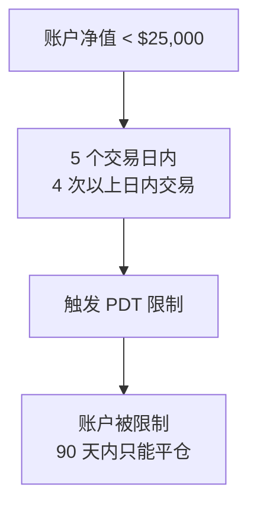

**PDT 规则详解：**

| 条件 | 说明 |
|------|------|
| 适用账户 | 保证金账户，净值 < $25,000 |
| 日内交易定义 | 同一交易日内买入并卖出同一证券 |
| 触发条件 | 5 个交易日内 ≥ 4 次日内交易 |
| 后果 | 账户被标记为 PDT，限制交易 |

**规避方法：**

| 方法 | 说明 |
|------|------|
| 账户 > $25,000 | 最简单的方法 |
| 使用现金账户 | 无 PDT 限制，但无杠杆，T+2 结算 |
| 交易期货 | 期货不受 PDT 限制 |
| 隔夜持仓 | 买入后次日卖出不算日内交易 |
| 控制交易次数 | 5 天内 ≤ 3 次日内交易 |

### 3.5 不推荐的品类

| 品类 | 原因 |
|------|------|
| 个股（小盘股） | 流动性差，滑点大 |
| 外汇现货 | IB 点差不如专业外汇商 |
| 加密货币 | IB 不提供 |
| A 股 | 通过沪港通，限制多 |

### 3.6 新手推荐路径

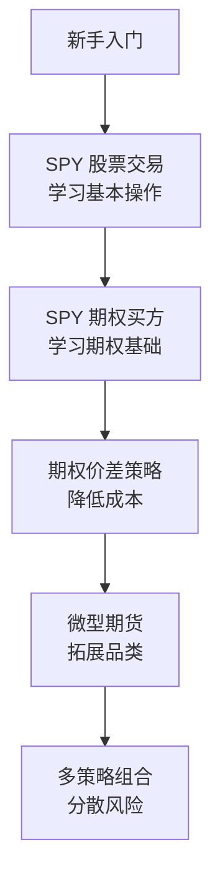

---

## 四、TWS 与 IB Gateway

### 4.1 TWS vs IB Gateway

| 特性 | TWS | IB Gateway |
|------|-----|------------|
| 界面 | 完整图形界面 | 最小化界面 |
| 资源占用 | 高（1-2GB） | 低（200-500MB） |
| 稳定性 | 一般 | 更稳定 |
| 适用场景 | 开发调试 | 生产环境 |
| 自动重连 | 需手动 | 自动 |

**推荐：**
- 开发调试：使用 TWS
- 生产运行：使用 IB Gateway

### 4.2 下载与安装

**TWS 下载：**
```
https://www.interactivebrokers.com/en/trading/tws.php
```

**IB Gateway 下载：**
```
https://www.interactivebrokers.com/en/trading/ibgateway-stable.php
```

**Linux 安装：**
```bash
# 下载
wget https://download2.interactivebrokers.com/installers/ibgateway/stable-standalone/ibgateway-stable-standalone-linux-x64.sh

# 安装
chmod +x ibgateway-stable-standalone-linux-x64.sh
./ibgateway-stable-standalone-linux-x64.sh

# 运行
~/Jts/ibgateway/1019/ibgateway
```

### 4.3 TWS API 配置

**配置文件位置：**
- Windows: `C:\Jts\`
- Linux: `~/Jts/`
- macOS: `~/Jts/`

**jts.ini 关键配置：**
```ini
[IBGateway]
ApiOnly=true
LocalServerPort=4001
TrustedIPs=127.0.0.1
```

---

## 五、C++ API 环境搭建

### 5.1 获取 API

**下载地址：**
```
https://interactivebrokers.github.io/
```

**或使用 Git：**
```bash
git clone https://github.com/InteractiveBrokers/tws-api.git
cd tws-api/source/cppclient
```

### 5.2 目录结构

```
tws-api/
├── source/
│   ├── cppclient/           # C++ 客户端
│   │   ├── client/          # 核心类
│   │   │   ├── EClient.h    # 客户端接口
│   │   │   ├── EWrapper.h   # 回调接口
│   │   │   ├── Contract.h   # 合约定义
│   │   │   ├── Order.h      # 订单定义
│   │   │   └── ...
│   │   └── Makefile
│   ├── pythonclient/        # Python 客户端
│   └── javaclient/          # Java 客户端
└── samples/
    └── Cpp/                 # C++ 示例
```

### 5.3 编译 API

**Linux/macOS：**

```bash
cd tws-api/source/cppclient/client

# 编译静态库
make

# 生成 libTwsSocketClient.a
```

**CMakeLists.txt（推荐）：**

```cmake
cmake_minimum_required(VERSION 3.15)
project(ib_trader)

set(CMAKE_CXX_STANDARD 17)

# IB API 路径
set(IB_API_PATH "/path/to/tws-api/source/cppclient/client")

# 包含头文件
include_directories(${IB_API_PATH})

# IB API 源文件
file(GLOB IB_API_SOURCES "${IB_API_PATH}/*.cpp")

# 你的程序
add_executable(ib_trader
    main.cpp
    ${IB_API_SOURCES}
)

# 链接库
target_link_libraries(ib_trader pthread)
```

### 5.4 核心类介绍

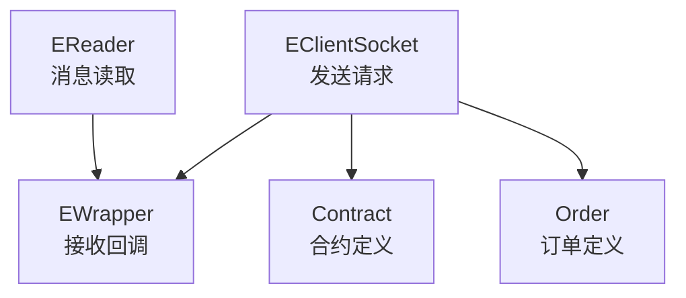

**核心类说明：**

| 类名 | 作用 | 使用方式 |
|------|------|----------|
| EClientSocket | 与 TWS 通信，发送请求 | 继承或组合 |
| EWrapper | 接收回调，处理响应 | 必须继承实现 |
| EReader | 异步读取消息 | 后台线程运行 |
| Contract | 定义交易合约 | 创建并填充 |
| Order | 定义订单参数 | 创建并填充 |

---

## 六、基础代码实现

### 6.1 最小示例

```cpp
// main.cpp
#include "EClientSocket.h"
#include "EWrapper.h"
#include "EReader.h"
#include "Contract.h"
#include "Order.h"

#include <iostream>
#include <thread>
#include <chrono>

// 实现回调接口
class MyWrapper : public EWrapper {
public:
    // 连接状态
    void connectAck() override {
        std::cout << "Connected to TWS" << std::endl;
    }
    
    void connectionClosed() override {
        std::cout << "Connection closed" << std::endl;
    }
    
    // 错误处理
    void error(int id, int errorCode, 
               const std::string& errorString,
               const std::string& advancedOrderRejectJson) override {
        std::cout << "Error: " << id << " " 
                  << errorCode << " " 
                  << errorString << std::endl;
    }
    
    // 下一个有效订单ID
    void nextValidId(OrderId orderId) override {
        std::cout << "Next valid order ID: " << orderId << std::endl;
        m_nextOrderId = orderId;
        m_connected = true;
    }
    
    // 账户信息
    void accountSummary(int reqId, 
                        const std::string& account,
                        const std::string& tag,
                        const std::string& value,
                        const std::string& currency) override {
        std::cout << "Account: " << account 
                  << " " << tag << "=" << value 
                  << " " << currency << std::endl;
    }
    
    void accountSummaryEnd(int reqId) override {
        std::cout << "Account summary end" << std::endl;
    }
    
    // 行情数据
    void tickPrice(TickerId tickerId, TickType field, 
                   double price, const TickAttrib& attrib) override {
        std::cout << "Tick: " << tickerId 
                  << " field=" << field 
                  << " price=" << price << std::endl;
    }
    
    void tickSize(TickerId tickerId, TickType field, 
                  Decimal size) override {
        // 成交量等
    }
    
    // 订单状态
    void orderStatus(OrderId orderId, 
                     const std::string& status,
                     Decimal filled, Decimal remaining,
                     double avgFillPrice, int permId,
                     int parentId, double lastFillPrice,
                     int clientId, 
                     const std::string& whyHeld,
                     double mktCapPrice) override {
        std::cout << "Order " << orderId 
                  << " status: " << status
                  << " filled: " << decimalToDouble(filled)
                  << std::endl;
    }
    
    // 其他回调方法...
    // EWrapper 有很多方法，这里只实现常用的
    // 未实现的方法需要提供空实现
    
    bool isConnected() const { return m_connected; }
    OrderId getNextOrderId() const { return m_nextOrderId; }
    
private:
    bool m_connected = false;
    OrderId m_nextOrderId = 0;
};

int main() {
    MyWrapper wrapper;
    EClientSocket client(&wrapper, nullptr);
    
    // 连接到 TWS
    // 7496 = TWS 实盘, 7497 = TWS 模拟
    // 4001 = Gateway 实盘, 4002 = Gateway 模拟
    bool connected = client.eConnect("127.0.0.1", 7497, 0);
    
    if (!connected) {
        std::cerr << "Failed to connect" << std::endl;
        return 1;
    }
    
    // 启动消息读取线程
    EReader reader(&client, &wrapper);
    reader.start();
    
    // 消息处理线程
    std::thread msgThread([&]() {
        while (client.isConnected()) {
            reader.processMsgs();
            std::this_thread::sleep_for(
                std::chrono::milliseconds(10)
            );
        }
    });
    
    // 等待连接完成
    while (!wrapper.isConnected()) {
        std::this_thread::sleep_for(
            std::chrono::milliseconds(100)
        );
    }
    
    // 请求账户信息
    client.reqAccountSummary(1, "All", 
        "NetLiquidation,TotalCashValue,BuyingPower");
    
    // 运行一段时间
    std::this_thread::sleep_for(std::chrono::seconds(5));
    
    // 断开连接
    client.eDisconnect();
    msgThread.join();
    
    return 0;
}
```

### 6.2 合约定义

**股票合约：**
```cpp
Contract createStockContract(const std::string& symbol) {
    Contract contract;
    contract.symbol = symbol;
    contract.secType = "STK";
    contract.exchange = "SMART";
    contract.currency = "USD";
    return contract;
}

// 使用
Contract spy = createStockContract("SPY");
```

**期权合约：**
```cpp
Contract createOptionContract(
    const std::string& symbol,
    const std::string& expiry,     // "20240315"
    double strike,
    const std::string& right       // "C" or "P"
) {
    Contract contract;
    contract.symbol = symbol;
    contract.secType = "OPT";
    contract.exchange = "SMART";
    contract.currency = "USD";
    contract.lastTradeDateOrContractMonth = expiry;
    contract.strike = strike;
    contract.right = right;
    contract.multiplier = "100";
    return contract;
}

// 使用：SPY 2024年3月15日 500 Call
Contract opt = createOptionContract("SPY", "20240315", 500.0, "C");
```

**期货合约：**
```cpp
Contract createFuturesContract(
    const std::string& symbol,
    const std::string& expiry,
    const std::string& exchange
) {
    Contract contract;
    contract.symbol = symbol;
    contract.secType = "FUT";
    contract.exchange = exchange;
    contract.currency = "USD";
    contract.lastTradeDateOrContractMonth = expiry;
    return contract;
}

// 使用：微型标普期货 2024年3月
Contract mes = createFuturesContract("MES", "202403", "CME");
```

### 6.3 获取历史数据

**历史数据对于回测和策略开发至关重要。**

```cpp
// 请求历史数据
void requestHistoricalData(EClientSocket& client,
                            int reqId,
                            const Contract& contract) {
    // 结束时间：空字符串表示当前时间
    std::string endDateTime = "";
    
    // 时间跨度：1 D, 1 W, 1 M, 1 Y
    std::string durationStr = "1 M";  // 1个月
    
    // K线周期：1 secs, 5 secs, 1 min, 5 mins, 
    //          15 mins, 30 mins, 1 hour, 1 day
    std::string barSizeSetting = "5 mins";
    
    // 数据类型：TRADES, MIDPOINT, BID, ASK
    std::string whatToShow = "TRADES";
    
    // 是否只要交易时段数据
    int useRTH = 1;  // 1=仅交易时段, 0=包含盘前盘后
    
    // 日期格式：1=yyyyMMdd HH:mm:ss, 2=Unix时间戳
    int formatDate = 1;
    
    client.reqHistoricalData(reqId, contract, endDateTime,
        durationStr, barSizeSetting, whatToShow,
        useRTH, formatDate, false, {});
}
```

**历史数据回调：**
```cpp
void historicalData(TickerId reqId, const Bar& bar) override {
    std::cout << "Bar: " << bar.time 
              << " O=" << bar.open
              << " H=" << bar.high
              << " L=" << bar.low
              << " C=" << bar.close
              << " V=" << decimalToDouble(bar.volume)
              << std::endl;
}

void historicalDataEnd(int reqId, 
                        const std::string& startDateStr,
                        const std::string& endDateStr) override {
    std::cout << "Historical data complete: " 
              << startDateStr << " to " << endDateStr << std::endl;
}
```

**历史数据限制：**

| 限制类型 | 限制值 |
|----------|--------|
| 请求频率 | 每 10 秒不超过 6 个请求 |
| 单次数据量 | 最多 2000 根 K 线 |
| 最长历史 | 1 秒线：1 天；1 分线：1 周；日线：1 年 |

**分页获取长历史数据：**
```cpp
// 分批获取历史数据
void requestLongHistory(const Contract& contract,
                         int totalDays) {
    // 每次请求 5 天的 1 分钟数据
    int batchDays = 5;
    int batches = (totalDays + batchDays - 1) / batchDays;
    
    for (int i = 0; i < batches; i++) {
        // 计算结束日期
        auto endTime = calculateEndTime(i * batchDays);
        
        client.reqHistoricalData(
            1000 + i, contract, endTime,
            "5 D", "1 min", "TRADES", 1, 1, false, {});
        
        // 等待 2 秒再请求下一批
        std::this_thread::sleep_for(std::chrono::seconds(2));
    }
}
```

### 6.4 订阅行情

```cpp
// 订阅实时行情
void subscribeMarketData(EClientSocket& client, 
                          int tickerId,
                          const Contract& contract) {
    // genericTickList: 额外行情类型
    // "233" = RTVolume (实时成交)
    // "236" = Shortable
    // "256" = 实时历史波动率
    client.reqMktData(tickerId, contract, "233", false, false, {});
}

// 取消订阅
void unsubscribeMarketData(EClientSocket& client, int tickerId) {
    client.cancelMktData(tickerId);
}
```

### 6.5 查询账户与持仓

**查询账户信息：**
```cpp
// 请求账户摘要
client.reqAccountSummary(1, "All", 
    "NetLiquidation,TotalCashValue,BuyingPower,"
    "GrossPositionValue,MaintMarginReq");

// 回调处理
void accountSummary(int reqId, 
                    const std::string& account,
                    const std::string& tag,
                    const std::string& value,
                    const std::string& currency) override {
    std::cout << account << ": " << tag 
              << " = " << value << " " << currency << std::endl;
}
```

**常用账户字段：**

| 字段 | 说明 |
|------|------|
| NetLiquidation | 净清算价值 |
| TotalCashValue | 现金余额 |
| BuyingPower | 购买力 |
| GrossPositionValue | 持仓总值 |
| MaintMarginReq | 维持保证金 |
| UnrealizedPnL | 未实现盈亏 |
| RealizedPnL | 已实现盈亏 |

**查询持仓：**
```cpp
// 请求持仓
client.reqPositions();

// 回调处理
void position(const std::string& account,
              const Contract& contract,
              Decimal position,
              double avgCost) override {
    std::cout << "Position: " << contract.symbol
              << " qty=" << decimalToDouble(position)
              << " avgCost=" << avgCost << std::endl;
}

void positionEnd() override {
    std::cout << "Position query complete" << std::endl;
}
```

**查询未完成订单：**
```cpp
// 请求所有未完成订单
client.reqAllOpenOrders();

// 回调处理
void openOrder(OrderId orderId, 
               const Contract& contract,
               const Order& order,
               const OrderState& orderState) override {
    std::cout << "Open order: " << orderId
              << " " << contract.symbol
              << " " << order.action
              << " " << decimalToDouble(order.totalQuantity)
              << " status=" << orderState.status << std::endl;
}
```

### 6.6 下单交易

**市价单：**
```cpp
Order createMarketOrder(const std::string& action, double quantity) {
    Order order;
    order.action = action;  // "BUY" or "SELL"
    order.orderType = "MKT";
    order.totalQuantity = DecimalFunctions::doubleToDecimal(quantity);
    order.transmit = true;  // 立即发送
    return order;
}
```

**限价单：**
```cpp
Order createLimitOrder(const std::string& action, 
                        double quantity, 
                        double price) {
    Order order;
    order.action = action;
    order.orderType = "LMT";
    order.totalQuantity = DecimalFunctions::doubleToDecimal(quantity);
    order.lmtPrice = price;
    order.transmit = true;
    return order;
}
```

**止损单：**
```cpp
Order createStopOrder(const std::string& action,
                       double quantity,
                       double stopPrice) {
    Order order;
    order.action = action;
    order.orderType = "STP";
    order.totalQuantity = DecimalFunctions::doubleToDecimal(quantity);
    order.auxPrice = stopPrice;
    order.transmit = true;
    return order;
}
```

**下单示例：**
```cpp
// 买入 100 股 SPY
Contract spy = createStockContract("SPY");
Order order = createLimitOrder("BUY", 100, 450.00);
client.placeOrder(wrapper.getNextOrderId(), spy, order);
```

### 6.7 高级订单类型

**Bracket 订单（括号订单）：**

一次下单同时设置入场、止盈、止损。

```cpp
// 创建 Bracket 订单
void placeBracketOrder(EClientSocket& client,
                        OrderId parentId,
                        const Contract& contract,
                        double quantity,
                        double entryPrice,
                        double takeProfitPrice,
                        double stopLossPrice) {
    // 父订单（入场）
    Order parent;
    parent.orderId = parentId;
    parent.action = "BUY";
    parent.orderType = "LMT";
    parent.totalQuantity = DecimalFunctions::doubleToDecimal(quantity);
    parent.lmtPrice = entryPrice;
    parent.transmit = false;  // 暂不发送
    
    // 止盈订单
    Order takeProfit;
    takeProfit.orderId = parentId + 1;
    takeProfit.action = "SELL";
    takeProfit.orderType = "LMT";
    takeProfit.totalQuantity = DecimalFunctions::doubleToDecimal(quantity);
    takeProfit.lmtPrice = takeProfitPrice;
    takeProfit.parentId = parentId;  // 关联父订单
    takeProfit.transmit = false;
    
    // 止损订单
    Order stopLoss;
    stopLoss.orderId = parentId + 2;
    stopLoss.action = "SELL";
    stopLoss.orderType = "STP";
    stopLoss.totalQuantity = DecimalFunctions::doubleToDecimal(quantity);
    stopLoss.auxPrice = stopLossPrice;
    stopLoss.parentId = parentId;
    stopLoss.transmit = true;  // 最后一个发送，触发全部
    
    // 下单
    client.placeOrder(parentId, contract, parent);
    client.placeOrder(parentId + 1, contract, takeProfit);
    client.placeOrder(parentId + 2, contract, stopLoss);
}

// 使用示例：买入 SPY @ 450，止盈 460，止损 445
placeBracketOrder(client, nextOrderId, spy, 100, 450.0, 460.0, 445.0);
```

**OCO 订单（二选一）：**

```cpp
// 创建 OCO 订单组
Order order1;
order1.orderId = orderId1;
order1.action = "SELL";
order1.orderType = "LMT";
order1.lmtPrice = 460.0;  // 止盈
order1.ocaGroup = "OCA_Group_1";
order1.ocaType = 1;  // 取消其他

Order order2;
order2.orderId = orderId2;
order2.action = "SELL";
order2.orderType = "STP";
order2.auxPrice = 445.0;  // 止损
order2.ocaGroup = "OCA_Group_1";
order2.ocaType = 1;
```

**Trailing Stop（追踪止损）：**

```cpp
Order createTrailingStop(const std::string& action,
                          double quantity,
                          double trailingAmount) {
    Order order;
    order.action = action;
    order.orderType = "TRAIL";
    order.totalQuantity = DecimalFunctions::doubleToDecimal(quantity);
    order.auxPrice = trailingAmount;  // 追踪金额（如 $2）
    // 或使用百分比
    // order.trailingPercent = 2.0;  // 追踪 2%
    return order;
}
```

---

## 七、完整交易系统

### 7.1 系统架构

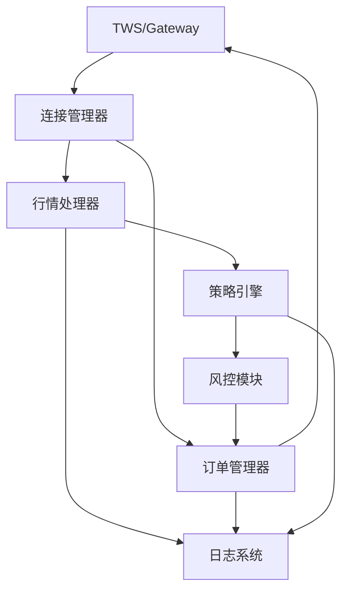

### 7.2 连接管理器

```cpp
// ConnectionManager.h
#pragma once

#include "EClientSocket.h"
#include "EWrapper.h"
#include "EReader.h"

#include <atomic>
#include <thread>
#include <functional>

class ConnectionManager {
public:
    using ConnectCallback = std::function<void(bool)>;
    using ErrorCallback = std::function<void(int, int, const std::string&)>;
    
    ConnectionManager();
    ~ConnectionManager();
    
    // 连接控制
    bool connect(const std::string& host, int port, int clientId);
    void disconnect();
    bool isConnected() const;
    
    // 获取客户端
    EClientSocket* getClient() { return m_client.get(); }
    
    // 回调设置
    void setConnectCallback(ConnectCallback cb);
    void setErrorCallback(ErrorCallback cb);
    
    // 获取下一个订单ID
    OrderId getNextOrderId();
    
private:
    class WrapperImpl;
    std::unique_ptr<WrapperImpl> m_wrapper;
    std::unique_ptr<EClientSocket> m_client;
    std::unique_ptr<EReader> m_reader;
    std::thread m_readerThread;
    std::atomic<bool> m_running{false};
    
    void readerLoop();
};
```

### 7.3 行情处理器

```cpp
// MarketDataHandler.h
#pragma once

#include "Contract.h"
#include <functional>
#include <unordered_map>
#include <mutex>

struct Quote {
    double bidPrice = 0;
    double askPrice = 0;
    double lastPrice = 0;
    double bidSize = 0;
    double askSize = 0;
    double volume = 0;
    int64_t timestamp = 0;
};

class MarketDataHandler {
public:
    using QuoteCallback = std::function<void(int, const Quote&)>;
    
    MarketDataHandler(EClientSocket* client);
    
    // 订阅管理
    int subscribe(const Contract& contract, QuoteCallback callback);
    void unsubscribe(int tickerId);
    
    // 行情更新（由 EWrapper 调用）
    void onTickPrice(int tickerId, int field, double price);
    void onTickSize(int tickerId, int field, double size);
    
private:
    EClientSocket* m_client;
    std::unordered_map<int, Quote> m_quotes;
    std::unordered_map<int, QuoteCallback> m_callbacks;
    std::mutex m_mutex;
    int m_nextTickerId = 1000;
};
```

### 7.4 订单管理器

```cpp
// OrderManager.h
#pragma once

#include "Order.h"
#include "Contract.h"
#include <functional>
#include <unordered_map>
#include <mutex>

enum class OrderState {
    Pending,
    Submitted,
    PartiallyFilled,
    Filled,
    Cancelled,
    Error
};

struct OrderInfo {
    OrderId orderId;
    Contract contract;
    Order order;
    OrderState state;
    double filledQty = 0;
    double avgPrice = 0;
    std::string errorMsg;
};

class OrderManager {
public:
    using OrderCallback = std::function<void(const OrderInfo&)>;
    
    OrderManager(EClientSocket* client, OrderId& nextOrderId);
    
    // 下单
    OrderId placeOrder(const Contract& contract, const Order& order);
    
    // 取消订单
    void cancelOrder(OrderId orderId);
    
    // 修改订单
    void modifyOrder(OrderId orderId, const Order& newOrder);
    
    // 订单状态更新（由 EWrapper 调用）
    void onOrderStatus(OrderId orderId, const std::string& status,
                       double filled, double remaining, double avgPrice);
    
    // 回调设置
    void setOrderCallback(OrderCallback cb);
    
    // 查询
    const OrderInfo* getOrder(OrderId orderId) const;
    
private:
    EClientSocket* m_client;
    OrderId& m_nextOrderId;
    std::unordered_map<OrderId, OrderInfo> m_orders;
    OrderCallback m_callback;
    mutable std::mutex m_mutex;
};
```

### 7.5 简单策略示例

```cpp
// SimpleStrategy.cpp
#include "ConnectionManager.h"
#include "MarketDataHandler.h"
#include "OrderManager.h"

class MomentumStrategy {
public:
    MomentumStrategy(MarketDataHandler& md, OrderManager& om)
        : m_marketData(md), m_orderManager(om) {}
    
    void start(const Contract& contract) {
        m_contract = contract;
        
        // 订阅行情
        m_tickerId = m_marketData.subscribe(contract, 
            [this](int id, const Quote& q) {
                onQuote(q);
            });
    }
    
    void stop() {
        m_marketData.unsubscribe(m_tickerId);
    }
    
private:
    void onQuote(const Quote& quote) {
        // 更新价格历史
        m_prices.push_back(quote.lastPrice);
        if (m_prices.size() > 20) {
            m_prices.erase(m_prices.begin());
        }
        
        if (m_prices.size() < 20) return;
        
        // 计算动量信号
        double sma = std::accumulate(
            m_prices.begin(), m_prices.end(), 0.0) / m_prices.size();
        
        // 简单策略：价格上穿均线买入，下穿卖出
        if (quote.lastPrice > sma * 1.001 && m_position <= 0) {
            // 买入信号
            Order order = createMarketOrder("BUY", 100);
            m_orderManager.placeOrder(m_contract, order);
            m_position = 100;
        }
        else if (quote.lastPrice < sma * 0.999 && m_position > 0) {
            // 卖出信号
            Order order = createMarketOrder("SELL", 100);
            m_orderManager.placeOrder(m_contract, order);
            m_position = 0;
        }
    }
    
    MarketDataHandler& m_marketData;
    OrderManager& m_orderManager;
    Contract m_contract;
    int m_tickerId = 0;
    std::vector<double> m_prices;
    int m_position = 0;
};
```

---

## 八、实盘注意事项

### 8.1 风控要点

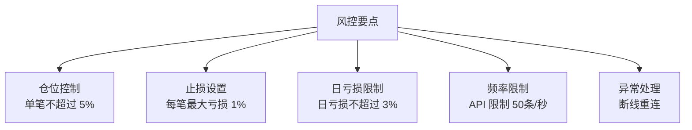

### 8.2 API 限制

| 限制类型 | 限制值 | 说明 |
|----------|--------|------|
| 消息频率 | 50条/秒 | 超过会被限流 |
| 行情订阅 | 100个 | 同时订阅合约数 |
| 历史数据 | 有限制 | 避免频繁请求 |
| 连接数 | 32个 | 不同 clientId |

### 8.3 生产环境最佳实践

**1. 使用 IB Gateway 而非 TWS**
```bash
# 无人值守运行
nohup ~/Jts/ibgateway/1019/ibgateway &
```

**2. 断线重连**
```cpp
void reconnect() {
    while (!m_client->isConnected() && m_running) {
        std::cout << "Reconnecting..." << std::endl;
        m_client->eConnect(m_host, m_port, m_clientId);
        std::this_thread::sleep_for(std::chrono::seconds(5));
    }
}
```

**3. 日志记录**
```cpp
// 使用 spdlog
#include <spdlog/spdlog.h>

spdlog::info("Order placed: {} {} {} @ {}", 
    orderId, action, quantity, price);
```

**4. 监控告警**
```cpp
// 关键指标监控
void monitorHealth() {
    // 连接状态
    // 订单状态
    // 持仓盈亏
    // 异常错误
}
```

---

## 九、常见问题

### 9.1 连接问题

| 问题 | 原因 | 解决方案 |
|------|------|----------|
| 连接失败 | TWS 未启动 | 启动 TWS/Gateway |
| 连接失败 | API 未启用 | 在 TWS 配置中启用 |
| 连接失败 | 端口错误 | 检查端口配置 |
| 频繁断开 | 网络不稳定 | 使用稳定网络 |
| 权限不足 | 未开通权限 | 账户管理中开通 |

### 9.2 下单问题

| 问题 | 原因 | 解决方案 |
|------|------|----------|
| 订单被拒 | 资金不足 | 检查购买力 |
| 订单被拒 | 合约错误 | 检查合约定义 |
| 订单被拒 | 市场关闭 | 检查交易时间 |
| 部分成交 | 流动性不足 | 使用更激进价格 |

### 9.3 数据问题

| 问题 | 原因 | 解决方案 |
|------|------|----------|
| 无行情 | 未订阅数据 | 订阅市场数据服务 |
| 行情延迟 | 数据级别 | 升级为实时数据 |
| 历史数据限制 | API 限制 | 减少请求频率 |

---

## 十、进阶主题

### 10.1 多账户管理

```cpp
// 使用不同 clientId 连接多个账户
client1.eConnect("127.0.0.1", 7496, 1);  // 账户1
client2.eConnect("127.0.0.1", 7496, 2);  // 账户2
```

### 10.2 FAManager（家族账户）

```cpp
// FA 账户分配
Order order;
order.faGroup = "MyGroup";
order.faMethod = "EqualQuantity";  // 或 "AvailableEquity"
```

### 10.3 算法订单

```cpp
// VWAP 算法订单
Order createVWAPOrder(const std::string& action, double quantity) {
    Order order;
    order.action = action;
    order.orderType = "MKT";
    order.totalQuantity = DecimalFunctions::doubleToDecimal(quantity);
    order.algoStrategy = "Vwap";
    
    // VWAP 参数
    TagValueListSPtr algoParams(new TagValueList());
    algoParams->push_back(TagValueSPtr(
        new TagValue("maxPctVol", "0.1")));
    algoParams->push_back(TagValueSPtr(
        new TagValue("startTime", "09:30:00 EST")));
    algoParams->push_back(TagValueSPtr(
        new TagValue("endTime", "16:00:00 EST")));
    order.algoParams = algoParams;
    
    return order;
}
```

**IB 支持的算法类型：**

| 算法 | 用途 | 参数 |
|------|------|------|
| VWAP | 按成交量加权均价执行 | maxPctVol, startTime, endTime |
| TWAP | 按时间加权均价执行 | startTime, endTime |
| Arrival Price | 接近到达价格执行 | maxPctVol, riskAversion |
| Adaptive | 自适应执行 | adaptivePriority |
| Close Price | 接近收盘价执行 | maxPctVol |

### 10.4 FIX/CTCI 接口详解

**如果 TWS API 延迟不满足需求，可以考虑 FIX 接口。**

**FIX 接口架构：**

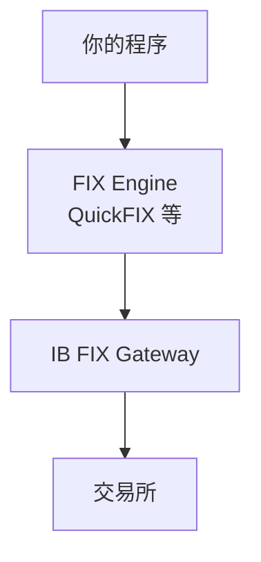

**FIX 接口申请条件：**

| 条件 | 说明 |
|------|------|
| 账户类型 | 机构账户或专业个人账户 |
| 月佣金 | 通常 > $500/月 |
| 技术能力 | 需要自行实现 FIX 协议 |
| 申请流程 | 联系 IB 机构服务 |

**FIX 消息示例：**
```
// 新订单（New Order Single）
8=FIX.4.2|9=178|35=D|49=YOUR_SENDER|56=IB|
34=1|52=20240315-10:30:00|11=order123|
21=1|55=SPY|54=1|38=100|40=2|44=450.00|
59=0|10=xxx|

// 字段说明：
// 35=D: 订单类型
// 55=SPY: 股票代码
// 54=1: 买入
// 38=100: 数量
// 40=2: 限价单
// 44=450.00: 价格
```

**QuickFIX C++ 示例：**
```cpp
#include "quickfix/Application.h"
#include "quickfix/MessageCracker.h"
#include "quickfix/fix42/NewOrderSingle.h"

class IBFixApplication : public FIX::Application {
public:
    void onLogon(const FIX::SessionID& sessionID) override {
        std::cout << "FIX session logged on" << std::endl;
    }
    
    void toApp(FIX::Message& message, 
               const FIX::SessionID&) override {
        // 发送前处理
    }
    
    void fromApp(const FIX::Message& message,
                 const FIX::SessionID&) override {
        // 接收处理
        crack(message, sessionID);
    }
};

// 发送订单
void sendOrder() {
    FIX42::NewOrderSingle order;
    order.set(FIX::ClOrdID("order123"));
    order.set(FIX::Symbol("SPY"));
    order.set(FIX::Side(FIX::Side_BUY));
    order.set(FIX::OrdType(FIX::OrdType_LIMIT));
    order.set(FIX::OrderQty(100));
    order.set(FIX::Price(450.00));
    order.set(FIX::TimeInForce(FIX::TimeInForce_DAY));
    
    FIX::Session::sendToTarget(order, sessionID);
}
```

### 10.5 延迟测量与优化

**延迟测量代码：**
```cpp
#include <chrono>

class LatencyTracker {
public:
    void startTimer(const std::string& label) {
        m_starts[label] = std::chrono::high_resolution_clock::now();
    }
    
    double endTimer(const std::string& label) {
        auto end = std::chrono::high_resolution_clock::now();
        auto start = m_starts[label];
        auto duration = std::chrono::duration_cast<
            std::chrono::microseconds>(end - start);
        
        double ms = duration.count() / 1000.0;
        std::cout << label << ": " << ms << " ms" << std::endl;
        return ms;
    }
    
    // 订单往返延迟
    void measureOrderLatency(OrderId orderId) {
        m_orderSendTimes[orderId] = 
            std::chrono::high_resolution_clock::now();
    }
    
    void onOrderAck(OrderId orderId) {
        auto end = std::chrono::high_resolution_clock::now();
        auto start = m_orderSendTimes[orderId];
        auto duration = std::chrono::duration_cast<
            std::chrono::microseconds>(end - start);
        
        std::cout << "Order " << orderId 
                  << " RTT: " << duration.count() / 1000.0 
                  << " ms" << std::endl;
    }
    
private:
    std::unordered_map<std::string, 
        std::chrono::high_resolution_clock::time_point> m_starts;
    std::unordered_map<OrderId,
        std::chrono::high_resolution_clock::time_point> m_orderSendTimes;
};
```

**生产环境延迟优化清单：**

| 优化项 | 实现方式 | 预期效果 |
|--------|----------|----------|
| VPS 位置 | AWS us-east-1 | -20-50ms |
| 使用 Gateway | 替代 TWS | -5-10ms |
| 预热连接 | 启动时发送测试请求 | 避免冷启动 |
| 对象池 | 复用 Contract/Order 对象 | -0.1ms |
| 异步日志 | 使用 async spdlog | -0.5ms |
| TCP 调优 | TCP_NODELAY | -1-2ms |

**TCP 优化：**
```cpp
// 在连接后设置 TCP_NODELAY
#include <netinet/tcp.h>

int flag = 1;
setsockopt(socket_fd, IPPROTO_TCP, TCP_NODELAY, 
           &flag, sizeof(flag));
```

### 10.6 IB 与其他专业接口对比

| 接口 | 延迟 | 成本 | 适用场景 |
|------|------|------|----------|
| IB TWS API | 20-100ms | 免费 | 个人量化 |
| IB FIX | 10-50ms | 需申请 | 中频策略 |
| CME Globex 直连 | < 1ms | $$$$ | 专业 HFT |
| Co-location | < 100μs | $$$$$ | 做市商 |

**如果你需要真正的低延迟：**

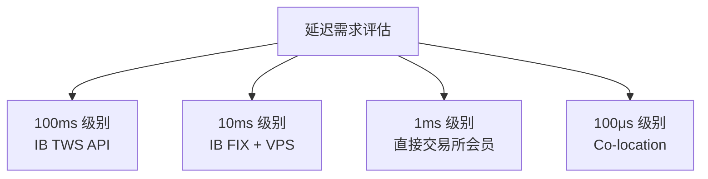

---

## 十一、总结

### 11.1 学习路线

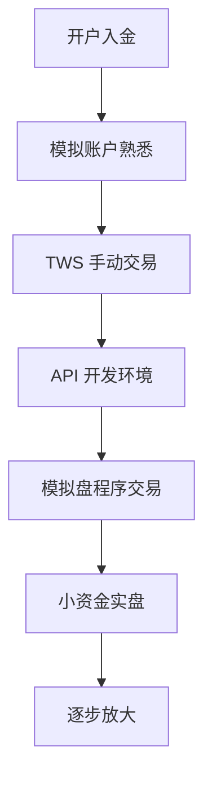

### 11.2 关键要点

| 阶段 | 要点 |
|------|------|
| 准备 | 开户、入金、开通权限 |
| 开发 | 从模拟盘开始，充分测试 |
| 实盘 | 小资金开始，严格风控 |
| 优化 | 监控、日志、持续改进 |

### 11.3 推荐资源

**官方文档：**
- IB API 文档：https://interactivebrokers.github.io/
- TWS API 指南：https://www.interactivebrokers.com/en/trading/ib-api.php

**社区资源：**
- IB 论坛：https://www.elitetrader.com/et/forums/interactive-brokers.22/
- GitHub 示例：https://github.com/InteractiveBrokers/tws-api

---

## 相关文章

- 上一篇：[C++ 程序化交易接口 QMT 与 Ptrade](/articles/quant/quant-24-A股程序化交易接口QMT与Ptrade/)
- [C++ 个人量化交易实战](/articles/quant/quant-22-Cpp个人量化交易实战/)
- [全球量化交易接口与数据](/articles/quant/quant-04-全球量化交易接口与数据/)
- [个人量化交易入门指南](/articles/quant/quant-01-个人量化交易入门指南/)
