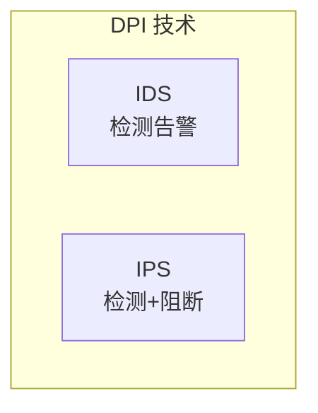
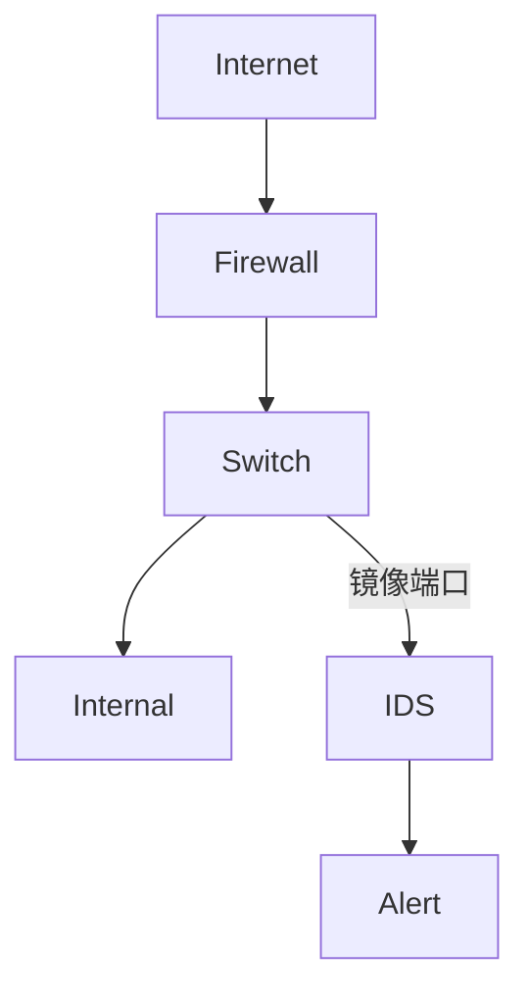
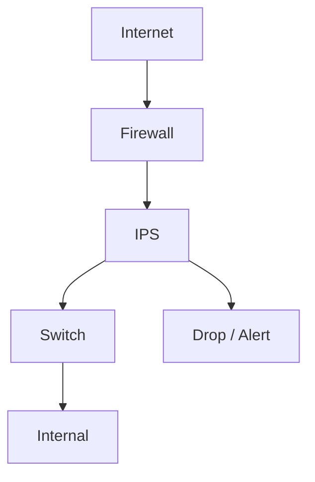
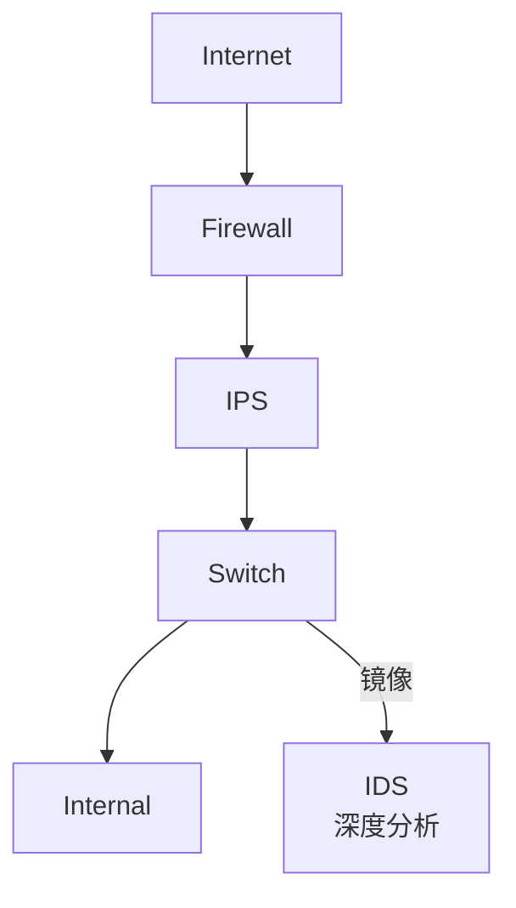
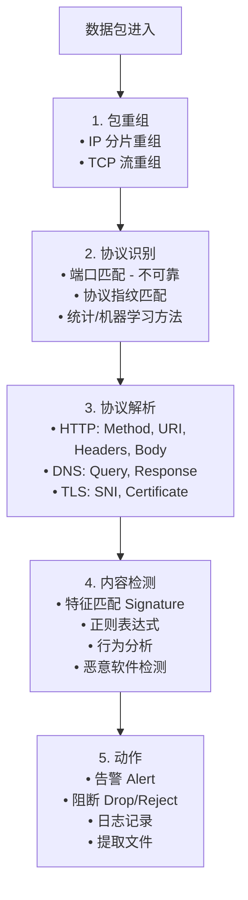
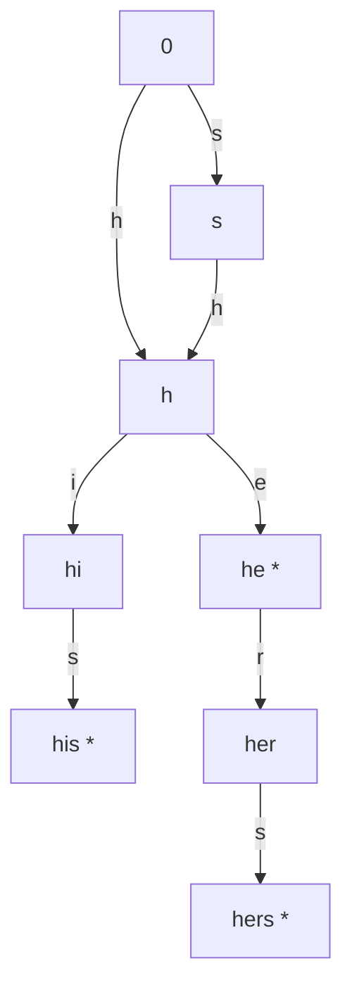
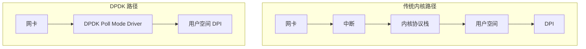

+++
title = "07. 深度包检测与入侵检测系统"
date = 2026-01-21
weight = 7000
description = "网络安全核心技术：DPI 深度包检测、IDS 入侵检测、IPS 入侵防御的原理、实现与实战"
[taxonomies]
tags = ["security", "dpi", "ids", "ips", "networking", "suricata", "snort"]
+++

# 深度包检测与入侵检测系统

现代网络安全需要深入分析网络流量以检测和阻止攻击。本文详解 DPI、IDS、IPS 的原理和实践。

---

## 一、基础概念

### 1.1 概念区分

| 概念 | 全称 | 定义 | 模式 | 部署 | 目的 |
|------|------|------|------|------|------|
| **DPI** | Deep Packet Inspection (深度包检测) | 分析数据包的应用层内容，而非仅看包头 | 技术，不是产品 | - | 网络监控、流量分类、安全检测、QoS |
| **IDS** | Intrusion Detection System (入侵检测系统) | 检测网络或系统中的恶意活动和违规行为 | 被动监控，检测并告警，不主动阻断 | 旁路部署（镜像流量） | 发现攻击，提供取证信息 |
| **IPS** | Intrusion Prevention System (入侵防御系统) | 检测并主动阻止恶意活动 | 在线（Inline）部署，可丢弃恶意包 | 串联在网络路径中 | 实时阻止攻击 |

**关系**：DPI 是 IDS/IPS 的核心技术之一。



### 1.2 与传统防火墙对比

| 特性 | 传统防火墙（L3/L4） | DPI/IDS/IPS |
|------|---------------------|-------------|
| 检查层次 | IP/端口 | 应用层内容 |
| 规则依据 | 五元组 | 内容特征、行为 |
| 协议识别 | 基于端口 | 基于内容指纹 |
| 加密流量 | 无法检查 | 部分可检查（TLS 解密） |
| 应用识别 | 不支持 | 支持 |
| 恶意软件检测 | 不支持 | 支持 |
| 性能 | 高 | 较低（需计算） |
| 误报 | 低 | 较高 |

**示例**：
- 传统防火墙：阻止目标端口 22 的连接
- DPI/IPS：检测 SSH 暴力破解行为（无论端口）

### 1.3 部署架构

**1. IDS 旁路模式（TAP/SPAN）**



- 优点：不影响网络性能，故障不影响业务
- 缺点：只能检测，不能阻断

**2. IPS 串联模式（Inline）**



- 优点：可以实时阻断攻击
- 缺点：增加延迟，故障可能中断业务

**3. 混合模式**



IPS 快速阻断，IDS 详细分析和取证

**4. 主机型 (HIDS/HIPS)**

在服务器内部署 Agent，监控文件/进程/网络。例如：OSSEC, Wazuh, Tripwire

---

## 二、DPI 深度包检测

### 2.1 DPI 工作原理

**DPI 检测流程**：



### 2.2 协议识别技术

**协议识别方法**：

| 方法 | 原理 | 示例 | 准确率 |
|------|------|------|--------|
| 基于端口 | 按端口号判断协议 | 80 → HTTP, 443 → HTTPS, 22 → SSH | 低（应用可使用非标准端口） |
| 基于签名 | 匹配协议特征字符串 | HTTP: "GET ", "POST "; SSH: "SSH-2.0"; TLS: Client Hello | 高（对已知协议） |
| 基于行为 | 分析流量统计特征（包大小、间隔、双向比例） | 视频流 vs 网页浏览 | 中（用于加密流量） |
| 机器学习 | 提取流量特征训练模型 | 可识别未知协议 | 中高（需大量标注数据） |

### 2.3 模式匹配算法

**字符串匹配算法**：

| 类型 | 算法 | 复杂度 | 说明 |
|------|------|--------|------|
| 单模式匹配 | Boyer-Moore | O(n/m) 最佳 | 适合单个规则匹配 |
| 单模式匹配 | KMP | O(n) | 适合单个规则匹配 |
| 多模式匹配 | Aho-Corasick | O(n + m) | 构建 DFA，一次扫描匹配所有模式，Snort/Suricata 使用 |
| 正则表达式 | 各种引擎 | 可变 | 更灵活但更慢，可能导致 ReDoS，推荐 Hyperscan 优化库 |

**Aho-Corasick 算法示例**（匹配 "he", "she", "his", "hers"）：



`*` = 匹配成功状态

---

## 三、IDS/IPS 检测技术

### 3.1 检测方法分类

**检测方法对比**：

| 方法 | 原理 | 优点 | 缺点 |
|------|------|------|------|
| 基于签名 | 匹配已知攻击的特征模式 | 误报低、可解释性强、检测速度快 | 无法检测 0-day、需要持续更新、变体可绕过 |
| 基于异常 | 建立正常行为基线，偏离则告警 | 可以检测未知攻击、适应性强 | 误报率高、需要学习期、攻击者可缓慢适应 |
| 基于策略 | 定义允许的行为规范，违反则告警 | 低误报、不需要学习期 | 需要手动定义策略、维护成本高 |

**示例规则（Snort 格式）**：

```
alert tcp any any -> any 80 (
    content:"GET";
    content:"/etc/passwd";
    msg:"Possible LFI attack";
    sid:1000001;
)
```

**基线特征示例**（基于异常）：流量模式（每小时请求数、包大小分布）、协议行为（DNS 查询频率、HTTP 方法分布）、用户行为（登录时间、访问资源）

**策略示例**（基于策略）：HTTP 方法只允许 GET/POST、DNS 只允许查询内部服务器、数据库只允许从应用服务器连接

### 3.2 常见检测场景

**典型攻击检测**：

| 攻击类型 | 检测特征 |
|----------|----------|
| 网络扫描 | 短时间内连接大量端口/IP、大量 SYN 包、RST 响应 |
| 暴力破解 | SSH/RDP/FTP 登录失败次数过多、Web 表单提交频率异常 |
| Web 攻击 | SQL 注入（' OR 1=1, UNION SELECT）、XSS（\<script\>）、路径遍历（../）、命令注入（; ls） |
| 恶意软件通信 | 已知 C2 域名/IP、DNS 隧道（异常长查询）、信标行为（定期连接） |
| 数据泄露 | 敏感信息外传（信用卡号、SSN）、异常大文件传输、非工作时间数据访问 |

---

## 四、Suricata 实战

### 4.1 安装与配置

```bash
# Ubuntu/Debian 安装
$ sudo add-apt-repository ppa:oisf/suricata-stable
$ sudo apt update
$ sudo apt install suricata

# CentOS/RHEL 安装
$ sudo yum install epel-release
$ sudo yum install suricata

# 查看版本
$ suricata --build-info

# 配置文件位置
# /etc/suricata/suricata.yaml
```

```yaml
# suricata.yaml 关键配置

# 网络接口
af-packet:
  - interface: eth0
    threads: auto
    cluster-type: cluster_flow
    defrag: yes

# 或使用 PCAP
pcap:
  - interface: eth0

# 规则文件
default-rule-path: /etc/suricata/rules
rule-files:
  - suricata.rules
  - local.rules

# 日志输出
outputs:
  - eve-log:
      enabled: yes
      filetype: regular
      filename: eve.json
      types:
        - alert
        - http
        - dns
        - tls
        - files
        - smtp
  
  - fast:
      enabled: yes
      filename: fast.log

# HOME_NET 定义
vars:
  address-groups:
    HOME_NET: "[192.168.0.0/16,10.0.0.0/8,172.16.0.0/12]"
    EXTERNAL_NET: "!$HOME_NET"
    HTTP_SERVERS: "$HOME_NET"
    DNS_SERVERS: "$HOME_NET"

# 检测引擎设置
detect:
  profile: medium
  custom-values:
    toclient-groups: 3
    toserver-groups: 25
  
# 应用层解析
app-layer:
  protocols:
    http:
      enabled: yes
      libhtp:
        default-config:
          personality: IDS
          request-body-limit: 100kb
          response-body-limit: 100kb
    
    tls:
      enabled: yes
      detection-ports:
        dp: 443
    
    dns:
      enabled: yes
```

### 4.2 规则编写

**Suricata 规则语法**：

**基本格式**：`action proto src_ip src_port -> dst_ip dst_port (options)`

| 组件 | 说明 |
|------|------|
| **Action** | alert (生成告警), pass (放行), drop (丢弃), reject (丢弃并发送 RST/ICMP) |
| **Protocol** | ip, tcp, udp, icmp, http, dns, tls, ssh 等应用层协议 |

```python
# 规则示例文件: local.rules

# 1. SQL 注入检测
alert http $EXTERNAL_NET any -> $HTTP_SERVERS any (
    msg:"SQL Injection Attempt - UNION SELECT";
    flow:to_server,established;
    http.uri;
    content:"union"; nocase;
    content:"select"; nocase; distance:0;
    classtype:web-application-attack;
    sid:1000001; rev:1;
)

# 2. XSS 检测
alert http $EXTERNAL_NET any -> $HTTP_SERVERS any (
    msg:"XSS Attempt - script tag";
    flow:to_server,established;
    http.uri;
    content:"<script"; nocase;
    classtype:web-application-attack;
    sid:1000002; rev:1;
)

# 3. SSH 暴力破解
alert ssh $EXTERNAL_NET any -> $HOME_NET 22 (
    msg:"SSH Brute Force Attempt";
    flow:to_server;
    threshold: type both, track by_src, count 5, seconds 60;
    classtype:attempted-admin;
    sid:1000003; rev:1;
)

# 4. DNS 隧道检测
alert dns any any -> any any (
    msg:"Possible DNS Tunneling - Long Query";
    dns.query;
    content:"|00|";   # 检测长查询
    isdataat:50,relative;
    classtype:bad-unknown;
    sid:1000004; rev:1;
)

# 5. 可疑文件下载
alert http any any -> any any (
    msg:"Executable Download";
    flow:from_server,established;
    http.response_body;
    content:"MZ"; depth:2;
    filemagic:"PE32 executable";
    classtype:policy-violation;
    sid:1000005; rev:1;
)

# 6. C2 通信检测（已知域名）
alert dns any any -> any any (
    msg:"Known Malware C2 Domain";
    dns.query;
    content:"malware-c2.evil.com"; nocase;
    classtype:trojan-activity;
    sid:1000006; rev:1;
)

# 7. 心跳信标检测
alert tcp $HOME_NET any -> $EXTERNAL_NET any (
    msg:"Possible Beacon Activity";
    flow:to_server,established;
    dsize:<100;
    threshold: type both, track by_src, count 10, seconds 300;
    classtype:trojan-activity;
    sid:1000007; rev:1;
)

# 8. 敏感数据泄露
alert http any any -> $EXTERNAL_NET any (
    msg:"Credit Card Number Leak";
    flow:to_server,established;
    http.request_body;
    pcre:"/\b(?:4[0-9]{12}(?:[0-9]{3})?|5[1-5][0-9]{14})\b/";
    classtype:sensitive-data;
    sid:1000008; rev:1;
)
```

### 4.3 运行与监控

```bash
# 测试规则语法
$ suricata -T -c /etc/suricata/suricata.yaml

# IDS 模式运行
$ suricata -c /etc/suricata/suricata.yaml -i eth0

# IPS 模式运行（需要 NFQUEUE）
$ suricata -c /etc/suricata/suricata.yaml -q 0
# 配合 iptables:
$ iptables -I FORWARD -j NFQUEUE --queue-num 0

# 后台运行（systemd）
$ sudo systemctl start suricata
$ sudo systemctl status suricata

# 查看告警
$ tail -f /var/log/suricata/fast.log
$ tail -f /var/log/suricata/eve.json | jq .

# 更新规则
$ sudo suricata-update
$ sudo suricata-update list-sources
$ sudo suricata-update enable-source et/open

# 重载规则（不重启）
$ sudo suricatasc -c reload-rules
```

### 4.4 EVE JSON 日志分析

```bash
# EVE JSON 格式示例
{
  "timestamp": "2024-01-15T10:30:45.123456+0800",
  "event_type": "alert",
  "src_ip": "192.168.1.100",
  "src_port": 45678,
  "dest_ip": "10.0.0.50",
  "dest_port": 80,
  "proto": "TCP",
  "alert": {
    "action": "allowed",
    "gid": 1,
    "signature_id": 1000001,
    "rev": 1,
    "signature": "SQL Injection Attempt - UNION SELECT",
    "category": "Web Application Attack",
    "severity": 1
  },
  "http": {
    "hostname": "www.example.com",
    "url": "/search?q=test' UNION SELECT * FROM users--",
    "http_method": "GET",
    "protocol": "HTTP/1.1",
    "status": 200,
    "length": 1234
  },
  "flow_id": 123456789
}

# 使用 jq 分析
# 统计告警类型
$ cat eve.json | jq -r 'select(.event_type=="alert") | .alert.signature' | sort | uniq -c | sort -rn

# 统计来源 IP
$ cat eve.json | jq -r 'select(.event_type=="alert") | .src_ip' | sort | uniq -c | sort -rn

# 查看 HTTP 请求
$ cat eve.json | jq 'select(.event_type=="http") | {url: .http.url, method: .http.http_method}'

# 使用 ELK Stack 可视化
# Filebeat -> Elasticsearch -> Kibana
```

---

## 五、Snort 简介

```bash
# Snort 3 安装（简化）
$ sudo apt install snort

# 基本运行
$ snort -c /etc/snort/snort.conf -i eth0 -A console

# Snort 规则格式与 Suricata 类似
alert tcp any any -> any 80 (
    msg:"HTTP GET Request";
    content:"GET";
    sid:1000001;
)

# Snort vs Suricata 对比
# | 特性       | Snort          | Suricata        |
# |------------|----------------|-----------------|
# | 多线程     | Snort 3 支持   | 原生支持        |
# | 性能       | 较好           | 更好            |
# | 规则兼容   | -              | 兼容 Snort 规则 |
# | 应用层解析 | 支持           | 更丰富          |
# | 社区       | 历史悠久       | 活跃            |
```

---

## 六、高性能 DPI 技术

### 6.1 eBPF/XDP 加速

```c
/*
 * 使用 XDP 进行快速包过滤
 * 在网卡驱动层直接丢弃恶意包
 */

#include <linux/bpf.h>
#include <linux/if_ether.h>
#include <linux/ip.h>
#include <linux/tcp.h>

/* 恶意 IP 黑名单（简化示例） */
struct {
    __uint(type, BPF_MAP_TYPE_HASH);
    __type(key, __u32);     /* IP 地址 */
    __type(value, __u32);   /* 计数 */
    __uint(max_entries, 10000);
} blacklist SEC(".maps");

SEC("xdp")
int xdp_filter(struct xdp_md *ctx)
{
    void *data = (void *)(long)ctx->data;
    void *data_end = (void *)(long)ctx->data_end;
    
    struct ethhdr *eth = data;
    if ((void *)(eth + 1) > data_end)
        return XDP_PASS;
    
    if (eth->h_proto != htons(ETH_P_IP))
        return XDP_PASS;
    
    struct iphdr *ip = (void *)(eth + 1);
    if ((void *)(ip + 1) > data_end)
        return XDP_PASS;
    
    /* 检查源 IP 是否在黑名单 */
    __u32 src_ip = ip->saddr;
    __u32 *count = bpf_map_lookup_elem(&blacklist, &src_ip);
    if (count) {
        /* 在黑名单中，丢弃 */
        (*count)++;
        return XDP_DROP;
    }
    
    return XDP_PASS;
}

char _license[] SEC("license") = "GPL";
```

### 6.2 DPDK 加速

**DPDK 在 DPI 中的应用**：



| 路径 | 特点 |
|------|------|
| 传统内核路径 | 多次上下文切换和拷贝 |
| DPDK 路径 | 零拷贝、无中断、用户态直接处理 |

**DPDK 优势**：
- 10x-100x 性能提升
- 支持 10G/40G/100G 网卡线速处理
- 可与 Suricata/Snort 集成

**开源项目**：Suricata + AF_PACKET/DPDK、ntopng、DPDK 原生应用

### 6.3 Hyperscan 正则引擎

```c
/*
 * Hyperscan 高性能正则匹配示例
 * Intel 开发，针对安全检测优化
 */

#include <hs/hs.h>

/* 多个模式同时匹配 */
const char *patterns[] = {
    "SELECT.*FROM.*WHERE",    /* SQL 注入 */
    "<script[^>]*>",          /* XSS */
    "\\.\\./",                /* 路径遍历 */
};

/* 匹配回调 */
static int on_match(unsigned int id, unsigned long long from,
                    unsigned long long to, unsigned int flags,
                    void *ctx)
{
    printf("Pattern %u matched at offset %llu-%llu\n", id, from, to);
    return 0;  /* 继续扫描 */
}

int main()
{
    hs_database_t *db = NULL;
    hs_compile_error_t *compile_err = NULL;
    hs_scratch_t *scratch = NULL;
    
    /* 编译多个模式 */
    unsigned int ids[] = {1, 2, 3};
    unsigned int flags[] = {HS_FLAG_CASELESS, HS_FLAG_CASELESS, 0};
    
    hs_error_t err = hs_compile_multi(patterns, flags, ids, 3,
                                       HS_MODE_BLOCK, NULL,
                                       &db, &compile_err);
    if (err != HS_SUCCESS) {
        fprintf(stderr, "Compile error: %s\n", compile_err->message);
        return 1;
    }
    
    /* 分配扫描空间 */
    hs_alloc_scratch(db, &scratch);
    
    /* 扫描数据 */
    const char *data = "GET /admin?id=1' UNION SELECT * FROM users--";
    hs_scan(db, data, strlen(data), 0, scratch, on_match, NULL);
    
    /* 清理 */
    hs_free_scratch(scratch);
    hs_free_database(db);
    
    return 0;
}

/*
 * Hyperscan 特点：
 * • 同时匹配数千个模式
 * • 利用 SIMD 指令加速
 * • 支持流模式（跨包匹配）
 * • Suricata 可选后端
 */
```

---

## 七、最佳实践

**IDS/IPS 部署最佳实践**：

| 类别 | 实践要点 |
|------|---------|
| **1. 规则管理** | 定期更新规则（每日/每周）、禁用不相关规则、自定义规则需测试、版本控制规则配置 |
| **2. 性能优化** | 合理设置 HOME_NET、使用多队列/多线程、考虑硬件加速（DPDK、网卡卸载）、监控 CPU/内存使用 |
| **3. 误报管理** | 建立误报白名单、分析误报原因、分级告警（高中低）、自动化过滤已知误报 |
| **4. 日志与监控** | 集中日志管理（ELK/Splunk）、实时告警通知、定期审计告警、保留日志用于取证 |
| **5. 高可用** | IPS 部署 Bypass 开关、主备部署、监控 IDS/IPS 健康状态 |

---

## 八、加密流量检测

### 8.1 TLS 流量挑战

**加密流量检测挑战**：

**传统 DPI 局限性**：
- TLS 加密后载荷不可见
- 无法进行内容签名匹配
- 恶意软件利用加密隐藏通信
- HTTPS 流量占比已超过 90%

| 解决方案 | 说明 |
|---------|------|
| TLS 解密（中间人） | 隐私/性能开销大 |
| 元数据分析 | 分析未加密字段 |
| TLS 指纹 | 识别客户端/恶意软件 |
| 行为分析 | 流量模式、时序分析 |
| 机器学习 | 分类加密流量 |

### 8.2 TLS 指纹技术

```
**TLS 指纹（JA3/JA3S/JA4）**：

| 指纹类型 | 基于 | 组成要素 |
|---------|------|---------|
| **JA3（客户端指纹）** | Client Hello | TLS版本、Cipher Suites、Extensions、Elliptic Curves、EC Point Formats |
| **JA3S（服务器指纹）** | Server Hello | TLS版本、选择的 Cipher Suite、Extensions |
| **JA4（改进版 2023）** | Client Hello | 更具可读性、支持QUIC、分段哈希、格式：协议_版本_SNI_cipher数量_ext数量_ALPN |

**JA3 示例**：
- JA3 = `771,4866-4867-4865-...,0-23-65281-...,29-23-24,0`
- JA3 Hash = `e7d705a3286e19ea42f587b344ee6865`

**已知恶意软件 JA3 指纹**：Trickbot、Emotet、Cobalt Strike、Metasploit

**检测策略**：
- 维护已知恶意 JA3 黑名单
- 检测异常 JA3（如 curl 伪装成浏览器但指纹不匹配）
- JA3 + SNI 组合分析

### 8.3 Suricata TLS 检测

```yaml
# suricata.yaml - 启用 TLS 日志和 JA3
app-layer:
  protocols:
    tls:
      enabled: yes
      detection-ports:
        dp: 443
      ja3-fingerprints: yes  # 启用 JA3

outputs:
  - eve-log:
      enabled: yes
      types:
        - tls:
            extended: yes  # 记录证书信息
```

```bash
# Suricata TLS 规则示例

# 检测已知恶意 JA3
alert tls any any -> any any (msg:"Known Malware JA3 - Cobalt Strike"; \
    ja3.hash; content:"72a589da586844d7f0818ce684948eea"; \
    classtype:trojan-activity; sid:2000001; rev:1;)

# 检测自签名证书
alert tls any any -> any any (msg:"Self-signed Certificate"; \
    tls.cert_issuer; content:"CN="; \
    tls.cert_subject; content:"CN="; \
    tls.cert_issuer; content: "O="; \
    flow:established,to_server; \
    classtype:bad-unknown; sid:2000002; rev:1;)

# 检测即将过期证书
alert tls any any -> any any (msg:"TLS Certificate Expires Soon"; \
    tls.cert_validity; content:"<30"; \
    flow:established,to_server; \
    classtype:policy-violation; sid:2000003; rev:1;)

# 检测弱加密套件
alert tls any any -> any any (msg:"Weak TLS Cipher RC4"; \
    tls.ciphersuite; content:"RC4"; \
    flow:established; \
    classtype:policy-violation; sid:2000004; rev:1;)

# SNI 检测
alert tls any any -> any any (msg:"Suspicious TLS SNI"; \
    tls.sni; content:".onion"; nocase; \
    classtype:policy-violation; sid:2000005; rev:1;)
```

### 8.4 JA3 实现示例

```python
"""
JA3 指纹计算工具
用于分析 PCAP 中的 TLS 客户端指纹
"""

import hashlib
from scapy.all import rdpcap, TLS

def parse_client_hello(packet):
    """解析 TLS Client Hello"""
    if not packet.haslayer(TLS):
        return None
    
    tls = packet[TLS]
    if tls.type != 22:  # Handshake
        return None
    
    # 简化示例 - 实际需要完整解析
    try:
        hello = tls.msg[0]
        if hello.msgtype != 1:  # Client Hello
            return None
        
        version = hello.version
        ciphers = hello.cipher_suites
        extensions = hello.ext
        
        return {
            'version': version,
            'ciphers': ciphers,
            'extensions': extensions
        }
    except:
        return None

def calculate_ja3(client_hello):
    """计算 JA3 指纹"""
    if not client_hello:
        return None
    
    # 提取字段
    version = client_hello['version']
    ciphers = '-'.join(str(c) for c in client_hello['ciphers']
                       if c not in [0x00ff])  # 排除 GREASE
    
    # 提取 extensions、curves、point formats
    extensions = []
    curves = []
    point_formats = []
    
    for ext in client_hello.get('extensions', []):
        ext_type = ext.type
        if ext_type not in GREASE_VALUES:
            extensions.append(str(ext_type))
        
        if ext_type == 10:  # supported_groups
            curves = [str(c) for c in ext.groups if c not in GREASE_VALUES]
        elif ext_type == 11:  # ec_point_formats
            point_formats = [str(f) for f in ext.formats]
    
    ja3_string = ','.join([
        str(version),
        ciphers,
        '-'.join(extensions),
        '-'.join(curves),
        '-'.join(point_formats)
    ])
    
    ja3_hash = hashlib.md5(ja3_string.encode()).hexdigest()
    
    return {
        'ja3_string': ja3_string,
        'ja3_hash': ja3_hash
    }

# GREASE 值（随机化，应排除）
GREASE_VALUES = {
    0x0a0a, 0x1a1a, 0x2a2a, 0x3a3a,
    0x4a4a, 0x5a5a, 0x6a6a, 0x7a7a,
    0x8a8a, 0x9a9a, 0xaaaa, 0xbaba,
    0xcaca, 0xdada, 0xeaea, 0xfafa
}

# 已知恶意软件 JA3 数据库
MALWARE_JA3 = {
    '72a589da586844d7f0818ce684948eea': 'Cobalt Strike',
    '6734f37431670b3ab4292b8f60f29984': 'Metasploit',
    'e7d705a3286e19ea42f587b344ee6865': 'Trickbot',
}

def detect_malware(ja3_hash):
    """检测已知恶意软件"""
    return MALWARE_JA3.get(ja3_hash)
```

### 8.5 加密流量机器学习

**加密流量 ML 分类**：

**特征提取（无需解密）**：

| 特征类别 | 具体特征 |
|---------|---------|
| **流级特征** | 流持续时间、包数量/字节数、上下行比例、包间隔时间统计、包大小分布 |
| **TLS 特征** | JA3/JA3S 哈希、证书链长度、证书有效期、SNI 特征、协商的加密套件 |
| **DNS 关联** | 域名年龄、DNS 记录类型、TTL 值 |

**分类模型**：

| 模型 | 优势 |
|------|------|
| Random Forest | 解释性好 |
| XGBoost | 准确率高 |
| LSTM | 时序分析 |
| Autoencoder | 异常检测 |

**分类目标**：应用识别（Netflix/YouTube/Zoom/...）、恶意软件检测、C2 通信识别、数据泄露检测

---

## 相关文章

- [上一篇：06 - 安全面试指南](@/articles/security/sec-06-安全面试指南.md)
- [01 - 安全基础与威胁模型](@/articles/security/sec-01-安全基础与威胁模型.md)
- [16 - 网络安全基础](@/articles/networking/net-16-网络安全基础.md)
