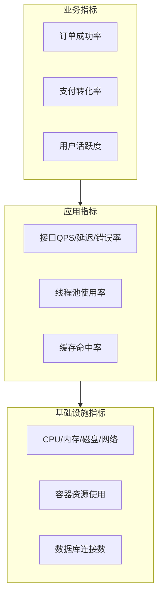
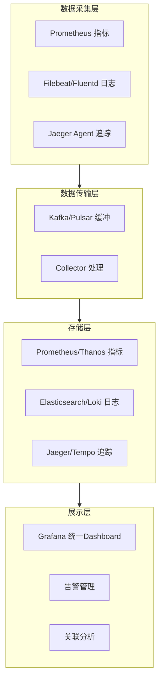

+++
title = "03. 可观测性体系建设"
date = 2026-01-19
weight = 3000
description = "可观测性三大支柱：Metrics指标体系、Logs日志管理、Traces分布式追踪，以及统一可观测性平台建设"
[taxonomies]
tags = ["SRE", "可观测性", "监控"]
+++

## 可观测性 vs 监控

### 监控（Monitoring）

监控是**已知问题的检测**：
- 预定义的指标和阈值
- 回答"是什么出了问题"
- 适合已知的故障模式

### 可观测性（Observability）

可观测性是**未知问题的探索**：
- 从系统输出推断内部状态
- 回答"为什么出了问题"
- 适合复杂分布式系统

**可观测性 = Metrics + Logs + Traces + 关联分析**

---

## 三大支柱

### Metrics（指标）

**定义**：数值型时间序列数据。

**特点**：
- 高度聚合，存储成本低
- 适合趋势分析和告警
- 无法提供细节

**指标类型**：

| 类型 | 描述 | 示例 |
|------|------|------|
| Counter | 只增不减的计数器 | 请求总数、错误总数 |
| Gauge | 可增可减的瞬时值 | CPU使用率、内存占用 |
| Histogram | 值的分布统计 | 延迟分布、响应大小分布 |
| Summary | 客户端计算的百分位数 | P50、P99延迟 |

**四个黄金信号**：

1. **延迟（Latency）**
   - 成功请求的延迟
   - 失败请求的延迟（通常更短，要分开统计）

2. **流量（Traffic）**
   - HTTP请求QPS
   - 数据库查询QPS
   - 消息队列消费速率

3. **错误（Errors）**
   - 显式错误（5xx）
   - 隐式错误（响应内容错误）
   - 策略违规（SLO违规）

4. **饱和度（Saturation）**
   - CPU、内存、磁盘使用率
   - 线程池、连接池使用率
   - 队列长度

### Logs（日志）

**定义**：离散的事件记录。

**特点**：
- 包含丰富的上下文
- 存储成本高
- 适合故障排查和审计

**日志级别**：

| 级别 | 用途 | 生产环境 |
|------|------|----------|
| DEBUG | 开发调试 | 通常关闭 |
| INFO | 正常运行信息 | 关键路径开启 |
| WARN | 潜在问题 | 开启 |
| ERROR | 错误事件 | 开启 |
| FATAL | 致命错误 | 开启 |

**结构化日志**：

传统日志：
```
2026-01-19 10:30:45 ERROR Failed to process order 12345
```

结构化日志（推荐）：
```json
{
  "timestamp": "2026-01-19T10:30:45Z",
  "level": "ERROR",
  "message": "Failed to process order",
  "order_id": "12345",
  "user_id": "user-789",
  "error": "Payment declined",
  "trace_id": "abc123"
}
```

结构化日志的优势：
- 易于检索和过滤
- 可与其他数据关联
- 支持自动化分析

### Traces（追踪）

**定义**：请求在分布式系统中的完整路径。

**核心概念**：

- **Trace**：一次请求的完整调用链
- **Span**：调用链中的单个操作
- **Context**：在服务间传递的追踪信息

**Span结构**：
```
Span {
  trace_id: "abc123"      // 全局唯一
  span_id: "span-1"       // 当前Span ID
  parent_span_id: "span-0" // 父Span ID
  operation: "HTTP GET /api/orders"
  start_time: 1705657845000
  duration: 150ms
  tags: {
    "http.status_code": 200,
    "db.type": "mysql"
  }
  logs: [
    { time: ..., message: "Query executed" }
  ]
}
```

**追踪的价值**：
- 定位慢请求的瓶颈在哪个服务
- 发现服务间的依赖关系
- 识别级联故障的传播路径

---

## 指标体系设计

### RED方法（面向服务）

适用于请求驱动的服务：

- **R**ate：请求速率（QPS）
- **E**rrors：错误率
- **D**uration：请求延迟

### USE方法（面向资源）

适用于资源监控：

- **U**tilization：使用率（忙碌时间占比）
- **S**aturation：饱和度（排队程度）
- **E**rrors：错误数

### 分层指标



### 指标命名规范

遵循Prometheus命名规范：

```
# 格式：namespace_subsystem_name_unit

# 好的命名
http_requests_total
http_request_duration_seconds
node_memory_usage_bytes

# 不好的命名
requests              # 太模糊
http_request_latency  # 缺少单位
httpRequestsTotal     # 不符合规范
```

---

## 日志管理实践

### 日志采集架构

```
应用日志 → 采集Agent → 消息队列 → 处理管道 → 存储 → 查询UI
          (Filebeat)   (Kafka)    (Logstash)  (ES)   (Kibana)
```

### 日志采集策略

**采集什么**：
- 应用日志（业务日志、错误日志）
- 访问日志（Nginx、API Gateway）
- 系统日志（syslog、内核日志）
- 审计日志（安全相关操作）

**不采集什么**：
- DEBUG日志（生产环境）
- 敏感信息（密码、信用卡号）
- 高频重复日志

### 日志保留策略

| 日志类型 | 热存储 | 温存储 | 冷存储 |
|----------|--------|--------|--------|
| 业务日志 | 7天 | 30天 | 1年 |
| 访问日志 | 3天 | 14天 | 90天 |
| 错误日志 | 30天 | 90天 | 永久 |
| 审计日志 | 90天 | 1年 | 7年 |

### 日志关联

通过trace_id关联日志和追踪：

```json
{
  "trace_id": "abc123",
  "span_id": "span-5",
  "message": "Database query slow",
  "query_time_ms": 2500
}
```

在追踪系统中点击span，可以直接跳转到相关日志。

---

## 分布式追踪实践

### 追踪传播

HTTP Header传播（W3C Trace Context）：
```
traceparent: 00-abc123-span1-01
tracestate: vendor=value
```

gRPC Metadata传播：
```
x-trace-id: abc123
x-span-id: span1
```

### 采样策略

全量采集不现实，需要采样：

**头部采样（Head-based）**：
- 在请求入口决定是否采样
- 简单，但可能遗漏重要请求

**尾部采样（Tail-based）**：
- 收集完整trace后再决定是否保留
- 可以保留错误和慢请求
- 实现复杂

**采样规则示例**：
```
# 保留所有错误请求
if error: sample = 100%

# 保留所有慢请求
if duration > 1s: sample = 100%

# 普通请求采样1%
default: sample = 1%
```

### 追踪与指标结合

从追踪数据生成RED指标：

```
# 请求速率
rate(traces_total[5m])

# 错误率
rate(traces_total{status="error"}[5m]) / rate(traces_total[5m])

# 延迟分布
histogram_quantile(0.99, traces_duration_bucket)
```

---

## 告警设计

### 告警原则

1. **基于症状，而非原因**
   - 告警"API错误率>1%"，而非"数据库CPU>80%"
   - 症状直接影响用户，原因可能是误报

2. **可操作**
   - 收到告警后要有明确的行动
   - 无法行动的告警只会造成疲劳

3. **避免重复**
   - 同一问题只告警一次
   - 使用告警抑制和分组

4. **分级处理**
   - P0：立即处理，5分钟内响应
   - P1：紧急，30分钟内响应
   - P2：重要，4小时内响应
   - P3：一般，下个工作日处理

### 告警配置示例

```yaml
# 基于SLO的告警
groups:
  - name: slo_alerts
    rules:
      # 错误预算消耗速率告警
      - alert: ErrorBudgetBurnRate
        expr: |
          (
            rate(http_requests_total{status=~"5.."}[1h])
            / rate(http_requests_total[1h])
          ) > 14.4 * 0.001  # 14.4倍的错误率意味着1小时耗尽1天预算
        for: 5m
        labels:
          severity: critical
        annotations:
          summary: "Error budget burning too fast"
          
      # 多窗口告警（更精确）
      - alert: HighErrorRate
        expr: |
          (
            # 短窗口高错误率
            rate(http_requests_total{status=~"5.."}[5m])
            / rate(http_requests_total[5m]) > 0.01
          ) and (
            # 长窗口确认趋势
            rate(http_requests_total{status=~"5.."}[1h])
            / rate(http_requests_total[1h]) > 0.005
          )
        for: 2m
        labels:
          severity: warning
```

### 告警疲劳治理

**识别问题告警**：
- 频繁触发又自动恢复
- 触发后无人处理
- 总是被静默

**治理措施**：
- 定期Review告警规则
- 删除无效告警
- 调整阈值和持续时间
- 合并相关告警

---

## 统一可观测性平台

### 平台架构



### 数据关联

通过统一的标签实现关联：

```
所有数据都包含：
- service: 服务名
- env: 环境
- instance: 实例ID
- trace_id: 追踪ID（日志和追踪）
```

在Grafana中实现：
- 从指标异常点击，跳转到相关日志
- 从日志中的trace_id，跳转到追踪详情
- 从追踪的span，查看相关指标

---

## 总结

| 支柱 | 回答问题 | 存储成本 | 查询方式 |
|------|----------|----------|----------|
| Metrics | What？发生了什么 | 低 | 聚合查询 |
| Logs | Why？为什么发生 | 高 | 全文搜索 |
| Traces | Where？在哪里发生 | 中 | 链路追踪 |

**建设优先级**：
1. 先建立基础指标监控
2. 再完善日志采集和查询
3. 最后引入分布式追踪
4. 持续优化关联分析能力

可观测性不是目的，而是手段。最终目标是**快速发现问题、定位问题、解决问题**。

---

## 相关文章

- [上一篇：SLI/SLO/SLA与错误预算](@/articles/sre/sre-02-SLI-SLO-SLA与错误预算.md)
- [下一篇：告警设计与On-Call实践](@/articles/sre/sre-04-告警设计与OnCall实践.md)
