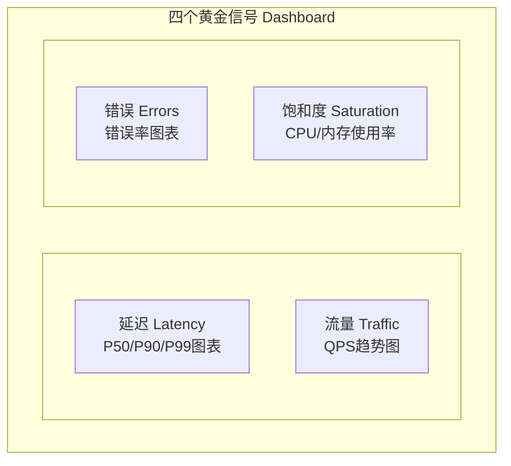
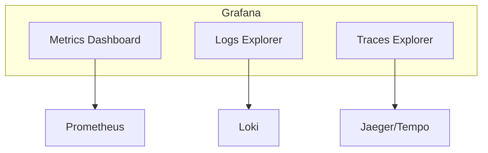

+++
title = "10. SRE工具链详解"
date = 2026-01-19
weight = 10000
description = "SRE核心工具实战：Prometheus监控、Grafana可视化、AlertManager告警、PagerDuty事故管理"
[taxonomies]
tags = ["SRE", "Prometheus", "Grafana", "监控"]
+++

## 监控系统：Prometheus

### Prometheus架构

```
Targets（被监控对象）
    ↓ Pull
Prometheus Server
  ├── Retrieval（抓取）
  ├── TSDB（时序数据库）
  └── HTTP Server（查询接口）
    ↓
AlertManager → 通知渠道
    ↓
Grafana → 可视化
```

### 核心概念

**指标类型**：

| 类型 | 描述 | 使用场景 |
|------|------|----------|
| Counter | 只增不减 | 请求总数、错误总数 |
| Gauge | 可增可减 | CPU使用率、内存占用 |
| Histogram | 分布统计 | 延迟分布 |
| Summary | 百分位数 | P50/P99延迟 |

**标签（Labels）**：
```
http_requests_total{method="GET", status="200", path="/api/users"}
```
标签用于多维度查询和聚合。

### PromQL查询

**基础查询**：
```
# 当前值
http_requests_total

# 带标签过滤
http_requests_total{status="500"}

# 正则匹配
http_requests_total{path=~"/api/.*"}
```

**范围查询与函数**：
```
# 过去5分钟的数据
http_requests_total[5m]

# 每秒请求率
rate(http_requests_total[5m])

# 请求增量
increase(http_requests_total[1h])
```

**聚合操作**：
```
# 按status求和
sum by (status) (rate(http_requests_total[5m]))

# 错误率
sum(rate(http_requests_total{status=~"5.."}[5m])) 
/ sum(rate(http_requests_total[5m]))

# P99延迟
histogram_quantile(0.99, 
  sum by (le) (rate(http_request_duration_bucket[5m]))
)
```

### 服务发现

**静态配置**：
```yaml
scrape_configs:
  - job_name: 'web-servers'
    static_configs:
      - targets: ['web1:9090', 'web2:9090']
```

**Kubernetes服务发现**：
```yaml
scrape_configs:
  - job_name: 'kubernetes-pods'
    kubernetes_sd_configs:
      - role: pod
    relabel_configs:
      - source_labels: [__meta_kubernetes_pod_annotation_prometheus_io_scrape]
        action: keep
        regex: true
```

### 高可用部署

**方案一：联邦集群**
```
Prometheus(边缘) → Prometheus(中心) → Grafana
```

**方案二：Thanos/Cortex**
- 长期存储
- 全局查询
- 高可用

---

## 可视化：Grafana

### Dashboard设计原则

**层次结构**：
```
概览Dashboard
  ├── 关键业务指标
  ├── 核心服务健康
  └── 基础设施概况
      ↓ 下钻
服务Dashboard
  ├── 该服务的详细指标
  └── 相关依赖状态
      ↓ 下钻
实例Dashboard
  └── 单实例详细数据
```

**四个黄金信号Dashboard**：



### 变量与模板

**定义变量**：
```
Variable: service
Query: label_values(up, job)
```

**在查询中使用**：
```
rate(http_requests_total{job="$service"}[5m])
```

这样一个Dashboard可以查看所有服务。

### 告警规则

Grafana也支持告警：
```yaml
alert:
  name: High Error Rate
  condition: avg() OF query(A) > 0.01
  for: 5m
  notifications:
    - slack-channel
```

但更推荐使用Prometheus AlertManager。

---

## 告警管理：AlertManager

### 告警规则配置

**Prometheus告警规则**：
```yaml
groups:
  - name: slo_alerts
    rules:
      - alert: HighErrorRate
        expr: |
          sum(rate(http_requests_total{status=~"5.."}[5m])) 
          / sum(rate(http_requests_total[5m])) > 0.01
        for: 5m
        labels:
          severity: critical
        annotations:
          summary: "Error rate is above 1%"
          description: "Current error rate: {{ $value | printf \"%.2f\" }}%"
```

### AlertManager配置

**路由配置**：
```yaml
route:
  receiver: 'default-receiver'
  group_by: ['alertname', 'service']
  group_wait: 30s
  group_interval: 5m
  repeat_interval: 4h
  
  routes:
    # P0告警 → 电话通知
    - match:
        severity: critical
      receiver: 'pagerduty-critical'
      
    # P1告警 → Slack通知
    - match:
        severity: warning
      receiver: 'slack-warning'
```

**接收器配置**：
```yaml
receivers:
  - name: 'slack-warning'
    slack_configs:
      - api_url: 'https://hooks.slack.com/services/xxx'
        channel: '#alerts'
        title: '{{ .GroupLabels.alertname }}'
        text: '{{ .Annotations.description }}'
        
  - name: 'pagerduty-critical'
    pagerduty_configs:
      - service_key: 'xxx'
        severity: critical
```

### 告警抑制

```yaml
inhibit_rules:
  # 服务不可用时，抑制该服务的其他告警
  - source_match:
      alertname: ServiceDown
    target_match_re:
      alertname: '.+'
    equal: ['service']
```

### 静默（Silence）

临时屏蔽告警：
```bash
# 创建静默
amtool silence add alertname=HighCPU --duration=2h --comment="维护窗口"

# 查看静默
amtool silence query
```

---

## 事故管理：PagerDuty

### 核心概念

**Service**：代表一个服务或系统
**Escalation Policy**：升级策略
**Schedule**：On-Call排班
**Incident**：事故

### 集成配置

**与AlertManager集成**：
```yaml
receivers:
  - name: 'pagerduty'
    pagerduty_configs:
      - routing_key: 'your-integration-key'
        severity: '{{ .CommonLabels.severity }}'
        description: '{{ .CommonAnnotations.summary }}'
        details:
          firing: '{{ .Alerts.Firing | len }}'
          resolved: '{{ .Alerts.Resolved | len }}'
```

### 升级策略

```
Level 1: Primary On-Call
    ↓ 5分钟无响应
Level 2: Secondary On-Call  
    ↓ 10分钟无响应
Level 3: Team Lead
    ↓ 15分钟无响应
Level 4: Engineering Manager
```

### 事故生命周期

```
Triggered → Acknowledged → Resolved
              ↓
         (超时未确认)
              ↓
         Escalated
```

---

## 日志系统：ELK/Loki

### ELK Stack

```
Beats/Filebeat → Logstash → Elasticsearch → Kibana
  (采集)         (处理)      (存储)         (查询)
```

**Filebeat配置**：
```yaml
filebeat.inputs:
  - type: log
    paths:
      - /var/log/app/*.log
    json.keys_under_root: true
    
output.elasticsearch:
  hosts: ["elasticsearch:9200"]
  index: "app-logs-%{+yyyy.MM.dd}"
```

### Grafana Loki

更轻量的日志方案：

```
Promtail → Loki → Grafana
 (采集)   (存储)  (查询)
```

**Promtail配置**：
```yaml
scrape_configs:
  - job_name: kubernetes-pods
    kubernetes_sd_configs:
      - role: pod
    pipeline_stages:
      - json:
          expressions:
            level: level
            msg: message
      - labels:
          level:
```

**LogQL查询**：
```
# 查看错误日志
{app="payment"} |= "error"

# JSON解析后过滤
{app="payment"} | json | level="error"

# 统计错误数量
sum(rate({app="payment"} |= "error" [5m]))
```

---

## 追踪系统：Jaeger

### 架构

```
Application → Jaeger Agent → Jaeger Collector → Storage → Jaeger Query
   (SDK)       (本地代理)      (收集处理)       (ES/Cassandra) (UI查询)
```

### 应用集成

**OpenTelemetry SDK**：
```python
from opentelemetry import trace
from opentelemetry.sdk.trace import TracerProvider
from opentelemetry.exporter.jaeger.thrift import JaegerExporter

# 配置Jaeger导出
jaeger_exporter = JaegerExporter(
    agent_host_name="jaeger-agent",
    agent_port=6831,
)

# 创建Tracer
tracer = trace.get_tracer(__name__)

# 使用
with tracer.start_as_current_span("my-operation"):
    # 业务逻辑
    pass
```

### 采样策略

```yaml
# Jaeger采样配置
sampling:
  strategies:
    - type: probabilistic
      param: 0.1  # 10%采样
    - type: ratelimiting
      param: 100  # 每秒最多100条
```

---

## 工具链集成

### 统一可观测性平台



### 关联查询

**从指标到日志**：
- Dashboard中点击异常时间点
- 跳转到对应时间范围的日志

**从日志到追踪**：
- 日志中包含trace_id
- 点击跳转到完整调用链

**从追踪到指标**：
- 查看span对应服务的指标
- 分析性能问题

---

## 总结

| 工具 | 用途 | 关键配置 |
|------|------|----------|
| Prometheus | 指标采集存储 | scrape_config、rules |
| Grafana | 可视化 | Dashboard、Variables |
| AlertManager | 告警路由 | route、receivers、inhibit |
| PagerDuty | 事故管理 | Escalation、Schedule |
| Loki/ELK | 日志系统 | 采集、索引、查询 |
| Jaeger | 分布式追踪 | SDK集成、采样策略 |

工具是手段，不是目的。选择工具时考虑：
- 团队熟悉程度
- 与现有系统的集成
- 运维成本
- 社区活跃度

---

## 相关文章

- [上一篇：自动化与Toil消除](@/articles/sre/sre-09-自动化与Toil消除.md)
- [下一篇：分布式系统可靠性设计](@/articles/sre/sre-11-分布式系统可靠性设计.md)
