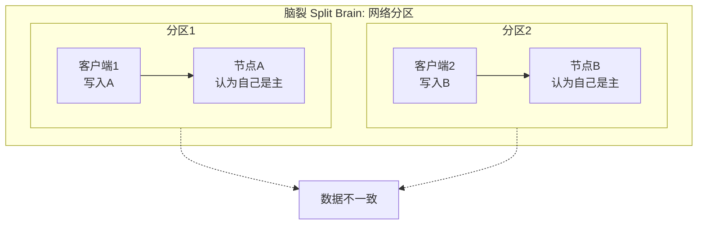

+++
title = "36. 高可用与故障切换实战"
date = 2026-01-21
weight = 36000
description = "SRE高可用与故障切换完整指南：主从切换、集群脑裂、负载均衡故障的排查与处理"
[taxonomies]
tags = ["SRE", "高可用", "故障切换", "集群", "排查", "实战"]
+++

## 概述

高可用架构是生产环境的基础。本文详细介绍主从切换、集群脑裂、负载均衡等高可用组件的故障排查和处理方法。

---

# 一、主从架构故障

## 1.1 MySQL主从故障

### 主从复制状态检查

```sql
-- 从库执行，查看复制状态
SHOW SLAVE STATUS\G

-- 关键字段详解：
-- Slave_IO_State          IO线程状态
-- Master_Host             主库地址
-- Master_User             复制用户
-- Master_Port             主库端口
-- Slave_IO_Running        IO线程是否运行（必须Yes）
-- Slave_SQL_Running       SQL线程是否运行（必须Yes）
-- Last_IO_Error           IO线程最后错误
-- Last_SQL_Error          SQL线程最后错误
-- Seconds_Behind_Master   延迟秒数（0为正常）
-- Read_Master_Log_Pos     读取到的主库日志位置
-- Exec_Master_Log_Pos     已执行的日志位置
-- Relay_Log_File          当前中继日志
-- Relay_Log_Pos           中继日志位置

-- 正常状态应该是：
-- Slave_IO_Running: Yes
-- Slave_SQL_Running: Yes
-- Seconds_Behind_Master: 0
```

### 常见复制错误

#### 错误1：IO线程停止

```sql
-- 症状
-- Slave_IO_Running: No
-- Last_IO_Error: error connecting to master...

-- 原因和解决：

-- 1. 网络问题
-- 从库测试连接主库
mysql -h <master_host> -P 3306 -u repl_user -p

-- 2. 主库binlog被清理
-- 主库查看binlog
SHOW BINARY LOGS;
-- 从库查看需要的位置
SHOW SLAVE STATUS\G
-- 看Master_Log_File

-- 如果binlog已被清理，需要重建复制：
-- 方法1：从备份恢复
-- 方法2：使用更新的binlog位置

-- 3. 复制用户权限问题
-- 主库检查用户
SELECT user, host FROM mysql.user WHERE user='repl_user';
SHOW GRANTS FOR 'repl_user'@'%';

-- 重新授权
GRANT REPLICATION SLAVE ON *.* TO 'repl_user'@'%';
FLUSH PRIVILEGES;

-- 从库重新连接
STOP SLAVE;
START SLAVE;
```

#### 错误2：SQL线程停止

```sql
-- 症状
-- Slave_SQL_Running: No
-- Last_SQL_Error: Error 'Duplicate entry...' on query...

-- 查看具体错误
SHOW SLAVE STATUS\G

-- 常见原因和解决：

-- 1. 主键冲突（Duplicate entry）
-- 跳过当前错误
STOP SLAVE;
SET GLOBAL sql_slave_skip_counter = 1;
START SLAVE;

-- 或者配置跳过特定错误类型（不推荐长期使用）
-- my.cnf:
-- slave-skip-errors = 1062,1032

-- 2. 记录不存在（Can't find record）
-- 同样跳过
STOP SLAVE;
SET GLOBAL sql_slave_skip_counter = 1;
START SLAVE;

-- 3. 表结构不一致
-- 比较主从表结构
-- 主库
SHOW CREATE TABLE table_name;
-- 从库
SHOW CREATE TABLE table_name;
-- 同步表结构后重试
```

#### 错误3：复制延迟严重

```sql
-- 症状
-- Seconds_Behind_Master: 非常大的数字

-- 诊断步骤：

-- 1. 查看从库SQL线程在执行什么
SHOW PROCESSLIST;
-- 找State为"Executing event"的线程

-- 2. 查看是否有大事务
-- 主库binlog分析
mysqlbinlog --base64-output=DECODE-ROWS -v mysql-bin.000001 | head -1000

-- 3. 查看从库IO压力
iostat -x 1

-- 解决方法：

-- 1. 开启并行复制（MySQL 5.7+）
-- my.cnf
-- slave_parallel_workers = 4
-- slave_parallel_type = LOGICAL_CLOCK

-- 2. 优化从库性能
-- 增加innodb_buffer_pool_size
-- 使用SSD

-- 3. 临时关闭sync_binlog和innodb_flush_log_at_trx_commit
SET GLOBAL sync_binlog = 0;
SET GLOBAL innodb_flush_log_at_trx_commit = 2;
-- 追上后恢复
```

### 主从切换操作

```sql
-- 计划内切换流程

-- 1. 确认从库已追上主库
SHOW SLAVE STATUS\G
-- Seconds_Behind_Master: 0

-- 2. 主库停止写入
-- 主库设置只读
SET GLOBAL read_only = ON;
SET GLOBAL super_read_only = ON;

-- 3. 再次确认从库已追上
-- 从库
SHOW SLAVE STATUS\G
-- 确保Exec_Master_Log_Pos = Read_Master_Log_Pos

-- 4. 从库停止复制并重置
STOP SLAVE;
RESET SLAVE ALL;

-- 5. 从库变为新主库
SET GLOBAL read_only = OFF;
SET GLOBAL super_read_only = OFF;

-- 6. 原主库变为从库
CHANGE MASTER TO
    MASTER_HOST='new_master_ip',
    MASTER_USER='repl_user',
    MASTER_PASSWORD='password',
    MASTER_LOG_FILE='mysql-bin.000001',
    MASTER_LOG_POS=154;
START SLAVE;

-- 7. 应用切换连接到新主库
-- 修改应用配置或DNS
```

---

## 1.2 Redis主从/哨兵故障

### 主从状态检查

```bash
# 连接Redis
redis-cli -h <host> -p <port> -a <password>

# 查看复制信息
INFO replication

# 输出解读：
# role:master          角色（master/slave）
# connected_slaves:2   连接的从库数
# slave0:ip=x.x.x.x,port=6379,state=online,offset=12345,lag=0
#   state=online       状态正常
#   offset             复制偏移量
#   lag                延迟（秒）

# 从库查看
# role:slave
# master_host:x.x.x.x
# master_port:6379
# master_link_status:up    连接状态（up/down）
# master_last_io_seconds_ago:0  最后通信时间
# master_sync_in_progress:0     是否正在同步
```

### 主从故障处理

```bash
# 问题1：master_link_status:down

# 检查网络
ping <master_ip>
redis-cli -h <master_ip> -p 6379 ping

# 检查主库是否正常
redis-cli -h <master_ip> INFO server

# 检查密码配置
# 从库配置文件
grep masterauth /etc/redis/redis.conf

# 重新建立复制
redis-cli -h <slave_ip> SLAVEOF <master_ip> 6379
redis-cli -h <slave_ip> CONFIG SET masterauth <password>

# 问题2：复制积压缓冲区溢出

# 查看积压缓冲区
redis-cli INFO replication | grep repl_backlog

# 增加缓冲区大小
redis-cli CONFIG SET repl-backlog-size 256mb
```

### 哨兵状态检查

```bash
# 连接哨兵
redis-cli -p 26379

# 查看监控的主库
SENTINEL masters

# 输出关键字段：
# name              主库名称
# ip                IP地址
# port              端口
# flags             状态标志（master/s_down/o_down）
# num-slaves        从库数量
# num-other-sentinels  其他哨兵数量

# 查看特定主库的从库
SENTINEL slaves <master-name>

# 查看哨兵
SENTINEL sentinels <master-name>

# 检查法定人数
SENTINEL ckquorum <master-name>

# 手动故障转移
SENTINEL failover <master-name>
```

### 哨兵故障排查

```bash
# 问题1：无法自动故障转移

# 查看哨兵日志
tail -100 /var/log/redis/sentinel.log

# 常见原因：
# 1. 法定人数不够
SENTINEL ckquorum mymaster
# 需要 (哨兵数量/2)+1 个哨兵同意

# 2. 从库不满足晋升条件
# 检查从库优先级
redis-cli -h <slave_ip> CONFIG GET slave-priority
# 值为0的从库不会被选为主库

# 3. 网络分区
# 检查哨兵之间的通信
redis-cli -p 26379 SENTINEL sentinels mymaster

# 问题2：脑裂（Split Brain）

# 配置min-slaves防止脑裂
# redis.conf
# min-slaves-to-write 1
# min-slaves-max-lag 10
# 至少1个从库在线且延迟<10秒才接受写入
```

---

## 1.3 PostgreSQL主从故障

### 流复制状态检查

```sql
-- 主库查看复制状态
SELECT * FROM pg_stat_replication;

-- 字段详解：
-- pid              后端进程ID
-- usename          复制用户
-- application_name 应用名称（通常是从库名）
-- client_addr      从库IP
-- state            状态（streaming/catchup/backup）
-- sent_lsn         已发送位置
-- write_lsn        从库已写入位置
-- flush_lsn        从库已刷新位置
-- replay_lsn       从库已重放位置
-- sync_state       同步状态（async/sync/quorum）

-- 计算复制延迟（字节）
SELECT 
    client_addr,
    pg_wal_lsn_diff(pg_current_wal_lsn(), replay_lsn) AS lag_bytes,
    pg_wal_lsn_diff(pg_current_wal_lsn(), replay_lsn) / 1024 / 1024 AS lag_mb
FROM pg_stat_replication;

-- 从库查看复制状态
SELECT * FROM pg_stat_wal_receiver;

-- 字段详解：
-- status           状态（streaming）
-- receive_start_lsn 开始接收位置
-- received_lsn     已接收位置
-- last_msg_send_time 最后消息发送时间
-- last_msg_receipt_time 最后消息接收时间
-- sender_host      主库地址
```

### 从库晋升操作

```bash
# 方法1：使用pg_ctl
pg_ctl promote -D /var/lib/postgresql/data

# 方法2：创建触发文件（旧版本）
touch /tmp/postgresql.trigger

# 方法3：使用pg_promote函数（PostgreSQL 12+）
psql -c "SELECT pg_promote();"

# 验证晋升成功
psql -c "SELECT pg_is_in_recovery();"
# 应返回 f（false）

# 其他从库重新指向新主库
# 修改recovery.conf或postgresql.auto.conf
primary_conninfo = 'host=new_master_ip port=5432 user=repl'

# 重启从库
systemctl restart postgresql
```

---

# 二、集群故障

## 2.1 脑裂问题

### 什么是脑裂



### 脑裂检测

```bash
# 检查集群节点状态

# MySQL Galera
mysql -e "SHOW STATUS LIKE 'wsrep_cluster_size';"
mysql -e "SHOW STATUS LIKE 'wsrep_cluster_status';"
# wsrep_cluster_status 应该是 Primary

# Redis Cluster
redis-cli cluster info
# cluster_state:ok
# cluster_slots_assigned:16384

# etcd
etcdctl endpoint status --cluster
etcdctl endpoint health

# Consul
consul members
consul operator raft list-peers
```

### 脑裂预防

```bash
# 1. 配置仲裁（Quorum）
# 确保集群节点数为奇数（3, 5, 7...）

# 2. 配置心跳超时
# 不要设置太短，避免误判

# 3. 使用STONITH/Fencing
# 检测到脑裂时强制隔离节点

# 4. 配置最小写入节点数
# MySQL Galera
# wsrep_provider_options="pc.weight=2; pc.ignore_sb=false"

# Redis Cluster
# min-slaves-to-write 1
# min-slaves-max-lag 10

# 5. 使用外部仲裁
# 比如使用第三方存储或单独的仲裁节点
```

---

## 2.2 etcd集群故障

### 状态检查

```bash
# 查看集群成员
etcdctl member list

# 输出格式：
# ID, Status, Name, Peer URLs, Client URLs, Is Learner
# a1b2c3d4, started, node1, http://10.0.0.1:2380, http://10.0.0.1:2379, false

# 查看集群健康
etcdctl endpoint health --cluster

# 查看leader
etcdctl endpoint status --cluster
# 输出包含：Endpoint, ID, Version, DB Size, Is Leader, Raft Term, Raft Index

# 查看告警
etcdctl alarm list
```

### 常见问题处理

```bash
# 问题1：节点不健康

# 查看日志
journalctl -u etcd -n 100

# 常见原因：
# - 磁盘空间不足
df -h /var/lib/etcd
# - 磁盘IO慢
iostat -x 1

# 解决：
# 1. 压缩历史版本
etcdctl compact $(etcdctl endpoint status --write-out="json" | jq -r '.[0].Status.header.revision')

# 2. 碎片整理
etcdctl defrag --cluster

# 3. 清除告警
etcdctl alarm disarm


# 问题2：需要移除故障节点

# 1. 获取故障节点ID
etcdctl member list

# 2. 移除节点
etcdctl member remove <member_id>

# 3. 在新节点上加入集群
etcdctl member add <name> --peer-urls=http://<ip>:2380


# 问题3：集群完全不可用

# 如果只剩一个节点，强制启动单节点
etcd --force-new-cluster

# 恢复后重新添加其他节点
```

---

## 2.3 Kubernetes集群故障

### 控制平面检查

```bash
# 检查组件状态
kubectl get componentstatuses
# 或
kubectl get cs

# 检查节点状态
kubectl get nodes

# 查看系统Pod
kubectl get pods -n kube-system

# 检查etcd
kubectl -n kube-system exec etcd-master -- etcdctl \
    --endpoints=https://127.0.0.1:2379 \
    --cacert=/etc/kubernetes/pki/etcd/ca.crt \
    --cert=/etc/kubernetes/pki/etcd/healthcheck-client.crt \
    --key=/etc/kubernetes/pki/etcd/healthcheck-client.key \
    endpoint health

# 检查API Server
curl -k https://localhost:6443/healthz

# 检查controller-manager
curl http://localhost:10257/healthz

# 检查scheduler
curl http://localhost:10259/healthz
```

### 节点NotReady排查

```bash
# 查看节点状态
kubectl describe node <node_name>

# 关注Conditions部分：
# Ready          - 节点是否健康
# MemoryPressure - 内存压力
# DiskPressure   - 磁盘压力
# PIDPressure    - PID压力
# NetworkUnavailable - 网络不可用

# 登录到问题节点

# 检查kubelet
systemctl status kubelet
journalctl -u kubelet -n 100

# 检查容器运行时
systemctl status docker
# 或
systemctl status containerd

# 检查证书
openssl x509 -in /var/lib/kubelet/pki/kubelet-client-current.pem -noout -dates

# 常见问题：

# 1. kubelet无法连接API Server
# 检查网络
curl -k https://<api-server>:6443/healthz

# 2. 证书过期
# 更新证书
kubeadm certs renew all

# 3. 磁盘满
df -h
docker system prune -a  # 清理Docker
crictl rmi --prune      # 清理containerd
```

### 网络故障排查

```bash
# 检查CNI状态
kubectl get pods -n kube-system | grep -E "calico|flannel|weave|cilium"

# 检查CNI配置
ls -la /etc/cni/net.d/
cat /etc/cni/net.d/*.conf

# 测试Pod网络
kubectl run test --image=busybox --rm -it -- sh
# 在Pod内测试
ping <other_pod_ip>
nslookup kubernetes

# 检查Service
kubectl get svc
kubectl get endpoints

# 检查kube-proxy
kubectl get pods -n kube-system | grep kube-proxy
kubectl logs -n kube-system kube-proxy-xxxxx

# 检查iptables规则
iptables -t nat -L -n | grep <service_ip>
```

---

# 三、负载均衡故障

## 3.1 Nginx负载均衡

### 状态检查

```bash
# 检查Nginx状态
systemctl status nginx
nginx -t  # 测试配置

# 查看upstream状态（需要stub_status模块）
curl http://localhost/nginx_status

# 查看错误日志
tail -100 /var/log/nginx/error.log

# 查看后端连接
ss -tnp | grep nginx
```

### upstream配置详解

```nginx
# /etc/nginx/conf.d/upstream.conf

upstream backend {
    # 负载均衡算法
    # 默认轮询
    # least_conn;     # 最少连接
    # ip_hash;        # IP哈希（会话保持）
    # hash $request_uri consistent;  # 一致性哈希

    # 后端服务器
    server 10.0.0.1:8080 weight=5;      # 权重
    server 10.0.0.2:8080 weight=3;
    server 10.0.0.3:8080 backup;        # 备用
    server 10.0.0.4:8080 down;          # 下线

    # 健康检查参数
    # max_fails=3          失败3次标记为不可用
    # fail_timeout=30s     不可用持续时间
    server 10.0.0.5:8080 max_fails=3 fail_timeout=30s;

    # 连接保持
    keepalive 32;         # 保持的连接数
    keepalive_timeout 60s;
}

server {
    location / {
        proxy_pass http://backend;
        
        # 超时设置
        proxy_connect_timeout 5s;    # 连接超时
        proxy_send_timeout 60s;      # 发送超时
        proxy_read_timeout 60s;      # 读取超时
        
        # 失败重试
        proxy_next_upstream error timeout http_502 http_503;
        proxy_next_upstream_tries 3;
        proxy_next_upstream_timeout 10s;
        
        # 传递真实IP
        proxy_set_header Host $host;
        proxy_set_header X-Real-IP $remote_addr;
        proxy_set_header X-Forwarded-For $proxy_add_x_forwarded_for;
    }
}
```

### 故障排查

```bash
# 问题1：502 Bad Gateway

# 检查后端服务
curl -v http://10.0.0.1:8080/health

# 检查Nginx到后端的连接
ss -tnp | grep 8080

# 查看错误日志
grep "upstream" /var/log/nginx/error.log | tail -20
# 常见错误：
# "upstream prematurely closed connection" - 后端提前关闭
# "no live upstreams" - 所有后端都不可用
# "upstream timed out" - 后端超时


# 问题2：504 Gateway Timeout

# 后端响应慢
# 增加超时时间
proxy_read_timeout 120s;

# 或优化后端性能


# 问题3：后端不均匀

# 检查权重配置
# 如果使用ip_hash，同一IP总是到同一后端

# 使用least_conn可能更均匀
upstream backend {
    least_conn;
    server 10.0.0.1:8080;
    server 10.0.0.2:8080;
}
```

---

## 3.2 HAProxy

### 状态检查

```bash
# 检查服务
systemctl status haproxy
haproxy -c -f /etc/haproxy/haproxy.cfg  # 检查配置

# 查看统计页面
curl http://localhost:8404/stats

# 或通过socket查询
echo "show stat" | socat stdio /var/run/haproxy.sock

# 查看后端状态
echo "show servers state" | socat stdio /var/run/haproxy.sock
```

### 配置详解

```
# /etc/haproxy/haproxy.cfg

global
    log /dev/log local0
    maxconn 4096
    stats socket /var/run/haproxy.sock mode 660 level admin

defaults
    mode http
    log global
    option httplog
    option dontlognull
    timeout connect 5s
    timeout client 50s
    timeout server 50s
    
    # 重试设置
    retries 3
    option redispatch     # 后端失败时重新分发

frontend http_front
    bind *:80
    default_backend http_back
    
    # ACL规则
    acl is_api path_beg /api
    use_backend api_back if is_api

backend http_back
    balance roundrobin    # 负载均衡算法
    # balance leastconn   # 最少连接
    # balance source      # 源IP哈希
    
    option httpchk GET /health HTTP/1.1\r\nHost:\ localhost
    # 健康检查：GET /health
    
    server web1 10.0.0.1:8080 check inter 5s fall 3 rise 2
    server web2 10.0.0.2:8080 check inter 5s fall 3 rise 2
    server web3 10.0.0.3:8080 check backup
    
    # 参数解释：
    # check        启用健康检查
    # inter 5s     检查间隔5秒
    # fall 3       连续3次失败标记为down
    # rise 2       连续2次成功标记为up
    # backup       备用服务器

# 统计页面
listen stats
    bind *:8404
    stats enable
    stats uri /stats
    stats refresh 10s
    stats auth admin:password
```

### 运维操作

```bash
# 通过socket操作

# 禁用服务器
echo "disable server http_back/web1" | socat stdio /var/run/haproxy.sock

# 启用服务器
echo "enable server http_back/web1" | socat stdio /var/run/haproxy.sock

# 设置权重
echo "set server http_back/web1 weight 50" | socat stdio /var/run/haproxy.sock

# 设置状态
echo "set server http_back/web1 state drain" | socat stdio /var/run/haproxy.sock
# drain: 不接受新连接，完成现有连接
# maint: 维护模式
# ready: 正常

# 查看连接数
echo "show info" | socat stdio /var/run/haproxy.sock | grep Conn

# 热重载配置
systemctl reload haproxy
```

---

## 3.3 云负载均衡器排查

### AWS ELB/ALB

```bash
# 使用AWS CLI

# 查看负载均衡器状态
aws elbv2 describe-load-balancers --names my-alb

# 查看目标组健康状态
aws elbv2 describe-target-health --target-group-arn <arn>

# 输出：
# {
#     "TargetHealthDescriptions": [
#         {
#             "Target": {"Id": "i-xxx", "Port": 80},
#             "HealthCheckPort": "80",
#             "TargetHealth": {
#                 "State": "healthy"  # 或 unhealthy, draining, unused
#                 "Reason": "..."     # 不健康原因
#             }
#         }
#     ]
# }

# 常见不健康原因：
# Elb.InitialHealthChecking - 初始检查中
# Target.Timeout            - 健康检查超时
# Target.FailedHealthChecks - 健康检查失败
# Target.NotRegistered      - 未注册
# Target.NotInUse           - 未使用

# 查看访问日志
aws s3 cp s3://my-bucket/AWSLogs/.../elasticloadbalancing/... ./

# 日志字段：
# timestamp client:port backend:port request_processing_time
# backend_processing_time response_processing_time
# elb_status_code backend_status_code
```

### 健康检查配置

```bash
# 检查健康检查设置
aws elbv2 describe-target-groups --target-group-arns <arn>

# 关键配置：
# HealthCheckProtocol     HTTP/HTTPS
# HealthCheckPort         端口
# HealthCheckPath         路径
# HealthCheckIntervalSeconds  间隔
# HealthCheckTimeoutSeconds   超时
# HealthyThresholdCount   健康阈值
# UnhealthyThresholdCount 不健康阈值

# 修改健康检查
aws elbv2 modify-target-group \
    --target-group-arn <arn> \
    --health-check-path /health \
    --health-check-interval-seconds 30 \
    --healthy-threshold-count 2 \
    --unhealthy-threshold-count 3
```

---

# 四、故障切换演练

## 4.1 演练清单

```markdown
## 故障切换演练检查表

### 演练前
- [ ] 通知相关团队
- [ ] 确认监控告警正常
- [ ] 确认回滚方案
- [ ] 准备故障注入工具

### 演练场景
- [ ] 主库故障切换
- [ ] 从库故障
- [ ] 负载均衡后端下线
- [ ] 网络分区模拟
- [ ] 节点宕机

### 验证项
- [ ] 服务可用性
- [ ] 数据一致性
- [ ] 切换时间
- [ ] 告警触发
- [ ] 自动恢复

### 演练后
- [ ] 恢复原状
- [ ] 记录问题
- [ ] 总结报告
```

## 4.2 故障注入

```bash
# 网络故障注入

# 增加延迟
tc qdisc add dev eth0 root netem delay 100ms 10ms

# 模拟丢包
tc qdisc add dev eth0 root netem loss 10%

# 模拟网络分区（阻断特定IP）
iptables -A INPUT -s 10.0.0.1 -j DROP
iptables -A OUTPUT -d 10.0.0.1 -j DROP

# 恢复
tc qdisc del dev eth0 root
iptables -D INPUT -s 10.0.0.1 -j DROP
iptables -D OUTPUT -d 10.0.0.1 -j DROP


# 进程故障注入

# 杀死进程
kill -9 <pid>

# 暂停进程（模拟hang）
kill -STOP <pid>

# 恢复
kill -CONT <pid>


# 资源故障注入

# 消耗CPU
stress --cpu 4 --timeout 60s

# 消耗内存
stress --vm 2 --vm-bytes 1G --timeout 60s

# 消耗磁盘
dd if=/dev/zero of=/tmp/bigfile bs=1M count=10000
```

---

## 4.3 高可用健康检查脚本

```bash
#!/bin/bash
# ha_health_check.sh - 高可用环境健康检查

echo "===== 高可用健康检查 ====="
echo "时间: $(date)"
echo ""

# MySQL主从检查
check_mysql_replication() {
    echo "--- MySQL主从状态 ---"
    
    # 检查主库
    MASTER_STATUS=$(mysql -h $MYSQL_MASTER -u $MYSQL_USER -p$MYSQL_PASS -e "SHOW MASTER STATUS\G" 2>/dev/null)
    if [ $? -eq 0 ]; then
        echo "主库状态: 正常"
        echo "$MASTER_STATUS" | grep -E "File|Position"
    else
        echo "主库状态: 异常!"
    fi
    
    # 检查从库
    SLAVE_STATUS=$(mysql -h $MYSQL_SLAVE -u $MYSQL_USER -p$MYSQL_PASS -e "SHOW SLAVE STATUS\G" 2>/dev/null)
    if [ $? -eq 0 ]; then
        IO_RUNNING=$(echo "$SLAVE_STATUS" | grep "Slave_IO_Running:" | awk '{print $2}')
        SQL_RUNNING=$(echo "$SLAVE_STATUS" | grep "Slave_SQL_Running:" | awk '{print $2}')
        BEHIND=$(echo "$SLAVE_STATUS" | grep "Seconds_Behind_Master:" | awk '{print $2}')
        
        if [ "$IO_RUNNING" = "Yes" ] && [ "$SQL_RUNNING" = "Yes" ]; then
            echo "从库状态: 正常 (延迟: ${BEHIND}s)"
        else
            echo "从库状态: 异常! IO=$IO_RUNNING SQL=$SQL_RUNNING"
        fi
    else
        echo "从库状态: 连接失败!"
    fi
    echo ""
}

# Redis主从检查
check_redis_replication() {
    echo "--- Redis主从状态 ---"
    
    REDIS_INFO=$(redis-cli -h $REDIS_HOST -p $REDIS_PORT INFO replication 2>/dev/null)
    if [ $? -eq 0 ]; then
        ROLE=$(echo "$REDIS_INFO" | grep "role:" | cut -d: -f2 | tr -d '\r')
        echo "当前角色: $ROLE"
        
        if [ "$ROLE" = "master" ]; then
            SLAVES=$(echo "$REDIS_INFO" | grep "connected_slaves:" | cut -d: -f2 | tr -d '\r')
            echo "连接的从节点: $SLAVES"
        elif [ "$ROLE" = "slave" ]; then
            LINK=$(echo "$REDIS_INFO" | grep "master_link_status:" | cut -d: -f2 | tr -d '\r')
            LAG=$(echo "$REDIS_INFO" | grep "master_repl_offset:" | cut -d: -f2 | tr -d '\r')
            echo "主库连接: $LINK"
        fi
    else
        echo "Redis连接失败!"
    fi
    echo ""
}

# 负载均衡后端检查
check_lb_backends() {
    echo "--- 负载均衡后端状态 ---"
    
    # Nginx upstream检查（需要stub_status）
    if command -v nginx &> /dev/null; then
        nginx -T 2>/dev/null | grep -A5 "upstream" | head -20
    fi
    
    # HAProxy检查
    if [ -S /var/run/haproxy/admin.sock ]; then
        echo "show stat" | socat stdio /var/run/haproxy/admin.sock 2>/dev/null | \
            awk -F, '{if(NR>1 && $18!="") print $1,$2,$18}' | column -t
    fi
    echo ""
}

# Kubernetes节点检查
check_k8s_nodes() {
    echo "--- Kubernetes节点状态 ---"
    
    if command -v kubectl &> /dev/null; then
        kubectl get nodes -o wide 2>/dev/null
        echo ""
        
        # 检查不健康的Pod
        NOT_READY=$(kubectl get pods -A --field-selector=status.phase!=Running,status.phase!=Succeeded 2>/dev/null | wc -l)
        if [ "$NOT_READY" -gt 1 ]; then
            echo "异常Pod数量: $((NOT_READY-1))"
            kubectl get pods -A --field-selector=status.phase!=Running,status.phase!=Succeeded 2>/dev/null | head -10
        else
            echo "所有Pod状态正常"
        fi
    else
        echo "kubectl未安装"
    fi
    echo ""
}

# 运行检查（根据环境取消注释）
# check_mysql_replication
# check_redis_replication
check_lb_backends
check_k8s_nodes

echo "===== 检查完成 ====="
```

---

## 总结

| 场景 | 检查命令 | 关键指标 |
|------|----------|----------|
| MySQL主从 | `SHOW SLAVE STATUS\G` | Slave_IO/SQL_Running, Seconds_Behind_Master |
| Redis主从 | `INFO replication` | master_link_status, lag |
| PostgreSQL | `pg_stat_replication` | sent_lsn vs replay_lsn |
| etcd | `etcdctl endpoint health` | Is Leader, Raft Term |
| K8s | `kubectl get nodes` | Ready状态, Conditions |
| Nginx | `nginx -t`, 错误日志 | upstream状态 |
| HAProxy | `show stat` | 后端健康状态 |

**故障切换三原则**：
1. **数据优先** - 确保数据一致性
2. **服务连续** - 最小化中断时间
3. **可回滚** - 保证能够恢复

**关键记忆**：
1. 主从切换前必须确认从库已追上
2. 脑裂预防：奇数节点 + Quorum + Fencing
3. 负载均衡502/504先查后端服务
4. 定期演练故障切换

---

## 相关文章

- [上一篇：数据库问题排查实战](@/articles/sre/sre-35-数据库问题排查实战.md)
- [下一篇：应用性能分析实战](@/articles/sre/sre-37-应用性能分析实战.md)
