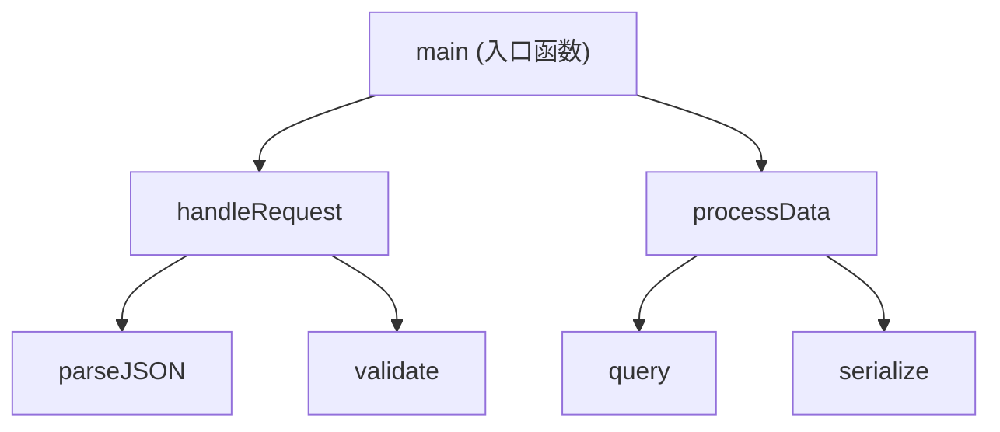
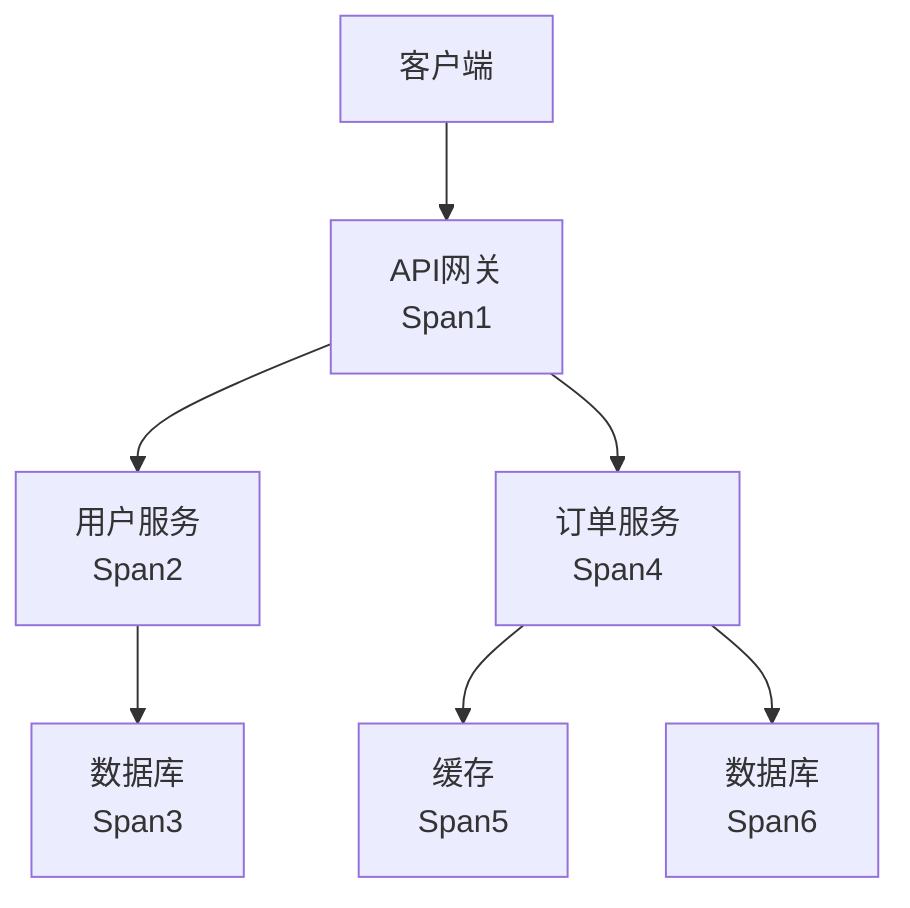
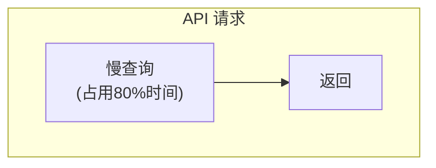
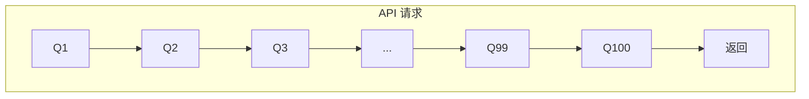
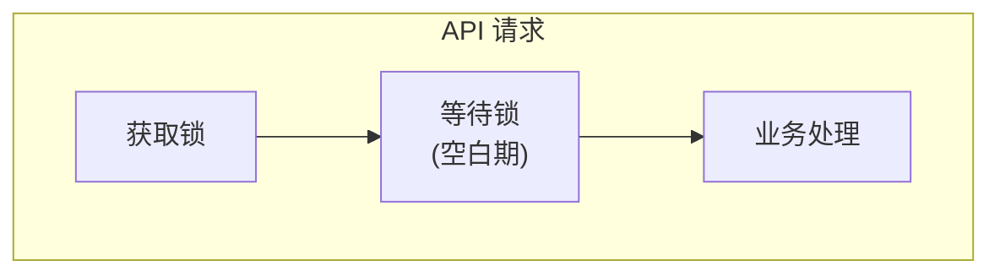

+++
title = "应用性能分析实战"
date = 2026-01-21
weight = 37000
description = "SRE应用性能分析完整指南：火焰图、调用链追踪、APM工具的使用与性能问题定位"
[taxonomies]
tags = ["SRE", "性能", "火焰图", "APM", "排查", "实战"]
+++

## 概述

应用性能分析是SRE的核心技能之一。本文详细介绍火焰图、调用链追踪、各语言性能分析工具的使用方法。

---

# 一、火焰图

## 1.1 火焰图原理

```
火焰图（Flame Graph）是一种可视化性能分析工具

特点：
- X轴：函数调用的宽度表示占用时间比例
- Y轴：调用栈深度（从下到上是调用关系）
- 颜色：通常随机分配，便于区分

示例结构（Mermaid表示火焰图层级）：



宽度越大，表示该函数（及其子调用）占用时间越多
"平顶"（plateau）表示该函数本身消耗CPU
```

## 1.2 Linux perf生成火焰图

### 安装工具

```bash
# 安装perf
apt install linux-tools-common linux-tools-$(uname -r)  # Debian/Ubuntu
yum install perf  # CentOS/RHEL

# 下载FlameGraph工具
git clone https://github.com/brendangregg/FlameGraph.git
cd FlameGraph
```

### 采集与生成

```bash
# 方法1：采集整个系统
perf record -F 99 -a -g -- sleep 30

# 参数详解：
# -F 99       采样频率99Hz（每秒99次）
# -a          采集所有CPU
# -g          记录调用栈
# -- sleep 30 采集30秒

# 方法2：采集特定进程
perf record -F 99 -p <PID> -g -- sleep 30

# 方法3：采集特定命令
perf record -F 99 -g -- ./my_program

# 查看perf数据
perf report

# 生成火焰图
perf script > out.perf
./FlameGraph/stackcollapse-perf.pl out.perf > out.folded
./FlameGraph/flamegraph.pl out.folded > flamegraph.svg

# 一行命令
perf script | ./FlameGraph/stackcollapse-perf.pl | ./FlameGraph/flamegraph.pl > flame.svg
```

### 火焰图选项

```bash
# flamegraph.pl参数

# 标题
./flamegraph.pl --title "My Application CPU" out.folded > flame.svg

# 颜色方案
./flamegraph.pl --colors java out.folded > flame.svg    # Java配色
./flamegraph.pl --colors js out.folded > flame.svg      # JavaScript配色
./flamegraph.pl --colors mem out.folded > flame.svg     # 内存配色

# 反转（icicle图）
./flamegraph.pl --inverted out.folded > flame.svg

# 宽度
./flamegraph.pl --width 1800 out.folded > flame.svg

# 最小显示比例
./flamegraph.pl --minwidth 0.5 out.folded > flame.svg
```

---

## 1.3 不同类型的火焰图

### CPU火焰图

```bash
# 采集CPU on-CPU时间
perf record -F 99 -p <PID> -g -- sleep 30
perf script | ./stackcollapse-perf.pl | ./flamegraph.pl > cpu.svg

# 分析要点：
# - 寻找"平顶"函数（消耗CPU的地方）
# - 宽的栈表示热点路径
```

### Off-CPU火焰图

```bash
# 采集进程被阻塞的时间（等待IO、锁等）
# 需要使用bcc/eBPF工具

# 安装bcc-tools
apt install bpfcc-tools  # Debian/Ubuntu
yum install bcc-tools    # CentOS/RHEL

# 采集off-CPU时间
/usr/share/bcc/tools/offcputime -df -p <PID> 30 > out.stacks

# 生成火焰图
./FlameGraph/flamegraph.pl --color=io --title="Off-CPU" out.stacks > offcpu.svg

# 分析要点：
# - 显示进程在等待什么
# - 常见：IO等待、锁等待、sleep
```

### 内存分配火焰图

```bash
# 使用perf记录内存分配事件
perf record -e syscalls:sys_enter_mmap -p <PID> -g -- sleep 30

# 或使用bcc工具
/usr/share/bcc/tools/memleak -p <PID> -a

# 生成火焰图
./FlameGraph/flamegraph.pl --color=mem out.stacks > mem.svg
```

---

## 1.4 各语言专用火焰图

### Java火焰图

```bash
# 方法1：使用async-profiler（推荐）
# 下载：https://github.com/jvm-profiling-tools/async-profiler

# 采集CPU火焰图
./profiler.sh -d 30 -f cpu.svg <PID>

# 参数：
# -d 30    采集30秒
# -f       输出文件
# -e cpu   事件类型（cpu/alloc/lock/wall）

# 采集内存分配
./profiler.sh -d 30 -e alloc -f alloc.svg <PID>

# 采集锁竞争
./profiler.sh -d 30 -e lock -f lock.svg <PID>

# 方法2：使用JFR（Java Flight Recorder）
jcmd <PID> JFR.start duration=30s filename=recording.jfr
# 然后用JMC（Java Mission Control）打开分析


# 方法3：使用jstack采样
# 简单但精度低
for i in {1..100}; do
    jstack <PID> >> stacks.txt
    sleep 0.1
done
# 然后用工具分析stacks.txt
```

### Go火焰图

```bash
# 方法1：使用内置pprof

# 程序中启用pprof
# import _ "net/http/pprof"
# go func() { http.ListenAndServe(":6060", nil) }()

# 采集CPU profile
go tool pprof http://localhost:6060/debug/pprof/profile?seconds=30

# 在pprof交互界面
(pprof) web           # 生成SVG并打开
(pprof) top           # 显示top函数
(pprof) list funcName # 显示函数源码

# 直接生成火焰图
go tool pprof -http=:8080 http://localhost:6060/debug/pprof/profile?seconds=30
# 浏览器打开 http://localhost:8080 选择Flame Graph


# 方法2：使用go-torch（已集成到pprof）
go tool pprof -http=:8080 cpu.prof
```

### Python火焰图

```bash
# 方法1：使用py-spy（推荐，无需修改代码）
pip install py-spy

# 生成火焰图
py-spy record -o profile.svg --pid <PID> --duration 30

# 实时top视图
py-spy top --pid <PID>

# 采集并输出speedscope格式
py-spy record -o profile.json --format speedscope --pid <PID>


# 方法2：使用cProfile + flameprof
pip install flameprof

# 采集profile
python -m cProfile -o output.prof script.py

# 生成火焰图
flameprof output.prof > flame.svg


# 方法3：使用austin
pip install austin-dist

# 采集
austin -o profile.austin python script.py

# 转换为火焰图
austin2speedscope profile.austin profile.json
```

### Node.js火焰图

```bash
# 方法1：使用0x
npm install -g 0x

# 生成火焰图
0x app.js
# 或附加到已运行进程
0x --pid <PID>


# 方法2：使用clinic
npm install -g clinic

# Flame图
clinic flame -- node app.js


# 方法3：使用内置profiler
node --prof app.js
node --prof-process isolate-*.log > processed.txt

# 生成火焰图
node --prof app.js
node --prof-process --preprocess -j isolate-*.log | ./stackcollapse-v8.pl | ./flamegraph.pl > node.svg
```

---

# 二、分布式追踪

## 2.1 追踪概念

**分布式追踪核心概念：**

| 概念 | 说明 |
|------|------|
| Trace（追踪） | 一个请求的完整调用链 |
| Span（跨度） | 单个操作的执行 |
| TraceID | 追踪ID（整个请求共享） |
| SpanID | 当前跨度ID |
| ParentSpanID | 父跨度ID |
| Operation | 操作名称 |
| StartTime | 开始时间 |
| Duration | 持续时间 |
| Tags | 标签（key-value） |
| Logs | 日志事件 |

**示例请求追踪：**



**TraceID: abc123 调用链结构：**
- Span1: API网关 (SpanID: 001, ParentID: null)
  - Span2: 用户服务 (SpanID: 002, ParentID: 001)
    - Span3: 查询数据库 (SpanID: 003, ParentID: 002)
  - Span4: 订单服务 (SpanID: 004, ParentID: 001)
    - Span5: 读取缓存 (SpanID: 005, ParentID: 004)
    - Span6: 查询数据库 (SpanID: 006, ParentID: 004)

## 2.2 Jaeger使用

### 安装部署

```bash
# Docker方式部署Jaeger
docker run -d --name jaeger \
  -e COLLECTOR_ZIPKIN_HOST_PORT=:9411 \
  -p 5775:5775/udp \
  -p 6831:6831/udp \
  -p 6832:6832/udp \
  -p 5778:5778 \
  -p 16686:16686 \
  -p 14268:14268 \
  -p 14250:14250 \
  -p 9411:9411 \
  jaegertracing/all-in-one:latest

# 端口说明：
# 5775   - UDP, 接收zipkin.thrift格式数据
# 6831   - UDP, 接收jaeger.thrift格式数据
# 6832   - UDP, 接收jaeger.thrift二进制数据
# 5778   - HTTP, 配置服务
# 16686  - HTTP, Web UI
# 14268  - HTTP, 直接接收spans
# 14250  - gRPC, 接收spans
# 9411   - HTTP, Zipkin兼容

# 访问UI
http://localhost:16686
```

### 查询追踪

```bash
# Web UI操作

# 1. 选择Service
# 2. 选择Operation（可选）
# 3. 设置时间范围
# 4. 添加Tags过滤（可选）
#    例如：http.status_code=500
# 5. 点击Find Traces

# API查询
curl "http://localhost:16686/api/traces?service=my-service&limit=20"

# 按TraceID查询
curl "http://localhost:16686/api/traces/abc123def456"

# 分析技巧：
# - 排序：按Duration找最慢请求
# - 过滤：按错误状态找失败请求
# - 比较：对比正常和异常请求的差异
```

### 应用集成示例

```python
# Python + OpenTelemetry

from opentelemetry import trace
from opentelemetry.exporter.jaeger.thrift import JaegerExporter
from opentelemetry.sdk.trace import TracerProvider
from opentelemetry.sdk.trace.export import BatchSpanProcessor

# 配置Jaeger导出
jaeger_exporter = JaegerExporter(
    agent_host_name="localhost",
    agent_port=6831,
)

# 设置TracerProvider
trace.set_tracer_provider(TracerProvider())
trace.get_tracer_provider().add_span_processor(
    BatchSpanProcessor(jaeger_exporter)
)

# 获取tracer
tracer = trace.get_tracer(__name__)

# 使用
with tracer.start_as_current_span("my-operation") as span:
    span.set_attribute("user.id", 123)
    # 业务逻辑
    with tracer.start_as_current_span("sub-operation"):
        # 子操作
        pass
```

```go
// Go + OpenTelemetry

import (
    "go.opentelemetry.io/otel"
    "go.opentelemetry.io/otel/exporters/jaeger"
    "go.opentelemetry.io/otel/sdk/trace"
)

func initTracer() (*trace.TracerProvider, error) {
    exporter, err := jaeger.New(jaeger.WithCollectorEndpoint(
        jaeger.WithEndpoint("http://localhost:14268/api/traces"),
    ))
    if err != nil {
        return nil, err
    }
    
    tp := trace.NewTracerProvider(
        trace.WithBatcher(exporter),
    )
    otel.SetTracerProvider(tp)
    return tp, nil
}

// 使用
tracer := otel.Tracer("my-service")
ctx, span := tracer.Start(ctx, "my-operation")
defer span.End()
```

---

## 2.3 性能问题定位

### 通过追踪定位慢请求

```
分析步骤：

1. 找到慢请求
   - Jaeger UI按Duration排序
   - 找到P99延迟的请求

2. 分析Span时间线
   - 查看各Span的Duration
   - 找出最耗时的Span

3. 分析Gap（间隙）
   - Span之间的空白时间
   - 可能是队列等待、网络延迟

4. 查看Span详情
   - Tags：参数、返回码
   - Logs：关键事件

5. 比较分析
   - 对比正常和异常请求
   - 找出差异点
```

### 常见性能问题模式

**模式1：单个Span过长**



- **原因**：数据库慢查询、外部API慢
- **解决**：优化查询、添加缓存、设置超时

**模式2：串行调用**


- **原因**：可并行的调用被串行执行
- **解决**：改为并行调用

**模式3：N+1查询**



- **原因**：循环中单独查询
- **解决**：批量查询、JOIN查询

**模式4：长时间等待**



- **原因**：锁竞争、资源争用
- **解决**：减少锁粒度、优化并发

---

# 三、语言级性能分析

## 3.1 Java性能分析

### JVM诊断命令

```bash
# jps - 查看Java进程
jps -lvm
# 输出：PID 主类 JVM参数


# jstat - JVM统计
jstat -gc <PID> 1000 10
# 每1000ms采样，共10次

# 输出列解释：
# S0C/S1C    Survivor 0/1 容量
# S0U/S1U    Survivor 0/1 使用量
# EC/EU      Eden 容量/使用量
# OC/OU      Old 容量/使用量
# MC/MU      Metaspace 容量/使用量
# YGC/YGCT   Young GC次数/时间
# FGC/FGCT   Full GC次数/时间
# GCT        GC总时间

# 重要指标：
# - FGC频繁或FGCT增长快 → 内存问题
# - OU接近OC → 老年代即将满


# jstack - 线程dump
jstack <PID> > thread_dump.txt

# 分析线程状态
grep "java.lang.Thread.State" thread_dump.txt | sort | uniq -c

# 查找阻塞线程
grep -A 20 "BLOCKED" thread_dump.txt

# 查找等待锁
grep -B 5 "waiting to lock" thread_dump.txt


# jmap - 内存分析
# 堆内存使用统计
jmap -heap <PID>

# 对象统计
jmap -histo <PID> | head -30

# 生成heap dump
jmap -dump:format=b,file=heap.hprof <PID>

# 注意：生产环境dump可能导致长时间暂停
```

### JFR（Java Flight Recorder）

```bash
# 开始录制
jcmd <PID> JFR.start name=recording duration=60s filename=recording.jfr

# 录制选项
jcmd <PID> JFR.start \
    name=recording \
    duration=60s \
    filename=recording.jfr \
    settings=profile  # 预设：default, profile

# 查看正在进行的录制
jcmd <PID> JFR.check

# 停止录制
jcmd <PID> JFR.stop name=recording

# 分析录制文件
# 使用JMC（Java Mission Control）打开.jfr文件

# 命令行分析
jfr print --events jdk.CPULoad recording.jfr
jfr print --events jdk.GCPhasePause recording.jfr

# 生成报告
jfr print --json recording.jfr > report.json
```

### async-profiler深入使用

```bash
# 下载安装
wget https://github.com/jvm-profiling-tools/async-profiler/releases/download/v2.9/async-profiler-2.9-linux-x64.tar.gz
tar xzf async-profiler-2.9-linux-x64.tar.gz
cd async-profiler-2.9-linux-x64

# CPU分析
./profiler.sh -d 30 -o svg -f cpu.svg <PID>

# 参数详解：
# -d 30          采集30秒
# -f file        输出文件
# -o fmt         输出格式：svg, html, collapsed, tree, text
# -e event       事件类型
#   cpu          CPU时间（默认）
#   alloc        内存分配
#   lock         锁竞争
#   wall         墙上时间（包括等待）
#   itimer       ITIMER_PROF信号
# -i interval    采样间隔（纳秒）
# -t             按线程分组

# 内存分配分析
./profiler.sh -d 30 -e alloc -o svg -f alloc.svg <PID>

# 锁分析
./profiler.sh -d 30 -e lock -o svg -f lock.svg <PID>

# 墙上时间分析（包括IO等待）
./profiler.sh -d 30 -e wall -o svg -f wall.svg <PID>

# 按线程输出
./profiler.sh -d 30 -t -o svg -f cpu-threads.svg <PID>

# 过滤特定包
./profiler.sh -d 30 --include 'com/example/*' -o svg -f filtered.svg <PID>

# 排除特定包
./profiler.sh -d 30 --exclude 'java/*' -o svg -f app-only.svg <PID>
```

---

## 3.2 Go性能分析

### pprof完整指南

```go
// 程序中启用pprof
package main

import (
    "net/http"
    _ "net/http/pprof"
)

func main() {
    go func() {
        http.ListenAndServe(":6060", nil)
    }()
    // 业务代码
}

// 可用的profile端点：
// /debug/pprof/profile     CPU profile
// /debug/pprof/heap        堆内存
// /debug/pprof/goroutine   goroutine信息
// /debug/pprof/allocs      内存分配统计
// /debug/pprof/block       阻塞操作
// /debug/pprof/mutex       锁竞争
// /debug/pprof/threadcreate 线程创建
// /debug/pprof/trace       执行追踪
```

```bash
# CPU Profile
go tool pprof http://localhost:6060/debug/pprof/profile?seconds=30

# pprof交互命令：
(pprof) top           # 显示消耗最多的函数
(pprof) top -cum      # 按累计时间排序
(pprof) list funcName # 显示函数源码
(pprof) web           # 生成SVG并打开
(pprof) png           # 生成PNG

# 直接生成火焰图
go tool pprof -http=:8080 http://localhost:6060/debug/pprof/profile?seconds=30
# 浏览器打开 http://localhost:8080


# 内存分析
go tool pprof http://localhost:6060/debug/pprof/heap

# 内存分析选项：
(pprof) top           # 当前内存使用
(pprof) top -inuse_space    # 在用内存
(pprof) top -alloc_space    # 累计分配内存
(pprof) top -inuse_objects  # 在用对象数
(pprof) top -alloc_objects  # 累计分配对象数


# Goroutine分析
go tool pprof http://localhost:6060/debug/pprof/goroutine

# 查看所有goroutine堆栈
curl http://localhost:6060/debug/pprof/goroutine?debug=2


# 阻塞分析（需要启用）
# 代码中：runtime.SetBlockProfileRate(1)
go tool pprof http://localhost:6060/debug/pprof/block


# Mutex分析（需要启用）
# 代码中：runtime.SetMutexProfileFraction(1)
go tool pprof http://localhost:6060/debug/pprof/mutex


# Trace分析
curl -o trace.out http://localhost:6060/debug/pprof/trace?seconds=5
go tool trace trace.out
# 浏览器打开，可以看到：
# - Goroutine调度
# - 网络阻塞
# - 系统调用
# - GC事件
```

### Go性能诊断脚本

```bash
#!/bin/bash
# go_profile.sh - Go应用性能诊断

HOST=${1:-"localhost:6060"}
OUTPUT_DIR=${2:-"./profiles"}

mkdir -p $OUTPUT_DIR
echo "Collecting profiles from $HOST..."

# CPU profile
echo "Collecting CPU profile (30s)..."
curl -s "http://$HOST/debug/pprof/profile?seconds=30" > $OUTPUT_DIR/cpu.prof

# Heap
echo "Collecting heap profile..."
curl -s "http://$HOST/debug/pprof/heap" > $OUTPUT_DIR/heap.prof

# Goroutine
echo "Collecting goroutine profile..."
curl -s "http://$HOST/debug/pprof/goroutine" > $OUTPUT_DIR/goroutine.prof
curl -s "http://$HOST/debug/pprof/goroutine?debug=2" > $OUTPUT_DIR/goroutine.txt

# Allocs
echo "Collecting allocs profile..."
curl -s "http://$HOST/debug/pprof/allocs" > $OUTPUT_DIR/allocs.prof

# 生成报告
echo "Generating reports..."
go tool pprof -text $OUTPUT_DIR/cpu.prof > $OUTPUT_DIR/cpu_report.txt 2>/dev/null
go tool pprof -text -inuse_space $OUTPUT_DIR/heap.prof > $OUTPUT_DIR/heap_report.txt 2>/dev/null

echo "Profiles saved to $OUTPUT_DIR"
ls -la $OUTPUT_DIR
```

---

## 3.3 Python性能分析

### cProfile使用

```bash
# 运行时profiling
python -m cProfile -o output.prof script.py

# 直接输出结果
python -m cProfile -s cumulative script.py

# 排序选项：
# calls      调用次数
# cumulative 累计时间
# file       文件名
# time       内部时间

# 分析profile文件
python -c "
import pstats
p = pstats.Stats('output.prof')
p.sort_stats('cumulative').print_stats(20)
"

# 使用snakeviz可视化
pip install snakeviz
snakeviz output.prof
# 浏览器打开交互式分析
```

### line_profiler逐行分析

```python
# 安装
# pip install line_profiler

# 在需要分析的函数上添加装饰器
@profile
def my_function():
    # 代码
    pass

# 运行
# kernprof -l -v script.py

# 输出示例：
# Line #      Hits         Time  Per Hit   % Time  Line Contents
# ==============================================================
#      1                                           @profile
#      2                                           def my_function():
#      3      1000     12345678    12345.7     50.0      result = heavy_computation()
#      4      1000      6789012     6789.0     27.5      for item in items:
#      5     10000      5555555      555.6     22.5          process(item)
```

```bash
# 命令行使用
kernprof -l -v script.py

# 参数：
# -l         启用逐行profiling
# -v         显示详细输出
# -o file    输出到文件
```

### memory_profiler内存分析

```python
# 安装
# pip install memory_profiler

# 使用装饰器
from memory_profiler import profile

@profile
def my_function():
    a = [i for i in range(1000000)]
    del a
    return

# 运行
# python -m memory_profiler script.py

# 输出示例：
# Line #    Mem usage    Increment  Occurrences   Line Contents
# =============================================================
#      4     45.2 MiB     45.2 MiB           1   @profile
#      5                                         def my_function():
#      6     83.5 MiB     38.3 MiB           1       a = [i for i in range(1000000)]
#      7     45.2 MiB    -38.3 MiB           1       del a
#      8     45.2 MiB      0.0 MiB           1       return
```

```bash
# 命令行
python -m memory_profiler script.py

# 持续监控内存
mprof run script.py
mprof plot  # 生成内存使用图
```

### py-spy高级用法

```bash
# 安装
pip install py-spy

# 生成火焰图
py-spy record -o profile.svg --pid <PID>

# 参数详解：
# -o file        输出文件
# --pid PID      附加到进程
# --duration N   采集N秒
# --rate N       采样频率（默认100）
# --subprocesses 包含子进程
# --native       包含原生C调用
# --format       输出格式：flamegraph, speedscope, raw

# 实时top视图
py-spy top --pid <PID>

# 输出交互式格式
py-spy record -o profile.json --format speedscope --pid <PID>
# 用speedscope.app打开

# 分析整个应用
py-spy record -o profile.svg -- python app.py

# 包含C扩展
py-spy record --native -o profile.svg --pid <PID>

# dump当前堆栈
py-spy dump --pid <PID>
```

---

# 四、性能分析最佳实践

## 4.1 分析流程

```
性能分析流程：

1. 定义问题
   - 什么慢？（响应时间、吞吐量）
   - 什么条件下慢？（高并发、大数据量）
   - 慢多少？（P50、P99）

2. 采集数据
   - 使用APM/追踪确定范围
   - 使用profiler深入分析
   - 多次采样验证

3. 分析热点
   - 看火焰图找"平顶"
   - 看调用链找慢操作
   - 看资源使用找瓶颈

4. 优化
   - 优化算法/数据结构
   - 添加缓存
   - 并行化
   - 减少IO

5. 验证
   - 重新采集对比
   - 压测验证
   - 监控生产
```

## 4.2 常见性能问题

| 症状 | 可能原因 | 分析方法 |
|------|----------|----------|
| CPU高 | 计算密集、死循环 | CPU火焰图 |
| 响应慢但CPU低 | IO等待、锁等待 | Off-CPU火焰图、追踪 |
| 内存增长 | 内存泄漏 | 内存profiler |
| GC频繁 | 对象分配多 | GC日志、alloc火焰图 |
| 线程阻塞 | 锁竞争、IO | 线程dump、锁分析 |
| 延迟抖动 | GC、资源竞争 | 追踪、分布分析 |

## 4.3 性能诊断脚本

```bash
#!/bin/bash
# perf_diagnose.sh - 通用性能诊断

PID=$1

if [ -z "$PID" ]; then
    echo "Usage: $0 <PID>"
    exit 1
fi

OUTPUT_DIR="./perf_$(date +%Y%m%d_%H%M%S)"
mkdir -p $OUTPUT_DIR

echo "===== 性能诊断 PID: $PID ====="
echo "输出目录: $OUTPUT_DIR"

# 基本信息
echo "--- 进程信息 ---"
ps -p $PID -o pid,ppid,user,%cpu,%mem,stat,start,time,command > $OUTPUT_DIR/process_info.txt
cat $OUTPUT_DIR/process_info.txt

# CPU采样
echo "--- 采集CPU profile (10s) ---"
perf record -F 99 -p $PID -g -o $OUTPUT_DIR/perf.data -- sleep 10 2>/dev/null

# 生成火焰图
if [ -f $OUTPUT_DIR/perf.data ]; then
    perf script -i $OUTPUT_DIR/perf.data > $OUTPUT_DIR/perf.script 2>/dev/null
    if [ -d ~/FlameGraph ]; then
        ~/FlameGraph/stackcollapse-perf.pl $OUTPUT_DIR/perf.script > $OUTPUT_DIR/perf.folded 2>/dev/null
        ~/FlameGraph/flamegraph.pl $OUTPUT_DIR/perf.folded > $OUTPUT_DIR/cpu_flamegraph.svg 2>/dev/null
        echo "火焰图: $OUTPUT_DIR/cpu_flamegraph.svg"
    fi
fi

# 系统调用
echo "--- 采集系统调用 (5s) ---"
timeout 5 strace -c -p $PID 2> $OUTPUT_DIR/strace.txt || true
tail -20 $OUTPUT_DIR/strace.txt

# 打开文件
echo "--- 打开文件 ---"
lsof -p $PID > $OUTPUT_DIR/lsof.txt 2>/dev/null
wc -l $OUTPUT_DIR/lsof.txt

# 网络连接
echo "--- 网络连接 ---"
ss -tp | grep "pid=$PID" > $OUTPUT_DIR/connections.txt
cat $OUTPUT_DIR/connections.txt

echo "===== 诊断完成 ====="
ls -la $OUTPUT_DIR
```

---

## 总结

| 工具 | 用途 | 语言 |
|------|------|------|
| perf | CPU分析 | 所有 |
| FlameGraph | 火焰图可视化 | 所有 |
| async-profiler | CPU/内存/锁 | Java |
| JFR/JMC | 全面分析 | Java |
| go pprof | CPU/内存/goroutine | Go |
| py-spy | CPU火焰图 | Python |
| Jaeger | 分布式追踪 | 所有 |

**分析三板斧**：
1. **火焰图** - 找热点函数
2. **追踪** - 找慢操作
3. **Profiler** - 深入分析

**关键记忆**：
1. 火焰图看"平顶"找CPU热点
2. 追踪看"宽Span"找慢操作
3. 响应慢但CPU低→看Off-CPU或IO
4. 多次采样避免偶然因素

---

## 相关文章

- [上一篇：高可用与故障切换实战](@/articles/sre/sre-36-高可用与故障切换实战.md)
- [下一篇：监控告警排查实战](@/articles/sre/sre-38-监控告警排查实战.md)
- [perf性能分析工具深度解析](@/articles/linux/linux-37-perf性能分析工具深度解析.md) - perf 底层原理详解