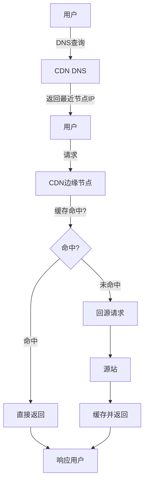

+++
title = "39.DNS与CDN问题排查实战"
date = 2026-01-21
description = "SRE DNS与CDN问题排查完整指南：域名解析故障、CDN缓存问题、DNS劫持检测与处理"
[taxonomies]
tags = ["SRE", "DNS", "CDN", "排查", "实战", "域名"]
+++

## 概述

DNS和CDN是互联网基础设施的核心组件。本文详细介绍DNS解析问题、CDN缓存问题的排查方法和常用工具。

---

# 一、DNS基础与工具

## 1.1 DNS解析流程

```
DNS解析流程：

浏览器 → 本地DNS缓存 → hosts文件 → 本地DNS服务器 → 根DNS → 顶级域DNS → 权威DNS
                                                    ↓
                                              返回IP地址

示例查询 www.example.com：
1. 查询根DNS（.）→ 返回 .com 的NS记录
2. 查询 .com DNS → 返回 example.com 的NS记录  
3. 查询 example.com 权威DNS → 返回 www.example.com 的A记录
```

## 1.2 dig命令详解

### 基础用法

```bash
# 基础查询
dig example.com

# 输出解读：
# ;; QUESTION SECTION:
# ;example.com.                   IN      A        ← 查询的记录
#
# ;; ANSWER SECTION:
# example.com.            300     IN      A       93.184.216.34   ← 结果
#                         ↑TTL(秒)
#
# ;; Query time: 50 msec      ← 查询耗时
# ;; SERVER: 8.8.8.8#53       ← 使用的DNS服务器
# ;; MSG SIZE  rcvd: 56       ← 响应大小

# 常用参数：
# +short         只显示结果
# +trace         显示完整解析路径
# +noall +answer 只显示答案部分
# @server        指定DNS服务器
# -t type        指定记录类型

# 只显示IP
dig +short example.com

# 查询特定记录类型
dig example.com A          # A记录（IPv4）
dig example.com AAAA       # AAAA记录（IPv6）
dig example.com MX         # MX记录（邮件服务器）
dig example.com NS         # NS记录（域名服务器）
dig example.com CNAME      # CNAME记录（别名）
dig example.com TXT        # TXT记录（文本信息）
dig example.com SOA        # SOA记录（区域起始授权）
dig example.com ANY        # 所有记录

# 指定DNS服务器
dig @8.8.8.8 example.com          # Google DNS
dig @1.1.1.1 example.com          # Cloudflare DNS
dig @114.114.114.114 example.com  # 国内DNS
```

### 追踪解析路径

```bash
# 完整解析追踪
dig +trace example.com

# 输出示例：
# .                       518400  IN      NS      a.root-servers.net.
# ...
# com.                    172800  IN      NS      a.gtld-servers.net.
# ...
# example.com.            86400   IN      NS      ns1.example.com.
# ...
# example.com.            300     IN      A       93.184.216.34

# 分析要点：
# 1. 检查每一级NS是否正确
# 2. 检查是否有循环或断裂
# 3. 对比不同DNS服务器的结果
```

### 高级查询

```bash
# 反向解析（IP → 域名）
dig -x 8.8.8.8

# 查询特定域名的NS记录
dig NS example.com +short

# 查询SOA记录（域区信息）
dig SOA example.com

# 输出解读：
# example.com.    3600    IN    SOA    ns1.example.com. admin.example.com. (
#                                       2024012101 ; serial    ← 序列号
#                                       7200       ; refresh   ← 刷新间隔
#                                       3600       ; retry     ← 重试间隔
#                                       1209600    ; expire    ← 过期时间
#                                       3600 )     ; minimum   ← 最小TTL

# TCP查询（用于大响应或测试TCP）
dig +tcp example.com

# 设置超时
dig +time=5 example.com

# 禁用递归查询
dig +norecurse example.com @ns1.example.com

# 查询DNSSEC信息
dig +dnssec example.com
```

---

## 1.3 nslookup命令

```bash
# 基础查询
nslookup example.com

# 输出：
# Server:         8.8.8.8
# Address:        8.8.8.8#53
#
# Non-authoritative answer:
# Name:   example.com
# Address: 93.184.216.34

# 指定DNS服务器
nslookup example.com 8.8.8.8

# 查询特定记录类型
nslookup -type=mx example.com
nslookup -type=ns example.com
nslookup -type=txt example.com

# 交互模式
nslookup
> server 8.8.8.8
> set type=mx
> example.com
> exit

# 反向解析
nslookup 8.8.8.8
```

---

## 1.4 host命令

```bash
# 简单查询
host example.com

# 输出：
# example.com has address 93.184.216.34
# example.com mail is handled by 10 mail.example.com.

# 查询特定记录类型
host -t A example.com
host -t MX example.com
host -t NS example.com
host -t TXT example.com

# 指定DNS服务器
host example.com 8.8.8.8

# 详细输出
host -v example.com

# 反向解析
host 8.8.8.8
```

---

# 二、DNS问题排查

## 2.1 常见DNS问题

### 问题1：域名无法解析

```bash
# 症状
dig example.com
# ;; connection timed out; no servers could be reached
# 或
# ;; SERVFAIL

# 排查步骤：

# 1. 检查本地DNS配置
cat /etc/resolv.conf
# nameserver 8.8.8.8

# 2. 测试DNS服务器连通性
ping 8.8.8.8
nc -zvu 8.8.8.8 53

# 3. 使用其他DNS服务器测试
dig @1.1.1.1 example.com
dig @114.114.114.114 example.com

# 4. 检查是否是特定域名问题
dig @8.8.8.8 google.com
# 如果其他域名正常，则是域名配置问题

# 5. 追踪解析路径
dig +trace example.com

# 6. 检查hosts文件
cat /etc/hosts | grep example.com

# 7. 清除本地DNS缓存
# Linux（systemd-resolved）
sudo systemd-resolve --flush-caches
# 或
sudo resolvectl flush-caches

# macOS
sudo dscacheutil -flushcache
sudo killall -HUP mDNSResponder
```

### 问题2：DNS解析慢

```bash
# 测试解析时间
time dig example.com

# 使用dig查看Query time
dig example.com | grep "Query time"
# ;; Query time: 50 msec

# 多次测试取平均
for i in {1..10}; do
    dig example.com | grep "Query time"
done

# 测试不同DNS服务器速度
for dns in 8.8.8.8 1.1.1.1 114.114.114.114 223.5.5.5; do
    echo -n "$dns: "
    dig @$dns example.com | grep "Query time"
done

# 慢的原因：
# 1. DNS服务器远
# 2. DNS服务器负载高
# 3. 网络延迟
# 4. 递归查询多

# 解决方案：
# 1. 使用更近的DNS服务器
# 2. 本地部署DNS缓存（如dnsmasq）
# 3. 增加TTL减少查询
```

### 问题3：DNS解析结果不一致

```bash
# 检查不同DNS服务器的结果
dig @8.8.8.8 example.com +short
dig @1.1.1.1 example.com +short
dig @114.114.114.114 example.com +short

# 检查权威DNS
dig NS example.com +short
# ns1.example.com
# ns2.example.com

dig @ns1.example.com example.com +short
dig @ns2.example.com example.com +short

# 如果权威DNS返回不同结果，可能是：
# 1. DNS记录正在更新中
# 2. DNS配置错误
# 3. 使用了GeoDNS（按地区返回不同结果）

# 检查DNS记录传播状态
# 使用在线工具如 dnschecker.org
# 或手动查询多个地区的DNS
```

### 问题4：DNS劫持检测

```bash
# 对比多个DNS服务器的结果
for dns in 8.8.8.8 1.1.1.1 114.114.114.114; do
    echo "$dns:"
    dig @$dns example.com +short
done

# 如果某个DNS返回异常IP，可能被劫持

# 检查HTTPS证书验证
curl -v https://example.com 2>&1 | grep "issuer"

# 使用DNSSEC验证
dig +dnssec example.com

# 检查是否有NXDOMAIN劫持
dig @8.8.8.8 nonexistent-domain-12345.com
# 正常应返回NXDOMAIN
# 如果返回IP，说明DNS有NXDOMAIN劫持

# 使用DoH（DNS over HTTPS）绕过劫持
curl "https://dns.google/resolve?name=example.com&type=A"
curl "https://cloudflare-dns.com/dns-query?name=example.com&type=A" -H "Accept: application/dns-json"
```

---

## 2.2 DNS记录管理排查

### 检查DNS记录

```bash
# 查看所有记录
dig example.com ANY

# 检查特定子域名
dig sub.example.com

# 检查泛域名
dig *.example.com

# 检查邮件记录
dig MX example.com +short
dig TXT example.com +short | grep spf
dig TXT _dmarc.example.com +short

# 检查CAA记录（证书颁发授权）
dig CAA example.com +short
```

### DNS更新传播

```bash
# 检查SOA序列号是否更新
dig SOA example.com +short

# 检查TTL
dig example.com | grep -A1 "ANSWER SECTION"
# example.com.  300  IN  A  1.2.3.4
#               ↑ TTL 300秒

# 等待TTL过期后再次查询
# 或直接查询权威DNS跳过缓存
dig @ns1.example.com example.com
```

---

## 2.3 本地DNS配置

### Linux DNS配置

```bash
# 查看当前DNS配置
cat /etc/resolv.conf

# 示例配置：
# nameserver 8.8.8.8
# nameserver 8.8.4.4
# options timeout:2 attempts:3

# 使用systemd-resolved时
resolvectl status
# 或
systemd-resolve --status

# 修改DNS（临时）
echo "nameserver 8.8.8.8" > /etc/resolv.conf

# 修改DNS（永久，NetworkManager）
nmcli connection modify "连接名" ipv4.dns "8.8.8.8 8.8.4.4"
nmcli connection up "连接名"

# 修改DNS（永久，netplan）
# /etc/netplan/01-netcfg.yaml
# network:
#   ethernets:
#     eth0:
#       nameservers:
#         addresses: [8.8.8.8, 8.8.4.4]

# 查看DNS缓存
resolvectl statistics

# 清除缓存
resolvectl flush-caches
```

### hosts文件

```bash
# 查看hosts文件
cat /etc/hosts

# 添加临时解析（测试用）
echo "1.2.3.4 test.example.com" >> /etc/hosts

# hosts文件格式：
# IP地址    域名    [别名]
# 127.0.0.1 localhost
# 192.168.1.100 myserver myserver.local

# 注意：hosts优先于DNS查询
```

---

# 三、CDN问题排查

## 3.1 CDN工作原理

```
CDN请求流程：


```

## 3.2 CDN节点检测

### 确认请求经过CDN

```bash
# 查看响应头
curl -I https://example.com

# CDN常见响应头：
# X-Cache: HIT           缓存命中
# X-Cache: MISS          缓存未命中
# CF-Cache-Status: HIT   Cloudflare
# X-CDN: Served-By       通用CDN标识
# Via: 1.1 varnish       Varnish缓存
# Age: 3600              缓存时间（秒）
# X-Served-By: cache-xxx 节点标识

# Cloudflare特有
# CF-RAY: xxx            请求ID
# CF-Cache-Status: HIT/MISS/DYNAMIC/BYPASS

# 阿里云CDN
# X-Swift-CacheTime: xxx
# X-Swift-SaveTime: xxx
# Via: kunlun

# 腾讯云CDN
# X-Cache-Lookup: Hit From Upstream
# X-Cache-Lookup: Cache Miss
```

### 检查CDN节点

```bash
# 查看解析到的CDN节点IP
dig cdn.example.com +short

# 检查IP归属
curl ipinfo.io/1.2.3.4

# 或使用whois
whois 1.2.3.4

# 测试不同地区解析（使用不同DNS）
for dns in 8.8.8.8 114.114.114.114 1.1.1.1; do
    echo "DNS $dns:"
    dig @$dns cdn.example.com +short
done

# 追踪到CDN节点的路径
traceroute cdn.example.com
mtr cdn.example.com
```

---

## 3.3 CDN缓存问题

### 缓存未命中

```bash
# 检查缓存状态
curl -I https://example.com/path/to/file

# 常见缓存状态：
# HIT      - 缓存命中
# MISS     - 缓存未命中（首次请求或已过期）
# EXPIRED  - 已过期
# STALE    - 过期但仍返回（异步更新）
# BYPASS   - 绕过缓存
# DYNAMIC  - 动态内容不缓存

# 检查原因：

# 1. 检查缓存控制头
curl -I https://example.com/path | grep -i cache
# Cache-Control: max-age=3600     缓存1小时
# Cache-Control: no-cache         不缓存
# Cache-Control: private          不被CDN缓存
# Pragma: no-cache                HTTP/1.0不缓存
# Vary: Accept-Encoding           按编码区分缓存

# 2. 检查响应类型
# Set-Cookie 通常导致不缓存
curl -I https://example.com/path | grep -i set-cookie

# 3. 检查HTTP状态码
# 只有200、301、302等特定状态码会被缓存
```

### 缓存不一致

```bash
# 多次请求检查是否一致
for i in {1..5}; do
    curl -s https://example.com/api | md5sum
done

# 指定不同CDN节点测试
# 通过不同DNS获取不同节点IP
dig @8.8.8.8 cdn.example.com +short
dig @114.114.114.114 cdn.example.com +short

# 直接请求特定节点（需要设置Host头）
curl -I --resolve "example.com:443:1.2.3.4" https://example.com

# 检查ETag或Last-Modified是否一致
for i in {1..3}; do
    curl -sI https://example.com/file | grep -E "ETag|Last-Modified"
done
```

### 刷新CDN缓存

```bash
# Cloudflare API刷新
curl -X POST "https://api.cloudflare.com/client/v4/zones/{zone_id}/purge_cache" \
     -H "Authorization: Bearer {token}" \
     -H "Content-Type: application/json" \
     --data '{"files":["https://example.com/path/to/file"]}'

# 刷新全部
curl -X POST "https://api.cloudflare.com/client/v4/zones/{zone_id}/purge_cache" \
     -H "Authorization: Bearer {token}" \
     -H "Content-Type: application/json" \
     --data '{"purge_everything":true}'

# AWS CloudFront
aws cloudfront create-invalidation \
    --distribution-id EDFDVBD6EXAMPLE \
    --paths "/path/to/file" "/*"

# 阿里云CDN
aliyun cdn RefreshObjectCaches \
    --ObjectPath "https://example.com/path/to/file" \
    --ObjectType File

# 验证刷新是否生效
# 带随机参数绕过本地缓存
curl -I "https://example.com/path?nocache=$(date +%s)"
```

---

## 3.4 CDN性能问题

### 回源慢

```bash
# 检查回源时间
curl -w "DNS: %{time_namelookup}s\nConnect: %{time_connect}s\nTTFB: %{time_starttransfer}s\nTotal: %{time_total}s\n" \
     -o /dev/null -s https://example.com

# 如果MISS时响应慢，可能是回源问题

# 检查回源路径
# 1. CDN到源站的延迟
# 2. 源站响应时间
# 3. 内容大小

# 直接访问源站测试
curl -w "Total: %{time_total}s\n" -o /dev/null -s https://origin.example.com

# 对比CDN和直连
echo "CDN:"
curl -w "%{time_total}s\n" -o /dev/null -s https://cdn.example.com/file
echo "Origin:"
curl -w "%{time_total}s\n" -o /dev/null -s https://origin.example.com/file
```

### 节点选择问题

```bash
# 检查解析到的节点位置
dig cdn.example.com +short
curl ipinfo.io/$(dig +short cdn.example.com | head -1)

# 如果节点距离远，检查：
# 1. DNS解析是否正确返回最近节点
# 2. CDN配置是否覆盖当前地区
# 3. 是否有回源失败导致切换到远端节点

# 测试不同节点的延迟
for ip in $(dig +short cdn.example.com); do
    echo -n "$ip: "
    curl -w "%{time_connect}s\n" -o /dev/null -s --resolve "cdn.example.com:443:$ip" https://cdn.example.com
done
```

---

## 3.5 CDN排查脚本

```bash
#!/bin/bash
# cdn_diagnose.sh - CDN诊断脚本

URL=$1

if [ -z "$URL" ]; then
    echo "Usage: $0 <URL>"
    exit 1
fi

DOMAIN=$(echo "$URL" | awk -F[/:] '{print $4}')

echo "===== CDN诊断: $URL ====="
echo ""

echo "--- 1. DNS解析 ---"
echo "解析结果:"
dig +short $DOMAIN
echo ""

echo "不同DNS服务器解析:"
for dns in 8.8.8.8 1.1.1.1 114.114.114.114; do
    echo "$dns: $(dig @$dns +short $DOMAIN | head -1)"
done
echo ""

echo "--- 2. 响应头 ---"
curl -sI "$URL" | head -20
echo ""

echo "--- 3. 缓存状态 ---"
curl -sI "$URL" | grep -iE "cache|age|x-cdn|via|cf-"
echo ""

echo "--- 4. 性能测试 ---"
curl -w "
DNS解析:    %{time_namelookup}s
TCP连接:    %{time_connect}s
TLS握手:    %{time_appconnect}s
首字节:     %{time_starttransfer}s
总时间:     %{time_total}s
下载大小:   %{size_download} bytes
" -o /dev/null -s "$URL"
echo ""

echo "--- 5. 多次请求缓存状态 ---"
for i in {1..3}; do
    echo -n "请求$i: "
    curl -sI "$URL" | grep -i "x-cache\|cf-cache" | head -1
    sleep 1
done
echo ""

echo "--- 6. IP归属 ---"
IP=$(dig +short $DOMAIN | head -1)
curl -s "ipinfo.io/$IP" | grep -E "ip|city|region|org"
echo ""

echo "===== 诊断完成 ====="
```

---

# 四、DNS与CDN最佳实践

## 4.1 DNS配置建议

```markdown
## DNS最佳实践

### 记录配置
- TTL设置合理：静态内容可设较长TTL（3600秒以上）
- 动态切换场景用较短TTL（60-300秒）
- 使用CNAME指向CDN，便于切换
- 配置备用DNS服务器

### 安全配置
- 启用DNSSEC防止DNS欺骗
- 使用CAA记录限制证书颁发
- 配置SPF/DKIM/DMARC防止邮件伪造

### 监控
- 监控DNS解析成功率
- 监控DNS解析延迟
- 监控DNS记录变更
```

## 4.2 CDN配置建议

```markdown
## CDN最佳实践

### 缓存配置
- 静态资源设置较长缓存时间
- 使用版本号/hash处理更新
- 合理使用Cache-Control头
- 区分缓存策略（public/private）

### 回源配置
- 配置回源超时
- 配置回源重试
- 使用回源Host正确指向源站

### 安全配置
- 开启HTTPS
- 配置HSTS
- 开启WAF（如需要）
- 限制回源IP白名单
```

---

## 总结

| 任务 | 命令 |
|------|------|
| DNS查询 | `dig`, `nslookup`, `host` |
| 追踪解析 | `dig +trace` |
| 检查CDN | `curl -I`, 检查X-Cache头 |
| 性能测试 | `curl -w` |
| 清除DNS缓存 | `resolvectl flush-caches` |
| 刷新CDN | 各CDN API |

**DNS排查三板斧**：
1. **dig +trace** - 追踪完整解析路径
2. **多DNS对比** - 检测劫持或不一致
3. **查权威DNS** - 确认源头配置

**CDN排查三板斧**：
1. **看缓存头** - X-Cache/CF-Cache-Status
2. **比源站** - 对比CDN和直连
3. **测延迟** - curl -w 详细时间

**关键记忆**：
1. DNS问题先检查本地resolv.conf
2. CDN问题先看缓存状态头
3. 缓存不命中检查Cache-Control
4. 节点选择问题检查DNS解析

---

## 相关文章

- [上一篇：监控告警排查实战](/articles/sre/sre-38-监控告警排查实战/)
- [下一篇：证书与HTTPS问题排查实战](/articles/sre/sre-40-证书与HTTPS问题排查实战/)
