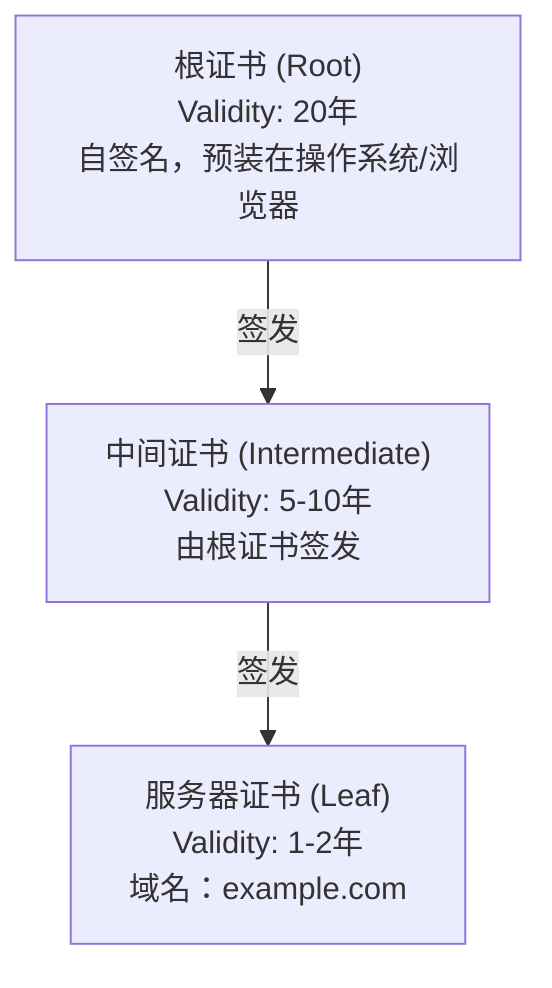

+++
title = "40. 证书与HTTPS问题排查实战"
date = 2026-01-21
weight = 40000
description = "SRE证书与HTTPS问题排查完整指南：SSL证书过期、握手失败、证书链问题的定位与解决"
[taxonomies]
tags = ["SRE", "SSL", "HTTPS", "证书", "TLS", "排查", "实战"]
+++

## 概述

HTTPS证书问题是导致服务不可用的常见原因。本文详细介绍SSL/TLS证书问题的排查方法和常用工具。

---

# 一、TLS/SSL基础

## 1.1 HTTPS握手流程

```
TLS 1.2 握手流程：

客户端                                    服务器
   |                                         |
   |  1. ClientHello                         |
   |  (支持的加密套件、TLS版本、随机数)      |
   |  -------------------------------------> |
   |                                         |
   |  2. ServerHello                         |
   |  (选择的加密套件、TLS版本、随机数)      |
   |  <------------------------------------- |
   |                                         |
   |  3. Certificate                         |
   |  (服务器证书链)                         |
   |  <------------------------------------- |
   |                                         |
   |  4. ServerKeyExchange (可选)            |
   |  <------------------------------------- |
   |                                         |
   |  5. ServerHelloDone                     |
   |  <------------------------------------- |
   |                                         |
   |  6. ClientKeyExchange                   |
   |  (预主密钥)                             |
   |  -------------------------------------> |
   |                                         |
   |  7. ChangeCipherSpec                    |
   |  -------------------------------------> |
   |                                         |
   |  8. Finished                            |
   |  -------------------------------------> |
   |                                         |
   |  9. ChangeCipherSpec                    |
   |  <------------------------------------- |
   |                                         |
   |  10. Finished                           |
   |  <------------------------------------- |
   |                                         |
   |  ===== 加密通信开始 =====               |
```

## 1.2 证书结构

**证书链结构：**



**验证流程（从下往上）**：
1. 检查服务器证书是否由中间证书签发
2. 检查中间证书是否由根证书签发
3. 根证书是否在受信任列表中

---

# 二、证书检查工具

## 2.1 openssl命令

### 连接测试

```bash
# 连接并显示证书信息
openssl s_client -connect example.com:443

# 输出关键信息：
# CONNECTED(00000003)
# depth=2 C = US, O = DigiCert Inc, ...
# verify return:1
# depth=1 C = US, O = DigiCert Inc, ...
# verify return:1
# depth=0 C = US, ST = California, ...
# verify return:1
# ---
# Certificate chain
#  0 s:/CN=example.com
#    i:/C=US/O=DigiCert Inc/...
#  1 s:/C=US/O=DigiCert Inc/...
#    i:/C=US/O=DigiCert Inc/...
# ---
# Server certificate
# -----BEGIN CERTIFICATE-----
# ...
# -----END CERTIFICATE-----
# ...
# SSL-Session:
#     Protocol  : TLSv1.3
#     Cipher    : TLS_AES_256_GCM_SHA384
# ...

# 常用参数：
# -connect host:port    连接目标
# -servername name      SNI主机名
# -showcerts            显示完整证书链
# -verify_return_error  验证失败时报错
# -CAfile file          指定CA证书
# -tls1_2/-tls1_3       指定TLS版本

# 使用SNI（多域名共用IP时必需）
openssl s_client -connect example.com:443 -servername example.com

# 显示完整证书链
openssl s_client -connect example.com:443 -showcerts

# 只连接不交互
echo | openssl s_client -connect example.com:443 2>/dev/null

# 提取证书
echo | openssl s_client -connect example.com:443 2>/dev/null | openssl x509 -outform PEM > cert.pem
```

### 证书信息查看

```bash
# 查看证书详细信息
openssl x509 -in cert.pem -text -noout

# 输出关键部分：
# Certificate:
#     Data:
#         Version: 3 (0x2)
#         Serial Number: ...
#     Signature Algorithm: sha256WithRSAEncryption
#     Issuer: C = US, O = DigiCert Inc, CN = ...    ← 颁发者
#     Validity
#         Not Before: Jan  1 00:00:00 2024 GMT      ← 生效时间
#         Not After : Jan  1 00:00:00 2025 GMT      ← 过期时间
#     Subject: C = US, ST = California, CN = example.com  ← 主体
#     Subject Public Key Info: ...
#     X509v3 extensions:
#         X509v3 Subject Alternative Name:          ← SAN，支持的域名
#             DNS:example.com, DNS:www.example.com

# 常用查看命令：
# 只看主体
openssl x509 -in cert.pem -subject -noout

# 只看颁发者
openssl x509 -in cert.pem -issuer -noout

# 只看有效期
openssl x509 -in cert.pem -dates -noout

# 只看SAN
openssl x509 -in cert.pem -text -noout | grep -A1 "Subject Alternative Name"

# 查看证书指纹
openssl x509 -in cert.pem -fingerprint -noout
openssl x509 -in cert.pem -fingerprint -sha256 -noout

# 查看序列号
openssl x509 -in cert.pem -serial -noout
```

### 证书验证

```bash
# 验证证书链
openssl verify -CAfile ca-bundle.crt cert.pem

# 验证中间证书
openssl verify -CAfile root.crt intermediate.crt

# 验证服务器证书
cat intermediate.crt root.crt > ca-bundle.crt
openssl verify -CAfile ca-bundle.crt server.crt

# 验证证书与私钥匹配
openssl x509 -in cert.pem -noout -modulus | md5sum
openssl rsa -in key.pem -noout -modulus | md5sum
# 两个md5应该相同

# 验证CSR与私钥匹配
openssl req -in csr.pem -noout -modulus | md5sum
openssl rsa -in key.pem -noout -modulus | md5sum
```

### 在线检查

```bash
# 检查服务器证书过期时间
echo | openssl s_client -connect example.com:443 -servername example.com 2>/dev/null | \
    openssl x509 -noout -dates

# 检查证书是否即将过期
echo | openssl s_client -connect example.com:443 -servername example.com 2>/dev/null | \
    openssl x509 -noout -checkend 2592000  # 30天内过期返回1
echo $?  # 0=未过期，1=即将过期

# 获取证书过期剩余天数
END_DATE=$(echo | openssl s_client -connect example.com:443 -servername example.com 2>/dev/null | \
    openssl x509 -noout -enddate | cut -d= -f2)
DAYS_LEFT=$(( ( $(date -d "$END_DATE" +%s) - $(date +%s) ) / 86400 ))
echo "剩余 $DAYS_LEFT 天"
```

---

## 2.2 curl检查

```bash
# 详细HTTPS连接信息
curl -v https://example.com

# 输出包含：
# * Connected to example.com (1.2.3.4) port 443 (#0)
# * SSL connection using TLSv1.3 / TLS_AES_256_GCM_SHA384
# * Server certificate:
# *  subject: CN=example.com
# *  start date: Jan  1 00:00:00 2024 GMT
# *  expire date: Jan  1 00:00:00 2025 GMT
# *  issuer: C=US; O=DigiCert Inc; CN=...
# *  SSL certificate verify ok.

# 显示证书详情
curl -vvv https://example.com 2>&1 | grep -A 20 "Server certificate"

# 忽略证书验证（仅测试用）
curl -k https://example.com

# 指定CA证书
curl --cacert /path/to/ca-bundle.crt https://example.com

# 指定客户端证书
curl --cert client.crt --key client.key https://example.com

# 检查特定TLS版本
curl --tlsv1.2 https://example.com
curl --tlsv1.3 https://example.com

# 测试HTTPS连接时间
curl -w "DNS: %{time_namelookup}s\nConnect: %{time_connect}s\nTLS: %{time_appconnect}s\n" \
     -o /dev/null -s https://example.com
```

---

## 2.3 其他工具

### nmap SSL扫描

```bash
# 扫描SSL/TLS配置
nmap --script ssl-enum-ciphers -p 443 example.com

# 输出包括：
# - 支持的TLS版本
# - 支持的加密套件
# - 证书信息
# - 安全等级评估

# 检查心脏滴血漏洞
nmap --script ssl-heartbleed -p 443 example.com
```

### testssl.sh

```bash
# 安装
git clone --depth 1 https://github.com/drwetter/testssl.sh.git

# 完整测试
./testssl.sh example.com

# 只测试证书
./testssl.sh -S example.com

# 只测试漏洞
./testssl.sh -U example.com

# 快速测试
./testssl.sh --fast example.com
```

### sslyze

```bash
# 安装
pip install sslyze

# 扫描
sslyze example.com

# 详细输出
sslyze --regular example.com
```

---

# 三、常见证书问题

## 3.1 证书过期

### 检测证书过期

```bash
# 检查证书过期时间
echo | openssl s_client -connect example.com:443 -servername example.com 2>/dev/null | \
    openssl x509 -noout -dates

# 输出：
# notBefore=Jan  1 00:00:00 2024 GMT
# notAfter=Jan  1 00:00:00 2025 GMT

# 计算剩余天数
openssl s_client -connect example.com:443 -servername example.com 2>/dev/null | \
    openssl x509 -noout -enddate | \
    awk -F= '{print $2}' | \
    xargs -I {} bash -c 'echo $(( ( $(date -d "{}" +%s) - $(date +%s) ) / 86400 )) days left'

# 批量检查多个域名
for domain in example.com example.org example.net; do
    DAYS=$(echo | openssl s_client -connect $domain:443 -servername $domain 2>/dev/null | \
        openssl x509 -noout -checkend 0 && echo "valid" || echo "expired")
    echo "$domain: $DAYS"
done
```

### 证书过期处理

```bash
# 1. 确认证书文件
ls -la /etc/ssl/certs/
ls -la /etc/nginx/ssl/

# 2. 获取新证书
# Let's Encrypt
certbot renew

# 或手动续期
certbot certonly --webroot -w /var/www/html -d example.com

# 3. 更新Nginx配置
# 确认证书路径正确
grep ssl_certificate /etc/nginx/sites-enabled/*

# 4. 检查新证书
openssl x509 -in /etc/ssl/certs/new_cert.pem -noout -dates

# 5. 重新加载服务
nginx -t && systemctl reload nginx
```

### 证书过期监控脚本

```bash
#!/bin/bash
# cert_monitor.sh - 证书过期监控

DOMAINS="example.com example.org"
WARN_DAYS=30
CRIT_DAYS=7

for domain in $DOMAINS; do
    # 获取过期时间
    END_DATE=$(echo | openssl s_client -connect $domain:443 -servername $domain 2>/dev/null | \
        openssl x509 -noout -enddate 2>/dev/null | cut -d= -f2)
    
    if [ -z "$END_DATE" ]; then
        echo "ERROR: Cannot get certificate for $domain"
        continue
    fi
    
    # 计算剩余天数
    DAYS_LEFT=$(( ( $(date -d "$END_DATE" +%s) - $(date +%s) ) / 86400 ))
    
    if [ $DAYS_LEFT -lt $CRIT_DAYS ]; then
        echo "CRITICAL: $domain expires in $DAYS_LEFT days"
    elif [ $DAYS_LEFT -lt $WARN_DAYS ]; then
        echo "WARNING: $domain expires in $DAYS_LEFT days"
    else
        echo "OK: $domain expires in $DAYS_LEFT days"
    fi
done
```

---

## 3.2 证书链不完整

### 问题表现

```bash
# 错误信息示例
curl https://example.com
# curl: (60) SSL certificate problem: unable to get local issuer certificate

openssl s_client -connect example.com:443
# Verify return code: 21 (unable to verify the first certificate)
```

### 诊断方法

```bash
# 查看服务器返回的证书链
openssl s_client -connect example.com:443 -showcerts

# 正常应该看到多个证书：
# Certificate chain
#  0 s:/CN=example.com           ← 服务器证书
#    i:/C=US/O=DigiCert/CN=...
#  1 s:/C=US/O=DigiCert/CN=...   ← 中间证书
#    i:/C=US/O=DigiCert/CN=...

# 如果只有一个证书（0），说明缺少中间证书

# 检查证书链完整性
# 下载证书
echo | openssl s_client -connect example.com:443 -showcerts 2>/dev/null | \
    awk '/BEGIN/,/END/' > chain.pem

# 验证链
openssl verify -partial_chain chain.pem
```

### 修复方法

```bash
# 1. 获取完整证书链

# 从CA获取中间证书
# 通常在CA网站可以下载

# 或者从证书中提取CA URL
openssl x509 -in server.crt -noout -text | grep "CA Issuers"
# 下载中间证书
curl -o intermediate.crt http://cacerts.digicert.com/xxx.crt

# 2. 合并证书
cat server.crt intermediate.crt > fullchain.pem

# 3. 更新Nginx配置
# ssl_certificate /path/to/fullchain.pem;

# 4. 验证
openssl s_client -connect example.com:443 -showcerts
```

---

## 3.3 域名不匹配

### 问题表现

```bash
curl https://wrong.example.com
# curl: (60) SSL: certificate subject name 'example.com' does not match target host name 'wrong.example.com'

openssl s_client -connect wrong.example.com:443
# Verify return code: 62 (Hostname mismatch)
```

### 诊断方法

```bash
# 查看证书支持的域名
echo | openssl s_client -connect example.com:443 -servername example.com 2>/dev/null | \
    openssl x509 -noout -text | grep -A1 "Subject Alternative Name"

# 输出示例：
# X509v3 Subject Alternative Name:
#     DNS:example.com, DNS:www.example.com

# 查看Common Name
echo | openssl s_client -connect example.com:443 -servername example.com 2>/dev/null | \
    openssl x509 -noout -subject

# 现代浏览器主要检查SAN，不再依赖CN
```

### 解决方法

```bash
# 1. 申请包含正确域名的证书
# Let's Encrypt 多域名
certbot certonly --webroot -w /var/www/html \
    -d example.com \
    -d www.example.com \
    -d api.example.com

# 2. 或使用通配符证书
certbot certonly --manual --preferred-challenges dns \
    -d "*.example.com" \
    -d example.com
```

---

## 3.4 TLS握手失败

### 问题表现

```bash
curl https://example.com
# curl: (35) error:1414D172:SSL routines:tls12_check_peer_sigalg:wrong signature type

openssl s_client -connect example.com:443
# error:14077410:SSL routines:SSL23_GET_SERVER_HELLO:sslv3 alert handshake failure
```

### 常见原因

```bash
# 1. TLS版本不兼容

# 检查服务器支持的TLS版本
nmap --script ssl-enum-ciphers -p 443 example.com

# 测试特定版本
openssl s_client -connect example.com:443 -tls1_2
openssl s_client -connect example.com:443 -tls1_3

# 客户端指定版本
curl --tlsv1.2 https://example.com


# 2. 加密套件不兼容

# 查看服务器支持的套件
openssl s_client -connect example.com:443 -cipher 'ALL:eNULL'

# 指定加密套件
openssl s_client -connect example.com:443 -cipher 'ECDHE-RSA-AES256-GCM-SHA384'


# 3. SNI问题（多域名共用IP）

# 必须指定servername
openssl s_client -connect example.com:443 -servername example.com

# curl默认会发送SNI
curl https://example.com


# 4. 客户端不信任服务器证书

# 检查证书链
openssl s_client -connect example.com:443 -showcerts

# 指定CA证书
curl --cacert /etc/ssl/certs/ca-certificates.crt https://example.com
```

### Nginx TLS配置参考

```nginx
server {
    listen 443 ssl http2;
    server_name example.com;

    # 证书配置
    ssl_certificate /etc/ssl/certs/fullchain.pem;
    ssl_certificate_key /etc/ssl/private/privkey.pem;

    # TLS版本（禁用旧版本）
    ssl_protocols TLSv1.2 TLSv1.3;

    # 加密套件
    ssl_ciphers ECDHE-ECDSA-AES128-GCM-SHA256:ECDHE-RSA-AES128-GCM-SHA256:ECDHE-ECDSA-AES256-GCM-SHA384:ECDHE-RSA-AES256-GCM-SHA384;
    ssl_prefer_server_ciphers off;

    # OCSP Stapling
    ssl_stapling on;
    ssl_stapling_verify on;
    ssl_trusted_certificate /etc/ssl/certs/chain.pem;

    # Session缓存
    ssl_session_cache shared:SSL:10m;
    ssl_session_timeout 1d;
    ssl_session_tickets off;

    # HSTS
    add_header Strict-Transport-Security "max-age=63072000" always;
}
```

---

## 3.5 证书吊销检查

### OCSP检查

```bash
# 获取OCSP URL
openssl x509 -in cert.pem -noout -ocsp_uri

# 进行OCSP查询
openssl ocsp -issuer issuer.pem -cert cert.pem \
    -url http://ocsp.example.com \
    -resp_text

# 使用openssl s_client检查OCSP Stapling
openssl s_client -connect example.com:443 -status

# 查找OCSP Response:
# OCSP Response Status: successful (0x0)
# 如果没有返回，说明服务器未启用OCSP Stapling
```

### CRL检查

```bash
# 获取CRL URL
openssl x509 -in cert.pem -noout -text | grep "CRL Distribution"

# 下载CRL
curl -o crl.pem http://crl.example.com/crl.pem

# 检查证书是否在CRL中
openssl crl -in crl.pem -noout -text | grep "Serial Number"
```

---

# 四、Let's Encrypt证书管理

## 4.1 Certbot使用

### 申请证书

```bash
# 安装certbot
apt install certbot python3-certbot-nginx

# Nginx插件自动配置
certbot --nginx -d example.com -d www.example.com

# 仅获取证书（手动配置）
certbot certonly --webroot -w /var/www/html -d example.com

# DNS验证（通配符必需）
certbot certonly --manual --preferred-challenges dns -d "*.example.com" -d example.com

# 测试模式（不实际获取）
certbot certonly --dry-run --webroot -w /var/www/html -d example.com
```

### 续期证书

```bash
# 检查续期
certbot renew --dry-run

# 实际续期
certbot renew

# 强制续期
certbot renew --force-renewal

# 查看证书列表
certbot certificates

# 输出：
# Certificate Name: example.com
# Domains: example.com www.example.com
# Expiry Date: 2024-04-01 (VALID: 89 days)
# Certificate Path: /etc/letsencrypt/live/example.com/fullchain.pem
# Private Key Path: /etc/letsencrypt/live/example.com/privkey.pem

# 续期后自动重载Nginx
# /etc/letsencrypt/renewal-hooks/post/reload-nginx.sh
#!/bin/bash
systemctl reload nginx
```

### 问题排查

```bash
# 查看详细日志
certbot certonly -v --webroot -w /var/www/html -d example.com

# 检查自动续期定时任务
systemctl list-timers | grep certbot
cat /etc/cron.d/certbot

# 常见问题：

# 1. 验证失败
# 确保80端口可访问
curl http://example.com/.well-known/acme-challenge/test

# 2. Rate limit
# Let's Encrypt有速率限制
# 每域名每周50个证书
# 使用staging环境测试
certbot --staging certonly --webroot -w /var/www/html -d example.com

# 3. DNS未生效
# 使用DNS验证时，确保TXT记录已生效
dig TXT _acme-challenge.example.com
```

---

## 4.2 证书自动化监控

```bash
#!/bin/bash
# ssl_check.sh - SSL证书完整检查脚本

DOMAIN=$1
PORT=${2:-443}

if [ -z "$DOMAIN" ]; then
    echo "Usage: $0 <domain> [port]"
    exit 1
fi

echo "===== SSL证书检查: $DOMAIN:$PORT ====="
echo ""

echo "--- 1. 连接测试 ---"
timeout 5 bash -c "echo | openssl s_client -connect $DOMAIN:$PORT -servername $DOMAIN 2>/dev/null" | \
    grep -E "Verify return code|Protocol|Cipher"
echo ""

echo "--- 2. 证书信息 ---"
echo | openssl s_client -connect $DOMAIN:$PORT -servername $DOMAIN 2>/dev/null | \
    openssl x509 -noout -subject -issuer -dates 2>/dev/null
echo ""

echo "--- 3. 证书有效期 ---"
END_DATE=$(echo | openssl s_client -connect $DOMAIN:$PORT -servername $DOMAIN 2>/dev/null | \
    openssl x509 -noout -enddate 2>/dev/null | cut -d= -f2)
if [ -n "$END_DATE" ]; then
    DAYS_LEFT=$(( ( $(date -d "$END_DATE" +%s) - $(date +%s) ) / 86400 ))
    echo "过期时间: $END_DATE"
    echo "剩余天数: $DAYS_LEFT 天"
    if [ $DAYS_LEFT -lt 30 ]; then
        echo "⚠️  警告: 证书即将过期!"
    fi
else
    echo "无法获取证书信息"
fi
echo ""

echo "--- 4. 证书链 ---"
echo | openssl s_client -connect $DOMAIN:$PORT -servername $DOMAIN 2>/dev/null | \
    grep -E "^[0-9] s:|^[0-9] i:"
echo ""

echo "--- 5. SAN域名 ---"
echo | openssl s_client -connect $DOMAIN:$PORT -servername $DOMAIN 2>/dev/null | \
    openssl x509 -noout -text 2>/dev/null | \
    grep -A1 "Subject Alternative Name" | tail -1
echo ""

echo "--- 6. TLS版本和加密套件 ---"
echo | openssl s_client -connect $DOMAIN:$PORT -servername $DOMAIN 2>/dev/null | \
    grep -E "Protocol|Cipher"
echo ""

echo "--- 7. OCSP Stapling ---"
echo | openssl s_client -connect $DOMAIN:$PORT -servername $DOMAIN -status 2>/dev/null | \
    grep -A1 "OCSP Response Status"
echo ""

echo "===== 检查完成 ====="
```

---

## 总结

| 任务 | 命令 |
|------|------|
| 查看证书 | `openssl s_client -connect host:443` |
| 证书详情 | `openssl x509 -in cert.pem -text -noout` |
| 检查过期 | `openssl x509 -checkend 2592000` |
| 验证证书链 | `openssl verify -CAfile ca.crt cert.pem` |
| 检查密钥匹配 | `openssl x509 -modulus \| md5sum` |
| TLS测试 | `testssl.sh`, `nmap --script ssl-enum-ciphers` |

**证书排查三板斧**：
1. **看过期** - `openssl x509 -dates`
2. **看证书链** - `openssl s_client -showcerts`
3. **看域名匹配** - 检查SAN

**常见问题速查**：
| 错误 | 原因 | 解决 |
|------|------|------|
| certificate has expired | 证书过期 | 续期证书 |
| unable to get local issuer certificate | 缺少中间证书 | 配置完整证书链 |
| hostname mismatch | 域名不匹配 | 申请包含正确域名的证书 |
| handshake failure | TLS版本/套件不兼容 | 检查服务器配置 |

**关键记忆**：
1. 证书链必须完整（服务器证书+中间证书）
2. 现代浏览器检查SAN，不是CN
3. Let's Encrypt证书90天过期，设置自动续期
4. 使用 `-servername` 参数处理SNI

---

## 相关文章

- [上一篇：DNS与CDN问题排查实战](@/articles/sre/sre-39-DNS与CDN问题排查实战.md)
- [下一篇：时间同步与NTP问题排查实战](@/articles/sre/sre-41-时间同步与NTP问题排查实战.md)
