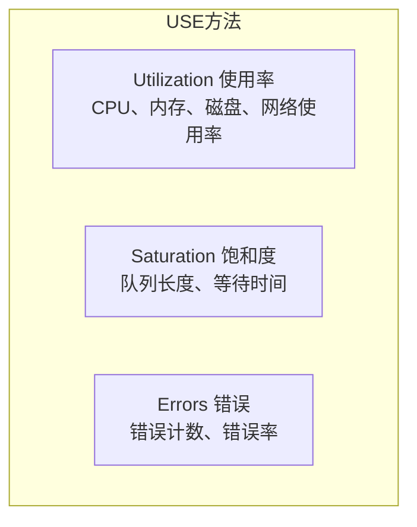
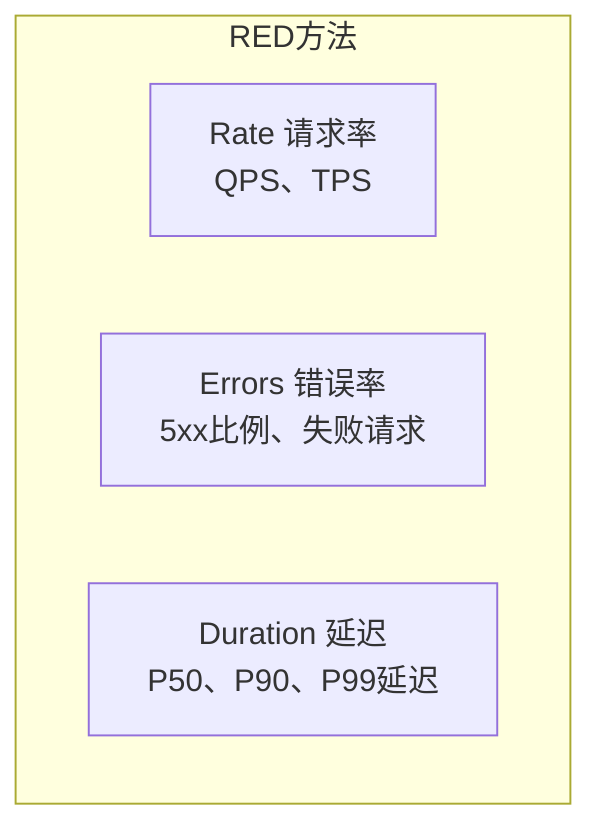
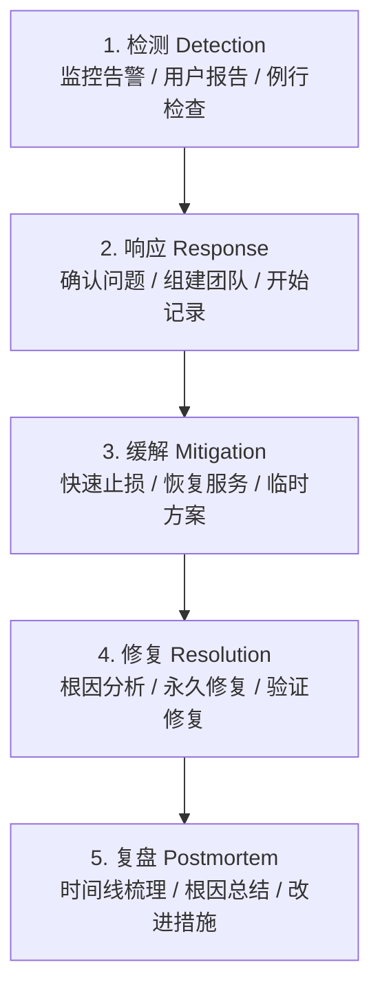

+++
title = "故障排查方法论与检查清单"
date = 2026-01-21
weight = 44000
description = "SRE故障排查方法论完整指南：系统化排查思路、通用检查清单、事故响应流程"
[taxonomies]
tags = ["SRE", "故障排查", "方法论", "检查清单", "实战"]
+++

## 概述

本文汇总故障排查的通用方法论和检查清单，帮助SRE建立系统化的排查思维。

---

# 一、故障排查方法论

## 1.1 排查基本原则

```
1. 先止损，后排查
   - 首先恢复服务可用性
   - 保留现场（日志、监控）
   - 然后进行根因分析

2. 由外到内，层层深入
   - 网络 → 负载均衡 → 应用 → 数据库
   - 症状 → 直接原因 → 根本原因

3. 对比分析
   - 正常 vs 异常
   - 变更前 vs 变更后
   - 同类服务对比

4. 二分法定位
   - 缩小问题范围
   - 排除法确认

5. 保持记录
   - 记录每一步操作
   - 记录发现的现象
   - 便于复盘和分享
```

## 1.2 排查思维框架

**USE方法（资源角度）：**



**RED方法（服务角度）：**



**黄金信号：**

| 信号 | 说明 |
|------|------|
| 延迟（Latency） | 请求响应时间 |
| 流量（Traffic） | 请求量 |
| 错误（Errors） | 错误率 |
| 饱和度（Saturation） | 资源使用程度 |

## 1.3 五问法（5 Whys）

```
问题：网站无法访问

Why 1: 为什么网站无法访问？
→ 因为Web服务器返回502错误

Why 2: 为什么返回502错误？
→ 因为后端应用服务无响应

Why 3: 为什么应用服务无响应？
→ 因为应用进程被OOM杀死

Why 4: 为什么被OOM杀死？
→ 因为内存泄漏导致内存耗尽

Why 5: 为什么内存泄漏？
→ 因为新版本代码有未关闭的连接

根本原因：代码bug导致连接泄漏
```

---

# 二、通用排查清单

## 2.1 快速检查清单（5分钟内）

```bash
#!/bin/bash
# quick_check.sh - 快速系统检查

echo "===== 快速系统检查 ====="
echo "时间: $(date)"
echo ""

# 1. 系统负载
echo "--- 1. 系统负载 ---"
uptime
echo ""

# 2. 内存
echo "--- 2. 内存 ---"
free -h | head -2
echo ""

# 3. 磁盘
echo "--- 3. 磁盘 ---"
df -h | awk 'NR==1 || $5+0>70'
echo ""

# 4. 网络连接
echo "--- 4. 网络连接 ---"
ss -s | head -3
echo ""

# 5. 进程
echo "--- 5. Top 5 CPU进程 ---"
ps aux --sort=-%cpu | head -6
echo ""

# 6. 错误日志
echo "--- 6. 最近系统错误 ---"
dmesg | tail -5
journalctl -p err -n 5 --no-pager
echo ""

# 7. 失败服务
echo "--- 7. 失败的服务 ---"
systemctl --failed
echo ""

echo "===== 检查完成 ====="
```

## 2.2 详细检查清单

### 服务不可用检查

```markdown
## 服务不可用排查清单

### 第一步：确认问题
- [ ] 确认故障范围（全部用户/部分用户/特定区域）
- [ ] 确认故障时间点
- [ ] 确认错误表现（超时/错误码/无响应）

### 第二步：网络层
- [ ] DNS解析正常？ `dig domain`
- [ ] 目标IP可达？ `ping ip`
- [ ] 端口可连接？ `telnet ip port`
- [ ] 防火墙规则？ `iptables -L`
- [ ] 负载均衡健康检查？

### 第三步：应用层
- [ ] 应用进程运行？ `ps aux | grep app`
- [ ] 应用端口监听？ `ss -tlnp | grep port`
- [ ] 应用日志错误？ `tail -f /var/log/app/error.log`
- [ ] 应用资源充足？（内存、文件描述符）

### 第四步：资源层
- [ ] CPU使用率？ `top`
- [ ] 内存使用？ `free -h`
- [ ] 磁盘空间？ `df -h`
- [ ] 磁盘IO？ `iostat -x 1`
- [ ] 网络带宽？ `iftop`

### 第五步：依赖服务
- [ ] 数据库连接？
- [ ] 缓存服务？
- [ ] 消息队列？
- [ ] 外部API？

### 第六步：最近变更
- [ ] 代码部署？
- [ ] 配置修改？
- [ ] 基础设施变更？
- [ ] 证书更新？
```

### 性能问题检查

```markdown
## 性能问题排查清单

### 症状确认
- [ ] 响应延迟多少？P50/P90/P99？
- [ ] 是持续慢还是间歇性慢？
- [ ] 影响所有请求还是特定请求？

### CPU相关
- [ ] CPU使用率？ `top`, `mpstat`
- [ ] 用户态/系统态/iowait？
- [ ] 哪个进程占用高？ `ps aux --sort=-%cpu`
- [ ] 线程级别分析？ `top -H -p PID`
- [ ] 火焰图分析？ `perf`, `async-profiler`

### 内存相关
- [ ] 内存使用率？ `free -h`
- [ ] 是否有Swap使用？
- [ ] 进程内存分布？ `ps aux --sort=-%mem`
- [ ] 是否有内存泄漏？

### 磁盘相关
- [ ] IO等待高？ `iostat -x`
- [ ] 哪个进程IO高？ `iotop`
- [ ] 磁盘使用率？ `df -h`
- [ ] 文件系统类型合适？

### 网络相关
- [ ] 网络延迟？ `ping`, `mtr`
- [ ] 带宽使用？ `iftop`
- [ ] 连接数？ `ss -s`
- [ ] 丢包？ `netstat -s`

### 应用相关
- [ ] 连接池配置？
- [ ] 线程池配置？
- [ ] 缓存命中率？
- [ ] 慢SQL？
- [ ] 外部调用延迟？
```

---

## 2.3 各场景检查清单速查

### CPU问题

```bash
# 快速检查
uptime                          # 负载
top -bn1 | head -20             # CPU和进程
mpstat 1 5                      # 各CPU使用率
ps aux --sort=-%cpu | head -10  # Top CPU进程

# 深入分析
pidstat -u 1 5                  # 进程CPU
strace -c -p <PID>              # 系统调用
perf top -p <PID>               # 热点函数
```

### 内存问题

```bash
# 快速检查
free -h                         # 内存概览
cat /proc/meminfo               # 详细信息
ps aux --sort=-%mem | head -10  # Top内存进程

# 深入分析
vmstat 1 5                      # 内存和swap
slabtop                         # 内核slab
smem -rs uss                    # 进程真实内存
```

### 磁盘问题

```bash
# 快速检查
df -h                           # 空间使用
df -i                           # inode使用
iostat -x 1 5                   # IO统计

# 深入分析
iotop                           # 进程IO
lsof +D /path                   # 打开的文件
du -sh /* | sort -hr            # 目录大小
```

### 网络问题

```bash
# 快速检查
ping <target>                   # 连通性
ss -s                           # 连接统计
ss -tlnp                        # 监听端口

# 深入分析
mtr <target>                    # 路径分析
tcpdump -i eth0 port 80         # 抓包
netstat -s                      # 协议统计
```

---

# 三、事故响应流程

## 3.1 事故响应阶段



## 3.2 事故响应模板

```markdown
## 事故响应记录

### 基本信息
- 事故标题：[简短描述]
- 严重程度：P0/P1/P2/P3
- 影响范围：[用户/服务/区域]
- 发生时间：YYYY-MM-DD HH:MM
- 恢复时间：YYYY-MM-DD HH:MM
- 持续时长：X小时Y分钟

### 时间线
| 时间 | 事件 | 操作人 |
|------|------|--------|
| HH:MM | 收到告警 | - |
| HH:MM | 开始调查 | XXX |
| HH:MM | 确认问题 | XXX |
| HH:MM | 执行回滚 | XXX |
| HH:MM | 服务恢复 | - |

### 影响
- 影响用户数：约XXXX
- 影响交易数：约XXXX
- 经济损失：约XXXX

### 根本原因
[详细描述根本原因]

### 缓解措施
[描述采取的止损措施]

### 后续行动
- [ ] 修复根本原因
- [ ] 添加监控告警
- [ ] 更新文档/Runbook
- [ ] 进行演练
```

## 3.3 沟通模板

### 事故通告

```markdown
【事故通告】服务XXX异常

影响：
- 服务XXX无法正常访问
- 影响时间：HH:MM - HH:MM
- 影响用户：约XX%

当前状态：
- [处理中/已恢复]

处理进展：
- HH:MM 发现问题
- HH:MM 定位原因为XXX
- HH:MM 正在执行修复

预计恢复时间：HH:MM

联系人：XXX
```

### 事故关闭

```markdown
【事故关闭】服务XXX已恢复

恢复时间：HH:MM
故障时长：X小时Y分钟

根本原因：
[简述根本原因]

后续计划：
- 根因修复：预计X天
- 监控完善：预计X天

如有问题请联系：XXX
```

---

# 四、常用命令速查表

## 4.1 系统状态

```bash
# 负载和运行时间
uptime

# 系统信息
uname -a
cat /etc/os-release

# 登录用户
who
w

# 最近重启
last reboot | head

# 系统日志
dmesg | tail
journalctl -xe
```

## 4.2 进程管理

```bash
# 进程列表
ps aux
ps -ef
pstree

# 资源占用Top
top
htop

# 按资源排序
ps aux --sort=-%cpu | head
ps aux --sort=-%mem | head

# 进程详情
cat /proc/<PID>/status
ls -l /proc/<PID>/fd

# 进程追踪
strace -p <PID>
lsof -p <PID>
```

## 4.3 网络诊断

```bash
# 连接状态
ss -tlnp
ss -s
netstat -ant

# 连通测试
ping <host>
traceroute <host>
mtr <host>

# DNS
dig <domain>
nslookup <domain>

# 端口测试
nc -zv <host> <port>
telnet <host> <port>

# 抓包
tcpdump -i eth0 port 80
```

## 4.4 磁盘和文件

```bash
# 磁盘使用
df -h
df -i

# 目录大小
du -sh *
ncdu

# 查找大文件
find / -type f -size +100M

# 打开文件
lsof +D /path
lsof -c <process>

# 文件系统
mount
cat /etc/fstab
```

## 4.5 服务管理

```bash
# 服务状态
systemctl status <service>
systemctl list-units --failed

# 服务操作
systemctl start/stop/restart <service>
systemctl enable/disable <service>

# 日志查看
journalctl -u <service>
journalctl -f
```

---

# 五、排查工具推荐

## 5.1 性能分析工具

| 分类 | 工具 | 用途 |
|------|------|------|
| **CPU分析** | top/htop | 实时监控 |
| | mpstat | CPU统计 |
| | perf | 性能profiling |
| | async-profiler | Java CPU分析 |
| **内存分析** | free | 内存概览 |
| | vmstat | 虚拟内存统计 |
| | smem | 进程内存分析 |
| | valgrind | 内存泄漏检测 |
| **磁盘分析** | iostat | IO统计 |
| | iotop | 进程IO |
| | fio | 性能测试 |
| | ncdu | 目录分析 |
| **网络分析** | ss/netstat | 连接状态 |
| | iftop | 流量监控 |
| | tcpdump | 抓包 |
| | mtr | 路径分析 |

## 5.2 日志分析工具

| 分类 | 工具 | 用途 |
|------|------|------|
| **命令行** | grep/awk/sed | 文本处理 |
| | jq | JSON处理 |
| | lnav | 日志浏览器 |
| **集中式** | ELK Stack | 日志平台 |
| | Loki | 轻量级日志 |
| | Splunk | 商业方案 |

## 5.3 监控工具

| 分类 | 工具 | 用途 |
|------|------|------|
| **指标监控** | Prometheus | 指标收集 |
| | Grafana | 可视化 |
| | node_exporter | 系统指标 |
| **追踪** | Jaeger | 分布式追踪 |
| | Zipkin | 追踪系统 |
| | SkyWalking | APM |
| **告警** | Alertmanager | 告警管理 |
| | PagerDuty | 事件管理 |
| | Opsgenie | 值班管理 |

---

## 总结

### 排查记忆口诀

```
一看负载和进程，二查内存和磁盘
三测网络和端口，四翻日志找错因
五问依赖服务状，六查最近有啥变
```

### 黄金法则

1. **先恢复，后分析** - 用户体验优先
2. **保留现场** - 收集证据再操作
3. **逐层排查** - 由外到内，由表及里
4. **对比分析** - 正常vs异常
5. **记录一切** - 便于复盘

### 快速定位口诀

```
CPU高看进程，内存满找泄漏
磁盘慢查IO，网络慢看丢包
服务挂看日志，依赖断查连接
```

### 工具记忆

| 场景 | 首选工具 |
|------|----------|
| CPU分析 | top + perf |
| 内存分析 | free + smem |
| 磁盘分析 | df + iostat |
| 网络分析 | ss + tcpdump |
| 进程分析 | ps + strace |
| 日志分析 | journalctl + grep |

---

## 相关文章

- [上一篇：软件包与依赖问题排查实战](@/articles/sre/sre-43-软件包与依赖问题排查实战.md)
- [下一篇：消息队列问题排查实战](@/articles/sre/sre-45-消息队列问题排查实战.md)
