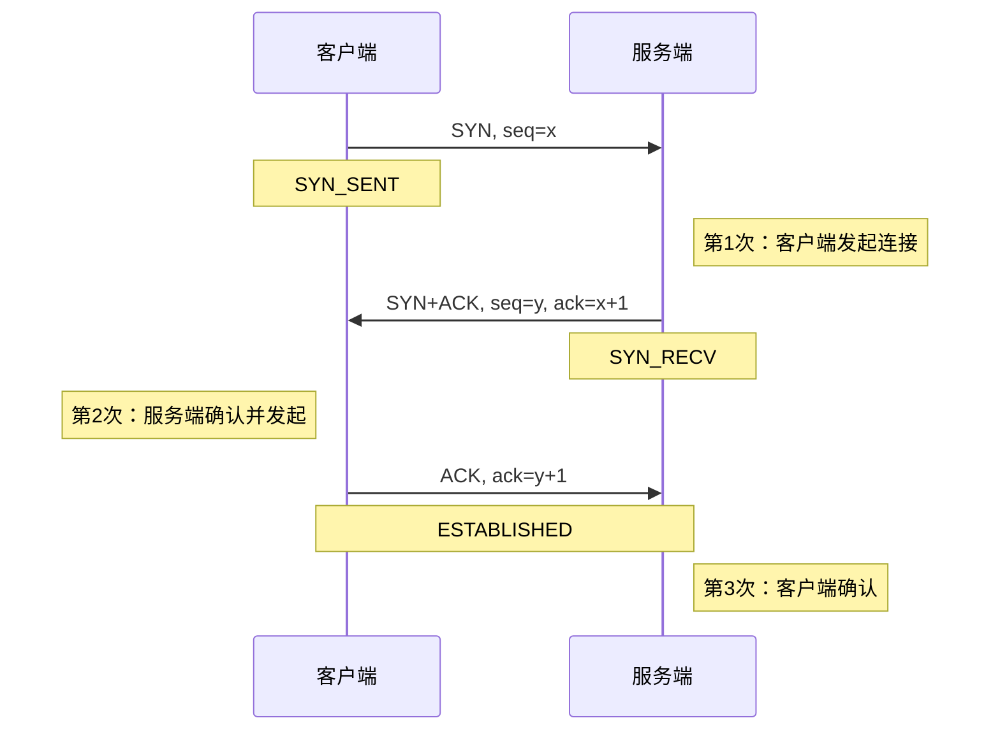
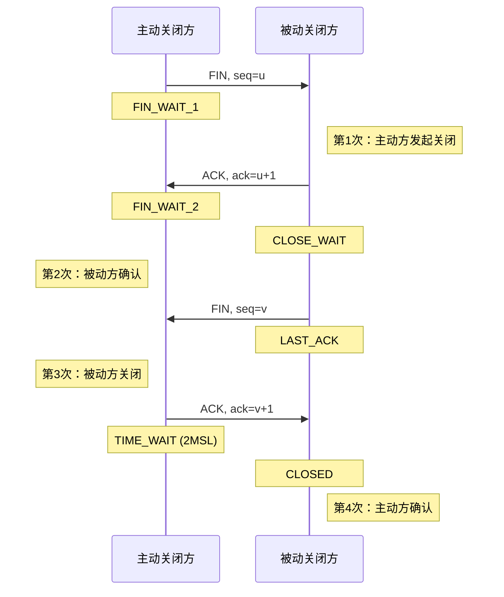
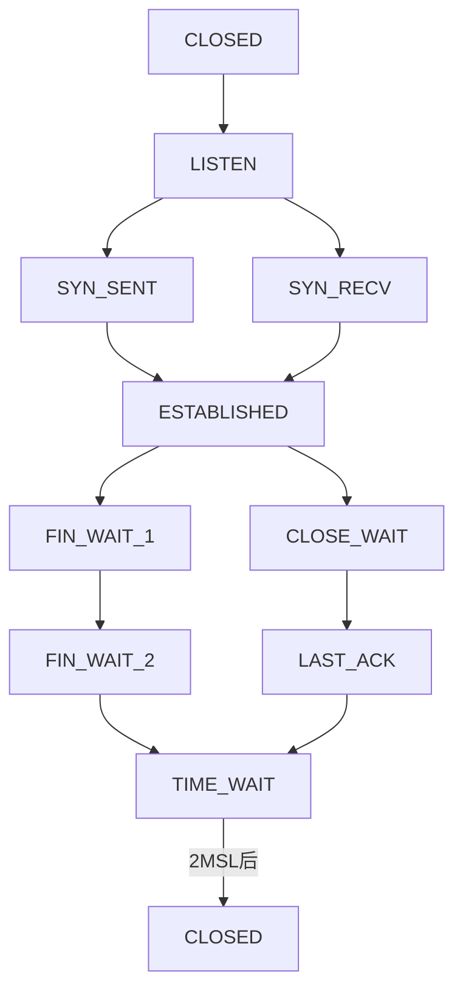
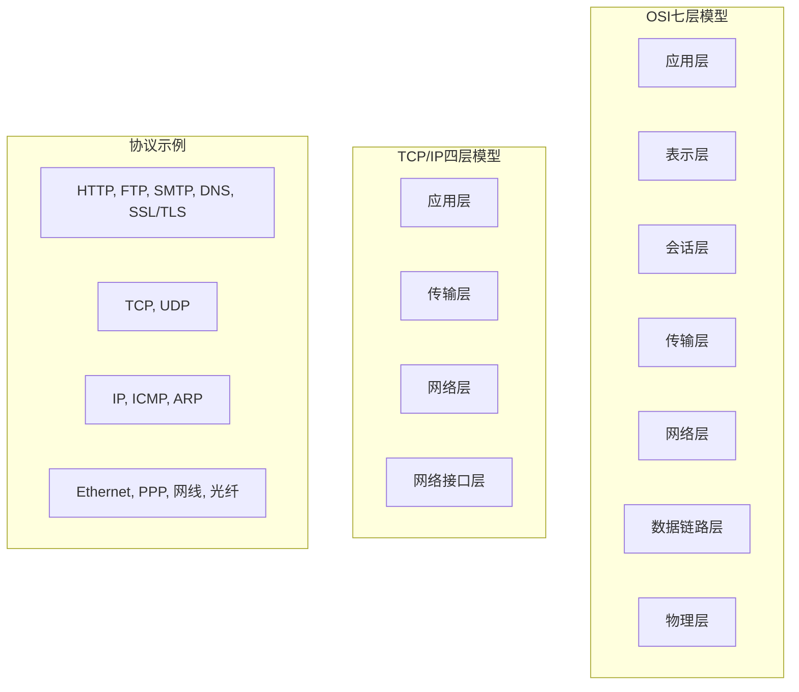

+++
title = "SRE面试题-网络协议详解"
date = 2026-01-21
weight = 55000
description = "SRE面试必备：TCP/IP协议、HTTP/HTTPS、DNS、网络排查等核心问题详解"
[taxonomies]
tags = ["SRE", "面试", "TCP", "HTTP", "网络", "DNS"]
+++

## 概述

网络知识是SRE面试的重点考察领域。本文详细解答TCP/IP、HTTP、DNS等高频面试问题。

---

# 一、TCP协议

## 1.1 TCP三次握手的过程？

**标准答案**：



**各字段含义**：
- **SYN**: 同步标志，发起连接
- **ACK**: 确认标志
- **seq**: 序列号
- **ack**: 确认号（期望收到的下一个序列号）

**为什么是三次，不是两次或四次？**

```
为什么不能两次？
- 两次握手无法确认客户端的接收能力
- 可能导致历史连接被错误建立（网络延迟的旧SYN）
- 服务端无法确认客户端是否收到了SYN+ACK

为什么不用四次？
- 三次已经足够确认双方的发送和接收能力
- 第二次可以合并SYN和ACK

三次握手确认的内容：
第1次：服务端确认 - 客户端发送正常
第2次：客户端确认 - 服务端发送和接收正常
第3次：服务端确认 - 客户端接收正常
```

**实战命令**：

```bash
# 抓包查看三次握手
tcpdump -i eth0 -nn 'tcp[tcpflags] & (tcp-syn|tcp-ack) != 0' and port 80

# 查看半连接队列（SYN队列）
ss -n state syn-recv

# 查看全连接队列（Accept队列）
ss -lnt | grep <port>
# Recv-Q: 当前队列中的连接数
# Send-Q: 队列最大长度
```

---

## 1.2 TCP四次挥手的过程？

**标准答案**：



**为什么是四次？**
- 关闭是双向的，每个方向需要一个FIN和一个ACK
- 被动方可能还有数据要发送，不能立即发FIN
- 因此ACK和FIN需要分开发送

**TCP状态转换**：



---

## 1.3 TIME_WAIT是什么？为什么需要？

**标准答案**：

```
TIME_WAIT状态：
- 主动关闭连接的一方进入的状态
- 持续时间：2MSL（Maximum Segment Lifetime，通常60秒）
- 在此期间，该端口不能被重新使用

为什么需要TIME_WAIT？

原因1：确保最后的ACK被收到
- 如果最后一个ACK丢失，被动方会重发FIN
- 主动方需要在TIME_WAIT期间能够重发ACK
- 否则被动方会一直卡在LAST_ACK

原因2：防止历史连接的数据干扰新连接
- 等待2MSL确保旧连接的所有报文都已消失
- 新连接不会收到旧连接的残留数据

为什么是2MSL？
- 一个MSL是报文最大生存时间
- 2MSL确保往返的报文都已消失
```

**TIME_WAIT过多的问题和解决**：

```bash
# 查看TIME_WAIT数量
ss -ant | grep TIME-WAIT | wc -l

# TIME_WAIT过多的影响
# 1. 占用端口资源（端口号有限：1024-65535）
# 2. 占用内存（虽然很小）

# 解决方案

# 1. 开启TIME_WAIT复用（推荐）
sysctl -w net.ipv4.tcp_tw_reuse=1
# 允许TIME_WAIT的端口用于新连接（客户端）

# 2. 减少TIME_WAIT时间（不推荐直接改MSL）
sysctl -w net.ipv4.tcp_fin_timeout=30

# 3. 增加本地端口范围
sysctl -w net.ipv4.ip_local_port_range="1024 65535"

# 4. 使用长连接减少连接创建/关闭

# 不推荐的做法
# tcp_tw_recycle 在NAT环境会有问题，已被废弃
```

---

## 1.4 CLOSE_WAIT是什么？如何处理？

**标准答案**：

```
CLOSE_WAIT状态：
- 被动关闭方收到FIN后进入的状态
- 表示对端已关闭，但本端还未关闭
- 等待应用程序调用close()

CLOSE_WAIT堆积的原因：
1. 应用程序未调用close()关闭连接
2. 代码bug，连接对象未被正确释放
3. 处理逻辑阻塞，未能及时关闭

危害：
- 占用文件描述符
- 最终导致"Too many open files"

排查和处理：
```

```bash
# 查看CLOSE_WAIT连接
ss -antp state close-wait

# 按进程统计
ss -antp state close-wait | awk '{print $6}' | sort | uniq -c | sort -rn

# 找出对应的进程
ss -antp state close-wait | head -10

# 解决方案
# 1. 修复应用代码，确保调用close()
# 2. 设置SO_LINGER选项
# 3. 设置超时关闭
# 4. 重启应用（临时方案）
```

---

## 1.5 TCP和UDP的区别？

**标准答案**：

| 特性 | TCP | UDP |
|------|-----|-----|
| 连接 | 面向连接 | 无连接 |
| 可靠性 | 可靠传输 | 不保证可靠 |
| 顺序 | 保证顺序 | 不保证顺序 |
| 流量控制 | 有（滑动窗口） | 无 |
| 拥塞控制 | 有 | 无 |
| 开销 | 大（20字节头部） | 小（8字节头部） |
| 传输方式 | 字节流 | 数据报 |
| 速度 | 相对慢 | 快 |

**应用场景**：

**TCP**：
- HTTP/HTTPS
- FTP
- SSH
- 数据库连接
- 需要可靠传输的场景

**UDP**：
- DNS查询
- 视频直播
- 在线游戏
- VoIP
- 允许丢包、追求速度的场景

---

## 1.6 TCP如何保证可靠传输？

**标准答案**：

```
1. 序列号和确认号
   - 每个字节都有序列号
   - 接收方确认收到的数据
   - 发送方根据确认重传

2. 校验和
   - 检测数据在传输中是否损坏
   - 损坏的包被丢弃

3. 超时重传
   - 超过RTO未收到确认则重传
   - RTO根据RTT动态调整

4. 流量控制
   - 滑动窗口机制
   - 接收方告知能接收的数据量
   - 防止发送方发送过快

5. 拥塞控制
   - 慢启动
   - 拥塞避免
   - 快速重传
   - 快速恢复

6. 分段和重组
   - 大数据分成小段传输
   - 接收方重新组装

7. 去重
   - 根据序列号去除重复数据
```

---

## 1.7 TCP粘包是什么？如何解决？

**标准答案**：

```
粘包现象：
- TCP是字节流协议，没有消息边界
- 多个消息可能合并成一个包发送
- 一个消息可能被拆分成多个包

原因：
1. 发送方Nagle算法合并小包
2. 接收方缓冲区合并
3. MSS分片

解决方案：

1. 固定长度
   每个消息固定长度，不足补齐

2. 分隔符
   消息之间用特殊字符分隔（如\n）
   需要转义分隔符

3. 长度前缀（推荐）
   消息头包含长度字段
   如：4字节长度 + 消息体

4. 自定义协议
   包头 + 包体结构
   包头包含消息类型、长度等
```

---

# 二、HTTP协议

## 2.1 HTTP状态码含义？

**标准答案**：

```
1xx - 信息性响应
- 100 Continue: 继续发送请求体
- 101 Switching Protocols: 切换协议（如WebSocket）

2xx - 成功
- 200 OK: 请求成功
- 201 Created: 资源创建成功
- 204 No Content: 成功但无返回内容
- 206 Partial Content: 部分内容（断点续传）

3xx - 重定向
- 301 Moved Permanently: 永久重定向（会缓存）
- 302 Found: 临时重定向
- 304 Not Modified: 资源未修改（使用缓存）
- 307 Temporary Redirect: 临时重定向（保持方法）
- 308 Permanent Redirect: 永久重定向（保持方法）

4xx - 客户端错误
- 400 Bad Request: 请求语法错误
- 401 Unauthorized: 未认证
- 403 Forbidden: 禁止访问
- 404 Not Found: 资源不存在
- 405 Method Not Allowed: 方法不允许
- 408 Request Timeout: 请求超时
- 413 Payload Too Large: 请求体过大
- 429 Too Many Requests: 请求过多（限流）

5xx - 服务端错误
- 500 Internal Server Error: 服务器内部错误
- 502 Bad Gateway: 网关错误（后端无响应）
- 503 Service Unavailable: 服务不可用
- 504 Gateway Timeout: 网关超时
```

**面试常问：502和504的区别？**

```
502 Bad Gateway:
- 网关/代理收到了无效响应
- 后端服务不可用或返回错误

504 Gateway Timeout:
- 网关/代理等待后端超时
- 后端服务响应太慢

排查思路：
502 → 检查后端服务是否存活
504 → 检查后端服务响应时间
```

---

## 2.2 HTTP/1.1和HTTP/2的区别？

**标准答案**：

| 特性 | HTTP/1.1 | HTTP/2 |
|------|----------|--------|
| 连接 | 多个连接 | 单连接多路复用 |
| 头部 | 文本格式 | 二进制 + 压缩（HPACK） |
| 请求 | 串行（队头阻塞） | 并行（无队头阻塞） |
| 服务器推送 | 不支持 | 支持 |
| 优先级 | 无 | 支持流优先级 |

**HTTP/2的主要改进**：

1. **二进制分帧**
   - 请求和响应被分割成帧
   - 多个帧交错传输
   - 支持流的优先级

2. **多路复用**
   - 单个TCP连接上并行多个请求/响应
   - 消除HTTP/1.1的队头阻塞
   - 减少连接数

3. **头部压缩**
   - HPACK算法压缩头部
   - 维护头部索引表
   - 减少重复传输

4. **服务器推送**
   - 服务器主动推送资源
   - 如推送CSS/JS文件
   - 减少往返次数

**HTTP/3的改进**：

```
HTTP/3基于QUIC协议（UDP）：
- 0-RTT连接建立
- 无TCP队头阻塞
- 内置TLS 1.3
- 连接迁移（IP变化不中断）
```

---

## 2.3 HTTPS如何保证安全？

**标准答案**：

```
HTTPS = HTTP + TLS/SSL

安全保障：

1. 加密（Encryption）
   - 对称加密传输数据（AES等）
   - 防止数据被窃听

2. 完整性（Integrity）
   - MAC（消息认证码）
   - 防止数据被篡改

3. 认证（Authentication）
   - 数字证书验证服务器身份
   - 防止中间人攻击

TLS握手过程（简化版）：
```

```
客户端                          服务端
   |                               |
   |-------- Client Hello -------->|  支持的TLS版本、加密套件、随机数
   |                               |
   |<------- Server Hello ---------|  选择的加密套件、证书、随机数
   |                               |
   |    验证证书、生成预主密钥       |
   |                               |
   |---- Client Key Exchange ----->|  用服务器公钥加密的预主密钥
   |                               |
   |    双方计算会话密钥             |
   |                               |
   |---- Change Cipher Spec ------>|  切换到加密通信
   |<--- Change Cipher Spec -------|
   |                               |
   |-------- Finished ------------>|  加密的握手验证
   |<-------- Finished ------------|
   |                               |
   |====== 加密数据传输 =============|
```

**证书链验证**：

```
1. 浏览器收到服务器证书
2. 检查证书是否在有效期内
3. 检查证书域名是否匹配
4. 使用CA公钥验证证书签名
5. 向上追溯证书链直到根CA
6. 检查证书是否被吊销（CRL/OCSP）
```

---

## 2.4 GET和POST的区别？

**标准答案**：

| 特性 | GET | POST |
|------|-----|------|
| 语义 | 获取资源 | 提交数据 |
| 参数位置 | URL | 请求体 |
| 可见性 | 参数在URL中可见 | 参数在请求体中 |
| 书签 | 可以加书签 | 不可以 |
| 缓存 | 可被缓存 | 默认不缓存 |
| 历史记录 | 参数保留在历史 | 参数不保留 |
| 长度限制 | 有（URL长度限制） | 无（理论上） |
| 幂等性 | 幂等 | 非幂等 |
| 安全性 | 安全（不修改资源） | 不安全 |

**注意**：从协议层面，GET和POST没有本质区别，上述区别主要是约定俗成的使用规范

**幂等性解释**：

```
幂等（Idempotent）：
- 多次执行与一次执行效果相同
- GET, PUT, DELETE 是幂等的
- POST 不是幂等的

举例：
GET /user/1     → 多次请求结果相同，幂等
POST /user      → 多次请求可能创建多个用户，非幂等
PUT /user/1     → 多次请求结果相同（覆盖），幂等
DELETE /user/1  → 多次请求结果相同（已删除），幂等
```

---

## 2.5 HTTP缓存机制？

**标准答案**：

```
HTTP缓存分类：

1. 强缓存（不请求服务器）
   - Expires: 过期时间（HTTP/1.0）
   - Cache-Control: max-age=3600（HTTP/1.1，优先级更高）

   Cache-Control指令：
   - max-age: 缓存有效期（秒）
   - no-cache: 需要验证才能使用
   - no-store: 不缓存
   - private: 仅浏览器缓存
   - public: 允许中间缓存

2. 协商缓存（需要请求服务器验证）
   - Last-Modified / If-Modified-Since
   - ETag / If-None-Match（优先级更高）

   流程：
   1. 首次请求，服务器返回Last-Modified/ETag
   2. 再次请求，客户端带上If-Modified-Since/If-None-Match
   3. 服务器验证：
      - 未变化 → 返回304 Not Modified
      - 已变化 → 返回200和新内容

ETag vs Last-Modified：
- Last-Modified精度只到秒
- ETag可以更精确（文件内容hash）
- ETag能处理文件仅改时间不改内容的情况
```

---

## 2.6 Cookie和Session的区别？

**标准答案**：

```
Cookie：
- 存储在客户端（浏览器）
- 随每次请求发送到服务器
- 有大小限制（通常4KB）
- 可设置过期时间
- 安全性较低

Session：
- 存储在服务器端
- 客户端只保存Session ID（通常在Cookie中）
- 大小不受限
- 占用服务器资源
- 安全性较高

| 特性 | Cookie | Session |
|------|--------|---------|
| 存储位置 | 客户端 | 服务端 |
| 安全性 | 低 | 高 |
| 大小限制 | 4KB | 无限制 |
| 服务器压力 | 小 | 大 |
| 跨域 | 可配置 | 不支持 |

实际应用：
- Session ID通常存在Cookie中
- 分布式环境需要Session共享（Redis等）
- 无状态认证可用JWT替代Session
```

---

# 三、DNS

## 3.1 DNS解析过程？

**标准答案**：

```
DNS解析流程：

1. 浏览器缓存
   检查浏览器DNS缓存

2. 系统缓存
   检查操作系统DNS缓存（nscd）

3. hosts文件
   检查/etc/hosts

4. 本地DNS服务器（递归查询）
   - 通常是ISP或公司DNS
   - 检查自身缓存
   - 若无则进行递归查询

5. 根DNS服务器
   返回顶级域（.com）的NS记录

6. 顶级域DNS服务器
   返回权威DNS服务器地址

7. 权威DNS服务器
   返回最终的IP地址

8. 结果缓存
   各级缓存结果（根据TTL）
```

**DNS记录类型**：

| 类型 | 说明 | 示例 |
|------|------|------|
| A | IPv4地址 | example.com → 1.2.3.4 |
| AAAA | IPv6地址 | example.com → 2001:... |
| CNAME | 别名 | www.example.com → example.com |
| MX | 邮件服务器 | example.com → mail.example.com |
| NS | 域名服务器 | example.com → ns1.example.com |
| TXT | 文本信息 | SPF/DKIM记录 |
| PTR | 反向解析 | IP → 域名 |
| SOA | 区域起始授权 | 区域配置信息 |

**实战命令**：

```bash
# 查询A记录
dig example.com A

# 查询所有记录
dig example.com ANY

# 追踪解析过程
dig +trace example.com

# 指定DNS服务器
dig @8.8.8.8 example.com

# 反向解析
dig -x 1.2.3.4

# 查看DNS缓存（Linux）
# systemd-resolved
resolvectl statistics
```

---

## 3.2 DNS劫持和DNS污染？

**标准答案**：

```
DNS劫持：
- 攻击者控制DNS服务器或中间设备
- 返回错误的IP地址
- 将用户导向恶意网站

DNS污染：
- 在DNS查询过程中注入虚假响应
- 通常发生在网络边界
- GFW使用的技术之一

区别：
| 特性 | DNS劫持 | DNS污染 |
|------|---------|---------|
| 层面 | DNS服务器 | 网络传输 |
| 范围 | 局部 | 可能更广 |
| 检测 | 换DNS可发现 | 需要对比验证 |

检测方法：
# 使用多个DNS服务器对比结果
dig @8.8.8.8 example.com
dig @1.1.1.1 example.com
dig @114.114.114.114 example.com

防范措施：
1. 使用可信DNS（8.8.8.8, 1.1.1.1）
2. 使用DNS over HTTPS (DoH)
3. 使用DNS over TLS (DoT)
4. 本地hosts文件
```

---

# 四、网络排查

## 4.1 网络不通如何排查？

**标准答案**：

```bash
# 分层排查（自下而上）

# 1. 物理层 - 网线、网口
ip link show
ethtool eth0

# 2. 数据链路层 - MAC、ARP
ip link show
arp -n

# 3. 网络层 - IP、路由
ip addr show
ip route show
ping <目标IP>
traceroute <目标IP>

# 4. 传输层 - 端口、防火墙
ss -tlnp
telnet <IP> <Port>
nc -zv <IP> <Port>

# 5. 应用层 - 服务
curl -v http://example.com

# 常用排查命令
ping <IP>           # 测试连通性
traceroute <IP>     # 查看路由路径
mtr <IP>            # 持续测试路径
dig <domain>        # DNS解析
curl -v <URL>       # HTTP请求
ss -ant             # 查看连接状态
iptables -L -n      # 查看防火墙规则
```

---

## 4.2 如何抓包分析？

**标准答案**：

```bash
# tcpdump常用命令

# 抓取指定接口
tcpdump -i eth0

# 抓取指定主机
tcpdump host 192.168.1.1

# 抓取指定端口
tcpdump port 80

# 抓取TCP SYN包
tcpdump 'tcp[tcpflags] & tcp-syn != 0'

# 保存到文件
tcpdump -i eth0 -w capture.pcap

# 读取文件
tcpdump -r capture.pcap

# 组合过滤
tcpdump -i eth0 'host 192.168.1.1 and port 80'

# 显示详细信息
tcpdump -i eth0 -nn -vvv

# 参数说明
# -i: 接口
# -n: 不解析主机名
# -nn: 不解析主机名和端口名
# -v/-vv/-vvv: 详细程度
# -w: 写入文件
# -r: 读取文件
# -c: 抓取数量
```

---

## 4.3 常见网络问题和解决？

**标准答案**：

```
问题1：连接超时
原因：防火墙、服务未启动、网络不通
排查：ping、telnet、检查防火墙规则

问题2：连接拒绝（Connection Refused）
原因：服务未监听、端口错误
排查：ss -tlnp 检查监听状态

问题3：网络慢
原因：带宽不足、丢包、延迟高
排查：iperf3测带宽、mtr看丢包和延迟

问题4：间歇性断开
原因：网络抖动、连接超时、防火墙会话超时
排查：持续ping监控、检查keepalive设置

问题5：DNS解析慢/失败
原因：DNS服务器问题、网络问题
排查：dig +trace、更换DNS服务器测试
```

---

# 五、其他网络知识

## 5.1 OSI七层模型和TCP/IP四层模型？

**标准答案**：



| OSI层 | TCP/IP层 | 协议示例 |
|-------|----------|----------|
| 应用层/表示层/会话层 | 应用层 | HTTP, FTP, SMTP, DNS, SSL/TLS |
| 传输层 | 传输层 | TCP, UDP |
| 网络层 | 网络层 | IP, ICMP, ARP |
| 数据链路层/物理层 | 网络接口层 | Ethernet, PPP |

---

## 5.2 NAT是什么？

**标准答案**：

```
NAT（Network Address Translation）：
- 网络地址转换
- 将私有IP转换为公网IP
- 节省公网IP资源

NAT类型：

1. SNAT（Source NAT）
   - 修改源IP地址
   - 内网访问外网时使用
   - 如：192.168.1.100 → 公网IP

2. DNAT（Destination NAT）
   - 修改目标IP地址
   - 端口映射、负载均衡
   - 如：公网IP:80 → 192.168.1.100:8080

3. NAPT/PAT
   - 同时转换IP和端口
   - 多个内网IP共享一个公网IP

NAT穿透问题：
- P2P应用需要NAT穿透
- 解决方案：STUN, TURN, ICE
```

---

## 5.3 什么是CDN？工作原理？

**标准答案**：

```
CDN（Content Delivery Network）：
- 内容分发网络
- 将内容缓存到离用户近的节点
- 加速访问、减轻源站压力

工作原理：

1. DNS引导
   - 用户访问 www.example.com
   - DNS返回最近CDN节点IP

2. 缓存命中
   - 用户请求到达CDN节点
   - 若有缓存，直接返回

3. 回源
   - 若无缓存或已过期
   - CDN向源站请求
   - 缓存后返回给用户

CDN缓存策略：
- 根据Cache-Control头
- 根据文件类型
- 可配置自定义规则

常见CDN问题：
1. 缓存未更新：清除CDN缓存/刷新
2. 源站压力大：优化缓存策略
3. HTTPS证书：CDN需配置证书
```

---

## 总结

### 高频考点速查

| 主题 | 核心概念 | 关键命令 |
|------|----------|----------|
| TCP三次握手 | SYN → SYN+ACK → ACK | `tcpdump` |
| TCP四次挥手 | FIN → ACK → FIN → ACK | `ss -ant` |
| TIME_WAIT | 2MSL等待期 | `ss \| grep TIME-WAIT` |
| CLOSE_WAIT | 应用未关闭连接 | `ss state close-wait` |
| HTTP状态码 | 2xx/3xx/4xx/5xx | `curl -I` |
| HTTPS | TLS握手、证书验证 | `openssl s_client` |
| DNS | 递归查询、记录类型 | `dig +trace` |
| 网络排查 | 分层定位 | `ping/traceroute/telnet` |

### 面试回答技巧

1. **画图说明**：TCP握手/挥手适合画状态图
2. **结合实践**：讲自己排查过的网络问题
3. **深入原理**：不只说现象，还说为什么
4. **给出命令**：展示实际操作能力

---

## 相关文章

- [上一篇：SRE面试题-Linux系统基础](@/articles/sre/sre-54-SRE面试题-Linux系统基础.md)
- [下一篇：SRE面试题-容器与Kubernetes](@/articles/sre/sre-56-SRE面试题-容器与Kubernetes.md)
