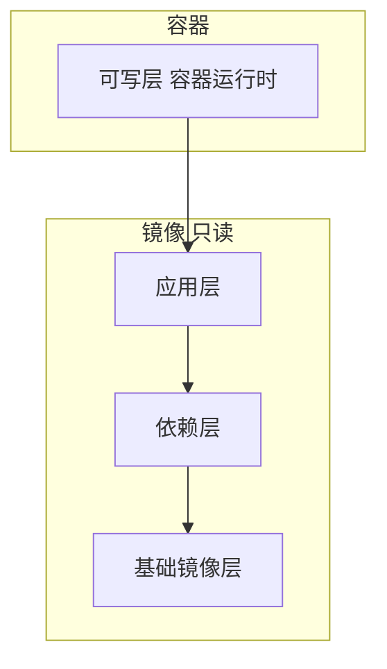
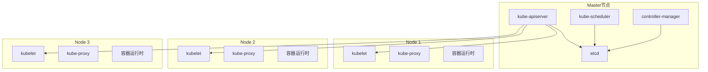
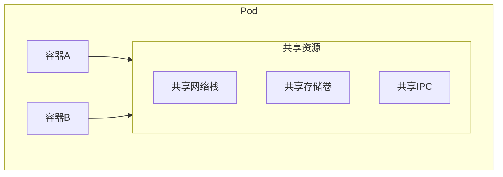

+++
title = "SRE面试题-容器与Kubernetes"
date = 2026-01-21
weight = 56000
description = "SRE面试必备：Docker原理、Kubernetes架构、Pod调度、故障排查等核心问题详解"
[taxonomies]
tags = ["SRE", "面试", "Docker", "Kubernetes", "容器", "K8s"]
+++

## 概述

容器和Kubernetes是现代SRE必备技能。本文详细解答Docker、Kubernetes相关高频面试问题。

---

# 一、Docker基础

## 1.1 Docker的核心原理是什么？

**标准答案**：

```
Docker基于Linux内核的三大技术：

1. Namespace（命名空间）- 隔离
   - PID: 进程隔离
   - NET: 网络隔离
   - MNT: 文件系统挂载隔离
   - UTS: 主机名隔离
   - IPC: 进程间通信隔离
   - USER: 用户隔离

2. Cgroups（控制组）- 资源限制
   - CPU: 限制CPU使用
   - Memory: 限制内存使用
   - I/O: 限制磁盘读写
   - Network: 限制网络带宽

3. UnionFS（联合文件系统）- 分层镜像
   - 镜像分层存储
   - 写时复制（Copy-on-Write）
   - 层共享节省空间

```

**容器 vs 虚拟机**：

| 特性 | 容器 | 虚拟机 |
|------|------|--------|
| 隔离级别 | 进程级 | 硬件级 |
| 启动速度 | 秒级 | 分钟级 |
| 资源占用 | MB级 | GB级 |
| 性能损耗 | 几乎无 | 有一定损耗 |
| 密度 | 高 | 低 |

---

## 1.2 Docker镜像和容器的关系？

**标准答案**：

```
镜像（Image）：
- 只读的文件系统模板
- 包含运行应用所需的代码、库、配置
- 分层结构，每层不可修改

容器（Container）：
- 镜像的运行实例
- 在镜像基础上添加可写层
- 有自己的进程、网络、文件系统

关系类比：
- 镜像 = 类（Class）
- 容器 = 对象（Instance）

**镜像分层示例**：



---

## 1.3 Dockerfile的最佳实践？

**标准答案**：

```dockerfile
# 1. 使用明确的基础镜像版本
FROM python:3.9-slim  # 好
# FROM python:latest   # 不好

# 2. 合并RUN命令减少层数
RUN apt-get update && \
    apt-get install -y --no-install-recommends curl && \
    rm -rf /var/lib/apt/lists/*

# 3. 将变化少的层放前面（利用缓存）
COPY requirements.txt .
RUN pip install -r requirements.txt
COPY . .  # 代码变化频繁，放后面

# 4. 使用.dockerignore排除无关文件
# .dockerignore内容：
# .git
# __pycache__
# *.pyc
# .env

# 5. 不要以root运行
RUN useradd -r appuser
USER appuser

# 6. 使用多阶段构建减小镜像
FROM golang:1.20 AS builder
WORKDIR /app
COPY . .
RUN go build -o main .

FROM alpine:3.18
COPY --from=builder /app/main /main
CMD ["/main"]

# 7. 指定WORKDIR
WORKDIR /app

# 8. 使用COPY而非ADD（除非需要解压）
COPY app.py .
```

---

## 1.4 Docker网络模式有哪些？

**标准答案**：

```
1. bridge（默认）
   - 创建虚拟网桥docker0
   - 容器通过veth连接到网桥
   - 通过NAT访问外网
   docker run --network bridge ...

2. host
   - 容器直接使用宿主机网络
   - 无网络隔离
   - 性能最好
   docker run --network host ...

3. none
   - 无网络
   - 完全隔离
   docker run --network none ...

4. container
   - 共享另一个容器的网络
   - 用于Sidecar模式
   docker run --network container:<name> ...

5. 自定义网络
   - 用户创建的bridge网络
   - 支持容器名称DNS解析
   docker network create mynet
   docker run --network mynet ...
```

---

## 1.5 如何减小Docker镜像大小？

**标准答案**：

```
1. 使用轻量基础镜像
   - alpine (5MB) 替代 ubuntu (72MB)
   - slim 版本
   - distroless 镜像

2. 多阶段构建
   - 编译和运行使用不同镜像
   - 只复制必要的产物

3. 合并RUN命令
   - 减少镜像层数
   - 同一层清理临时文件

4. 删除不必要文件
   - 包管理器缓存
   - 文档和手册
   - 源代码（编译后）

5. 使用.dockerignore
   - 排除.git、node_modules等

6. 选择合适的软件包
   - --no-install-recommends
   - 只安装运行时必需的

示例对比：
# 原始镜像：500MB
FROM python:3.9
COPY . .
RUN pip install -r requirements.txt

# 优化后：80MB
FROM python:3.9-slim
WORKDIR /app
COPY requirements.txt .
RUN pip install --no-cache-dir -r requirements.txt
COPY . .
```

---

# 二、Kubernetes架构

## 2.1 Kubernetes的核心组件？

**标准答案**：

```
Master节点组件：

1. kube-apiserver
   - 集群的API入口
   - 所有组件通过它通信
   - 提供认证、授权、准入控制

2. etcd
   - 分布式键值存储
   - 存储集群所有配置和状态
   - 唯一的持久化存储

3. kube-scheduler
   - 负责Pod调度
   - 选择最合适的Node
   - 考虑资源、亲和性等

4. kube-controller-manager
   - 运行各种控制器
   - Deployment、ReplicaSet、Node控制器等
   - 确保期望状态与实际状态一致

Node节点组件：

1. kubelet
   - Node上的代理
   - 管理Pod生命周期
   - 执行容器操作

2. kube-proxy
   - 网络代理
   - 实现Service的负载均衡
   - 维护iptables/ipvs规则

3. 容器运行时
   - Docker, containerd, CRI-O
   - 实际运行容器

**架构图**：



---

## 2.2 Pod是什么？为什么需要Pod？

**标准答案**：

```
Pod：
- Kubernetes最小调度单位
- 包含一个或多个容器
- 共享网络和存储

为什么需要Pod而不是直接调度容器？

1. 紧密耦合的容器需要共享资源
   - 共享网络命名空间（localhost通信）
   - 共享存储卷
   - 共享IPC

2. Sidecar模式
   - 日志收集容器
   - 代理容器（如Envoy）
   - 监控容器

3. Init容器
   - 在主容器前运行
   - 准备环境、等待依赖

**Pod中容器的关系**：



---

## 2.3 Deployment、ReplicaSet、Pod的关系？

**标准答案**：

```
层级关系：

Deployment
    ├── ReplicaSet (v1)
    │       ├── Pod
    │       ├── Pod
    │       └── Pod
    └── ReplicaSet (v2)  ← 滚动更新时创建
            ├── Pod
            ├── Pod
            └── Pod

各自职责：

Pod：
- 运行容器的最小单位
- 不具备自愈能力

ReplicaSet：
- 维护Pod副本数量
- 确保指定数量的Pod运行
- 不直接使用，由Deployment管理

Deployment：
- 管理ReplicaSet
- 支持滚动更新
- 支持回滚
- 记录版本历史

为什么不直接用ReplicaSet？
- Deployment提供声明式更新
- 支持滚动更新策略
- 可以回滚到之前版本
- 记录修订历史
```

---

## 2.4 Service的类型和作用？

**标准答案**：

```
Service作用：
- 为Pod提供稳定的访问入口
- Pod IP会变化，Service IP不变
- 负载均衡到后端Pod

Service类型：

1. ClusterIP（默认）
   - 只在集群内部可访问
   - 分配集群内部IP
   apiVersion: v1
   kind: Service
   spec:
     type: ClusterIP
     selector:
       app: myapp
     ports:
       - port: 80
         targetPort: 8080

2. NodePort
   - 在每个Node上开放端口
   - 集群外可通过 NodeIP:NodePort 访问
   - 端口范围：30000-32767
   spec:
     type: NodePort
     ports:
       - port: 80
         nodePort: 30080

3. LoadBalancer
   - 使用云厂商负载均衡器
   - 自动创建外部LB
   spec:
     type: LoadBalancer

4. ExternalName
   - 映射到外部DNS名称
   - 不创建ClusterIP
   spec:
     type: ExternalName
     externalName: db.example.com

5. Headless Service
   - ClusterIP设为None
   - 不分配ClusterIP
   - 直接返回Pod IP
   - 用于StatefulSet
   spec:
     clusterIP: None
```

---

## 2.5 Pod调度过程？

**标准答案**：

```
调度流程：

1. 用户提交Pod → API Server
2. API Server存储到etcd
3. Scheduler监听到新Pod
4. Scheduler执行调度算法：
   a. 预选（Filtering）：排除不满足条件的Node
   b. 优选（Scoring）：给剩余Node打分
   c. 选择得分最高的Node
5. Scheduler将调度结果写入API Server
6. 目标Node的kubelet监听到Pod
7. kubelet创建并运行Pod

预选阶段考虑：
- 资源是否足够（CPU、内存）
- 节点选择器（nodeSelector）
- 亲和性（affinity）
- 污点容忍（toleration）
- 端口冲突

优选阶段考虑：
- 资源均衡
- 亲和性得分
- 最少请求
- 镜像本地性
```

---

## 2.6 Pod亲和性和反亲和性？

**标准答案**：

```yaml
# Pod亲和性（Affinity）
# 希望Pod调度到一起

apiVersion: v1
kind: Pod
spec:
  affinity:
    # Pod亲和性
    podAffinity:
      requiredDuringSchedulingIgnoredDuringExecution:
        - labelSelector:
            matchLabels:
              app: cache
          topologyKey: kubernetes.io/hostname
    
    # Pod反亲和性
    podAntiAffinity:
      preferredDuringSchedulingIgnoredDuringExecution:
        - weight: 100
          podAffinityTerm:
            labelSelector:
              matchLabels:
                app: web
            topologyKey: kubernetes.io/hostname
    
    # 节点亲和性
    nodeAffinity:
      requiredDuringSchedulingIgnoredDuringExecution:
        nodeSelectorTerms:
          - matchExpressions:
              - key: zone
                operator: In
                values:
                  - zone-a
                  - zone-b

# 调度策略类型：
# required... : 硬性要求，必须满足
# preferred... : 软性要求，尽量满足

# 使用场景：
# 亲和性：应用和缓存调度到同一节点
# 反亲和性：同一应用的多个副本分散到不同节点
```

---

## 2.7 什么是污点（Taint）和容忍（Toleration）？

**标准答案**：

```
污点（Taint）：
- 标记在Node上
- 阻止Pod调度到该Node
- 用于专用节点

容忍（Toleration）：
- 配置在Pod上
- 允许Pod调度到有特定污点的Node

污点效果：
- NoSchedule: 不调度新Pod
- PreferNoSchedule: 尽量不调度
- NoExecute: 不调度 + 驱逐已有Pod

示例：

# 给节点添加污点
kubectl taint nodes node1 dedicated=gpu:NoSchedule

# Pod配置容忍
apiVersion: v1
kind: Pod
spec:
  tolerations:
    - key: "dedicated"
      operator: "Equal"
      value: "gpu"
      effect: "NoSchedule"

# 常见使用场景：
1. GPU节点：只运行需要GPU的Pod
2. Master节点：阻止普通Pod调度
3. 维护节点：驱逐Pod进行维护
```

---

# 三、Kubernetes故障排查

## 3.1 Pod一直Pending怎么办？

**标准答案**：

```bash
# 排查步骤

# 1. 查看Pod状态
kubectl get pod <name> -o wide

# 2. 查看详细信息
kubectl describe pod <name>
# 重点看Events部分

# 常见原因：

# 原因1：资源不足
# Events显示：Insufficient cpu/memory
# 解决：增加节点或减少资源请求

# 原因2：节点选择器不匹配
# Events显示：0/3 nodes are available: 3 node(s) didn't match node selector
# 解决：检查nodeSelector或节点标签

# 原因3：污点无法容忍
# Events显示：0/3 nodes are available: 3 node(s) had taints that the pod didn't tolerate
# 解决：添加toleration或移除taint

# 原因4：PVC未绑定
# Events显示：pod has unbound PersistentVolumeClaims
# 解决：检查PVC状态和StorageClass

# 原因5：亲和性/反亲和性规则无法满足
# 解决：检查affinity配置

# 快速检查命令
kubectl describe pod <name> | grep -A 10 "Events:"
kubectl get nodes -o wide
kubectl describe nodes | grep -A 5 "Allocated resources"
```

---

## 3.2 Pod一直CrashLoopBackOff怎么办？

**标准答案**：

```bash
# CrashLoopBackOff表示容器反复启动失败

# 排查步骤

# 1. 查看Pod日志
kubectl logs <pod-name>
kubectl logs <pod-name> --previous  # 查看崩溃前的日志
kubectl logs <pod-name> -c <container-name>  # 多容器

# 2. 查看容器退出原因
kubectl describe pod <pod-name>
# 查看 Last State 和 Exit Code

# 常见原因：

# 原因1：应用程序错误
# Exit Code 1
# 查看日志定位错误

# 原因2：配置错误
# 环境变量、ConfigMap、Secret配置有误
kubectl get pod <name> -o yaml | grep -A 20 env

# 原因3：健康检查失败
# livenessProbe失败导致重启
kubectl describe pod <name> | grep -A 10 "Liveness"

# 原因4：资源不足
# OOMKilled (Exit Code 137)
kubectl describe pod <name> | grep -i oom
# 增加内存限制

# 原因5：命令或参数错误
# 检查command和args配置

# 原因6：权限问题
# 容器无法访问某些资源
# 检查ServiceAccount和RBAC
```

---

## 3.3 Service无法访问后端Pod？

**标准答案**：

```bash
# 排查步骤

# 1. 检查Service和Endpoints
kubectl get svc <name>
kubectl get endpoints <name>
# Endpoints应该有Pod IP

# 2. 如果Endpoints为空
# 检查selector是否匹配
kubectl get svc <name> -o yaml | grep -A 5 selector
kubectl get pods --show-labels

# 3. 检查Pod是否Ready
kubectl get pods
# 只有Ready的Pod才会加入Endpoints

# 4. 检查Pod端口
kubectl get pod <name> -o yaml | grep -A 5 ports
# 确保containerPort与Service targetPort一致

# 5. 测试Pod直接访问
kubectl exec -it <test-pod> -- curl <pod-ip>:<port>

# 6. 测试Service访问
kubectl exec -it <test-pod> -- curl <service-name>:<port>

# 7. 检查网络策略
kubectl get networkpolicy

# 常见原因：
# - selector不匹配
# - Pod未Ready
# - 端口配置错误
# - NetworkPolicy阻止
# - kube-proxy问题
```

---

## 3.4 如何进行滚动更新和回滚？

**标准答案**：

```bash
# 滚动更新
kubectl set image deployment/<name> <container>=<new-image>
# 或修改yaml后
kubectl apply -f deployment.yaml

# 查看更新状态
kubectl rollout status deployment/<name>

# 查看更新历史
kubectl rollout history deployment/<name>
kubectl rollout history deployment/<name> --revision=2

# 回滚到上一版本
kubectl rollout undo deployment/<name>

# 回滚到指定版本
kubectl rollout undo deployment/<name> --to-revision=2

# 暂停/恢复更新
kubectl rollout pause deployment/<name>
kubectl rollout resume deployment/<name>

# 更新策略配置
spec:
  strategy:
    type: RollingUpdate
    rollingUpdate:
      maxSurge: 25%        # 最多可超出副本数
      maxUnavailable: 25%  # 最多不可用副本数

# 查看ReplicaSet
kubectl get rs
# 可以看到新旧ReplicaSet
```

---

## 3.5 资源限制（requests和limits）的区别？

**标准答案**：

```yaml
spec:
  containers:
    - name: app
      resources:
        requests:   # 请求量（调度依据）
          memory: "256Mi"
          cpu: "250m"
        limits:     # 上限（运行时限制）
          memory: "512Mi"
          cpu: "500m"

# requests（请求）：
# - 调度时的依据
# - Node必须有足够资源满足requests
# - 保证能获得的最小资源

# limits（限制）：
# - 运行时的上限
# - 超过CPU会被限流
# - 超过Memory会被OOM Kill

# 最佳实践：
# 1. 始终设置requests和limits
# 2. limits >= requests
# 3. 根据实际使用调整
# 4. CPU可以超分，Memory谨慎

# QoS等级（Quality of Service）：
# Guaranteed: requests = limits
# Burstable: requests < limits
# BestEffort: 无requests和limits

# OOM时先杀BestEffort，再Burstable，最后Guaranteed
```

---

# 四、Kubernetes进阶

## 4.1 ConfigMap和Secret的区别？

**标准答案**：

```
ConfigMap：
- 存储非敏感配置数据
- 明文存储在etcd
- 用于环境变量、配置文件

Secret：
- 存储敏感数据（密码、密钥等）
- Base64编码存储
- 可加密存储（需配置）

使用方式：

# 1. 作为环境变量
env:
  - name: DB_HOST
    valueFrom:
      configMapKeyRef:
        name: app-config
        key: db_host

# 2. 作为文件挂载
volumes:
  - name: config
    configMap:
      name: app-config
volumeMounts:
  - name: config
    mountPath: /etc/config

# 3. Secret挂载
volumes:
  - name: secret
    secret:
      secretName: app-secret

注意事项：
- Secret的Base64不是加密，只是编码
- 生产环境应启用etcd加密
- 使用RBAC限制Secret访问
```

---

## 4.2 Ingress是什么？工作原理？

**标准答案**：

```
Ingress：
- 管理集群外部访问的API对象
- 提供HTTP/HTTPS路由
- 支持域名和路径路由

组件：
- Ingress资源：定义路由规则
- Ingress Controller：实现路由（Nginx, Traefik等）

工作原理：
1. 用户创建Ingress资源
2. Ingress Controller监听Ingress
3. Controller生成对应的路由配置
4. 外部请求 → Controller → 路由到Service → Pod

示例：
apiVersion: networking.k8s.io/v1
kind: Ingress
metadata:
  name: app-ingress
  annotations:
    nginx.ingress.kubernetes.io/rewrite-target: /
spec:
  ingressClassName: nginx
  rules:
    - host: app.example.com
      http:
        paths:
          - path: /api
            pathType: Prefix
            backend:
              service:
                name: api-service
                port:
                  number: 80
          - path: /
            pathType: Prefix
            backend:
              service:
                name: web-service
                port:
                  number: 80
  tls:
    - hosts:
        - app.example.com
      secretName: tls-secret
```

---

## 4.3 StatefulSet和Deployment的区别？

**标准答案**：

| 特性 | Deployment | StatefulSet |
|------|------------|-------------|
| Pod名称 | 随机后缀 | 有序固定（pod-0, pod-1） |
| 启动顺序 | 并行 | 顺序（0→1→2） |
| 存储 | 共享或无状态 | 每个Pod独立PVC |
| 网络标识 | 无 | 稳定的DNS名 |
| 扩缩容 | 并行 | 顺序 |
| 适用场景 | 无状态应用 | 有状态应用 |

**StatefulSet特性**：

```

1. 稳定的网络标识
   pod-0.mysql.default.svc.cluster.local
   pod-1.mysql.default.svc.cluster.local

2. 稳定的存储
   每个Pod有自己的PVC
   Pod重建后挂载相同PVC

3. 有序部署和扩缩容
   创建：0 → 1 → 2
   删除：2 → 1 → 0

适用场景：
- 数据库（MySQL, PostgreSQL）
- 缓存（Redis集群）
- 消息队列（Kafka, RabbitMQ）
- 分布式存储（Elasticsearch）
```

---

## 4.4 DaemonSet的作用？

**标准答案**：

```
DaemonSet：
- 确保每个Node运行一个Pod副本
- Node加入集群自动部署Pod
- Node删除时Pod自动清理

使用场景：
1. 日志收集（Fluentd, Filebeat）
2. 监控代理（Prometheus Node Exporter）
3. 网络插件（Calico, Flannel）
4. 存储守护进程（Ceph, GlusterFS）

特点：
- 忽略调度器，直接在每个Node部署
- 可通过nodeSelector/affinity选择节点
- 可通过tolerations在Master节点运行

示例：
apiVersion: apps/v1
kind: DaemonSet
metadata:
  name: fluentd
spec:
  selector:
    matchLabels:
      name: fluentd
  template:
    metadata:
      labels:
        name: fluentd
    spec:
      tolerations:
        - key: node-role.kubernetes.io/master
          effect: NoSchedule
      containers:
        - name: fluentd
          image: fluentd:v1.14
          volumeMounts:
            - name: varlog
              mountPath: /var/log
      volumes:
        - name: varlog
          hostPath:
            path: /var/log
```

---

## 4.5 如何实现Pod的零停机部署？

**标准答案**：

```yaml
# 1. 配置合理的滚动更新策略
spec:
  replicas: 3
  strategy:
    type: RollingUpdate
    rollingUpdate:
      maxSurge: 1
      maxUnavailable: 0  # 保证始终有足够副本

# 2. 配置就绪探针
readinessProbe:
  httpGet:
    path: /health
    port: 8080
  initialDelaySeconds: 5
  periodSeconds: 5
# Pod就绪后才接收流量

# 3. 配置优雅终止
spec:
  terminationGracePeriodSeconds: 30
  containers:
    - name: app
      lifecycle:
        preStop:
          exec:
            command: ["/bin/sh", "-c", "sleep 10"]
# 给连接排空时间

# 4. 应用层面
# - 支持优雅关闭
# - 收到SIGTERM后停止接收新请求
# - 处理完现有请求后退出

# 完整流程：
# 1. 新Pod创建
# 2. 新Pod通过readinessProbe后加入Service
# 3. 旧Pod从Service移除
# 4. 发送SIGTERM给旧Pod
# 5. 执行preStop钩子
# 6. 等待terminationGracePeriodSeconds
# 7. 发送SIGKILL强制终止
```

---

## 总结

### 高频考点速查

| 主题 | 核心概念 | 关键命令 |
|------|----------|----------|
| Docker原理 | Namespace/Cgroups/UnionFS | `docker inspect` |
| 镜像优化 | 多阶段构建、alpine | `docker history` |
| K8s组件 | apiserver/scheduler/kubelet | `kubectl get componentstatuses` |
| Pod调度 | 资源/亲和性/污点容忍 | `kubectl describe pod` |
| Service | ClusterIP/NodePort/LB | `kubectl get svc,ep` |
| 滚动更新 | maxSurge/maxUnavailable | `kubectl rollout` |
| 故障排查 | Pending/CrashLoop | `kubectl describe/logs` |

### 面试回答技巧

1. **先说概念**：一句话说明是什么
2. **再说原理**：怎么实现的
3. **给出实例**：实际怎么用
4. **讲排查经验**：遇到过什么问题

### 常见追问

- "生产环境遇到过什么问题？"
- "集群挂了怎么办？"
- "如何保证高可用？"
- "安全方面怎么做？"

---

## 相关文章

- [上一篇：SRE面试题-网络协议详解](@/articles/sre/sre-55-SRE面试题-网络协议详解.md)
- [下一篇：SRE面试题-数据库与缓存](@/articles/sre/sre-57-SRE面试题-数据库与缓存.md)
