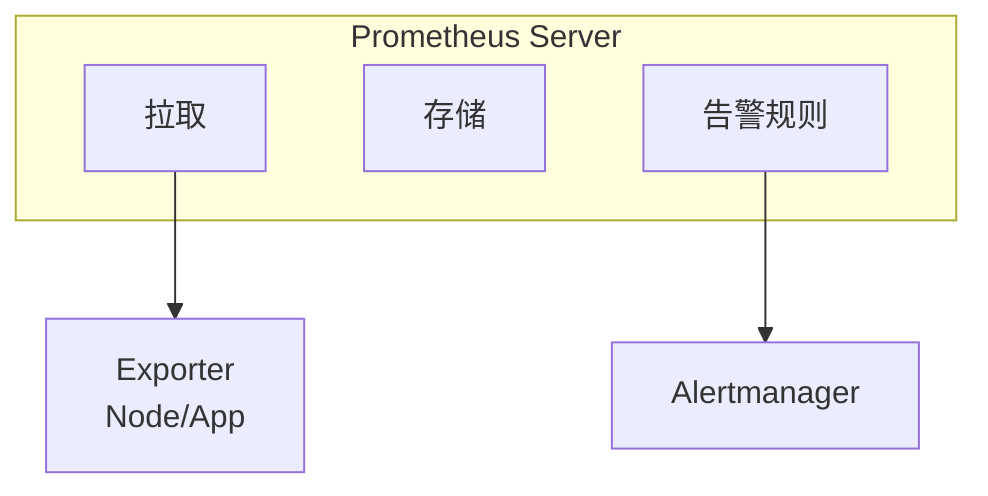
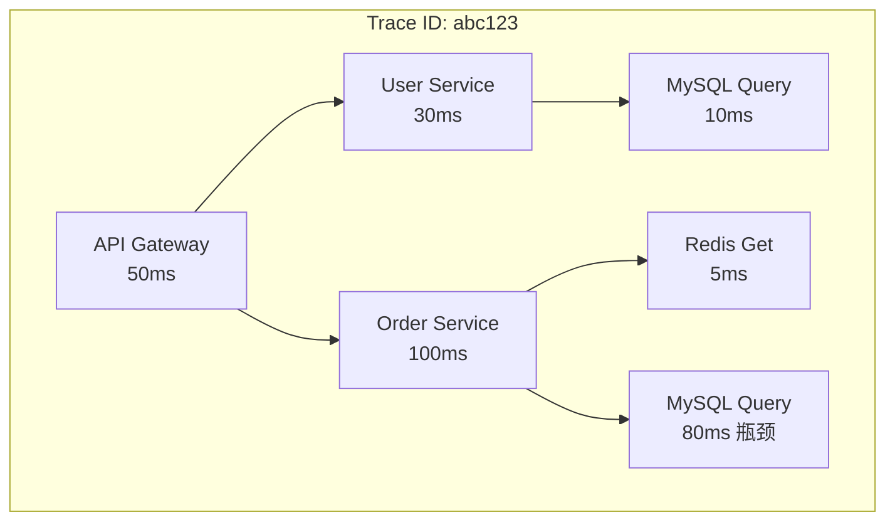

+++
title = "SRE面试题-监控与故障排查"
date = 2026-01-21
weight = 58000
description = "SRE面试必备：监控体系、告警设计、故障排查方法论、根因分析等核心问题详解"
[taxonomies]
tags = ["SRE", "面试", "监控", "告警", "故障排查", "Prometheus"]
+++

## 概述

监控和故障排查是SRE的核心技能。本文详细解答监控体系、告警设计、故障排查等高频面试问题。

---

# 一、监控体系

## 1.1 监控的核心指标有哪些？

**标准答案**：

```
四大黄金信号（Google SRE）：

1. 延迟（Latency）
   - 请求处理时间
   - 区分成功和失败请求
   - 关注P50、P90、P99

2. 流量（Traffic）
   - 请求量/QPS
   - 带宽使用
   - 活跃用户数

3. 错误（Errors）
   - 错误率
   - 错误类型分布
   - 5xx比例

4. 饱和度（Saturation）
   - 资源使用率
   - 队列长度
   - 可用容量

USE方法（系统资源）：

U - Utilization（使用率）
    CPU、内存、磁盘、网络

S - Saturation（饱和度）
    运行队列、等待时间

E - Errors（错误）
    硬件错误、驱动错误

RED方法（服务）：

R - Rate（请求率）
E - Errors（错误率）
D - Duration（延迟）
```

---

## 1.2 Prometheus架构和工作原理？

**标准答案**：

```
核心组件：

1. Prometheus Server
   - 时序数据库
   - 拉取指标数据
   - 存储和查询

2. Exporter
   - 暴露指标的组件
   - Node Exporter（主机）
   - MySQL Exporter（MySQL）
   - 应用内置指标

3. Pushgateway
   - 短生命周期任务推送指标
   - 批处理任务使用

4. Alertmanager
   - 告警管理
   - 去重、分组、路由
   - 多渠道通知

5. Grafana
   - 可视化面板
   - 仪表盘展示

工作原理：
1. Prometheus定期拉取target的指标
2. 存储到本地时序数据库
3. PromQL查询和告警规则评估
4. 触发告警发送到Alertmanager
5. Alertmanager处理后发送通知

**架构图**：



---

## 1.3 PromQL常用查询？

**标准答案**：

```promql
# 1. 瞬时向量
http_requests_total{job="api"}

# 2. 范围向量
http_requests_total[5m]

# 3. 聚合操作
sum(http_requests_total)
sum by (method) (http_requests_total)
sum without (instance) (http_requests_total)

# 4. 计算QPS
rate(http_requests_total[5m])
irate(http_requests_total[5m])  # 瞬时速率

# 5. 计算增量
increase(http_requests_total[1h])

# 6. 百分位数
histogram_quantile(0.99, 
  rate(http_request_duration_seconds_bucket[5m]))

# 7. 计算错误率
sum(rate(http_requests_total{status=~"5.."}[5m])) 
/ sum(rate(http_requests_total[5m]))

# 8. 预测
predict_linear(node_filesystem_free_bytes[1h], 4*3600)

# 9. 比较
http_requests_total > 1000

# 10. 标签匹配
http_requests_total{method=~"GET|POST"}
http_requests_total{status!="200"}

# rate vs irate：
# rate: 范围内平均速率，更平滑
# irate: 最后两个点计算，更敏感
```

---

## 1.4 日志监控方案？

**标准答案**：

```
ELK/EFK Stack：

E - Elasticsearch
    日志存储和搜索
    分布式搜索引擎

L/F - Logstash/Fluentd
    日志收集和处理
    Fluentd更轻量

K - Kibana
    日志可视化
    查询和分析

日志采集架构：

应用 → Filebeat → Kafka → Logstash → Elasticsearch → Kibana
         ↑
    轻量采集器

Loki方案（Grafana出品）：
- 只索引标签不索引内容
- 成本更低
- 与Grafana深度集成

日志规范：
1. 结构化日志（JSON格式）
2. 统一时间格式
3. 包含trace_id便于追踪
4. 分级别输出（ERROR/WARN/INFO/DEBUG）
5. 敏感信息脱敏

日志查询示例（Kibana KQL）：
level: ERROR AND service: "api-gateway"
message: "timeout" AND @timestamp >= now-1h
```

---

## 1.5 链路追踪的原理？

**标准答案**：

```
分布式追踪概念：

Trace：一次完整的请求链路
Span：一个服务调用单元
SpanContext：跨服务传递的上下文

工作原理：
1. 入口服务生成trace_id
2. 每个服务生成自己的span_id
3. 上下文通过HTTP Header传递
4. 各服务上报span到收集器
5. 收集器组装完整链路

常用方案：

1. Jaeger（CNCF项目）
   - Go语言实现
   - 支持OpenTracing
   - UI功能丰富

2. Zipkin（Twitter开源）
   - Java实现
   - 社区成熟

3. SkyWalking（Apache）
   - Java Agent无侵入
   - APM功能完整

4. OpenTelemetry（统一标准）
   - 统一Trace/Metrics/Logs
   - 厂商中立

**链路数据示例**：



---

# 二、告警设计

## 2.1 如何设计有效的告警？

**标准答案**：

```
告警设计原则：

1. 可操作性
   - 收到告警必须有明确的处理动作
   - 不需要处理的不应该告警

2. 紧急程度
   - P1：立即处理（影响核心业务）
   - P2：尽快处理（有一定影响）
   - P3：工作时间处理
   - P4：计划处理

3. 避免告警疲劳
   - 合理设置阈值
   - 避免抖动告警
   - 适当聚合告警

4. 告警分级
   - 按服务重要性
   - 按影响范围
   - 按紧急程度

告警规则示例（Prometheus）：

groups:
- name: api-alerts
  rules:
  # 错误率告警
  - alert: HighErrorRate
    expr: |
      sum(rate(http_requests_total{status=~"5.."}[5m])) 
      / sum(rate(http_requests_total[5m])) > 0.01
    for: 5m
    labels:
      severity: critical
    annotations:
      summary: "高错误率告警"
      description: "错误率超过1%，当前值: {{ $value }}"
  
  # 延迟告警
  - alert: HighLatency
    expr: |
      histogram_quantile(0.99, 
        rate(http_request_duration_seconds_bucket[5m])) > 1
    for: 5m
    labels:
      severity: warning
```

---

## 2.2 告警如何降噪？

**标准答案**：

```
告警降噪策略：

1. 合理设置for持续时间
   - 避免瞬时抖动触发告警
   - 根据场景设置5m/10m/15m

2. 告警聚合
   - 相同告警合并
   - Alertmanager的group_by

3. 告警抑制（Inhibition）
   - 高级别告警抑制低级别
   - 如：服务down抑制其Pod告警

4. 静默（Silence）
   - 维护窗口期静默
   - 已知问题临时静默

5. 阈值优化
   - 基于历史数据设置
   - 避免过于敏感

Alertmanager配置示例：

inhibit_rules:
  - source_match:
      severity: 'critical'
    target_match:
      severity: 'warning'
    equal: ['alertname', 'instance']

route:
  group_by: ['alertname', 'cluster']
  group_wait: 30s
  group_interval: 5m
  repeat_interval: 4h
```

---

## 2.3 SLO/SLI/SLA的区别？

**标准答案**：

```
SLI (Service Level Indicator)：
- 服务水平指标
- 量化的服务质量度量
- 例：可用性、延迟、错误率

SLO (Service Level Objective)：
- 服务水平目标
- SLI的目标值
- 内部承诺

SLA (Service Level Agreement)：
- 服务水平协议
- 与客户的合同
- 包含违约条款

关系：SLI是度量，SLO是目标，SLA是承诺

示例：
SLI: 请求成功率
SLO: 99.9%的请求成功（内部目标）
SLA: 99.5%的请求成功，违约赔偿10%（合同）

错误预算（Error Budget）：
- 允许的错误空间
- 100% - SLO = 错误预算
- 99.9% SLO → 0.1%错误预算
- 用于平衡可靠性和迭代速度

计算示例：
月度时间: 43200分钟
99.9% SLO → 允许宕机43.2分钟
99.99% SLO → 允许宕机4.32分钟
```

---

# 三、故障排查

## 3.1 故障排查的方法论？

**标准答案**：

```
排查原则：

1. 先止损后排查
   - 首要目标：恢复服务
   - 保留现场（日志、监控）
   - 然后再分析根因

2. 由外到内
   - 网络 → 负载均衡 → 应用 → 数据库
   - 逐层定位

3. 对比分析
   - 正常 vs 异常实例
   - 变更前 vs 变更后
   - 同比/环比

4. 二分法
   - 缩小问题范围
   - 排除法确认

排查步骤：

1. 确认问题
   - 什么时候开始？
   - 影响范围？
   - 有什么变更？

2. 收集信息
   - 监控指标
   - 日志
   - 告警

3. 形成假设
   - 根据现象推测原因

4. 验证假设
   - 收集证据
   - 排除或确认

5. 解决问题
   - 临时方案
   - 根本方案

6. 复盘总结
   - 时间线
   - 根因分析
   - 改进措施
```

---

## 3.2 常见故障场景和排查思路？

**标准答案**：

```
场景1：服务502/504

排查思路：
1. 502 → 后端不可用
   - 检查后端服务是否存活
   - 检查端口是否监听
   - 检查健康检查状态

2. 504 → 后端超时
   - 检查后端响应时间
   - 检查超时配置
   - 检查下游依赖

命令：
ss -tlnp | grep <port>
curl -v http://backend/health
tail -f /var/log/nginx/error.log


场景2：服务响应慢

排查思路：
1. 确定慢在哪一层
   - 网络延迟？
   - 应用处理？
   - 数据库查询？

2. 使用链路追踪定位
3. 检查资源使用（CPU/内存/IO）

命令：
curl -w "DNS: %{time_namelookup}s\nConnect: %{time_connect}s\nTotal: %{time_total}s\n" http://api/
top / htop
iostat -x 1


场景3：内存持续增长

排查思路：
1. 确认是哪个进程
2. 判断是否泄漏
3. 分析内存分布

命令：
ps aux --sort=-%mem | head
pidstat -r -p <PID> 5
jmap -histo <PID> | head  # Java


场景4：磁盘告警

排查思路：
1. 哪个目录占用大
2. 是否有未释放文件
3. inode是否耗尽

命令：
df -h
du -sh /* | sort -hr | head
lsof +L1
df -i
```

---

## 3.3 如何进行根因分析（RCA）？

**标准答案**：

```
5 Whys方法：

问题：网站无法访问

Why 1: 为什么无法访问？
→ Web服务器返回502

Why 2: 为什么返回502？
→ 后端应用无响应

Why 3: 为什么应用无响应？
→ 应用被OOM杀死

Why 4: 为什么被OOM杀死？
→ 内存泄漏导致内存耗尽

Why 5: 为什么内存泄漏？
→ 代码中连接未关闭

根因：代码bug导致连接泄漏


鱼骨图分析（6M）：

Man (人)：操作失误、培训不足
Machine (机器)：硬件故障、资源不足
Material (材料)：配置错误、依赖问题
Method (方法)：流程缺陷、设计问题
Measurement (测量)：监控缺失、告警不足
Mother Nature (环境)：网络问题、机房故障


事后复盘（Postmortem）内容：

1. 事件概述
   - 时间线
   - 影响范围

2. 根因分析
   - 直接原因
   - 根本原因

3. 处理过程
   - 检测时间
   - 响应时间
   - 恢复时间

4. 改进措施
   - 短期措施
   - 长期措施
   - 责任人和时间

5. 经验教训
   - 做得好的
   - 需要改进的
```

---

## 3.4 如何快速止损？

**标准答案**：

```
止损策略（按优先级）：

1. 回滚
   - 如果有变更，第一时间回滚
   - 代码回滚
   - 配置回滚
   - 数据库变更回滚

2. 重启
   - 快速恢复手段
   - 重启应用
   - 重启容器/Pod
   - 注意保留现场

3. 扩容
   - 资源不足时
   - 增加副本
   - 扩大规格

4. 降级
   - 关闭非核心功能
   - 返回缓存/默认值
   - 异步改同步

5. 限流
   - 保护核心系统
   - 拒绝过量请求

6. 切换
   - 主从切换
   - 多活切换
   - 灾备切换

原则：
- 先恢复，后排查
- 保留现场（日志、dump）
- 避免二次故障
- 同步状态到团队
```

---

## 3.5 On-Call如何做？

**标准答案**：

```
On-Call最佳实践：

1. 轮值制度
   - 周轮/双周轮
   - 主备双人
   - 明确交接

2. 升级机制
   - 响应时间要求
   - 升级路径清晰
   - P1: 5分钟响应
   - P2: 15分钟响应

3. 工具准备
   - VPN访问
   - 监控权限
   - 操作权限
   - 联系方式

4. 文档完善
   - Runbook（运维手册）
   - 常见问题处理
   - 联系人列表

5. 复盘机制
   - 每周On-Call总结
   - 问题改进跟进
   - 知识沉淀

On-Call交接内容：
- 当前进行中的问题
- 待跟进的事项
- 特殊注意事项
- 近期变更信息
```

---

# 四、性能分析

## 4.1 如何分析系统性能瓶颈？

**标准答案**：

```
性能分析三板斧：

1. 资源使用率
   top/htop：CPU、内存
   iostat：磁盘IO
   sar：综合资源
   vmstat：系统概览

2. 进程级分析
   pidstat：进程资源使用
   strace：系统调用
   ltrace：库函数调用

3. 深入分析
   perf：CPU性能分析
   pprof：Go性能分析
   JProfiler：Java性能分析

性能分析流程：

1. 确定目标
   - 延迟？吞吐量？
   - 当前值和目标值

2. 收集基准数据
   - 正常时的指标

3. 定位瓶颈
   - CPU密集？IO密集？
   - 哪个函数/SQL慢？

4. 优化验证
   - 改进措施
   - 对比测试

常用命令：
# CPU分析
perf top -p <PID>
perf record -g -p <PID> -- sleep 30
perf report

# 火焰图
perf script | stackcollapse-perf.pl | flamegraph.pl > flame.svg

# Go pprof
go tool pprof http://localhost:6060/debug/pprof/profile
```

---

## 4.2 如何排查高CPU？

**标准答案**：

```bash
# 1. 确认CPU使用情况
top -bn1 | head -20
mpstat -P ALL 1 5

# 2. 找出高CPU进程
ps aux --sort=-%cpu | head -10
pidstat -u 1 5

# 3. 分析进程

# Java进程
top -H -p <PID>  # 找出高CPU线程
printf "%x\n" <TID>  # 转16进制
jstack <PID> | grep -A 30 "nid=0x..."

# Go进程
go tool pprof http://localhost:6060/debug/pprof/profile

# 通用分析
perf top -p <PID>
perf record -g -p <PID> -- sleep 30
perf report

# 4. 常见原因
# - 死循环
# - 正则回溯
# - GC频繁
# - 序列化/反序列化
# - 加密/解密

# 5. 查看是用户态还是内核态
mpstat 1 5
# %usr高 → 应用代码问题
# %sys高 → 系统调用/内核问题
```

---

## 总结

### 高频考点速查

| 主题 | 核心概念 | 关键工具 |
|------|----------|----------|
| 监控指标 | 四大黄金信号/USE/RED | Prometheus |
| 日志 | 结构化/ELK | Kibana |
| 链路追踪 | Trace/Span | Jaeger/Zipkin |
| 告警 | 降噪/分级 | Alertmanager |
| SLO | 错误预算 | - |
| 故障排查 | 先止损后排查 | - |
| 根因分析 | 5Whys/鱼骨图 | - |
| 性能分析 | CPU/内存/IO | perf/pprof |

### 面试回答技巧

1. **讲方法论**：先说思路框架
2. **举实例**：结合实际经验
3. **说工具**：展示动手能力
4. **谈改进**：如何避免类似问题

### 常见追问

- "遇到过最难排查的问题？"
- "如何保证监控的有效性？"
- "如何减少MTTR？"
- "On-Call时遇到过什么问题？"

---

## 相关文章

- [上一篇：SRE面试题-数据库与缓存](@/articles/sre/sre-57-SRE面试题-数据库与缓存.md)
- [下一篇：SRE面试题-系统设计与架构](@/articles/sre/sre-59-SRE面试题-系统设计与架构.md)
