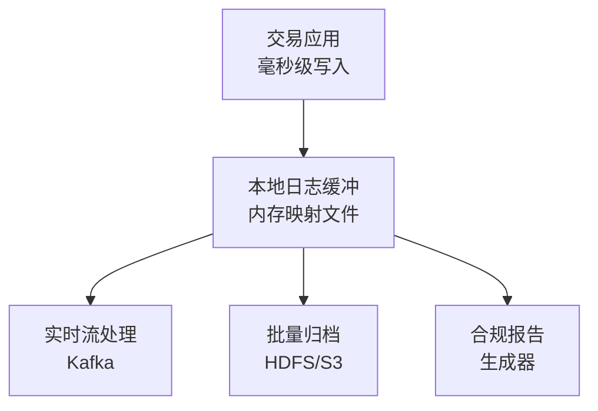

+++
title = "62. 金融系统合规与审计(HFT)"
description = "深入讲解HFT系统的合规要求：日志记录、数据保留、灾备要求、MiFID II、SEC规则与审计最佳实践"
date = 2026-01-21
weight = 62000
draft = false
[taxonomies]
tags = ["SRE", "HFT", "合规", "审计", "MiFID II"]
+++

# 金融系统合规与审计(HFT)

## 概述

高频交易系统必须满足严格的监管合规要求。从日志记录到数据保留，从灾备演练到监管报告，每个环节都需要精确设计。本文详细介绍HFT系统的合规要求与审计最佳实践。

## 一、全球主要监管框架

### 1.1 监管要求对比

| 监管框架 | 适用地区 | 核心要求 | HFT相关条款 |
|----------|----------|----------|-------------|
| MiFID II | 欧盟 | 透明度、投资者保护 | 算法交易注册、测试要求 |
| SEC Rule 15c3-5 | 美国 | 风控要求 | 交易前风控、资本要求 |
| Reg SCI | 美国 | 系统合规完整性 | 系统测试、业务连续性 |
| CAT | 美国 | 综合审计追踪 | 全链路订单追踪 |
| MAS | 新加坡 | 技术风险管理 | 系统弹性、变更管理 |
| CSRC | 中国 | 程序化交易管理 | 报备制度、风控要求 |

### 1.2 MiFID II关键要求

```yaml
# MiFID II 算法交易合规要求

algorithmic_trading_requirements:
  # 第17条 - 算法交易
  article_17:
    - description: "有效系统和风险控制"
      requirements:
        - 交易前风险控制
        - 价格和数量限制
        - 最大订单数限制
        - 自动熔断机制
    
    - description: "业务连续性"
      requirements:
        - 灾难恢复计划
        - 系统冗余
        - 定期测试
    
    - description: "算法测试"
      requirements:
        - 上线前测试
        - 压力测试
        - 回测验证
  
  # 记录保存要求
  record_keeping:
    retention_period: "5年"
    required_records:
      - 所有订单（包括取消的）
      - 时间戳精度要求：微秒级
      - 算法决策参数
      - 风控触发事件
    
  # 报告要求
  reporting:
    transaction_reporting:
      deadline: "T+1"
      fields: 65+
    order_record_keeping:
      granularity: "每笔订单"
      timestamp_precision: "微秒"
```

## 二、日志记录要求

### 2.1 审计日志架构



### 2.2 审计日志格式

```cpp
// 审计日志结构定义
#pragma pack(push, 1)
struct AuditLogEntry {
    // 时间戳 (纳秒精度)
    uint64_t timestamp_ns;          // 8 bytes
    
    // 事件标识
    uint32_t sequence_number;       // 4 bytes
    uint16_t event_type;            // 2 bytes
    uint16_t source_id;             // 2 bytes
    
    // 订单信息
    uint64_t order_id;              // 8 bytes
    uint64_t client_order_id;       // 8 bytes
    char symbol[16];                // 16 bytes
    
    // 价格和数量
    int64_t price;                  // 8 bytes (定点数)
    int64_t quantity;               // 8 bytes
    int64_t filled_quantity;        // 8 bytes
    
    // 状态
    uint8_t side;                   // 1 byte (0=buy, 1=sell)
    uint8_t order_type;             // 1 byte
    uint8_t order_status;           // 1 byte
    uint8_t flags;                  // 1 byte
    
    // 风控相关
    uint32_t risk_check_result;     // 4 bytes (位图)
    uint32_t latency_us;            // 4 bytes
    
    // 补齐到128字节
    char reserved[28];              // 28 bytes
};
#pragma pack(pop)

static_assert(sizeof(AuditLogEntry) == 128, "AuditLogEntry must be 128 bytes");

// 事件类型定义
enum class AuditEventType : uint16_t {
    ORDER_SUBMIT        = 0x0001,
    ORDER_ACCEPTED      = 0x0002,
    ORDER_REJECTED      = 0x0003,
    ORDER_CANCEL        = 0x0004,
    ORDER_CANCELLED     = 0x0005,
    ORDER_FILL          = 0x0006,
    ORDER_PARTIAL_FILL  = 0x0007,
    RISK_BREACH         = 0x0100,
    CIRCUIT_BREAKER     = 0x0101,
    SYSTEM_ERROR        = 0x0200,
    CONNECTIVITY_CHANGE = 0x0201,
};
```

### 2.3 高性能日志写入

```cpp
#include <sys/mman.h>
#include <fcntl.h>

class AuditLogger {
public:
    AuditLogger(const std::string& path, size_t file_size = 1ULL << 30) 
        : file_size_(file_size), write_pos_(0) {
        
        // 打开文件
        fd_ = open(path.c_str(), O_RDWR | O_CREAT | O_TRUNC, 0644);
        if (fd_ < 0) {
            throw std::runtime_error("Failed to open audit log");
        }
        
        // 预分配空间
        if (ftruncate(fd_, file_size_) < 0) {
            throw std::runtime_error("Failed to allocate space");
        }
        
        // 内存映射
        buffer_ = static_cast<char*>(mmap(
            nullptr, file_size_,
            PROT_READ | PROT_WRITE,
            MAP_SHARED, fd_, 0
        ));
        
        if (buffer_ == MAP_FAILED) {
            throw std::runtime_error("Failed to mmap");
        }
        
        // 预热页面
        for (size_t i = 0; i < file_size_; i += 4096) {
            buffer_[i] = 0;
        }
    }
    
    ~AuditLogger() {
        if (buffer_ != MAP_FAILED) {
            msync(buffer_, file_size_, MS_SYNC);
            munmap(buffer_, file_size_);
        }
        if (fd_ >= 0) {
            close(fd_);
        }
    }
    
    // 零拷贝写入 - 返回指向日志条目的指针
    AuditLogEntry* allocate() {
        size_t pos = write_pos_.fetch_add(sizeof(AuditLogEntry));
        if (pos + sizeof(AuditLogEntry) > file_size_) {
            // 文件已满，需要轮转
            rotate();
            pos = write_pos_.fetch_add(sizeof(AuditLogEntry));
        }
        return reinterpret_cast<AuditLogEntry*>(buffer_ + pos);
    }
    
    // 便捷写入方法
    void log(const AuditLogEntry& entry) {
        AuditLogEntry* slot = allocate();
        *slot = entry;
        // 使用 store-release 确保可见性
        std::atomic_thread_fence(std::memory_order_release);
    }
    
private:
    void rotate() {
        // 实现日志轮转
        msync(buffer_, file_size_, MS_ASYNC);
        // 创建新文件并重新映射
    }
    
    int fd_;
    char* buffer_;
    size_t file_size_;
    std::atomic<size_t> write_pos_;
};
```

## 三、数据保留策略

### 3.1 保留期限要求

| 数据类型 | MiFID II | SEC | 中国CSRC | 建议保留期 |
|----------|----------|-----|----------|------------|
| 订单记录 | 5年 | 6年 | 20年 | 20年 |
| 成交记录 | 5年 | 6年 | 20年 | 20年 |
| 通讯记录 | 5年 | 3年 | 5年 | 5年 |
| 风控日志 | 5年 | 6年 | 5年 | 7年 |
| 系统日志 | 无明确 | 无明确 | 无明确 | 3年 |

### 3.2 数据归档架构

```yaml
# 数据归档配置
data_archival:
  hot_storage:
    type: "NVMe SSD RAID"
    retention: "7 days"
    purpose: "实时查询、监管即时响应"
    format: "原始二进制"
  
  warm_storage:
    type: "SSD RAID"
    retention: "90 days"
    purpose: "近期查询、审计调查"
    format: "Parquet压缩"
  
  cold_storage:
    type: "HDFS/S3"
    retention: "7+ years"
    purpose: "长期合规保存"
    format: "Parquet + Snappy"
    replication: 3
  
  archive_storage:
    type: "Tape/Glacier"
    retention: "20+ years"
    purpose: "法规强制保存"
    format: "加密压缩"
```

### 3.3 数据完整性保证

```python
#!/usr/bin/env python3
"""审计数据完整性验证"""

import hashlib
import json
from datetime import datetime
from pathlib import Path
from dataclasses import dataclass
from typing import List

@dataclass
class IntegrityRecord:
    file_path: str
    file_size: int
    sha256_hash: str
    record_count: int
    first_timestamp: str
    last_timestamp: str
    created_at: str

class DataIntegrityManager:
    def __init__(self, manifest_path: str):
        self.manifest_path = Path(manifest_path)
        self.records: List[IntegrityRecord] = []
        self._load_manifest()
    
    def _load_manifest(self):
        if self.manifest_path.exists():
            with open(self.manifest_path) as f:
                data = json.load(f)
                self.records = [IntegrityRecord(**r) for r in data]
    
    def _save_manifest(self):
        with open(self.manifest_path, 'w') as f:
            json.dump([r.__dict__ for r in self.records], f, indent=2)
    
    def register_file(self, file_path: str, first_ts: str, last_ts: str, 
                      record_count: int):
        """注册新的归档文件"""
        path = Path(file_path)
        
        # 计算SHA256
        sha256 = hashlib.sha256()
        with open(path, 'rb') as f:
            for chunk in iter(lambda: f.read(8192), b''):
                sha256.update(chunk)
        
        record = IntegrityRecord(
            file_path=str(path.absolute()),
            file_size=path.stat().st_size,
            sha256_hash=sha256.hexdigest(),
            record_count=record_count,
            first_timestamp=first_ts,
            last_timestamp=last_ts,
            created_at=datetime.utcnow().isoformat()
        )
        
        self.records.append(record)
        self._save_manifest()
        
        return record
    
    def verify_file(self, file_path: str) -> bool:
        """验证文件完整性"""
        path = Path(file_path).absolute()
        
        # 查找记录
        record = None
        for r in self.records:
            if r.file_path == str(path):
                record = r
                break
        
        if not record:
            raise ValueError(f"No integrity record for {file_path}")
        
        # 验证大小
        if path.stat().st_size != record.file_size:
            return False
        
        # 验证哈希
        sha256 = hashlib.sha256()
        with open(path, 'rb') as f:
            for chunk in iter(lambda: f.read(8192), b''):
                sha256.update(chunk)
        
        return sha256.hexdigest() == record.sha256_hash
    
    def verify_all(self) -> dict:
        """验证所有归档文件"""
        results = {
            "total": len(self.records),
            "verified": 0,
            "failed": 0,
            "missing": 0,
            "details": []
        }
        
        for record in self.records:
            try:
                if not Path(record.file_path).exists():
                    results["missing"] += 1
                    results["details"].append({
                        "file": record.file_path,
                        "status": "missing"
                    })
                elif self.verify_file(record.file_path):
                    results["verified"] += 1
                else:
                    results["failed"] += 1
                    results["details"].append({
                        "file": record.file_path,
                        "status": "corrupted"
                    })
            except Exception as e:
                results["failed"] += 1
                results["details"].append({
                    "file": record.file_path,
                    "status": f"error: {e}"
                })
        
        return results
```

## 四、灾备要求

### 4.1 业务连续性计划 (BCP)

```yaml
# BCP要求（符合MiFID II第17条）

business_continuity_plan:
  objectives:
    rto: "4 hours"  # 恢复时间目标
    rpo: "0"        # 恢复点目标（零数据丢失）
  
  scenarios:
    - name: "数据中心故障"
      impact: "完全中断"
      recovery_strategy: "DR站点切换"
      expected_recovery: "< 30 minutes"
    
    - name: "网络连接故障"
      impact: "部分中断"
      recovery_strategy: "备用链路切换"
      expected_recovery: "< 5 minutes"
    
    - name: "交易系统故障"
      impact: "交易暂停"
      recovery_strategy: "热备切换"
      expected_recovery: "< 1 minute"
  
  testing_requirements:
    frequency: "至少每年一次"
    scope: "完整DR切换演练"
    documentation: "详细测试报告"
    regulatory_notification: "提前通知监管机构"
```

### 4.2 DR测试框架

```python
#!/usr/bin/env python3
"""DR演练自动化框架"""

import time
import logging
from dataclasses import dataclass
from enum import Enum
from typing import List, Callable
from datetime import datetime

class TestResult(Enum):
    PASSED = "passed"
    FAILED = "failed"
    SKIPPED = "skipped"

@dataclass
class DRTestCase:
    name: str
    description: str
    expected_rto_seconds: int
    test_func: Callable
    result: TestResult = TestResult.SKIPPED
    actual_time_seconds: float = 0
    notes: str = ""

class DRTestRunner:
    def __init__(self):
        self.test_cases: List[DRTestCase] = []
        self.logger = logging.getLogger(__name__)
    
    def add_test(self, test_case: DRTestCase):
        self.test_cases.append(test_case)
    
    def run_all_tests(self) -> dict:
        """执行所有DR测试"""
        results = {
            "start_time": datetime.utcnow().isoformat(),
            "tests": [],
            "summary": {
                "total": len(self.test_cases),
                "passed": 0,
                "failed": 0
            }
        }
        
        for test in self.test_cases:
            self.logger.info(f"执行测试: {test.name}")
            
            start_time = time.time()
            try:
                test.test_func()
                elapsed = time.time() - start_time
                
                if elapsed <= test.expected_rto_seconds:
                    test.result = TestResult.PASSED
                    results["summary"]["passed"] += 1
                else:
                    test.result = TestResult.FAILED
                    test.notes = f"超时: {elapsed:.1f}s > {test.expected_rto_seconds}s"
                    results["summary"]["failed"] += 1
                
                test.actual_time_seconds = elapsed
                
            except Exception as e:
                test.result = TestResult.FAILED
                test.actual_time_seconds = time.time() - start_time
                test.notes = str(e)
                results["summary"]["failed"] += 1
            
            results["tests"].append({
                "name": test.name,
                "result": test.result.value,
                "expected_rto": test.expected_rto_seconds,
                "actual_time": test.actual_time_seconds,
                "notes": test.notes
            })
        
        results["end_time"] = datetime.utcnow().isoformat()
        return results

# 示例测试用例
def test_database_failover():
    """测试数据库主备切换"""
    # 1. 触发主库故障
    # 2. 等待备库提升
    # 3. 验证应用重连
    # 4. 验证数据一致性
    pass

def test_network_failover():
    """测试网络链路切换"""
    # 1. 断开主链路
    # 2. 验证备用链路激活
    # 3. 验证交易连通性
    pass

def test_full_site_failover():
    """测试完整DR站点切换"""
    # 1. 模拟主站点故障
    # 2. 激活DR站点
    # 3. 验证所有服务
    # 4. 验证交易能力
    pass
```

## 五、监管报告

### 5.1 交易报告生成

```python
#!/usr/bin/env python3
"""MiFID II交易报告生成器"""

import csv
from dataclasses import dataclass
from datetime import datetime, date
from typing import List, Optional
from decimal import Decimal

@dataclass
class TransactionReport:
    """MiFID II Transaction Report (RTS 25)"""
    
    # 报告方信息
    reporting_entity_id: str
    submitting_entity_id: str
    
    # 交易信息
    transaction_reference: str
    trading_venue_transaction_id: str
    execution_datetime: datetime
    
    # 标的信息
    instrument_id: str  # ISIN
    instrument_full_name: str
    instrument_classification: str
    
    # 数量和价格
    quantity: Decimal
    quantity_currency: str
    price: Decimal
    price_currency: str
    net_amount: Decimal
    
    # 买卖方信息
    buyer_decision_maker: str
    seller_decision_maker: str
    
    # 交易类型
    trading_capacity: str  # DEAL, MTCH, AOTC
    buy_sell_indicator: str  # BUYI, SELL
    
    # 算法交易标识
    short_selling_indicator: str
    waiver_indicator: str
    otc_post_trade_indicator: str

class MiFIDReportGenerator:
    def __init__(self, entity_id: str):
        self.entity_id = entity_id
    
    def generate_daily_report(self, trade_date: date, 
                               trades: List[dict]) -> str:
        """生成每日交易报告"""
        reports = []
        
        for trade in trades:
            report = TransactionReport(
                reporting_entity_id=self.entity_id,
                submitting_entity_id=self.entity_id,
                transaction_reference=trade['order_id'],
                trading_venue_transaction_id=trade['exchange_order_id'],
                execution_datetime=trade['execution_time'],
                instrument_id=trade['isin'],
                instrument_full_name=trade['instrument_name'],
                instrument_classification=trade['cfi_code'],
                quantity=Decimal(str(trade['quantity'])),
                quantity_currency=trade['currency'],
                price=Decimal(str(trade['price'])),
                price_currency=trade['currency'],
                net_amount=Decimal(str(trade['quantity'] * trade['price'])),
                buyer_decision_maker=trade.get('buyer_lei', ''),
                seller_decision_maker=trade.get('seller_lei', ''),
                trading_capacity='DEAL',
                buy_sell_indicator='BUYI' if trade['side'] == 'buy' else 'SELL',
                short_selling_indicator='SESH' if trade.get('short_sale') else 'SELL',
                waiver_indicator='',
                otc_post_trade_indicator=''
            )
            reports.append(report)
        
        return self._format_xml(reports)
    
    def _format_xml(self, reports: List[TransactionReport]) -> str:
        """格式化为XML报告"""
        # 实际实现应使用proper XML库
        xml_parts = ['<?xml version="1.0" encoding="UTF-8"?>']
        xml_parts.append('<TradingReport>')
        
        for report in reports:
            xml_parts.append(f'''
  <Transaction>
    <ReportingEntityId>{report.reporting_entity_id}</ReportingEntityId>
    <TransactionRef>{report.transaction_reference}</TransactionRef>
    <ExecutionDateTime>{report.execution_datetime.isoformat()}</ExecutionDateTime>
    <InstrumentId>{report.instrument_id}</InstrumentId>
    <Quantity>{report.quantity}</Quantity>
    <Price>{report.price}</Price>
    <BuySellIndicator>{report.buy_sell_indicator}</BuySellIndicator>
  </Transaction>''')
        
        xml_parts.append('</TradingReport>')
        return '\n'.join(xml_parts)
```

### 5.2 CAT报告 (美国)

```python
#!/usr/bin/env python3
"""CAT (Consolidated Audit Trail) 报告生成"""

from dataclasses import dataclass
from datetime import datetime
from typing import Optional
from enum import Enum

class CATEventType(Enum):
    MEOR = "MEOR"  # New Order
    MEOC = "MEOC"  # Order Cancel
    MEOM = "MEOM"  # Order Modify
    MEOF = "MEOF"  # Order Fulfillment

@dataclass
class CATOrderEvent:
    """CAT订单事件记录"""
    
    # 事件标识
    event_timestamp: datetime
    event_type: CATEventType
    cat_reporter_imid: str
    
    # 订单标识
    order_id: str
    symbol: str
    
    # 订单详情
    side: str  # B=Buy, S=Sell, SS=Short Sell
    price: Optional[float]
    quantity: int
    order_type: str  # MKT, LMT, etc.
    time_in_force: str  # DAY, GTC, IOC, etc.
    
    # 路由信息
    sender_imid: str
    destination: str
    
    # 时间戳精度要求：至少毫秒
    manual_flag: bool = False
    
    def to_cat_format(self) -> dict:
        """转换为CAT提交格式"""
        return {
            "eventTimestamp": self.event_timestamp.strftime("%Y-%m-%dT%H:%M:%S.%f")[:-3],
            "catReporterIMID": self.cat_reporter_imid,
            "type": self.event_type.value,
            "orderID": self.order_id,
            "symbol": self.symbol,
            "side": self.side,
            "price": self.price,
            "quantity": self.quantity,
            "orderType": self.order_type,
            "timeInForce": self.time_in_force,
            "senderIMID": self.sender_imid,
            "destination": self.destination,
            "manualFlag": self.manual_flag
        }
```

## 六、审计最佳实践

### 6.1 审计检查清单

```yaml
# 年度合规审计检查清单

audit_checklist:
  documentation:
    - item: "算法交易系统设计文档"
      status: "required"
      review_frequency: "annual"
    
    - item: "风险控制程序文档"
      status: "required"
      review_frequency: "annual"
    
    - item: "业务连续性计划"
      status: "required"
      review_frequency: "annual"
    
    - item: "变更管理流程"
      status: "required"
      review_frequency: "annual"
  
  system_controls:
    - item: "交易前风险检查"
      evidence: "系统日志、配置截图"
      test_method: "抽样测试"
    
    - item: "价格/数量限制"
      evidence: "配置文件、拒单日志"
      test_method: "模拟异常订单"
    
    - item: "熔断机制"
      evidence: "熔断触发日志"
      test_method: "熔断演练"
    
    - item: "Kill Switch"
      evidence: "测试记录"
      test_method: "季度测试"
  
  data_integrity:
    - item: "日志完整性"
      evidence: "哈希验证报告"
      test_method: "抽样验证"
    
    - item: "时间戳准确性"
      evidence: "PTP同步报告"
      test_method: "交叉验证"
    
    - item: "数据保留合规"
      evidence: "归档清单"
      test_method: "抽样恢复测试"
  
  operational:
    - item: "权限管理"
      evidence: "访问日志"
      test_method: "权限审查"
    
    - item: "变更记录"
      evidence: "变更日志"
      test_method: "抽样审查"
    
    - item: "事件响应"
      evidence: "事件报告"
      test_method: "案例审查"
```

### 6.2 自动化合规监控

```python
#!/usr/bin/env python3
"""自动化合规监控系统"""

import time
from dataclasses import dataclass
from datetime import datetime, timedelta
from typing import List, Dict
from enum import Enum

class ComplianceStatus(Enum):
    COMPLIANT = "compliant"
    WARNING = "warning"
    VIOLATION = "violation"

@dataclass
class ComplianceCheck:
    name: str
    description: str
    check_func: callable
    frequency_minutes: int
    last_check: datetime = None
    status: ComplianceStatus = ComplianceStatus.COMPLIANT
    message: str = ""

class ComplianceMonitor:
    def __init__(self):
        self.checks: List[ComplianceCheck] = []
        self.violations: List[Dict] = []
    
    def register_check(self, check: ComplianceCheck):
        self.checks.append(check)
    
    def run_checks(self):
        """运行所有合规检查"""
        now = datetime.utcnow()
        
        for check in self.checks:
            # 检查是否需要运行
            if check.last_check and \
               (now - check.last_check).seconds < check.frequency_minutes * 60:
                continue
            
            try:
                status, message = check.check_func()
                check.status = status
                check.message = message
                check.last_check = now
                
                if status == ComplianceStatus.VIOLATION:
                    self._record_violation(check)
                    
            except Exception as e:
                check.status = ComplianceStatus.WARNING
                check.message = f"检查失败: {e}"
    
    def _record_violation(self, check: ComplianceCheck):
        """记录违规事件"""
        violation = {
            "timestamp": datetime.utcnow().isoformat(),
            "check_name": check.name,
            "message": check.message,
            "reported": False
        }
        self.violations.append(violation)
        
        # 触发告警
        self._send_alert(violation)
    
    def _send_alert(self, violation: Dict):
        """发送合规告警"""
        # 实际实现应发送邮件/短信/Slack等
        print(f"[COMPLIANCE ALERT] {violation['check_name']}: {violation['message']}")
    
    def get_status_report(self) -> Dict:
        """生成合规状态报告"""
        return {
            "timestamp": datetime.utcnow().isoformat(),
            "overall_status": self._get_overall_status(),
            "checks": [
                {
                    "name": c.name,
                    "status": c.status.value,
                    "last_check": c.last_check.isoformat() if c.last_check else None,
                    "message": c.message
                }
                for c in self.checks
            ],
            "recent_violations": self.violations[-10:]
        }
    
    def _get_overall_status(self) -> str:
        if any(c.status == ComplianceStatus.VIOLATION for c in self.checks):
            return "violation"
        if any(c.status == ComplianceStatus.WARNING for c in self.checks):
            return "warning"
        return "compliant"

# 示例合规检查函数
def check_order_limit() -> tuple:
    """检查订单限额是否生效"""
    # 实际实现查询风控系统
    max_order_value = 10_000_000  # 最大订单金额
    # 检查最近订单是否有超限
    return ComplianceStatus.COMPLIANT, "订单限额检查通过"

def check_kill_switch() -> tuple:
    """检查Kill Switch是否可用"""
    # 实际实现应测试kill switch功能
    return ComplianceStatus.COMPLIANT, "Kill Switch功能正常"

def check_time_sync() -> tuple:
    """检查时间同步精度"""
    # 实际实现查询PTP状态
    offset_ns = 50  # 假设偏移50ns
    if abs(offset_ns) > 1000:  # 超过1µs
        return ComplianceStatus.VIOLATION, f"时间偏移过大: {offset_ns}ns"
    if abs(offset_ns) > 500:
        return ComplianceStatus.WARNING, f"时间偏移警告: {offset_ns}ns"
    return ComplianceStatus.COMPLIANT, f"时间同步正常: {offset_ns}ns"

def check_audit_log_integrity() -> tuple:
    """检查审计日志完整性"""
    # 实际实现验证日志哈希
    return ComplianceStatus.COMPLIANT, "审计日志完整性验证通过"
```

## 总结

金融系统合规的核心要点：

1. **全面记录**：所有订单和交易必须有完整的审计追踪
2. **精确时间**：时间戳精度满足监管要求（通常微秒级）
3. **长期保存**：按监管要求保留数据，确保可追溯
4. **完整性保证**：使用加密哈希确保数据未被篡改
5. **自动化监控**：持续监控合规状态，及时发现违规
6. **定期演练**：DR和合规程序需要定期测试验证

合规不仅是监管要求，更是保护公司和客户利益的重要保障。

---

## 相关文章

- [上一篇：HFT基础设施最佳实践(HFT)](@/articles/sre/sre-61-HFT基础设施最佳实践.md)
- [下一篇：交易系统故障演练(HFT)](@/articles/sre/sre-63-交易系统故障演练.md)
