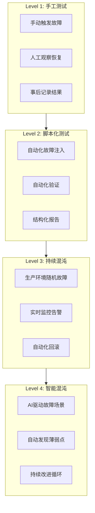

+++
title = "63. 交易系统故障演练(HFT)"
description = "深入讲解HFT系统故障演练方法：混沌工程、故障注入、市场异常模拟、DR切换演练与最佳实践"
date = 2026-01-21
weight = 63000
draft = false
[taxonomies]
tags = ["SRE", "HFT", "混沌工程", "故障演练", "容灾"]
+++

# 交易系统故障演练(HFT)

## 概述

"未经测试的恢复计划不是计划，而是希望。"在高频交易环境中，故障演练是验证系统韧性的关键手段。本文详细介绍HFT系统故障演练的方法论与实践技巧。

## 一、故障演练框架

### 1.1 演练类型

| 演练类型 | 影响范围 | 频率 | 目的 |
|----------|----------|------|------|
| 桌面演练 | 无实际影响 | 月度 | 流程验证 |
| 组件测试 | 单个组件 | 周度 | 功能验证 |
| 集成测试 | 子系统 | 月度 | 交互验证 |
| 全链路演练 | 生产环境 | 季度 | 端到端验证 |
| DR切换 | 跨站点 | 半年 | 灾备验证 |

### 1.2 演练成熟度模型



## 二、混沌工程实践

### 2.1 混沌工程原则

```yaml
# 混沌工程原则在HFT中的应用

principles:
  1_steady_state:
    description: "定义稳态指标"
    hft_metrics:
      - "P99延迟 < 100µs"
      - "订单成功率 > 99.99%"
      - "Market Data无丢包"
      - "风控响应时间 < 1ms"
  
  2_hypothesis:
    description: "建立假设"
    example: "当主交易服务器CPU达到90%时，系统仍能保持P99延迟<200µs"
  
  3_real_world:
    description: "模拟真实事件"
    scenarios:
      - "网络分区"
      - "交易所断连"
      - "Market Data延迟突增"
      - "硬件故障"
  
  4_production:
    description: "在生产环境运行"
    safeguards:
      - "交易时段外执行"
      - "小规模开始"
      - "快速回滚机制"
  
  5_minimize_blast:
    description: "最小化影响范围"
    controls:
      - "隔离测试环境"
      - "限流保护"
      - "自动终止条件"
```

### 2.2 故障注入框架

```python
#!/usr/bin/env python3
"""HFT故障注入框架"""

import time
import random
import threading
import subprocess
from dataclasses import dataclass
from typing import List, Callable, Optional
from enum import Enum
from abc import ABC, abstractmethod

class FaultType(Enum):
    NETWORK_DELAY = "network_delay"
    NETWORK_PARTITION = "network_partition"
    CPU_STRESS = "cpu_stress"
    MEMORY_PRESSURE = "memory_pressure"
    DISK_SLOW = "disk_slow"
    PROCESS_KILL = "process_kill"
    CLOCK_SKEW = "clock_skew"

@dataclass
class FaultConfig:
    fault_type: FaultType
    target: str
    duration_seconds: int
    parameters: dict
    
class FaultInjector(ABC):
    @abstractmethod
    def inject(self, config: FaultConfig) -> bool:
        pass
    
    @abstractmethod
    def recover(self, config: FaultConfig) -> bool:
        pass

class NetworkDelayInjector(FaultInjector):
    """网络延迟注入器"""
    
    def inject(self, config: FaultConfig) -> bool:
        interface = config.target
        delay_ms = config.parameters.get("delay_ms", 10)
        jitter_ms = config.parameters.get("jitter_ms", 5)
        
        cmd = f"tc qdisc add dev {interface} root netem delay {delay_ms}ms {jitter_ms}ms"
        result = subprocess.run(cmd.split(), capture_output=True)
        return result.returncode == 0
    
    def recover(self, config: FaultConfig) -> bool:
        interface = config.target
        cmd = f"tc qdisc del dev {interface} root"
        result = subprocess.run(cmd.split(), capture_output=True)
        return result.returncode == 0

class NetworkPartitionInjector(FaultInjector):
    """网络分区注入器"""
    
    def inject(self, config: FaultConfig) -> bool:
        target_ip = config.target
        # 阻止到目标IP的流量
        cmd = f"iptables -A OUTPUT -d {target_ip} -j DROP"
        result = subprocess.run(cmd.split(), capture_output=True)
        return result.returncode == 0
    
    def recover(self, config: FaultConfig) -> bool:
        target_ip = config.target
        cmd = f"iptables -D OUTPUT -d {target_ip} -j DROP"
        result = subprocess.run(cmd.split(), capture_output=True)
        return result.returncode == 0

class CPUStressInjector(FaultInjector):
    """CPU压力注入器"""
    
    def __init__(self):
        self.stress_process = None
    
    def inject(self, config: FaultConfig) -> bool:
        cores = config.parameters.get("cores", 1)
        # 使用stress-ng工具
        cmd = f"stress-ng --cpu {cores} --timeout {config.duration_seconds}s"
        self.stress_process = subprocess.Popen(cmd.split())
        return True
    
    def recover(self, config: FaultConfig) -> bool:
        if self.stress_process:
            self.stress_process.terminate()
            self.stress_process.wait()
        return True

class ProcessKillInjector(FaultInjector):
    """进程杀死注入器"""
    
    def inject(self, config: FaultConfig) -> bool:
        process_name = config.target
        signal = config.parameters.get("signal", "SIGKILL")
        cmd = f"pkill -{signal} {process_name}"
        result = subprocess.run(cmd.split(), capture_output=True)
        return result.returncode == 0
    
    def recover(self, config: FaultConfig) -> bool:
        # 进程恢复通常由supervisor/systemd处理
        return True

class ChaosEngine:
    """混沌工程引擎"""
    
    def __init__(self):
        self.injectors = {
            FaultType.NETWORK_DELAY: NetworkDelayInjector(),
            FaultType.NETWORK_PARTITION: NetworkPartitionInjector(),
            FaultType.CPU_STRESS: CPUStressInjector(),
            FaultType.PROCESS_KILL: ProcessKillInjector(),
        }
        self.active_faults: List[FaultConfig] = []
        self.steady_state_validators: List[Callable] = []
    
    def register_validator(self, validator: Callable[[], bool]):
        """注册稳态验证器"""
        self.steady_state_validators.append(validator)
    
    def check_steady_state(self) -> bool:
        """验证系统是否处于稳态"""
        return all(v() for v in self.steady_state_validators)
    
    def run_experiment(self, config: FaultConfig) -> dict:
        """运行混沌实验"""
        result = {
            "config": config,
            "start_time": time.time(),
            "injection_success": False,
            "steady_state_maintained": False,
            "recovery_success": False,
            "recovery_time_seconds": 0,
        }
        
        # 1. 验证初始稳态
        if not self.check_steady_state():
            result["error"] = "系统未处于稳态，取消实验"
            return result
        
        # 2. 注入故障
        injector = self.injectors.get(config.fault_type)
        if not injector:
            result["error"] = f"未知故障类型: {config.fault_type}"
            return result
        
        result["injection_success"] = injector.inject(config)
        if not result["injection_success"]:
            result["error"] = "故障注入失败"
            return result
        
        self.active_faults.append(config)
        
        # 3. 监控稳态
        steady_state_checks = []
        check_interval = 1  # 每秒检查一次
        for _ in range(config.duration_seconds):
            time.sleep(check_interval)
            steady_state_checks.append(self.check_steady_state())
        
        result["steady_state_maintained"] = all(steady_state_checks)
        
        # 4. 恢复
        recovery_start = time.time()
        result["recovery_success"] = injector.recover(config)
        self.active_faults.remove(config)
        
        # 5. 等待恢复并测量时间
        max_recovery_wait = 60  # 最大等待60秒
        for _ in range(max_recovery_wait):
            if self.check_steady_state():
                break
            time.sleep(1)
        
        result["recovery_time_seconds"] = time.time() - recovery_start
        result["end_time"] = time.time()
        
        return result
    
    def emergency_recover(self):
        """紧急恢复所有故障"""
        for config in self.active_faults[:]:
            injector = self.injectors.get(config.fault_type)
            if injector:
                injector.recover(config)
            self.active_faults.remove(config)
```

### 2.3 HFT特定故障场景

```python
#!/usr/bin/env python3
"""HFT特定故障场景定义"""

from dataclasses import dataclass
from typing import List

@dataclass
class HFTFaultScenario:
    name: str
    description: str
    faults: List[dict]
    expected_behavior: str
    success_criteria: List[str]

# 预定义HFT故障场景
HFT_SCENARIOS = [
    HFTFaultScenario(
        name="交易所连接中断",
        description="模拟与交易所的网络连接中断",
        faults=[
            {
                "type": "network_partition",
                "target": "exchange_gateway_ip",
                "duration": 30,
            }
        ],
        expected_behavior="系统应自动重连，未确认订单应正确处理",
        success_criteria=[
            "风控系统触发连接断开告警",
            "订单状态正确标记为未知",
            "重连后状态同步完成",
            "无重复订单发送",
        ]
    ),
    
    HFTFaultScenario(
        name="Market Data延迟",
        description="模拟Market Data源出现延迟",
        faults=[
            {
                "type": "network_delay",
                "target": "eth0",
                "duration": 60,
                "parameters": {"delay_ms": 50, "jitter_ms": 20}
            }
        ],
        expected_behavior="策略应检测到数据陈旧并暂停交易",
        success_criteria=[
            "陈旧数据检测告警触发",
            "策略自动暂停",
            "延迟恢复后策略自动恢复",
        ]
    ),
    
    HFTFaultScenario(
        name="主交易服务器故障",
        description="模拟主交易服务器进程崩溃",
        faults=[
            {
                "type": "process_kill",
                "target": "trading_engine",
                "parameters": {"signal": "SIGKILL"}
            }
        ],
        expected_behavior="备用服务器应在1秒内接管",
        success_criteria=[
            "故障检测时间<100ms",
            "备服务器激活时间<1s",
            "持仓状态正确同步",
            "无订单丢失",
        ]
    ),
    
    HFTFaultScenario(
        name="风控系统过载",
        description="模拟风控系统CPU饱和",
        faults=[
            {
                "type": "cpu_stress",
                "target": "risk_server",
                "duration": 30,
                "parameters": {"cores": 8}
            }
        ],
        expected_behavior="交易应降级或暂停，不能绕过风控",
        success_criteria=[
            "风控响应时间超限告警",
            "交易暂停或使用缓存限额",
            "绝不允许绕过风控发单",
        ]
    ),
    
    HFTFaultScenario(
        name="时钟漂移",
        description="模拟服务器时钟与PTP失同步",
        faults=[
            {
                "type": "clock_skew",
                "target": "trading_server",
                "duration": 60,
                "parameters": {"offset_ms": 100}
            }
        ],
        expected_behavior="系统应检测到时钟异常并告警",
        success_criteria=[
            "PTP同步告警触发",
            "时间戳标记为可疑",
            "可选：暂停交易直到时钟恢复",
        ]
    ),
]
```

## 三、市场异常模拟

### 3.1 市场事件模拟器

```python
#!/usr/bin/env python3
"""市场异常事件模拟器"""

import time
import random
from dataclasses import dataclass
from typing import List, Callable
from enum import Enum

class MarketEventType(Enum):
    FLASH_CRASH = "flash_crash"
    PRICE_SPIKE = "price_spike"
    LIQUIDITY_DROUGHT = "liquidity_drought"
    ORDER_BOOK_SWEEP = "order_book_sweep"
    TRADING_HALT = "trading_halt"
    HIGH_VOLATILITY = "high_volatility"

@dataclass
class MarketEvent:
    event_type: MarketEventType
    symbol: str
    duration_seconds: int
    parameters: dict

class MarketSimulator:
    """市场异常模拟器"""
    
    def __init__(self, market_data_feed):
        self.feed = market_data_feed
        self.original_prices = {}
    
    def simulate_flash_crash(self, symbol: str, drop_percent: float, 
                            duration_seconds: int):
        """模拟闪崩"""
        original_price = self.feed.get_price(symbol)
        self.original_prices[symbol] = original_price
        
        # 快速下跌
        crash_price = original_price * (1 - drop_percent / 100)
        
        # 阶段1：快速下跌（20%时间）
        crash_duration = duration_seconds * 0.2
        steps = 10
        for i in range(steps):
            intermediate_price = original_price - (original_price - crash_price) * (i + 1) / steps
            self.feed.inject_price(symbol, intermediate_price)
            time.sleep(crash_duration / steps)
        
        # 阶段2：底部震荡（30%时间）
        bottom_duration = duration_seconds * 0.3
        end_time = time.time() + bottom_duration
        while time.time() < end_time:
            noise = random.uniform(-0.02, 0.02)
            self.feed.inject_price(symbol, crash_price * (1 + noise))
            time.sleep(0.1)
        
        # 阶段3：恢复（50%时间）
        recovery_duration = duration_seconds * 0.5
        recovery_steps = 20
        for i in range(recovery_steps):
            intermediate_price = crash_price + (original_price - crash_price) * (i + 1) / recovery_steps
            self.feed.inject_price(symbol, intermediate_price)
            time.sleep(recovery_duration / recovery_steps)
        
        # 恢复原价
        self.feed.inject_price(symbol, original_price)
    
    def simulate_liquidity_drought(self, symbol: str, duration_seconds: int):
        """模拟流动性枯竭"""
        # 减少订单簿深度
        original_depth = self.feed.get_order_book_depth(symbol)
        
        # 逐步减少深度
        for pct in [0.5, 0.2, 0.1, 0.05]:
            self.feed.set_order_book_depth(symbol, int(original_depth * pct))
            time.sleep(duration_seconds * 0.2)
        
        # 保持低流动性
        time.sleep(duration_seconds * 0.2)
        
        # 恢复
        self.feed.set_order_book_depth(symbol, original_depth)
    
    def simulate_trading_halt(self, symbol: str, duration_seconds: int):
        """模拟交易暂停"""
        # 发送交易暂停消息
        self.feed.inject_trading_status(symbol, "HALTED", reason="CIRCUIT_BREAKER")
        
        # 等待
        time.sleep(duration_seconds)
        
        # 恢复交易
        self.feed.inject_trading_status(symbol, "TRADING", reason="RESUMED")
    
    def simulate_price_spike(self, symbol: str, spike_percent: float,
                            duration_seconds: int):
        """模拟价格突刺"""
        original_price = self.feed.get_price(symbol)
        spike_price = original_price * (1 + spike_percent / 100)
        
        # 瞬间上涨
        self.feed.inject_price(symbol, spike_price)
        
        # 保持
        time.sleep(duration_seconds * 0.3)
        
        # 快速回落
        steps = 5
        for i in range(steps):
            price = spike_price - (spike_price - original_price) * (i + 1) / steps
            self.feed.inject_price(symbol, price)
            time.sleep(duration_seconds * 0.7 / steps)
```

### 3.2 策略响应验证

```python
#!/usr/bin/env python3
"""策略对市场异常的响应验证"""

from dataclasses import dataclass
from typing import List, Dict
import time

@dataclass
class StrategyResponse:
    event_type: str
    response_time_ms: float
    actions_taken: List[str]
    position_change: float
    pnl_impact: float

class StrategyValidator:
    """策略响应验证器"""
    
    def __init__(self, strategy, risk_manager):
        self.strategy = strategy
        self.risk_manager = risk_manager
        self.responses: List[StrategyResponse] = []
    
    def validate_flash_crash_response(self, symbol: str) -> Dict:
        """验证闪崩响应"""
        checks = {
            "position_reduced": False,
            "new_orders_stopped": False,
            "risk_limits_checked": False,
            "recovery_proper": False,
        }
        
        # 记录初始状态
        initial_position = self.strategy.get_position(symbol)
        initial_orders = self.strategy.get_open_orders(symbol)
        
        # 模拟闪崩期间的检查
        # 检查1：是否停止新订单
        checks["new_orders_stopped"] = len(self.strategy.get_open_orders(symbol)) <= len(initial_orders)
        
        # 检查2：是否降低仓位
        current_position = self.strategy.get_position(symbol)
        checks["position_reduced"] = abs(current_position) <= abs(initial_position)
        
        # 检查3：风控是否触发
        checks["risk_limits_checked"] = self.risk_manager.was_triggered(symbol)
        
        # 检查4：恢复后是否正常
        time.sleep(5)  # 等待恢复
        checks["recovery_proper"] = self.strategy.is_healthy()
        
        return checks
    
    def validate_halt_response(self, symbol: str) -> Dict:
        """验证交易暂停响应"""
        checks = {
            "orders_cancelled": False,
            "no_new_orders": False,
            "state_preserved": False,
            "resume_proper": False,
        }
        
        # 暂停期间检查
        open_orders = self.strategy.get_open_orders(symbol)
        checks["orders_cancelled"] = len(open_orders) == 0
        
        # 尝试下单应被拒绝
        try:
            self.strategy.submit_order(symbol, "BUY", 100, 100.0)
            checks["no_new_orders"] = False
        except:
            checks["no_new_orders"] = True
        
        return checks
    
    def run_all_validations(self, market_simulator) -> Dict:
        """运行所有验证"""
        results = {}
        
        # 闪崩验证
        market_simulator.simulate_flash_crash("AAPL", drop_percent=5, duration_seconds=10)
        results["flash_crash"] = self.validate_flash_crash_response("AAPL")
        
        # 暂停验证
        market_simulator.simulate_trading_halt("AAPL", duration_seconds=5)
        results["trading_halt"] = self.validate_halt_response("AAPL")
        
        return results
```

## 四、DR切换演练

### 4.1 DR演练流程

```yaml
# DR切换演练标准流程

dr_drill_procedure:
  preparation:
    t_minus_1_week:
      - 通知所有相关方
      - 确认DR站点就绪状态
      - 更新联系人列表
      - 准备回滚计划
    
    t_minus_1_day:
      - 最终状态检查
      - 确认复制延迟<1秒
      - 验证监控告警
      - 通知交易所（如需要）
    
    t_minus_1_hour:
      - 团队集合
      - 最终Go/No-Go决策
      - 开启录屏记录
  
  execution:
    phase_1_preparation:
      duration: "10分钟"
      steps:
        - 确认主站点当前状态
        - 确认DR站点复制同步
        - 准备切换脚本
    
    phase_2_failover:
      duration: "5分钟"
      steps:
        - 停止主站点服务
        - 等待最后复制完成
        - 提升DR站点
        - 更新DNS/路由
    
    phase_3_validation:
      duration: "15分钟"
      steps:
        - 验证服务可用性
        - 验证数据一致性
        - 执行测试交易
        - 确认监控正常
    
    phase_4_steady_state:
      duration: "30分钟"
      steps:
        - 监控系统运行
        - 检查延迟指标
        - 验证告警正常
  
  rollback:
    trigger_conditions:
      - DR站点无法启动
      - 数据不一致
      - 性能严重降级
    
    procedure:
      - 立即停止DR站点服务
      - 恢复主站点服务
      - 验证数据状态
      - 事后分析
```

### 4.2 DR演练自动化

```python
#!/usr/bin/env python3
"""DR切换演练自动化"""

import time
import logging
from dataclasses import dataclass
from enum import Enum
from typing import List, Callable, Optional

class DrillPhase(Enum):
    PREPARATION = "preparation"
    FAILOVER = "failover"
    VALIDATION = "validation"
    STEADY_STATE = "steady_state"
    ROLLBACK = "rollback"
    COMPLETE = "complete"

@dataclass
class DrillStep:
    name: str
    action: Callable
    timeout_seconds: int
    rollback_action: Optional[Callable] = None
    success: bool = False
    error: str = ""

class DRDrillRunner:
    """DR演练执行器"""
    
    def __init__(self, primary_site, dr_site):
        self.primary = primary_site
        self.dr = dr_site
        self.current_phase = DrillPhase.PREPARATION
        self.steps: List[DrillStep] = []
        self.logger = logging.getLogger(__name__)
    
    def add_step(self, step: DrillStep):
        self.steps.append(step)
    
    def run_drill(self) -> dict:
        """执行DR演练"""
        results = {
            "start_time": time.time(),
            "phases": {},
            "success": False,
        }
        
        try:
            # Phase 1: 准备
            self.current_phase = DrillPhase.PREPARATION
            results["phases"]["preparation"] = self._run_preparation()
            
            # Phase 2: 切换
            self.current_phase = DrillPhase.FAILOVER
            results["phases"]["failover"] = self._run_failover()
            
            # Phase 3: 验证
            self.current_phase = DrillPhase.VALIDATION
            results["phases"]["validation"] = self._run_validation()
            
            # Phase 4: 稳态观察
            self.current_phase = DrillPhase.STEADY_STATE
            results["phases"]["steady_state"] = self._run_steady_state()
            
            results["success"] = True
            self.current_phase = DrillPhase.COMPLETE
            
        except Exception as e:
            self.logger.error(f"DR演练失败: {e}")
            results["error"] = str(e)
            
            # 执行回滚
            self.current_phase = DrillPhase.ROLLBACK
            results["phases"]["rollback"] = self._run_rollback()
        
        results["end_time"] = time.time()
        results["duration_seconds"] = results["end_time"] - results["start_time"]
        
        return results
    
    def _run_preparation(self) -> dict:
        """准备阶段"""
        self.logger.info("开始准备阶段")
        
        checks = {
            "primary_healthy": self.primary.is_healthy(),
            "dr_healthy": self.dr.is_healthy(),
            "replication_lag_ms": self.dr.get_replication_lag(),
            "dr_ready": False,
        }
        
        # 检查复制延迟
        if checks["replication_lag_ms"] > 1000:
            raise Exception(f"复制延迟过大: {checks['replication_lag_ms']}ms")
        
        checks["dr_ready"] = True
        return checks
    
    def _run_failover(self) -> dict:
        """切换阶段"""
        self.logger.info("开始切换阶段")
        
        result = {
            "primary_stopped": False,
            "final_sync": False,
            "dr_promoted": False,
            "routing_updated": False,
        }
        
        # 1. 停止主站点
        self.logger.info("停止主站点服务...")
        self.primary.stop_trading()
        result["primary_stopped"] = True
        
        # 2. 等待最终同步
        self.logger.info("等待复制完成...")
        max_wait = 30
        for _ in range(max_wait):
            if self.dr.get_replication_lag() == 0:
                break
            time.sleep(1)
        result["final_sync"] = True
        
        # 3. 提升DR站点
        self.logger.info("提升DR站点...")
        self.dr.promote()
        result["dr_promoted"] = True
        
        # 4. 更新路由
        self.logger.info("更新网络路由...")
        self._update_routing()
        result["routing_updated"] = True
        
        return result
    
    def _run_validation(self) -> dict:
        """验证阶段"""
        self.logger.info("开始验证阶段")
        
        validations = {
            "services_up": False,
            "data_consistent": False,
            "test_trade_success": False,
            "monitoring_ok": False,
        }
        
        # 1. 服务检查
        validations["services_up"] = self.dr.is_healthy()
        
        # 2. 数据一致性
        validations["data_consistent"] = self._verify_data_consistency()
        
        # 3. 测试交易
        validations["test_trade_success"] = self._execute_test_trade()
        
        # 4. 监控检查
        validations["monitoring_ok"] = self._verify_monitoring()
        
        if not all(validations.values()):
            raise Exception(f"验证失败: {validations}")
        
        return validations
    
    def _run_steady_state(self, duration_minutes: int = 30) -> dict:
        """稳态观察阶段"""
        self.logger.info(f"开始稳态观察 ({duration_minutes}分钟)")
        
        metrics = []
        for _ in range(duration_minutes):
            metrics.append({
                "timestamp": time.time(),
                "latency_p99": self.dr.get_latency_p99(),
                "throughput": self.dr.get_throughput(),
                "error_rate": self.dr.get_error_rate(),
            })
            time.sleep(60)
        
        return {
            "duration_minutes": duration_minutes,
            "metrics_samples": len(metrics),
            "avg_latency": sum(m["latency_p99"] for m in metrics) / len(metrics),
            "max_latency": max(m["latency_p99"] for m in metrics),
        }
    
    def _run_rollback(self) -> dict:
        """回滚阶段"""
        self.logger.warning("执行回滚")
        
        result = {
            "dr_stopped": False,
            "primary_restored": False,
            "routing_reverted": False,
        }
        
        try:
            # 停止DR站点
            self.dr.stop_trading()
            result["dr_stopped"] = True
            
            # 恢复主站点
            self.primary.start_trading()
            result["primary_restored"] = True
            
            # 恢复路由
            self._revert_routing()
            result["routing_reverted"] = True
            
        except Exception as e:
            self.logger.error(f"回滚失败: {e}")
            result["error"] = str(e)
        
        return result
    
    def _update_routing(self):
        """更新网络路由指向DR站点"""
        pass  # 实际实现
    
    def _revert_routing(self):
        """恢复网络路由指向主站点"""
        pass  # 实际实现
    
    def _verify_data_consistency(self) -> bool:
        """验证数据一致性"""
        # 比较关键数据的校验和
        return True
    
    def _execute_test_trade(self) -> bool:
        """执行测试交易"""
        return True
    
    def _verify_monitoring(self) -> bool:
        """验证监控系统"""
        return True
```

## 五、演练报告与改进

### 5.1 演练报告模板

```markdown
# DR演练报告

## 基本信息
- **演练日期**: 2026-01-21
- **演练类型**: 全链路DR切换
- **参与人员**: [名单]
- **演练结果**: 成功/失败

## 时间线
| 时间 | 事件 | 负责人 | 备注 |
|------|------|--------|------|
| 09:00 | 演练开始 | | |
| 09:05 | 停止主站点 | | |
| 09:08 | DR站点提升 | | |
| 09:15 | 验证完成 | | |
| 10:00 | 演练结束 | | |

## 关键指标
- **RTO实际值**: X分钟 (目标: Y分钟)
- **RPO实际值**: 0 (目标: 0)
- **切换时间**: X分钟
- **验证时间**: X分钟

## 发现的问题
1. **问题描述**: ...
   - 影响: ...
   - 根因: ...
   - 改进措施: ...

## 成功项
- [x] 复制同步正常
- [x] 服务自动恢复
- [x] 监控告警正常

## 改进建议
1. ...
2. ...

## 下次演练计划
- 日期: 
- 重点: 
```

### 5.2 持续改进流程

```yaml
# 故障演练持续改进流程

continuous_improvement:
  after_each_drill:
    - 召开复盘会议
    - 记录发现的问题
    - 更新runbook
    - 创建改进任务
  
  quarterly_review:
    - 回顾所有演练结果
    - 分析趋势
    - 更新演练场景
    - 调整RTO/RPO目标
  
  annual_planning:
    - 评估演练覆盖范围
    - 规划新的演练场景
    - 更新灾备架构
    - 培训新团队成员

  metrics_tracking:
    - RTO趋势
    - 问题发现数量
    - 问题修复时间
    - 演练覆盖率
```

## 总结

故障演练的核心要点：

1. **系统化方法**：建立完整的演练框架和流程
2. **真实场景**：模拟实际可能发生的故障
3. **自动化**：尽可能自动化故障注入和验证
4. **安全第一**：演练必须有完善的安全机制
5. **持续改进**：从每次演练中学习和改进

定期故障演练是确保HFT系统在真实故障发生时能够正确响应的唯一方法。

---

## 相关文章

- [上一篇：金融系统合规与审计(HFT)](@/articles/sre/sre-62-金融系统合规与审计.md)
- [下一篇：SRE面试题-HFT专项(HFT)](@/articles/sre/sre-64-SRE面试题-HFT专项.md)
