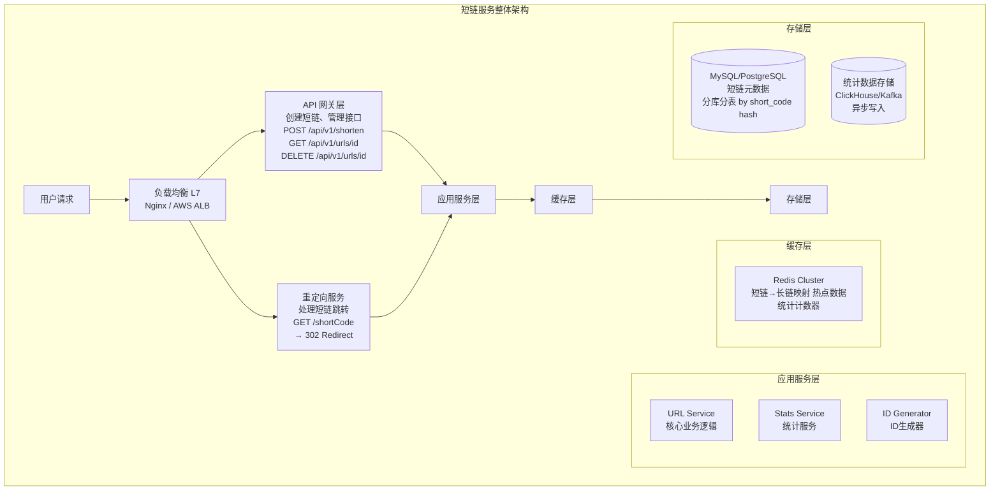
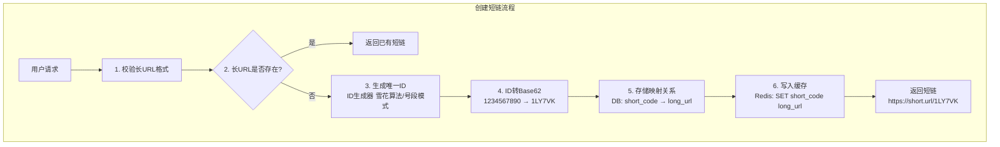
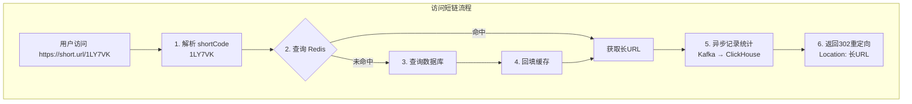
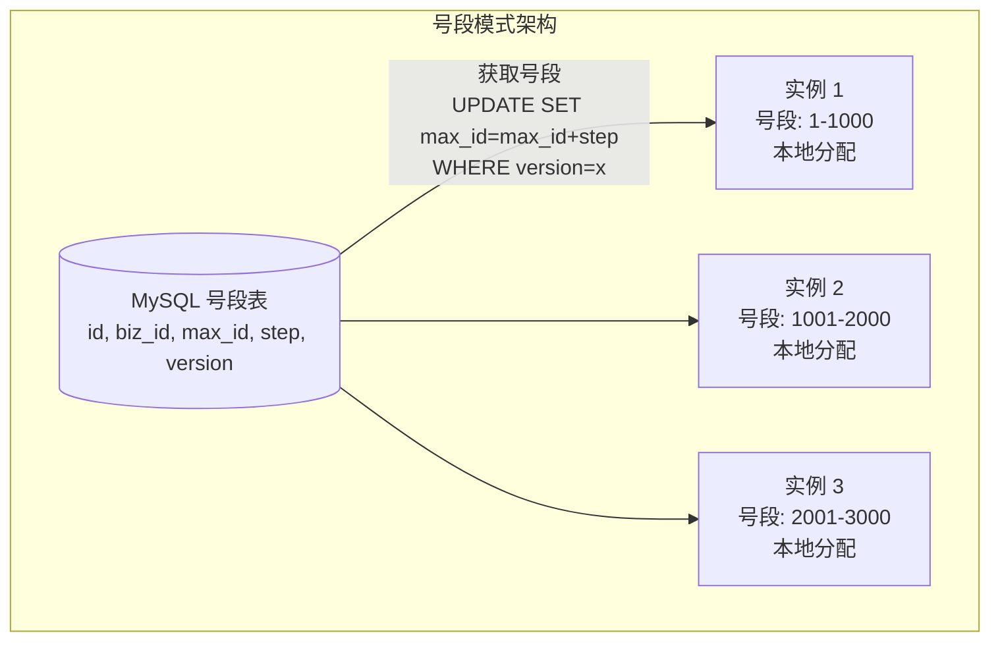
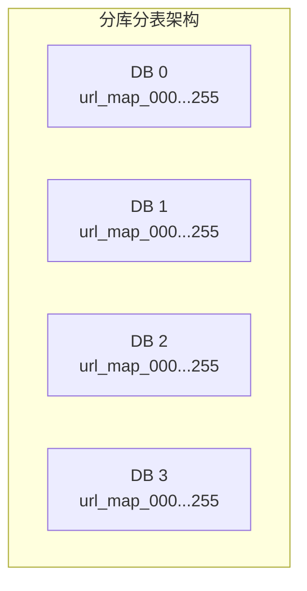
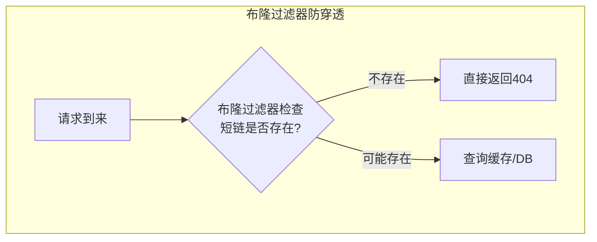
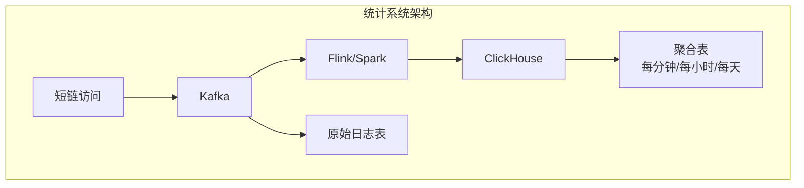
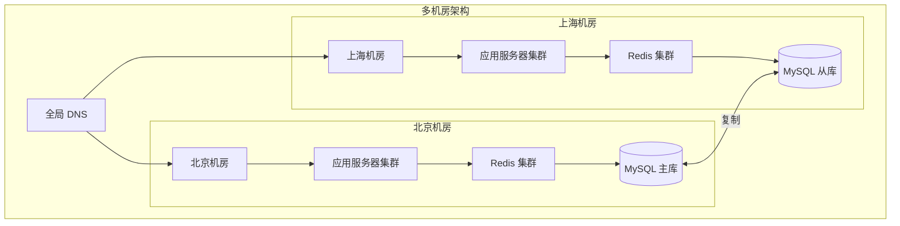

+++
title = "短链服务设计 (URL Shortener)"
date = 2026-01-28
weight = 9000
description = "系统设计面试真题：短链服务完整设计，包含架构图、ID生成、存储方案、缓存策略、高可用设计"
[taxonomies]
tags = ["系统设计", "面试", "短链", "分布式ID", "缓存"]
+++

# 短链服务设计 (URL Shortener)

> **面试频率**：⭐⭐⭐⭐⭐（必考题）
> **难度**：中等
> **考察重点**：ID生成、哈希冲突、缓存策略、高并发读

---

## 一、需求分析

### 1.1 功能需求

| 功能 | 描述 | 优先级 |
|------|------|--------|
| **创建短链** | 输入长URL，返回短链 | P0 |
| **跳转访问** | 访问短链，302重定向到长URL | P0 |
| 自定义短链 | 用户指定短链后缀 | P1 |
| 过期时间 | 短链可设置有效期 | P1 |
| **访问统计** | 点击次数、地域、设备等 | P1 |
| 链接管理 | 查看、删除已创建的短链 | P2 |

### 1.2 非功能需求

**规模估算（典型面试场景）：**

| 指标 | 数值 |
|------|------|
| DAU | 1亿 |
| 每用户每天创建短链 | 0.1 条 |
| 每天创建 | 1000万条 |
| 读写比例 | 100:1 (读多写少) |
| 写 QPS | 1000万 / 86400 ≈ 115 |
| 峰值写 QPS | 115 × 3 ≈ 350 |
| 读 QPS | 115 × 100 = 11,500 |
| 峰值读 QPS | 11,500 × 3 ≈ 35,000 |
| 存储 (5年) | 每条记录约600B，总量约11TB |

### 1.3 约束与假设

- 短链长度：尽量短（7位 Base62 可支持 62^7 ≈ 3.5万亿）
- 延迟要求：读 < 100ms，写 < 500ms
- 可用性：99.9%
- 短链不可变：创建后不能修改

---

## 二、系统架构

### 2.1 高层架构



### 2.2 核心流程

**创建短链流程**：



**访问短链流程**：



---

## 三、核心设计

### 3.1 短链生成算法

**方案对比**：

| 方案 | 原理 | 优点 | 缺点 |
|------|------|------|------|
| **Hash截取** | MD5/SHA256 取前N位 | 简单 | 冲突概率高，需处理 |
| **自增ID+Base62** | 数据库自增ID转换 | 无冲突，有序 | 单点瓶颈 |
| **雪花算法+Base62** | 分布式ID生成 | 高性能，无冲突 | ID较长 |
| **预生成+号段** | 预先生成ID池 | 高性能，可控 | 需要维护ID池 |

**推荐方案：号段模式 + Base62**



| id | biz_id | max_id | step | version |
|----|--------|--------|------|---------|
| 1 | url | 1000000 | 1000 | 5 |

**优点**：
1. 数据库压力小（每次获取一批ID）
2. 本地分配，高性能
3. ID有序，利于索引

**Base62 编码**：

```
字符集: 0-9, a-z, A-Z (共62个字符)

转换示例:
  ID: 1234567890
  
  1234567890 ÷ 62 = 19912062 ... 余 46 → 'K'
  19912062   ÷ 62 = 321162   ... 余 18 → 'i'
  321162     ÷ 62 = 5180     ... 余 42 → 'G'
  5180       ÷ 62 = 83       ... 余 34 → 'Y'
  83         ÷ 62 = 1        ... 余 21 → 'l'
  1          ÷ 62 = 0        ... 余 1  → '1'
  
  结果: "1lYGiK" (6位)

容量计算:
  6位 Base62 = 62^6 = 568亿
  7位 Base62 = 62^7 = 3.5万亿
```

**代码实现**：

```go
const base62Chars = "0123456789abcdefghijklmnopqrstuvwxyzABCDEFGHIJKLMNOPQRSTUVWXYZ"

func encodeBase62(id int64) string {
    if id == 0 {
        return "0"
    }
    
    var result []byte
    for id > 0 {
        result = append([]byte{base62Chars[id%62]}, result...)
        id /= 62
    }
    return string(result)
}

func decodeBase62(s string) int64 {
    var id int64
    for _, c := range s {
        id = id*62 + int64(strings.IndexRune(base62Chars, c))
    }
    return id
}
```

### 3.2 数据库设计

**主表结构**：

```sql
CREATE TABLE url_mapping (
    id              BIGINT PRIMARY KEY,
    short_code      VARCHAR(10) NOT NULL,
    long_url        VARCHAR(2048) NOT NULL,
    user_id         BIGINT DEFAULT NULL,
    created_at      TIMESTAMP DEFAULT CURRENT_TIMESTAMP,
    expires_at      TIMESTAMP DEFAULT NULL,
    click_count     BIGINT DEFAULT 0,
    
    UNIQUE KEY idx_short_code (short_code),
    KEY idx_long_url (long_url(100)),   -- 前缀索引
    KEY idx_user_id (user_id),
    KEY idx_expires (expires_at)
) ENGINE=InnoDB DEFAULT CHARSET=utf8mb4;
```

**分库分表策略**：

**分库分表设计**：

| 配置项 | 值 |
|--------|-----|
| 分片键 | short_code (hash) |
| 分库数 | 4 |
| 每库分表 | 256 |
| 总分片 | 1024 |
| 单表容量 | 11TB / 1024 ≈ 10GB (合理) |

**路由算法**：
- `db_index = hash(short_code) % 4`
- `table_index = hash(short_code) % 256`



### 3.3 缓存设计

**缓存策略**：

**缓存设计 (Cache-Aside 模式)**：

| 操作 | 流程 |
|------|------|
| 读流程 | 1. 查 Redis → 2. 未命中 → 查 DB → 写 Redis |
| 写流程 | 1. 写 DB → 2. 删除 Redis (或设置较短TTL) |

**Redis 数据结构**：
- Key: `s:{short_code}`
- Value: `{long_url}`
- TTL: 24小时 (热点数据自动续期)
- 示例: `SET s:1LY7VK "https://example.com/very/long/url" EX 86400`

**缓存预热**：
- 新创建的短链直接写入缓存
- 定时任务预热历史热点短链

**防穿透**：
- 不存在的短链缓存空值 (TTL 5分钟)
- 或使用布隆过滤器

**布隆过滤器防穿透**：



**布隆过滤器参数设计**：

| 参数 | 值 |
|------|-----|
| 预期元素数 | 100亿 |
| 误判率 | 0.1% |
| 所需内存 | ~12GB |
| 哈希函数数 | 7 |

### 3.4 统计系统



**原始日志表字段**：short_code, timestamp, user_agent, ip, referer, country

**实时计数 (Redis)**：
```
INCR click:{short_code}           # 总点击
INCR click:{short_code}:{date}    # 每日点击
PFADD uv:{short_code}:{date} {ip} # 每日UV (HyperLogLog)
```

---

## 四、API 设计

### 4.1 接口定义

```yaml
# 创建短链
POST /api/v1/shorten
Request:
  {
    "long_url": "https://example.com/very/long/url/path?query=value",
    "custom_code": "mylink",      # 可选，自定义短链
    "expires_at": "2026-12-31"    # 可选，过期时间
  }
Response:
  {
    "code": 0,
    "data": {
      "short_url": "https://short.url/1LY7VK",
      "short_code": "1LY7VK",
      "long_url": "https://example.com/...",
      "created_at": "2026-01-28T10:00:00Z",
      "expires_at": null
    }
  }

# 短链跳转
GET /{short_code}
Response:
  HTTP/1.1 302 Found
  Location: https://example.com/very/long/url/path?query=value

# 获取短链信息
GET /api/v1/urls/{short_code}
Response:
  {
    "code": 0,
    "data": {
      "short_code": "1LY7VK",
      "long_url": "https://example.com/...",
      "created_at": "2026-01-28T10:00:00Z",
      "click_count": 12345,
      "last_clicked_at": "2026-01-28T15:30:00Z"
    }
  }

# 获取统计信息
GET /api/v1/urls/{short_code}/stats
Response:
  {
    "code": 0,
    "data": {
      "total_clicks": 12345,
      "unique_visitors": 8901,
      "daily_stats": [
        {"date": "2026-01-27", "clicks": 1234, "uv": 890},
        {"date": "2026-01-28", "clicks": 567, "uv": 345}
      ],
      "top_countries": [
        {"country": "CN", "clicks": 8000},
        {"country": "US", "clicks": 2000}
      ]
    }
  }
```

### 4.2 301 vs 302

| 状态码 | 含义 | 缓存 | 适用场景 |
|--------|------|------|----------|
| **301** | 永久重定向 | 浏览器缓存 | URL永久变更 |
| **302** | 临时重定向 | 不缓存 | 短链服务（需要统计） |

**推荐使用 302**：
- 每次访问都经过服务器，可以统计点击
- 可以动态修改目标URL
- 可以处理过期短链

---

## 五、高可用设计

### 5.1 多机房部署



**策略**：
- 读: 就近读取 (本地 Redis → 本地 DB从库)
- 写: 路由到主库所在机房
- 短链生成: 每个机房独立号段，避免冲突

### 5.2 故障处理

| 故障类型 | 影响 | 应对措施 |
|----------|------|----------|
| Redis 节点故障 | 缓存未命中增加 | Redis Cluster 自动故障转移 |
| MySQL 从库故障 | 读请求压力转移 | 流量切到其他从库 |
| MySQL 主库故障 | 写入失败 | 从库提升为主库 |
| 整个机房故障 | 该机房不可用 | DNS 切换到其他机房 |

---

## 六、面试问答

### Q1: 如何处理短链冲突？

```
方案1: 使用全局唯一ID (推荐)
- 号段模式/雪花算法生成ID，转Base62
- 天然无冲突

方案2: Hash + 冲突检测
- 对长URL进行Hash，取前N位
- 检查是否已存在，冲突则追加随机字符
- 需要多次数据库查询

方案3: 预生成短链池
- 提前生成一批未使用的短链
- 创建时直接分配
- 需要维护未使用/已使用状态
```

### Q2: 如何防止恶意刷短链？

```
1. 限流
   - 单用户限制: 100个/天
   - 单IP限制: 1000个/天
   - 全局限制: 配合验证码

2. URL校验
   - 格式校验
   - 黑名单域名
   - 恶意网站检测 (第三方API)

3. 去重
   - 相同长URL返回相同短链
   - 节省存储，防止重复创建
```

### Q3: 短链过期如何处理？

```
方案1: 惰性删除
- 访问时检查是否过期
- 过期返回404
- 定时任务清理过期数据

方案2: 定时清理
- 定时任务扫描 expires_at < now
- 批量删除过期记录

方案3: 软删除
- 过期后标记为已删除
- 保留统计数据
- 定期归档清理
```

### Q4: 如何支持10倍流量增长？

```
读:
- 增加 Redis 节点
- 增加应用服务器
- CDN 缓存热点短链

写:
- 增加号段生成器实例
- 数据库分库数量增加
- 使用消息队列缓冲写入

数据:
- 冷热分离 (热数据SSD，冷数据HDD)
- 历史数据归档
```

---

## 七、总结

| 组件 | 技术选型 | 说明 |
|------|----------|------|
| ID 生成 | 号段模式 + Base62 | 高性能、有序、无冲突 |
| 存储 | MySQL 分库分表 | 可扩展、事务支持 |
| 缓存 | Redis Cluster | 高性能读取 |
| 统计 | Kafka + ClickHouse | 异步、高性能分析 |
| 防穿透 | 布隆过滤器 | 内存效率高 |

**核心权衡**：
- 短链长度 vs 容量（7位足够100年）
- 一致性 vs 性能（最终一致性满足需求）
- 302 vs 301（需要统计则用302）

---

## 相关文章

- [系统设计面试指南](@/articles/system-design/sd-08-系统设计面试指南.md)
- [分布式系统设计](@/articles/system-design/sd-04-分布式系统设计.md)
- [缓存设计详解](@/articles/system-design/sd-05-缓存设计详解.md)
