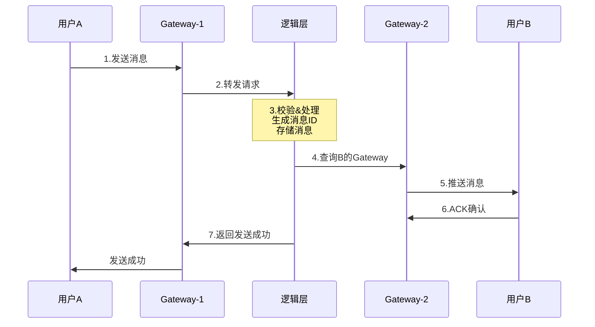

+++
title = "10.即时通讯系统设计 (IM/Chat)"
date = 2026-01-28
description = "系统设计面试真题：即时通讯系统完整设计，包含长连接、消息投递、已读回执、群聊、离线消息"
[taxonomies]
tags = ["系统设计", "面试", "即时通讯", "WebSocket", "消息队列"]
+++

# 即时通讯系统设计 (IM/Chat)

> **面试频率**：⭐⭐⭐⭐⭐（必考题）
> **难度**：中高
> **考察重点**：长连接、消息可靠投递、在线状态、群聊扩散

---

## 一、需求分析

### 1.1 功能需求

| 功能 | 描述 | 优先级 |
|------|------|--------|
| **单聊** | 一对一消息发送 | P0 |
| **群聊** | 多人群组消息 | P0 |
| **在线状态** | 显示用户是否在线 | P0 |
| **已读回执** | 显示消息是否已读 | P1 |
| **离线消息** | 离线期间消息不丢失 | P0 |
| 消息撤回 | 撤回已发送消息 | P1 |
| 历史消息 | 查看历史聊天记录 | P1 |
| **消息类型** | 文字、图片、语音、视频 | P1 |
| 消息搜索 | 搜索聊天记录 | P2 |

### 1.2 非功能需求

```
┌─────────────────────────────────────────────────────────────────┐
│  规模估算                                                        │
├─────────────────────────────────────────────────────────────────┤
│  DAU: 5000万                                                    │
│  同时在线: 500万 (10%)                                           │
│                                                                 │
│  每用户每天发送消息: 40条                                         │
│  每天消息量: 5000万 × 40 = 20亿条                                │
│                                                                 │
│  消息 QPS: 20亿 / 86400 ≈ 23,000                                │
│  峰值 QPS: 23,000 × 3 ≈ 70,000                                  │
│                                                                 │
│  长连接数: 500万                                                 │
│  每台服务器: 10万连接                                             │
│  需要: 50+ 台连接服务器                                           │
│                                                                 │
│  消息存储 (1年):                                                  │
│    每条消息: 1KB (含元数据)                                       │
│    总量: 1KB × 20亿 × 365 ≈ 730TB                               │
│                                                                 │
└─────────────────────────────────────────────────────────────────┘
```

### 1.3 核心挑战

| 挑战 | 说明 |
|------|------|
| **海量长连接** | 500万同时在线，连接状态管理 |
| **消息可靠投递** | 不丢消息、不重复、有序 |
| **在线状态同步** | 实时感知好友上下线 |
| **群聊消息扩散** | 万人群消息如何投递 |
| **多端同步** | PC、手机、Pad 消息一致 |

---

## 二、系统架构

### 2.1 高层架构

```
                              即时通讯系统整体架构

    ┌─────────────────────────────────────────────────────────────────────┐
    │                            客户端                                    │
    │         App / Web / Desktop (WebSocket/TCP 长连接)                   │
    └───────────────────────────────────┬─────────────────────────────────┘
                                        │
                                        ▼
    ┌─────────────────────────────────────────────────────────────────────┐
    │                         接入层 (Gateway)                             │
    │                                                                     │
    │   ┌─────────────┐   ┌─────────────┐   ┌─────────────┐              │
    │   │  Gateway 1  │   │  Gateway 2  │   │  Gateway N  │   ...        │
    │   │  (10万连接)  │   │  (10万连接)  │   │  (10万连接)  │              │
    │   └──────┬──────┘   └──────┬──────┘   └──────┬──────┘              │
    │          │                 │                 │                      │
    │          └─────────────────┼─────────────────┘                      │
    │                            │                                        │
    │   职责: 长连接维护、心跳、协议解析、连接路由                           │
    └────────────────────────────┼────────────────────────────────────────┘
                                 │
                                 ▼
    ┌─────────────────────────────────────────────────────────────────────┐
    │                          逻辑层                                      │
    │                                                                     │
    │   ┌──────────────┐  ┌──────────────┐  ┌──────────────┐             │
    │   │ 消息服务      │  │ 用户服务      │  │ 群组服务      │             │
    │   │              │  │              │  │              │             │
    │   │ - 消息处理    │  │ - 在线状态    │  │ - 群成员管理  │             │
    │   │ - 消息存储    │  │ - 好友关系    │  │ - 群消息扩散  │             │
    │   │ - 消息同步    │  │ - 用户信息    │  │              │             │
    │   └──────┬───────┘  └──────┬───────┘  └──────┬───────┘             │
    │          │                 │                 │                      │
    └──────────┼─────────────────┼─────────────────┼──────────────────────┘
               │                 │                 │
               ▼                 ▼                 ▼
    ┌─────────────────────────────────────────────────────────────────────┐
    │                          中间件层                                    │
    │                                                                     │
    │   ┌──────────────┐  ┌──────────────┐  ┌──────────────┐             │
    │   │ Redis Cluster│  │    Kafka     │  │   RocketMQ   │             │
    │   │              │  │              │  │              │             │
    │   │ - 在线状态    │  │ - 消息队列   │  │ - 可靠投递   │             │
    │   │ - 会话缓存    │  │ - 异步处理   │  │              │             │
    │   │ - 连接路由    │  │              │  │              │             │
    │   └──────────────┘  └──────────────┘  └──────────────┘             │
    │                                                                     │
    └─────────────────────────────────────────────────────────────────────┘
               │
               ▼
    ┌─────────────────────────────────────────────────────────────────────┐
    │                          存储层                                      │
    │                                                                     │
    │   ┌──────────────┐  ┌──────────────┐  ┌──────────────┐             │
    │   │    MySQL     │  │   MongoDB    │  │     OSS      │             │
    │   │              │  │              │  │              │             │
    │   │ - 用户信息    │  │ - 消息存储   │  │ - 图片/视频  │             │
    │   │ - 好友关系    │  │ - 历史记录   │  │ - 文件存储   │             │
    │   │ - 群组信息    │  │              │  │              │             │
    │   └──────────────┘  └──────────────┘  └──────────────┘             │
    │                                                                     │
    └─────────────────────────────────────────────────────────────────────┘
```

### 2.2 连接管理

```
┌─────────────────────────────────────────────────────────────────────────┐
│                           连接管理架构                                   │
├─────────────────────────────────────────────────────────────────────────┤
│                                                                         │
│   用户登录建立连接:                                                       │
│                                                                         │
│   用户A ──WebSocket──► Gateway 1                                         │
│         │                  │                                            │
│         │                  ▼                                            │
│         │          ┌──────────────┐                                     │
│         │          │ Redis 登记    │                                     │
│         │          │ user_id →    │                                     │
│         │          │ gateway_id   │                                     │
│         │          └──────────────┘                                     │
│                                                                         │
│   Redis 存储结构:                                                        │
│   ┌─────────────────────────────────────────────────────────────────┐   │
│   │  HSET online:user:{user_id} gateway "gateway-1"                 │   │
│   │  HSET online:user:{user_id} device "mobile"                     │   │
│   │  HSET online:user:{user_id} login_time "1706428800"             │   │
│   │                                                                 │   │
│   │  SADD online:gateway:gateway-1 user_id_1 user_id_2 ...          │   │
│   └─────────────────────────────────────────────────────────────────┘   │
│                                                                         │
│   消息投递路由:                                                          │
│   ┌─────────────────────────────────────────────────────────────────┐   │
│   │  1. 查询 Redis 获取目标用户所在 Gateway                          │   │
│   │  2. 发送消息到对应 Gateway                                       │   │
│   │  3. Gateway 推送给客户端                                         │   │
│   └─────────────────────────────────────────────────────────────────┘   │
│                                                                         │
│   心跳机制:                                                              │
│   ┌─────────────────────────────────────────────────────────────────┐   │
│   │  客户端每 30s 发送心跳                                           │   │
│   │  Gateway 更新 Redis 过期时间                                     │   │
│   │  超时 90s 未收到心跳，判定离线，清理连接                          │   │
│   └─────────────────────────────────────────────────────────────────┘   │
│                                                                         │
└─────────────────────────────────────────────────────────────────────────┘
```

---

## 三、核心设计

### 3.1 消息投递流程

**单聊消息**：



**消息可靠投递（ACK机制）**：

```
┌─────────────────────────────────────────────────────────────────────────┐
│                          消息可靠投递                                    │
├─────────────────────────────────────────────────────────────────────────┤
│                                                                         │
│   三次握手确认:                                                          │
│                                                                         │
│   发送方A            服务器            接收方B                           │
│      │                 │                 │                              │
│      │  1. 发送消息     │                 │                              │
│      │────────────────►│                 │                              │
│      │                 │                 │                              │
│      │  2. 服务器ACK   │                 │                              │
│      │◄────────────────│                 │                              │
│      │   (消息已收到)   │                 │                              │
│      │                 │                 │                              │
│      │                 │  3. 推送消息    │                              │
│      │                 │────────────────►│                              │
│      │                 │                 │                              │
│      │                 │  4. 客户端ACK   │                              │
│      │                 │◄────────────────│                              │
│      │                 │   (消息已接收)   │                              │
│      │                 │                 │                              │
│      │  5. 已读回执     │                 │                              │
│      │◄────────────────│◄────────────────│                              │
│      │                 │   (消息已读)     │                              │
│                                                                         │
│   超时重传:                                                              │
│   ┌─────────────────────────────────────────────────────────────────┐   │
│   │  - 服务器ACK超时(3s): 客户端重发                                 │   │
│   │  - 客户端ACK超时(5s): 服务器重推                                 │   │
│   │  - 客户端需要幂等处理(通过消息ID去重)                             │   │
│   └─────────────────────────────────────────────────────────────────┘   │
│                                                                         │
└─────────────────────────────────────────────────────────────────────────┘
```

### 3.2 群聊消息

**群消息扩散方案对比**：

| 方案 | 原理 | 优点 | 缺点 | 适用场景 |
|------|------|------|------|----------|
| **写扩散** | 消息复制到每个成员的收件箱 | 读取快 | 存储大，写放大 | 小群 |
| **读扩散** | 只存一份，成员主动拉取 | 存储少 | 读取慢，拉放大 | 大群 |
| **混合** | 小群写扩散，大群读扩散 | 平衡 | 实现复杂 | 通用 |

**群消息投递架构**：

```
┌─────────────────────────────────────────────────────────────────────────┐
│                          群消息投递                                      │
├─────────────────────────────────────────────────────────────────────────┤
│                                                                         │
│   小群（<500人）- 写扩散:                                                │
│                                                                         │
│       发送消息                                                          │
│          │                                                              │
│          ▼                                                              │
│   ┌─────────────┐                                                       │
│   │  消息服务    │                                                       │
│   └──────┬──────┘                                                       │
│          │                                                              │
│          ▼                                                              │
│   ┌─────────────┐      ┌────────┐  ┌────────┐  ┌────────┐             │
│   │ 获取群成员列表│ ───► │ 成员1  │  │ 成员2  │  │ 成员N  │             │
│   └─────────────┘      │ 收件箱 │  │ 收件箱 │  │ 收件箱 │             │
│                        └────────┘  └────────┘  └────────┘             │
│                                                                         │
│   大群（>500人）- 读扩散 + 在线推送:                                      │
│                                                                         │
│       发送消息                                                          │
│          │                                                              │
│          ▼                                                              │
│   ┌─────────────┐                                                       │
│   │ 消息存储到群 │  ← 只存一份                                            │
│   │ 消息表      │                                                       │
│   └──────┬──────┘                                                       │
│          │                                                              │
│          ├──────────────────────────────────────┐                       │
│          ▼                                      ▼                       │
│   ┌─────────────┐                        ┌─────────────┐               │
│   │ 推送在线成员 │                        │ 离线成员    │               │
│   │ (实时推送)  │                        │ (上线后拉取) │               │
│   └─────────────┘                        └─────────────┘               │
│                                                                         │
│   万人群优化:                                                            │
│   ┌─────────────────────────────────────────────────────────────────┐   │
│   │  1. 分批推送: 每批1000人，避免瞬时压力                            │   │
│   │  2. 消息聚合: 短时间内多条消息合并推送                             │   │
│   │  3. 消息压缩: 相同消息体只传一次                                   │   │
│   │  4. 优先级队列: 活跃用户优先推送                                   │   │
│   └─────────────────────────────────────────────────────────────────┘   │
│                                                                         │
└─────────────────────────────────────────────────────────────────────────┘
```

### 3.3 在线状态

```
┌─────────────────────────────────────────────────────────────────────────┐
│                          在线状态系统                                    │
├─────────────────────────────────────────────────────────────────────────┤
│                                                                         │
│   状态存储 (Redis):                                                      │
│   ┌─────────────────────────────────────────────────────────────────┐   │
│   │  SET online:{user_id} {timestamp} EX 120                        │   │
│   │  # 120秒过期，心跳续期                                           │   │
│   │                                                                 │   │
│   │  批量查询好友状态:                                               │   │
│   │  MGET online:1001 online:1002 online:1003 ...                   │   │
│   └─────────────────────────────────────────────────────────────────┘   │
│                                                                         │
│   状态变更通知:                                                          │
│                                                                         │
│   用户上线                                                              │
│      │                                                                  │
│      ▼                                                                  │
│   ┌─────────────┐                                                       │
│   │ 获取关注我的 │  ← 谁需要知道我上线了?                                 │
│   │ 好友列表    │                                                       │
│   └──────┬──────┘                                                       │
│          │                                                              │
│          ▼                                                              │
│   ┌─────────────┐                                                       │
│   │ 过滤在线好友 │  ← 只通知在线的好友                                    │
│   └──────┬──────┘                                                       │
│          │                                                              │
│          ▼                                                              │
│   ┌─────────────┐                                                       │
│   │ 推送状态变更 │  ← 通过各自的Gateway推送                               │
│   └─────────────┘                                                       │
│                                                                         │
│   优化:                                                                  │
│   ┌─────────────────────────────────────────────────────────────────┐   │
│   │  1. 延迟通知: 上线后等待3秒再通知(避免快速上下线)                 │   │
│   │  2. 批量通知: 累积一批状态变更一起发送                            │   │
│   │  3. 订阅机制: 只有打开聊天窗口时才订阅对方状态                    │   │
│   └─────────────────────────────────────────────────────────────────┘   │
│                                                                         │
└─────────────────────────────────────────────────────────────────────────┘
```

### 3.4 多端同步

```
┌─────────────────────────────────────────────────────────────────────────┐
│                          多端消息同步                                    │
├─────────────────────────────────────────────────────────────────────────┤
│                                                                         │
│   用户A有3个设备同时在线:                                                │
│                                                                         │
│   ┌───────┐  ┌───────┐  ┌───────┐                                      │
│   │  手机  │  │  iPad │  │  PC   │                                      │
│   └───┬───┘  └───┬───┘  └───┬───┘                                      │
│       │          │          │                                           │
│       │          │          │                                           │
│       ▼          ▼          ▼                                           │
│   ┌─────────────────────────────────────────┐                           │
│   │              Gateway 层                  │                           │
│   │  记录同一用户的多个连接                   │                           │
│   └───────────────────┬─────────────────────┘                           │
│                       │                                                 │
│                       ▼                                                 │
│   ┌─────────────────────────────────────────┐                           │
│   │              Redis                       │                           │
│   │  user:1001:devices = [mobile, ipad, pc] │                           │
│   └─────────────────────────────────────────┘                           │
│                                                                         │
│   同步策略:                                                              │
│   ┌─────────────────────────────────────────────────────────────────┐   │
│   │  1. A的手机发送消息给B                                           │   │
│   │  2. 服务器同时推送给:                                             │   │
│   │     - B的所有设备                                                │   │
│   │     - A的其他设备 (iPad, PC)                                     │   │
│   │  3. 所有设备看到一致的聊天记录                                    │   │
│   └─────────────────────────────────────────────────────────────────┘   │
│                                                                         │
│   Timeline 同步 (增量同步):                                              │
│   ┌─────────────────────────────────────────────────────────────────┐   │
│   │  每条消息有全局递增的 sequence_id                                 │   │
│   │  客户端记录本地最大 sequence_id                                   │   │
│   │  上线时拉取 > 本地sequence_id 的所有消息                          │   │
│   └─────────────────────────────────────────────────────────────────┘   │
│                                                                         │
└─────────────────────────────────────────────────────────────────────────┘
```

---

## 四、数据库设计

### 4.1 消息存储

```sql
-- 单聊消息表 (按接收者ID分库分表)
CREATE TABLE message_inbox_{uid % 1024} (
    id              BIGINT PRIMARY KEY,
    msg_id          BIGINT NOT NULL,           -- 消息唯一ID
    conversation_id VARCHAR(64) NOT NULL,      -- 会话ID
    from_uid        BIGINT NOT NULL,           -- 发送者
    to_uid          BIGINT NOT NULL,           -- 接收者
    msg_type        TINYINT NOT NULL,          -- 1:文字 2:图片 3:语音...
    content         TEXT,                       -- 消息内容
    extra           JSON,                       -- 扩展字段
    send_time       BIGINT NOT NULL,           -- 发送时间戳
    status          TINYINT DEFAULT 0,          -- 0:未读 1:已读 2:撤回
    
    INDEX idx_conversation (conversation_id, send_time),
    INDEX idx_msg_id (msg_id)
) ENGINE=InnoDB;

-- 群消息表 (按群ID分库分表)
CREATE TABLE group_message_{group_id % 256} (
    id              BIGINT PRIMARY KEY,
    msg_id          BIGINT NOT NULL,
    group_id        BIGINT NOT NULL,
    from_uid        BIGINT NOT NULL,
    msg_type        TINYINT NOT NULL,
    content         TEXT,
    extra           JSON,
    send_time       BIGINT NOT NULL,
    
    INDEX idx_group_time (group_id, send_time),
    INDEX idx_msg_id (msg_id)
) ENGINE=InnoDB;

-- 会话表 (最近联系人)
CREATE TABLE conversation (
    id              BIGINT PRIMARY KEY,
    owner_uid       BIGINT NOT NULL,
    target_id       BIGINT NOT NULL,           -- 对方UID或群ID
    conv_type       TINYINT NOT NULL,          -- 1:单聊 2:群聊
    last_msg_id     BIGINT,
    last_msg_time   BIGINT,
    unread_count    INT DEFAULT 0,
    is_top          TINYINT DEFAULT 0,          -- 是否置顶
    is_mute         TINYINT DEFAULT 0,          -- 是否免打扰
    updated_at      BIGINT NOT NULL,
    
    UNIQUE KEY uk_owner_target (owner_uid, target_id, conv_type),
    INDEX idx_owner_time (owner_uid, updated_at DESC)
) ENGINE=InnoDB;
```

### 4.2 消息ID设计

```
┌─────────────────────────────────────────────────────────────────────────┐
│                          消息ID设计                                      │
├─────────────────────────────────────────────────────────────────────────┤
│                                                                         │
│   方案: 雪花算法变体                                                      │
│                                                                         │
│   64位 = 1(符号) + 41(时间戳) + 10(机器ID) + 12(序列号)                   │
│                                                                         │
│   ┌───┬───────────────────────────────────┬─────────┬──────────────┐   │
│   │ 0 │           41位时间戳              │ 10位机器 │  12位序列号   │   │
│   │   │  (毫秒级，可用69年)               │          │  (4096/ms)  │   │
│   └───┴───────────────────────────────────┴─────────┴──────────────┘   │
│                                                                         │
│   特点:                                                                  │
│   1. 时间有序: 可按ID排序获取消息顺序                                     │
│   2. 高性能: 本地生成，无网络开销                                         │
│   3. 分布式: 不同机器生成不同ID                                           │
│   4. 可解析: 从ID可提取时间信息                                           │
│                                                                         │
└─────────────────────────────────────────────────────────────────────────┘
```

---

## 五、协议设计

### 5.1 消息格式

```protobuf
// 消息协议 (Protobuf)
message IMPacket {
    int32 version = 1;
    int32 cmd = 2;           // 命令类型
    int64 seq = 3;           // 客户端序列号
    bytes body = 4;          // 消息体
}

// 命令类型
enum Command {
    HEARTBEAT = 0;
    LOGIN = 1;
    LOGOUT = 2;
    SEND_MSG = 10;
    RECEIVE_MSG = 11;
    MSG_ACK = 12;
    READ_RECEIPT = 13;
    TYPING = 20;
    ONLINE_STATUS = 30;
}

// 聊天消息
message ChatMessage {
    int64 msg_id = 1;
    int64 from_uid = 2;
    int64 to_uid = 3;        // 单聊对方 / 群聊群ID
    int32 conv_type = 4;     // 1:单聊 2:群聊
    int32 msg_type = 5;      // 1:文字 2:图片...
    string content = 6;
    int64 send_time = 7;
    map<string, string> extra = 8;
}

// 消息ACK
message MsgAck {
    int64 msg_id = 1;
    int32 status = 2;        // 0:失败 1:成功
    string error_msg = 3;
}
```

### 5.2 心跳机制

```
┌─────────────────────────────────────────────────────────────────────────┐
│                            心跳机制                                      │
├─────────────────────────────────────────────────────────────────────────┤
│                                                                         │
│   客户端                              服务端                             │
│      │                                  │                               │
│      │  ────── PING (每30秒) ──────►    │                               │
│      │                                  │                               │
│      │  ◄────── PONG ──────────────    │                               │
│      │                                  │                               │
│                                                                         │
│   智能心跳:                                                              │
│   ┌─────────────────────────────────────────────────────────────────┐   │
│   │  1. 有消息交互时，重置心跳计时器                                  │   │
│   │  2. 网络不稳定时，缩短心跳间隔 (15s)                              │   │
│   │  3. 后台运行时，延长心跳间隔 (60s) 或使用Push                     │   │
│   │  4. 心跳失败3次，主动断开重连                                     │   │
│   └─────────────────────────────────────────────────────────────────┘   │
│                                                                         │
│   移动端优化:                                                            │
│   ┌─────────────────────────────────────────────────────────────────┐   │
│   │  iOS: APNs 推送唤醒                                              │   │
│   │  Android: FCM / 厂商推送通道                                     │   │
│   │  保活策略: 前台WebSocket + 后台Push                               │   │
│   └─────────────────────────────────────────────────────────────────┘   │
│                                                                         │
└─────────────────────────────────────────────────────────────────────────┘
```

---

## 六、高可用设计

### 6.1 Gateway 故障转移

```
┌─────────────────────────────────────────────────────────────────────────┐
│                        Gateway 故障处理                                  │
├─────────────────────────────────────────────────────────────────────────┤
│                                                                         │
│   正常状态:                                                              │
│   ┌─────────────┐                                                       │
│   │  Gateway-1  │ ◄── 10万连接                                          │
│   │  (健康)     │                                                       │
│   └─────────────┘                                                       │
│                                                                         │
│   Gateway-1 宕机:                                                        │
│   ┌─────────────┐                                                       │
│   │  Gateway-1  │ ✗                                                     │
│   │  (宕机)     │                                                       │
│   └─────────────┘                                                       │
│          │                                                              │
│          ▼                                                              │
│   ┌─────────────────────────────────────────────────────────────────┐   │
│   │  1. 客户端检测到连接断开                                         │   │
│   │  2. 重连到负载均衡，分配到其他 Gateway                           │   │
│   │  3. 重新登录，同步离线消息                                       │   │
│   │  4. Redis 中旧的连接信息自动过期                                 │   │
│   └─────────────────────────────────────────────────────────────────┘   │
│                                                                         │
│   客户端重连策略:                                                        │
│   ┌─────────────────────────────────────────────────────────────────┐   │
│   │  指数退避: 1s → 2s → 4s → 8s → 16s → 最大30s                    │   │
│   │  随机抖动: 避免所有客户端同时重连                                 │   │
│   │  最大重试: 永不放弃，后台持续重连                                 │   │
│   └─────────────────────────────────────────────────────────────────┘   │
│                                                                         │
└─────────────────────────────────────────────────────────────────────────┘
```

### 6.2 消息不丢失

```
┌─────────────────────────────────────────────────────────────────────────┐
│                        消息不丢失保障                                    │
├─────────────────────────────────────────────────────────────────────────┤
│                                                                         │
│   写入阶段:                                                              │
│   ┌─────────────────────────────────────────────────────────────────┐   │
│   │  1. 消息先写入 MQ (Kafka/RocketMQ)                               │   │
│   │  2. 消费者消费并写入 DB                                          │   │
│   │  3. MQ 确保消息持久化，不会丢失                                   │   │
│   └─────────────────────────────────────────────────────────────────┘   │
│                                                                         │
│   推送阶段:                                                              │
│   ┌─────────────────────────────────────────────────────────────────┐   │
│   │  1. 推送消息到客户端                                             │   │
│   │  2. 等待客户端 ACK                                               │   │
│   │  3. 超时未 ACK，重新推送 (最多3次)                                │   │
│   │  4. 仍然失败，标记为"待推送"，等客户端上线再拉取                  │   │
│   └─────────────────────────────────────────────────────────────────┘   │
│                                                                         │
│   离线消息:                                                              │
│   ┌─────────────────────────────────────────────────────────────────┐   │
│   │  1. 用户离线时，消息存入离线表                                    │   │
│   │  2. 用户上线时，拉取离线消息                                      │   │
│   │  3. 确认收到后，删除离线记录                                      │   │
│   │  4. 离线消息保留期限: 7天                                        │   │
│   └─────────────────────────────────────────────────────────────────┘   │
│                                                                         │
└─────────────────────────────────────────────────────────────────────────┘
```

---

## 七、面试问答

### Q1: 如何保证消息有序？

```
单聊有序:
- 服务端为每个会话维护递增序列号
- 客户端按序列号排序显示
- 乱序到达时等待或提示

群聊有序:
- 群消息使用全局递增ID (消息服务生成)
- 同一个群的消息串行处理
- 客户端按消息ID排序
```

### Q2: 如何处理万人群消息？

```
1. 读扩散: 消息只存一份，成员上线时拉取
2. 分批推送: 每批1000人，分散压力
3. 消息聚合: 短时间多条消息合并
4. 优先级: 活跃用户优先推送
5. 延迟加载: 只加载可见范围的消息
```

### Q3: 如何实现已读回执？

```
单聊:
- 接收方阅读消息后，发送已读通知
- 携带最新已读的消息ID
- 发送方收到后更新UI

群聊:
- 每个成员维护自己的已读位置
- 发送方可查询"已读/未读"人数
- 不实时推送具体谁已读 (性能考虑)
```

### Q4: 离线消息如何同步？

```
Timeline 模式:
1. 每条消息有全局递增的 sequence_id
2. 客户端记录本地最大 sequence_id
3. 上线时: GET /sync?since=12345
4. 服务端返回 > 12345 的所有消息
5. 增量同步，不会遗漏

优化:
- 离线消息过多时分页拉取
- 只拉取摘要，详情按需加载
- 离线超过7天的消息归档处理
```

### Q5: 如何处理消息撤回？

```
1. 发送撤回请求 (2分钟内有效)
2. 服务端标记消息状态为"已撤回"
3. 推送撤回通知给接收方
4. 接收方客户端删除本地消息
5. 显示"对方撤回了一条消息"
```

---

## 八、总结

| 组件 | 技术选型 | 说明 |
|------|----------|------|
| 长连接 | WebSocket / TCP | 实时双向通信 |
| 连接路由 | Redis | 用户→Gateway映射 |
| 消息队列 | Kafka / RocketMQ | 可靠投递、削峰 |
| 消息存储 | MySQL 分库分表 | 持久化存储 |
| 实时计数 | Redis | 未读数、在线状态 |
| 推送 | APNs / FCM | 移动端后台通知 |

**核心权衡**：
- 写扩散 vs 读扩散（根据群大小选择）
- 可靠性 vs 性能（ACK机制的粒度）
- 实时性 vs 省电（心跳频率）

---

## 相关文章

- [系统设计面试指南](/articles/system-design/sd-08-系统设计面试指南/)
- [消息队列设计](/articles/system-design/sd-06-消息队列设计/)
- [高可用架构设计](/articles/system-design/sd-02-高可用架构设计/)
