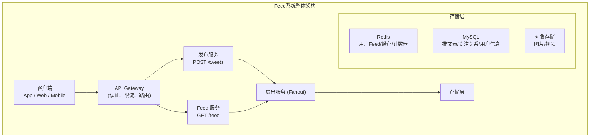
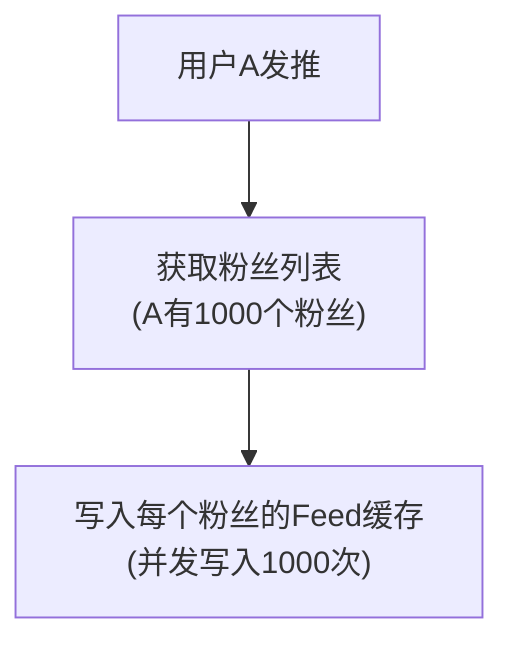
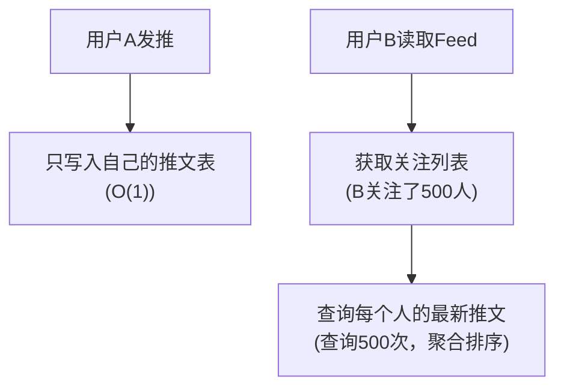
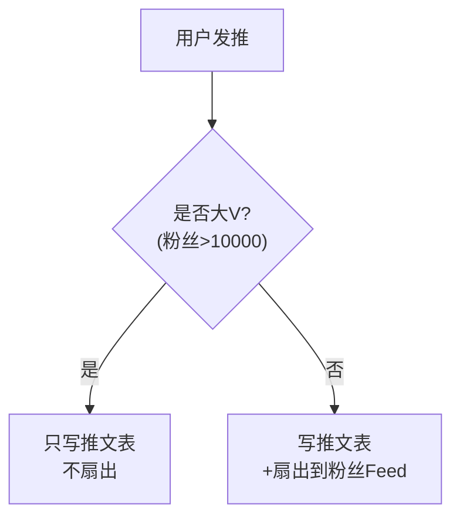
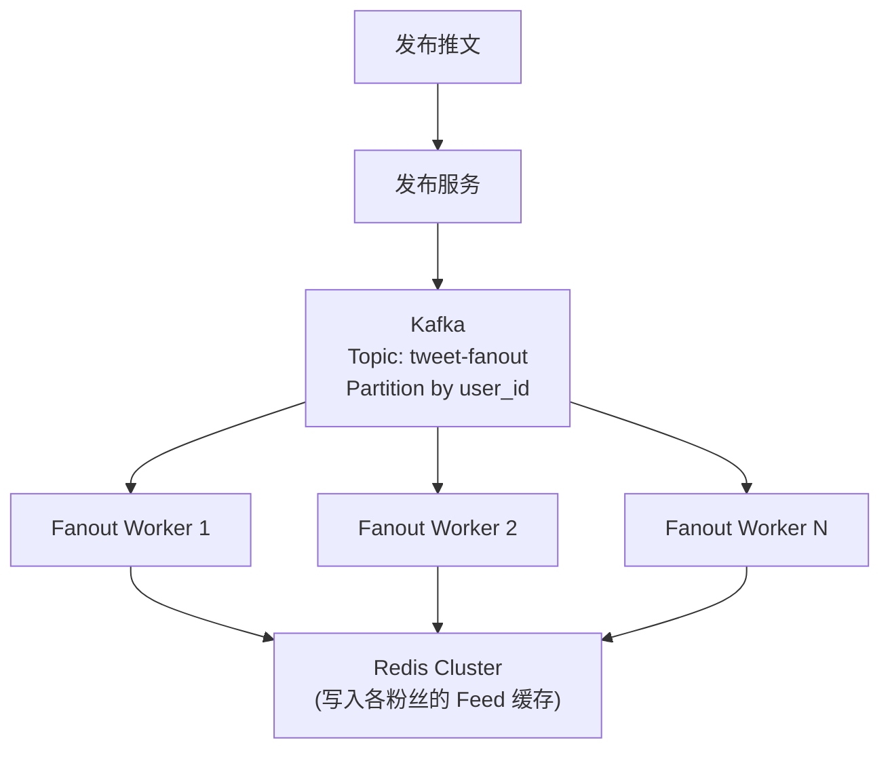
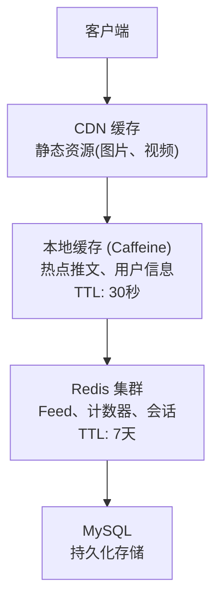

+++
title = "11.新闻Feed系统设计 (Twitter/微博)"
date = 2026-01-28
description = "系统设计面试真题：新闻Feed系统完整设计，包含推拉模式、Feed排序、热点处理、Timeline架构"
[taxonomies]
tags = ["系统设计", "面试", "Feed", "Timeline", "推拉模式"]
+++

# 新闻Feed系统设计 (Twitter/微博)

> **面试频率**：⭐⭐⭐⭐⭐（必考题）
> **难度**：中高
> **考察重点**：推拉模式权衡、Feed排序、大V问题、扇出

---

## 一、需求分析

### 1.1 功能需求

| 功能 | 描述 | 优先级 |
|------|------|--------|
| **发布动态** | 用户发布文字、图片、视频 | P0 |
| **查看Feed** | 查看关注用户的动态流 | P0 |
| **关注/取关** | 管理关注关系 | P0 |
| 点赞/评论 | 互动功能 | P1 |
| 转发 | 转发他人动态 | P1 |
| **热门推荐** | 热门话题、推荐内容 | P1 |
| 搜索 | 搜索用户和内容 | P2 |

### 1.2 非功能需求

**规模估算 (类Twitter)**：

| 指标 | 数值 |
|------|------|
| DAU | 3亿 |
| MAU | 10亿 |

| 发推 | 数值 |
|------|------|
| 每用户每天 | 0.5条 |
| 每天发推 | 3亿 × 0.5 = 1.5亿条 |
| 发推QPS | 1.5亿 / 86400 ≈ 1,700 |
| 峰值 | 5,000 QPS |

| 读Feed | 数值 |
|--------|------|
| 每用户每天刷新 | 10次 |
| 每天读取 | 3亿 × 10 = 30亿次 |
| 读QPS | 30亿 / 86400 ≈ 35,000 |
| 峰值 | 100,000 QPS |

| 关注关系 | 数值 |
|---------|------|
| 平均粉丝数 | 200 |
| 大V粉丝 | 1000万+ |

| 存储 | 数值 |
|------|------|
| 每条推文 | 1KB |
| 每年 | 1KB × 1.5亿 × 365 ≈ 55TB |

### 1.3 核心挑战

| 挑战 | 说明 |
|------|------|
| **大V问题** | 1000万粉丝的用户发推，如何快速触达所有粉丝？ |
| **热点事件** | 突发事件导致读写暴增 |
| **实时性** | 用户期望立即看到新内容 |
| **排序** | 时间线 vs 智能推荐 |

---

## 二、系统架构

### 2.1 高层架构



**扇出服务模式**：

| 模式 | 说明 |
|------|------|
| 推模式 | 发布时写入所有粉丝的 Feed |
| 拉模式 | 读取时聚合关注用户的推文 |
| 混合模式 | 普通用户推，大V拉 |

### 2.2 推模式 vs 拉模式

**推模式 (Push/Fanout on Write)**：



| 读取 | 说明 |
|------|------|
| 粉丝读取 Feed | 直接读缓存，O(1) 读取，速度快 |

| 优点 | 缺点 |
|------|------|
| 读取极快 | 写放大严重 (大V发推要写1000万次) |

**拉模式 (Pull/Fanout on Read)**：



| 优点 | 缺点 |
|------|------|
| 写入快，存储少 | 读取慢 (关注多时查询量大) |

### 2.3 混合模式（推荐方案）

**策略**：

| 用户类型 | 条件 | 模式 |
|---------|------|------|
| 普通用户 | 粉丝数 < 10000 | 推模式 (写入粉丝Feed) |
| 大V | 粉丝数 >= 10000 | 拉模式 (读取时聚合) |

**发推流程**：



**读Feed流程**：

| 步骤 | 操作 |
|------|------|
| 1 | 读取自己的Feed缓存 (包含普通用户推送的内容) |
| 2 | 查询关注的大V的最新推文 |
| 3 | 合并排序 |
| 4 | 返回结果 |

**优化**：大V推文缓存热点，减少查询

---

## 三、核心设计

### 3.1 Feed 存储

**Redis Feed 缓存**：

**数据结构**: Sorted Set

| 元素 | 说明 |
|------|------|
| Key | `feed:{user_id}` |
| Score | `tweet_timestamp` (发布时间) |
| Value | `tweet_id` |

```redis
ZADD feed:1001 1706428800 "tweet_12345"
ZADD feed:1001 1706428900 "tweet_12346"

# 读取最新20条
ZREVRANGE feed:1001 0 19

# 分页 (游标方式)
ZREVRANGEBYSCORE feed:1001 1706428900 -inf LIMIT 0 20
```

**缓存策略**：
- 只缓存最近 800 条 (ZREMRANGEBYRANK 删除旧的)
- TTL: 7天
- 活跃用户预热，不活跃用户延迟加载

### 3.2 扇出服务



**扇出优化**：

| 优化策略 | 说明 |
|---------|------|
| 批量写入 | Pipeline 批量 ZADD |
| 分批扇出 | 每批1000个粉丝，避免瞬时压力 |
| 只扇出活跃粉丝 | 7天内有活动的用户 |
| 异步处理 | 发布立即返回，后台慢慢扇出 |

### 3.3 Feed 排序

**时间线排序 vs 智能排序**：

**方案1: 时间线排序 (Chronological)**

| 特点 | 说明 |
|------|------|
| 排序规则 | 按发布时间倒序，最新的在最前 |
| 优点 | 简单、可预期、用户有掌控感 |
| 缺点 | 可能错过重要内容 |

**方案2: 智能排序 (Ranked/Algorithmic)**

综合多个因素计算得分：
```
Score = w1×Recency + w2×Engagement + w3×Affinity + w4×ContentType + w5×UserInterest
```

| 因素 | 说明 |
|------|------|
| Recency | 时间衰减因子 |
| Engagement | 点赞/评论/转发数 |
| Affinity | 用户与作者的亲密度(互动频率) |
| ContentType | 视频/图片权重 |
| UserInterest | 用户历史兴趣匹配度 |

**混合方案**：
- 默认智能排序，提供"查看最新"切换选项
- 或: 先展示少量高质量内容，然后按时间线

### 3.4 热点处理

**场景**：明星发推 / 突发新闻 → 瞬时流量暴增

**问题**：

| 问题 | 说明 |
|------|------|
| 写压力 | 大V发推需扇出到千万粉丝 |
| 读压力 | 大量用户同时刷新看热点 |
| 缓存 | 热点数据被频繁访问 |

**解决方案**：

| 方案 | 策略 |
|------|------|
| **大V不扇出 (混合模式)** | 大V推文不写入粉丝Feed，读取时实时拉取；大V推文单独缓存，多副本热点缓存 |
| **热点缓存** | 识别热点 (短时间内访问量>阈值)；本地缓存热点推文；多级缓存 (Local Cache → Redis → DB) |
| **限流降级** | 限制单用户刷新频率；热点期间降低扇出优先级；极端情况返回缓存的旧数据 |
| **弹性伸缩** | 监控QPS，自动扩容应用实例；Redis Cluster 增加读副本 |

---

## 四、数据库设计

### 4.1 表结构

```sql
-- 推文表 (按用户ID分库分表)
CREATE TABLE tweet_{user_id % 1024} (
    id              BIGINT PRIMARY KEY,        -- 雪花ID
    user_id         BIGINT NOT NULL,
    content         VARCHAR(280) NOT NULL,
    media_urls      JSON,                      -- 图片/视频URL
    reply_to        BIGINT,                    -- 回复哪条推文
    retweet_of      BIGINT,                    -- 转发哪条推文
    like_count      INT DEFAULT 0,
    reply_count     INT DEFAULT 0,
    retweet_count   INT DEFAULT 0,
    created_at      TIMESTAMP DEFAULT CURRENT_TIMESTAMP,
    
    INDEX idx_user_time (user_id, created_at DESC)
) ENGINE=InnoDB;

-- 关注关系表 (按粉丝ID分库)
CREATE TABLE follow_{follower_id % 256} (
    id              BIGINT PRIMARY KEY,
    follower_id     BIGINT NOT NULL,           -- 粉丝
    followee_id     BIGINT NOT NULL,           -- 被关注者
    created_at      TIMESTAMP DEFAULT CURRENT_TIMESTAMP,
    
    UNIQUE KEY uk_follow (follower_id, followee_id),
    INDEX idx_followee (followee_id)           -- 查询某人的粉丝列表
) ENGINE=InnoDB;

-- 用户表
CREATE TABLE user (
    id              BIGINT PRIMARY KEY,
    username        VARCHAR(50) NOT NULL UNIQUE,
    display_name    VARCHAR(100),
    avatar_url      VARCHAR(255),
    bio             VARCHAR(280),
    follower_count  INT DEFAULT 0,
    following_count INT DEFAULT 0,
    tweet_count     INT DEFAULT 0,
    is_verified     TINYINT DEFAULT 0,         -- 大V标识
    created_at      TIMESTAMP DEFAULT CURRENT_TIMESTAMP
) ENGINE=InnoDB;
```

### 4.2 计数器设计

**问题**：频繁更新计数会导致行锁竞争

**方案**：Redis 计数 + 异步同步

**点赞操作**：

```redis
INCR tweet:12345:like_count
SADD tweet:12345:liked_users user_id
# 异步任务定期同步到 MySQL
```

**大V粉丝数**：

| 策略 | 说明 |
|------|------|
| 精确计数存 Redis | `INCR user:1001:follower_count` |
| DB 存近似值 | 定期同步 |
| 前端显示 | 1234.5万，不需要精确到个位 |

---

## 五、API 设计

```yaml
# 发布推文
POST /api/v1/tweets
Request:
  {
    "content": "Hello World!",
    "media_ids": ["media_123"],
    "reply_to": null
  }
Response:
  {
    "code": 0,
    "data": {
      "id": "1234567890",
      "content": "Hello World!",
      "created_at": "2026-01-28T10:00:00Z"
    }
  }

# 获取首页 Feed
GET /api/v1/feed?cursor={timestamp}&limit=20
Response:
  {
    "code": 0,
    "data": {
      "tweets": [
        {
          "id": "1234567890",
          "user": {"id": "1001", "name": "John", "avatar": "..."},
          "content": "Hello!",
          "media": [...],
          "like_count": 100,
          "reply_count": 10,
          "created_at": "2026-01-28T10:00:00Z",
          "liked_by_me": true
        }
      ],
      "next_cursor": "1706428800"
    }
  }

# 关注用户
POST /api/v1/users/{user_id}/follow
Response:
  {
    "code": 0,
    "data": {"following": true}
  }

# 点赞
POST /api/v1/tweets/{tweet_id}/like
Response:
  {
    "code": 0,
    "data": {"liked": true, "like_count": 101}
  }
```

---

## 六、高可用设计

### 6.1 多级缓存



**缓存命中率目标**：> 99%

---

## 七、面试问答

### Q1: 大V发推如何不影响性能？

```
1. 大V不扇出
   - 粉丝 > 10000 的用户，发推不写入粉丝Feed
   - 粉丝读取时实时拉取大V推文

2. 大V推文缓存
   - 单独缓存大V最近100条推文
   - 多副本热点缓存

3. 异步处理
   - 即使需要扇出，也异步处理
   - 分批扇出，限制速率
```

### Q2: 如何实现"关注的人点赞了"？

```
1. 用户A点赞推文T
2. 查询A的粉丝列表
3. 过滤: 粉丝是否也关注了推文T的作者
4. 满足条件的粉丝，在其Feed中插入:
   "A 赞了 T"

优化:
- 只处理活跃粉丝
- 聚合相似事件 ("A和其他3人赞了")
- 延迟处理，批量推送
```

### Q3: 新用户关注后如何补历史Feed？

```
1. 关注时触发回填任务
2. 拉取被关注者最近20条推文
3. 写入新用户的Feed缓存
4. 后台异步执行，不阻塞关注操作

优化:
- 只回填7天内的内容
- 大V内容不回填，读时拉取
```

### Q4: 如何处理取消关注？

```
方案1: 惰性删除
- 不立即删除Feed中的推文
- 读取时过滤掉已取关用户的内容
- 下次刷新时自然消失

方案2: 主动清理
- 异步任务删除Feed中该用户的推文
- ZREM feed:1001 tweet_xxx
- 可能有延迟
```

### Q5: 如何防止重复内容？

```
1. 发布去重
   - 相同内容 + 相同用户 + 短时间内
   - Hash(content + user_id) 检查

2. 转发去重
   - 显示原始推文，不重复展示转发链

3. Feed去重
   - 客户端按 tweet_id 去重
   - 同一条推文只显示一次
```

---

## 八、总结

| 组件 | 技术选型 | 说明 |
|------|----------|------|
| Feed 存储 | Redis Sorted Set | 按时间排序，快速分页 |
| 扇出 | Kafka + Worker | 异步处理，削峰 |
| 推文存储 | MySQL 分库分表 | 按用户分片 |
| 计数器 | Redis | 高频更新，异步同步 |
| 热点缓存 | 本地 + Redis | 多级缓存 |

**核心权衡**：
- 推模式 vs 拉模式（混合方案平衡）
- 实时性 vs 性能（异步扇出）
- 时间线 vs 智能排序（提供选项）

---

## 相关文章

- [系统设计面试指南](/articles/system-design/sd-08-系统设计面试指南/)
- [高并发系统设计](/articles/system-design/sd-03-高并发系统设计/)
- [缓存设计详解](/articles/system-design/sd-05-缓存设计详解/)
