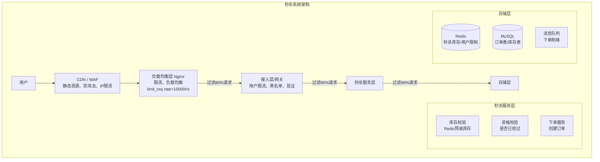
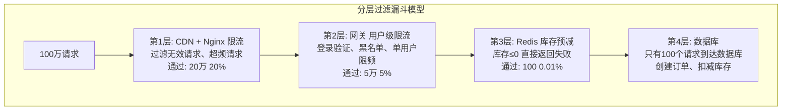
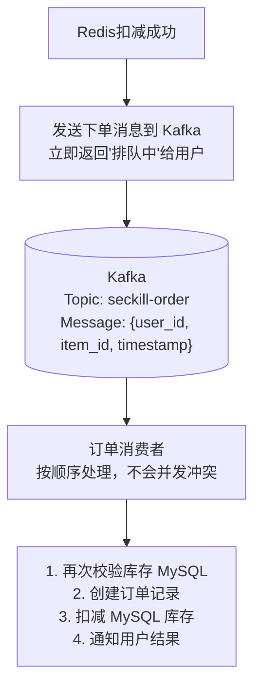
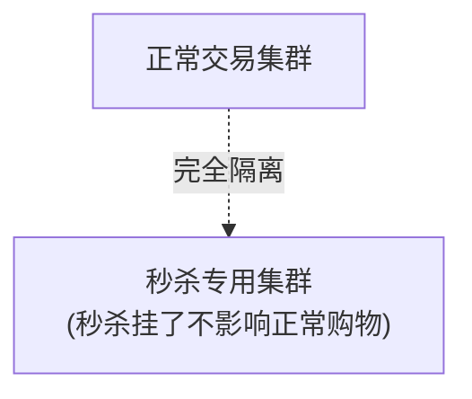

+++
title = "12.秒杀系统设计"
date = 2026-01-28
description = "系统设计面试真题：秒杀系统完整设计，包含流量削峰、库存扣减、防超卖、限流降级、分层过滤"
[taxonomies]
tags = ["系统设计", "面试", "秒杀", "高并发", "电商"]
+++

# 秒杀系统设计

> **面试频率**：⭐⭐⭐⭐⭐（必考题）
> **难度**：高
> **考察重点**：超高并发、防超卖、流量削峰、分布式锁

---

## 一、需求分析

### 1.1 秒杀特点

**秒杀业务特点**：

| 特点 | 说明 |
|------|------|
| **瞬时高并发** | 10:00:00秒杀开始，流量从1000 QPS → 100万 QPS (1000倍增长)，持续几秒到几分钟 |
| **库存有限** | 100万人抢100件商品，成功率0.01%，99.99%的请求注定失败 |
| **核心矛盾** | 读多写少、防超卖（库存扣减必须准确）、公平性（先到先得） |

### 1.2 非功能需求

**规模估算**：

| 指标 | 数值 |
|------|------|
| 商品 | iPhone 限量100台，原价8000元，秒杀价1元 |
| 预估参与 | 500万用户 |
| 请求峰值 | 500万 × 0.2 = 100万/秒 (20%用户第一时间点击) |
| 后续 | 指数衰减 |
| 响应时间 | < 200ms |
| 可用性 | 不能挂，降级也要有响应 |
| 数据一致 | 绝对不能超卖 |

---

## 二、系统架构

### 2.1 整体架构



### 2.2 分层过滤



**核心思想**: 请求越往后越少，每层都过滤掉一批

---

## 三、核心设计

### 3.1 库存扣减方案

**方案对比**：

| 方案 | 原理 | 优点 | 缺点 |
|------|------|------|------|
| **数据库直接扣** | UPDATE SET stock=stock-1 | 简单 | 性能差，锁竞争 |
| **Redis预扣+MQ** | Redis扣减，异步落库 | 高性能 | 需保证一致性 |
| **Redis+Lua原子** | Lua脚本原子操作 | 高性能，防超卖 | 单点瓶颈 |

**推荐方案：Redis Lua 原子扣减**

**Redis Lua 库存扣减**：

```lua
-- KEYS[1]: 库存key  KEYS[2]: 已购用户集合
-- ARGV[1]: 用户ID   ARGV[2]: 商品ID

-- 检查是否已购买
if redis.call('sismember', KEYS[2], ARGV[1]) == 1 then
    return -1  -- 已经抢过了
end

-- 检查库存
local stock = tonumber(redis.call('get', KEYS[1]))
if stock <= 0 then
    return 0  -- 库存不足
end

-- 扣减库存
redis.call('decr', KEYS[1])
-- 记录已购用户
redis.call('sadd', KEYS[2], ARGV[1])

return 1  -- 成功
```

**Redis Key 设计**：

| Key | 值 |
|-----|-----|
| `seckill:stock:{item_id}` | 100（库存数量） |
| `seckill:bought:{item_id}` | SET{user1, user2...} |

**为什么用 Lua**：
1. 原子性：整个脚本作为一个命令执行，不会被打断
2. 减少网络往返：一次请求完成所有操作
3. 避免超卖：检查和扣减是原子的

### 3.2 订单创建

**异步下单流程**：



**用户查询结果**：

```
GET /seckill/result?item_id=xxx

返回:
- WAITING: 排队中
- SUCCESS: 抢购成功，订单号xxx
- FAILED:  抢购失败
```

### 3.3 防超卖保障

**防超卖多重保障**：

| 保障层 | 机制 | 说明 |
|--------|------|------|
| 第1道 | Redis Lua 原子扣减 | 库存扣减和判断是原子操作，不会超卖 |
| 第2道 | MySQL 乐观锁 | `UPDATE stock SET count = count - 1 WHERE item_id = ? AND count > 0`，影响行数 = 0 则失败，回滚 Redis |
| 第3道 | 唯一索引 | 秒杀订单表 `UNIQUE KEY uk_user_item (user_id, item_id)`，同一用户同一商品只能有一条记录 |
| 第4道 | 最终校验 | 定时任务对账：订单数量 vs 库存扣减量 vs Redis记录，不一致则告警人工处理 |

### 3.4 限流策略

**多级限流**：

| 层级 | 限流方式 | 配置/实现 |
|------|---------|-----------|
| 第1层 | Nginx 限流 | `limit_req_zone $binary_remote_addr zone=seckill:10m rate=10r/s;` + `limit_req zone=seckill burst=20 nodelay;` |
| 第2层 | 网关限流（用户级） | Redis + Lua 滑动窗口：每用户1秒1次 |
| 第3层 | 服务限流 | 令牌桶/漏桶算法，Sentinel / Hystrix |

```lua
-- 第2层网关限流示例
local key = "limit:" .. user_id
local count = redis.call('incr', key)
if count == 1 then
    redis.call('expire', key, 1)  -- 1秒窗口
end
if count > 1 then
    return 0  -- 限流
end
```

---

## 四、流量削峰

### 4.1 答题/验证码

**答题削峰**：

| 场景 | 效果 |
|------|------|
| 正常情况 | 10:00:00 秒杀开始 → 100万请求同时到达（瞬时峰值） |
| 加入答题 | 10:00:00 秒杀开始 → 用户答题(2-5秒) → 请求分散到 2-5 秒内（峰值降低5倍） |

**实现方式**：
1. 秒杀开始前，生成随机数学题/滑块验证
2. 用户答对才允许提交
3. 答案有效期10秒，过期需重新获取
4. 答案与用户绑定，不可重用

**额外好处**：防机器人刷单、给服务器喘息时间、用户感知上"公平竞争"

### 4.2 分批放量

**分批放量**：

方案：100件商品分10批次释放

| 时间 | 释放数量 |
|------|---------|
| 10:00:00 | 10 件 |
| 10:00:30 | 10 件 |
| 10:01:00 | 10 件 |
| ... | ... |
| 10:04:30 | 10 件 |

**好处**：
1. 峰值降低 10 倍
2. 更多用户有机会（第一波没抢到还有后续）
3. 系统有恢复时间

**用户体验**："本轮已售罄，下一轮 30 秒后开始"

---

## 五、数据库设计

```sql
-- 秒杀商品表
CREATE TABLE seckill_item (
    id              BIGINT PRIMARY KEY,
    item_name       VARCHAR(200) NOT NULL,
    original_price  DECIMAL(10,2) NOT NULL,
    seckill_price   DECIMAL(10,2) NOT NULL,
    total_stock     INT NOT NULL,
    available_stock INT NOT NULL,
    start_time      DATETIME NOT NULL,
    end_time        DATETIME NOT NULL,
    status          TINYINT DEFAULT 0,  -- 0:未开始 1:进行中 2:已结束
    created_at      TIMESTAMP DEFAULT CURRENT_TIMESTAMP,
    
    INDEX idx_start_time (start_time),
    INDEX idx_status (status)
) ENGINE=InnoDB;

-- 秒杀订单表
CREATE TABLE seckill_order (
    id              BIGINT PRIMARY KEY,
    user_id         BIGINT NOT NULL,
    item_id         BIGINT NOT NULL,
    order_no        VARCHAR(32) NOT NULL,
    seckill_price   DECIMAL(10,2) NOT NULL,
    status          TINYINT DEFAULT 0,  -- 0:待支付 1:已支付 2:已取消
    created_at      TIMESTAMP DEFAULT CURRENT_TIMESTAMP,
    pay_time        TIMESTAMP NULL,
    
    UNIQUE KEY uk_order_no (order_no),
    UNIQUE KEY uk_user_item (user_id, item_id),  -- 防止重复购买
    INDEX idx_user (user_id),
    INDEX idx_item (item_id)
) ENGINE=InnoDB;
```

---

## 六、高可用设计

### 6.1 预热与隔离

**系统预热与隔离**：

**预热**（秒杀开始前 10 分钟）：
1. 加载商品信息到 Redis
2. 预热 JVM（预编译热点代码）
3. 建立数据库连接池
4. CDN 预热静态资源

**隔离**：
1. 独立集群：秒杀服务与正常交易隔离
2. 独立数据库：秒杀库存独立存储
3. 独立Redis：避免影响其他业务
4. 独立域名：`seckill.example.com`



### 6.2 降级方案

**降级策略**：

| 等级 | 触发条件 | 措施 |
|------|----------|------|
| Level 1 | 轻度过载 | 关闭非核心功能（商品详情、评论），返回简化页面 |
| Level 2 | 中度过载 | 随机丢弃部分请求，延长响应（排队机制） |
| Level 3 | 严重过载 | 直接返回"系统繁忙，请稍后再试"，展示静态"已售罄"页面 |
| Level 4 | 系统故障 | 熔断秒杀服务，保护后端系统，事后补偿（发券、延期） |

---

## 七、面试问答

### Q1: 如何防止用户重复抢购？

```
多重保障:
1. Redis SET 记录已购用户
   SADD seckill:bought:{item_id} {user_id}
   每次先 SISMEMBER 检查

2. MySQL 唯一索引
   UNIQUE KEY (user_id, item_id)
   插入重复会报错

3. 前端防重
   点击后按钮置灰，防连点
```

### Q2: Redis挂了怎么办？

```
1. Redis Cluster 高可用
   - 主从复制 + 哨兵
   - 故障自动转移

2. 降级方案
   - Redis 不可用时，直接返回"系统繁忙"
   - 不能降级到 MySQL (会被打死)

3. 数据恢复
   - 从 MySQL 重建 Redis 库存数据
   - 秒杀开始前预热检查
```

### Q3: 如何保证Redis和MySQL数据一致？

```
1. Redis 预扣成功 → MQ → MySQL 扣减
2. MySQL 扣减失败 → Redis 回滚
   INCR seckill:stock:{item_id}

3. 定时对账
   - Redis 库存 + 订单数 = 初始库存
   - 不一致告警

4. 最终一致性
   - 允许短暂不一致
   - 最终以 MySQL 为准
```

### Q4: 如果秒杀还没结束，库存就卖完了？

```
1. Redis 库存 <= 0 时
   - 立即返回"已售罄"
   - 设置标志位，后续请求直接拒绝

2. 内存标志
   - 本地 volatile boolean soldOut = true
   - 无需查 Redis，直接返回

3. 前端同步
   - 库存为0时推送前端
   - 隐藏"立即抢购"按钮
```

### Q5: 黄牛/机器人怎么防？

```
1. 验证码
   - 滑块、图形、短信验证
   - 增加机器成本

2. 行为分析
   - 点击频率异常
   - 请求间隔太规律
   - 设备指纹异常

3. 限制措施
   - 新用户不能参与
   - 限制收货地址数量
   - 账号等级要求

4. 事后追溯
   - 订单审核
   - 异常账号封禁
```

---

## 八、总结

| 组件 | 技术选型 | 说明 |
|------|----------|------|
| 限流 | Nginx + Redis | 多层限流 |
| 库存 | Redis Lua | 原子扣减 |
| 下单 | Kafka | 异步削峰 |
| 存储 | MySQL + 乐观锁 | 防超卖 |
| 降级 | Sentinel | 熔断保护 |

**核心策略**：
1. **分层过滤**：每层过滤99%，到达DB的只有0.01%
2. **异步处理**：下单通过MQ异步，快速响应
3. **预扣库存**：Redis预扣，失败快速返回
4. **多重防护**：Redis+MySQL+唯一索引，防超卖

---

## 相关文章

- [系统设计面试指南](/articles/system-design/sd-08-系统设计面试指南/)
- [高并发系统设计](/articles/system-design/sd-03-高并发系统设计/)
- [分布式限流器设计](/articles/system-design/sd-13-分布式限流器设计/)
