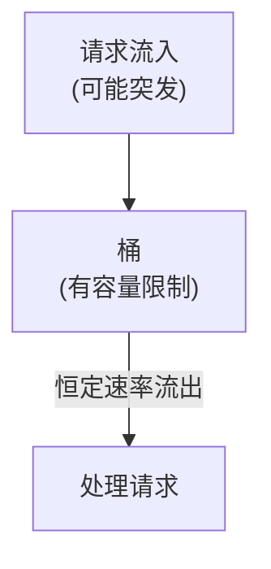
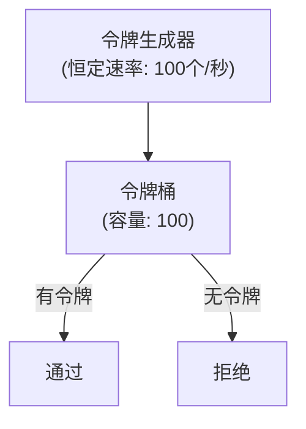
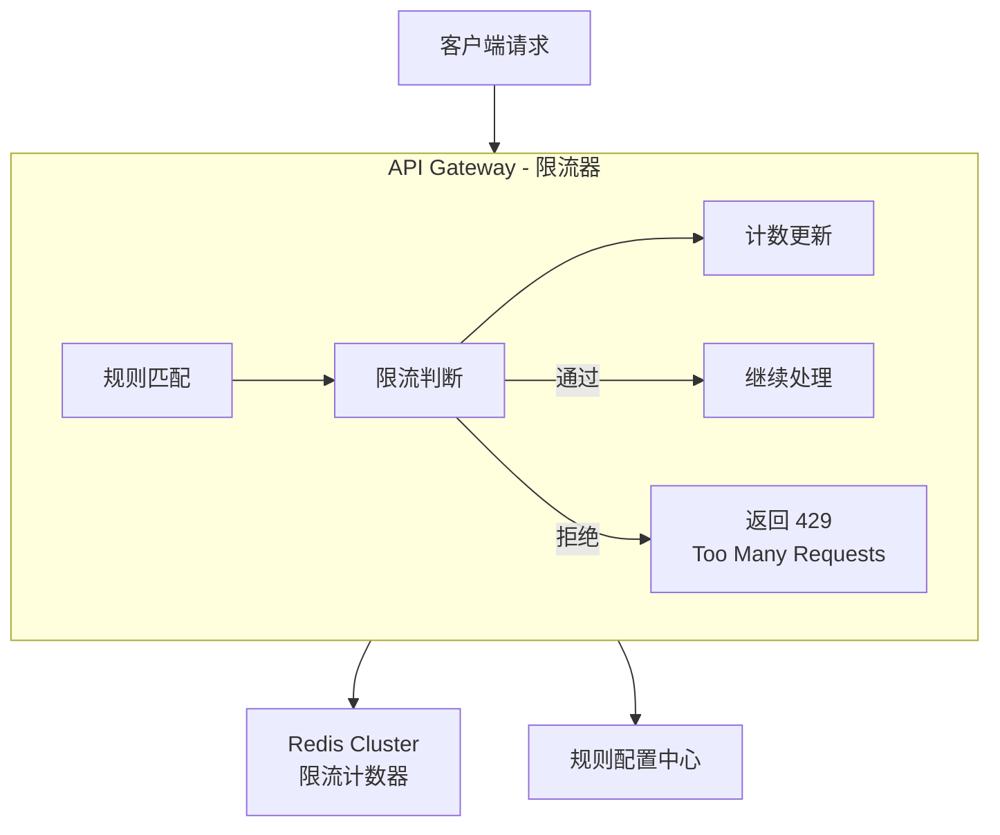
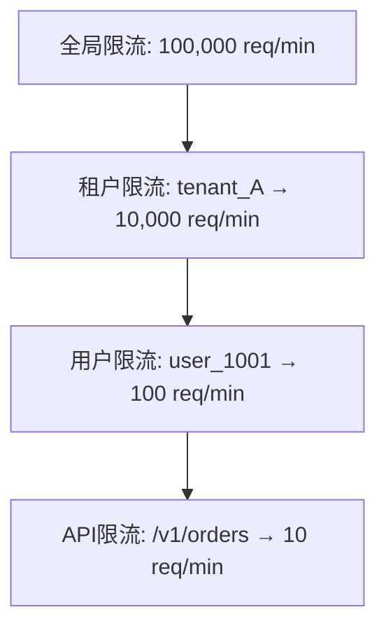
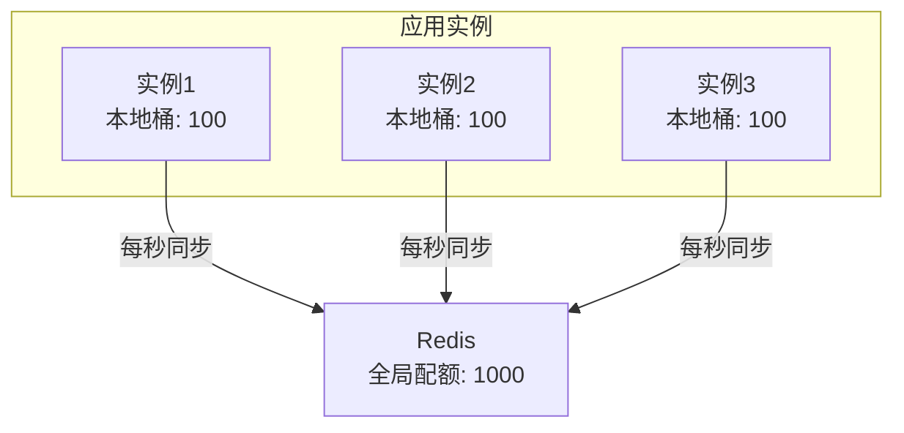
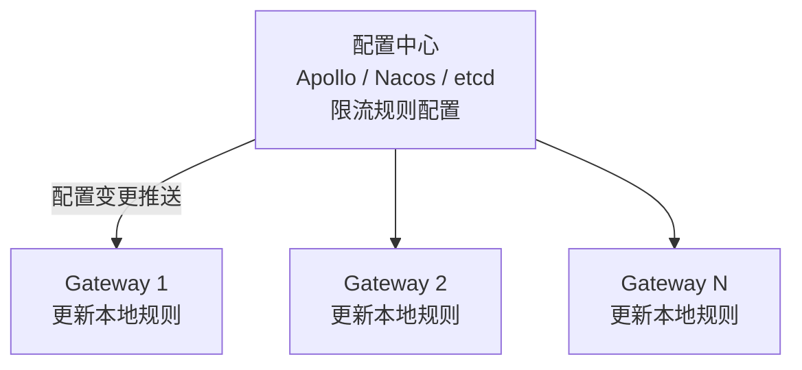

+++
title = "13.分布式限流器设计 (Rate Limiter)"
date = 2026-01-28
description = "系统设计面试真题：分布式限流器完整设计，包含令牌桶、漏桶、滑动窗口、Redis实现、多级限流"
[taxonomies]
tags = ["系统设计", "面试", "限流", "令牌桶", "分布式"]
+++

# 分布式限流器设计 (Rate Limiter)

> **面试频率**：⭐⭐⭐⭐（高频题）
> **难度**：中等
> **考察重点**：限流算法、分布式实现、精度与性能权衡

---

## 一、需求分析

### 1.1 为什么需要限流？

**限流的必要性**：

| 场景 | 问题 | 解决方案 |
|------|------|----------|
| 防止系统过载 | 服务容量10,000 QPS，突发流量50,000 QPS，服务崩溃 | 超出部分快速失败，保护核心服务 |
| 防止恶意攻击 | 爬虫/DDoS 攻击 | 单IP/用户请求频率限制 |
| API 计费/配额 | 免费用户100次/天，付费用户10000次/天 | 按用户等级配置限额 |
| 公平性 | 单个用户占用过多资源 | 防止资源垄断，保证服务质量 |

### 1.2 功能需求

| 功能 | 描述 | 优先级 |
|------|------|--------|
| **限流判断** | 判断请求是否允许通过 | P0 |
| **多维度** | 支持 IP、用户、API 等维度 | P0 |
| **规则配置** | 动态配置限流规则 | P1 |
| **分布式** | 多实例共享计数状态 | P0 |
| 监控告警 | 限流触发时告警 | P1 |
| 弹性阈值 | 根据系统负载动态调整 | P2 |

### 1.3 非功能需求

**性能要求**：

| 指标 | 要求 | 说明 |
|------|------|------|
| 延迟 | < 1ms | 限流判断不能拖慢请求 |
| 吞吐 | 100万+ QPS | 限流器本身不能成为瓶颈 |
| 精度 | 允许 1-5% 误差 | 性能优先 |
| 可用性 | fail-open | 限流器故障时默认放行 |

---

## 二、限流算法

### 2.1 算法对比

| 算法 | 原理 | 优点 | 缺点 | 适用场景 |
|------|------|------|------|----------|
| **固定窗口** | 固定时间窗口计数 | 简单 | 临界问题 | 简单场景 |
| **滑动窗口** | 滑动时间窗口计数 | 平滑 | 复杂度稍高 | 精确控制 |
| **漏桶** | 恒定速率流出 | 平滑输出 | 无法应对突发 | 平滑流量 |
| **令牌桶** | 恒定速率生成令牌 | 允许突发 | 实现复杂 | API限流 |

### 2.2 固定窗口计数器

**固定窗口计数器**：

**原理**：每个固定时间窗口内，计数不超过阈值

| 窗口 | 计数 | 阈值 |
|------|------|------|
| 窗口1（1分钟） | 0→100 | 100 |
| 窗口2（1分钟） | 0→80 | 100 |
| 窗口3（1分钟） | 0→... | 100 |

**临界问题**：窗口1末尾100请求 + 窗口2开头100请求 = 2秒内通过200请求（突破2倍限制）

**Redis 实现**：

```
key = "ratelimit:{user_id}:{minute}"
INCR key
if count == 1: EXPIRE key 60
if count > limit: REJECT
```

### 2.3 滑动窗口

**滑动窗口**：

**原理**：窗口随时间滑动，解决临界问题

**方案1：滑动日志**（精确但耗内存）
- 记录每个请求的时间戳
- 统计时移除窗口外的记录，计算窗口内数量

```
ZADD ratelimit:{user} {timestamp} {request_id}
ZCOUNT ratelimit:{user} {now-60s} {now}
ZREMRANGEBYSCORE ratelimit:{user} 0 {now-60s}
```

缺点：存储每个请求，内存消耗大

**方案2：滑动窗口计数器**（近似但高效）
- 将窗口划分为多个子窗口，计算加权值
- 计算公式：前一窗口计数 × 剩余比例 + 当前窗口计数
- 示例：25 × 0.3 + 15 = 22.5

### 2.4 漏桶算法

**漏桶算法**：

**原理**：请求进入"桶"，以恒定速率流出。桶满则溢出（请求被拒绝）。



**特点**：
1. 输出速率恒定，平滑流量
2. 无法应对突发（即使系统空闲也不能快速处理）
3. 适合对下游保护（如调用第三方API）

**实现**：维护一个队列，生产者入队，消费者恒定速率出队，队列满则拒绝新请求

### 2.5 令牌桶算法

**令牌桶算法**：

**原理**：以恒定速率生成令牌，请求需要获取令牌才能执行



**特点**：
1. 允许突发：桶内有积累的令牌时可以快速处理
2. 平均速率受控：长期看不超过令牌生成速率
3. 更灵活：适合大多数API限流场景

**参数**：

| 参数 | 说明 | 示例 |
|------|------|------|
| rate | 令牌生成速率 | 100个/秒 |
| capacity | 桶容量（最大突发量） | 200 |

示例含义：平均100QPS，允许突发到200

---

## 三、系统架构

### 3.1 整体架构

**分布式限流器架构**：



**Redis 限流计数器示例**：

| Key | 值 |
|-----|-----|
| `ratelimit:user:1001` | {tokens: 85, last_refill: ...} |
| `ratelimit:ip:1.2.3.4` | {count: 50, window_start: ...} |
| `ratelimit:api:/v1/orders` | {count: 8000, ...} |

**限流规则示例**：
- user 维度: 100 req/min
- ip 维度: 1000 req/min
- api 维度: /v1/orders → 10000 req/min
- 组合维度: user + api → 50 req/min

### 3.2 限流维度

**限流维度设计**：

**单维度限流**：

| 维度 | 示例 | 限额 |
|------|------|------|
| 用户维度 | user_id = 1001 | 100 req/min |
| IP维度 | ip = 1.2.3.4 | 1000 req/min |
| API维度 | path = /v1/orders | 10000 req/min |
| 服务维度 | service = order-service | 50000 req/min |

**多维度组合限流**：
- 用户+API: user:1001 + /v1/orders → 10 req/min
- IP+API: ip:1.2.3.4 + /v1/login → 5 req/min
- Key 生成: `ratelimit:user:1001:/v1/orders`

**层级限流**：



任一层触发限流，请求被拒绝

---

## 四、核心实现

### 4.1 令牌桶 Redis Lua 实现

```lua
-- KEYS[1]: 令牌桶 key
-- ARGV[1]: 桶容量 (capacity)
-- ARGV[2]: 填充速率 (tokens per second)
-- ARGV[3]: 当前时间戳 (秒)
-- ARGV[4]: 请求的令牌数

local key = KEYS[1]
local capacity = tonumber(ARGV[1])
local rate = tonumber(ARGV[2])
local now = tonumber(ARGV[3])
local requested = tonumber(ARGV[4])

-- 获取当前状态
local data = redis.call('HMGET', key, 'tokens', 'last_refill')
local tokens = tonumber(data[1])
local last_refill = tonumber(data[2])

-- 初始化
if tokens == nil then
    tokens = capacity
    last_refill = now
end

-- 计算应该补充的令牌数
local elapsed = now - last_refill
local refill = elapsed * rate
tokens = math.min(capacity, tokens + refill)

-- 判断是否有足够令牌
local allowed = tokens >= requested
if allowed then
    tokens = tokens - requested
end

-- 更新状态
redis.call('HMSET', key, 'tokens', tokens, 'last_refill', now)
redis.call('EXPIRE', key, 86400)  -- 24小时过期

if allowed then
    return 1
else
    return 0
end
```

**调用示例**：

```go
func (r *RateLimiter) Allow(key string, capacity, rate int, requested int) bool {
    result, err := r.redis.Eval(
        tokenBucketScript,
        []string{key},
        capacity,
        rate,
        time.Now().Unix(),
        requested,
    ).Int()
    
    if err != nil {
        // 限流器故障，默认放行 (fail-open)
        return true
    }
    return result == 1
}
```

### 4.2 滑动窗口 Redis 实现

```lua
-- KEYS[1]: 限流 key
-- ARGV[1]: 窗口大小 (秒)
-- ARGV[2]: 限制数量
-- ARGV[3]: 当前时间戳 (毫秒)

local key = KEYS[1]
local window = tonumber(ARGV[1]) * 1000  -- 转毫秒
local limit = tonumber(ARGV[2])
local now = tonumber(ARGV[3])

-- 清除窗口外的记录
local window_start = now - window
redis.call('ZREMRANGEBYSCORE', key, 0, window_start)

-- 统计当前窗口内的请求数
local count = redis.call('ZCARD', key)

if count < limit then
    -- 允许请求，添加记录
    redis.call('ZADD', key, now, now .. ':' .. math.random())
    redis.call('EXPIRE', key, ARGV[1] + 1)
    return 1
else
    return 0
end
```

### 4.3 本地+分布式混合限流

**问题**：每次请求都查 Redis，延迟和负载都高

**方案**：本地预扣 + Redis 同步



**流程**：

| 步骤 | 操作 |
|------|------|
| 1 | 本地桶有配额 → 本地扣减，直接放行 (0ms) |
| 2 | 本地桶用完 → 从 Redis 获取新配额 |
| 3 | Redis 配额用完 → 限流 |
| 4 | 定时任务: 每秒向 Redis 申请/归还配额 |

**优势**：
- 99%的请求本地判断，延迟极低
- Redis 压力降低 100 倍
- 允许一定误差 (可接受)

---

## 五、规则配置

### 5.1 规则模型

```yaml
# 限流规则配置
rate_limits:
  # 全局限流
  - name: "global"
    key: "global"
    rate: 100000
    interval: 60s
    burst: 150000
    
  # 用户级限流
  - name: "per_user"
    key: "user:${user_id}"
    rate: 100
    interval: 60s
    burst: 200
    
  # IP级限流
  - name: "per_ip"
    key: "ip:${client_ip}"
    rate: 1000
    interval: 60s
    burst: 1500
    
  # API级限流
  - name: "login_api"
    match:
      path: "/api/v1/login"
      method: "POST"
    key: "ip:${client_ip}:login"
    rate: 5
    interval: 60s
    burst: 10
    
  # VIP用户特殊规则
  - name: "vip_user"
    condition: "${user.level} == 'vip'"
    key: "user:${user_id}"
    rate: 1000
    interval: 60s
```

### 5.2 动态配置

**动态规则更新**：



热更新，无需重启

---

## 六、监控与告警

**监控指标**：

| 指标 | 名称 | 说明 |
|------|------|------|
| 限流触发次数 | `ratelimit_rejected_total` | 被限流的请求数 |
| 限流触发率 | rejected / total | 限流比例 |
| 当前令牌数 | `ratelimit_tokens_remaining` | 剩余令牌 |
| 限流判断延迟 | `ratelimit_latency_ms` | 判断耗时 |

**Prometheus 查询示例**：

```
# 被限流的请求数
ratelimit_rejected_total{rule="per_user", user="1001"}

# 限流判断延迟 P99
histogram_quantile(0.99, rate(ratelimit_latency_bucket[5m]))
```

**告警规则**：
- 限流触发率 > 10%: 可能有攻击或配置不当
- 单用户频繁触发: 可能是恶意用户
- 全局限流触发: 系统容量不足

---

## 七、面试问答

### Q1: 为什么不用本地限流？

```
本地限流问题:
- 每个实例独立计数，无法精确控制全局
- 10个实例，每个限100，实际可能通过1000

适用场景:
- 单机服务
- 精度要求不高
- 作为分布式限流的补充 (第一层过滤)
```

### Q2: Redis 挂了怎么办？

```
1. Fail-open (默认放行)
   - 限流失败时放行请求
   - 保证可用性优先
   
2. 本地缓存兜底
   - 本地维护一个简单计数器
   - Redis 恢复后再同步

3. Redis 高可用
   - Redis Cluster / Sentinel
   - 多机房部署
```

### Q3: 如何处理时钟不同步？

```
问题: 分布式系统中各机器时钟有偏差

方案:
1. 使用 Redis 服务器时间
   - TIME 命令获取 Redis 时间
   - 所有判断基于 Redis 时间

2. 容忍小误差
   - 限流本身允许一定误差
   - 时钟偏差在可接受范围

3. NTP 同步
   - 保证机器时钟偏差 < 1秒
```

### Q4: 如何平滑限流，避免突刺？

```
问题: 窗口开始时瞬间放行大量请求

方案:
1. 令牌桶
   - 恒定速率生成令牌
   - 自然平滑

2. 滑动窗口
   - 窗口随时间滑动
   - 无临界问题

3. 均匀分配
   - 100/秒 → 每10ms放1个
   - 更精细的时间粒度
```

### Q5: 限流和熔断的区别？

```
限流 (Rate Limiting):
- 控制流入速率
- 保护自己
- 超限直接拒绝

熔断 (Circuit Breaking):
- 检测下游故障
- 保护下游
- 故障时快速失败，自动恢复

通常配合使用:
- 限流在入口
- 熔断在出口 (调用下游时)
```

---

## 八、总结

| 算法 | 实现 | 适用场景 |
|------|------|----------|
| 固定窗口 | Redis INCR | 简单场景 |
| 滑动窗口 | Redis ZSET | 精确控制 |
| 令牌桶 | Redis Lua | API限流 (推荐) |
| 漏桶 | 队列 | 平滑输出 |

**设计要点**：
1. **多级限流**：Nginx → 网关 → 服务
2. **多维度**：全局、租户、用户、IP、API
3. **高性能**：本地预扣 + Redis 同步
4. **容错**：限流器故障时 fail-open

---

## 相关文章

- [系统设计面试指南](/articles/system-design/sd-08-系统设计面试指南/)
- [高可用架构设计](/articles/system-design/sd-02-高可用架构设计/)
- [秒杀系统设计](/articles/system-design/sd-12-秒杀系统设计/)
